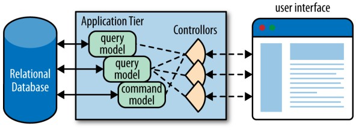

> OO makes code understandable by encapsulating moving parts. FP makes code understandable by minimizing moving parts. 

# Shift of Paradigm

Traditional imperative programming relies on the low-level details of how iteration, transformation and reduction word. However, functional programming thinks about a higher level of abstraction. 

- It encourages you to **categorize problems differently, seeing commonalities**.
- It allows the runtime to be more intelligent about optimization. 
- It allows solutions that aren't possible when the developer is elbow deep in the details of the engine. 

## 1. Higher-order Function

Higher-order functions are a kind of higher-order abstraction., which can eliminate friction. It's actually syntactic sugar plus more.(Yet syntactic sugar is also important because syntax is the way you express your ideas in a language.)

## 2. Common Building Blocks

These common functions are useful in functional languages and frameworks.

### filter 

`filter` functions produce a subset of a collection based on supplied filtering criteria.

**Scala**

- `filter`
- `find`: returns the first matched value which is wrapped in a `Optional`
- `partition`: partitions a collection in two subset based on criteria
- `takewhile`: returns the largest subset of values from the front of the collection that satisfy the prediction 
- `dropwhile`: skips the largest number of elements that satisfy the predicate

### map

`map`functions transform a collection into a new one by suppling a function to each of the elements. The returned collection is the same size as the original collection but with the updated values.

**Scala**

- `map`
- `flatmap`: when you struggle with nested lists, use `flatmap` instead.

### reduce/fold

`fold`functions are used when you need to supply an initial value for the accumulator , whereas`reduce`functions start with nothing. 

**Scala**

- `reduceLeft`/`reduceRight`
- `foldLeft`/`foldRight`

# Cede Low-level Details

One of the values of functional thinking is the ability to cede control of low-level details to the runtime. 

## 1. Iteration to Higher-order Functions

If you can express which operation you want to perform in a higher-order function, the language will apply it efficiently.  

That doesn't mean that developers should cede all responsibility for understanding what happens in low-level abstractions. In many cases, you still must understand the implications of using abstractions like Java 8 Stream. 

## 2. Closures 

A closure is a function that carries an implicit binding to all the variables referenced within it. From an implementation standpoint, the closure instance holds onto an encapsulated copy of whatever is in scope when the closure is created. However, it's a bad idea to create a closure just so that you can manipulate its interior state. Binding constant or immutable values is more common. In this way, you can make the language manage state for you.

Closures are also an excellent way of deferred execution. For example, the correct variables or functions might not be in scope at definition time but are at execution time. By wrapping the execution context in a closure, you can wait until the proper time to execute it. 

```scala
def mulBy(factor: Double) = (x: Double) => x * factor
val triple = mulBy(3)
val double = mulBy(2)
triple(3) // 9
double(2) // 4
```

## 3. Currying and Partial Application 

- Currying describes the conversion of a multiargument function into a chain of single-argument functions. It describes the transformation not the invocation of the converted function. 
- Partial application describes the conversion of a multiargument function into one that accepts fewer arguments, with values for the elided arguments supplied in advance. It partially applies some arguments to a function, returning a function with a signature consisting of the remaining arguments.

For example, the fully curried version of the `process(x, y, z)`function is `process(x)(y)(z)`. Using partial application for a single argument on `process(x, y, z)`yields a function that accept two arguments: `process(y, z)`.

**Scala**

(1) curry

```scala
def modN(N: Int)(x: Int) = ((x % N) == 0)
```

(2) partial application

```scala
def price(product: String) = {
  product match {
    case "apple" => 140
    case "orange" => 223
  }
}

def withTax(cost: Double, state: String) = {
  state match {
    case "NY" => cost * 2
    case "FL" => cost * 3
  }
}

val locallyTaxed = withTax(_, "NY")
val costOfApples = locallyTaxed(price("apple"))
println(costOfApples) // 280.0
```

(3) partial (constrained) functions

The Scala `PartialFunction` trait is designed to work seamlessly with patter matching. You can use it to define a function which works only for a defined subset of values and types.

Partial function are different from partially applied functions. Partial functions have a limited range of allowable values, such as `1/x`.

```scala
val isOdd: PartialFunction[Int, Any] = {
    case x if x % 2 != 0 => x + " is odd."
}
```

A more detailed example:

```scala
    val answerUnit = new PartialFunction[Int, Int] {
      def apply(d: Int): Int = 42 / d

      def isDefinedAt(d: Int): Boolean = d != 0
    }
```

Implementation of the `PartialFunction`trait who use `case`can call `isDefinedAt`which is implicitly defined. 

**Common Uses**

Currying and partial application do have a place in real-world programming. 

(1) Function factories 

```scala
def adder = (x: Int, y: Int) => x + y
def increment = adder.curried(1)
println(s"increment 7: ${increment(7)}") // 8
```

(2) Template Method design pattern

Using partial application to supply known behavior and leaving the other arguments free for implementation specifics mimics the implementation of this OO design pattern.

(3) Implicit values

you can use currying to supply implicit values. For example, when you interact with a persistence framework, you must pass the data source as the first argument. By using partial application, you can supply the value implicitly.

## 4. Recursion 

Many functional languages think of a list as a combination of the first (the head) element plus the remainder of the list (the tail) instead of thinking of a list as indexed slots. Thinking about a list  as head and tail allow us to iterate through it recursively. 

```scala
def recurseList(list: List[Any]): Unit = {
  if (list.isEmpty) {
    return
  }
  println(s"${list.head}")
  recurseList(list.tail)
}

def filterR(list: List[Int], pred: Int => Boolean): List[Int] = {
  if (list.isEmpty) {
    list
  } else if (pred(list.head)) {
    filterR(list.tail, pred).::(list.head)
  } else {
    filterR(list.tail, pred)
  }
}
```

In the imperative way, we must mind the state. In the recursive way, the language manages the return value, building it up on the **stack** as the recursive return for each method invocation. 

Recursion does illustrate an important trend in programming: offloading moving parts by ceding it to the runtime. If I'm never allowed to touch the intermediate results of the list, I cannot introduce bugs in the way that I interact with it. 

## 5. Streams and Work Reordering 

A Stream acts in many ways like a collection, but it has no backing values, and instead uses a stream of values from a source to a destination. Some operation such as `map`and `filter`are lazy, meaning that they defer execution as long as possible. In fact, they don't try to produce results until a downstream terminal "asks" for them. 

For the lazy operations, intelligent runtimes can reorder the result of the operation for us in order to make the program more efficient. Therefore, we don't need to struggle with mundane details and we just focus on the problem domain. 

# Memoization & Laziness

## Memoization

Memoization helps improve the performance of intensive workloads.

Of course we can cache data manually but that means we have to worry about both its correctness and its execution conditions. Functional languages provide memoization as a built-in feature which enables automatic caching recurring function-return values. 

Building a cache by hand is straightforward but it adds statefulness and complexity to the code too. What's more, you can barely be able to create a cache as efficient as the language designers can because they can bend their rules.

**Scala**

Scala doesn't implement memoization directly but has a collection method named `getOrElseUpdate`that handles most of the work of implementing it.

```scala
def memoize[A, B](f: A => B) = new (A => B) {
    val cache = scala.collection.mutable.Map[A, B]()
    def apply(x: A): B = cache.getOrElseUpdate(x, f(x))
}
```

Make sure all memoized functions have no side effects and never rely on outside information.

## Laziness 

Lazy evaluation has several benefits. 

- You can defer expensive calculation until they are absolutely needed. 
- You can create infinite collections. At the same time, you can reduce storage size. 
- Lazy use of functional concepts such as map and filter enable you to generate more efficient code.

**Scala**

In Scala, you can use `view`method of a collection to get a lazy view. 

```scala
def isPalindrome(x: String) = x == x.reverse
def findPalidrome(s: Seq[String]) = s find isPalindrome
findPalidrome(words.view.take(100000))
```

By prepending `lazy`onto the `val`declaration, you can convert fields in Scala from eager to as-needed evaluation.

# Evolution of Languages 

## Few Data Structures, Many Operations 

FP languages prefer a few key data structures with highly optimized operations on those data structures. You pass data structures plus high-order functions to "plug into" this machinery, customizing it for a particular use. 

## Bending the language Toward the Problem

Developers who use malleable languages see the opportunity to bend the language more toward the problem rather than the problem toward their language. 

**Scala**

Scala was designed to accommodate hosting internal DSLs. For instance, use the XML primitives in Scala to parse XML succinctly. 

```scala
val url = "https://samples.openweathermap.org/data/2.5/weather?q=London&mode=xml&appid=b6907d289e10d714a6e88b30761fae22"
val xmlStr = Source.fromURL(new URL(url)).mkString
val xml = XML.loadString(xmlStr)
val city = xml \\ "city" \@ "name"
val temperature = xml \\ "temperature" \@ "value"
println(s"The current temperature of $city is $temperature.")
```

Scala is extended to allow XPath-like queries using the `\\`operator to get a node with its children and using `\@` to get the attributes.

## Rethinking Dispatch 

Scala pattern matching is an example of an alternative dispatch mechanism. 

## Operator Overloading 

A common feature of functional programming languages is operator overloading. Overload operators to bend your language toward an existing problem domain not to create a brand new language. 

**Scala**

Scala allows operator overloading by discarding the distinction between operators and methods: operators are merely methods with special names. Thus, to override the multiplication operator in Scala, you override the `*`method. 

## Functional Data Structures 

 ### 1. Functional Error Handling 

Functional languages prefer to deal with values, preferring to react to return values that indicates an error rather than interrupt program flow. 

### 2. The Either Class

The need to return two distinct values occurs frequently in functional languages, and a common data structures used to model this behavior is the `Either`class. `Either`holds either a left value or right value (but never both), that is, it has slots for two types but holds an instance for only one of them. 

Armed with `Either`, we can write code that returns either an exception or a legitimate result while retaining type safety. We can also wrap exceptions, provide default values etc..

**Scala**

Scala includes an instance of `Either`. For example, you could use `Either[String, Int]` to indicate whether a received input is a `String` or an `Int`.

```scala
import scala.io.StdIn._
val in = readLine("Type Either a string or an Int: ")
val result: Either[String,Int] =
  try Right(in.toInt)
  catch {
    case e: NumberFormatException => Left(in)
  }

result match {
  case Right(x) => s"You passed me the Int: $x, which I will increment. $x + 1 = ${x+1}"
  case Left(x)  => s"You passed me the String: $x"
}
```

`Either` is right-biased, which means that `Right` is assumed to be the default case to operate on. If it is `Left`, operations like `map` and `flatMap` return the `Left` value unchanged.

### 3. The Option Class

`Option`class provides a simpler exception case: either none, indicating no legitimate value, or some, indicating successful return. 

**Scala**

```scala
  def main(args: Array[String]): Unit = {
    getInt match {
      case Some(num) => println(num)
      case None => println("non-positive")
    }
  }

  // Get a positive integer from user input.
  def getInt: Option[Int] = {
    println("Please input a positive integer: ")
    val num = scala.io.StdIn.readInt()
    if (num > 0) {
      Some(num)
    } else {
      None
    }
  }
```

The `Option`class is considered a simpler subset of `Either` which typically holds success or failure.

# Advance of Functional Languages 

> Most modern languages is multiparadigm. Learning to use different paradigm for suitable problems is part of the evolution toward being a better developer. 

## Function-Level Reuse 

OO systems consist of objects that communicate by sending messages to (more specifically, executing methods on) other objects. When discovering a useful collection of classes and their corresponding messages, you extract that graph of classes for reuse.

Functional programming rely on first-class functions as parameter and return values. Using the ability to pass code as a parameter (as to the `filter`method) illustrates thinking about code reuse in a different way. 

### 1. Template Method 

First-class functions make Template Method design pattern simpler to implement because they remove potentially unnecessary structure. Template Method defines the skeleton of an algorithm in a method, deferring some steps to subclasses and forcing them to define those steps without changing the algorithm's structure. 

A traditional Java's implementation may be like this:

```java
interface Customer {
    List<Object> plan;
    
    void checkCredit();
    
    void checkInventory();
    
    void ship();
    
    default void process() {
        checkCredit();
        checkInventory();
        ship();
    }
}
```

The interface requires subclasses to implement the dependent methods. 

A functional solution may be like this:

```scala
class Customer(plan: List[Any], checkCredit: () => Unit, checkInventory: () => Unit, ship: () => Unit) {
  def process(): Unit = {
    checkCredit()
    checkInventory()
    ship()
  }
}
```

The steps in the algorithm are properties of the class, assignable like any other property. The ability of high-order functions allows you to avoid unnecessary boilerplate code in the most common use of classic design patterns. 

Moreover, you can make it safer:

```scala
class Customer(plan: List[Any], checkCredit: () => (), checkInventory: () => (), ship: () => ()) {
  def process(): Unit = {
    if (Some(checkCredit).isDefined) {
      checkCredit
    }
    if (Some(checkInventory).isDefined) {
      checkInventory
    }
    if (Some(ship).isDefined) {
      ship
    }
  }
```

Of course it has too much verbose. In some languages like Groovy, syntactic sugar like `?.`operator allows developers to cede repetitive code.

 ### 2. Strategy 

Strategy defines a family of algorithms, encapsulating each one and making them interchangeable. It lets the algorithm vary independently from clients that use it. First-class functions make it simple to build and manipulate strategies. 

A traditional implementations of the strategy design pattern may be like this:

```java
interface Calc {
    int product(int n, int m);
}

class CalcMult implements Calc {
    @Override 
    int product(int n, int m) {
        return n * m;
    }
}

class CalcAdd implements Calc {
    @Override 
    int product(int n, int m) {
        int result = 0;
        for(int i = 0; i < n; i++) {
            result += m;
        }
        return result;
    }
}
```

Using code blocks as first-class functions, we can reduce much of the ceremony from the previous example. 

```scala
val listOfExp = List(
  (i: Double, j: Double) => Math.pow(i, j),
  (i: Double, j: Double) => List.fill(j.toInt)(i).product
)
listOfExp.foreach(e => {
  println(e(2, 5) == 32)
  println(e(10, 2) == 100)
  println(e(10, 3) == 1000)
})
```

We can just define strategies directly inline, trading formality for convenience though. 

### 3. The Flyweight Design Pattern and Memoization 

This pattern is an optimization technique that sharing to support a large number of fine-grained object references. You keep a pool of objects available, creating references into the pool for particular views. 

Let's say we have a base class called `Computer` and some derived classes. We also have a `AssignedComputer` class which represents the association between a computer and a user. A common way to make code more efficient is combining Factory and Flyweight patterns.

```java
class Computer {
    private String type;
    private String cpu;
    //...
}

class Desktop extends Computer {
    //...
}

class Laptop extends Computer {
    //...
}

class AssignedComputer {
    private String computerType;
    
    private String user;
    
    public AssignedComputer(String computerType, String user) {
        this.computerType = computerType;
        this.user = user;
    }
}

class CompFactory {
    private Map<String, Computer> types = new HashMap<>();
    
    public static instance = null;
    
    private CompFactory() {
        Laptop laptop = new Laptop();
        Desktop desktop = new Desktop();
        types.put("MacBook Pro", laptop);
        types.put("iMac", desktop);
    }
    
    public static CompFactory getInstance() {
        return instance == null? new CompFactory : instance;
    }
    
    public Computer ofType(String computer) {
        return types.get(computer);
    }
}
```

Singleton is a design pattern as well and it serves as a good example of a pattern ceded to the runtime. Saving common information across instances is a good idea too and it's an idea that we want to preserve as we cross into functional programming. Combining these, we can get a different implementation. 

```scala
class Computer(kind: String, cpu: String) {
  //...
}

class Desktop(kind: String, cpu: String, driveBays: String) extends Computer(kind, cpu) {
  //...
}

class Laptop(kind: String, cpu: String, usbPorts: String) extends Computer(kind, cpu) {
  //...
}

class AssignedComputer(computerType: String, user: String) {
  //...
}

// object is singleton
object CompFactory {
  private val types = Map(
    "MacBook Pro" -> new Laptop("laptop", "i9", "3.0"),
    "iMac" -> new Desktop("desktop", "i9", "usb")
  )

  def ofType(computer: String): Computer = {
      // memoization 
    types.getOrElse(computer, new Computer("default", "i9"))
  }
}
```

### 4. Factory and Currying 

In the context of design patterns, currying acts as a factory for functions. 

```scala
val list = (1 to 10).toList
def divideBy(n: Int)(x: Int) = (x % n) == 0
list.filter(divideBy(2))
```

Currying is built into the language or runtime so the concept of a function factory is ingrained and doesn't require extra structure. Using currying to implement a pattern seems dramatic to OO programmers who have never really had portable code and certainly never thought about **constructing specific functions from more general ones**.

 ## Structure VS. Functional Reuse 

### Code Reuse Via Structure 

OO languages reuse code via coupling: tying together two elements (more specifically, classes) via the shared state and method from superclass. In other words, this works by using the built-in coupling rules in the language. 

### Code reuse via composition 

The distinction between coupling and composition is subtle. However, when you end up refactoring a large code base, coupling pops up everywhere because that's one of the reuse mechanism in OO languages. 

# Functional Infrastructure 

## Architecture 

Functional architectures embrace immutability at the core level, leveraging it as much as possible. 

- The more mutable states you have, the more tests you need. If you isolate the places where changes occur by severely restricting mutation, you create a much smaller space for errors to occur and have fewer places to test.
- Immutable objects are automatically thread-safe and have no synchronization issues. Because all initialization occurs at construction time.

**Java**

To make a Java class immutable, you must:

- make all fields final
- make the class final so that it can't be overridden 
- do not provide a no-argument constructor (If you have no state to set, why should you have an object?)
- provide at least one constructor 
- do not provide any mutating methods other than the constructor 

## CORS



In CORS world, one part of the models deal with database updates while other parts handle presentation and reporting. The logic on the query side is typically much simpler because developers can assume immutability; updates go through another mechanism. 

While making some things easier, CORS complicates others. For example, if you have a monolithic database, transactions are easy. In CORS, you will likely need to move on to an eventual consistency model rather than transactional. 


