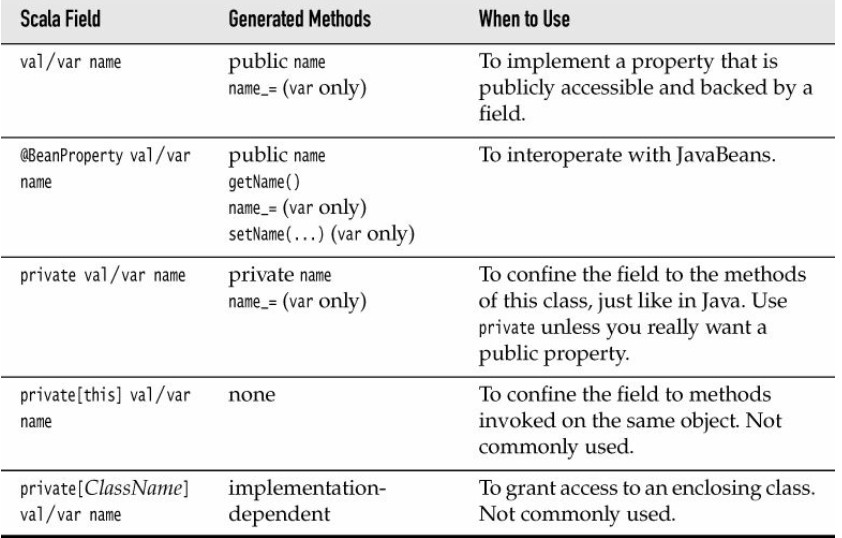
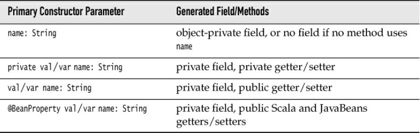
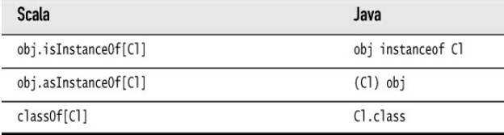
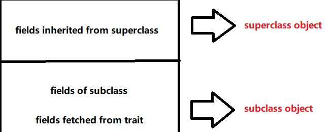
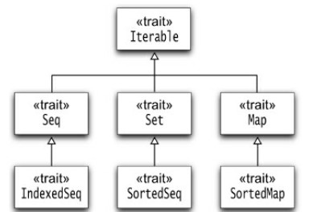

# The Basics

## Declaring Values and Variables

### 1. `val`

A value declared with `val` is **constant**.

```scala
val answer = 8 * 5 + 2
val xmax, ymax = 100 // You can declare multiple values together and you set them the same value.
```

In Scala, you are encouraged to use a `val` unless you really need to change contents. 

### 2. `var`

A variable is declared with `var`.

```scala
var counter = 0
var greeting: String = "hello"
```

Note that you need not to specify the type of a value or variable because it can be inferred from the type of the expression which you initialize it. ==It is an error declare a value or variable without initializing it.==

## Common Uses Types

There is no distinction between primitive types and class types in Scala. Therefore, you can invoke methods on numbers. 

```scala
1.toString()
```

In Scala, use methods instead of cats to convert between numeric types.

```scala
99.44.toInt // you get 99
```

## Arithmetic and Operator Overloading 

All operators are actually methods. `a + b`is a shorthand for `a.+(b)`. Scala allows defining methods with any symbols for names. 

Note Scala doesn't have `++`or`--`operators. Instead, simply use `+=1`or `-=1`. Since the `Int`class is immutable, such a method can not change any integer value. The Scala designers decided it wasn't worth having just another special rule just to save one keyword.

## Calling Methods

### 1. no parentheses

If the method has no parameters, you don't have to use parentheses. 

```scala
"hello".sorted
```

### 2. static methods

Many methods are defined as static methods. You can import the packages and use them.

```scala
import scala.math._ // _ is a wildcard like * in Java
sqrt(2)
```

Or you can just add the package name as a prefix.

```scala
scala.math.sqrt(2)
```

You can omit the `scala`prefix if a package name starts with `scala.`.

### 3. companion object 

Often a class has a companion object whose methods are just like static methods. For example, `BigInt`is a companion object to `scala.math.BigInt`class and has a method `probablePrime`which can generate a random prime with a given number of bits.

## The `apply`Method

```scala
val str = "hello"
str(4) // 'o'
```

You can think of this as an overloaded form of the `()` operator. It is implemented as a method with the name `apply`. That is, `s(4)`is a shorthand for `s.apply(4)`.

## Scaladoc

- Look into `RichInt`, `RichDouble`and so on if you want to know how to work with numeric types. Similarly, to work with strings, look into `StringOps`.
- The mathematical functions are in the package `scala.math`.
- Sometimes, you'll see functions with funny name. 
- Methods can have functions as parameters. 
- You'll occasionally run into classes such as `Range`or`Seq[T]`. In Scala, you use square brackets for type parameters. 
- Some methods have implicit parameters. For example, the `sorted`method of `StringOps`is declared as `def sorted[B >: Char](implicit ord: math.Ordering[B]): String`.

# Control Structures and Functions 

## Conditional Expressions

In Scala, every expression has a type defined by returned values. 

```scala
val s = if (x > 0) -1 else 1
```

If the `else`branch is omitted, it's equivalent to return a `()`:

```scala
if (x > 0) 1 else ()
```

`()`is the *only* value of `Unit`class. Think of `Unit`as as analog of `void`.

## Statement Termination 

- If you want to have more than one statement on a single line, you need to separate them with semicolon.
- If you want to continue a long statement over two lines, make sure that the first line ends in a symbol that cannot be the end of a statement. An operator is often a good choice. 

## Block Expressions and Assignments 

In Scala, a `{}`block contains a sequence of expressions and the result is also an expression. The value of the block is the value of the *last* expression. 

Note that assignments in Scala have a `()`value. 

## String Interpolation

### 1. f

A formatted string is prefixed with the letter `f`. It contains expressions that are prefixed with `$`and optionally C-style format strings. You need `${...}`around expressions that are not variable names.

```scala
f"hello, $name. In six months, you will be ${age + 0.5}%7.2f years old."
```

To include a `$`sign, double it. 

### 2. s

With a prefixed `s`, strings can contain expressions but *not* format directives. 

### 3.  raw

With a prefix `raw`, escape sequences in a string are not evaluated. 

```scala
raw"\n a newline" // escacpe \n
```

## Loops

### 1. 

Scala has the same `while`and `do`loops as Java, but no ordinary`for()`loop. You can use a `for`statement like this:

```scala
for(i <- expr)
```

Generally speaking, `expr`should return a collection like `1 to 10`. There is no `val`or`var`before the variable in the `for`loop. The type of the variable is the element type of the collection. 

NOTE: Scala has no `break`or `continue`statement. If you need to break a loop indeed, you can:

- use a boolean control variable 
- use nested functions which can be returned from the middle of a function 
- use the `break`method of `Breaks`object (don't  do this unless you need it eagerly because it is done by throwing and catching an exception): 

```scala
import scala.util.control.Breaks._
breakable {
    for (...) {
        if (...) break
    }
}
```

### 2. Advanced `for`Loops

(1) multiple generators of the from variable <- expression 

```scala
for (i <- 1 to 3; j <- 1 to 3)
```

Each generator can have a guard. 

```scala
for (i <- 1 to 3; j <- 1 to 3 if i != j)
```

(2) yield

```scala
for (i <- 1 to 10) yield i % 3
// Vector(1, 2, 0, 1, 2, 0, 1, 2, 0, 1)
```

## Functions 

### 1. definition 

You must define the types of all arguments. _Except for a recursive function_, you don't need to specify a function's return type.

```scala
def abs(x: Double) = if (x >= 0) x else -x 

def fac(n: Int): Int = if (n <= 0) 1 else n * fac(n - 1)
```

In Scala, using `return`to return a value is not commonly done since the last expression will return a value. Think of `return`as a kind of `break`statement and only use it when you want to break a function immediately.

### 2. Default and Named Arguments 

```scala
// default arguments 
def decorate(str: String, left: String = "[", right: String = "]") = left + str + right

// calling with named arguments 
decorate(left = "(", str = "aaa", right = ")")
```

You can mix unnamed and named arguments providing the unnamed ones first. 

### 3. Variable Arguments 

```scala
def sum(args: Int*) = {
    var result = 0
    for (i <- args) result += i
    result
}

sum(1, 2 ,3, 4)
```

The function receives a single parameter of type `Seq`. If you already have a sequence of values, you cannot pass it directly to such a function. Append `:_ *` like `sum(1 to 5: _*)`. This is useful in a recursive function. 

## Procedures

A function whose body is enclosed in a braces without a preceding  = symbol is called a procedure and returns `Unit`.

```scala
def foo() {
  println("nothing")
}
```

You call a procedure only for its side effect. 

## Lazy Values 

When a value is declared as `lazy`, its initialization is deferred until it is accessed for the first time. 

```scala
lazy val words = scala.io.Source.fromFile("/usr/share/dict/words").mkString
```

You can think of lazy values as halfway between `val`and`def`.

```scala
val words = scala.io.Source.fromFile("/usr/share/dict/words").mkString
// Evaluated as soon as words is defined
lazy val words = scala.io.Source.fromFile("/usr/share/dict/words").mkString
// Evaluated the first time words is used
def words = scala.io.Source.fromFile("/usr/share/dict/words").mkString
// Evaluated every time words is used
```

## Exceptions 

### 1. throw

Scala exceptions work the same way as in Java or C++. When you throw an exception, for example `throw new IllegalArgumentException("x should not be negative") `, the current computation is aborted, and the runtime system looks for an exception handler that can accept an `IllegalArgumentException`.

However, unlike Java, Scala has no “checked” exceptions—you never have to declare that a function or method might throw an exception. 

### 2. Nothing 

A throw expression has the special type Nothing. That is useful in if/else expressions. If one branch has type Nothing, the type of the if/else expression is the type of the other branch.

### 3. catch

The syntax for catching exceptions is modeled after the pattern matching syntax.

```scala
val url = new URL("http://horstmann.com/fred-tiny.gif")
try {
process(url)
} catch {
case _: MalformedURLException => println(s"Bad URL: $url")
case ex: IOException => ex.printStackTrace()
}
```

As in Java or C++, the more general exception types should come after the more specific ones. 

### 4. try-with-resource

Scala does not have an analog to the Java try-with-resources statement. What a bad thing, isn't it? Consider using the [scala-arm](https://github.com/jsuereth/scala-arm/) library.

```scala
    import resource._
    // Copy input into output.
    for {
      input <- managed(new java.io.FileInputStream("test.txt"))
      output <- managed(new java.io.FileOutputStream("test2.txt"))
    } {
      val buffer = new Array[Byte](512)
      def read(): Unit = input.read(buffer) match {
        case -1 => ()
        case  n =>
          output.write(buffer,0,n)
          read()
      }
      read()
    }
```

# Array

## Fixed-Length Arrays

```scala
val nums = new Array[Int](10)
// An array of ten integers, all initialized with zero
val a = new Array[String](10)
// A string array with ten elements, all initialized with null
val s = Array("Hello", "World")
// An Array[String] of length 2—the type is inferred
// Note: No new when you supply initial values
s(0) = "Goodbye"
// Array("Goodbye", "World")
// Use () instead of [] to access elements
```

## Array Buffers

```scala
import scala.collection.mutable.ArrayBuffer
val b = ArrayBuffer[Int]()
// Or new ArrayBuffer[Int]
// An empty array buffer, ready to hold integers
b += 1
// ArrayBuffer(1)
// Add an element at the end with +=
b += (1, 2, 3, 5)
// ArrayBuffer(1, 1, 2, 3, 5)
// Add multiple elements at the end by enclosing them in parentheses
b ++= Array(8, 13, 21)
// ArrayBuffer(1, 1, 2, 3, 5, 8, 13, 21)
// You can append any collection with the ++= operator
b.trimEnd(5)
// ArrayBuffer(1, 1, 2)
// Removes the last five elements
```

Adding or removing elements at then end of an array buffer costs constant time, which is quite efficient. 

Sometimes, you want to build up an Array, but you don’t yet know how many elements you will need. In that case, first make an array buffer, then call`b.toArray`.
Conversely, call `a.toBuffer` to convert the array a to an array buffer. 

## Traversal 

You can use a `for`loop to traverse an array/array buffer. There are some tricks.

```scala
// don't need any indices
for (elem <- a) println(elem)

// starting from the beginning
for (i <- 0 unitl a.length)
for (i <- a.indices)
for (i <- 0 until a.length by 2) // every second element

// starting from the end
for (i <- 0 until a.length by -1)
for (i <- a.indices.reverse)
```

## Transforming Arrays

Use guards and `yield`or `map`and `filter`to get a new array. It's just a style thing.

## Multidimensional Arrays 

A 2D array of type A has the type `Array[Array[A]]`.  To construct such an array, use the `ofDim`method: 

```scala
val matrix = Array.ofDim[Double](3, 4) // 3 rwos, 4 columns 
```

# Maps and Tuples

## Constructing A Map

```scala
// immutable map
val scores = Map("Alice" -> 10, "Bob" -> 3, "Cindy" -> 8)
// mutable
val scores = scala.collection.mutable.Map("Alice" -> 10, "Bob" -> 3, "Cindy" -> 8)
// if you want to start with a blank map
val scores = scala.collection.mutable.Map[String, Int]()
```

The -> operator is just a little easier on the eyes than the parentheses. You can define a map equally like this:

```scala
val scores = Map(("Alice", 10), ("Bob", 3), ("Cindy", 8))
```

## Accessing Map Values

Use `()`to look up key values.  To be safe, check whether there is a key with the given value by `contains`method. Since this call combination is so common, there is a shortcut: `getOrElse`method.

Given an immutable map, you can turn it into a map with a fixed default value for keys that are not present, or a function to compute such values. 

```scala
val scores1 = scores.withDefaultValue(0)
// Yields 0 since "Zelda" is not present
val zeldasScore1 = scores1.get("Zelda")

val scores2 = scores.withDefault(_.length)
// Yields 5, applying the length function to the key that is not present
val zeldasScore2 = scores2.get("Zelda")
```

## Updating Map Values

### 1. mutable map

```scala
// update
scores("Bob") = 10
// Adds a new key/value pair to scores (assuming it is mutable)
scores += ("Bob" -> 10, "Fred" -> 7)
// remove a key with associated value
scores -= "Alice"
```

### 2. immutable map

```scala
val newScores = scores + ("Bob" -> 10, "Fred" -> 7) // New map with update
```

You might think that it is inefficient to keep constructing new maps, but that is not the case. The old and new maps share most of their structure. 

## Iterating Over Maps 

`for ((k, v) <- map) process k and v `

## Tuples

Maps are collections of key/value pairs. Pairs are the simplest case of tuples—aggregates of values of _different types_. 

```scala
val t = (1, 3.14, "Fred") // Tuple[Int, Double, java.lang.String]
val second = t._2 // access cmponents 
```

Usually, it is better to use pattern matching to get at the components of a tuple, for example 

```scala
val (first, second, third) = t // Sets first to 1, second to 3.14, third to "Fred"
```

## Zipping

```scala
val symbols = Array("<", "-", ">")
val counts = Array(2, 10, 2)
val pairs = symbols.zip(counts) // Array(("<", 2), ("-", 10), (">", 2))
```

If you have a collection of keys and a parallel collection of values, zip them up and turn them into a map like this:`keys.zip(values).toMap `.

# Classes 

## Simple Classes and Parameterless Methods

```scala
class Counter {
    private var value = 0 // you must initialize it 
    def increment() {value += 1} // methods are public by default 
    def current() = value
}
```

In Scala, a class is not declared as public. A Scala source file can contain multiple classes, and all of them have public visibility.
To use this class, you construct objects and invoke methods in the usual way: 

```scala
val myCounter = new Counter // Or new Counter()
myCounter.increment() // you can omit parentheses
```

It is considered good style to use `()` for a mutator method (a method
that changes the object state), and to drop the `()` for an accessor method (a method that does not change the object state). You can enforce this style by declaring `current` without `()`.

## Properties With Getters and Setters

Scala provides getter and setter methods for every field. Here, we define a public field:

```scala
class Person {
var age = 0
}
```

Scala generates a class for the JVM with a ==private== `age` field and getter and setter methods. These methods are public because we did not declare age as private. (For a private field, the getter and
setter methods are private.) In Scala, the getter and setter methods are called `age` and `age_=`.  At any time, you can redefine the getter and setter methods yourself. Just remember to use the correct method names.

NOTE:

-  If the field is private, the getter and setter are private.
-  If the field is a `val`, only a getter is generated.
-  If you don’t want any getter or setter, declare the field as `private[this]`

## Bean Properties 

The JavaBeans specification defines a Java property as a pair of `getFoo`/`setFoo` methods (or just a `getFoo` method for a read-only property). Many Java tools rely on this naming convention. When you annotate a Scala field with `@BeanProperty`, then such methods are automatically generated. For example, 

```scala
import scala.beans.BeanProperty
class Person {
@BeanProperty var name: String = _
}
```

generates four methods:
1. `name: String`
2. `name_=(newValue: String): Unit`
3. `getName(): String`
4. `setName(newValue: String): Unit `

Let's summarize the generated methods from fields. 



## Constructors 

A Scala class has one constructor which is more important than all the others, called the primary constructor. In addition, a class may have any number of auxiliary constructors. 

### 1. Auxiliary Constructors 

They are similar to constructors in Java or C++, with just two differences.

- The auxiliary constructors are called this. (In Java or C++, constructors have the same name as the class—which is not so convenient if you rename the class.)

- Each auxiliary constructor must start with a call to a previously defined auxiliary constructor or the primary constructor 

```scala
class Person {
  private var name = ""
  private var age = 0

  def this(name: String) { // An auxiliary constructor
    this() // Calls default primary constructor
    this.name = name
  }
  
  def this(name: String, age: Int) { // Another auxiliary constructor
    this(name) // Calls previous auxiliary constructor
    this.age = age
  }
}
```

### 2. Primary Constructors  

(1)  The parameters of the primary constructor are placed immediately after the class name.

```scala
class Person(val name: String, val age: Int) {
    //...
}
```

Parameters of the primary constructor turn into fields that are initialized with the construction parameters.  

(2) The primary constructor executes all statements in the class definition.  

```scala
class Person(val name: String, val age: Int) {
	println("Just constructed another person")
	def description = s"name is age years old"
}
```

The `println` statement is a part of the primary constructor. It is executed whenever an object is constructed. This is useful when you need to configure a field during construction. 

(3) 



When you think of the primary constructor’s parameters as class parameters, parameters without `val` or `var` become easier to understand. The scope of such a parameter is the entire class. Therefore, you can use the parameter in methods. If you do, it is the compiler’s job to save it in a field 

(4) To make the primary constructor private, place the keyword private like this: 

```scala
class Person private(val id: Int) {}
```

# Objects

## Singletons 

Use an object of Scala whenever you would have used a singleton object in Java. An object defines a single instance of a class with the features you want.

```scala
object Accounts {
    private var lastNumber = 0
    def newUniqueNumber() = {lastNumber += 1; lastNumber}
}
```

An object is constructed when it's used for the first time. 

## Companion Object

In Java or C++, you often have a class with both instance methods and static methods. In Scala, you can achieve this by having a class and a “companion” object of the same name.  

```scala
class Account {
	val id = Account.newUniqueNumber()
	private var balance = 0.0
	def deposit(amount: Double) { balance += amount }
} 
object Account { // The companion object
	private var lastNumber = 0
	private def newUniqueNumber() = { lastNumber += 1; lastNumber }
}
```

The class and its companion object can access each other’s private features. They must be located in the _same source file_. 

NOTE: the companion object’s features are not in the scope of the class. For example, the  `Account` class has to use `Account.newUniqueNumber()` and not just `newUniqueNumber()` to invoke the method of the companion object. 

## Objects Extending a Class or Trait 

An object can extend a class and/or one or more traits. The result is an object of a class that extends the given class and/or traits, and in addition has all of the features specified in the object definition. 

## The `apply` Method 

It is common to have objects with an apply method. The apply method is called for expressions of the form `Object(arg1, ..., argN)`. Typically, such an apply method returns an object of the companion class. 

## Application Objects 

Each Scala program must start with an object’s main method of type `Array[String] =>Unit:`
```scala
object Hello {
  def main(args: Array[String]) {
	println("Hello, World!")
  }
}
```
Instead of providing a main method for your application, you can extend the `App` trait and place the program code into the constructor body:
```scala
object Hello extends App {
  println("Hello, World!")
} 
```

## Enumerations 

Scala does not have enumerated types. However, the standard library provides an Enumeration helper class that you can use to produce enumerations. 

Define an object that extends the `Enumeration` class and initialize each value in your enumeration with a call to the Value method.

```scala
object TrafficLightColor extends Enumeration {
  val Red, Yellow, Green = Value
}
```

Each call to the `Value` method returns a new instance of an inner class, also called `Value`.
Alternatively, you can pass IDs, names, or both to the `Value` method:

```scala
val Red = Value(0, "Stop")
val Yellow = Value(10) // Name "Yellow"
val Green = Value("Go") // ID 11
```
If not specified, the ID is one more than the previously assigned one, starting with zero. The default name is the field name. 

You can now refer to the enumeration values as `TrafficLightColor.Red`, `TrafficLightColor.Yellow`, and so on. If that gets too tedious, use `import TrafficLightColor._ `.

The ID of an enumeration value is returned by the `id` method, and its name by the `toString` method. The call `values` yields a set of all values.

# Inheritance 

## Extending a Class

(1) 

You extend a class in Scala just like you would in Java—with the `extends`keyword.

(2) 

Specify fields and methods that are new to the subclass or that override methods in the superclass. 

(3) 

you can declare a class `final` so that it cannot be extended. You can also declare individual methods or fields `final` so that they cannot be overridden.

(4)

Invoking a superclass method in Scala works exactly like in Java, with the keyword `super`.

## Overriding Methods 

In Scala, you must use the `override` modifier when you override a method _that isn’t abstract_.

 ## Type Checks and Casts 

(1) type checks 

To test whether an object belongs to a given class, use the `isInstanceOf[T]` method.  If the object is null, return false.

(2) type casts 

If the test succeeds, you can use the `asInstanceOf[T]` method to convert a reference to a _subclass_ reference. If the object is null, return null. 

(3) class checks

If you want to test whether `p` refers to an `Employee` object, but not a subclass, use `if (p.getClass == classOf[Employee]) `.



## Protected Fields and Methods 

If you declare a field or method as `protected`, such a member is accessible from any subclass, but not from other locations. 

## Superclass Construction 

Only the primary constructor can call a superclass constructor. 

```scala
class Employee(name: String, age: Int, val salary : Double) extends Person(name, age)
```

NOTE that in Scala you can not use `super()`to call the superclass constructor. 

## Abstract Class

(1)

You can use the `abstract` keyword to denote a class that cannot be instantiated, usually because one or more of its methods are not defined.  

(2)

In Scala, unlike Java, you do not use the abstract keyword for an abstract method. You simply omit its body. 

In a subclass, you need not use the override keyword when you define a method that was abstract in the superclass.

(3)

An abstract field is simply a field without an initial value. Concrete subclasses must provide concrete fields.

## Equals 

In Scala, the `eq` method of the `AnyRef` class checks whether two references refer to the same object. The equals method in `AnyRef` calls `eq`. When you implement a class, you should consider overriding the `equals` method to provide a natural notion of equality for your situation. 

```scala
override def equals(obj: Any): Boolean
```

In an application program, you don’t generally call `eq` or `equals`. Simply use the `==` operator. For reference types, it calls `equals` after doing the appropriate check for null operands. 

## Value Classes 

Value types were designed to make implicit conversions efficient.

A value class has these properties:
- The class extends `AnyVal`.

- Its primary constructor has exactly one parameter, which is a `val`, and no body.

- The class has no other fields or constructors.

- The automatically provided `equals` and `hashCode` methods compare and hash the underlying value. 

```scala
class MilTime(val time: Int) extends AnyVal {
  def minutes = time % 100
  def hours = time / 100
  override def toString = f"$time04d"
}

MilTime lunch = new MilTime(1230)
println(lunch.hours) // OK
println(lunch * 2) // Error
```

As you see, you can invoke the minutes and hours methods on
the value but, just as importantly, you cannot invoke `Int` methods though the compiler doesn’t allocate a new object and just uses the underlying value, the integer 1230 . 

If you want to guarantee proper initialization, make the primary constructor private and provide a factory method in the companion object:

```scala
class MilTime private(val time: Int) extends AnyVal ...
object MilTime {
  def apply(t: Int) = if (0 <= t && t < 2400 && t % 100 < 60) new MilTime(t) else throw new IllegalArgumentException
}
```

# Traits 

## Traits as Interfaces

A Scala trait can work exactly like a Java interface. 

```scala
trait Logger {
  def log(msg: String) // no need for abstarct keyword
}

// extends not implements
class ConsoeLogger extends Logger {
    // no override keyword
    def log(msg: String) {
        println(msg)
    } 
}
```

A class can extend more than one trait.

```scala
class ConsoleLogger extends Logger with Cloneable with Serializable 
```

## Traits With Concrete Implementations 

The methods of a trait need not be abstract. 

```scala
trait ConsoleLogger {
  def log(msg: String) { println(msg) }
}
```

A class extending `ConsoleLogger`can call `log` without any extra implementation.

## Objects with Traits 

You can add a trait to an individual object when you construct it. 

```scala
abstract class SavingsAccount {
    def withdraw(amount: Double) {
        //...
        log("something") // can not log now 
        //...
    }
}

val account = new SavingsAccount with ConsoleLogger
account.withdraw(111.1)
```

## Concrete Fields in Traits 

A field in a trait can be concrete or abstract.  These fields are not inherited; they are simply added to the subclass. This is a subtle distinction. 



When you extend a class and then change the superclass, the subclass doesn't have to be recompiled because the virtual machine understands  inheritance. But when a trait changes, all classes mixing in that trait must be recompiled. 

## Trait Construction Order

1. The superclass constructor is called first.

2. Trait constructors are executed after the superclass constructor but before the class constructor. 

3. Traits are constructed left to right.

4. Within each trait, the parents get constructed first. 

5. If multiple traits share a common parent, and that parent has already been constructed, it is not constructed again.

6. After all traits are constructed, the subclass is constructed. 

## Initializing Trait Fields 

Traits cannot have constructor parameters, which means you cannot initialize abstract trait fields when constructing a trait. 

```scala
trait FileLogger {
    val filename: String
    val out = new PrintStream(filename)
    def log(msg: String) { 
        out.println(msg)
        out.flush() 
    }
}

val acct = new SavingAccount with FileLogger {
    val filename = "log.txt"
}
```

The `FileLogger` constructor runs before the subclass constructor. Here, the subclass is a bit hard to see. The new statement constructs an instance of an anonymous class extending `SavingsAccount` (the superclass) with the `FileLogger` trait. The initialization of filename only happens in the anonymous subclass. Actually, it doesn’t happen at all—before the subclass gets its turn, a null pointer exception is thrown in the `FileLogger`constructor when initializing `out`field. 

One remedy is an obscure feature: early definition. This form has poor readability.

```scala
val acct = new { // Early definition block after new
  val filename = "myapp.log"
} with SavingsAccount with FileLogger
```

Another alternative is to use a lazy value in the `FileLogger` constructor. This is inefficient because it will check every lazy value for initialization before use.

```scala 
trait FileLogger {
  val filename: String
  lazy val out = new PrintStream(filename)
  def log(msg: String) { out.println(msg) } // No override needed
}
```

# Operators 

## Identifiers

 Unicode characters are allowed. In addition, you can use operator characters:

- The ASCII characters ! # % & * + - / : < = > ? @ \ ^ | ~ that are not letters, digits, underscore, the .,; punctuation marks, parentheses () [] {}, or quotation marks ' ` ". 
- Unicode mathematical symbols or other symbols from the Unicode categories Sm and So 

## Infix Operators 

```scala
a identifier b
```

`identifier`is a method with 2 parameters (one implicit, one explicit). This is called an infix expression because the operator is between the arguments.

## Unary Operator 

An operator with one parameter is called a unary operator. The four operators `+`,`-`,`!`,`~`are allowed as prefix operators, appearing before their arguments. They are converted into calls to methods with the name `unary_`operator.  For example, `-a`is the same as `a.unary_-`.

If a unary operator follows its argument, it is a postfix operator. For example, `a op`is the same as `a.op()`.

## Assignment Operators

The expression `a operator= b`is the same as `a = a operator b`. For example, `a +=b `is equivalent to `a = a + b`.

## Associativity 

In Scala, all operators are left-associative, which means they are evaluated left-to-right, except for

- operators that end in a colon
- assignment operators

## The `apply`and`update`Methods 

Scala lets you extend the function call syntax `f(arg1, arg2, ...)` to values other than functions. If f is not a function or method, then this expression is equivalent to the call `f.apply(arg1, arg2, ...)` unless it occurs to the left of an assignment. The expression `f(arg1, arg2, ...) = value` corresponds to the call `f.update(arg1, arg2, ..., value)` 

This mechanism is used in arrays and maps. For example, 

```scala
val scores = new scala.collection.mutable.HashMap[String, Int]
scores("Bob") = 100 // Calls scores.update("Bob", 100)
val bobsScore = scores("Bob") // Calls scores.apply("Bob")
```

The `apply` method is also commonly used in companion objects to construct objects without calling new.  

```scala
class Fraction(n: Int, d: Int) {
  //...
} 
object Fraction {
  def apply(n: Int, d: Int) = new Fraction(n, d)
}

val result = Fraction(3, 4) * Fraction(2, 5)
```

# Higher-Order Functions 

## Functions as Values 

Technically, in Scala, you can only manipulate functions, not methods. The type of a function is `(paramterType)=>resultType`, with an arrow. In contrast, the type of a method is `(paramterType)resultType`, without an arrow. 

### 1. Object Methods to Functions 

```scala
import scala.math._
val fn = ceil _
```

The `ceil`is a method from the `scala.math`package object. The underscore behind `ceil`indicates that you really want to use a function and you didn't just forget to supply the arguments. 

NOTE the `_`is optional when you use a method name in a context where a function is expected. 

```scala
val f: (Double) => Double = ceil
```

### 2. Class Methods to Functions 

```scala
val f = (_: String).charAt(_: Int) // A function (String, Int) => Char
```

Alternatively, you can specify the type of the function instead of the parameter types.

```scala
val f: (String, Int) => Char = _.charAt(_)
```

## Anonymous Functions 

```scala
val triple = (x: Double) => 3 * x
```

If you prefer, you can enclose the function argument in braces instead of parentheses, which is more common in a infix expression.

```scala
Array(3.14, 1.42, 2.0) map { (x: Double) => 3 * x }
```

## Functions with Function Parameters 

A function can take other functions as parameters. A function can also return a function.

## Parameter Inference 

When you pass an anonymous function to another function or method, Scala helps you out by deducing types when possible.  

Keep in mind that these shortcuts only work when the parameter types are known. 

```scala
val fun = 3 * _ // Error: Can't infer types
val fun = 3 * (_: Double) // OK
val fun: (Double) => Double = 3 * _ // OK because we specified the type for fun
```

## Closures 

NOTE that your function may be called when the variable is no longer in scope.

 ```scala
def mulBy(factor : Double) = (x : Double) => factor * x
val triple = mulBy(3)
val half = mulBy(0.5)
println(s"${triple(14)} ${half(14)}") // Prints 42 7
 ```

Such a function is called a closure. A closure consists of code together with the definitions of any nonlocal variables that the code uses.

It doesn’t really matter how a closure is implemented. It is the job of the Scala compiler to ensure that your functions can access nonlocal variables. 

## Currying 

When you use def, there is a shortcut for defining such curried methods in Scala: 

```scala
def mulOneAtATime(x: Int)(y: Int) = x * y
```

If you want to define an anonymous curried function, you have specify it clearly:

```scala
val mulOneAtATime = (x: Int) => ((y: Int) => x * y)
```

Sometimes, you can use currying for a method parameter so that the type inferencer has more information. 

```scala
def correspondsB(p: (A, B) => Boolean): Boolean 
```

The that sequence and the predicate function `p` are separate curried parameters. The type inferencer can figure out what `B`is from the type of `that`, and then it can use that information when analyzing the function that is passed for `p`.

## The `return`Expression 

you can use return to return a value from an anonymous function to an enclosing named function.  

```scala
def until(condition: => Boolean)(block: => Unit) {
    if (!condition) {
        block
        until(condition)(block)
    }
}

def indexOf(str: String, ch: Char): Int = {
  var i = 0
  until (i == str.length) {
    if (str(i) == ch) return i
    i += 1
  } 
  return -1
}
```

Here, the anonymous function `{ if (str(i) == ch) return i; i += 1 }` is passed to `until`. When the return expression is executed, the enclosing named function `indexOf` terminates and returns the given value.
If you use return inside a named function, you need to specify its return type. For example, in the `indexOf` function above, the compiler was not able to infer that it returns an `Int`. 

# Collections 

## The Main Collections Traits 



###  Common Constructors 

Each Scala collection trait or class has a companion object with an apply method for constructing an instance of the collection.  

```scala
Iterable(0xFF, 0xFF00, 0xFF0000)
Set(Color.RED, Color.GREEN, Color.BLUE)
Map(Color.RED -> 0xFF0000, Color.GREEN -> 0xFF00, Color.BLUE -> 0xFF)
SortedSet("Hello", "World")
```

There are methods `toSeq`, `toSet`, `toMap`, and so on, as well as a generic `to[C]` method, that you can use to translate between collection types. 

### Comparison 

You can use the `==` operator to compare any sequence, set, or map with another collection of the _same kind_. For example, `Seq(1, 2, 3) == (1 to 3)` yields true. But comparing different kinds, for example, `Seq(1, 2, 3) == Set(1, 2, 3)` always yields false. In that case, use the `sameElements` method.

##  Mutable and Immutable Collections 

Scala gives a preference to immutable collections. The companion objects in the `scala.collection` package produce immutable collections. Moreover, the Scala package and the `Predef` object, which are always imported, have type aliases `List`, `Set`, and `Map` that refer to the immutable traits. For example, `Predef.Map` is the same as `scala.collection.immutable.Map`. 

## Lists 

A list is either `Nil`or an object with a head element and a tail that is again a list. 

### 1. `::`operator 

The `::` operator makes a new list from a given head and tail. 

```scala
9 :: List(4, 2) // List(9, 4, 2)
```

### 2. recursion 

In Java, one uses an iterator to traverse a linked list. You can do this in Scala as well, but it is often more natural to use recursion.  

```scala
def sum(lst: List[Int]): Int = lst match {
  case Nil => 0
  case h :: t => h + sum(t) // h is lst.head, t is lst.tail
}
```

Note the `::` operator in the second pattern. It “destructures” the list into head and tail.

### 3. ListBuffer

If you want to mutate list elements in place, you can use a `ListBuffer`, a data structure that is backed by a linked list with a reference to the last node. This makes it efficient to add or remove elements at either end of the list. 

## Sets

By default, sets are implemented as hash sets in which elements are organized by the value of the `hashCode` method .

## Operators for Adding or Removing Elements 

When you try to mutate an immutable collection, you actually create a new one.

Scala provides many operators for adding and removing elements. Here is a simple summary:

1. Append (`:+`) or prepend (`+:`) to a sequence.
2. Add (`+`) to an unordered collection.
3. Remove with the `-` operator.
4. Use `++` and `--` for adding and removing multiple elements.
5. Mutations are `+=` `++=` `-=` `--=`.
6. For lists, many Scala programmers prefer the `elem :: list` and `list2 ::: list1` operators. 
7. Stay away from `++: +=: ++=:`. 

## Mapping a Function 

### `map`

The `map` method applies a function to a collection and yields a collection of the results.  

### `flatMap`

If the function yields a collection instead of a single value, you may want to concatenate all results. In that case, use `flatMap`.

### `transform`

The `transform` method is the in-place equivalent of map. It applies to mutable collections, and replaces each element with the result of a function. 

### `collect`

The `collect` method works with partial functions—functions that may not be defined for all inputs. It yields a collection of all function values of the arguments on which it is defined. 

```scala
"-3+4".collect { case '+' => 1 ; case '-' => -1 } // Vector(-1, 1)
```

### `groupBy`

The `groupBy` method yields a map whose keys are the function values, and whose values are the collections of elements whose function value is the given key. 

### `foreach`

If you just want to apply a function for its side effect and don’t care about the function values, use `foreach`.

 ## Streams 

A stream is an immutable list in which the tail is computed lazily—that is, only when you ask for it. 

The `#::` operator is like the `::` operator for lists, but it constructs a stream.

```scala
def numsFrom(n: BigInt): Stream[BigInt] = n #:: numsFrom(n + 1)
val tenOrMore = numsFrom(10) // Stream(10, ?)
```

Stream methods are executed lazily. 

## Parallel Collections 

If `coll` is a large collection, then `coll.par.sum` computes the sum concurrently. The par method produces a parallel implementation of the collection. That implementation parallelizes the collection methods whenever possible. 

If parallel computations mutate shared variables, the result is unpredictable.  

You can convert a parallel collection back to a sequential one with the `seq` method.

The parallel collections returned by the par method belong to types that extend the `ParSeq`, `ParSet`, or `ParMap` traits. These are not subtypes of `Seq`, `Set`, or `Map`, and you cannot pass a parallel collection to a method that expects a sequential collection. 

Not all methods can be parallelized. For example, `reduceLeft` and `reduceRight` require that each operator is applied in sequence. There is an alternate method, `reduce`, that operates on parts of the collection and combines the results. For this to work, the operator must be associative—it must fulfill `(a op b) op c= a op (b op c)`. For example, addition is associative but subtraction is not: `(a – b) – c ≠ a – (b – c)`.

# Pattern Matching and Case Classes

## A  Better Switch

The `match` _expression_ is a better `switch`, without fall-through.

```scala
var sign = ...
val ch: Char = ...
ch match {
  case '+' => sign = 1
  case '-' => sign = -1
  case _ => sign = 0
}
```

The equivalent of `default` is the catch-all `case _` pattern.  

You can use `match`statement with any types. 

Use `|` to separate multiple alternatives: 

```scala
prefix match {
  case "0" | "0x" | "0X" => ...
}
```

## Guards 

```scala
val sh = ch match {
  case _ if Character.isDigit(ch) =>  Character.digit(ch, 10)
  case '+' => 1
  case '-' => -1
  case _ => 0
} 
```

The guard clause can be any Boolean condition. 

## Variable in Patterns 

If the case keyword is followed by a variable name, then the match expression is assigned to that variable.  

```scala
str(i) match {
  case '+' => sign = 1
  case '-' => sign = -1
  case ch => digit = Character.digit(ch, 10)
}
```

## Type Patterns 

### Ordinary

You can match on the type of an expression, for example:

```scala
obj match {
  case x: Int => x
  case s: String => Integer.parseInt(s)
  case _: BigInt => Int.MaxValue
  case _ => 0
}
```

In Scala, this form is preferred to using the `isInstanceOf` operator.

NOTE when you match against a type, you must supply a variable name. Otherwise, you match the _object_. 

### Generics 

Matches occur at runtime, and generic types are ==erased== in the Java virtual machine.  Therefore, you cannot make a type match for a specific `Map` type. 

```scala
case m: Map[String, Int] => ... // Don't
case m: Map[_, _] => ... // OK
```

However, arrays are not erased. You can match an `Array[Int]`.

## Matching Arrays, Lists and Tuples

### Arrays 

To match an array against its contents, use `Array` expressions in the patterns.

```scala
arr match {
  case Array(0) => "0"
  case Array(x, y) => s"$x $y"
  case Array(0, _*) => "0 ..."
  case _ => "something else"
}
```

If you want to bind a variable argument match `_*` to a variable, use the `@notation`.

```scala
case Array(x, rest @ _*) => rest.min
```

 ### Lists

You can use `List`expressions or `::`operator.

```scala
lst match {
    case 0 :: Nil => "0"
    case x :: y => s"$x, $y"
    case 0 :: tail => "0 ..."
    case _ => "something else..."
}
```

### Tuples

```scala
pair match {
  case (0, _) => "0 ..."
  case (y, 0) => s"$y 0"
  case _ => "neither is 0"
}
```

NOTE if a pattern has alternatives, you cannot use variables other than underscore. 

## Case Classes

Case classes are a special kind of classes that are optimized for use in pattern matching. You can also have case objects for singletons.

```scala
abstract class Amount
case class Dollar(value: Double) extends Amount
case class Currency(value: Double, unit: String) extends Amount
case object Nothing extends Amount

amt match {
  case Dollar(v) => s"$$$v"
  case Currency(_, u) => s"Oh noes, I got $u"
  case Nothing => ""
}
```

NOTE use `()` with case class instances, no parentheses with case objects.

### The `copy`Method and Named Parameters 

The copy method of a case class makes a new object with the same values as an existing one. For example,

```scala
val amt = Currency(29.95, "EUR")
val price = amt.copy()
```

You can use named parameters to modify some of the properties:

```scala
val price = amt.copy(value = 19.95) // Currency(19.95, "EUR") 
```

### Infix Notations in Case Classes

You can use infix notation with a case class that has two parameters. For example, every `List` object is either `Nil` or an object of the case class `::`, defined as  `case class ::[E](head: E, tail: List[E]) extends List[E] `. Therefore, you can write 

```scala
lst match { case h :: t => ... }
// Same as case ::(h, t)
```

## Sealed Classes

When you use pattern matching with case classes, you would like the compiler to check that you exhausted all alternatives. To achieve this, declare the common superclass as `sealed`. All subclasses of a sealed class must be defined in the same file as the class itself. 

When a class is sealed, all of its subclasses are known at compile time, enabling the compiler to check pattern clauses for completeness.  

## The `Option` Type

The `Option` type in the standard library uses case classes to express values that might or might not be present. The case subclass `Some` wraps a value, for example `Some("Fred")`. The case object `None` indicates that there is no value. 

When you create an `Option` from a value that may be null, you can simply use`Option(value)`. The result is `None` if value is null and `Some(value)` otherwise. 

## Partial Functions 

### Partial Application

```scala
def price(product: String) = {
  product match {
    case "apple" => 140
    case "orange" => 223
  }
}

def withTax(cost: Double, state: String) = {
  state match {
    case "NY" => cost * 2
    case "FL" => cost * 3
  }
}

val locallyTaxed = withTax(_, "NY")
val costOfApples = locallyTaxed(price("apple"))
println(costOfApples) // 280.0
```

### Partial Functions 

The Scala `PartialFunction` trait is designed to work seamlessly with patter matching.

Partial function are different from partially applied functions. Partial functions have a limited range of allowable values, such as `1/x`.

```scala
val isOdd: PartialFunction[Int, Any] = {
    case x if x % 2 != 0 => x + " is odd."
}
```

A more detailed example:

```scala
    val answerUnit = new PartialFunction[Int, Int] {
      def apply(d: Int): Int = 42 / d

      def isDefinedAt(d: Int): Boolean = d != 0
    }
```

Implementation of the `PartialFunction`trait who use `case`can call `isDefinedAt`which is implicitly defined. 

# Type Parameters 

## Generics 

### Generic Classes

In Scala, you use square brackets for type parameters.

```scala
class Pair[T, S](val first: T, val second: S)
```

### Generic Functions 

```scala
def getMiddle[T](a: Array[T]) = a(a.length / 2)

getMiddle(Array("Mary", "had", "little", "lamb")) // Scala infers the actual types from the arguments in the call
```

## Bounds for Type Variables 

### Upper Bounds

```scala
class Pair[T <: Comparable[T]](val first: T, val second: T) {
  def smaller = if (first.compareTo(second) < 0) first else second
}
```

`A <: B`means that `A`must be a subtype of `B`or `B`itself.

### Lower Bounds 

`A >: B`means that `A`must be a supertype of `B`or `B`itself.

### Multiple Bounds 

A type variable can have both an upper and a lower bound.  

```scala
T >: Lower <: Upper
```

You can’t have multiple upper or lower bounds. 

## Objects Can't Be Generic 

It is not possible to add type parameters to objects. 

## Wildcards 

```java
void makeFriends(List<? extends Person> people) // This is Java
```

```scala
def process(people: java.util.List[_ <: Person]) // This is Scala
```

# Implicits 

## Implicit Conversions

Scala is not the first language that allows the programmer to provide automatic conversions. However, Scala gives programmers a great deal of control over when to apply these conversions. 

An implicit conversion function is a function that is declared with the `implicit` keyword with a single parameter. 

## Using Implicits for Enriching Existing Classes

```scala
class RichFile(val from: File) {
    def read = Source.fromFile(from.getPath).mkString
}
implicit def file2RichFile(from: File) = new RichFile(from)
```

Now it's possible to call `read`on a `File`object because it can be converted to a `RichFile`implicitly. 

Instead of providing a conversion function, you can declare `RichFile`as an implicit class. An implicit class must have a primary constructor with an exact parameter. The constructor becomes the implicit conversion function. 

```scala
implicit class RichFile(val from: File) {
    //...
}
```

## Importing Implicits 

Scala will consider the following implicit conversion functions:
1. Implicit functions or classes in the companion object of the source or target type
2. Implicit functions or classes that are in scope 

For example, consider the `int2Fraction` function. We can place it into the `Fraction` companion object, and it will be available for converting fractions.
Alternatively, let’s suppose we put it inside a `FractionConversions`object, which we define in the `com.horstmann.impatient` package. If you want to use the conversion, import the `FractionConversions` object, like this: `import com.horstmann.impatient.FractionConversions._ `.

## Rules for Implicit Conversions 

Implicit conversions are considered in three distinct situations: 

- If the type of an expression differs from the expression
- If an object accesses a nonexistent member
- If an object invokes a method whose parameters don't match the given arguments 

On the other hand, there are three stations when an implicit conversion is not attempted.

- No implicit conversion is used if the code compiles without it. For example, if `a * b`compiles, the compiler won't try `a * cnvert(b)`or `convert(a) * b`.
- The compiler will never attempt multiple conversions, such as `convert1(convert2(a)) * b`.
- Ambiguous conversions are an error. For example, if both `convert1(a) * b`and`convert2(a) * b`are valid, the compiler will report an error.

## Implicit Parameters 

A function or method can have a parameter list that is marked implicit. In that case, the compiler will look for default values to supply with the function call. 

```scala
case class Delimiters(left: String, right: String)
def quote(what: String)(implicit delims: Delimiters) =
delims.left + what + delims.right
```

You can omit the implicit parameter list. In the case, the compiler will look for an implicit value of type `Delimeters`. This must be a value that is declared as implicit. The compiler looks for such an object in two places:

- Among all `val` and `def` of the desired type that are in scope without a prefix.
-  In the companion object of a type that is associated with the desired type. Associated types include the desired type itself and, if it is a parameterized type, its type parameters. 

In our example, it is useful to make an object, such as

```scala
object FrenchPunctuation {
  implicit val quoteDelimiters = Delimiters("«", "»")
}
```

Then one imports all values from the object: `import FrenchPunctuation._` or just the specific value: `import FrenchPunctuation.quoteDelimiters` .Now the French delimiters are supplied implicitly to the quote function.

NOTE it's not a good idea to use implicit parameters of common types because there can only be one implicit value for a given data type. 

##  The `@implicitNotFound`Annotation

The `@implicitNotFound` annotation raises an error message when the compiler cannot construct an implicit parameter of the annotated type. 


 

