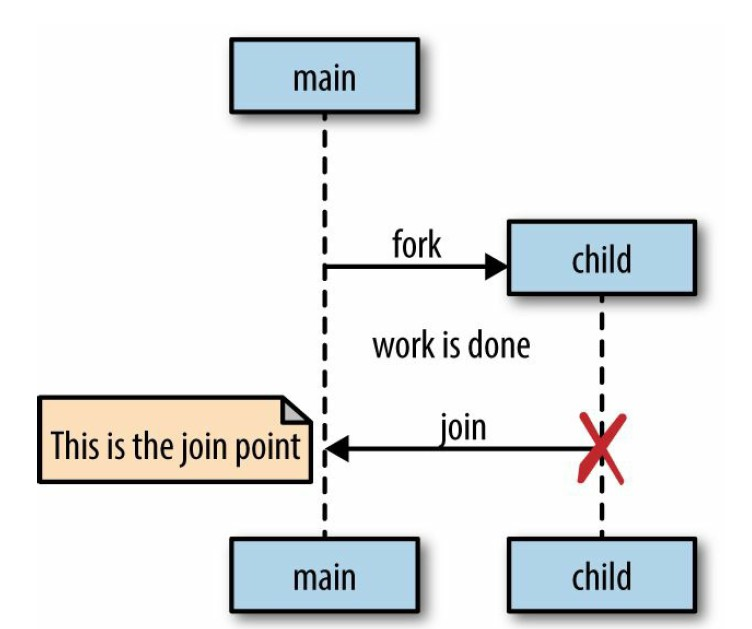
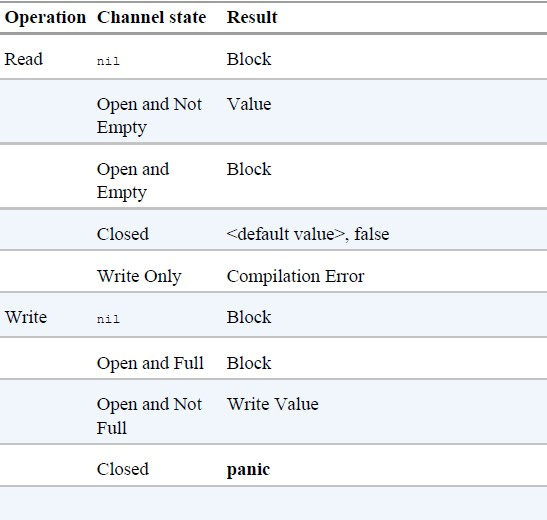

# Overview

## CSP

CSP stands for “Communicating Sequential Processes,” which is both a technique and the name of the paper that introduced it. In 1978, Charles Antony Richard Hoare published the paper in the Association for Computing Machinery (more popularly referred to as ACM).

To support his assertion that inputs and outputs needed to be considered language primitives, Hoare’s CSP programming language contained primitives to model input and output, or communication, between processes correctly (this is where the paper’s name comes from). Hoare applied the term processes to any encapsulated portion of logic that required input to run and produced output other processes would consume.

Using these primitives, Hoare walked through several examples and demonstrated how a language with first-class support for modeling communication makes solving problems simpler and easier to comprehend. Similar solutions in Go are a bit longer, but also carry with them this clarity.

Memory access synchronization isn’t inherently bad. Sometimes sharing memory is appropriate in certain situations, even in Go. However, the shared memory model can be difficult to utilize correctly — especially in large or complicated programs.

## Go’s Philosophy on Concurrency

Go does support more traditional means of writing concurrent code through memory access synchronization and the primitives that follow that technique. However, higher-level synchronization is better done via channels and communication. 

**Do not communicate by sharing memory. Instead, share memory by communicating.**

Go’s philosophy on concurrency can be summed up like this: aim for simplicity, use channels when possible, and treat goroutines like a free resource.

*How To Choose Between CSP-style Concurrency and Memory Memory Synchronization*

1.Are you trying to transfer ownership of data?

Channels help us communicate data by encoding that intent into the channel’s type. One large benefit of doing so is you can create buffered channels to implement a cheap in-memory queue and thus decouple your producer from your consumer. Another is that by using channels, you’ve implicitly made your concurrent code **composable** with other concurrent code.

2.Are you trying to guard internal state of a struct?

Remember the key word here is **internal**. If you find yourself exposing locks beyond a type, this should raise a red flag. Try to keep the locks constrained to a small lexical scope like this:

```go
type Counter struct {
    mu sync.Mutex
    value int
}

func (c *Counter) Increment() {
    c.mu.Lock()
    defer c.mu.Unlock()
    c.value++
}
```

3.Are you trying to coordinate multiple pieces of logic?

Remember that channels are inherently more composable than memory access synchronization primitives. Having locks scattered throughout your object-graph sounds like a nightmare. 

If you find yourself struggling to understand how your concurrent code works, why a deadlock or race is occurring, and you’re using primitives, this is probably a good indicator that you should switch to channels.

4.Is it a performance-critical section?

This absolutely does not mean, “I want my program to be performant, therefore I will only use mutexes.” Rather, if you have a section of your program that you have profiled, and it turns out to be a major bottleneck that is orders of magnitude slower than the rest of the program, using memory access synchronization primitives may help this critical section perform under load. This is because channels *use* memory access synchronization to operate, therefore they can only be slower.

# Go's Concurrency Building Blocks

## Goroutines

### 1.What Is A Goroutine

Goroutines can be considered a special class of coroutine.

Coroutines are simply concurrent subroutines (functions, closures, or methods in Go) that are nonpreemptive — that is, they cannot be interrupted. Instead, coroutines have multiple points throughout which allow for suspension or reentry

Goroutines don’t define their own suspension or reentry points; Go’s runtime observes the runtime behavior of goroutines and automatically suspends them when they block and then resumes them when they become unblocked.

### 2.Go’s Mechanism For Hosting Goroutines

Go’s mechanism for hosting goroutines is an implementation of what’s called an **M:N scheduler**, which means it maps M green threads, which are managed by a language's runtime, to N OS threads. 

### 3. Go's Model of Concurrency

Go follows a model of concurrency called the **fork-join** model. 

The word fork refers to the fact that at any point in the program, it can split off a child branch of execution to be run concurrently with its parent. The word join refers to the fact that at some point in the future, these concurrent branches of execution will join back together.



The `go` statement is how Go performs a fork, and the forked threads of execution are goroutines.

*Be Careful When Using Goroutines With Closures*

```go
func main() {
	var wg sync.WaitGroup
	for _, salutation := range []string{"hello", "greetings", "good days"} {
		wg.Add(1)
		go func() {
			defer wg.Done()
			fmt.Println(salutation)
		}()
	}
	wg.Wait()
}

// good days
// good days
// good days
```

In this example, the goroutine is running a closure that has closed over the iteration variable `salutation`, which has a type of `string`. As our loop iterates, salutation is being assigned to the next string value in the slice literal. Because the goroutines being scheduled may run at any point in time in the future, it is undetermined what values will be printed from within the goroutine.

This is an interesting side note about how Go manages memory. The Go runtime is observant enough to know that a reference to the `salutation` variable is still being held, and therefore will transfer the memory to the heap so that the goroutines can continue to access it. Usually on my machine, **the loop exits before any goroutines begin running**, so `salutation` is transferred to the heap holding a reference to the last value in my string slice, “good day.”

The proper way to write this loop is to pass a copy of `salutation` into  the closure so that by the time the goroutine is run, it will be operating on the data from its iteration of the loop:

```go
func main() {
	var wg sync.WaitGroup
	for _, salutation := range []string{"hello", "greetings", "good days"} {
		wg.Add(1)
		go func(salutation string) {
			defer wg.Done()
			fmt.Println(salutation)
		}(salutation)
	}
	wg.Wait()
}

// good day
// hello
// greetings
```

### 4. Goroutines Are Lightweight

A newly minted goroutine is given a few kilobytes, which is almost always enough. When it isn’t, the run-time grows (and shrinks) the memory for storing the stack automatically, allowing many goroutines to live in a modest amount of memory.

## The `sync` Package

The `sync` package contains the concurrency primitives that are most  useful for low-level memory access synchronization.

### WaitGroup

`WaitGroup` is a great way to wait for a set of concurrent operations to complete when you either don’t care about the result of the concurrent operation, or you have other means of collecting their results.

You can think of a `WaitGroup` like a concurrent-safe counter: calls to `Add` increment the counter by the integer passed in, and calls to `Done` decrement the counter by one. Calls to `Wait` block until the counter is zero.

```go
func main() {
	var wg sync.WaitGroup
	wg.Add(1)
	go func() {
		defer wg.Done()
	}()
	wg.Wait()
	fmt.Println("All goroutines done.")
}
```

Notice that the calls to `Add` are done outside the goroutines they’re helping to track. If we didn’t do this, we would have introduced a race condition; we could reach the call to `Wait` before either of the goroutines begin. Had the calls to `Add` been placed inside the goroutines’ closures, the call to `Wait` could have returned without blocking at all because the calls to `Add` would not have taken place.

### Mutex and RWMutex

1.Mutex

A Mutex shares memory by creating a convention developers must follow to synchronize access to the memory. You are responsible for coordinating access to this memory by guarding access to it with a mutex.

```go
func main() {
	count := 0
	var lock sync.Mutex
	var wg sync.WaitGroup
	for i := 0; i < 5; i++ {
		wg.Add(1)
		go func() {
			lock.Lock()
			defer lock.Unlock()
			count++
			fmt.Println("Incrementing: ", count)
			wg.Done()
		}()
	}
	for i := 0; i < 5; i++ {
		wg.Add(1)
		go func() {
			lock.Lock()
			defer lock.Unlock()
			count--
			fmt.Println("Decrementing: ", count)
			wg.Done()
		}()
	}
	wg.Wait()
	fmt.Println("All goroutines done.")
}
```

Notice that we always call `Unlock` within a `defer` statement. This is a very common idiom when utilizing a `Mutex` to ensure the call always happens, even when panicing. Failing to do so will probably cause your program to deadlock.

2.RWMutex

Perhaps not all of these processes will read and write to this memory. If this is the case, you can take advantage of a different type of mutex: `sync.RWMutex`.

`RWMutex` gives you a little bit more control over the memory. You can request a lock for reading, in which case you will be granted access unless the lock is being held for writing. This means that an arbitrary number of readers can hold a reader lock so long as nothing else is holding a writer lock.

In fact, this lock can be held by an arbitrary number of readers or a single writer.

It's usually advisable to use `RWMutex`instead of `Mutex`when it logically makes sense. 

### Cond

`Cond`is a meeting point for goroutines waiting for or announcing the occurrence of an event. An “event” is any arbitrary signal between two or more goroutines that carries no information other than the fact that it has occurred. Very often you’ll want to wait for one of these signals before continuing execution on a goroutine.

```go
// The NewCond function takes in a type that satisfies the sync.LOcker interface.
// This allows Cond to facilitate coordination with other goroutines
c := sync.NewCond(&sync.Mutex())
// Calling Lock() is necessary 
// because the call to Wait automatically calls
// Unlock() on the Locker when entered
c.L.Lock()
for !condition(){
	c.Wait()
}
// ... make use of condition ...
// Calling Unlock() is necessary 
// because when Call returns, it calls 
// Lock() on the Locker for the condition
c.L.Unlock()
```

Note that the call to `Wait` doesn’t just block, it suspends the current goroutine, allowing other goroutines to run on the OS thread. A few other things happen when you call `Wait`: upon entering `Wait`, `Unlock` is called on the `Cond` variable’s `Locker`, and upon exiting `Wait`, `Lock` is called on the `Cond` variable’s `Locker`. In my opinion, this takes a little getting used to; it’s effectively a hidden side effect of the method. It looks like we’re holding this lock the entire time while we wait for the condition to occur, but that’s not actually the case.

Like most other things in the `sync` package, usage of `Cond` works best when constrained to a tight scope, or exposed to a broader scope through a type that encapsulates it.

1.Signal

```go
func main() {
	c := sync.NewCond(&sync.Mutex{})
	q := make([]int, 0, 10)
	dequeue := func() {
		time.Sleep(time.Second)
		c.L.Lock()
		q = q[1:]
		fmt.Println("Dequeue")
		c.L.Unlock()
		c.Signal()
	}
	for i := 0; i < 10; i++ {
		c.L.Lock()
		// Block until at least one item is dequeued.
		for len(q) == 2 {
			c.Wait()
		}
		fmt.Println("Enqueue")
		q = append(q, i)
		go dequeue()
		c.L.Unlock()
	}
}
```

`Signal`is one of the two methods that the `Cond` type provides for notifying goroutines blocked on a `Wait` call that the condition has been triggered.

2.Broadcast

`Broadcast` sends a signal to all goroutines that are waiting. This is something channels can’t do easily and thus is one of the main reasons to utilize the `Cond` type.

```go
type Button struct {
	Clicked *sync.Cond
}

func main() {
	button := Button{sync.NewCond(&sync.Mutex{})}
	subscribe := func(c *sync.Cond, handler func()) {
		var wgGoroutine sync.WaitGroup
		wgGoroutine.Add(1)
		go func() {
			wgGoroutine.Done()
			c.L.Lock()
			defer c.L.Unlock()
			// Wait for signals to run handler.
			c.Wait()
			handler()
		}()
		wgGoroutine.Wait()
	}

	var wgClick sync.WaitGroup
	wgClick.Add(3)
	subscribe(button.Clicked, func() {
		fmt.Println("Maximizing window.")
		wgClick.Done()
	})
	subscribe(button.Clicked, func() {
		fmt.Println("Mouse clicked.")
		wgClick.Done()
	})
	subscribe(button.Clicked, func() {
		fmt.Println("Displaying annoying dialog box.")
		wgClick.Done()
	})
	button.Clicked.Broadcast()
	wgClick.Wait()
}

// Displaying annoying dialog box.
// Maximizing window.
// Mouse clicked.
```

### Once

```go
func main() {
	count := 0
	var once sync.Once
	var wg sync.WaitGroup
	wg.Add(100)
	for i := 0; i < 100; i++ {
		go func() {
			defer wg.Done()
			once.Do(func() {
				count++
			})
		}()
	}
	wg.Wait()
	fmt.Println(count) // 1
}
```

`sync.Once` is a type that utilizes some sync primitives internally to ensure that only one call to `Do` ever calls the function passed in — even on different goroutines.

Notice that `sync.Once` only counts the number of times `Do` is called, not how many times unique functions passed into `Do` are called.

```go
var count int
increment := func() { count++ }
decrement := func() { count-- }
var once sync.Once
once.Do(increment)
once.Do(decrement)
fmt.Printf("Count: %d\n", count) // Count: 1
```

### Pool

`Pool` is a concurrent-safe implementation of the object pool pattern.

At a high level, the pool pattern is a way to create and make available a fixed number, or pool, of things for use. It’s commonly used to constrain the creation of things that are expensive (e.g., database connections) so that only a fixed number of them are ever created, but an indeterminate number of operations can still request access to these things. In the case of Go’s `sync.Pool`, this data type can be safely used by multiple goroutines.

`Pool`’s primary interface is its `Get` method. When called, `Get` will first check whether there are any available instances within the pool to return to the caller, and if not, call its `New` member variable to create a new one. When finished, callers call `Put` to place the instance they were working with back in the pool for use by other processes.

When working with a `Pool`, just remember the following points:

- When instantiating `sync.Pool`, give it a New member variable that is thread-safe when called.
- When you receive an instance from `Get`, make no assumptions regarding the state of the object you receive back.
- Make sure to call `Put` when you’re finished with the object you pulled out of the pool. Otherwise, the `Pool` is useless. Usually this is done with `defer`.
- Objects in the pool must be roughly uniform in makeup.

## Channels

When using channels, you’ll pass a value into a `chan` variable, and then somewhere else in your program read it off the channel. The disparate parts of your program don’t require knowledge of each other, only a reference to the same place in memory where the channel resides. This can be done by passing references of channels around your program.

```go
var dataStream chan interface{} // declare a channel
dataStream = make(chan interface{}) // initiate the channel
```

You don’t often see unidirectional channels instantiated, but you’ll often see them used as function parameters and return types, which is very useful. This is possible because Go will implicitly convert bidirectional channels to unidirectional channels when needed.

It is an error to try and write a value onto a read-only channel, and an error to read a value from a write-only channel. Go’s compiler will let us know that we’re doing something illegal.

### Closed Channels

We could continue performing reads on this channel indefinitely despite the channel remaining closed. This is to allow support for multiple downstream reads from a single upstream writer on the channel.

```go
intStream := make(chan int)
close(intStream)
integer, ok := <- intStream // ok will always be false
fmt.Printf("(%v): %v", ok, integer) 
```

This opens up a few new patterns for us.

1.`range`iteration

The `range`loop will automatically break the loop when a channel is closed. This allows for concise iteration over the values on a channel. 

```go
func main() {
	intStream := make(chan int)
	go func() {
		defer close(intStream)
		for i := 1; i < 5; i++ {
			intStream <- i
		}
	}()
	for i := range intStream {
		fmt.Println(i)
	}
}

// 1
// 2
// 3
// 4
```

2.signal

Closing a channel is also one of the ways you can signal multiple goroutines simultaneously. If you have n goroutines waiting on a single channel, instead of writing n times to the channel to unblock each goroutine, you can simply close the channel. Since a closed channel can be read from an infinite number of times, it doesn’t matter how many goroutines are waiting on it, and closing the channel is both cheaper and faster than performing n writes.

```go
func main() {
	begin := make(chan int)
	var wg sync.WaitGroup
	for i := 0; i < 5; i++ {
		wg.Add(1)
		go func(i int) {
			defer wg.Done()
			// Here goroutines will wait until the channel is closed.
			<-begin
			fmt.Printf("goroutine %d begins\n", i)
		}(i)
	}
	// CLose the channel and all goroutines are unlocked.
	close(begin)
	wg.Wait()
}

// goroutine 4 begins
// goroutine 3 begins
// goroutine 0 begins
// goroutine 1 begins
// goroutine 2 begins
```

Of course we can still use `sync.Cond`to do the same job. But channels are composable.

### Buffered Channels

Buffered channels are an in-memory FIFO **queue** for concurrent processes to communicate over.

It also bears mentioning that if a buffered channel is empty and has a receiver, the buffer will be bypassed and the value will be passed directly from the sender to the receiver. In practice, this happens transparently but it do affect the performance of buffered channels.

If a goroutine making writes to a channel has knowledge of how many writes it will make, it can be useful to create a buffered channel whose capacity is the number of writes to be made, and then make those writes as quickly as possible.

```go
func main() {
	var stdOutBuf bytes.Buffer
	defer stdOutBuf.WriteTo(os.Stdout)

	ch := make(chan int, 4)
	go func() {
		defer close(ch)
		defer fmt.Fprintf(&stdOutBuf, "Producer done.\n")
		for i := 0; i < 4; i++ {
			fmt.Fprintf(&stdOutBuf, "Sending: %d\n", i)
			ch <- i
		}
	}()
	for i := range ch {
		fmt.Fprintf(&stdOutBuf, "Received %d.\n", i)
	}
}
```

### nil Channels

Be sure to ensure the channels you’re working with are always initialized first.

```go
var ch chan int
ch <- 1 // panic: deadlock
<- ch // panic: deadlock
close(ch) // panic: close of nil channel
```

### Result of channel operations given a channel’s State



.jpg)

### Principles of Goroutine Usage

The first thing we should do to put channels in the right context is to assign channel ownership. We can define ownership as being a goroutine that instantiates, writes, and closes a channel.

1.channel owners

The goroutine that owns a channel should:

- Instantiate the channel.
- Perform writes, or pass ownership to another goroutine.
- Close the channel.
- Encapsulate the previous three things in this list and expose them via a reader channel.

By assigning these responsibilities to channel owners, a few things happen:

- Because we’re the one initializing the channel, we remove the risk  of deadlocking by writing to a `nil` channel. 
- Because we’re the one initializing the channel, we remove the risk of panic by closing a `nil` channel. 
- Because we’re the one who decides when the channel gets closed, we remove the risk of panic by writing to a closed channel.
- Because we’re the one who decides when the channel gets closed, we remove the risk of panic by closing a channel more than once. We wield the type checker at compile time to prevent improper writes to our channel.

Note that you should keep the scope of channel ownership as small as possible in order to make things obvious. If you have a channel as a member variable of a struct with numerous methods on it, it’s going to quickly become unclear how the channel will behave.

2.channel consumers

- Knowing when a channel is closed.
- Responsibly handling blocking for any reason.

To address the first point we simply examine the second return value from the read operation, as discussed previously. The second point is much harder to define because it depends on your algorithm: you may want to time out, you may want to stop reading when someone tells you to, or you may just be content to block for the lifetime of the process.

### The select Statement

In general, `select`statements can bind channels. 

There are 3 interesting questions about `select`.

1.What happens when multiple channels have something to read?

The Go runtime cannot know anything about the intent of your `select` statement; that is, it cannot infer your problem space or why you placed a group of channels together into a `select` statement. Because of this, the best thing the Go runtime can hope to do is to work well in the average case. A good way to do that is to introduce a random variable into your equation — in this case, which channel to select from. By weighting the chance of each channel being utilized equally, all Go programs that utilize the select statement will perform well in the average case.

2.What if there are never any channels that become ready?

If there’s nothing useful you can do when all the channels are blocked, but you also can’t block forever, you may want to time out. Go’s time package provides an elegant way to do this with channels that fits nicely within the paradigm of select statements.

```go
c := make(<-chan int)
select {
    case <-c:
    case <-time.After(1 * time.Second):
    	return
}
```

3.What if we want to do something but no channels are currently ready?

The `select` statement also allows for a `default` clause in case you’d like to do something if all the channels you’re selecting against are blocking.

### The GOMAXPROCS Lever

People often think `runtime.GOMAXPROCS` relates to the number of logical processors on the host machine — and in a roundabout way it does — but really this function controls the number of OS threads that will host so-called “work queues.”

After Go 1.5, it is now automatically set to the number of logical CPUs  on the host machine.

# Concurrency Patterns in Go

## Confinement

*Ad hoc confinement* is when you achieve confinement through a convention — whether it be set by the languages community, the group you work within, or the codebase you work within. *Lexical confinement* involves using lexical scope to expose only the correct data and concurrency primitives for multiple concurrent processes to use. It makes it impossible to do the wrong thing.

```go
func main() {
	chanOwner := func() <-chan int {
		results := make(chan int, 5)
		go func() {
			defer close(results)
			for i := 0; i <= 5; i++ {
				results <- i
			}
		}()
		return results
	}
	consumer := func(results <-chan int) {
		for result := range results {
			fmt.Printf("Received: %d\n", result)
		}
		fmt.Println("Done receiving!")
	}
	results := chanOwner()
	consumer(results)
}
```

## The for-select Loop

```go
for { // Either infinite loop or range over something
    select {
        // Do some work with channels
    }
}
```

*Scenarios*

1.Sending iteration variables out on a channel

```go
for _, s := range []string {"a", "b", "c"} {
    select {
    case <- done:
        return
    case stringStream <- s:
    }
}
```

2.Looping infinitely waiting to be stopped

There are some variations.

(1) 

If the `done` channel isn’t closed, we’ll exit the select statement and
continue on to the rest of our for loop’s body.

```go
for {
    select {
    case <-done:
        return
    default:
    }
    // Do non-preemptable work
}
```

(2) 

This style embeds the work in a `default`clause  When we enter the `select` statement, if the `done` channel hasn’t been closed, we’ll execute the `default` clause instead.

```go
for {
    select {
    case <-done:
        return 
    default:
    	// Do non-preemptable work    
    }
}
```

## Preventing Goroutine Leaks

The runtime handles multiplexing the goroutines onto any number of operating system threads so that we don’t often have to worry about that level of abstraction. But they do cost resources, and goroutines are not garbage collected by the runtime, so regardless of how small their memory footprint is, we don’t want to leave them lying about our process.

The goroutine has a few paths to termination:

- When it has completed its work.
- When it panic.
- When it's told to stop working.

The first two paths are achieved by your algorithm. As for the last one, for now et’s consider how to ensure a single **child** goroutine is guaranteed to be cleaned up.

(1) Goroutine blocked on attempting to receive a value from a channel

```go
func main() {
	doWork := func(done <-chan interface{}, strings <-chan string) <-chan interface{} {
		terminated := make(chan interface{})
		go func() {
			defer fmt.Println("doWork exited.")
			defer close(terminated)
			for {
				select {
				case s := <-strings:
					// ...
					fmt.Println(s)
				case <-done:
					return
				}
			}
		}()
		return terminated
	}

	done := make(chan interface{})
	terminated := doWork(done, nil)

	go func() {
		time.Sleep(1 * time.Second)
		fmt.Println("Canceling doWork goroutine...")
		close(done)
	}()

	<-terminated
	fmt.Println("done")
}

// Canceling doWork goroutine...
// doWork exited.
// done
```

Despite passing in `nil` for our strings channel, goroutines still exits successfully and we don't have a deadlock. This is because before we join the two goroutines, we create a third goroutine to cancel the goroutine within `doWork` after a second.

(2) Goroutine blocked on attempting to send a value to a channel

```go
func main() {
   newRandStream := func(done <-chan interface{}) <-chan int {
      randStream := make(chan int)
      go func() {
         defer fmt.Println("newRandStream exited.")
         defer close(randStream)
         for {
            select {
            case randStream <- rand.Int():
            case <-done:
               return
            }
         }
      }()
      return randStream
   }

   done := make(chan interface{})
   randStream := newRandStream(done)
   fmt.Println("3 random ints:")
   for i := 0; i < 3; i++ {
      fmt.Printf("%d: %d\n", i, <-randStream)
   }
   close(done)
   time.Sleep(1 * time.Second)
}

// 3 random ints:
// 0: 5577006791947779410
// 1: 8674665223082153551
// 2: 6129484611666145821
// newRandStream exited.
```

Now that we know how to ensure goroutines don’t leak, we can stipulate a convention: **If a goroutine is responsible for creating a goroutine, it is also responsible for ensuring it can stop the goroutine.**

## The or-channel

At times you may find yourself wanting to combine one or more done channels into a single done channel that closes if any of its component channels close.

```go
func or(channels ...<-chan interface{}) <-chan interface{} {
   switch len(channels) {
   case 0:
      return nil
   case 1:
      return channels[0]
   }
   orDone := make(chan interface{})
   // Create a goroutine to wait for messages on our channels
   // without blocking
   go func() {
      defer close(orDone)
      switch len(channels) {
      case 2:
         // Every recursive call to or will at least have two channels
         // so this is an optimization.
         select {
         case <-channels[0]:
         case <-channels[1]:
         }
      default:
         select {
         case <-channels[0]:
         case <-channels[1]:
         case <-channels[2]:
         case <-or(append(channels[3:], orDone)...): 
         }
      }
   }()
   return orDone
}
```

In this function, we recursively create an or-channel from all the channels in our slice after the third index, and then select from this. This recurrence relation will destructure the rest of the slice into or channels to form a tree from which the first signal will return. We also pass in the `orDone` channel so that when goroutines up the tree exit, goroutines down the tree also exit.

An example using `or`:

```go
func main() {
	sig := func(after time.Duration) <-chan interface{} {
		c := make(chan interface{})
		go func() {
			defer close(c)
			time.Sleep(after)
		}()
		return c
	}
	start := time.Now()
	<-or(sig(2*time.Second), sig(5*time.Minute), sig(1*time.Hour))
	fmt.Printf("done after %v\n", time.Since(start))
}

// done after 2.0089284s
```

Notice that despite placing several channels in our call to or that take various times to close, our channel that closes after one second causes the entire channel created by the call to or to close. This is because — despite its place in the tree the or function builds — it will always close first and thus the channels that depend on its closure will close as well.

Worrying about the number of goroutines created here is probably a premature optimization. Further, if at compile time you don’t know how many done channels you’re working with, there isn’t any other way to combine done channels.

This pattern is useful to employ at the intersection of modules in your system. At these intersections, you tend to have multiple conditions for canceling trees of goroutines through your call stack. Using the or function, you can simply combine these together and pass it down the stack.

## Error Handling

Errors should be considered first-class citizens when constructing values to return from goroutines. If your goroutine can produce errors, those errors should be tightly coupled with your result type, and passed along through the same lines of communication — just like regular synchronous functions.

In general, your concurrent processes should send their errors to another part of your program that has complete information about the state of your program, and can make a more informed decision about what to do.

```go
type Result struct {
   Error error
   Response *http.Response
}

func main() {
   checkStatus := func(done <-chan interface{}, urls ...string) <-chan Result {
      results := make(chan Result)
      go func() {
         defer close(results)
         for _, url := range urls {
            var res Result
            resp, err := http.Get(url)
            res = Result{err, resp}
            select {
            case <-done:
               return
               case results <- res:
            }
         }
      }()
      return results
   }
   done := make(chan interface{})
   defer close(done)

   urls := []string{"https://www.google.com", "https://golang.org"}
   for res := range checkStatus(done, urls...) {
      if res.Error != nil {
         fmt.Println(res.Error)
      } else {
         fmt.Println(res.Response.Status)
      }
   }
}
```

## Pipelines

A pipeline is nothing more than a series of things that take data in, perform an operation on it, and pass the data back out. We call each of these operations a *stage* of the pipeline. One of the benefits of utilizing pipelines is the ability to process individual stages concurrently.

*Best Practices for Constructing Pipelines*

Channels are uniquely suited to constructing pipelines in Go because they fulfill all of our basic requirements. They can receive and emit values, they can safely be used concurrently, they can be ranged over, and they are reified by the language.

(1) Generator:  from discrete values to channels

A function converts a discrete set of values into a stream of data on a channel. Aptly, this type of function is called a generator. You’ll see this frequently when working with pipelines because at the beginning of the pipeline, you’ll always have some batch of data that you need to convert to a channel.

```go
func generator(done <-chan interface{}, ints ...int) <-chan int {
	intStream := make(chan int)
	go func() {
		// Owner of a channel should be responsible for closing it.
		defer close(intStream)
		for _, i := range ints {
			select {
			case <-done:
				return
			case intStream <- i:
			}
		}
	}()
	return intStream
}
```

There are two points in this process that must be preemptable:

- Creation of the discrete value that is not nearly instantaneous. 
- Sending of the discrete value on its channel.

(2) construct the pipeline

```go
func multiply(done <-chan interface{}, intStream <-chan int, multiplier int) <-chan int {
	multipliedStream := make(chan int)
	go func() {
		defer close(multipliedStream)
		for i := range intStream {
			select {
			case <-done:
				return
			case multipliedStream <- i * multiplier:
			}
		}
	}()
	return multipliedStream
}

func add(done <-chan interface{}, intStream <-chan int, additive int) <-chan int {
	addedStream := make(chan int)
	go func() {
		defer close(addedStream)
		for i := range intStream {
			select {
			case <-done:
				return
			case addedStream <- i + additive:
			}
		}
	}()
	return addedStream
}
```

First, we’re using channels. This is obvious but significant because it allows two things: at the end of our pipeline, we can use a range statement to extract the values, and at each stage we can safely execute concurrently because our inputs and outputs are safe in concurrent contexts.

Second, each stage of the pipeline is executing concurrently. This means that any stage only need wait for its inputs, and to be able to send its outputs. 

Now the complete example:

```go
func main() {
   done := make(chan interface{})
   defer close(done)
   intStream := generator(done, 1, 2, 3, 4)
   pipeline := multiply(done, add(done, intStream, 1), 2)
   for v := range pipeline {
      fmt.Println(v)
   }
}
```

Note that regardless of what state the pipeline stage is in — waiting on the incoming channel, or waiting on the send — closing the done channel will force the pipeline stage to terminate.

*Some Handy Generators*

```go
func main() {
    done := make()
}

// Repeat the values caller passes to it infinitely
// until it's stopped.
func repeat(done <-chan interface{}, values ...interface{}) <-chan interface{} {
	valueStream := make(chan interface{})
	go func() {
		defer close(valueStream)
		for {
			for _, v := range values {
				select {
				case <-done:
					return
				case valueStream <- v:
				}
			}
		}
	}()
	return valueStream
}

// Take the first n values.
func take(done <-chan interface{}, valueStream <-chan interface{}, n int) <-chan interface{} {
	takeStream := make(chan interface{})
	go func() {
		defer close(takeStream)
		for i := 0; i < n; i++ {
			select {
			case <-done:
				return
			case takeStream <- <-valueStream:
			}
		}
	}()
	return takeStream
}
```

## Fan-Out, Fan-In

Fan-out is a term to describe the process of starting multiple goroutines to handle input from the pipeline, and fan-in is a term to describe the process of combining multiple results into one channel.

You might consider fanning out one of your stages if both of the following apply:

- It doesn't rely on values that the stage had calculated before.
- It takes a long time to run.

The property of order-independence is important because you have no guarantee in what order concurrent copies of your stage will run, nor in what order they will return.

1.fan-out

Just start up multiple copies of the stage.

```go
out := make([]<-chan interface{}, MAX)
for i := 0; i < MAX; i++ {
    out[i] = stage2(done, stage1)
}
```

2.fan-in

```go
func fanin(done <-chan interface{}, channels ...<-chan interface{}, ) <-chan interface{} {
	var wg sync.WaitGroup
	multiplexedStream := make(chan interface{})
	multiplex := func(c <-chan interface{}) {
		defer wg.Done()
		for i := range c {
			select {
			case <-done:
				return
			case multiplexedStream <- i:
			}
		}
	}
	// Select from all the channels
	wg.Add(len(channels))
	for _, c := range channels {
		go multiplex(c)
	}
	// Wait for all the reads to complete
	go func() {
		wg.Wait()
		close(multiplexedStream)
	}()
	return multiplexedStream
}
```

Fanning in involves creating the multiplexed channel consumers will read from, and then spinning up one goroutine for each incoming channel, and one goroutine to close the multiplexed channel when the incoming channels have all been closed. Since we’re going to be creating a goroutine that is waiting on N other goroutines to complete, it makes sense to create a `sync.WaitGroup` to coordinate things. The multiplex function also notifies the `WaitGroup` that it’s done.

## The or-done-channel

At times you will be working with channels from disparate parts of your system. Unlike with pipelines, you can’t make any assertions about how a channel will behave when code you’re working with is canceled via its done channel. That is to say, you don’t know if the fact that your goroutine was canceled means the channel you’re reading from will have been canceled.

For this reason, we need to wrap out read from the channel with a `select`statement that also selects from a `done`channel.

```go
	orDone := func(done, c <-chan interface{}) <-chan interface{} {
		valStream := make(chan interface{})
		go func() {
			defer close(valStream)
			for {
				select {
				case <-done:
					return
				case v, ok := <-c:
					if ok == false {
						return // or maybe break 
					}
					select {
					case valStream <- v:
					case <-done:
					}
				}
			}
		}()
		return valStream
	}
```

## The tee-channel

Sometimes you may want to split values coming in from a channel so that you can send them off into two separate areas of your codebase. Taking its name from the tee command in Unix-like systems, the tee channel does just this. You can pass it a channel to read from, and it will return two separate channels that will get the same value:

```go
func tee(
	done <-chan interface{},
	in <-chan interface{},
) (_, _ <-chan interface{}) {
	out1 := make(chan interface{})
	out2 := make(chan interface{})
	go func() {
		defer close(out1)
		defer close(out2)
		for val := range orDone(done, in) {
			var _out1, _out2 = out1, out2
			// To ensure both are written to
			// we'll perform an iteration
			for i := 0; i < 2; i++ {
				select {
				case <-done:
					// Once we’ve written to a channel,
					// we set its shadowed copy to nil so that
					// further writes will block and the other channel may continue
				case _out1 <- val:
					_out1 = nil
				case _out2 <- val:
					_out2 = nil
				}
			}
		}
	}()
	return out1, out2
}
```

## Queueing

Sometimes it’s useful to begin accepting work for your pipeline even though the pipeline is not yet ready for more. This process is called  *queuing*. All this means is that once your stage has completed some work, it stores it in a temporary location in memory so that other stages can retrieve it later, and your stage doesn’t need to hold a reference to it.

The true utility of queues is to *decouple stages* so that the runtime of one stage has no impact on the runtime of another. Decoupling stages in this manner then cascades to alter the runtime behavior of the system as a whole, which can be either good or bad depending on your system.

## The context package

It would be useful if we could communicate extra information alongside the simple notification to cancel: why the cancellation was occurring, or whether or not our function has a deadline by which it needs to complete. So the Go authors decided to create a standard pattern for doing so.

In Go 1.7, the context package was brought into the standard library, making this a standard Go idiom to consider when working with concurrent code.

### Context type

Each function that is downstream from your top-level concurrent call would take in a `Context` as its first argument.

```go
// A Context carries a deadline, a cancelation signal, and other values across
// API boundaries.
//
// Context's methods may be called by multiple goroutines simultaneously.
type Context interface {
	Deadline() (deadline time.Time, ok bool)

	Done() <-chan struct{}
    
    Err() error

	Value(key interface{}) interface{}
}
```

- `Done`method returns a channel that's closed when our function is to be preempted.
- `Dealine`function indicates if a goroutine will be canceled after a certain time. 
- `Err`method will return non-nil if the goroutine was canceled.

The Go authors noticed that one of the primary uses of goroutines was programs that serviced requests. Usually in these programs, request specific information needs to be passed along in addition to information about preemption. This is the purpose of the `Value` function.

### The Purposes of context package

1.To provide an API for canceling branches of your call-graph.

There’s nothing present that can mutate the state of the underlying structure. Further, there’s nothing that allows the function accepting the `Context` to cancel it. This protects functions up the call stack from children canceling the context. Combined with the `Done` method, which provides a done channel, this allows the `Context` type to safely manage cancellation from its antecedents. To affect the behavior of cancellations in functions below a current function in the call stack, we need to use functions in the `context`package:

```go
func WithCancel(parent Context) (ctx Context, cancel CancelFunc)
func WithDeadline(parent Context, d time.Time) (Context, CancelFunc)
func WithTimeout(parent Context, timeout time.Duration) (Context, CancelFunc)
```

Notice that all these functions take in a `Context`and return one as well. `WithCancel` returns a new `Context` that closes its done channel when the returned cancel function is called. `WithDeadline` returns a new `Context` that closes its done channel when the machine’s clock advances past the given deadline. `WithTimeout` returns a new `Context `that closes its done channel after the given timeout duration.

Instances of a `Context` are meant to flow through your program’s call-graph. Instances of `context.Context` may look equivalent from the outside, but internally they may change at every stack-frame. For this reason, it’s important to **always pass instances of `Context` into your functions**.

To start the chain, the context package provides you with two functions to create empty instances of `Context`:

```go
func Background() Context
func TODO() Context
```

`Background` simply returns an empty `Context`. `TODO`’s intended purpose is to serve as a placeholder for when you don’t know which `Context` to utilize, or if you expect your code to be provided with a `Context`, but the upstream code hasn’t yet furnished one.

*An Example*

```go
func main() {
	var wg sync.WaitGroup
	ctx, cancel := context.WithCancel(context.Background())
	defer cancel()
	wg.Add(1)
	go func() {
		defer wg.Done()
		if err := printGreeting(ctx); err != nil {
			fmt.Printf("cannot print greeting: %v\n", err)
			cancel()
		}
	}()
	wg.Add(1)
	go func() {
		defer wg.Done()
		if err := printFarewell(ctx); err != nil {
			fmt.Printf("cannot print farewell: %v\n", err)
		}
	}()
	wg.Wait()
}

func printGreeting(ctx context.Context) error {
	greeting, err := genGreeting(ctx)
	if err != nil {
		return err
	}
	fmt.Printf("%s world!\n", greeting)
	return nil
}

func printFarewell(ctx context.Context) error {
	farewell, err := genFarewell(ctx)
	if err != nil {
		return err
	}
	fmt.Printf("%s world!\n", farewell)
	return nil
}

func genGreeting(ctx context.Context) (string, error) {
	ctx, cancel := context.WithTimeout(ctx, 1*time.Second)
	defer cancel()
	switch locale, err := locale(ctx); {
	case err != nil:
		return "", err
	case locale == "EN/US":
		return "hello", nil
	}
	return "", fmt.Errorf("unsupported locale")
}

func genFarewell(ctx context.Context) (string, error) {
	switch locale, err := locale(ctx); {
	case err != nil:
		return "", err
	case locale == "EN/US":
		return "goodbye", nil
	}
	return "", fmt.Errorf("unsupported locale")
}

func locale(ctx context.Context) (string, error) {
    // Check to see whether our Context has provided a deadline
    // If itdid, and our system’s clock has advanced past the deadline,
    // return with a special error.
	if deadline, ok := ctx.Deadline(); ok {
		if deadline.Sub(time.Now().Add(1*time.Minute)) <= 0 {
			return "", context.DeadlineExceeded
		}
	}
	select {
	case <-ctx.Done():
		return "", ctx.Err()
	case <-time.After(1 * time.Minute):
	}
	return "EN/US", nil
}
```

Notice that we always pass instances of `Context` into other functions. 

2.To provide a data-bag for transporting request-scoped data through your call-graph.

Remember that oftentimes when a function creates a goroutine and `Context`, it’s starting a process that will service requests, and functions further down the stack may need information about the request. 

- The key you use must satisfy Go’s notion of comparability; that is, the equality operators `==` and `!=` need to return correct results when used.

- Values returned must be safe to access from multiple goroutines.

Since both the `Context`’s key and value are defined as `interface{}`, we lose Go’s type-safety when attempting to retrieve values. The key could  be a different type, or slightly different than the key we provide. The value could be a different type than we’re expecting. For these reasons, there are some rules to follow. 

- Define a custom key-type in your package. As long as other packages do the same, this prevents collision within the `Context`.

```go
type foo int
type bar int
m := make(map[interface{}]int)
m[foo(1)] = 1
m[bar(1)] = 2
fmt.Printf("%v", m) // map[1:1, 1:2]
```

- Since we don't export the keys we use to store the data, we must therefore export functions that retrieve data for us. This works out nicely since it allows consumers of this data to use static, type-safe functions.

Here is an example:

```go
func main() {
	ProcessRequest("jane", "abc")
}

type ctxKey int

const (
	ctxUserID ctxKey = iota
	ctxAutoToken
)

func UserID(c context.Context) string {
	return c.Value(ctxUserID).(string)
}

func AutoToken(c context.Context) string {
	return c.Value(ctxAutoToken).(string)
}

func ProcessRequest(userID, autoToken string) {
	ctx := context.WithValue(context.Background(), ctxUserID, userID)
	ctx = context.WithValue(ctx, ctxAutoToken, autoToken)
	HandleResponse(ctx)
}

func HandleResponse(ctx context.Context) {
	fmt.Printf("handling repsonse for %v (auto: %v)", UserID(ctx), AutoToken(ctx))
}
```


