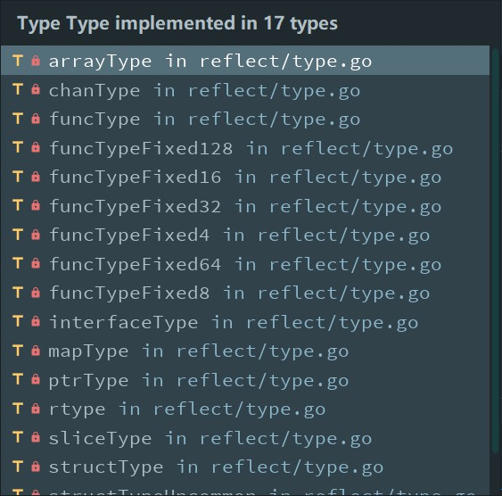

# slice

## struct

```go
// Pointer represents a pointer to an arbitrary type.
type slice struct {
	array unsafe.Pointer
	len   int
	cap   int
}
```

## make

### file location:

src/runtime/slice.go

### function signature

```go
func makeslice(et *_type, len, cap int) unsafe.Pointer
func makeslice64(et *_type, len64, cap64 int64) unsafe.Pointer
```

### workflow 

1.Determine whether `panicmakeslicelen`or`panicmakeslicecap`will occur

```go
func makeslice(et *_type, len, cap int) unsafe.Pointer {
	mem, overflow := math.MulUintptr(et.size, uintptr(cap)) // Calculate memory size required
	if overflow || mem > maxAlloc || len < 0 || len > cap {
		// NOTE: Produce a 'len out of range' error instead of a
		// 'cap out of range' error when someone does make([]T, bignumber).
		// 'cap out of range' is true too, but since the cap is only being
		// supplied implicitly, saying len is clearer.
		// See golang.org/issue/4085.
		mem, overflow := math.MulUintptr(et.size, uintptr(len))
		if overflow || mem > maxAlloc || len < 0 {
			panicmakeslicelen()
		}
		panicmakeslicecap()
	}

	// ...
}
```

(1)  `MulUintptr` returns a * b and whether the multiplication overflowed.

(2) `maxAlloc` is the maximum size of an allocation.

```go
maxAlloc = (1 << heapAddrBits) - (1-_64bit)*1 
// heapAddrBits is the number of bits in a heap address.
// On most 64-bit platforms, we limit this to 48 bits based on a combination of hardware and OS limitations.
```

On 64-bit, it's theoretically possible to allocate `1<<heapAddrBits` bytes. On 32-bit, however, this is one less than 1<<32 because the number of bytes in the address space doesn't actually fit in a `uintptr`.

(3) `panicmakeslcelen`is firstly tested because saying len is clear.

2.Allocate necessary memory size of specific type.

```go
return mallocgc(mem, et, true)
```

`mallocogc`signature: 

```go
func mallocgc(size uintptr, typ *_type, needzero bool) unsafe.Pointer
```

3.There is also a function `makeslice64`.

```go
func makeslice64(et *_type, len64, cap64 int64) unsafe.Pointer {
    // Determine whether len64 or cap64 overflow 
	len := int(len64)
	if int64(len) != len64 {
		panicmakeslicelen()
	}

	cap := int(cap64)
	if int64(cap) != cap64 {
		panicmakeslicecap()
	}

	return makeslice(et, len, cap)
}
```

## append

### file location

src/runtime/slice.go

### function signature 

```go
// growslice handles slice growth during append.
// It is passed the slice element type, the old slice, and the desired new minimum capacity,
// and it returns a new slice with at least that capacity, with the old data
// copied into it.
// The new slice's length is set to the old slice's length,
// NOT to the new requested capacity.
// This is for codegen convenience. The old slice's length is used immediately
// to calculate where to write new values during an append.
// TODO: When the old backend is gone, reconsider this decision.
// The SSA backend might prefer the new length or to return only ptr/cap and save stack space.
func growslice(et *_type, old slice, cap int) slice
```

### workflow 

1.Determine if the parameter is legal.

```go
	if raceenabled {
		callerpc := getcallerpc()
		racereadrangepc(old.array, uintptr(old.len*int(et.size)), callerpc, funcPC(growslice))
	}
	if msanenabled {
		msanread(old.array, uintptr(old.len*int(et.size)))
	}
	// If cap is less than old.cap which means slice will shrink
	// it should panic 
	if cap < old.cap {
		panic(errorString("growslice: cap out of range"))
	}

	if et.size == 0 {
		// append should not create a slice with nil pointer but non-zero len.
		// We assume that append doesn't need to preserve old.array in this case.
		return slice{unsafe.Pointer(&zerobase), old.len, cap}
	}
```

2.Calaulate the capacity of new slice based on `old.cap`.

```go
	newcap := old.cap
	doublecap := newcap + newcap
	if cap > doublecap {
		newcap = cap
	} else {
		if old.len < 1024 {
			newcap = doublecap
		} else {
			// Check 0 < newcap to detect overflow
			// and prevent an infinite loop.
			for 0 < newcap && newcap < cap {
				newcap += newcap / 4
			}
			// Set newcap to the requested cap when
			// the newcap calculation overflowed.
			if newcap <= 0 {
				newcap = cap
			}
		}
	}
```

(1) If required capacity is greater than double old capacity, then new capacity is required capacity.

(2) If old length (the number of elements) is less than 1024, then new capacity is double old capacity.

(3) If  old length is not less than 1024, then we do a loop `newcap += newcap / 4` until `newcap`overflows or `newcap`is not less than required capacity. If `newcap`at last overflows, then `newcap`is required capacity.

3.Calculate the memory size of new slice based on type and new capacity.

```go
	var overflow bool
	var lenmem, newlenmem, capmem uintptr
	// Specialize for common values of et.size.
	// For 1 we don't need any division/multiplication.
	// For sys.PtrSize, compiler will optimize division/multiplication into a shift by a constant.
	// For powers of 2, use a variable shift.
	switch {
	case et.size == 1:
		lenmem = uintptr(old.len)
		newlenmem = uintptr(cap)
		capmem = roundupsize(uintptr(newcap))
		overflow = uintptr(newcap) > maxAlloc
		newcap = int(capmem)
	case et.size == sys.PtrSize:
		lenmem = uintptr(old.len) * sys.PtrSize
		newlenmem = uintptr(cap) * sys.PtrSize
		capmem = roundupsize(uintptr(newcap) * sys.PtrSize)
		overflow = uintptr(newcap) > maxAlloc/sys.PtrSize
		newcap = int(capmem / sys.PtrSize)
	case isPowerOfTwo(et.size):
		var shift uintptr
		if sys.PtrSize == 8 {
			// Mask shift for better code generation.
			shift = uintptr(sys.Ctz64(uint64(et.size))) & 63
		} else {
			shift = uintptr(sys.Ctz32(uint32(et.size))) & 31
		}
		lenmem = uintptr(old.len) << shift
		newlenmem = uintptr(cap) << shift
		capmem = roundupsize(uintptr(newcap) << shift)
		overflow = uintptr(newcap) > (maxAlloc >> shift)
		newcap = int(capmem >> shift)
	default:
		lenmem = uintptr(old.len) * et.size
		newlenmem = uintptr(cap) * et.size
		capmem, overflow = math.MulUintptr(et.size, uintptr(newcap))
		capmem = roundupsize(capmem)
		newcap = int(capmem / et.size)
	}

	// The check of overflow in addition to capmem > maxAlloc is needed
	// to prevent an overflow which can be used to trigger a segfault
	// on 32bit architectures with this example program:
	//
	// type T [1<<27 + 1]int64
	//
	// var d T
	// var s []T
	//
	// func main() {
	//   s = append(s, d, d, d, d)
	//   print(len(s), "\n")
	// }
	if overflow || capmem > maxAlloc {
		panic(errorString("growslice: cap out of range"))
	}
```

4.Allocate memory and copy values from old slice.

```go
var p unsafe.Pointer
if et.kind&kindNoPointers != 0 {
   p = mallocgc(capmem, nil, false)
   // The append() that calls growslice is going to overwrite from old.len to cap (which will be the new length).
   // Only clear the part that will not be overwritten.
   memclrNoHeapPointers(add(p, newlenmem), capmem-newlenmem)
} else {
   // Note: can't use rawmem (which avoids zeroing of memory), because then GC can scan uninitialized memory.
   p = mallocgc(capmem, et, true)
   if writeBarrier.enabled {
      // Only shade the pointers in old.array since we know the destination slice p
      // only contains nil pointers because it has been cleared during alloc.
      bulkBarrierPreWriteSrcOnly(uintptr(p), uintptr(old.array), lenmem)
   }
}
memmove(p, old.array, lenmem)

return slice{p, old.len, newcap}
```

## copy 

### file location

src/runtime/slice.go

### function signature 

```go
func slicecopy(to, fm slice, width uintptr) int
func slicestringcopy(to []byte, fm string) int
```

### workflow 

1.Determine if at least one of `to`and`fm`slices is empty. If true, no need to copy anything.

```go
	if len(fm) == 0 || len(to) == 0 {
		return 0
	}
```

2.Find the shorter length n because `copy`function only copy n elements. So maybe not all of elements of `to`slice will be overwritten.

```go
	n := fm.len
	if to.len < n {
		n = to.len
	}
```

3.Copy n elements from `fm`slice and return n.

```go
	size := uintptr(n) * width
	if size == 1 { // common case worth about 2x to do here
		// TODO: is this still worth it with new memmove impl?
		*(*byte)(to.array) = *(*byte)(fm.array) // known to be a byte pointer
	} else {
		memmove(to.array, fm.array, size)
	}
	return n
```

There is another version `copy`function `slicestringcopy`which aims at copying a string into a slice of bytes.

# map

file location: src\runtime\map.go

## struct 

A map is just a hash table. The data is arranged into ==an array of buckets==. Each bucket contains up to **8** key/value pairs. The low-order bits of the hash are used to select a bucket. Each bucket contains a few high-order bits of each hash to distinguish the entries within a single bucket. When searching for a key, top byte of each key will be compared at first.

If more than 8 keys hash to a bucket, we chain on extra buckets. When the hash table grows, we allocate a new array of buckets ==twice as big==. Buckets are incrementally copied from the old bucket array to the new bucket array. 


```go
// A header for a Go map.
type hmap struct {
	// Note: the format of the hmap is also encoded in cmd/compile/internal/gc/reflect.go.
	// Make sure this stays in sync with the compiler's definition.
	count     int // # live cells == size of map.  Must be first (used by len() builtin)
	flags     uint8
	B         uint8  // log_2 of # of buckets (can hold up to loadFactor * 2^B items)
	noverflow uint16 // approximate number of overflow buckets; see incrnoverflow for details
	hash0     uint32 // hash seed

	buckets    unsafe.Pointer // array of 2^B Buckets. may be nil if count==0.
	oldbuckets unsafe.Pointer // previous bucket array of half the size, non-nil only when growing
	nevacuate  uintptr        // progress counter for evacuation (buckets less than this have been evacuated)

	extra *mapextra // optional fields
}

// A bucket for a Go map.
type bmap struct {
	// tophash generally contains the top byte of the hash value
	// for each key in this bucket. If tophash[0] < minTopHash,
	// tophash[0] is a bucket evacuation state instead.
    // bucketCntBits = 3
	// bucketCnt = 1 << bucketCntBits
	tophash [bucketCnt]uint8
	// Followed by bucketCnt keys and then bucketCnt values.
	// NOTE: packing all the keys together and then all the values together makes the
	// code a bit more complicated than alternating key/value/key/value/... but it allows
	// us to eliminate padding which would be needed for, e.g., map[int64]int8.
	// Followed by an overflow pointer.
}
```

Note that "packing all the keys together and then all the values together" means in each bucket key/value pairs are organized like key/key/key....value/value/value... In this way, no padding is needed when the sizes of key and value are different. 

## make

### function signature 

```go
// makemap implements Go map creation for make(map[k]v, hint).
// If the compiler has determined that the map or the first bucket
// can be created on the stack, h and/or bucket may be non-nil.
// If h != nil, the map can be created directly in h.
// If h.buckets != nil, bucket pointed to can be used as the first bucket.
func makemap(t *maptype, hint int, h *hmap) *hmap
```

### workflow 

(1) Initialize struct`hamp`

```go
	mem, overflow := math.MulUintptr(uintptr(hint), t.bucket.size)
	if overflow || mem > maxAlloc {
		hint = 0
	}

	// initialize Hmap
	if h == nil {
		h = new(hmap)
	}
	h.hash0 = fastrand()
```

(2) Calculate how many buckets are needed for storing # of key/value pairs

```go
	// Find the size parameter B which will hold the requested # of elements.
	// For hint < 0 overLoadFactor returns false since hint < bucketCnt.
	B := uint8(0)
	for overLoadFactor(hint, B) {
		B++
	}
	h.B = B
```

```go
// overLoadFactor reports whether count items placed in 1<<B buckets is over loadFactor.
func overLoadFactor(count int, B uint8) bool {
	return count > bucketCnt && uintptr(count) > loadFactorNum*(bucketShift(B)/loadFactorDen)
}
```

(3) Allocate initial hash table

```go
	// allocate initial hash table
	// if B == 0, the buckets field is allocated lazily later (in mapassign)
	// If hint is large zeroing this memory could take a while.
	if h.B != 0 {
		var nextOverflow *bmap
		h.buckets, nextOverflow = makeBucketArray(t, h.B, nil)
		if nextOverflow != nil {
			h.extra = new(mapextra)
			h.extra.nextOverflow = nextOverflow
		}
	}

	return h
```

Note that "if B == 0, the buckets field is allocated lazily later (in `mapassign`)" means buckets will not be allocated until we store data into map for the first time.

```go
// makeBucketArray initializes a backing array for map buckets.
// 1<<b is the minimum number of buckets to allocate.
// dirtyalloc should either be nil or a bucket array previously
// allocated by makeBucketArray with the same t and b parameters.
// If dirtyalloc is nil a new backing array will be alloced and
// otherwise dirtyalloc will be cleared and reused as backing array.
func makeBucketArray(t *maptype, b uint8, dirtyalloc unsafe.Pointer) (buckets unsafe.Pointer, nextOverflow *bmap)
```

## assign 

### function signature 

```go
// Like mapaccess, but allocates a slot for the key if it is not present in the map.
func mapassign(t *maptype, h *hmap, key unsafe.Pointer) unsafe.Pointer
```

### workflow

(1) Determine whether there exist concurrent map writes.

```go
	if h.flags&hashWriting != 0 {
		throw("concurrent map writes")
	}
```

(2) Calculate hash for the key to be inserted into map.

```go
again:
	bucket := hash & bucketMask(h.B)
	if h.growing() {
		growWork(t, h, bucket)
	}
	b := (*bmap)(unsafe.Pointer(uintptr(h.buckets) + bucket*uintptr(t.bucketsize)))
	// hash is generated by calling alg.hash(key, uintptr(h.hash0)), which alg.hash function hashes objects of this type (ptr to object, seed) -> hash
	// tophash generates the top byte of a hash
	top := tophash(hash)
```

(3) Find the place to insert key/value pair.

- Case 1: If the key is present, then update the value associated with it.

```go
	var inserti *uint8 // indicating where the key can be inserted into. Used for case 2
	var insertk unsafe.Pointer
	var val unsafe.Pointer
bucketloop:
	for {
        // Find a bucket.
		for i := uintptr(0); i < bucketCnt; i++ {
			if b.tophash[i] != top {
                // The bucket is empty.
				if isEmpty(b.tophash[i]) && inserti == nil {
					inserti = &b.tophash[i]
                      // Calculate the offset of current bucket 
                      // data offset should be the size of the bmap struct,
                      // but needs to be aligned correctly. 
					insertk = add(unsafe.Pointer(b), dataOffset+i*uintptr(t.keysize))
                      // bucketCnt == 8 i.e. there are at most 8 paris in each bucket
                      // dataOffset+bucketCnt*uintptr(t.keysize) == the position of first value
					val = add(unsafe.Pointer(b), dataOffset+bucketCnt*uintptr(t.keysize)+i*uintptr(t.valuesize))
				}
                 // Since the bucket is empty, we can insert the pair into it.
				if b.tophash[i] == emptyRest {
					break bucketloop
				}
				continue
			}
			k := add(unsafe.Pointer(b), dataOffset+i*uintptr(t.keysize))
             // indirectkey() store ptr to key instead of key itself
			if t.indirectkey() {
				k = *((*unsafe.Pointer)(k))
			}
			if !alg.equal(key, k) {
				continue
			}
			// already have a mapping for key. Update it.
			if t.needkeyupdate() {
				typedmemmove(t.key, k, key)
			}
			val = add(unsafe.Pointer(b), dataOffset+bucketCnt*uintptr(t.keysize)+i*uintptr(t.valuesize))
			goto done
		}
		ovf := b.overflow(t)
		if ovf == nil {
			break
		}
		b = ovf
	}
```

- If the key is absent, insert it into a bucket. If there exists not-full buckets, then insert it into the first one; else, allocate a new overflow bucket. 

```go
	// Did not find mapping for key. Allocate new cell & add entry.

	// If we hit the max load factor or we have too many overflow buckets,
	// and we're not already in the middle of growing, start growing.
	if !h.growing() && (overLoadFactor(h.count+1, h.B) || tooManyOverflowBuckets(h.noverflow, h.B)) {
		hashGrow(t, h)
		goto again // Growing the table invalidates everything, so try again
	}

	if inserti == nil {
		// all current buckets are full, allocate a new one.
		newb := h.newoverflow(t, b)
		inserti = &newb.tophash[0]
		insertk = add(unsafe.Pointer(newb), dataOffset)
		val = add(insertk, bucketCnt*uintptr(t.keysize))
	}

	// store new key/value at insert position
	if t.indirectkey() {
		kmem := newobject(t.key)
		*(*unsafe.Pointer)(insertk) = kmem
		insertk = kmem
	}
	if t.indirectvalue() {
		vmem := newobject(t.elem)
		*(*unsafe.Pointer)(val) = vmem
	}
	typedmemmove(t.key, insertk, key)
	*inserti = top
	h.count++
```

Note that if hash table is grown, find a suitable place again.

(4) Determine whether there exist concurrent map writes again.

```go
	if h.flags&hashWriting == 0 {
		throw("concurrent map writes")
	}
	h.flags &^= hashWriting
	if t.indirectvalue() {
		val = *((*unsafe.Pointer)(val))
	}
	return val
```

## access

### function signature 

```go
// mapaccess1 returns a pointer to h[key].  Never returns nil, instead
// it will return a reference to the zero object for the value type if
// the key is not in the map.
// NOTE: The returned pointer may keep the whole map live, so don't
// hold onto it for very long.
func mapaccess1(t *maptype, h *hmap, key unsafe.Pointer) unsafe.Pointer

func mapaccess2(t *maptype, h *hmap, key unsafe.Pointer) (unsafe.Pointer, bool)

// returns both key and value. Used by map iterator
func mapaccessK(t *maptype, h *hmap, key unsafe.Pointer) (unsafe.Pointer, unsafe.Pointer)

func mapaccess1_fat(t *maptype, h *hmap, key, zero unsafe.Pointer) unsafe.Pointer

func mapaccess2_fat(t *maptype, h *hmap, key, zero unsafe.Pointer) (unsafe.Pointer, bool)
```

### workflow

(1) Determine whether there exist concurrent map reading and writing.

```go
	if h.flags&hashWriting != 0 {
		throw("concurrent map read and map write")
	}
```

(2) Calculate top byte of hash of this key.

```go
	alg := t.key.alg
	hash := alg.hash(key, uintptr(h.hash0))
	m := bucketMask(h.B)
	b := (*bmap)(add(h.buckets, (hash&m)*uintptr(t.bucketsize)))
	if c := h.oldbuckets; c != nil {
		if !h.sameSizeGrow() {
			// There used to be half as many buckets; mask down one more power of two.
			m >>= 1
		}
		oldb := (*bmap)(add(c, (hash&m)*uintptr(t.bucketsize)))
		if !evacuated(oldb) {
			b = oldb
		}
	}
	top := tophash(hash)
```

(3) Find the bucket then find the key. If the key is absent, return zero value of value type.

```go
bucketloop:
    // b is the bucket 
	for ; b != nil; b = b.overflow(t) {
        // every bucket contains at most 8 pairs
		for i := uintptr(0); i < bucketCnt; i++ {
			if b.tophash[i] != top {
				if b.tophash[i] == emptyRest {
					break bucketloop
				}
				continue
			}
            // Get the key
			k := add(unsafe.Pointer(b), dataOffset+i*uintptr(t.keysize))
			if t.indirectkey() {
				k = *((*unsafe.Pointer)(k))
			}
            // Determine if keys are equal.
			if alg.equal(key, k) {
                // Get the value
				v := add(unsafe.Pointer(b), dataOffset+bucketCnt*uintptr(t.keysize)+i*uintptr(t.valuesize))
				if t.indirectvalue() {
					v = *((*unsafe.Pointer)(v))
				}
				return v
			}
		}
	}
	return unsafe.Pointer(&zeroVal[0])
```

## grow

### function signature 

```go
func growWork(t *maptype, h *hmap, bucket uintptr)
```

### workflow 

When the number of items in a map is greater than `6.5*2^B`(6.5 is load factor and B is the number of buckets), it shows that map may overflow and need to grow. New bucket will be allocated and elements in old bucket will be hashed again and copied, which is called `evacuate`.

## delete 

### function signature 

```go
func mapdelete(t *maptype, h *hmap, key unsafe.Pointer)
```

### workflow

(1) Determine whether there exists concurrent map writes.

```go
	if h.flags&hashWriting != 0 {
		throw("concurrent map writes")
	}
```

(2) Search and delete key and value associated with it.

```go
bucket := hash & bucketMask(h.B)
	if h.growing() {
		growWork(t, h, bucket)
	}
	b := (*bmap)(add(h.buckets, bucket*uintptr(t.bucketsize)))
	bOrig := b
	top := tophash(hash)
search:
	for ; b != nil; b = b.overflow(t) {
		for i := uintptr(0); i < bucketCnt; i++ {
			if b.tophash[i] != top {
				if b.tophash[i] == emptyRest {
					break search
				}
				continue
			}
			k := add(unsafe.Pointer(b), dataOffset+i*uintptr(t.keysize))
			k2 := k
			if t.indirectkey() {
				k2 = *((*unsafe.Pointer)(k2))
			}
			if !alg.equal(key, k2) {
				continue
			}
			// Only clear key if there are pointers in it.
			if t.indirectkey() {
                // clear key
				*(*unsafe.Pointer)(k) = nil
			} else if t.key.kind&kindNoPointers == 0 {
				memclrHasPointers(k, t.key.size)
			}
			v := add(unsafe.Pointer(b), dataOffset+bucketCnt*uintptr(t.keysize)+i*uintptr(t.valuesize))
			if t.indirectvalue() {
                // clear value
				*(*unsafe.Pointer)(v) = nil
			} else if t.elem.kind&kindNoPointers == 0 {
				memclrHasPointers(v, t.elem.size)
			} else {
				memclrNoHeapPointers(v, t.elem.size)
			}
             // emptyOne means this cell is empty
			b.tophash[i] = emptyOne
```

(3) Determine whether the bucket is empty.

```go
			// If the bucket now ends in a bunch of emptyOne states,
			// change those to emptyRest states.
			// It would be nice to make this a separate function, but
			// for loops are not currently inlineable.
			if i == bucketCnt-1 {
				if b.overflow(t) != nil && b.overflow(t).tophash[0] != emptyRest {
					goto notLast
				}
			} else {
				if b.tophash[i+1] != emptyRest {
					goto notLast
				}
			}
			for {
				b.tophash[i] = emptyRest
				if i == 0 {
					if b == bOrig {
						break // beginning of initial bucket, we're done.
					}
					// Find previous bucket, continue at its last entry.
					c := b
					for b = bOrig; b.overflow(t) != c; b = b.overflow(t) {
					}
					i = bucketCnt - 1
				} else {
					i--
				}
				if b.tophash[i] != emptyOne {
					break
				}
			}
		notLast:
			h.count--
			break search
		}
```

Note that the bucket will not be clear even if it is empty.

(4) Determine if there exist concurrent map writes again.

```go
	if h.flags&hashWriting == 0 {
		throw("concurrent map writes")
	}
	h.flags &^= hashWriting
```

# builtin

file location: src/builtin/builtin.go

`builtin`package predeclares some types, constants and functions. 

```go
// Copyright 2011 The Go Authors. All rights reserved.
// Use of this source code is governed by a BSD-style
// license that can be found in the LICENSE file.

/*
	Package builtin provides documentation for Go's predeclared identifiers.
	The items documented here are not actually in package builtin
	but their descriptions here allow godoc to present documentation
	for the language's special identifiers.
*/
package builtin

// bool is the set of boolean values, true and false.
type bool bool

// true and false are the two untyped boolean values.
const (
	true  = 0 == 0 // Untyped bool.
	false = 0 != 0 // Untyped bool.
)

// uint8 is the set of all unsigned 8-bit integers.
// Range: 0 through 255.
type uint8 uint8

// uint16 is the set of all unsigned 16-bit integers.
// Range: 0 through 65535.
type uint16 uint16

// uint32 is the set of all unsigned 32-bit integers.
// Range: 0 through 4294967295.
type uint32 uint32

// uint64 is the set of all unsigned 64-bit integers.
// Range: 0 through 18446744073709551615.
type uint64 uint64

// int8 is the set of all signed 8-bit integers.
// Range: -128 through 127.
type int8 int8

// int16 is the set of all signed 16-bit integers.
// Range: -32768 through 32767.
type int16 int16

// int32 is the set of all signed 32-bit integers.
// Range: -2147483648 through 2147483647.
type int32 int32

// int64 is the set of all signed 64-bit integers.
// Range: -9223372036854775808 through 9223372036854775807.
type int64 int64

// float32 is the set of all IEEE-754 32-bit floating-point numbers.
type float32 float32

// float64 is the set of all IEEE-754 64-bit floating-point numbers.
type float64 float64

// complex64 is the set of all complex numbers with float32 real and
// imaginary parts.
type complex64 complex64

// complex128 is the set of all complex numbers with float64 real and
// imaginary parts.
type complex128 complex128

// string is the set of all strings of 8-bit bytes, conventionally but not
// necessarily representing UTF-8-encoded text. A string may be empty, but
// not nil. Values of string type are immutable.
type string string

// int is a signed integer type that is at least 32 bits in size. It is a
// distinct type, however, and not an alias for, say, int32.
type int int

// uint is an unsigned integer type that is at least 32 bits in size. It is a
// distinct type, however, and not an alias for, say, uint32.
type uint uint

// uintptr is an integer type that is large enough to hold the bit pattern of
// any pointer.
type uintptr uintptr

// byte is an alias for uint8 and is equivalent to uint8 in all ways. It is
// used, by convention, to distinguish byte values from 8-bit unsigned
// integer values.
type byte = uint8

// rune is an alias for int32 and is equivalent to int32 in all ways. It is
// used, by convention, to distinguish character values from integer values.
type rune = int32

// iota is a predeclared identifier representing the untyped integer ordinal
// number of the current const specification in a (usually parenthesized)
// const declaration. It is zero-indexed.
const iota = 0 // Untyped int.

// nil is a predeclared identifier representing the zero value for a
// pointer, channel, func, interface, map, or slice type.
var nil Type // Type must be a pointer, channel, func, interface, map, or slice type

// Type is here for the purposes of documentation only. It is a stand-in
// for any Go type, but represents the same type for any given function
// invocation.
type Type int

// Type1 is here for the purposes of documentation only. It is a stand-in
// for any Go type, but represents the same type for any given function
// invocation.
type Type1 int

// IntegerType is here for the purposes of documentation only. It is a stand-in
// for any integer type: int, uint, int8 etc.
type IntegerType int

// FloatType is here for the purposes of documentation only. It is a stand-in
// for either float type: float32 or float64.
type FloatType float32

// ComplexType is here for the purposes of documentation only. It is a
// stand-in for either complex type: complex64 or complex128.
type ComplexType complex64

// The append built-in function appends elements to the end of a slice. If
// it has sufficient capacity, the destination is resliced to accommodate the
// new elements. If it does not, a new underlying array will be allocated.
// Append returns the updated slice. It is therefore necessary to store the
// result of append, often in the variable holding the slice itself:
//	slice = append(slice, elem1, elem2)
//	slice = append(slice, anotherSlice...)
// As a special case, it is legal to append a string to a byte slice, like this:
//	slice = append([]byte("hello "), "world"...)
func append(slice []Type, elems ...Type) []Type

// The copy built-in function copies elements from a source slice into a
// destination slice. (As a special case, it also will copy bytes from a
// string to a slice of bytes.) The source and destination may overlap. Copy
// returns the number of elements copied, which will be the minimum of
// len(src) and len(dst).
func copy(dst, src []Type) int

// The delete built-in function deletes the element with the specified key
// (m[key]) from the map. If m is nil or there is no such element, delete
// is a no-op.
func delete(m map[Type]Type1, key Type)

// The len built-in function returns the length of v, according to its type:
//	Array: the number of elements in v.
//	Pointer to array: the number of elements in *v (even if v is nil).
//	Slice, or map: the number of elements in v; if v is nil, len(v) is zero.
//	String: the number of bytes in v.
//	Channel: the number of elements queued (unread) in the channel buffer;
//	if v is nil, len(v) is zero.
// For some arguments, such as a string literal or a simple array expression, the
// result can be a constant. See the Go language specification's "Length and
// capacity" section for details.
func len(v Type) int

// The cap built-in function returns the capacity of v, according to its type:
//	Array: the number of elements in v (same as len(v)).
//	Pointer to array: the number of elements in *v (same as len(v)).
//	Slice: the maximum length the slice can reach when resliced;
//	if v is nil, cap(v) is zero.
//	Channel: the channel buffer capacity, in units of elements;
//	if v is nil, cap(v) is zero.
// For some arguments, such as a simple array expression, the result can be a
// constant. See the Go language specification's "Length and capacity" section for
// details.
func cap(v Type) int

// The make built-in function allocates and initializes an object of type
// slice, map, or chan (only). Like new, the first argument is a type, not a
// value. Unlike new, make's return type is the same as the type of its
// argument, not a pointer to it. The specification of the result depends on
// the type:
//	Slice: The size specifies the length. The capacity of the slice is
//	equal to its length. A second integer argument may be provided to
//	specify a different capacity; it must be no smaller than the
//	length. For example, make([]int, 0, 10) allocates an underlying array
//	of size 10 and returns a slice of length 0 and capacity 10 that is
//	backed by this underlying array.
//	Map: An empty map is allocated with enough space to hold the
//	specified number of elements. The size may be omitted, in which case
//	a small starting size is allocated.
//	Channel: The channel's buffer is initialized with the specified
//	buffer capacity. If zero, or the size is omitted, the channel is
//	unbuffered.
func make(t Type, size ...IntegerType) Type

// The new built-in function allocates memory. The first argument is a type,
// not a value, and the value returned is a pointer to a newly
// allocated zero value of that type.
func new(Type) *Type

// The complex built-in function constructs a complex value from two
// floating-point values. The real and imaginary parts must be of the same
// size, either float32 or float64 (or assignable to them), and the return
// value will be the corresponding complex type (complex64 for float32,
// complex128 for float64).
func complex(r, i FloatType) ComplexType

// The real built-in function returns the real part of the complex number c.
// The return value will be floating point type corresponding to the type of c.
func real(c ComplexType) FloatType

// The imag built-in function returns the imaginary part of the complex
// number c. The return value will be floating point type corresponding to
// the type of c.
func imag(c ComplexType) FloatType

// The close built-in function closes a channel, which must be either
// bidirectional or send-only. It should be executed only by the sender,
// never the receiver, and has the effect of shutting down the channel after
// the last sent value is received. After the last value has been received
// from a closed channel c, any receive from c will succeed without
// blocking, returning the zero value for the channel element. The form
//	x, ok := <-c
// will also set ok to false for a closed channel.
func close(c chan<- Type)

// The panic built-in function stops normal execution of the current
// goroutine. When a function F calls panic, normal execution of F stops
// immediately. Any functions whose execution was deferred by F are run in
// the usual way, and then F returns to its caller. To the caller G, the
// invocation of F then behaves like a call to panic, terminating G's
// execution and running any deferred functions. This continues until all
// functions in the executing goroutine have stopped, in reverse order. At
// that point, the program is terminated and the error condition is reported,
// including the value of the argument to panic. This termination sequence
// is called panicking and can be controlled by the built-in function
// recover.
func panic(v interface{})

// The recover built-in function allows a program to manage behavior of a
// panicking goroutine. Executing a call to recover inside a deferred
// function (but not any function called by it) stops the panicking sequence
// by restoring normal execution and retrieves the error value passed to the
// call of panic. If recover is called outside the deferred function it will
// not stop a panicking sequence. In this case, or when the goroutine is not
// panicking, or if the argument supplied to panic was nil, recover returns
// nil. Thus the return value from recover reports whether the goroutine is
// panicking.
func recover() interface{}

// The print built-in function formats its arguments in an
// implementation-specific way and writes the result to standard error.
// Print is useful for bootstrapping and debugging; it is not guaranteed
// to stay in the language.
func print(args ...Type)

// The println built-in function formats its arguments in an
// implementation-specific way and writes the result to standard error.
// Spaces are always added between arguments and a newline is appended.
// Println is useful for bootstrapping and debugging; it is not guaranteed
// to stay in the language.
func println(args ...Type)

// The error built-in interface type is the conventional interface for
// representing an error condition, with the nil value representing no error.
type error interface {
	Error() string
}
```

## something fun about types

1.How Go team define constants `true` and `false`

```go
// true and false are the two untyped boolean values.
const (
	true  = 0 == 0 // Untyped bool.
	false = 0 != 0 // Untyped bool.
)
```

2.Just like many other languages, `string`is immutable. A string may be empty ("") but not `nil`.

3.Max and min values of signed integers:

````go
// Range: -128 through 127.
// The lowest bit is used for sign.
type int8 int8
````

4.`nil`can be assigned to a pointer, channel, func, interface, map, or slice type.

5.`byte`is`uint8`and`rune`is`int32`.

## something fun about builtin functions

1.`slice`can be used to append string to a slice of bytes since as string is actually a slice of bytes. So can `copy.`

2.`copy`return the minimum of `len(src)`and`len(dst)`.

3.Unlike `new`, `make`'s return type is the same as the type of its argument, not a pointer.

4.`close`should only be used for send-only or bidirectional channels and should be executed by a sender.

5.`cap`can not be used for map.

# io

file location: sr/io/

## errors

```go
// ErrShortWrite means that a write accepted fewer bytes than requested
// but failed to return an explicit error.
var ErrShortWrite = errors.New("short write")

// ErrShortBuffer means that a read required a longer buffer than was provided.
var ErrShortBuffer = errors.New("short buffer")

// EOF is the error returned by Read when no more input is available.
// Functions should return EOF only to signal a graceful end of input.
// If the EOF occurs unexpectedly in a structured data stream,
// the appropriate error is either ErrUnexpectedEOF or some other error
// giving more detail.
var EOF = errors.New("EOF")

// ErrUnexpectedEOF means that EOF was encountered in the
// middle of reading a fixed-size block or data structure.
var ErrUnexpectedEOF = errors.New("unexpected EOF")

// ErrNoProgress is returned by some clients of an io.Reader when
// many calls to Read have failed to return any data or error,
// usually the sign of a broken io.Reader implementation.
var ErrNoProgress = errors.New("multiple Read calls return no data or error")
```

## interfaces 

Package io doesn't aim at implementation but defining interfaces. Some widely implemented interfaces like:

```go
// Reader is the interface that wraps the basic Read method.
//
// Read reads up to len(p) bytes into p. It returns the number of bytes
// read (0 <= n <= len(p)) and any error encountered. Even if Read
// returns n < len(p), it may use all of p as scratch space during the call.
// If some data is available but not len(p) bytes, Read conventionally
// returns what is available instead of waiting for more.
//
// When Read encounters an error or end-of-file condition after
// successfully reading n > 0 bytes, it returns the number of
// bytes read. It may return the (non-nil) error from the same call
// or return the error (and n == 0) from a subsequent call.
// An instance of this general case is that a Reader returning
// a non-zero number of bytes at the end of the input stream may
// return either err == EOF or err == nil. The next Read should
// return 0, EOF.
//
// Callers should always process the n > 0 bytes returned before
// considering the error err. Doing so correctly handles I/O errors
// that happen after reading some bytes and also both of the
// allowed EOF behaviors.
//
// Implementations of Read are discouraged from returning a
// zero byte count with a nil error, except when len(p) == 0.
// Callers should treat a return of 0 and nil as indicating that
// nothing happened; in particular it does not indicate EOF.
//
// Implementations must not retain p.
type Reader interface {
	Read(p []byte) (n int, err error)
}

// Writer is the interface that wraps the basic Write method.
//
// Write writes len(p) bytes from p to the underlying data stream.
// It returns the number of bytes written from p (0 <= n <= len(p))
// and any error encountered that caused the write to stop early.
// Write must return a non-nil error if it returns n < len(p).
// Write must not modify the slice data, even temporarily.
//
// Implementations must not retain p.
type Writer interface {
	Write(p []byte) (n int, err error)
}

// Closer is the interface that wraps the basic Close method.
//
// The behavior of Close after the first call is undefined.
// Specific implementations may document their own behavior.
type Closer interface {
	Close() error
}
```

There are also composite interfaces like:

```go
// ReadWriter is the interface that groups the basic Read and Write methods.
type ReadWriter interface {
	Reader
	Writer
}
```

[benifits and drawbakcs of "Composition over Inheritance"](<https://en.m.wikipedia.org/wiki/Composition_over_inheritance>)

## file

- file location: src/os/file.go

File operations are related to io and they are implemented in package os that provides a platform-independent interface to operate system functionality.

1.open/create a file

```go
// Open opens the named file for reading. If successful, methods on
// the returned file can be used for reading; the associated file
// descriptor has mode O_RDONLY.
// If there is an error, it will be of type *PathError.
func Open(name string) (*File, error) {
	return OpenFile(name, O_RDONLY, 0)
}

// Create creates the named file with mode 0666 (before umask), truncating
// it if it already exists. If successful, methods on the returned
// File can be used for I/O; the associated file descriptor has mode
// O_RDWR.
// If there is an error, it will be of type *PathError.
func Create(name string) (*File, error) {
	return OpenFile(name, O_RDWR|O_CREATE|O_TRUNC, 0666)
}

// OpenFile is the generalized open call; most users will use Open
// or Create instead. It opens the named file with specified flag
// (O_RDONLY etc.) and perm (before umask), if applicable. If successful,
// methods on the returned File can be used for I/O.
// If there is an error, it will be of type *PathError.
func OpenFile(name string, flag int, perm FileMode) (*File, error) {
	testlog.Open(name)
	return openFileNolog(name, flag, perm)
}

// openFileNolog is the Windows implementation of OpenFile.
// file location: src/os/file_windows.go
func openFileNolog(name string, flag int, perm FileMode) (*File, error) {
	if name == "" {
		return nil, &PathError{"open", name, syscall.ENOENT}
	}
	r, errf := openFile(name, flag, perm)
	if errf == nil {
		return r, nil
	}
    // Maybe user intends to open a directory. 
	r, errd := openDir(name)
	if errd == nil {
        // A directory can not be written.
		if flag&O_WRONLY != 0 || flag&O_RDWR != 0 {
			r.Close()
			return nil, &PathError{"open", name, syscall.EISDIR}
		}
		return r, nil
	}
    // Can't find the file or directory specified by name.
	return nil, &PathError{"open", name, errf}
}
```

2.read 

```go
// Read reads up to len(b) bytes from the File.
// It returns the number of bytes read and any error encountered.
// At end of file, Read returns 0, io.EOF.
func (f *File) Read(b []byte) (n int, err error) {
    // Check if the file is available for reading.
	if err := f.checkValid("read"); err != nil {
		return 0, err
	}
	n, e := f.read(b)
    // wrapErr wraps an error that occurred during an operation on an open file. 
    // It passes io.EOF through unchanged, otherwise converts poll.ErrFileClosing to ErrClosed 
    // and wraps the error in a PathError.
	return n, f.wrapErr("read", e)
}
```

3.write

```go
// Write writes len(b) bytes to the File.
// It returns the number of bytes written and an error, if any.
// Write returns a non-nil error when n != len(b).
func (f *File) Write(b []byte) (n int, err error) {
   if err := f.checkValid("write"); err != nil {
      return 0, err
   }
   n, e := f.write(b)
   if n < 0 {
      n = 0
   }
   if n != len(b) {
      err = io.ErrShortWrite
   }

   // Do nothing?
   epipecheck(f, e)

   if e != nil {
      err = f.wrapErr("write", e)
   }

   return n, err
}
```

# bufio

file location: src/bufio/

Package bufio implements buffered I/O. It wraps an `io.Reader` or `io.Writer` object, creating another object (Reader or Writer) that also implements the interface but provides buffering and some help for textual I/O.

## structs

(1) Reader & Writer

file location: bufio.go

```go
// Reader implements buffering for an io.Reader object.
type Reader struct {
   buf          []byte
   rd           io.Reader // reader provided by the client
   r, w         int       // buf read and write positions
   err          error
   lastByte     int // last byte read for UnreadByte; -1 means invalid
   lastRuneSize int // size of last rune read for UnreadRune; -1 means invalid
}

// Writer implements buffering for an io.Writer object.
// If an error occurs writing to a Writer, no more data will be
// accepted and all subsequent writes, and Flush, will return the error.
// After all data has been written, the client should call the
// Flush method to guarantee all data has been forwarded to
// the underlying io.Writer.
type Writer struct {
	err error
	buf []byte
	n   int
	wr  io.Writer
}
```

(2) Scanner

file location: scan.go

```go
// Scanner provides a convenient interface for reading data such as
// a file of newline-delimited lines of text. Successive calls to
// the Scan method will step through the 'tokens' of a file, skipping
// the bytes between the tokens. The specification of a token is
// defined by a split function of type SplitFunc; the default split
// function breaks the input into lines with line termination stripped. Split
// functions are defined in this package for scanning a file into
// lines, bytes, UTF-8-encoded runes, and space-delimited words. The
// client may instead provide a custom split function.
//
// Scanning stops unrecoverably at EOF, the first I/O error, or a token too
// large to fit in the buffer. When a scan stops, the reader may have
// advanced arbitrarily far past the last token. Programs that need more
// control over error handling or large tokens, or must run sequential scans
// on a reader, should use bufio.Reader instead.
//
type Scanner struct {
	r            io.Reader // The reader provided by the client.
	split        SplitFunc // The function to split the tokens.
	maxTokenSize int       // Maximum size of a token; modified by tests.
	token        []byte    // Last token returned by split.
	buf          []byte    // Buffer used as argument to split.
	start        int       // First non-processed byte in buf.
	end          int       // End of data in buf.
	err          error     // Sticky error.
	empties      int       // Count of successive empty tokens.
	scanCalled   bool      // Scan has been called; buffer is in use.
	done         bool      // Scan has finished.
}
```

## errors

```go
// buffered input errors
var (
	ErrInvalidUnreadByte = errors.New("bufio: invalid use of UnreadByte")
	ErrInvalidUnreadRune = errors.New("bufio: invalid use of UnreadRune")
	ErrBufferFull        = errors.New("bufio: buffer full")
	ErrNegativeCount     = errors.New("bufio: negative count")
)

var errNegativeRead = errors.New("bufio: reader returned negative count from Read")

// buffered output 
var errNegativeWrite = errors.New("bufio: writer returned negative count from Write")
```

## functions/methods

(1) input

- Reader

```go
// NewReaderSize returns a new Reader whose buffer has at least the specified
// size. If the argument io.Reader is already a Reader with large enough
// size, it returns the underlying Reader.
func NewReaderSize(rd io.Reader, size int) *Reader

// NewReader returns a new Reader whose buffer has the default size.
func NewReader(rd io.Reader) *Reader {
	return NewReaderSize(rd, defaultBufSize)
}

// Read reads data into p.
// It returns the number of bytes read into p.
// The bytes are taken from at most one Read on the underlying Reader,
// hence n may be less than len(p).
// To read exactly len(p) bytes, use io.ReadFull(b, p).
// At EOF, the count will be zero and err will be io.EOF.
func (b *Reader) Read(p []byte) (n int, err error)

// Peek returns the next n bytes without advancing the reader. The bytes stop
// being valid at the next read call. If Peek returns fewer than n bytes, it
// also returns an error explaining why the read is short. The error is
// ErrBufferFull if n is larger than b's buffer size.
//
// Calling Peek prevents a UnreadByte or UnreadRune call from succeeding
// until the next read operation.
func (b *Reader) Peek(n int) ([]byte, error)

// Discard skips the next n bytes, returning the number of bytes discarded.
//
// If Discard skips fewer than n bytes, it also returns an error.
// If 0 <= n <= b.Buffered(), Discard is guaranteed to succeed without
// reading from the underlying io.Reader.
func (b *Reader) Discard(n int) (discarded int, err error)

// UnreadByte unreads the last byte. Only the most recently read byte can be unread.
//
// UnreadByte returns an error if the most recent method called on the
// Reader was not a read operation. Notably, Peek is not considered a
// read operation.
// Similar method: UnreadRune()
func (b *Reader) UnreadByte() error

// Buffered returns the number of bytes that can be read from the current buffer.
func (b *Reader) Buffered()

// ReadSlice reads until the first occurrence of delim in the input,
// returning a slice pointing at the bytes in the buffer.
// The bytes stop being valid at the next read.
// If ReadSlice encounters an error before finding a delimiter,
// it returns all the data in the buffer and the error itself (often io.EOF).
// ReadSlice fails with error ErrBufferFull if the buffer fills without a delim.
// Because the data returned from ReadSlice will be overwritten
// by the next I/O operation, most clients should use
// ReadBytes or ReadString instead.
// ReadSlice returns err != nil if and only if line does not end in delim.
func (b *Reader) ReadSlice(delim byte) (line []byte, err error)

// ReadLine is a low-level line-reading primitive. Most callers should use
// ReadBytes('\n') or ReadString('\n') instead or use a Scanner.
//
// ReadLine tries to return a single line, not including the end-of-line bytes.
// If the line was too long for the buffer then isPrefix is set and the
// beginning of the line is returned. The rest of the line will be returned
// from future calls. isPrefix will be false when returning the last fragment
// of the line. The returned buffer is only valid until the next call to
// ReadLine. ReadLine either returns a non-nil line or it returns an error,
// never both.
//
// The text returned from ReadLine does not include the line end ("\r\n" or "\n").
// No indication or error is given if the input ends without a final line end.
// Calling UnreadByte after ReadLine will always unread the last byte read
// (possibly a character belonging to the line end) even if that byte is not
// part of the line returned by ReadLine.
func (b *Reader) ReadLine() (line []byte, isPrefix bool, err error)

// ReadBytes reads until the first occurrence of delim in the input,
// returning a slice containing the data up to and including the delimiter.
// If ReadBytes encounters an error before finding a delimiter,
// it returns the data read before the error and the error itself (often io.EOF).
// ReadBytes returns err != nil if and only if the returned data does not end in
// delim.
// For simple uses, a Scanner may be more convenient.
func (b *Reader) ReadBytes(delim byte) ([]byte, error)

// ReadString reads until the first occurrence of delim in the input,
// returning a string containing the data up to and including the delimiter.
// If ReadString encounters an error before finding a delimiter,
// it returns the data read before the error and the error itself (often io.EOF).
// ReadString returns err != nil if and only if the returned data does not end in
// delim.
// For simple uses, a Scanner may be more convenient.
func (b *Reader) ReadString(delim byte) (string, error) 
```

- Scanner

```go
// NewScanner returns a new Scanner to read from r.
// The split function defaults to ScanLines.
func NewScanner(r io.Reader) *Scanner

// ScanLines is a split function for a Scanner that returns each line of
// text, stripped of any trailing end-of-line marker. The returned line may
// be empty. The end-of-line marker is one optional carriage return followed
// by one mandatory newline. In regular expression notation, it is `\r?\n`.
// The last non-empty line of input will be returned even if it has no
// newline.
func ScanLines(data []byte, atEOF bool) (advance int, token []byte, err error)

// ScanWords is a split function for a Scanner that returns each
// space-separated word of text, with surrounding spaces deleted. It will
// never return an empty string. The definition of space is set by
// unicode.IsSpace.
func ScanWords(data []byte, atEOF bool) (advance int, token []byte, err error)
```

Example1: The simplest use of a Scanner, to read standard input as a set of lines.

```go
	scanner := bufio.NewScanner(os.Stdin)
	for scanner.Scan() {
		fmt.Println(scanner.Text()) // Println will add back the final '\n'
	}
	if err := scanner.Err(); err != nil {
		fmt.Fprintln(os.Stderr, "reading standard input:", err)
	}
```

Example 2: Use a Scanner to implement a simple word-count utility by scanning the input as a sequence of space-delimited tokens.

```go
	// An artificial input source.
	const input = "Now is the winter of our discontent,\nMade glorious summer by this sun of York.\n"
	scanner := bufio.NewScanner(strings.NewReader(input))
	// Set the split function for the scanning operation.
	scanner.Split(bufio.ScanWords)
	// Count the words.
	count := 0
	for scanner.Scan() {
		count++
	}
	if err := scanner.Err(); err != nil {
		fmt.Fprintln(os.Stderr, "reading input:", err)
	}
	fmt.Printf("%d\n", count)
```

(2) output

```go
// NewWriterSize returns a new Writer whose buffer has at least the specified
// size. If the argument io.Writer is already a Writer with large enough
// size, it returns the underlying Writer.
func NewWriterSize(w io.Writer, size int) *Writer

// NewWriter returns a new Writer whose buffer has the default size.
func NewWriter(w io.Writer) *Writer

// Flush writes any buffered data to the underlying io.Writer.
func (b *Writer) Flush() error 

// Write writes the contents of p into the buffer.
// It returns the number of bytes written.
// If nn < len(p), it also returns an error explaining
// why the write is short.
func (b *Writer) Write(p []byte) (nn int, err error)

// WriteString writes a string.
// It returns the number of bytes written.
// If the count is less than len(s), it also returns an error explaining
// why the write is short.
func (b *Writer) WriteString(s string)
```

*Note*: Don't forget to flush at last if you use a buffered writer!

# strings

file location: src/strings

## Builder

There is no constructor for `strings.Builder`.

```go
// A Builder is used to efficiently build a string using Write methods.
// It minimizes memory copying. The zero value is ready to use.
// Do not copy a non-zero Builder.
type Builder struct {
	addr *Builder // of receiver, to detect copies by value
	buf  []byte
}

// WriteString appends the contents of s to b's buffer.
// It returns the length of s and a nil error.
func (b *Builder) WriteString(s string) (int, error) {
	b.copyCheck()
    // Always keep in mind that a string is a bytes slice.
	b.buf = append(b.buf, s...)
	return len(s), nil
}

// String returns the accumulated string.
func (b *Builder) String() string {
	return *(*string)(unsafe.Pointer(&b.buf))
}
```

## Reader

```go
// A Reader implements the io.Reader, io.ReaderAt, io.Seeker, io.WriterTo,
// io.ByteScanner, and io.RuneScanner interfaces by reading
// from a string.
// The zero value for Reader operates like a Reader of an empty string.
type Reader struct {
   s        string
   i        int64 // current reading index
   prevRune int   // index of previous rune; or < 0
}

// NewReader returns a new Reader reading from s.
// It is similar to bytes.NewBufferString but more efficient and read-only.
func NewReader(s string) *Reader { return &Reader{s, 0, -1} }
```

## functions 

1.`Index`

(1) signature

```go
// Index returns the index of the first instance of substr in s, or -1 if substr is not present in s.
func Index(s, substr string) int
```

(2) workflow

```go
	n := len(substr)
	switch {
	case n == 0:
		return 0
	case n == 1:
		return IndexByte(s, substr[0])
	case n == len(s):
		if substr == s {
			return 0
		}
		return -1
	case n > len(s):
		return -1
	case n <= bytealg.MaxLen:
        // ...
	}
```

Different search strategies will be used based on length of substring. There is still another strategy other than those shown above. 

```go
	c0 := substr[0]
	c1 := substr[1]
	i := 0
	t := len(s) - n + 1
	fails := 0
	for i < t {
        // Search the first character of substring
		if s[i] != c0 {
			o := IndexByte(s[i:t], c0)
			if o < 0 {
				return -1
			}
			i += o
		}
        // Search the second character and the rest.
		if s[i+1] == c1 && s[i:i+n] == substr {
			return i
		}
		i++
		fails++
        // If failed too many times, use Rabin-Karp algorithm
		if fails >= 4+i>>4 && i < t {
			// Rabin-Karp search
			j := indexRabinKarp(s[i:], substr)
			if j < 0 {
				return -1
			}
			return i + j
		}
	}
```

Rabin-Karp algorithm:

```pseudocode
function RabinKarp(string s[1..n], string pattern[1..m])
  hpattern := hash(pattern[1..m]);
  for i from 1 to n-m+1
    hs := hash(s[i..i+m-1])
    if hs = hpattern
      if s[i..i+m-1] = pattern[1..m]
        return i
  return not found
```

The key to the Rabin–Karp algorithm's performance is the efficient computation of [hash values](https://en.wikipedia.org/wiki/Hash_value) of the successive substrings of the text. The [Rabin fingerprint](https://en.wikipedia.org/wiki/Rabin_fingerprint) is a popular and effective rolling hash function. The hash function described here is not a Rabin fingerprint, but it works equally well. It treats every substring as a number in some base, the base being usually a large [prime](https://en.wikipedia.org/wiki/Prime_number).

For example, if the substring is "hi", the base is 256, and prime modulus is 101, then the hash value would be

```pseudocode
 [(104 % 101 ) × 256 + 105] % 101  =  65
 (ASCII of 'h' is 104 and of 'i' is 105)
```

2.`genSplit`

This private function is used by some splitting functions such as `strings.Split`.

(1) signature

```go
// Generic split: splits after each instance of sep,
// including sepSave bytes of sep in the subarrays.
func genSplit(s, sep string, sepSave, n int) []string
```

(2) workflow

```go
	if n == 0 {
		return nil
	}
	if sep == "" {
		return explode(s, n)
	}
	if n < 0 {
		n = Count(s, sep) + 1
	}
	// Set the initial len in advance 
	// so we can avoid some unnecessary growing.
	a := make([]string, n)
	n--
	i := 0
	for i < n {
		m := Index(s, sep)
		if m < 0 {
			break
		}
		a[i] = s[:m+sepSave]
		s = s[m+len(sep):]
		i++
	}
	a[i] = s
	return a[:i+1]
```

3.`Join`

(1) signature 

```go
// Join concatenates the elements of a to create a single string. The separator string
// sep is placed between elements in the resulting string.
func Join(a []string, sep string) string
```

(2) workflow

```go
	switch len(a) {
	case 0:
		return ""
	case 1:
		return a[0]
	}
	n := len(sep) * (len(a) - 1)
	for i := 0; i < len(a); i++ {
		n += len(a[i])
	}

	// Builder can offer more efficient concatenation.
	var b Builder
	// Grow in advance.
	b.Grow(n)
	b.WriteString(a[0])
	for _, s := range a[1:] {
		b.WriteString(sep)
		b.WriteString(s)
	}
	return b.String()
```

4.`Replace`

(1) signature

```go
// Replace returns a copy of the string s with the first n
// non-overlapping instances of old replaced by new.
// If old is empty, it matches at the beginning of the string
// and after each UTF-8 sequence, yielding up to k+1 replacements
// for a k-rune string.
// If n < 0, there is no limit on the number of replacements.
func Replace(s, old, new string, n int) string
```

(2) workflow

```go
if old == new || n == 0 {
   return s // avoid allocation
}

// Compute number of replacements.
if m := Count(s, old); m == 0 {
   return s // avoid allocation
} else if n < 0 || m < n {
   n = m
}

// Apply replacements to buffer.
t := make([]byte, len(s)+n*(len(new)-len(old)))
w := 0
start := 0
for i := 0; i < n; i++ {
   j := start
   if len(old) == 0 {
      if i > 0 {
         _, wid := utf8.DecodeRuneInString(s[start:])
         j += wid
      }
   } else {
       // let j point to the substring which we want to replace 
       // in left string
      j += Index(s[start:], old)
   }
   // copy 
   w += copy(t[w:], s[start:j])
   // replace
   w += copy(t[w:], new)
   start = j + len(old)
}
w += copy(t[w:], s[start:])
return string(t[0:w])
```

5.`ToUpper`

(1) signature

```go
// ToUpper returns a copy of the string s with all Unicode letters mapped to their upper case.
func ToUpper(s string) string
```

(2) workflow

```go
	isASCII, hasLower := true, false
	for i := 0; i < len(s); i++ {
		c := s[i]
		if c >= utf8.RuneSelf {
			isASCII = false
			break
		}
		hasLower = hasLower || (c >= 'a' && c <= 'z')
	}

	if isASCII { // optimize for ASCII-only strings.
		if !hasLower {
			return s
		}
		var b Builder
		b.Grow(len(s))
		for i := 0; i < len(s); i++ {
			c := s[i]
			if c >= 'a' && c <= 'z' {
				c -= 'a' - 'A'
			}
			b.WriteByte(c)
		}
		return b.String()
	}
	// unicode.ToUpper maps the rune to upper case.
	return Map(unicode.ToUpper, s)
```

# strconv 

## atoi

location: src/strconv/atoi.go

### errors

```go
// ErrRange indicates that a value is out of range for the target type.
var ErrRange = errors.New("value out of range")

// ErrSyntax indicates that a value does not have the right syntax for the target type.
var ErrSyntax = errors.New("invalid syntax")
```

### functions 

1.`ParseUint`

(1) signature 

```go
func ParseUint(s string, base int, bitSize int) (uint64, error)
```

`ParseUint` is like `ParseInt` but for unsigned numbers.

(2) workflow 

1) Determine whether the input string is empty.

```go
	if len(s) == 0 {
		return 0, syntaxError(fnParseUint, s)
	}
```

2) Determine the base.

```go
	s0 := s
	switch {
	case 2 <= base && base <= 36:
		// valid base; nothing to do

        // Determine the base by prefix.
	case base == 0:
		// Look for octal, hex prefix.
		switch {
            // hexadecimal
		case s[0] == '0' && len(s) > 1 && (s[1] == 'x' || s[1] == 'X'):
			if len(s) < 3 {
				return 0, syntaxError(fnParseUint, s0)
			}
			base = 16
			s = s[2:]
            // octal
		case s[0] == '0':
			base = 8
			s = s[1:]
            // decimal
		default:
			base = 10
		}

        // error
	default:
		return 0, baseError(fnParseUint, s0, base)
	}
```

3) Determine the bitsize.

```go
	if bitSize == 0 {
        // IntSize is the size in bits of an int or uint value.
		bitSize = int(IntSize)
	} else if bitSize < 0 || bitSize > 64 {
		return 0, bitSizeError(fnParseUint, s0, bitSize)
	}
```

4) conversion

```go
	// Cutoff is the smallest number such that cutoff*base > maxUint64.
	// If a number is greater than cutoff, then it will overflow. 
	// Use compile-time constants for common cases.
	var cutoff uint64
	switch base {
	case 10:
		cutoff = maxUint64/10 + 1
	case 16:
		cutoff = maxUint64/16 + 1
	default:
		cutoff = maxUint64/uint64(base) + 1
	}

	maxVal := uint64(1)<<uint(bitSize) - 1

	var n uint64
	// Calculate the numerical value. 
	for _, c := range []byte(s) {
		var d byte
		switch {
		case '0' <= c && c <= '9':
			d = c - '0'
		case 'a' <= c && c <= 'z':
			d = c - 'a' + 10
		case 'A' <= c && c <= 'Z':
			d = c - 'A' + 10
		default:
			return 0, syntaxError(fnParseUint, s0)
		}

		if d >= byte(base) {
			return 0, syntaxError(fnParseUint, s0)
		}

        // Add up numbers of each digit. 
		if n >= cutoff {
			// n*base overflows
			return maxVal, rangeError(fnParseUint, s0)
		}
		n *= uint64(base)

		n1 := n + uint64(d)
		if n1 < n || n1 > maxVal {
			// n+v overflows
			return maxVal, rangeError(fnParseUint, s0)
		}
		n = n1
	}

	return n, nil
```

2.`ParseInt`

(1) signature 

```go
func ParseInt(s string, base int, bitSize int) (i int64, err error)
```

`ParseInt` interprets a string s in the given base (0, 2 to 36) and bit size (0 to 64) and returns the corresponding value `i`.

(2) workflow 

```go
const fnParseInt = "ParseInt"

// Empty string bad.
if len(s) == 0 {
   return 0, syntaxError(fnParseInt, s)
}

// Pick off leading sign.
s0 := s
neg := false
if s[0] == '+' {
   s = s[1:]
} else if s[0] == '-' {
   neg = true
   s = s[1:]
}

// Convert unsigned and check range.
var un uint64
un, err = ParseUint(s, base, bitSize)
if err != nil && err.(*NumError).Err != ErrRange {
   err.(*NumError).Func = fnParseInt
   err.(*NumError).Num = s0
   return 0, err
}

if bitSize == 0 {
   bitSize = int(IntSize)
}

cutoff := uint64(1 << uint(bitSize-1))
if !neg && un >= cutoff {
   return int64(cutoff - 1), rangeError(fnParseInt, s0)
}
if neg && un > cutoff {
   return -int64(cutoff), rangeError(fnParseInt, s0)
}
n := int64(un)
if neg {
   n = -n
}
return n, nil
```

3.`Atoi`

(1) signature 

```go
func Atoi(s string) (int, error)
```

`Atoi` is equivalent to `ParseInt(s, 10, 0)`, converted to type `int`.

(2) workflow 

```go
const fnAtoi = "Atoi"

// Determine the bitsize.
sLen := len(s)
if intSize == 32 && (0 < sLen && sLen < 10) ||
   intSize == 64 && (0 < sLen && sLen < 19) {
   // Fast path for small integers that fit int type.
   s0 := s
   // Pick up the sign.
   if s[0] == '-' || s[0] == '+' {
      s = s[1:]
      if len(s) < 1 {
         return 0, &NumError{fnAtoi, s0, ErrSyntax}
      }
   }

   n := 0
   for _, ch := range []byte(s) {
      ch -= '0'
      if ch > 9 {
         return 0, &NumError{fnAtoi, s0, ErrSyntax}
      }
      n = n*10 + int(ch)
   }
   if s0[0] == '-' {
      n = -n
   }
   return n, nil
}

// Slow path for invalid or big integers.
i64, err := ParseInt(s, 10, 0)
if nerr, ok := err.(*NumError); ok {
   nerr.Func = fnAtoi
}
return int(i64), err
```

## itoa 

location: src/strconv/itoa.go

### functions 

1.`Itoa`

```go
func Itoa(i int) string {
    return FormatInt(int64(i), 10)
}
```

2.`FormatInt`

(1) signature 

```go
func FormatInt(i int64, base int) string 
```

`FormatInt` returns the string representation of `i `in the given base, for 2 <= base <= 36. The result uses the lower-case letters 'a' to 'z' for digit values >= 10.

(2) workflow 

1) Fast path for small integers (< 100)

```go
	if fastSmalls && 0 <= i && i < nSmalls && base == 10 {
		return small(int(i))
	}
```

`small` returns the string for an `i` with 0 <= `i` < 100.

```go
func small(i int) string {
   if i < 10 {
      return digits[i : i+1]
   }
   return smallsString[i*2 : i*2+2]
}
```

```go
const digits = "0123456789abcdefghijklmnopqrstuvwxyz"

// 00~99
const smallsString = "00010203040506070809" +
	"10111213141516171819" +
	"20212223242526272829" +
	"30313233343536373839" +
	"40414243444546474849" +
	"50515253545556575859" +
	"60616263646566676869" +
	"70717273747576777879" +
	"80818283848586878889" +
	"90919293949596979899"
```

2) Slow path for larger integers.

```go
// formatBits computes the string representation of u in the given base.	
dst, _ = formatBits(dst, uint64(i), base, i < 0, true)
return dst
```

# regexp

location: src/regexp/

The regexp implementation provided by this package is guaranteed to run in time linear in the size of the input. All characters are UTF-8-encoded code points.

## syntax

Running `go doc regexp/syntax`will list following syntax documentations.

Single characters:

    .              any character, possibly including newline (flag s=true)
    [xyz]          character class
    [^xyz]         negated character class
    \d             Perl character class
    \D             negated Perl character class
    [[:alpha:]]    ASCII character class
    [[:^alpha:]]   negated ASCII character class
    \pN            Unicode character class (one-letter name)
    \p{Greek}      Unicode character class
    \PN            negated Unicode character class (one-letter name)
    \P{Greek}      negated Unicode character class

Composites:

    xy             x followed by y
    x|y            x or y (prefer x)

Repetitions:

    x*             zero or more x, prefer more
    x+             one or more x, prefer more
    x?             zero or one x, prefer one
    x{n,m}         n or n+1 or ... or m x, prefer more
    x{n,}          n or more x, prefer more
    x{n}           exactly n x
    x*?            zero or more x, prefer fewer
    x+?            one or more x, prefer fewer
    x??            zero or one x, prefer zero
    x{n,m}?        n or n+1 or ... or m x, prefer fewer
    x{n,}?         n or more x, prefer fewer
    x{n}?          exactly n x

Implementation restriction: The counting forms `x{n,m}`, `x{n,}`, and `x{n}` reject forms that create a minimum or maximum repetition count above 1000. Unlimited repetitions are not subject to this restriction.

Grouping:

    (re)           numbered capturing group (submatch)
    (?P<name>re)   named & numbered capturing group (submatch)
    (?:re)         non-capturing group
    (?flags)       set flags within current group; non-capturing
    (?flags:re)    set flags during re; non-capturing
    
    Flag syntax is xyz (set) or -xyz (clear) or xy-z (set xy, clear z). The flags are:
    
    i              case-insensitive (default false)
    m              multi-line mode: ^ and $ match begin/end line in addition to begin/end text (default false)
    s              let . match \n (default false)
    U              ungreedy: swap meaning of x* and x*?, x+ and x+?, etc (default false)

Empty strings:

    ^              at beginning of text or line (flag m=true)
    $              at end of text (like \z not Perl's \Z) or line (flag m=true)
    \A             at beginning of text
    \b             at ASCII word boundary (\w on one side and \W, \A, or \z on the other)
    \B             not at ASCII word boundary
    \z             at end of text

Escape sequences:

    \a             bell (== \007)
    \f             form feed (== \014)
    \t             horizontal tab (== \011)
    \n             newline (== \012)
    \r             carriage return (== \015)
    \v             vertical tab character (== \013)
    \*             literal *, for any punctuation character *
    \123           octal character code (up to three digits)
    \x7F           hex character code (exactly two digits)
    \x{10FFFF}     hex character code
    \Q...\E        literal text ... even if ... has punctuation

Character class elements:

    x              single character
    A-Z            character range (inclusive)
    \d             Perl character class
    [:foo:]        ASCII character class foo
    \p{Foo}        Unicode character class Foo
    \pF            Unicode character class F (one-letter name)

Named character classes as character class elements:

    [\d]           digits (== \d)
    [^\d]          not digits (== \D)
    [\D]           not digits (== \D)
    [^\D]          not not digits (== \d)
    [[:name:]]     named ASCII class inside character class (== [:name:])
    [^[:name:]]    named ASCII class inside negated character class (== [:^name:])
    [\p{Name}]     named Unicode property inside character class (== \p{Name})
    [^\p{Name}]    named Unicode property inside negated character class (== \P{Name})

Perl character classes (all ASCII-only):

    \d             digits (== [0-9])
    \D             not digits (== [^0-9])
    \s             whitespace (== [\t\n\f\r ])
    \S             not whitespace (== [^\t\n\f\r ])
    \w             word characters (== [0-9A-Za-z_])
    \W             not word characters (== [^0-9A-Za-z_])

ASCII character classes:

    [[:alnum:]]    alphanumeric (== [0-9A-Za-z])
    [[:alpha:]]    alphabetic (== [A-Za-z])
    [[:ascii:]]    ASCII (== [\x00-\x7F])
    [[:blank:]]    blank (== [\t ])
    [[:cntrl:]]    control (== [\x00-\x1F\x7F])
    [[:digit:]]    digits (== [0-9])
    [[:graph:]]    graphical (== [!-~] == [A-Za-z0-9!"#$%&'()*+,\-./:;<=>?@[\\\]^_`{|}~])
    [[:lower:]]    lower case (== [a-z])
    [[:print:]]    printable (== [ -~] == [ [:graph:]])
    [[:punct:]]    punctuation (== [!-/:-@[-`{-~])
    [[:space:]]    whitespace (== [\t\n\v\f\r ])
    [[:upper:]]    upper case (== [A-Z])
    [[:word:]]     word characters (== [0-9A-Za-z_])
    [[:xdigit:]]   hex digit (== [0-9A-Fa-f])
## struct 

```go
// Regexp is the representation of a compiled regular expression.
// A Regexp is safe for concurrent use by multiple goroutines,
// except for configuration methods, such as Longest.
type Regexp struct {
	expr           string       // as passed to Compile
	prog           *syntax.Prog // compiled program
	onepass        *onePassProg // onepass program or nil
	numSubexp      int
	maxBitStateLen int
	subexpNames    []string
	prefix         string         // required prefix in unanchored matches
	prefixBytes    []byte         // prefix, as a []byte
	prefixRune     rune           // first rune in prefix
	prefixEnd      uint32         // pc for last rune in prefix
	mpool          int            // pool for machines
	matchcap       int            // size of recorded match lengths
	prefixComplete bool           // prefix is the entire regexp
	cond           syntax.EmptyOp // empty-width conditions required at start of match

	// This field can be modified by the Longest method,
	// but it is otherwise read-only.
	longest bool // whether regexp prefers leftmost-longest match
}
```

Note that `Regexp`is safe for concurrency except for some configuration methods such as `Longest`.

## functions/methods 

```go
// leftmost
func Compile(expr string) (*Regexp, error)

// leftmost-longest
func CompilePOSIX(expr string) (*Regexp, error)

// MustCompile is like Compile but panics if the expression cannot be parsed.
func MustCompile(str string) *Regexp

// MustCompilePOSIX is like CompilePOSIX but panics if the expression cannot be parsed.
func MustCompilePOSIX(str string) *Regexp

// Match reports whether the byte slice b
// contains any match of the regular expression re.
func (re *Regexp) Match(b []byte) bool

// MatchString reports whether the string s
// contains any match of the regular expression re.
func (re *Regexp) MatchString(s string) bool

// MatchString reports whether the string s
// contains any match of the regular expression pattern.
// More complicated queries need to use Compile and the full Regexp interface.
func MatchString(pattern string, s string) (matched bool, err error)

// ReplaceAllString returns a copy of src, replacing matches of the Regexp
// with the replacement string repl. Inside repl, $ signs are interpreted as
// in Expand, so for instance $1 represents the text of the first submatch.
func (re *Regexp) ReplaceAllString(src, repl string) string

// Find returns a slice holding the text of the leftmost match in b of the regular expression.
// A return value of nil indicates no match.
func (re *Regexp) Find(b []byte) []byte

// FindIndex returns a two-element slice of integers defining the location of
// the leftmost match in b of the regular expression. The match itself is at
// b[loc[0]:loc[1]].
// A return value of nil indicates no match.
func (re *Regexp) FindIndex(b []byte) (loc []int)
```

# reflect 

location: src/reflect 

Package reflect implements run-time reflection, allowing a program to manipulate objects with arbitrary types. The typical use is to take a value with static type `interface{}` and extract its dynamic type information by calling `TypeOf`, which returns a Type.

## type

file location: src/reflect/type.go

### structs

```go
// Type is the representation of a Go type.
//
// Type values are comparable, such as with the == operator,
// so they can be used as map keys.
// Two Type values are equal if they represent identical types.
type Type interface

// A Kind represents the specific kind of type that a Type represents.
// The zero Kind is not a valid kind.
type Kind uint

// Method represents a single method.
type Method struct {
	// Name is the method name.
	// PkgPath is the package path that qualifies a lower case (unexported)
	// method name. It is empty for upper case (exported) method names.
	// The combination of PkgPath and Name uniquely identifies a method
	// in a method set.
	// See https://golang.org/ref/spec#Uniqueness_of_identifiers
	Name    string
	PkgPath string

	Type  Type  // method type
	Func  Value // func with receiver as first argument
	Index int   // index for Type.Method
}
```



### methods 

1.`TypeOf`

```go
// TypeOf returns the reflection Type that represents the dynamic type of i.
// If i is a nil interface value, TypeOf returns nil.
func TypeOf(i interface{}) Type {
   eface := *(*emptyInterface)(unsafe.Pointer(&i))
   return toType(eface.typ)
}
```

`emptyInterface` is the header for an `interface{}` value.

```go
type emptyInterface struct {
   typ  *rtype
   word unsafe.Pointer
}
```

`rtype` is the common implementation of most values. It is embedded in other struct types.

`toType`converts from a `*rtype` to a `Type` that can be returned to the client of package reflect.

```go
func toType(t *rtype) Type {
    // ?
   if t == nil {
      return nil
   }
   return t
}
```

## value

file location: src/go/value.go

### structs

````go
// Value is the reflection interface to a Go value.
type Value struct {
	// typ holds the type of the value represented by a Value.
	typ *rtype
	
    // Pointer-valued data or, if flagIndir is set, pointer to data.
	// Valid when either flagIndir is set or typ.pointers() is true.
	ptr unsafe.Pointer
    
    // ...
}
````

Note: 

- The zero `Value` represents no value. 
-  A `Value` can be used concurrently by multiple goroutines provided that the underlying Go value can be used concurrently for the equivalent direct operations.
-  To compare two Values, compare the results of the Interface method.

### methods 

1.`ValueOf`

```go
// ValueOf returns a new Value initialized to the concrete value
// stored in the interface i. ValueOf(nil) returns the zero Value.
func ValueOf(i interface{}) Value {
	if i == nil {
		return Value{}
	}

	// TODO: Maybe allow contents of a Value to live on the stack.
	// For now we make the contents always escape to the heap. It
	// makes life easier in a few places (see chanrecv/mapassign
	// comment below).
	escapes(i)

	return unpackEface(i)
}
```

`unpackEface` converts the empty interface `i` to a Value.

```go
func unpackEface(i interface{}) Value {
   e := (*emptyInterface)(unsafe.Pointer(&i))
   // NOTE: don't read e.word until we know whether it is really a pointer or not.
   t := e.typ
   if t == nil {
      return Value{}
   }
   // type flag uintptr
   // uintptr is an integer type that is large enough to hold the bit pattern of any pointer.
   f := flag(t.Kind())
   // ifaceIndir reports whether t is stored indirectly in an interface value.
   if ifaceIndir(t) {
      f |= flagIndir
   }
   return Value{t, e.word, f}
}
```

# json

location: src/encoding/json/

Package json implements encoding and decoding of JSON.

## functions 

1.`Marshal`

(1) signature 

```go
// Marshal returns the JSON encoding of v.
func Marshal(v interface{}) ([]byte, error)
```

(2) workflow

```go
func Marshal(v interface{}) ([]byte, error) {
   // An encodeState encodes JSON into a bytes.Buffer
   // e is a pointer
   e := newEncodeState()

   err := e.marshal(v, encOpts{escapeHTML: true})
   if err != nil {
      return nil, err
   }
   buf := append([]byte(nil), e.Bytes()...)

   e.Reset()
   encodeStatePool.Put(e)

   return buf, nil
}
```

`encodeState.marshal`->`encodeState.reflectValue`->`valueEncoder`

`valueEncoder`executes the actual encoding process. 

```go
func (e *encodeState) reflectValue(v reflect.Value, opts encOpts) {
   valueEncoder(v)(e, v, opts)
}

func valueEncoder(v reflect.Value) encoderFunc {
	if !v.IsValid() {
		return invalidValueEncoder
	}
	return typeEncoder(v.Type())
}

type encoderFunc func(e *encodeState, v reflect.Value, opts encOpts)
```

We can learn from `typeEncoder(v.Type())`that `Marshal`function encodes a value based on its type.

2.`Unmarshal`

(1) signature 

```go
// Unmarshal parses the JSON-encoded data and stores the result
// in the value pointed to by v. If v is nil or not a pointer,
// Unmarshal returns an InvalidUnmarshalError.
func Unmarshal(data []byte, v interface{}) error
```

Note that decoded results will be stored into **a value pointed by a not-nil pointer**.

(2) workflow 

```go
func Unmarshal(data []byte, v interface{}) error {
   // Check for well-formedness.
   // Avoids filling out half a data structure
   // before discovering a JSON syntax error.
   var d decodeState
   // checkValid verifies that data is valid JSON-encoded data. 
   err := checkValid(data, &d.scan)
   if err != nil {
      return err
   }

   d.init(data)
   return d.unmarshal(v)
}

func (d *decodeState) unmarshal(v interface{}) error {
    // v must be a valid pointer 
	rv := reflect.ValueOf(v)
	if rv.Kind() != reflect.Ptr || rv.IsNil() {
		return &InvalidUnmarshalError{reflect.TypeOf(v)}
	}

	d.scan.reset()
    // Keep processing bytes in d.data[d.off:] until
    // it receives a byte which is not space byte 
    // and can't be skipped
	d.scanWhile(scanSkipSpace)
    // value consumes a JSON value from d.data[d.off-1:], decoding into v
	// We decode rv not rv.Elem because the Unmarshaler interface
	// test must be applied at the top level of the value.
	err := d.value(rv)
	if err != nil {
		return d.addErrorContext(err)
	}
	return d.savedError
}
```

# sort

location: src/sort/

## sort 

location: src/sort/sort.go

### structs

```go
// A type, typically a collection, that satisfies sort.Interface can be
// sorted by the routines in this package. The methods require that the
// elements of the collection be enumerated by an integer index.
type Interface interface {
	// Len is the number of elements in the collection.
	Len() int
	// Less reports whether the element with
	// index i should sort before the element with index j.
	Less(i, j int) bool
	// Swap swaps the elements with indexes i and j.
	Swap(i, j int)
}
```

For convenience, there are some types implementing Interface:

```go
// IntSlice attaches the methods of Interface to []int, sorting in increasing order.
type IntSlice []int

// Float64Slice attaches the methods of Interface to []float64, sorting in increasing order
// (not-a-number values are treated as less than other values).
type Float64Slice []float64

// StringSlice attaches the methods of Interface to []string, sorting in increasing order.
type StringSlice []string
```

### functions 

1.`Sort`

(1) signature

```go
func Sort(data Interface) {
	n := data.Len()
	quickSort(data, 0, n, maxDepth(n))
}
```

This function's comparing and swapping take $$O(nlogn)$$ time. It's not stable. 

(2) workflow 

1) Calculate a threshold at which quicksort should switch to heapsort.

```go
// It returns 2*ceil(lg(n+1))
func maxDepth(n int) int {
	var depth int
    // Shifting  right 1 bit equals to divied by 2
	for i := n; i > 0; i >>= 1 {
		depth++
	}
	return depth * 2
}
```

2) In `quickSort`, do ShellSort, QuickSort, HeapSort or InsertionSort.

```go
	for b-a > 12 { // Use ShellSort for slices <= 12 elements
		if maxDepth == 0 {
			heapSort(data, a, b)
			return
		}
		maxDepth--
		mlo, mhi := doPivot(data, a, b)
		// Avoiding recursion on the larger subproblem guarantees
		// a stack depth of at most lg(b-a).
		if mlo-a < b-mhi {
			quickSort(data, a, mlo, maxDepth)
			a = mhi // i.e., quickSort(data, mhi, b)
		} else {
			quickSort(data, mhi, b, maxDepth)
			b = mlo // i.e., quickSort(data, a, mlo)
		}
	}
	if b-a > 1 {
		// Do ShellSort pass with gap 6
		// It could be written in this simplified form cause b-a <= 12
		for i := a + 6; i < b; i++ {
			if data.Less(i, i-6) {
				data.Swap(i, i-6)
			}
		}
		insertionSort(data, a, b)
	}
```

`headSort`is based on a max heap. 

```go
func heapSort(data Interface, a, b int) {
	first := a
	lo := 0
	hi := b - a

	// Build heap with greatest element at top.
	for i := (hi - 1) / 2; i >= 0; i-- {
		siftDown(data, i, hi, first)
	}

	// Pop elements, largest first, into end of data.
	for i := hi - 1; i >= 0; i-- {
		data.Swap(first, first+i)
         // Repair the heap.
		siftDown(data, lo, i, first)
	}
}

// siftDown implements the heap property on data[lo, hi).
// first is an offset into the array where the root of the heap lies.
func siftDown(data Interface, lo, hi, first int) {
	root := lo
	for {
        // Find the largest child.
		child := 2*root + 1 // leaf child 
		if child >= hi {
			break
		}
		if child+1 < hi && data.Less(first+child, first+child+1) {
			child++
        }
		if !data.Less(first+root, first+child) {
             // The root is the largest so we are done.
			return
		}
		data.Swap(first+root, first+child)
		root = child // Repeat to continue 
	}
}
```

2.

For convenience, there are sorting functions for specific types.

```go
// Ints sorts a slice of ints in increasing order.
func Ints(a []int) { Sort(IntSlice(a)) }

// Float64s sorts a slice of float64s in increasing order
// (not-a-number values are treated as less than other values).
func Float64s(a []float64) { Sort(Float64Slice(a)) }

// Strings sorts a slice of strings in increasing order.
func Strings(a []string) { Sort(StringSlice(a)) }
```

## search 

location: src/sort/search.go

### functions 

1.`Search`

Search uses binary search to find and return the smallest index `i` in `[0, n)` at which `f(i)` is true. The argument f, typically a closure, captures the value to be searched for, and how the data structure is indexed and ordered.

```go
func Search(n int, f func(int) bool) int {
	// Define f(-1) == false and f(n) == true.
	// Invariant: f(i-1) == false, f(j) == true.
	i, j := 0, n
	for i < j {
		h := int(uint(i+j) >> 1) // avoid overflow when computing h
		// i ≤ h < j
		if !f(h) {
			i = h + 1 // preserves f(i-1) == false
		} else {
			j = h // preserves f(j) == true
		}
	}
	// i == j, f(i-1) == false, and f(j) (= f(i)) == true  =>  answer is i.
	return i
}
```

Note that `h := int(uint(i+j) >> 1)`can avoid overflow when both `i`and`j`are large.

2.

For convenience, there are some wrappers. 

```go
// SearchInts searches for x in a sorted slice of ints and returns the index
// as specified by Search. The return value is the index to insert x if x is
// not present (it could be len(a)).
// The slice must be sorted in ascending order.
//
func SearchInts(a []int, x int) int {
	return Search(len(a), func(i int) bool { return a[i] >= x })
}

// SearchFloat64s searches for x in a sorted slice of float64s and returns the index
// as specified by Search. The return value is the index to insert x if x is not
// present (it could be len(a)).
// The slice must be sorted in ascending order.
//
func SearchFloat64s(a []float64, x float64) int {
	return Search(len(a), func(i int) bool { return a[i] >= x })
}

// SearchStrings searches for x in a sorted slice of strings and returns the index
// as specified by Search. The return value is the index to insert x if x is not
// present (it could be len(a)).
// The slice must be sorted in ascending order.
//
func SearchStrings(a []string, x string) int {
	return Search(len(a), func(i int) bool { return a[i] >= x })
}
```

