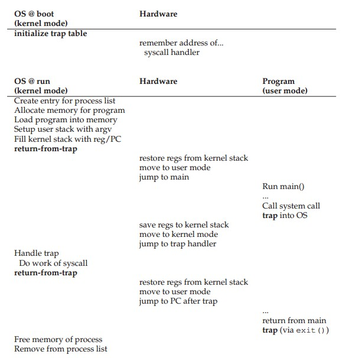
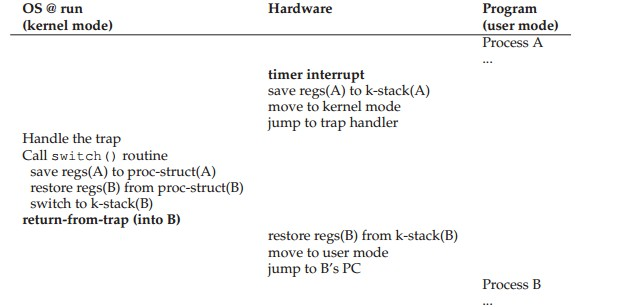
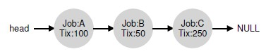
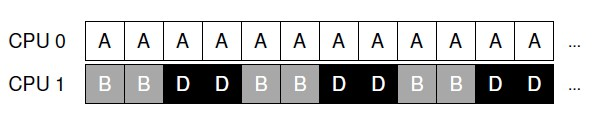

# CPU Virtualization 

## The Process

Time sharing is one of the most basic techniques used by an OS to share a resource. By allowing the resource to be used for a little while by one entity, and then a little while by another, and so forth, the resource in question (e.g., the CPU, or a network link) can be shared by many. 

**Time sharing** of the CPU virtualizes the CPU, which can promote the illusion that many virtual CPUs exist when in fact there is only one physical CPU (or a few).

 ### The Abstraction: A Process 

A process is just a running program. To understand what constitutes a process, we thus have to understand its machine state.

*components of machine state*

1.memory

The memory that the process can address (called its address space) is part of the process. 

2.registers

(1) program counter (PC): which instruction of the program is currently being executed.

(2) stack pointer and associated frame pointer manage the stack for  function parameters, local variables, and return addresses. 

3.I/O information: about persistent storage devices. 

### Process Creation 


1. OS must load its **code and any static data** (e.g., initialized variables) into memory, into the address space of the process.  
2. Some memory must be allocated for the program’s **run-time stack** (or just **stack**). C programs use the stack for local variables, function parameters, and return addresses 
3. The OS may also allocate some memory for the program’s **heap**. In C programs, the heap is used for explicitly requested dynamically allocated data.
4. The OS will also do some other initialization tasks, particularly as related to I/O. 
5.  OS starts the program running at the entry point, namely `main()`.  The OS transfers control of the CPU to the newly-created process, and thus the program begins its execution. 

### Process States 

- **Running**: In the running state, a process is running on a processor.
  This means it is executing instructions.
- **Ready**: In the ready state, a process is ready to run but for some
  reason the OS has chosen not to run it at this given moment
- **Blocked**: In the blocked state, a process has performed some kind of operation that makes it not ready to run until some other event
  takes place. 


### Data Structures 

The OS is a program, and like any program, it has some key data structures that track various relevant pieces of information.  

1.process list

Any OS that has the ability to run multiple programs at once will have something akin to this structure in order to keep track of all the running programs in the system. 

2.Process Control Block (PCB)

It's a C structure that contains information about each process.

## Process API

### The fork() System Call

The process calls the `fork()` system call, which the OS provides as a way to create a new process. 

The odd part: to the OS, it now looks like there are two copies of the program running, and both are about to return from the `fork()` system call. However, the child isn't an *exact* copy. Specifically, although it now has its own copy of the address space (i.e., its own private memory), its own registers, its own PC, and so forth, the value it returns to the caller of `fork()` is different.  

```c
#include <stdio.h>
#include <stdlib.h>
#include <unistd.h>

int main(int argc, char *argv[]) {
    printf("hello, world (pid:%d)\n", (int) getpid());
    int rc = fork();
    if (rc < 0) {
        fprintf(stderr, "fork failed\n");
        exit(1);
    } else if (rc == 0) { // child 
        printf("hello, I am child (pid:%d)\n", (int) getpid());
    } else { // parent
        printf("hello, I am parent of %d (pid:%d)\n", rc, (int) getpid());
    }
}

// output (not deterministic):
// hello world (pid:29146)
// hello, I am parent of 29147 (pid:29146)
// hello, I am child (pid:29147)
```

### The wait() System Call

The parent process calls `wait()` to delay its execution until the child finishes executing. When the child is done, `wait()` returns to the parent. So if the parent does happen to run first, it will immediately call `wait()`; this system call won’t return until the child has run and exited.

```c
#include <stdio.h>
#include <stdlib.h>
#include <unistd.h>

int main(int argc, char *argv[]) {
    printf("hello, world (pid:%d)\n", (int) getpid());
    int rc = fork();
    if (rc < 0) {
        fprintf(stderr, "fork failed\n");
        exit(1);
    } else if (rc == 0) { // child 
        printf("hello, I am child (pid:%d)\n", (int) getpid());
    } else { // parent
        int wc = wait(NULL);
        printf("hello, I am parent of %d (pid:%d)\n", rc, (int) getpid());
    }
}

// output (deterministic):
// hello world (pid:29146)
// hello, I am child (pid:29147)
// hello, I am parent of 29147 (pid:29146)
```

### The exec() System Call

Calling `fork()`is only useful if you want to keep running "copies" of the same program. However, often you want to run a different program; `exec()` does just that.

 Actually, there are six variants of `exec()` in Unix: `execl()`, `execle()`, `execlp()`, `execv()`, and `execvp()`.

`exec()`is quite odd too. What it does:

1. Given the name of an executable, and some arguments, it loads code (and static data) from that executable and overwrites its current code segment (and current static data) with it.
2. The heap and stack and other parts of the memory space of
   the program are re-initialized. 
3. The OS simply runs that program, passing in any arguments as the `argv` of that process.

Thus, it does **not** create a new process; rather, it just transforms the currently running process into a different process. Note that a successful call to `exec()` never returns. 

```c
#include <stdio.h>
#include <stdlib.h>
#include <unistd.h>

int main(int argc, char *argv[]) {
    printf("hello, world (pid:%d)\n", (int) getpid());
    int rc = fork();
    if (rc < 0) {
        fprintf(stderr, "fork failed\n");
        exit(1);
    } else if (rc == 0) { // child 
        printf("hello, I am child (pid:%d)\n", (int) getpid());
        char *myargs[3];
        myargs[0] = strdup("wc"); // program: "wc" (word count)
        myargs[1] = strdup("p3.c"); // argument
        myargs[2] = NULL;
        execvp(myargs[0], myargs);
        printf("this shouldn't print out");
    } else { // parent
        int wc = wait(NULL);
        printf("hello, I am parent of %d (pid:%d)\n", rc, (int) getpid());
    }
}

// output (deterministic):
// hello world (pid:29146)
// hello, I am child (pid:29147)
//  29   107   1030  p3.c
// hello, I am parent of 29147 (pid:29146)
```

The separation of `fork()` and `exec()` is essential in building a UNIX shell, because it lets the shell run code after the call to `fork()` but before the call to `exec()`. 

For example, you then type a command into it; in most cases, the shell then figures out where in the file system the executable resides, calls `fork()` to create a new child process to run the command, calls some variant of `exec()` to run the command, and then waits for the command to complete by calling `wait()`. When the child completes, the shell returns from `wait()` and prints out a prompt again, ready for your next command.

 ## Mechanism: Limited Direct Execution

The OS must virtualize the CPU in an efficient manner while retaining
control over the system. OS developers came up with a technique, which we call **limited direct execution**.

### Restricted Operations 

Direct execution has the obvious advantage of being fast; the program
runs natively on the hardware CPU and thus executes as quickly as one would expect.  But what if the process wishes to performs some kind of restricted operations such as I/O?

The approach we take is to introduce a new processor mode: **user mode.** Code that runs in user mode is restricted in what it can do. In contrast to the user mode is **kernel mode**, which the OS runs in. Code that runs can do what it likes including privileged operations.  

Executing a system call can turn user mode into kernel mode. To execute a system call, a program must execute a special **trap** instruction. This instruction simultaneously jumps into the kernel and raises the privilege level to kernel mode. When finished, the OS calls a
special **return-from-trap** instruction, which returns into the calling user program while simultaneously reducing the privilege level back to user mode. 

To specify the exact system call, a **system-call number** is usually assigned to each system call. The user code is thus responsible for placing the desired system-call number in a register or at a specified location on the stack; the OS, when handling the system call inside the trap handler, examines this number, ensures it is valid, and, if it is, executes the corresponding code. This level of **indirection** serves as a form of protection; user code cannot specify an exact address to jump to, but rather must request a particular service via number.

**LDE Protocol Timeline**



A trap table is a responsible for "remembering" which code to run inside the OS when calling system call and trapping into OS.

### Switching Between Processes

How can the operating system regain control of the CPU so that it can
switch between processes? 

**A Cooperative Approach: Wait For System Call**

The OS regains control of the CPU by waiting for a system call (like opening a file and subsequently reading it) or an illegal operation of some kind (like accessing memory illegally) to take place.  

**A Non-Cooperative Approach: The OS Takes Control**

The cooperative approach brings in a another problem: how can the OS gain control of the CPU even if processes are not being cooperative, for example, a process is stuck in infinite loop? 

A short answer: a **timer interrupt**.A timer device can be programmed to raise an interrupt every so many milliseconds; when the interrupt is raised, the currently running process is halted, and a pre-configured **interrupt handler** in the OS runs. At this point, the OS has regained control of the CPU, and thus can stop the current process and start another. 

The timer is started by OS during the boot time and can also be turned off later.

**Saving and Restoring Context**

After the OS has regained control, it has to decide whether to continue running the currently-running process or switch to different one. If the decision is to switch, the OS executes a low-level piece of code called **context switch**. All the OS has to do is save a few register values for the currently-executing process (onto its kernel stack, for example) and restore a few for the soon-to-be-executing process (from its kernel stack). 

To save the context of the currently-running process, the OS will execute some low-level assembly code to save the **general purpose registers, PC, and the kernel stack pointer** of the currently-running process, and then restore said registers, PC, and switch to the kernel stack for the soon-to-be-executing process. By switching stacks, the kernel enters the call to the switch code in the context of one process (the one that was interrupted) and returns in the context of another (the soon-to-be-executing one). When the OS then finally executes a return-from-trap instruction, the soon-to-be-executing process becomes the currently-running process. 



Note that there are two types of register saves/restores that happen during this protocol. The first is when the timer interrupt occurs; in this case, the **user registers** of the running process are implicitly saved by the **hardware**, using the kernel stack of that process. The second is when the OS decides to switch from A to B; in this case, the **kernel registers** are explicitly saved by the **software** (i.e., the OS), but this time into memory in the process structure of the process. 

## Scheduling Policies  Less Realistic 

### Workload Assumptions

To simplify the problem, we will make the following *unrealistic* assumptions about the processes:

- Each process runs for the same amount of time.
- All processes arrive at the same time.
- Once started, each process runs to completion. 
- All processes only use the CPU (i.e., they perform no I/O)
- The run-time of each process is known.

### Scheduling Metrics 

1.turnaround time 

$$T_{turnaround}=T_{completion}-T_{arrival}$$

Since we have assumed that all processes arrive at the same time, for now $$T_{arrival}=0$$, and hence $$T_{turnaround}=T_{completion}$$. 

Note that turnaround time is a performance metric, which will be our primary focus. 

2.fairness 

Performance and fairness are often at odds in scheduling; a scheduler, for example, may optimize performance but at the cost of preventing a few jobs from running, thus decreasing fairness. 

### FIFO

FIFO is scheduling is simple and thus easy to implement.

But if each process runs for different amount of time, a bad situation will occur where a number of relatively-short potential consumers of a resource get queued behind a heavyweight resource consumer. 

### Shortest Job First (SJF)

Run the shortest job first, then the next shortest, and so on.  

But if each process can arrive at any time, short-run process may wait until long-run process has completed. 

### Shortest Time-to-Completion First (STCF)

To address this concern, we need to relax assumption 3 (that jobs must
run to completion). We also need some machinery within the scheduler itself: timer interrupts and context switching. 

Any time a new job enters the system, the STCF scheduler determines which of the remaining jobs (including the new job) has the least time left, and schedules that one.  

### Round Robin (RR)

**Response Time**

The introduction of time-shared machines changed all that. Now users would sit at a terminal and demand interactive performance from the system as well. And thus, a new metric was born: response time. Response time is defined as the time from when the job arrives in a system to the first time it is scheduled.  

$$T_{response}=T_{firstrun}-T_{arrival}​$$

While great for turnaround time, STCF is quite bad for response time and interactivity.  

**Round Robin**

Instead of running jobs to completion, RR runs a job for a time slice (sometimes called a **scheduling quantum**) and then switches to the next job in the run queue. It repeatedly does so until the jobs are finished. For this reason, RR is sometimes called **time-slicing**. 

Note that the length of a time slice must be a multiple of the timer-interrupt period.

The shorter a time slice is, the better the performance of RR under the response-time metric. However, making the time slice too short is problematic: suddenly the cost of context switching will dominate overall performance. 

### Overlap 

A scheduler clearly has a decision to make when a job initiates an I/O
request, because the currently-running job won’t be using the CPU during the I/O; it is blocked waiting for I/O completion.  

When taking I/O into account, **overlap** is better. CPU is used by one process while waiting for the I/O of another process to complete. By treating each CPU burst as a job, the scheduler makes sure processes that are “interactive” get run frequently. While those interactive jobs are performing I/O, other CPU-intensive jobs run, thus better utilizing the processor. 

## Scheduling Policy: The Multi-Level Feedback Queue

The multi-level feedback queue is an excellent example of a system that learns from the past to predict the future. 

### Basic Rules

MLFQ has a number of distinct **queues**, each assigned a different **priority level**. At any given time, a job that is ready to run is on a single queue. A job with higher priority (i.e., a job on a higher queue) is chosen to run. Of course, more than one job may be on a given queue, and thus have the same priority. In this case, we will just use round-robin scheduling among those jobs. 

- Rule 1: If Priority(A) > Priority(B), A runs.
- Rule 2: If Priority(A) = Priority(B), A & B runs in RR.

Rather than giving a fixed priority to each job, MLFQ varies the priority of a job based on its **observed behavior**. 

### How to Change Priority 

- Rule 3: When a job enters the system, it is placed at the highest priority.
- Rule 4a: If a job uses up an entire time slice while running, its priority is **reduced** (such as CPU-intensive jobs).
- Rule 4b: If a job gives up the CPU before the time slice is up, it stays at the **same** priority level (such as jobs issuing I/O). 

These rules may arise some problems. 

1. Starvation: if there are too many interactive jobs in the system, they will combine to consume **all** CPU time and thus long-running jobs will never receive any CPU time.
2. A smart user could rewrite their program to **game the scheduler**. Gaming the scheduler generally refers to the idea of doing something sneaky to trick the scheduler into giving you more than your fair share of the resource. 

### The Priority Boost 

- Rule 5: After some time period $$S$$, change all the jobs in the system to the highest priority. 

1.Advantage 

(1) Processes are guaranteed not to starve. A job with the highest priority will share the CPU with other high-priority jobs in a RR fashion.

(2) If a CPU-bound job becomes interactive, the scheduler treats it properly once it has received the priority boost. 

2.Disadvantage 

If $$S$$ is set too high, long-running jobs could starve; too low, and interactive jobs may not get a proper share of the CPU.

### Better Accounting 

If we want to prevent gaming of our scheduler, the scheduler should keep track how much a time slice a process used at a given level instead of just forgetting it. 

We thus rewrite Rules 4a and 4b to the following single rule:

- Rule 4: Once a job uses up its time allotment at a given level (regardless of how many times it has given up the CPU), its priority is reduced.

Without any protection from gaming, a process can issue an I/O just before a time slice ends and thus dominate CPU time. With such protections in place, regardless of the I/O behavior of the process, it slowly moves down the queues, and thus cannot gain an unfair share of the CPU.

### Tuning MLFQ And Other Issues 

One big question is how to parameterize such a scheduler. For example, how many queues should there be? How big should the time slice be per queue? How often should priority be boosted in order to avoid starvation and account for changes in behavior?

Unfortunately, there are no easy answers to these questions, and thus only some experience with workloads and subsequent tuning of the scheduler will lead to a satisfactory balance.

### MLFQ: Summary 

MLFQ approach has **multiple levels** of queues, and uses **feedback** to determine the priority of a given job. History is its guide: pay attention to how jobs behave over time and treat them accordingly.

- Rule 1: If Priority(A) > Priority(B), A runs (B doesn’t).
- Rule 2: If Priority(A) = Priority(B), A & B run in RR.
- Rule 3: When a job enters the system, it is placed at the highest priority (the topmost queue).
- Rule 4: Once a job uses up its time allotment at a given level (regardless of how many times it has given up the CPU), its priority is reduced (i.e., it moves down one queue).
- Rule 5: After some time period S, move all the jobs in the system to the topmost queue 

MLFQ can deliver excellent overall performance (similar to SJF/STCF) for short-running interactive jobs and is fair and makes progress for long-running CPU-intensive workloads. 

## Scheduling Policy: Proportional Share

Proportional-share is based around a simple concept: instead of optimizing for turnaround or response time, a scheduler might instead try to guarantee that each job obtain a certain percentage of CPU time.

An excellent modern example of proportional-share scheduling is **lottery scheduling**. The basic idea is quite simple: every so often, hold a lottery to determine which process should get to run next; processes that should run more often should be given more chances to win the lottery.

### Basic Concept: Tickets

Underlying lottery scheduling is one very basic concept: **tickets**, which are used to represent the share of a resource that a process (or user or whatever) should receive. The percent of tickets that a process has represents its share of the system resource in question. 

The scheduler must know how many total tickets there are (in our example, there are 100). The scheduler then picks a winning ticket, which is just a number. Assuming A holds tickets 0 through 74 and B 75 through 99, the winning ticket simply determines whether A or B runs. The scheduler then loads the state of that winning process and runs it.

### Ticket Mechanism 

1.ticket currency 

Currency allows a user with a set of tickets to allocate tickets among their own jobs in whatever currency they would like; the system then automatically converts said currency into the correct global value.

For example, assume users A and B have each been given 100 tickets.
User A is running two jobs, A1 and A2, and gives them each 500 tickets
(out of 1000 total) in User A’s own currency. User B is running only 1 job
and gives it 10 tickets (out of 10 total). The system will convert A1’s and
A2’s allocation from 500 each in A’s currency to 50 each in the global currency; similarly, B1’s 10 tickets will be converted to 100 tickets. The lottery will then be held over the global ticket currency (200 total) to determine which job runs. 

2.ticket transfer

This is useful especially in a C/S setting, where a client process sends a message to a server asking it to do some work on the client's behalf. 

With transfers, a process can temporarily hand off its tickets to another process. When finished, the process which received tickets before transfers the tickets back to the client and all is as before. 

3.ticket inflation 

With inflation, a process can temporarily raise or lower the number of tickets it owns. Inflation can be applied in an environment where a group of processes trust one another; in such a case, if any one process knows it needs more CPU time, it can boost its ticket value as a way to reflect that need to the system, all without communicating with any other processes.

### Implementation of Lottery Scheduling

Let’s assume we keep the processes in a list. Here is an example comprised of three processes, A, B, and C, each with some number of tickets. 



To make a scheduling decision, we first have to pick a random number (the winner) from the total number of tickets (400). Let’s say we pick the number 300. Then, we simply traverse the list, with a simple counter used to help us find the winner.

```c
// counter: used to track if we've found the winner yet
int counter = 0;

// winner: use some call to a random number generator 
// to get a value, between 0 and the total # of tickets
int winner = getrandom(0, totaltickets);

// current: use this to walk through the list of jobs
node_t *current = head;

// loop until the sum of ticket values is > the winner
while (current) {
    counter = counter + current->tickets;
    if (counter > winner) {
        break; // found the winner
    }
    current = current->next;
}
// 'current' is the winner: schedule it
```

To make this process most efficient, it might generally be best to organize the list in descending order. The ordering does not affect the correctness of the algorithm; however, it does ensure in general that the fewest number of list iterations are taken, especially if there are a few processes that possess most of the tickets.

### Stride Scheduling 

Lottery scheduling is random; while random gets us a simple (and approximately correct) scheduler, it occasionally will not deliver the exact right proportions, especially over short time scales. That's why **stride scheduling**, a deterministic fair-share scheduler, comes. 

Each job in the system has a stride, which is inverse in proportion to the number of tickets it has. In our example, with jobs A, B, and C, with 100, 50, and 250 tickets, respectively, we can compute the stride of each by dividing some large number by the number of tickets each process has been assigned. For example, if we divide 10,000 by each of those ticket values, we obtain the following stride values for A, B, and C: 100, 200, and 40. We call this value the **stride** of each process; every time a process runs, we will increment a counter for it (called its pass value) by its stride to track its global progress.

The scheduler then uses the stride and pass to determine which process should run next. The basic idea is simple: at any given time, pick the process to run that has the lowest pass value so far; when you run a process, increment its pass counter by its stride.

```pseudocode
current = remove_min(queue); // pick client with minimum pass
schedule(current); // use resource for quantum
current->pass += current->stride; // compute next pass using stride
insert(queue, current); // put back into the queue
```

Lottery scheduling achieves the proportions probabilistically over time; stride scheduling gets them exactly right at the end of each scheduling cycle.

*So why use lottery scheduling at all instead of stride scheduling?*

Lottery scheduling has one nice property that stride scheduling does not: **no global state**. Imagine a new job enters in the middle of our stride scheduling example above; what should its pass value be? Should it be set to 0? If so, it will monopolize the CPU. With lottery scheduling, there is no global state per process; we simply add a new process with whatever tickets it has, update the single global variable to track how many total tickets we have, and go from there. In this way, lottery  makes it much easier to incorporate new processes in a sensible manner.

### Summary 

Lottery and stride scheduling are wo implementations of proportional-share scheduling. 

Although both are conceptually interesting, they have not achieved wide-spread adoption as CPU schedulers for a variety of reasons. One is that such approaches do not particularly mesh well with I/O; another is that they leave open the hard problem of ticket assignment, i.e., how do you know how many tickets your browser should be allocated?

## Multiprocessor Scheduling

### Background: Multiprocessor Architecture

To understand the new issues surrounding multiprocessor scheduling, we have to understand a new and fundamental difference between single-CPU hardware and multi-CPU hardware. This difference centers around the use of hardware **caches**, and exactly how data is shared across multiple processors.

Caches are thus based on the notion of **locality**, of which there are two kinds: temporal locality and spatial locality. The idea behind temporal locality is that when a piece of data is accessed, it is likely to be accessed again in the near future. The idea behind spatial locality is that if a program accesses a data item at address x, it is likely to access data items near x as well.

### Synchronization

The solution, of course, is to make such routines correct via locking. In this case, allocating a simple mutex and then adding a `lock(&m)` at the beginning of the routine and an `unlock(&m)` at the end will solve the problem, ensuring that the code will execute as desired. Unfortunately, as we will see, such an approach  is not without problems, in particular with regards to performance. Specifically, as the number of CPUs grows, access to a synchronized shared data structure becomes quite slow.

### Cache Affinity

A process, when run on a particular CPU, builds up a fair bit of state in the caches (and TLBs) of the CPU. The next time the process runs, it is often advantageous to run it on the same CPU, as it will run faster if some of its state is already present in the caches on that CPU. If, instead, one runs a process on a different CPU each time, the performance of the process will be worse, as it will have to reload the state each time it runs (note it will run correctly on a different CPU thanks to the cache coherence protocols of the hardware). Thus, a multiprocessor scheduler should consider cache affinity when making its scheduling decisions, perhaps preferring to keep a process on the  same CPU if at all possible.

### Single-Queue Scheduling

The most basic approach is to simply reuse the basic framework for single processor scheduling, by putting all jobs that need to be scheduled into a single queue; we call this single-queue multiprocessor scheduling or **SQMS** for short.

1.advantages

This approach has the advantage of simplicity.

2.disadvantages 

(1) a lack of **scalability**

To ensure the scheduler works correctly on multiple CPUs, the developers will have inserted some form of **locking** into the code. Locks, unfortunately, can greatly reduce performance, particularly as the number of CPUs in the systems grows

(2) cache affinity 

Because each CPU simply picks the next job to run from the globally shared queue, each job ends up bouncing around from CPU to CPU, thus doing exactly the opposite of what would make sense from the standpoint of cache affinity.

### Multi-Queue Scheduling

Some systems opt for multiple queues, e.g., one per CPU. We call this approach multi-queue multiprocessor scheduling (or **MQMS**).

Each queue will likely follow a particular scheduling discipline, such as round robin, though of course any algorithm can be used. When a job enters the system, it is placed on exactly one scheduling queue, according to some heuristic (e.g., random, or picking one with fewer jobs than others). Then it is scheduled essentially **independently**, thus avoiding the problems of information sharing and synchronization found in the single-queue approach.

1.advantages 

(1) As the number of CPUs grows, so too does the number of queues, and thus lock and cache contention should not become a central problem.

(2) Jobs stay on the same CPU and thus reap the advantage of cache affinity.

2.disadavantages

Workload imbalance is the biggest problem. Let's say there is only one job running on CPU 0 and there are two jobs running on CPU 1, both CPU using round-robin policy. The resulting schedule:



How should a multi-queue multiprocessor scheduler handle load imbalance, so as to better achieve its desired scheduling goals? The obvious answer to this query is to move jobs around, a technique which we (once again) refer to as **migration**. By migrating a job from one CPU to another, true load balance can be achieved.

One basic approach is to use a technique known as **work stealing**. With a work-stealing approach, a (source) queue that is low on jobs will occasionally peek at another (target) queue, to see how full it is. If the target queue is (notably) more full than the source queue, the source will “steal” one or more jobs from the target to help balance load.

But if you look around at other queues too often, you will suffer from high overhead and have trouble scaling; if you don't look at other queues very often, you are in dangerous of suffering from severe load imbalance. Finding the right threshold remains, as is common in system policy design, a black art.

# Memory Virtualization

## Address Space 

Address space is the running program’s view of memory in the system. The address space of a process contains all of the memory state of the
running program, such as the **code**, **stack** and **heap**. Heap and stack may grow (and shrink) while the program runs. We put them at opposite ends of the address space so we can allow such growth: they just have to grow in opposite directions.

When the OS virtualizes memory, the running program thinks it is loaded into memory at a particular address (say 0) and has a potentially very large address space. When, for example, process A tries to perform a load at address 0 (which we will call a virtual address), somehow the OS, with some hardware support, will have to make sure the load doesn’t actually go to physical address 0 but rather to physical address 320KB (where A is loaded into memory).

So never forget: if you print out an address in a program, it’s a virtual one, an illusion of how things are laid out in memory; only the OS (and the hardware) knows the real truth.

### VM Goals

1.transparency

The OS should implement virtual memory in a way that is invisible to
the running program. Thus, the program shouldn’t be aware of the fact
that memory is virtualized; rather, the program behaves as if it has its
own private physical memory.

2.efficiency

The OS should strive to make the virtualization as efficient as possible, both in terms of time (i.e., not making programs run much more slowly) and space (i.e., not using too much memory for structures needed to support virtualization).

3.protection

Protection thus enables us to deliver the property of isolation among processes; each process should be running in its own isolated cocoon, safe from the ravages of other faulty or even malicious processes.

## Memory API

### Types of Memory

1.stack memory 

Allocations and deallocations of it are managed *implicitly* by the compiler for you, the programmer.

2.heap memory

All allocations and deallocations are *explicitly* handled by you, programmer.

### The `malloc()`Call

### The `free()`Call

### Memory Leak

No matter what the state of your heap in your address space, the OS takes back all of those pages when the process dies, thus ensuring that no memory is lost despite the fact that you didn’t free it.

Thus, for short-lived programs, leaking memory often does not cause any operational problems. When you write a long-running server (such as a web server or database management system, which never exit), leaked memory is a much bigger issue, and will eventually lead to a crash when the application runs out of memory.

### Underlying OS Support

`malloc`and`free`are not system calls, but rather library calls. Thus the malloc library manages space within your virtual address space, but itself is built on top of some system calls which call into the OS to ask for more memory or release some back to the system.

One such system call is called `brk`, which is used to change the location of the program’s break: the location of the end of the heap. It takes one argument (the address of the new break), and thus either increases or decreases the size of the heap based on whether the new break is larger or smaller than the current break. An additional call `sbrk` is passed an increment but otherwise serves a similar purpose.

