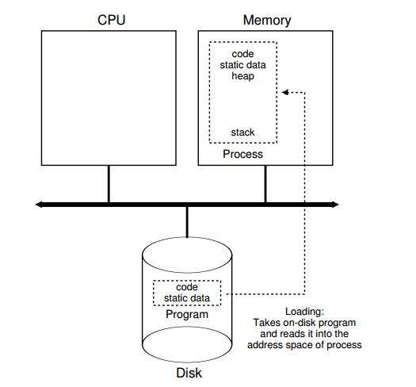
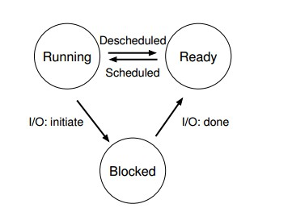

# Virtualization 

## The Process

Time sharing is one of the most basic techniques used by an OS to share a resource. By allowing the resource to be used for a little while by one entity, and then a little while by another, and so forth, the resource in question (e.g., the CPU, or a network link) can be shared by many. 

**Time sharing** of the CPU virtualizes the CPU, which can promote the illusion that many virtual CPUs exist when in fact there is only one physical CPU (or a few).

 ### The Abstraction: A Process 

A process is just a running program. To understand what constitutes a process, we thus have to understand its machine state.

*components of machine state*

1.memory

The memory that the process can address (called its address space) is part of the process. 

2.registers

(1) program counter (PC): which instruction of the program is currently being executed.

(2) stack pointer and associated frame pointer manage the stack for  function parameters, local variables, and return addresses. 

3.I/O information: about persistent storage devices. 

### Process Creation 



1. OS must load its **code and any static data** (e.g., initialized variables) into memory, into the address space of the process.  
2. Some memory must be allocated for the program’s **run-time stack** (or just **stack**). C programs use the stack for local variables, function parameters, and return addresses 
3. The OS may also allocate some memory for the program’s **heap**. In C programs, the heap is used for explicitly requested dynamically allocated data.
4. The OS will also do some other initialization tasks, particularly as related to I/O. 
5.  OS starts the program running at the entry point, namely `main()`.  The OS transfers control of the CPU to the newly-created process, and thus the program begins its execution. 

### Process States 

- **Running**: In the running state, a process is running on a processor.
  This means it is executing instructions.
- **Ready**: In the ready state, a process is ready to run but for some
  reason the OS has chosen not to run it at this given moment
- **Blocked**: In the blocked state, a process has performed some kind of operation that makes it not ready to run until some other event
  takes place. 



### Data Structures 

The OS is a program, and like any program, it has some key data structures that track various relevant pieces of information.  

1.process list

Any OS that has the ability to run multiple programs at once will have something akin to this structure in order to keep track of all the running programs in the system. 

2.Process Control Block (PCB)

It's a C structure that contains information about each process.

## Process API

### The fork() System Call

The process calls the `fork()` system call, which the OS provides as a way to create a new process. 

The odd part: to the OS, it now looks like there are two copies of the program running, and both are about to return from the `fork()` system call. However, the child isn't an *exact* copy. Specifically, although it now has its own copy of the address space (i.e., its own private memory), its own registers, its own PC, and so forth, the value it returns to the caller of `fork()` is different.  

```c
#include <stdio.h>
#include <stdlib.h>
#include <unistd.h>

int main(int argc, char *argv[]) {
    printf("hello, world (pid:%d)\n", (int) getpid());
    int rc = fork();
    if (rc < 0) {
        fprintf(stderr, "fork failed\n");
        exit(1);
    } else if (rc == 0) { // child 
        printf("hello, I am child (pid:%d)\n", (int) getpid());
    } else { // parent
        printf("hello, I am parent of %d (pid:%d)\n", rc, (int) getpid());
    }
}

// output (not deterministic):
// hello world (pid:29146)
// hello, I am parent of 29147 (pid:29146)
// hello, I am child (pid:29147)
```

### The wait() System Call

The parent process calls `wait()` to delay its execution until the child finishes executing. When the child is done, `wait()` returns to the parent. So if the parent does happen to run first, it will immediately call `wait()`; this system call won’t return until the child has run and exited.

```c
#include <stdio.h>
#include <stdlib.h>
#include <unistd.h>

int main(int argc, char *argv[]) {
    printf("hello, world (pid:%d)\n", (int) getpid());
    int rc = fork();
    if (rc < 0) {
        fprintf(stderr, "fork failed\n");
        exit(1);
    } else if (rc == 0) { // child 
        printf("hello, I am child (pid:%d)\n", (int) getpid());
    } else { // parent
        int wc = wait(NULL);
        printf("hello, I am parent of %d (pid:%d)\n", rc, (int) getpid());
    }
}

// output (deterministic):
// hello world (pid:29146)
// hello, I am child (pid:29147)
// hello, I am parent of 29147 (pid:29146)
```

### The exec() System Call

Calling `fork()`is only useful if you want to keep running "copies" of the same program. However, often you want to run a different program; exec()` does just that.

 Actually, there are six variants of `exec()` in Unix: `execl()`, `execle()`, `execlp()`, `execv()`, and `execvp()`.

`exec()`is quite odd too. What it does:

1. Given the name of an executable, and some arguments, it loads code (and static data) from that executable and overwrites its current code segment (and current static data) with it.
2. The heap and stack and other parts of the memory space of
   the program are re-initialized. 
3. The OS simply runs that program, passing in any arguments as the `argv` of that process.

Thus, it does **not** create a new process; rather, it just transforms the currently running process into a different process. Note that a successful call to `exec()` never returns. 

```c
#include <stdio.h>
#include <stdlib.h>
#include <unistd.h>

int main(int argc, char *argv[]) {
    printf("hello, world (pid:%d)\n", (int) getpid());
    int rc = fork();
    if (rc < 0) {
        fprintf(stderr, "fork failed\n");
        exit(1);
    } else if (rc == 0) { // child 
        printf("hello, I am child (pid:%d)\n", (int) getpid());
        char *myargs[3];
        myargs[0] = strdup("wc"); // program: "wc" (word count)
        myargs[1] = strdup("p3.c"); // argument
        myargs[2] = NULL;
        execvp(myargs[0], myargs);
        printf("this shouldn't print out");
    } else { // parent
        int wc = wait(NULL);
        printf("hello, I am parent of %d (pid:%d)\n", rc, (int) getpid());
    }
}

// output (deterministic):
// hello world (pid:29146)
// hello, I am child (pid:29147)
//  29   107   1030  p3.c
// hello, I am parent of 29147 (pid:29146)
```

The separation of `fork()` and `exec()` is essential in building a UNIX shell, because it lets the shell run code after the call to `fork()` but before the call to `exec()`. 

For example, you then type a command into it; in most cases, the shell then figures out where in the file system the executable resides, calls `fork()` to create a new child process to run the command, calls some variant of `exec()` to run the command, and then waits for the command to complete by calling `wait()`. When the child completes, the shell returns from `wait()` and prints out a prompt again, ready for your next command. 

 