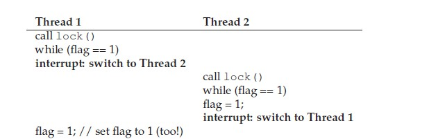
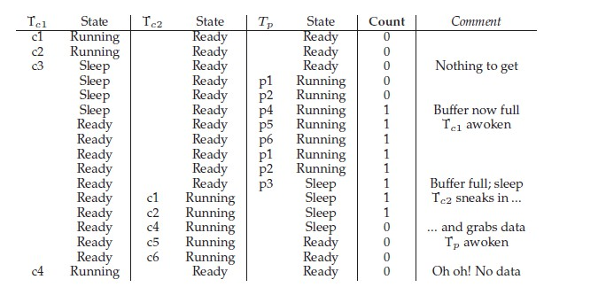
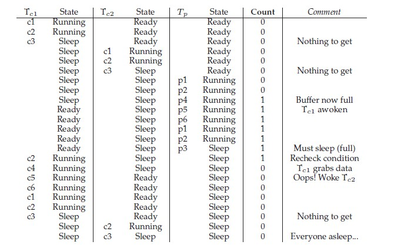
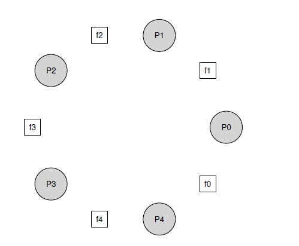

# Concurrency

## Introduction

A multi-threaded program has more than one point of execution (i.e., multiple PCs, each of which is being fetched and executed from). Perhaps another way to think of this is that each thread is very much like a separate process, except for one difference: they share the same address space and thus can access the same data.

Each thread has its own private set of registers it uses for computation; thus, if there are two threads that are running on a single processor, when switching from running one (T1) to running the other (T2), a context switch must take place. We’ll need one or more **thread control blocks** (**TCB**s) to store the state of each thread of a process. 

There is one major difference, though, in the context switch we perform between threads as compared to processes: the address space remains the same (i.e., there is no need to switch which page table we are using).

One other major difference between threads and processes concerns the stack. In a multi-threaded process, each thread runs independently and of course may call into various routines to do whatever work it is doing. Instead of a single stack in the address space, there will be one per thread.

### Why Use Threads?

1.parallelization

The task of transforming your standard single-threaded program into a program that does this sort of work on multiple CPUs is called parallelization, and using a thread per CPU to do this work is a natural and typical way to make programs run faster on modern hardware.

2.avoiding blocking program progress

Threading enables overlap of I/O with other activities **within** a single program, much like multiprogramming did for processes across programs.

### The Heart Of The Problem: Uncontrolled Scheduling

1.race condition

The results depend on the timing execution of the code. With some bad luck (i.e., context switches that occur at untimely points in the execution), we get the wrong result. In fact, we may get a different result each time; thus, instead of a nice **deterministic** computation (which we are used to from computers), we call this result **indeterminate**, where it is not known what the output will be and it is indeed likely to be different across runs.

2.critical section

A critical section is a piece of code that accesses a shared variable (or more generally, a shared resource) and **must not be** concurrently executed by more than one thread.

3.mutual execution

This property guarantees that if one thread is executing within the critical section, the others will be prevented from doing so.

### Atomicity  

Atomically, in this context, means “as a unit”, which sometimes we take as “all or none.” When an interrupt occurs, either the instruction has not run at all, or it has run to completion; there is no in-between state.

Instead of asking for some "atomic instructions", what we will instead do is ask the hardware for a few useful instructions upon which we can build a general set of what we call **synchronization primitives**. By using these hardware synchronization primitives, in combination with some help from the operating system, we will be able to build multi-threaded code that accesses critical sections in a synchronized and controlled manner, and thus reliably produces the correct result despite the challenging nature of concurrent execution.

## Locks

Programmers annotate source code with locks, putting them around critical sections, and thus ensure that any such critical section executes as if it were a single atomic instruction.

### The Basic Idea

To use a lock, we may add some code around the critical section like this:

```c
lock_t mutex;
lock(&mutex);
// a critical section 
unlock(&mutex);
```

A lock is just a variable, and thus to use one, you must declare a lock variable of some kind (such as mutex above). This lock variable (or just “lock” for short) holds the state of the lock at any instant in time.

Calling the routine `lock()` tries to acquire the lock; if no other thread holds the lock (i.e., it is free), the thread will acquire the lock and enter the critical section; this thread is sometimes said to be the owner of the lock. If another thread then calls `lock()` on that same lock variable (mutex in this example), it will not return while the lock is held by another thread; in this way, other threads are prevented from entering  the critical section while the first thread that holds the lock is in there.

Once the owner of the lock calls `unlock()`, the lock is now available (free) again. If no other threads are waiting for the lock (i.e., no other thread has called `lock()` and is stuck therein), the state of the lock is simply changed to free. If there are waiting threads (stuck in `lock()`), one of them will (eventually) notice (or be informed of) this change of the lock’s state, acquire the lock, and enter the critical section.

*Building A Lock*

How can we build an efficient lock? What hardware support is needed? What OS support?

### Evaluating Locks

To evaluate whether a lock works (and works well), we should first establish some basic criteria.

1.mutual exclusion

Basically, does the lock work, preventing multiple threads from entering a critical section?

2.fairness

Does each thread contending for the lock get a fair shot at acquiring it once it is free?

3.performance

When a single thread is running and grabs and releases the lock, what is the overhead of doing so?

In a case where multiple threads are contending for the lock on a single CPU, are there performance concerns?

How does the lock perform when there are multiple CPUs involved, and threads on each contending for the lock?

### Controlling Interrupts

One of the earliest solutions used to provide mutual exclusion was to disable interrupts for critical sections; this solution was invented for single-processor systems. 

By turning off interrupts (using some kind of special hardware instruction) before entering a critical section, we ensure that the code inside the critical section will not be interrupted, and thus will execute as if it were atomic.

*advantages*

It's simple.

*disadvantages*

1. This approach requires us to allow any calling thread to perform a privileged operation (turning interrupts on and off), and thus trust that this facility is not abused. 
2. If multiple threads are running on different CPUs, and each try to enter the same critical section, it does not matter whether interrupts are disabled; threads will be able to run on other processors, and thus could enter the critical section.
3. Turning off interrupts for extended periods of time can lead to interrupts becoming lost, which can lead to serious systems problems.
4. Compared to normal instruction execution, code that masks or unmasks interrupts tends to be executed slowly by modern CPUs.

### Hardware Support: Synchronization Primitives

#### Test And Set (Atomic Exchange)

```c
typedef struct __lock_t {int flag;} lock_t;

void init(lock_t *mutex) {
    // 0 -> lock is available, 1 -> held
    mutex->flag = 0;
}

void lock(lock_t *mutex) {
    while (mutext->flag == 1) {
        // spin-waiting (do nothing)
    }
    mutex->flag = 1;
}

void unlock(lock_t *mutex) {
    mutex->flag = 0;
}
```

This idea is also simple. Unfortunately, the code has two problems: one of correctness, and another of performance.

1.correctness

Assuming `flag = 0`to begin, and now there are two threads running.



As you can see from this interleaving, with timely (untimely?) interrupts, we can easily produce a case where both threads set the flag to 1 and both threads are thus able to enter the critical section.

2.performance

**Spin-waiting** wastes time waiting for another thread to release a lock. The waste is exceptionally high on a uniprocessor, where the thread that the waiter is waiting for cannot even run (at least, until a context switch occurs).

*Implementation: Building A Working Spin Lock*

While the idea behind the example above is a good one, it is not possible to implement without some support from the hardware. Such instruction is often referred to as **test-and-set**. 

```c
int TestAndSet(int *old_ptr, int new) {
    int old = *old_ptr;
    *old_ptr = new;
    return old;
}
```

By making both the **test** (of the old lock value) and **set** (of the new value) a single atomic operation, we ensure that only one thread acquires the lock. And that’s how to build a working mutual exclusion primitive.

```c
typedef struct __lock_t {int flag;} lock_t;

void init(lock_t *mutex) {
    // 0 -> lock is available, 1 -> held
    mutex->flag = 0;
}

void lock(lock_t *mutex) {
    while (TestAndSet(&lock->flag, 1) == 1) {
        // spin-waiting (do nothing)
    }
}

void unlock(lock_t *mutex) {
    mutex->flag = 0;
}
```

To work correctly on a single processor, it requires a preemptive scheduler (i.e., one that will interrupt a thread via a timer, in order to run a different thread, from time to time). Without preemption, spin locks don’t make much sense on a single CPU, as a thread spinning on a CPU will never relinquish it.

*Evaluating Spin Locks*

1.correctness 

Yes, the spin lock only allows a single thread to enter the critical section at a time.

2.fairness

Spin locks don’t provide any fairness guarantees. Indeed, a thread spinning may spin forever, under contention. Spin locks are not fair and may lead to starvation.

3.performance

In the single CPU case, performance overheads can be quite painful; imagine the case where the thread holding the lock is pre-empted within a critical section. The scheduler might then run every other thread (imagine there are N − 1 others), each of which tries to acquire the lock. In this case, each of those threads will spin for the duration of a time slice before giving up the CPU, a waste of CPU cycles.

On multiple CPUs, spin locks work reasonably well (if the number of threads roughly equals the number of CPUs).

#### Compare-And-Swap

```c
int CompareAndSwap(int *ptr, int expected, int new) {
    int actual = *ptr;
    if (actual == expected) {
        *ptr = new;
    }
    return actual;
}
```

The basic idea is for compare-and-swap to test whether the value at the address specified by `ptr` is equal to expected; if so, update the memory location pointed to by `ptr` with the new value. If not, do nothing. In either case, return the actual value at that memory location, thus allowing the code calling compare-and-swap to know whether it succeeded or not.

With the compare-and-swap instruction, we can build a lock in a  manner quite similar to that with test-and-set. 

```c
void lock(lock_t *lock) {
    while (CompareAndSwap(&lock->flag, 0, 1) == 1) {
        // spin
    }
}
```

#### Load-Linked And Store-Conditional

```pseudocode
int LoadLinked(int *ptr) {
    return *ptr;
}

int StoreConditional(int *ptr, int value) {
    if (no one has updated *ptr since the LoadLinked to this address) {
        *ptr = value;
        return 1; // success!
    } else {
        return 0; // failed to update
    }
}
```

Build a lock using load-linked and store-conditional:

```pseudocode
void lock(lock_t *lock) {
    while (1) {
        while (LoadLinked(&lock->flag) == 1) {
            // spin
        }
        if (StoreConditional(&lock->flag, 1) == 1) {
            return; // if set-it-to-1 was success: all done
            	   // otherwise: try it all over again
        }
    }
}

void unlock(lock_t *lock) {
    lock->flag = 0;
}
```

First, a thread spins waiting for the flag to be set to 0 (and thus indicate the lock is not held). Once so, the thread tries to acquire the lock via the store-conditional; if it succeeds, the thread has atomically changed the flag’s value to 1 and thus can proceed into the critical section.

#### Fetch-And-Add

fetch-and-add instruction atomically increments a value while returning the old value at a particular address. 

```pseudocode
int FetchAndAdd(int *ptr) {
    int old = *ptr;
    *ptr = old + 1;
    return old;
}
```

In this example, we’ll use fetch-and-add to build a more interesting **ticket lock**.

```pseudocode
typedef struct __lock_t {
    int ticket;
    int turn;
} lock_t;

void lock_init(lock_t *lock) {
    lock->ticket = 0;
    lock->turn = 0;
}

void lock(lock_t *lock) {
    int myturn = FetchAndAdd(&lock->ticket);
    while (lock->turn != myturn) {
        // spin
    }
}

void unlock(lock_t *lock) {
    lock->turn = lock->turn + 1;
}
```

When a thread wishes to acquire a lock, it first does an atomic fetch and-add on the ticket value; that value is now considered this thread’s “turn” (`myturn`). The globally shared `lock->turn` is then used to determine which thread’s turn it is; when (`myturn == turn`) for a given thread, it is that thread’s turn to enter the critical section. Unlock is accomplished simply by incrementing the turn such that the next waiting thread (if there is one) can now enter the critical section. 

Note one important difference with this solution versus our previous attempts: it ensures progress for all threads. Once a thread is assigned its ticket value, it will be scheduled at some point in the future (once those in front of it have passed through the critical section and released the lock).

### OS Support 

How can we develop a lock that doesn’t needlessly waste time spinning on the CPU?

#### Yield

We assume an operating system primitive `yield()` which a thread can call when it wants to give up the CPU and let another thread run. yield is simply a system call that moves the caller from the **running** state to the **ready** state, and thus promotes another thread to running. Thus, the yielding process essentially deschedules itself. 

Let us now consider the case where there are many threads (say 100) contending for a lock repeatedly. In this case, if one thread acquires the lock and is preempted before releasing it, the other 99 will each call lock(), find the lock held, and yield the CPU. Assuming some kind of round-robin scheduler, each of the 99 will execute this run-and-yield pattern before the thread holding the lock gets to run again. While better than our spinning approach (which would waste 99 time slices spinning), this approach is still costly; the cost of a context switch can be substantial, and there is thus plenty of waste.

#### Using Queues: Sleeping Instead Of Spinning

We must explicitly exert some control over which thread next gets to acquire the lock after the current holder releases it. To do this, we will need a little more OS support, as well as a queue to keep track of which threads are waiting to acquire the lock.

`park()` to put a calling thread to sleep, and `unpark(threadID)` to wake a particular thread as designated by `threadID`. These two routines can be used in tandem to build a lock that puts a caller to sleep if it tries to acquire a held lock and wakes it when the lock is free.

However, with just the wrong timing, a thread will be about to park, assuming that it should sleep until the lock is no longer held. A switch at that time to another thread (say, a thread holding the lock) could lead to trouble, for example, if that thread then released the lock. The subsequent park by the first thread would then sleep forever (potentially), a problem sometimes called the **wakeup/waiting race**.

Solaris solves this problem by adding a third system call: `setpark()`. By calling this routine, a thread can indicate it is about to `park`. If it then happens to be interrupted and another thread calls `unpark` before `park` is actually called, the subsequent `park` returns immediately instead of sleeping.

### Two-Phase Locks

A two-phase lock realizes that spinning can be useful, particularly if the lock is about to be released. So in the first phase, the lock spins for a while, hoping that it can acquire the lock. However, if the lock is not acquired during the first spin phase, a second phase is entered, where the caller is put to sleep, and only woken up when the lock becomes free later.

## Lock-based Concurrent Data Structure

Adding locks to a data structure to make it usable by threads makes the structure **thread safe**. When given a particular data structure, how should we add locks to it, in order to make it work correctly?

There is always a standard method to make a concurrent data structure: add a big lock.

### Concurrent Counters 

#### Simple But Not Scalable

```pseudocode
type struct __count_t {
    int value;
    mutex lock;
} counter_t;

void init(counter_t *c) {
    c->value = 0;
    mutex_init(&c->lock);
}

void increment(counter_t *c) {
	mutex_lock(&c->lock);
	c->value++;
	mutex_unlock(&c->lock);
}

int get(counter_t *c) {
    mutex_lock(&c->lock);
    int rc = c->value;
    mutex_unlock(&c->lock);
    return rc;
}
```

This concurrent counter is simple and works correctly. In fact, it follows a design pattern common to the simplest and most basic concurrent data structures: it simply adds a single lock, which is acquired when calling a routine that manipulates the data structure, and is released when returning from the call.

However, the more threads you have, the more time your job takes.

#### Scalable Counting: Sloppy Counter

The sloppy counter works by representing a single logical counter via numerous *local* physical counters, one per CPU core, as well as a single *global* counter. There are also locks: one for each local counter, and one for the global counter.

When a thread running on a given core wishes to increment the counter, it increments its local counter; access to this local counter is synchronized via the corresponding local lock. Because each CPU has its own local counter, threads across CPUs can update local counters without contention, and thus counter updates are scalable. However, to keep the global counter up to date (in case a thread wishes to read its value), the local values are periodically transferred to the global counter, by acquiring the global lock and incrementing it by the local counter’s value; the local counter is then reset to zero. 

How often this local-to-global transfer occurs is determined by a threshold, which we call S here (for sloppiness). If S is low, performance is poor (but the global count is always quite accurate); if S is high, performance is excellent, but the global count lags (by at most the number of CPUs multiplied by S). This accuracy/performance tradeoff is what sloppy counters enables.

### Concurrent Linked Lists

We can rearrange the code a bit so that the lock and release only surround the actual critical section in the insert code, and that a common exit path is used in the lookup code. The former works because part of the lookup actually need not be locked; assuming that `malloc()` itself is thread-safe, each thread can call into it without worry of race conditions or other concurrency bugs. Only when updating the shared list does a lock need to be held.

```c
typedef struct __node_t {
    int key;
    struct __node_t *next;
} node_t;

typedef struct __list_t {
    node_t *head;
    pthread_mutex_t lock;
} list_t;

void List_Init(list_t *L) {
    L->head = NULL;
    pthread_mutex_init(&L->lock, NULL);
}

int List_Insert(list_t *L, int key) {
    pthread_mutex_lock(&L->lock);
    node_t *new = malloc(sizeof(node_t));
    if (new == NULL) {
        perror("malloc");
        pthread_mutex_unlock(&L->lock);
        return -1;
    }
    new->key = key;
    new->next = L->head;
    L->head = new;
    pthread_mutex_unlock(&L->lock);
    return 0;
}

int List_Lookup(list_t *L, int key) {
    pthread_mutex_lock(&L->lock);
    mode_t *curr = L->head;
    while (curr) {
        if (curr->key == key) {
            pthread_mutex_unlock(&L->lock);
            return 0;
        }
        curr = curr->next;
    }
    pthread_mutex_unlock(&L->lock);
    return -1;
}
```

#### Scaling Linked Lists

The idea is pretty simple. Instead of having a single lock for the entire list, you instead add a lock per node of the list. When traversing the list, the code first grabs the next node’s lock and then releases the current node’s lock.

However, in practice, it is hard to make such a structure faster than the simple single lock approach, as the overheads of acquiring and releasing locks for each node of a list traversal is prohibitive. Even with very large lists, and a large number of threads, the concurrency enabled by allowing multiple ongoing traversals is unlikely to be faster than simply grabbing a single lock, performing an operation, and releasing it.

### Concurrent Queues

There are two locks, one for the head of the queue, and one for the tail. The goal of these two locks is to enable concurrency of enqueue and dequeue operations. In the common case, the enqueue routine will only access the tail lock, and dequeue only the head lock.

```c
typedef struct __node_t {
    int value;
    struct __node_t *next;
} node_t;

typedef struct __queue_t {
    node_t *head;
    node_t *tail;
    pthread_mutex_t headLock;
    pthread_mutex_t tailLock;
} queue_t;

void Queue_Init(queue_t *q) {
    node_t *tmp = malloc(sizeof(node_t));
    tmp->next = NULL;
    q->head = q->tail = NULL;
    pthread_mutex_init(&q->headLock, NULL);
    pthread_mutex_init(&q->tailLock, NULL);
}

void Queue_Enqueue(queue_t *q, int value) {
    node_t *tmp = malloc(sizeof(node_t));
    assert(tmp != NULL);
    tmp->value = value;
    tmp->next = NULL;
    
    pthread_mutex_lock(&q->tailLock);
    q->tail->next = tmp;
    q->tail = tmp;
    pthread_mutex_unlock(&q->tailLock);
}

void Queue_Dequeue(queue_t *q, int *value) {
    pthread_mutex_lock(&q->headLock);
    node_t *tmp = q->head;
    node_t *newHead = tmp->next;
    if (newHead == NULL) {
        pthread_mutex_unlock(&q->headLock);
        return -1; // queue was empty
    }
    *value = newHead->value;
    q->head = newHead;
    pthread_mutex_unlock(&q->headLock);
    free(tmp);
    return 0;
}
```

### Concurrent Hash Table

This concurrent hash table uses a lock per hash bucket (each of which is represented by a list). Doing so enables many concurrent operations to take place.

```c
#define BUCKETS (101)

typedef struct __hash_t {
    list_t lists[BUCKETS];
} hash_t;

void Hash_Init(hash_t *H) {
    int i;
    for (i = 0; i < BUCKETS; i++) {
        List_Init(&H->lists[i]);
    }
}

int Hash_Insert(hash_t *t, int key) {
    int bucket = key % BUCKETS;
    return List_Insert(&H->lists[bucket], key);
}

int Hash_Lookup(hash_t *H, int key) {
    int bucket = key % BUCKETS;
    return List_Lookup(&H->lists[bucket], key);
}
```

## Condition Variables

Condition variables are also important synchronization primitive. In multi-threaded programs, it is often useful for a thread to wait for some condition to become true before proceeding. The simple approach, of just spinning until the condition becomes true, is grossly inefficient and wastes CPU cycles, and in some cases, can be incorrect. Thus, how should a thread wait for a condition?

### Definition and Routines 

A **condition variable** is an explicit queue that threads can put themselves on when some state of execution (i.e., some condition) is not as desired (by waiting on the condition). A condition variable has two  operations associated with it: `wait()` and `signal()`. The `wait()` call is executed when a thread wishes to put itself to sleep; the `signal()` call is executed when a thread has changed something in the program and thus wants to wake a sleeping thread waiting on this condition.

**Hold the lock when calling signal or wait**, and you will always be in good shape.

### The Producer/Consumer (Bounded Buffer) Problem

Producers generate data items and place them in a buffer; consumers grab said items from the buffer and consume them in some way.

For simplicity, assume that the size of buffer is 1. 

#### A Broken Solution

```c
cond_t cond;
mutex_t mutex;

void *producer(void *arg) {
    int i;
    for (i = 0; i < loops; i++) {
        pthread_mutex_lock(&cond, &mutex);     // p1
        if (count == 1) {                      // p2
            pthread_cond_wait(&cond, &mutex);  // p3
        }
        put(1);                                // p4
        pthread_cond_signal(&cond);            // p5
        pthread_mutex_unlock(&mutex);          // p6
    }
}

void *consumer(void *arg) {
    int i;
    for (i = 0; i < loops; i++) {
        pthread_mutex_lock(&mutex);            // c1
        if (count == 0) {                      // c2
            pthread_cond_wait(&cond, &mutex);  // c3
        }
        int tmp = get();                       // c4
        pthread_cond_signal(&cond);            // c5
        pthread_mutex_unlock(&mutex);          // c6
    }
}
```

*Problem*



The problem arises for a simple reason: after the producer woke Tc1, but before Tc1 ever ran, the state of the bounded buffer changed (thanks to Tc2). Signaling a thread only wakes them up; it is thus a hint that the state of the world has changed (in this case, that a value has been placed in the buffer), but there is no guarantee that when the woken thread runs, the state will still be as desired. This interpretation of what a signal means is often referred to as Mesa semantics.

#### Better, But Still Broken: While, Not If

Thanks to Mesa semantics, a simple rule to remember with condition variables is to **always use while loops**. 

```c
cond_t cond;
mutex_t mutex;

void *producer(void *arg) {
    int i;
    for (i = 0; i < loops; i++) {
        pthread_mutex_lock(&cond, &mutex);     // p1
        while (count == 1) {                      // p2
            pthread_cond_wait(&cond, &mutex);  // p3
        }
        put(1);                                // p4
        pthread_cond_signal(&cond);            // p5
        pthread_mutex_unlock(&mutex);          // p6
    }
}

void *consumer(void *arg) {
    int i;
    for (i = 0; i < loops; i++) {
        pthread_mutex_lock(&mutex);            // c1
        while (count == 0) {                      // c2
            pthread_cond_wait(&cond, &mutex);  // c3
        }
        int tmp = get();                       // c4
        pthread_cond_signal(&cond);            // c5
        pthread_mutex_unlock(&mutex);          // c6
    }
}
```

*Problem*



Because the consumer has emptied the buffer, it clearly should wake the producer. However, if it wakes the consumer Tc2 (which is definitely possible, depending on how the wait queue is managed), we have a problem. Specifically, the consumer Tc2 will wake up and find the buffer empty (c2), and go back to sleep (c3). The producer Tp, which has a value to put into the buffer, is left sleeping. The other consumer thread, Tc1, also goes back to sleep. All three threads are left sleeping.

#### The Single Buffer Producer/Consumer Solution

In the code above, producer threads wait on the condition empty, and signals fill. Conversely, consumer threads wait on fill and signal empty. A consumer should not wake other consumers, only producers, and vice-versa.

```c
cond_t empty, fill;
mutex_t mutex;

void *producer(void *arg) {
    int i;
    for (i = 0; i < loops; i++) {
        pthread_mutex_lock(&cond, &mutex);     // p1
        while (count == 1) {                      // p2
            pthread_cond_wait(&empty, &mutex);  // p3
        }
        put(1);                                // p4
        pthread_cond_signal(&fill);            // p5
        pthread_mutex_unlock(&mutex);          // p6
    }
}

void *consumer(void *arg) {
    int i;
    for (i = 0; i < loops; i++) {
        pthread_mutex_lock(&mutex);            // c1
        while (count == 0) {                      // c2
            pthread_cond_wait(&fill, &mutex);  // c3
        }
        int tmp = get();                       // c4
        pthread_cond_signal(&empty);            // c5
        pthread_mutex_unlock(&mutex);          // c6
    }
}
```

#### The Final Producer/Consumer Solution
Specifically, we add more buffer slots, so that multiple values can be produced before sleeping, and similarly multiple values can be consumed before sleeping. With just a single producer and consumer, this approach is more efficient as it reduces context switches; with multiple producers or consumers (or both), it even allows concurrent producing or consuming to take place, thus increasing concurrency.

```c
int buffer[MAX];
int fill_ptr = 0;
int use_ptr = 0;
int count = 0;

void put(int value) {
    buffer[fill_ptr] = value;
    fill_ptr = (fill_ptr + 1) % MAX;
    count++;
}

int get() {
    int tmp = buffer[use_ptr];
    use_ptr = (use_ptr + 1) % MAX;
    count--;
    return tmp;
}

cond_t empty, fill;
mutex_t mutex;

void *producer(void *arg) {
    int i;
    for (i = 0; i < loops; i++) {
        pthread_mutex_lock(&cond, &mutex);     // p1
        while (count == MAX) {                      // p2
            pthread_cond_wait(&empty, &mutex);  // p3
        }
        put(1);                                // p4
        pthread_cond_signal(&fill);            // p5
        pthread_mutex_unlock(&mutex);          // p6
    }
}

void *consumer(void *arg) {
    int i;
    for (i = 0; i < loops; i++) {
        pthread_mutex_lock(&mutex);            // c1
        while (count == 0) {                      // c2
            pthread_cond_wait(&fill, &mutex);  // c3
        }
        int tmp = get();                       // c4
        pthread_cond_signal(&empty);            // c5
        pthread_mutex_unlock(&mutex);          // c6
    }
}
```

### Covering Conditions

Covering condition covers all the cases where a thread needs to wake up (conservatively); the cost is that too many threads might be woken.

Replace the `pthread_cond_signal()` call in the code above with a call to `pthread_cond_broadcast()`, which wakes up all waiting threads. By doing so, we guarantee that any threads that should be woken are. The downside, of course, can be a negative performance impact, as we might needlessly wake up many other waiting threads that shouldn’t (yet) be awake. Those threads will simply wake up, re-check the condition, and then go immediately back to sleep.

In general, if you find that your program only works when you change your signals to broadcasts (but you don’t think it should need to), you probably have a bug; fix it! But in cases like the memory allocator above, broadcast may be the most straightforward solution available.

## Semaphores

Dijkstra and colleagues invented the **semaphore** as a single primitive for all things related to synchronization; one can use semaphores as both locks and condition variables.

### Semaphores: A Definition

A semaphore is an object with an integer value that we can manipulate with two routines; in the POSIX standard, these routines are `sem_ wait() `and `sem_post()` (historically, these two terms were called `P()`and`V()`respectively). Because the initial value of the semaphore determines its behavior, before calling any other routine to interact with the semaphore, **we must first initialize it to some value**.

```c
int sem_wait(sem_t *s) {
    // decrement the value of semaphore s by one
    // wait if value of semaphore s is negative
}

int sem_post(sem_t *s) {
    // increment the value of semaphore s by one
    // if there are one or more threads waiting, wake one
}
```

*Something Important*

1. Multiple calling threads may call into `sem_wait()`, and thus all be queued waiting to be woken.
2. `sem_post()` does not wait for some particular condition to hold like `sem_wait()`does. Rather, it simply increments the value of the semaphore and then, if there is a thread waiting to be woken, wakes one of them up.
3. The value of the semaphore, when negative, is equal to the number of waiting threads.

### Binary Semaphores (Locks)

If we want to use semaphores as locks, we need to initialize semaphores to **1**. Because locks only have two states (held and not held), we sometimes call a semaphore used as a lock a binary semaphore. Note that if you are using a semaphore only in this binary fashion, it could be implemented in a simpler manner than the generalized semaphores we present here.

```c
sem_t m;
sem_init(&m, 0, 1);

sem_wait(&m);
// critical section
sem_post(&m);
```

### Semaphores As Condition Variables

```c
sem-t s;

void *child(void *arg) {
    //...
    se_post(&s); // signal
    return NULL;
}

int main() {
    sem_init(&s, 0, 0);
    //...
    pthread_t c;
    pthread_create(c, NULL, child, NULL);
    sem_wait(&s); // wait
    //...
    return 0;
}
```

The value of semaphore should be set to 0 at first. 

First, let us assume that the parent creates the child but the child has not run yet (i.e., it is sitting in a ready queue but not running). In this case , the parent will call `sem_wait()` before the child has called `sem_post()`; we’d like the parent to wait for the child to run. The only way this will happen is if the value of the semaphore is not greater than 0; hence, 0 is the initial value. The parent runs, decrements the semaphore (to -1), then waits (sleeping). When the child finally runs, it will call `sem_ post()`, increment the value of the semaphore to 0, and wake the parent, which will then return from `sem_wait()` and finish the program.

The second case occurs when the child runs to completion before the parent gets a chance to call `sem_wait()`. In this case, the child will first call `sem_post()`, thus incrementing the value of the semaphore from 0 to  1. When the parent then gets a chance to run, it will call `sem_wait()` and find the value of the semaphore to be 1; the parent will thus decrement the value (to 0) and return from `sem_wait()` without waiting, also achieving the desired effect.

### The Producer/Consumer (Bounded Buffer) Problem

```c
int buffer[MAX];
int fill = 0;
int use = 0;

void put(int value) {
    buffer[fill] = value;
    fill = (fill + 1) % MAX;
}

int get() {
    int tmp = buffer[use];
    use = (use + 1) % MAX;
    return tmp;
}

sem_t empty;
sem_t full;
sem_t mutex;

void *producer(void *arg) {
    int i;
    for (i = 0; i < loops; i++) {
        sem_wait(&empty);
        sem_wait(&mutex); // put mutual exclusion just around the critical section
        // or it may cause deadlock
        put(1);
        sem_post(&mutex);
        sem_post(&full);
    }
}

void *consumer(void *arg) {
    int i;
    for (i = 0; i < loops; i++) {
        sem_wait(&full);
        sem_wait(&mutex);
        int tmp = get();
        sem_post(&mutex);
        sem_post(&empty);
    }
}
```

### Reader-Writer Locks

If some thread wants to update the data structure in question, it should acquire a write lock, and release it. Internally, these simply use the `writelock` semaphore to ensure that only a single writer can acquire the lock and enter the critical section to update the data structure in question.

When acquiring a read lock, the reader first acquires lock and then increments the readers variable to track how many readers are currently inside the data structure. The important step then taken within `rwlock` acquire occurs when the first reader acquires the lock; in that case, the reader also acquires the write lock on the `writelock`semaphore, and then finally releasing the lock Thus, once a reader has acquired a read lock, more readers will be allowed to acquire the read lock too; however, any thread that wishes to acquire the write lock will have to wait until **all** readers are finished; the last one to exit the critical section enables a waiting writer to acquire the lock.

However, it would be relatively easy for readers to starve writers.

```c
typedef struct _rwlock_t {
    sem_t lock; // basic lock
    sem_t writelock; // used to allow ONE writer ot MANY readers
    int readers; // count of readers in critical section
} rwlock_t;

void rwlock_init(rwlock_t *rw) {
    rw->readers = 0;
    sem_init(&rw->lock, 0, 1);
    sem_init(&rw->writelock, 0, 1);
}

void rwlock_acquire_readlock(rwlock_t *rw) {
    sem_wait(&rw->lock);
    rw->readers++;
    if (rw->readers == 1) {
        sem_wait(&rw->writelock); // first reader acquires writelock
    }
    sem_post(&rw->lock);
}

void rwlock_release_readlock(rwlock_t *rw) {
    sem_wait(&rw->lock);
    rw->readers--;
    if (rw->readers == 0) {
        sem_post(&rw->writelock); // last reader releases the writelock
    }
    sem_post(&rw->lock);
}

void rwlock_acquire_writelock(rwlock_t *rw) {
    sem_wait(&rw->writelock);
}

void rwlock_release_writelock(rwlock_t *rw) {
    sem_post(&rw->writelock);
}
```

### The Dining Philosophers

The basic setup for the problem is this (as shown below): assume there are five “philosophers” sitting around a table. Between each pair of philosophers is a single fork (and thus, five total). The philosophers each have times where they think, and don’t need any forks, and times where they eat. In order to eat, a philosopher needs two forks, both the one on their left and the one on their right. The contention for these forks, and the synchronization problems that ensue, are what makes this a problem we study in concurrent programming.



We’ll use a few helper functions to get us towards a solution. They are:

```c
int left(int p) {
    return p;
}

int right(int p) {
    return (p + 1) % 5;
}
```

When philosopher p wishes to refer to the fork on their left, they simply call left(p). Similarly, the fork on the right of a philosopher p is referred to by calling right(p); the modulo operator therein handles the one case where the last philosopher (p=4) tries to grab the fork on their right, which is fork 0.

Also, we need five semaphores for each fork.

#### Broken Solution

To acquire the forks, we simply grab a “lock” on each one: first the one on the left, and then the one on the right. When we are done eating, we release them.

The problem is deadlock. If each philosopher happens to grab the fork on their left before any philosopher can grab the fork on their right, each will be stuck holding one fork and waiting for another, forever. Specifically, philosopher 0 grabs fork 0, philosopher 1 grabs fork 1, philosopher 2 grabs fork 2, philosopher 3 grabs fork 3, and philosopher 4 grabs fork 4; all the forks are acquired, and all the philosophers are stuck waiting for a fork that another philosopher possesses. We’ll study deadlock in more detail soon; for now, it is safe to say that this is not a working solution.

```c
void getforks() {
    sem_wait(forks[left(p)]);
    sem_wait(forks[right(p)]);
}

void putforks() {
    sem_post(forks[left(p)]);
    sem_post(fork[right(p)]);
}
```

#### A Solution: Breaking The Dependency

The simplest way to attack this problem is to change how forks are acquired by at least one of the philosophers; Specifically, let’s assume that philosopher 4 (the highest numbered one) acquires the forks in a different order. Because the last philosopher tries to grab right before left, there is no situation where each philosopher grabs one fork and is stuck waiting for another; the cycle of waiting is broken.

```c
void getforks() {
    if (p == 4) {
        sem_wait(forks[right(p)]);
        sem_wait(forks[left(p)]);
    } else {
        sem_wait(forks[left(p)]);
        sem_wait(forks[right(p)]);
    }
}
```

### How To Implement Semaphores

We use just one lock and one condition variable, plus a state variable to track the value of the semaphore.

```c
typedef struct __sem_t {
    int value;
    pthread_cond_t cond;
    pthread_mutex_t lock;
} sem_t;

// Only one thread can call this
void Sem_init(sem_t *s, int value) {
    s->value = value;
    Cond_init(s->cond);
    Mutex_init(s->lock);
}

void Sem_wait(sem_t *s) {
    Mutex_lock(s->lock);
    while (s->value <= 0) {
        Cond_wait(&s->cond, &s->lock);
    }
    s->value--;
    Mutex_unlock(&s->lock);
}

void Sem_post(sem_t *s) {
    Mutex_lock(&s->lock);
    s->value++;
    Cond_signal(&s->cond);
    Mutex_unlock(&s->lock);
}
```

One subtle difference between our semaphores pure semaphores as defined by Dijkstra is that we don’t maintain the invariant that the value of the semaphore, when negative, reflects the number of waiting threads; indeed, the value will never be lower than zero. This behavior is easier to implement and matches the current Linux implementation.