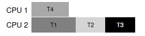

# Concurrency

## Introduction

A multi-threaded program has more than one point of execution (i.e., multiple PCs, each of which is being fetched and executed from). Perhaps another way to think of this is that each thread is very much like a separate process, except for one difference: they share the same address space and thus can access the same data.

Each thread has its own private set of registers it uses for computation; thus, if there are two threads that are running on a single processor, when switching from running one (T1) to running the other (T2), a context switch must take place. We’ll need one or more **thread control blocks** (**TCB**s) to store the state of each thread of a process. 

There is one major difference, though, in the context switch we perform between threads as compared to processes: the address space remains the same (i.e., there is no need to switch which page table we are using).

One other major difference between threads and processes concerns the stack. In a multi-threaded process, each thread runs independently and of course may call into various routines to do whatever work it is doing. Instead of a single stack in the address space, there will be one per thread.

### Why Use Threads?

1.parallelization

The task of transforming your standard single-threaded program into a program that does this sort of work on multiple CPUs is called parallelization, and using a thread per CPU to do this work is a natural and typical way to make programs run faster on modern hardware.

2.avoiding blocking program progress

Threading enables overlap of I/O with other activities **within** a single program, much like multiprogramming did for processes across programs.

### The Heart Of The Problem: Uncontrolled Scheduling

1.race condition

The results depend on the timing execution of the code. With some bad luck (i.e., context switches that occur at untimely points in the execution), we get the wrong result. In fact, we may get a different result each time; thus, instead of a nice **deterministic** computation (which we are used to from computers), we call this result **indeterminate**, where it is not known what the output will be and it is indeed likely to be different across runs.

2.critical section

A critical section is a piece of code that accesses a shared variable (or more generally, a shared resource) and **must not be** concurrently executed by more than one thread.

3.mutual execution

This property guarantees that if one thread is executing within the critical section, the others will be prevented from doing so.

### Atomicity  

Atomically, in this context, means “as a unit”, which sometimes we take as “all or none.” When an interrupt occurs, either the instruction has not run at all, or it has run to completion; there is no in-between state.

Instead of asking for some "atomic instructions", what we will instead do is ask the hardware for a few useful instructions upon which we can build a general set of what we call **synchronization primitives**. By using these hardware synchronization primitives, in combination with some help from the operating system, we will be able to build multi-threaded code that accesses critical sections in a synchronized and controlled manner, and thus reliably produces the correct result despite the challenging nature of concurrent execution.

## Locks

Programmers annotate source code with locks, putting them around critical sections, and thus ensure that any such critical section executes as if it were a single atomic instruction.

### The Basic Idea

To use a lock, we may add some code around the critical section like this:

```c
lock_t mutex;
lock(&mutex);
// a critical section 
unlock(&mutex);
```

A lock is just a variable, and thus to use one, you must declare a lock variable of some kind (such as mutex above). This lock variable (or just “lock” for short) holds the state of the lock at any instant in time.

Calling the routine `lock()` tries to acquire the lock; if no other thread holds the lock (i.e., it is free), the thread will acquire the lock and enter the critical section; this thread is sometimes said to be the owner of the lock. If another thread then calls `lock()` on that same lock variable (mutex in this example), it will not return while the lock is held by another thread; in this way, other threads are prevented from entering  the critical section while the first thread that holds the lock is in there.

Once the owner of the lock calls `unlock()`, the lock is now available (free) again. If no other threads are waiting for the lock (i.e., no other thread has called `lock()` and is stuck therein), the state of the lock is simply changed to free. If there are waiting threads (stuck in `lock()`), one of them will (eventually) notice (or be informed of) this change of the lock’s state, acquire the lock, and enter the critical section.

*Building A Lock*

How can we build an efficient lock? What hardware support is needed? What OS support?

### Evaluating Locks

To evaluate whether a lock works (and works well), we should first establish some basic criteria.

1.mutual exclusion

Basically, does the lock work, preventing multiple threads from entering a critical section?

2.fairness

Does each thread contending for the lock get a fair shot at acquiring it once it is free?

3.performance

When a single thread is running and grabs and releases the lock, what is the overhead of doing so?

In a case where multiple threads are contending for the lock on a single CPU, are there performance concerns?

How does the lock perform when there are multiple CPUs involved, and threads on each contending for the lock?

### Controlling Interrupts

One of the earliest solutions used to provide mutual exclusion was to disable interrupts for critical sections; this solution was invented for single-processor systems. 

By turning off interrupts (using some kind of special hardware instruction) before entering a critical section, we ensure that the code inside the critical section will not be interrupted, and thus will execute as if it were atomic.

*advantages*

It's simple.

*disadvantages*

1. This approach requires us to allow any calling thread to perform a privileged operation (turning interrupts on and off), and thus trust that this facility is not abused. 
2. If multiple threads are running on different CPUs, and each try to enter the same critical section, it does not matter whether interrupts are disabled; threads will be able to run on other processors, and thus could enter the critical section.
3. Turning off interrupts for extended periods of time can lead to interrupts becoming lost, which can lead to serious systems problems.
4. Compared to normal instruction execution, code that masks or unmasks interrupts tends to be executed slowly by modern CPUs.

### Hardware Support: Synchronization Primitives

#### Test And Set (Atomic Exchange)

```c
typedef struct __lock_t {int flag;} lock_t;

void init(lock_t *mutex) {
    // 0 -> lock is available, 1 -> held
    mutex->flag = 0;
}

void lock(lock_t *mutex) {
    while (mutext->flag == 1) {
        // spin-waiting (do nothing)
    }
    mutex->flag = 1;
}

void unlock(lock_t *mutex) {
    mutex->flag = 0;
}
```

This idea is also simple. Unfortunately, the code has two problems: one of correctness, and another of performance.

1.correctness

Assuming `flag = 0`to begin, and now there are two threads running.


As you can see from this interleaving, with timely (untimely?) interrupts, we can easily produce a case where both threads set the flag to 1 and both threads are thus able to enter the critical section.

2.performance

**Spin-waiting** wastes time waiting for another thread to release a lock. The waste is exceptionally high on a uniprocessor, where the thread that the waiter is waiting for cannot even run (at least, until a context switch occurs).

*Implementation: Building A Working Spin Lock*

While the idea behind the example above is a good one, it is not possible to implement without some support from the hardware. Such instruction is often referred to as **test-and-set**. 

```c
int TestAndSet(int *old_ptr, int new) {
    int old = *old_ptr;
    *old_ptr = new;
    return old;
}
```

By making both the **test** (of the old lock value) and **set** (of the new value) a single atomic operation, we ensure that only one thread acquires the lock. And that’s how to build a working mutual exclusion primitive.

```c
typedef struct __lock_t {int flag;} lock_t;

void init(lock_t *mutex) {
    // 0 -> lock is available, 1 -> held
    mutex->flag = 0;
}

void lock(lock_t *mutex) {
    while (TestAndSet(&lock->flag, 1) == 1) {
        // spin-waiting (do nothing)
    }
}

void unlock(lock_t *mutex) {
    mutex->flag = 0;
}
```

To work correctly on a single processor, it requires a preemptive scheduler (i.e., one that will interrupt a thread via a timer, in order to run a different thread, from time to time). Without preemption, spin locks don’t make much sense on a single CPU, as a thread spinning on a CPU will never relinquish it.

*Evaluating Spin Locks*

1.correctness 

Yes, the spin lock only allows a single thread to enter the critical section at a time.

2.fairness

Spin locks don’t provide any fairness guarantees. Indeed, a thread spinning may spin forever, under contention. Spin locks are not fair and may lead to starvation.

3.performance

In the single CPU case, performance overheads can be quite painful; imagine the case where the thread holding the lock is pre-empted within a critical section. The scheduler might then run every other thread (imagine there are N − 1 others), each of which tries to acquire the lock. In this case, each of those threads will spin for the duration of a time slice before giving up the CPU, a waste of CPU cycles.

On multiple CPUs, spin locks work reasonably well (if the number of threads roughly equals the number of CPUs).

#### Compare-And-Swap

```c
int CompareAndSwap(int *ptr, int expected, int new) {
    int actual = *ptr;
    if (actual == expected) {
        *ptr = new;
    }
    return actual;
}
```

The basic idea is for compare-and-swap to test whether the value at the address specified by `ptr` is equal to expected; if so, update the memory location pointed to by `ptr` with the new value. If not, do nothing. In either case, return the actual value at that memory location, thus allowing the code calling compare-and-swap to know whether it succeeded or not.

With the compare-and-swap instruction, we can build a lock in a  manner quite similar to that with test-and-set. 

```c
void lock(lock_t *lock) {
    while (CompareAndSwap(&lock->flag, 0, 1) == 1) {
        // spin
    }
}
```

#### Load-Linked And Store-Conditional

```pseudocode
int LoadLinked(int *ptr) {
    return *ptr;
}

int StoreConditional(int *ptr, int value) {
    if (no one has updated *ptr since the LoadLinked to this address) {
        *ptr = value;
        return 1; // success!
    } else {
        return 0; // failed to update
    }
}
```

Build a lock using load-linked and store-conditional:

```pseudocode
void lock(lock_t *lock) {
    while (1) {
        while (LoadLinked(&lock->flag) == 1) {
            // spin
        }
        if (StoreConditional(&lock->flag, 1) == 1) {
            return; // if set-it-to-1 was success: all done
            	   // otherwise: try it all over again
        }
    }
}

void unlock(lock_t *lock) {
    lock->flag = 0;
}
```

First, a thread spins waiting for the flag to be set to 0 (and thus indicate the lock is not held). Once so, the thread tries to acquire the lock via the store-conditional; if it succeeds, the thread has atomically changed the flag’s value to 1 and thus can proceed into the critical section.

#### Fetch-And-Add

fetch-and-add instruction atomically increments a value while returning the old value at a particular address. 

```pseudocode
int FetchAndAdd(int *ptr) {
    int old = *ptr;
    *ptr = old + 1;
    return old;
}
```

In this example, we’ll use fetch-and-add to build a more interesting **ticket lock**.

```pseudocode
typedef struct __lock_t {
    int ticket;
    int turn;
} lock_t;

void lock_init(lock_t *lock) {
    lock->ticket = 0;
    lock->turn = 0;
}

void lock(lock_t *lock) {
    int myturn = FetchAndAdd(&lock->ticket);
    while (lock->turn != myturn) {
        // spin
    }
}

void unlock(lock_t *lock) {
    lock->turn = lock->turn + 1;
}
```

When a thread wishes to acquire a lock, it first does an atomic fetch and-add on the ticket value; that value is now considered this thread’s “turn” (`myturn`). The globally shared `lock->turn` is then used to determine which thread’s turn it is; when (`myturn == turn`) for a given thread, it is that thread’s turn to enter the critical section. Unlock is accomplished simply by incrementing the turn such that the next waiting thread (if there is one) can now enter the critical section. 

Note one important difference with this solution versus our previous attempts: it ensures progress for all threads. Once a thread is assigned its ticket value, it will be scheduled at some point in the future (once those in front of it have passed through the critical section and released the lock).

### OS Support 

How can we develop a lock that doesn’t needlessly waste time spinning on the CPU?

#### Yield

We assume an operating system primitive `yield()` which a thread can call when it wants to give up the CPU and let another thread run. yield is simply a system call that moves the caller from the **running** state to the **ready** state, and thus promotes another thread to running. Thus, the yielding process essentially deschedules itself. 

Let us now consider the case where there are many threads (say 100) contending for a lock repeatedly. In this case, if one thread acquires the lock and is preempted before releasing it, the other 99 will each call lock(), find the lock held, and yield the CPU. Assuming some kind of round-robin scheduler, each of the 99 will execute this run-and-yield pattern before the thread holding the lock gets to run again. While better than our spinning approach (which would waste 99 time slices spinning), this approach is still costly; the cost of a context switch can be substantial, and there is thus plenty of waste.

#### Using Queues: Sleeping Instead Of Spinning

We must explicitly exert some control over which thread next gets to acquire the lock after the current holder releases it. To do this, we will need a little more OS support, as well as a queue to keep track of which threads are waiting to acquire the lock.

`park()` to put a calling thread to sleep, and `unpark(threadID)` to wake a particular thread as designated by `threadID`. These two routines can be used in tandem to build a lock that puts a caller to sleep if it tries to acquire a held lock and wakes it when the lock is free.

However, with just the wrong timing, a thread will be about to park, assuming that it should sleep until the lock is no longer held. A switch at that time to another thread (say, a thread holding the lock) could lead to trouble, for example, if that thread then released the lock. The subsequent park by the first thread would then sleep forever (potentially), a problem sometimes called the **wakeup/waiting race**.

Solaris solves this problem by adding a third system call: `setpark()`. By calling this routine, a thread can indicate it is about to `park`. If it then happens to be interrupted and another thread calls `unpark` before `park` is actually called, the subsequent `park` returns immediately instead of sleeping.

### Two-Phase Locks

A two-phase lock realizes that spinning can be useful, particularly if the lock is about to be released. So in the first phase, the lock spins for a while, hoping that it can acquire the lock. However, if the lock is not acquired during the first spin phase, a second phase is entered, where the caller is put to sleep, and only woken up when the lock becomes free later.

## Lock-based Concurrent Data Structure

Adding locks to a data structure to make it usable by threads makes the structure **thread safe**. When given a particular data structure, how should we add locks to it, in order to make it work correctly?

There is always a standard method to make a concurrent data structure: add a big lock.

### Concurrent Counters 

#### Simple But Not Scalable

```pseudocode
type struct __count_t {
    int value;
    mutex lock;
} counter_t;

void init(counter_t *c) {
    c->value = 0;
    mutex_init(&c->lock);
}

void increment(counter_t *c) {
	mutex_lock(&c->lock);
	c->value++;
	mutex_unlock(&c->lock);
}

int get(counter_t *c) {
    mutex_lock(&c->lock);
    int rc = c->value;
    mutex_unlock(&c->lock);
    return rc;
}
```

This concurrent counter is simple and works correctly. In fact, it follows a design pattern common to the simplest and most basic concurrent data structures: it simply adds a single lock, which is acquired when calling a routine that manipulates the data structure, and is released when returning from the call.

However, the more threads you have, the more time your job takes.

#### Scalable Counting: Sloppy Counter

The sloppy counter works by representing a single logical counter via numerous *local* physical counters, one per CPU core, as well as a single *global* counter. There are also locks: one for each local counter, and one for the global counter.

When a thread running on a given core wishes to increment the counter, it increments its local counter; access to this local counter is synchronized via the corresponding local lock. Because each CPU has its own local counter, threads across CPUs can update local counters without contention, and thus counter updates are scalable. However, to keep the global counter up to date (in case a thread wishes to read its value), the local values are periodically transferred to the global counter, by acquiring the global lock and incrementing it by the local counter’s value; the local counter is then reset to zero. 

How often this local-to-global transfer occurs is determined by a threshold, which we call S here (for sloppiness). If S is low, performance is poor (but the global count is always quite accurate); if S is high, performance is excellent, but the global count lags (by at most the number of CPUs multiplied by S). This accuracy/performance tradeoff is what sloppy counters enables.

### Concurrent Linked Lists

We can rearrange the code a bit so that the lock and release only surround the actual critical section in the insert code, and that a common exit path is used in the lookup code. The former works because part of the lookup actually need not be locked; assuming that `malloc()` itself is thread-safe, each thread can call into it without worry of race conditions or other concurrency bugs. Only when updating the shared list does a lock need to be held.

```c
typedef struct __node_t {
    int key;
    struct __node_t *next;
} node_t;

typedef struct __list_t {
    node_t *head;
    pthread_mutex_t lock;
} list_t;

void List_Init(list_t *L) {
    L->head = NULL;
    pthread_mutex_init(&L->lock, NULL);
}

int List_Insert(list_t *L, int key) {
    pthread_mutex_lock(&L->lock);
    node_t *new = malloc(sizeof(node_t));
    if (new == NULL) {
        perror("malloc");
        pthread_mutex_unlock(&L->lock);
        return -1;
    }
    new->key = key;
    new->next = L->head;
    L->head = new;
    pthread_mutex_unlock(&L->lock);
    return 0;
}

int List_Lookup(list_t *L, int key) {
    pthread_mutex_lock(&L->lock);
    mode_t *curr = L->head;
    while (curr) {
        if (curr->key == key) {
            pthread_mutex_unlock(&L->lock);
            return 0;
        }
        curr = curr->next;
    }
    pthread_mutex_unlock(&L->lock);
    return -1;
}
```

#### Scaling Linked Lists

The idea is pretty simple. Instead of having a single lock for the entire list, you instead add a lock per node of the list. When traversing the list, the code first grabs the next node’s lock and then releases the current node’s lock.

However, in practice, it is hard to make such a structure faster than the simple single lock approach, as the overheads of acquiring and releasing locks for each node of a list traversal is prohibitive. Even with very large lists, and a large number of threads, the concurrency enabled by allowing multiple ongoing traversals is unlikely to be faster than simply grabbing a single lock, performing an operation, and releasing it.

### Concurrent Queues

There are two locks, one for the head of the queue, and one for the tail. The goal of these two locks is to enable concurrency of enqueue and dequeue operations. In the common case, the enqueue routine will only access the tail lock, and dequeue only the head lock.

```c
typedef struct __node_t {
    int value;
    struct __node_t *next;
} node_t;

typedef struct __queue_t {
    node_t *head;
    node_t *tail;
    pthread_mutex_t headLock;
    pthread_mutex_t tailLock;
} queue_t;

void Queue_Init(queue_t *q) {
    node_t *tmp = malloc(sizeof(node_t));
    tmp->next = NULL;
    q->head = q->tail = NULL;
    pthread_mutex_init(&q->headLock, NULL);
    pthread_mutex_init(&q->tailLock, NULL);
}

void Queue_Enqueue(queue_t *q, int value) {
    node_t *tmp = malloc(sizeof(node_t));
    assert(tmp != NULL);
    tmp->value = value;
    tmp->next = NULL;
    
    pthread_mutex_lock(&q->tailLock);
    q->tail->next = tmp;
    q->tail = tmp;
    pthread_mutex_unlock(&q->tailLock);
}

void Queue_Dequeue(queue_t *q, int *value) {
    pthread_mutex_lock(&q->headLock);
    node_t *tmp = q->head;
    node_t *newHead = tmp->next;
    if (newHead == NULL) {
        pthread_mutex_unlock(&q->headLock);
        return -1; // queue was empty
    }
    *value = newHead->value;
    q->head = newHead;
    pthread_mutex_unlock(&q->headLock);
    free(tmp);
    return 0;
}
```

### Concurrent Hash Table

This concurrent hash table uses a lock per hash bucket (each of which is represented by a list). Doing so enables many concurrent operations to take place.

```c
#define BUCKETS (101)

typedef struct __hash_t {
    list_t lists[BUCKETS];
} hash_t;

void Hash_Init(hash_t *H) {
    int i;
    for (i = 0; i < BUCKETS; i++) {
        List_Init(&H->lists[i]);
    }
}

int Hash_Insert(hash_t *t, int key) {
    int bucket = key % BUCKETS;
    return List_Insert(&H->lists[bucket], key);
}

int Hash_Lookup(hash_t *H, int key) {
    int bucket = key % BUCKETS;
    return List_Lookup(&H->lists[bucket], key);
}
```

## Condition Variables

Condition variables are also important synchronization primitive. In multi-threaded programs, it is often useful for a thread to wait for some condition to become true before proceeding. The simple approach, of just spinning until the condition becomes true, is grossly inefficient and wastes CPU cycles, and in some cases, can be incorrect. Thus, how should a thread wait for a condition?

### Definition and Routines 

A **condition variable** is an explicit queue that threads can put themselves on when some state of execution (i.e., some condition) is not as desired (by waiting on the condition). A condition variable has two  operations associated with it: `wait()` and `signal()`. The `wait()` call is executed when a thread wishes to put itself to sleep; the `signal()` call is executed when a thread has changed something in the program and thus wants to wake a sleeping thread waiting on this condition.

**Hold the lock when calling signal or wait**, and you will always be in good shape.

### The Producer/Consumer (Bounded Buffer) Problem

Producers generate data items and place them in a buffer; consumers grab said items from the buffer and consume them in some way.

For simplicity, assume that the size of buffer is 1. 

#### A Broken Solution

```c
cond_t cond;
mutex_t mutex;

void *producer(void *arg) {
    int i;
    for (i = 0; i < loops; i++) {
        pthread_mutex_lock(&cond, &mutex);     // p1
        if (count == 1) {                      // p2
            pthread_cond_wait(&cond, &mutex);  // p3
        }
        put(1);                                // p4
        pthread_cond_signal(&cond);            // p5
        pthread_mutex_unlock(&mutex);          // p6
    }
}

void *consumer(void *arg) {
    int i;
    for (i = 0; i < loops; i++) {
        pthread_mutex_lock(&mutex);            // c1
        if (count == 0) {                      // c2
            pthread_cond_wait(&cond, &mutex);  // c3
        }
        int tmp = get();                       // c4
        pthread_cond_signal(&cond);            // c5
        pthread_mutex_unlock(&mutex);          // c6
    }
}
```

*Problem*


The problem arises for a simple reason: after the producer woke Tc1, but before Tc1 ever ran, the state of the bounded buffer changed (thanks to Tc2). Signaling a thread only wakes them up; it is thus a hint that the state of the world has changed (in this case, that a value has been placed in the buffer), but there is no guarantee that when the woken thread runs, the state will still be as desired. This interpretation of what a signal means is often referred to as Mesa semantics.

#### Better, But Still Broken: While, Not If

Thanks to Mesa semantics, a simple rule to remember with condition variables is to **always use while loops**. 

```c
cond_t cond;
mutex_t mutex;

void *producer(void *arg) {
    int i;
    for (i = 0; i < loops; i++) {
        pthread_mutex_lock(&cond, &mutex);     // p1
        while (count == 1) {                      // p2
            pthread_cond_wait(&cond, &mutex);  // p3
        }
        put(1);                                // p4
        pthread_cond_signal(&cond);            // p5
        pthread_mutex_unlock(&mutex);          // p6
    }
}

void *consumer(void *arg) {
    int i;
    for (i = 0; i < loops; i++) {
        pthread_mutex_lock(&mutex);            // c1
        while (count == 0) {                      // c2
            pthread_cond_wait(&cond, &mutex);  // c3
        }
        int tmp = get();                       // c4
        pthread_cond_signal(&cond);            // c5
        pthread_mutex_unlock(&mutex);          // c6
    }
}
```

*Problem*


Because the consumer has emptied the buffer, it clearly should wake the producer. However, if it wakes the consumer Tc2 (which is definitely possible, depending on how the wait queue is managed), we have a problem. Specifically, the consumer Tc2 will wake up and find the buffer empty (c2), and go back to sleep (c3). The producer Tp, which has a value to put into the buffer, is left sleeping. The other consumer thread, Tc1, also goes back to sleep. All three threads are left sleeping.

#### The Single Buffer Producer/Consumer Solution

In the code above, producer threads wait on the condition empty, and signals fill. Conversely, consumer threads wait on fill and signal empty. A consumer should not wake other consumers, only producers, and vice-versa.

```c
cond_t empty, fill;
mutex_t mutex;

void *producer(void *arg) {
    int i;
    for (i = 0; i < loops; i++) {
        pthread_mutex_lock(&cond, &mutex);     // p1
        while (count == 1) {                      // p2
            pthread_cond_wait(&empty, &mutex);  // p3
        }
        put(1);                                // p4
        pthread_cond_signal(&fill);            // p5
        pthread_mutex_unlock(&mutex);          // p6
    }
}

void *consumer(void *arg) {
    int i;
    for (i = 0; i < loops; i++) {
        pthread_mutex_lock(&mutex);            // c1
        while (count == 0) {                      // c2
            pthread_cond_wait(&fill, &mutex);  // c3
        }
        int tmp = get();                       // c4
        pthread_cond_signal(&empty);            // c5
        pthread_mutex_unlock(&mutex);          // c6
    }
}
```

#### The Final Producer/Consumer Solution
Specifically, we add more buffer slots, so that multiple values can be produced before sleeping, and similarly multiple values can be consumed before sleeping. With just a single producer and consumer, this approach is more efficient as it reduces context switches; with multiple producers or consumers (or both), it even allows concurrent producing or consuming to take place, thus increasing concurrency.

```c
int buffer[MAX];
int fill_ptr = 0;
int use_ptr = 0;
int count = 0;

void put(int value) {
    buffer[fill_ptr] = value;
    fill_ptr = (fill_ptr + 1) % MAX;
    count++;
}

int get() {
    int tmp = buffer[use_ptr];
    use_ptr = (use_ptr + 1) % MAX;
    count--;
    return tmp;
}

cond_t empty, fill;
mutex_t mutex;

void *producer(void *arg) {
    int i;
    for (i = 0; i < loops; i++) {
        pthread_mutex_lock(&cond, &mutex);     // p1
        while (count == MAX) {                      // p2
            pthread_cond_wait(&empty, &mutex);  // p3
        }
        put(1);                                // p4
        pthread_cond_signal(&fill);            // p5
        pthread_mutex_unlock(&mutex);          // p6
    }
}

void *consumer(void *arg) {
    int i;
    for (i = 0; i < loops; i++) {
        pthread_mutex_lock(&mutex);            // c1
        while (count == 0) {                      // c2
            pthread_cond_wait(&fill, &mutex);  // c3
        }
        int tmp = get();                       // c4
        pthread_cond_signal(&empty);            // c5
        pthread_mutex_unlock(&mutex);          // c6
    }
}
```

### Covering Conditions

Covering condition covers all the cases where a thread needs to wake up (conservatively); the cost is that too many threads might be woken.

Replace the `pthread_cond_signal()` call in the code above with a call to `pthread_cond_broadcast()`, which wakes up all waiting threads. By doing so, we guarantee that any threads that should be woken are. The downside, of course, can be a negative performance impact, as we might needlessly wake up many other waiting threads that shouldn’t (yet) be awake. Those threads will simply wake up, re-check the condition, and then go immediately back to sleep.

In general, if you find that your program only works when you change your signals to broadcasts (but you don’t think it should need to), you probably have a bug; fix it! But in cases like the memory allocator above, broadcast may be the most straightforward solution available.

## Semaphores

Dijkstra and colleagues invented the **semaphore** as a single primitive for all things related to synchronization; one can use semaphores as both locks and condition variables.

### Semaphores: A Definition

A semaphore is an object with an integer value that we can manipulate with two routines; in the POSIX standard, these routines are `sem_ wait() `and `sem_post()` (historically, these two terms were called `P()`and`V()`respectively). Because the initial value of the semaphore determines its behavior, before calling any other routine to interact with the semaphore, **we must first initialize it to some value**.

```c
int sem_wait(sem_t *s) {
    // decrement the value of semaphore s by one
    // wait if value of semaphore s is negative
}

int sem_post(sem_t *s) {
    // increment the value of semaphore s by one
    // if there are one or more threads waiting, wake one
}
```

*Something Important*

1. Multiple calling threads may call into `sem_wait()`, and thus all be queued waiting to be woken.
2. `sem_post()` does not wait for some particular condition to hold like `sem_wait()`does. Rather, it simply increments the value of the semaphore and then, if there is a thread waiting to be woken, wakes one of them up.
3. The value of the semaphore, when negative, is equal to the number of waiting threads.

### Binary Semaphores (Locks)

If we want to use semaphores as locks, we need to initialize semaphores to **1**. Because locks only have two states (held and not held), we sometimes call a semaphore used as a lock a binary semaphore. Note that if you are using a semaphore only in this binary fashion, it could be implemented in a simpler manner than the generalized semaphores we present here.

```c
sem_t m;
sem_init(&m, 0, 1);

sem_wait(&m);
// critical section
sem_post(&m);
```

### Semaphores As Condition Variables

```c
sem-t s;

void *child(void *arg) {
    //...
    se_post(&s); // signal
    return NULL;
}

int main() {
    sem_init(&s, 0, 0);
    //...
    pthread_t c;
    pthread_create(c, NULL, child, NULL);
    sem_wait(&s); // wait
    //...
    return 0;
}
```

The value of semaphore should be set to 0 at first. 

First, let us assume that the parent creates the child but the child has not run yet (i.e., it is sitting in a ready queue but not running). In this case , the parent will call `sem_wait()` before the child has called `sem_post()`; we’d like the parent to wait for the child to run. The only way this will happen is if the value of the semaphore is not greater than 0; hence, 0 is the initial value. The parent runs, decrements the semaphore (to -1), then waits (sleeping). When the child finally runs, it will call `sem_ post()`, increment the value of the semaphore to 0, and wake the parent, which will then return from `sem_wait()` and finish the program.

The second case occurs when the child runs to completion before the parent gets a chance to call `sem_wait()`. In this case, the child will first call `sem_post()`, thus incrementing the value of the semaphore from 0 to  1. When the parent then gets a chance to run, it will call `sem_wait()` and find the value of the semaphore to be 1; the parent will thus decrement the value (to 0) and return from `sem_wait()` without waiting, also achieving the desired effect.

### The Producer/Consumer (Bounded Buffer) Problem

```c
int buffer[MAX];
int fill = 0;
int use = 0;

void put(int value) {
    buffer[fill] = value;
    fill = (fill + 1) % MAX;
}

int get() {
    int tmp = buffer[use];
    use = (use + 1) % MAX;
    return tmp;
}

sem_t empty;
sem_t full;
sem_t mutex;

void *producer(void *arg) {
    int i;
    for (i = 0; i < loops; i++) {
        sem_wait(&empty);
        sem_wait(&mutex); // put mutual exclusion just around the critical section
        // or it may cause deadlock
        put(1);
        sem_post(&mutex);
        sem_post(&full);
    }
}

void *consumer(void *arg) {
    int i;
    for (i = 0; i < loops; i++) {
        sem_wait(&full);
        sem_wait(&mutex);
        int tmp = get();
        sem_post(&mutex);
        sem_post(&empty);
    }
}
```

### Reader-Writer Locks

If some thread wants to update the data structure in question, it should acquire a write lock, and release it. Internally, these simply use the `writelock` semaphore to ensure that only a single writer can acquire the lock and enter the critical section to update the data structure in question.

When acquiring a read lock, the reader first acquires lock and then increments the readers variable to track how many readers are currently inside the data structure. The important step then taken within `rwlock` acquire occurs when the first reader acquires the lock; in that case, the reader also acquires the write lock on the `writelock`semaphore, and then finally releasing the lock Thus, once a reader has acquired a read lock, more readers will be allowed to acquire the read lock too; however, any thread that wishes to acquire the write lock will have to wait until **all** readers are finished; the last one to exit the critical section enables a waiting writer to acquire the lock.

However, it would be relatively easy for readers to starve writers.

```c
typedef struct _rwlock_t {
    sem_t lock; // basic lock
    sem_t writelock; // used to allow ONE writer ot MANY readers
    int readers; // count of readers in critical section
} rwlock_t;

void rwlock_init(rwlock_t *rw) {
    rw->readers = 0;
    sem_init(&rw->lock, 0, 1);
    sem_init(&rw->writelock, 0, 1);
}

void rwlock_acquire_readlock(rwlock_t *rw) {
    sem_wait(&rw->lock);
    rw->readers++;
    if (rw->readers == 1) {
        sem_wait(&rw->writelock); // first reader acquires writelock
    }
    sem_post(&rw->lock);
}

void rwlock_release_readlock(rwlock_t *rw) {
    sem_wait(&rw->lock);
    rw->readers--;
    if (rw->readers == 0) {
        sem_post(&rw->writelock); // last reader releases the writelock
    }
    sem_post(&rw->lock);
}

void rwlock_acquire_writelock(rwlock_t *rw) {
    sem_wait(&rw->writelock);
}

void rwlock_release_writelock(rwlock_t *rw) {
    sem_post(&rw->writelock);
}
```

### The Dining Philosophers

The basic setup for the problem is this (as shown below): assume there are five “philosophers” sitting around a table. Between each pair of philosophers is a single fork (and thus, five total). The philosophers each have times where they think, and don’t need any forks, and times where they eat. In order to eat, a philosopher needs two forks, both the one on their left and the one on their right. The contention for these forks, and the synchronization problems that ensue, are what makes this a problem we study in concurrent programming.


We’ll use a few helper functions to get us towards a solution. They are:

```c
int left(int p) {
    return p;
}

int right(int p) {
    return (p + 1) % 5;
}
```

When philosopher p wishes to refer to the fork on their left, they simply call left(p). Similarly, the fork on the right of a philosopher p is referred to by calling right(p); the modulo operator therein handles the one case where the last philosopher (p=4) tries to grab the fork on their right, which is fork 0.

Also, we need five semaphores for each fork.

#### Broken Solution

To acquire the forks, we simply grab a “lock” on each one: first the one on the left, and then the one on the right. When we are done eating, we release them.

The problem is deadlock. If each philosopher happens to grab the fork on their left before any philosopher can grab the fork on their right, each will be stuck holding one fork and waiting for another, forever. Specifically, philosopher 0 grabs fork 0, philosopher 1 grabs fork 1, philosopher 2 grabs fork 2, philosopher 3 grabs fork 3, and philosopher 4 grabs fork 4; all the forks are acquired, and all the philosophers are stuck waiting for a fork that another philosopher possesses. We’ll study deadlock in more detail soon; for now, it is safe to say that this is not a working solution.

```c
void getforks() {
    sem_wait(forks[left(p)]);
    sem_wait(forks[right(p)]);
}

void putforks() {
    sem_post(forks[left(p)]);
    sem_post(fork[right(p)]);
}
```

#### A Solution: Breaking The Dependency

The simplest way to attack this problem is to change how forks are acquired by at least one of the philosophers; Specifically, let’s assume that philosopher 4 (the highest numbered one) acquires the forks in a different order. Because the last philosopher tries to grab right before left, there is no situation where each philosopher grabs one fork and is stuck waiting for another; the cycle of waiting is broken.

```c
void getforks() {
    if (p == 4) {
        sem_wait(forks[right(p)]);
        sem_wait(forks[left(p)]);
    } else {
        sem_wait(forks[left(p)]);
        sem_wait(forks[right(p)]);
    }
}
```

### How To Implement Semaphores

We use just one lock and one condition variable, plus a state variable to track the value of the semaphore.

```c
typedef struct __sem_t {
    int value;
    pthread_cond_t cond;
    pthread_mutex_t lock;
} sem_t;

// Only one thread can call this
void Sem_init(sem_t *s, int value) {
    s->value = value;
    Cond_init(s->cond);
    Mutex_init(s->lock);
}

void Sem_wait(sem_t *s) {
    Mutex_lock(s->lock);
    while (s->value <= 0) {
        Cond_wait(&s->cond, &s->lock);
    }
    s->value--;
    Mutex_unlock(&s->lock);
}

void Sem_post(sem_t *s) {
    Mutex_lock(&s->lock);
    s->value++;
    Cond_signal(&s->cond);
    Mutex_unlock(&s->lock);
}
```

One subtle difference between our semaphores pure semaphores as defined by Dijkstra is that we don’t maintain the invariant that the value of the semaphore, when negative, reflects the number of waiting threads; indeed, the value will never be lower than zero. This behavior is easier to implement and matches the current Linux implementation.

## Common Concurrent Problems

### Non-Deadlock Bugs

#### Atomicity-Violation Bugs

The desired serializability among multiple memory accesses is violated (i.e. a code region is intended to be atomic, but the atomicity is not enforced during execution).

**Serializability** is the classical concurrency scheme. It ensures that a schedule for executing concurrent transactions is equivalent to one that executes the transactions serially in some order.

```pseudocode
Thread 1::
if (thd->proc_info) {
	do something with thd->proc_info
}

Thread 2::
thd->proc_info = NULL;
```

In the example, two different threads access the field proc info in the structure `thd`. The first thread checks if the value is non-NULL and then prints its value; the second thread sets it to NULL. Clearly, if the first thread performs the check but then is interrupted before doing something with `thd->proc_info`, the second thread could run in-between, thus setting the pointer to NULL; when the first thread resumes, it will crash.

Finding a fix for this type of problem is often (but not always) straightforward.

```pseudocode
Thread 1::
lock
if (thd->proc_info) {
	do something with thd->proc_info
}
unlock

Thread 2::
// lock
thd->proc_info = NULL;
// unlock
```

#### Order-Violation Bugs

The desired order between two (groups of) memory accesses is flipped (i.e., A should always be executed before B, but the order is not enforced during execution).

```c++
Thread 1::
void init() {
    // ...
    mThread = PR_CreateThread(mMain, ...);
    // ...
}

Thread 2::
void mMain() {
    // ...
    mState = mThread->State;
    // ...
}
```

Thread 2 seems to assume that the variable `mThread` has already been initialized (and is not NULL); however, if Thread 2 runs immediately once created, the value of `mThread` will not be set when it is accessed within `mMain()` in Thread 2, and will likely crash with a NULL-pointer deference. 

The fix to this type of bug is generally to enforce ordering. As we discussed in detail previously, using **condition variables** is an easy and robust way to add this style of synchronization into modern code bases.

```c++
pthread_mutex_t mtLock = PTHREAD_MUTEX_INITIALIZER;
pthread_cond_t mtCond = PTHREAD_COND_INITIALIZER;
int mtInit = 0;

Thread 1::
void init() {
    // ...
    mThread = PR_CreateThread(mMain, ...);
    
    // signal that the thread has been created
    pthread_mutex_lock(&mtLock);
    mtInit = 1;
    pthread_cond_signal(&mtCond);
    pthread_mutex_unlock(&mtLock);
    
    // ...
}

Thread 2::
void mMain(...) {
    // ...
    // wait for the thread to be initialized
    pthread_mutex_lock(&mtLock);
    while (mtInit == 0) {
        pthread_cond_wait(&mtCond, &mtLock);
    }
    pthread_mutex_unlock(&mtLock);
    
    mState = mThread->State;
    
    // ... 
}
```

### Deadlock Bugs

#### Conditions for Deadlock

- Mutual exclusion: Threads claim exclusive control of resources that they require (e.g., a thread grabs a lock).
- Hold-and-wait: Threads hold resources allocated to them(e.g., locks that they have already acquired) while waiting for additional resources (e.g., locks that they wish to acquire).
- No preemption: Resources (e.g., locks) cannot be forcibly removed from threads that are holding them.
- Circular wait: There exists a circular chain of threads such that each thread holds one or more resources (e.g., locks) that are being requested by the next thread in the chain.

If any of these four conditions are not met, deadlock cannot occur.

#### Prevention

1.Circular Wait

(1) total ordering

The most straightforward way to do that is to provide a total ordering on lock acquisition. For example, if there are only two locks in the system (L1 and L2), you can prevent deadlock by always acquiring L1 before L2. Such strict ordering ensures that no cyclical wait arises; hence, no deadlock.

(2) partial ordering

An excellent real example of partial lock ordering can be seen in the memory mapping code in Linux [T+94]; the comment at the top of the source code reveals ten different groups of lock acquisition orders, including simple ones such as “i_mutex before i_mmap mutex” and more complex orders such as “i_mmap_mutex before private_lock before swap_lock before mapping->tree_lock”.

Imagine a function that is called as follows: `do_something(mutex t *m1, mutex t *m2)`. The clever programmer can use the address of each lock as a way of ordering lock acquisition. By acquiring locks in either high to-low or low-to-high address order, `do_something()` can guarantee that it always acquires locks in the same order, regardless of which order they are passed in.

```c
if (m1 > m2) {
    pthread_mutex_lock(m1);
    pthread_mutex_lock(m2);
} else {
    pthread_mutex_lock(m2);
    pthread_mutex_lock(m1);
}
```

2.Hold-and-wait

The hold-and-wait requirement for deadlock can be avoided by acquiring all locks at once, atomically. In practice, this could be achieved as follows:

```c
pthread_mutex_lock(prevention); // begin lock acquisition
pthread_mutex_lock(L1);
pthread_mutex_lock(L2);
// ...
pthread_mutex_unlock(prevention); // end
```

Note that the solution is problematic for a number of reasons. As before, encapsulation works against us: when calling a routine, this approach requires us to know exactly which locks must be held and to acquire them ahead of time. This technique also is likely to decrease concurrency as all locks must be acquired early on (at once) instead of when they are truly needed.

3.No Peremption

Specifically, the routine `pthread_mutex_trylock()` either grabs the lock (if it is available) and returns success or returns an error code indicating the lock is held; in the latter case, you can try again later if you want to grab that lock. Such an interface could be used as follows to build a deadlock-free, ordering-robust lock acquisition protocol:

```c
top:
	pthread_mutex_lock(L1);
	if (pthread_mutex_lock(L2) != 0) {
        pthread_mutex_unlock(L1);
        goto top;
    }
```

Note that another thread could follow the same protocol but grab the locks in the other order (L2 then L1) and the program would still be deadlock free.

One new problem does arise, however: **livelock**. It is possible (though perhaps unlikely) that two threads could both be repeatedly attempting this sequence and repeatedly failing to acquire both locks. In this case, both systems are running through this code sequence over and over again (and thus it is not a deadlock), but progress is not being made, hence the name livelock.

4.Mutual Exclusion

The final prevention technique would be to avoid the need for mutual exclusion at all. In general, we know this is difficult, because the code we wish to run does indeed have critical sections.

The idea behind these lock-free (and related wait-free) approaches here is simple: using powerful hardware instructions, you can build data structures in a manner that does not require explicit locking.

Recall compare-and-swap primitive:

```c
int CompareAndSwap(int *address, int expected, int new) {
    if (*address == expected) {
        *address = new;
        return 1; // success
    } else {
        return 0; // failure
    }
}
```

Here is code that inserts at the head of a list:

```c
void insert(int value) {
    node_t *n = malloc(sizeof(node_t));
    assert(n != NULL);
    n->value = value;
    n->next = head;
    head = n;
}
```

we could solve possible race condition by surrounding this code with a lock acquire and release:

```c
void insert(int value) {
    node_t *n = malloc(sizeof(node_t));
    assert(n != NULL);
    n->value = value;
    pthread_mutex_lock(listlock); // begin critical secion
    n->next = head;
    head = n;
    pthread_mutex_unlock(listlock);
}
```

Instead, let us try to perform this insertion in a lock-free manner simply using the compare-and-swap instruction. Here is one possible approach:

```c
void insert(int value) {
    node_t *n = malloc(sizeof(node_t));
    assert(n != NULL);
    n->value = value;
    do {
        n->next = head;
    } while(CompareAndSwap(&head, n->next, n) == 0);
}
```

#### Deadlock Avoidance via Scheduling

Avoidance requires some global knowledge of which locks various threads might grab during their execution, and subsequently schedules said threads in a way as to guarantee no deadlock can occur.

|      | T1   | T2   | T3   | T4   |
| ---- | ---- | ---- | ---- | ---- |
| L1   | yes  | yes  | yes  | no   |
| L1   | yes  | yes  | yes  | no   |

A smart scheduler could thus compute that as long as T1, T2 and T3 are not run at the same time, no deadlock could ever arise.



As you can see, static scheduling leads to a conservative approach where T1, T2, and T3 are all run on the same processor, and thus the total time to complete the jobs is lengthened considerably. Though it may have been possible to run these tasks concurrently, the fear of deadlock prevents us from doing so, and the cost is performance.

#### Detect and Recover

One final general strategy is to allow deadlocks to occasionally occur, and then take some action once such a deadlock has been detected.

Many database systems employ deadlock detection and recovery techniques. A deadlock detector runs periodically, building a resource graph and checking it for cycles. In the event of a cycle (deadlock), the system needs to be restarted. If more intricate repair of data structures is first required, a human being may be involved to ease the process.

## Event-based Concurrency 

How can we build a concurrent server without using threads, and thus retain control over concurrency as well as avoid some of the problems that seem to plague multi-threaded applications?

### The Basic Idea: An Event Loop

The approach is quite simple: you simply wait for something (i.e., an “event”) to occur; when it does, you check what type of event it is and do the small amount of work it requires (which may include issuing I/O requests, or scheduling other events for future handling, etc.).

The code that processes each event is known as an event handler. Importantly, when a handler processes an event, it is the only activity taking place in the system; thus, deciding which event to handle next is equivalent to scheduling. This explicit control over scheduling is one of the fundamental advantages of the event based approach.

### An Important API: `select()` (or `poll()`)

What these interfaces enable a program to do is simple: check whether there is any incoming I/O that should be attended to. For example, imagine that a network application (such as a web server) wishes to check whether any network packets have arrived, in order to service them. These system calls let you do exactly that.

These basic primitives give us away to build a non-blocking event loop,which simply checks for incoming packets, reads from sockets with messages upon them, replies as needed and so on.

### No Locks Needed

With a single CPU and an event-based application, the problems found in concurrent programs are no longer present. Specifically, because only one event is being handled at a time, there is no need to acquire or release locks; the event-based server cannot be interrupted by another thread because it is decidedly single threaded. Thus, concurrency bugs common in threaded programs do not manifest in the basic event-based approach.

### A Problem: Blocking System Calls

With an event-based approach, however, there are no other threads to run: just the main event loop. And this implies that if an event handler issues a call that blocks, the *entire* server will do just that: block until the call completes. When the event loop blocks, the system sits idle, and thus is a huge potential waste of resources. We thus have a rule that must be obeyed in event-based systems: no blocking calls are allowed.

### Asynchronous I/O

To overcome this limit, many modern operating systems have introduced new ways to issue I/O requests to the disk system, referred to generically as asynchronous I/O. These interfaces enable an application to issue an I/O request and return control immediately to the caller, before the I/O has completed; additional interfaces enable an application to determine whether various I/Os have completed.

### State Management

When an event handler issues an asynchronous I/O, it must package up some program state for the next event handler to use when the I/O finally completes; this additional work is not needed in thread-based programs, as the state the program needs is on the stack of the thread.

The solution is to use an old programming language construct known as a **continuation**. Basically, record the needed information to finish processing this event in some data structure; when the event happens (i.e., when the disk I/O completes), look up the needed information and process the event.

### Other Problems

1.multiple CPUs

In order to utilize more than one CPU, the event server has to run multiple event handlers in parallel; when doing so, the usual synchronization problems (e.g., critical sections) arise, and the usual solutions (e.g., locks) must be employed. Thus, on modern multicore systems, simple event handling without locks is no longer possible.

2.integration

It does not integrate well with certain kinds of systems activity, such as paging. For example, if an event-handler page faults, it will block, and thus the server will not make progress until the page fault completes. Even though the server has been structured to avoid explicit blocking, this type of *implicit* blocking due to page faults is hard to avoid and thus can lead to large performance problems when prevalent.

3.hard to manage 

For example, if a routine changes from non-blocking to blocking, the event handler that calls that routine must also change to accommodate its new nature, by ripping itself into two pieces. Because blocking is so disastrous for event-based servers, a programmer must always be on the lookout for such changes in the semantics of the APIs each event uses.

# Persistence

## I/O Devices

### System Architecture


Some devices are connected to the system via a general **I/O bus**, which in many modern systems would be **PCI** (or one of its many derivatives); graphics and some other higher-performance I/O devices might be found here. Finally, even lower down are one or more of what  we call a **peripheral bus**, such as **SCSI**, **SATA**, or **USB**.

The reason for such a hierarchical structure is physics and cost. The faster a bus is, the shorter it must be. In addition, engineering a bus for high performance is quite costly. Thus, system designers have adopted this hierarchical approach, where components that demand high performance (such as the graphics card) are nearer the CPU.

###  A Canonical Device


1.interface

Just like a piece of software, hardware must also present some kind of interface that allows the system software to control its operation.

The simplified device interface is comprised of 3 registers: a status register:

- a status register, which can be read to see the current status
  of the device;
- a command register, to tell the device to perform a certain
  task;
- a data register to pass data to the device, or get data from
  the device.

By reading and writing these registers, the operating system can control device behavior.

2.internal structure

This part of the device is implementation specific and is responsible for implementing the abstraction the device presents to the system.

### Lowering CPU Overhead With Interrupts

Instead of polling the device repeatedly, the OS can issue a request, put the calling process to sleep, and context switch to another task. When the device is finally finished with the operation, it will raise a hardware interrupt, causing the CPU to jump into the OS at a pre determined **interrupt service routine** (ISR) or more simply an **interrupt handler**. Interrupts thus allow for **overlap** of computation and I/O, which is key for improved utilization.

Note that using interrupts is not always the best solution. For example, imagine a device that performs its tasks very quickly: the first poll usually finds the device to be done with task. Using an interrupt in this case will actually slow down the system: switching to another process, handling the interrupt, and switching back to the issuing process is expensive. Thus, if a device is fast, it may be best to poll; if it is slow, interrupts, which allow overlap, are best. If the speed of the device is not known, or sometimes fast and sometimes slow, it may be best to use a **hybrid** that polls for a little while and then, if the device is not yet finished, uses interrupts. This two-phased approach may achieve the best of both worlds.

Another reason not to use interrupts arises in networks [MR96]. When a huge stream of incoming packets each generate an interrupt, it is possible for the OS to **livelock**.

### DMA

In the timeline, Process 1 is running and then wishes to write some data to the disk. It then initiates the I/O,which must copy the data from memory to the device explicitly, one word at a time (marked c in the diagram). When the copy is complete, the I/O begins on the disk and the CPU can finally be used for something else. 


When using programmed I/O (PIO) to transfer a large chunk of data to a device, the CPU is once again overburdened with a rather trivial task, and thus wastes a lot of time and effort that could better be spent running other processes.

The solution is **Direct Memory Access (DMA)**. A DMA engine is essentially a very specific device within a system that can orchestrate transfers between devices and main memory without much CPU intervention.


### Methods Of Device Interaction

How should the hardware communicate with a device?

1.I/O instructions 

These instructions specify a way for the OS to send data to specific device registers and thus allow the construction of the protocols described above.

Such instructions are usually privileged. The OS controls devices, and the OS thus is the only entity allowed to directly communicate with them.

2.memory mapped I/O

With this approach, the hardware makes device registers available as if they were memory locations. To access a particular register, the OS issues a load (to read) or store (to write) the address; the hardware then routes the load/store to the device instead of main memory.

### Fitting Into The OS: The Device Driver

At the lowest level, a piece of software in the OS must know in detail how a device works. We call this piece of software a **device driver**, and any specifics of device interaction are encapsulated within.

For example in Linux, a file system (and certainly, an application
above) is completely oblivious to the specifics of which disk class
it is using; it simply issues block read and write requests to the generic
block layer, which routes them to the appropriate device driver, which
handles the details of issuing the specific request.


## Hard Disk Drives

### The Interface

The drive consists of a large number of sectors (**512**-byte blocks), each of which can be read or written. The sectors are numbered from 0 to n − 1 on a disk with n sectors. Thus, we can view the disk as an array of sectors; 0 to n − 1 is thus the **address space** of the drive.

Multi-sector operations are possible; indeed, many file systems will read or write 4KB at a time (or more). However, when updating the disk, the only guarantee drive manufactures make is that a single 512-byte write is atomic.

One can usually assume that accessing two blocks that are near one another within the drive’s address space will be faster than accessing two blocks that are far apart. One can also usually assume that accessing blocks in a contiguous chunk (i.e., a sequential read or write) is the fastest access mode, and usually much faster than any more random access pattern.

### Basic Geometry

1.platter

A platter is a circular hard surface on which data is stored persistently by inducing magnetic changes to it. A disk may have one or more platters; each platter has 2 sides, each of which is called a surface. These platters are usually made of some hard material (such as aluminum), and then coated with a thin magnetic layer that enables the drive to persistently store bits even when the drive is powered off.

2.spindle

The platters are all bound together around the spindle, which is connected to a motor that spins the platters around (while the drive is powered on) at a constant (fixed) rate.

3.track

Data is encoded on each surface in concentric circles of sectors; we call one such concentric circle a track. A single surface contains many thousands and thousands of tracks.

4.disk head & disk arm

To read and write from the surface, we need a mechanism that allows us to either sense (i.e., read) the magnetic patterns on the disk or to induce a change in (i.e., write) them. This process of reading and writing is accomplished by the disk head; there is one such head per surface of the drive. The disk head is attached to a single disk arm, which moves across the surface to position the head over the desired track.

### A Simple Disk Drive

1.Single-track Latency: The Rotational Delay

In a simple one-track disk, the disk doesn’t have to do much in order to read a specific block. In particular, it must just wait for the desired sector to rotate under the disk head. This wait happens often enough in modern drives, and is an important enough component of I/O service time, that it has a special name: **rotational delay** (sometimes rotation delay, though that sounds weird).

However, modern disks of course have many millions of tracks. 

2.Multiple Tracks: Seek Time


We now trace what would happen on a request to a distant sector, e.g., a read to sector 11. To service this read, the drive has to first move the disk arm to the correct track (in this case, the outermost one), in a process known as a **seek**. Seeks, along with rotations, are one of the most costly disk operations.

The seek, it should be noted, has many phases: first an acceleration phase as the disk arm gets moving; then coasting as the arm is moving at full speed, then deceleration as the arm slows down; finally settling as the head is carefully positioned over the correct track. The settling time is often quite significant, e.g., 0.5 to 2 ms, as the drive must be certain to find the right track.

When sector 11 passes under the disk head, the final phase of I/O will take place, known as the **transfer**, where data is either read from or written to the surface. And thus, we have a complete picture of I/O time: first a seek, then waiting for the rotational delay, and finally the transfer.

### I/O Time

$$T_{I/O}=T_{seek}+T_{rotation}+T_{transfer}$$

1. There is a huge gap in drive performance between random and sequential workloads. When at all possible, transfer data to and from disks in a sequential manner. If sequential is not possible, at least think about transferring data in large chunks.
2. There is a large difference in performance between high-end “performance” drives and low-end “capacity” drives. For this reason (and others), people are often willing to pay top dollar for the former while trying to get the latter as cheaply as possible.

### Disk Scheduling

Given a set of I/O requests, the disk scheduler examines the requests and decides which one to schedule next.

#### SSTF: Shortest Seek Time First

Unlike job scheduling, where the length of each job is usually unknown, with disk scheduling, we can make a good guess at how long a disk request will take. By estimating the seek and possible rotational delay of a request, the disk scheduler can know how long each request will take, and thus (greedily) pick the one that will take the least time to service first. 

SSTF orders the queue of I/O requests by track, picking requests on the nearest track to complete first.

*Problems*

1. The drive geometry is not available to the host OS; rather, it sees an array of blocks. Fortunately, this problem is rather easily fixed. Instead of SSTF, an OS can simply implement **nearest-block-first** (NBF), which schedules the request with the nearest block address next.
2. Imagine in our example above if there were a steady stream of requests to the inner track, where the head currently is positioned. Requests to any other tracks would then be ignored completely by a pure SSTF approach.

How can we implement SSTF-like scheduling but avoid starvation?

#### Elevator (aka SCAN or C-SCAN)

The algorithm, originally called **SCAN**, simply moves back and forth across the disk servicing requests in order across the tracks. Let’s call a single pass across the disk (from outer to inner tracks, or inner to outer) a sweep. Thus, if a request comes for a block on a track that has already been serviced on this sweep of the disk, it is not handled immediately, but rather queued until the next sweep (in the other direction).

**C-SCAN** is another common variant, short for Circular SCAN. Instead of sweeping in both directions across the disk, the algorithm only sweeps from outer-to-inner, and then resets at the outer track to begin again. Doing so is a bit more fair to inner and outer tracks, as pure back-and- forth SCAN favors the middle tracks, i.e., after servicing the outer track, SCAN passes through the middle twice before coming back to the outer track again.

The SCAN algorithm (and its cousins) is sometimes referred to as the elevator algorithm, because it behaves like an elevator which is either going up or down and not just servicing requests to floors based on which floor is closer.

*Problem*

SCAN(or SSTF even) do not actually adhere as closely to the principle of SJF as they could. In particular, they ignore rotation.

#### SPTF: Shortest Positioning Time First

On modern drives both seek and rotation are roughly equivalent (depending, of course, on the exact requests), and thus SPTF is useful and improves performance. However, it is even more difficult to implement in an OS, which generally does not have a good idea where track boundaries are or where the disk head currently is (in a rotational sense).

## Redundant Arrays of Inexpensive Disks (RAIDs)

RAIDs offer a number of advantages over a single disk. One advantage is *performance*. Using multiple disks in parallel can greatly speed up I/O times. Another benefit is *capacity*. Large data sets demand large disks. Finally, RAIDs can improve *reliability*; spreading data across multiple disks (without RAID techniques) makes the data vulnerable to the loss of a single disk; with some form of **redundancy**, RAIDs can tolerate the loss of a disk and keep operating as if nothing were wrong.

RAIDs provide these advantages **transparently** to systems that use them, i.e., a RAID just looks like a big disk to the host system. In this manner, transparency greatly improves the deployability of RAID, enabling users and administrators to put a RAID to use without worries of software compatibility.

### Interface And RAID Internals

A RAID system is often built as a separate hardware box, with a standard connection (e.g., SCSI, or SATA) to a host.

When a file system issues a logical I/O request to the RAID, the RAID internally must calculate which disk (or disks) to access in order to complete the request, and then issue one or more physical I/Os to do so.

### How To Evaluate A RAID

1.capacity

Given a set of N disks each with B blocks, without redundancy, the answer is $$N*B$$; in contrast, if we have a system that keeps two copies of each block (called **mirroring**), we obtain a useful capacity of $$(N · B)/2$$.

2.reliability

How many disk faults can the given design tolerate?

3.performance

It depends heavily on the workload presented to the disk array.

In analyzing RAID performance, one can consider two different performance metrics. The first is *single-request* latency. Understanding the latency of a single I/O request to a RAID is useful as it reveals how much parallelism can exist during a single logical I/O operation. The second is *steady-state throughput* of the RAID, i.e., the total bandwidth of many concurrent requests. Because RAIDs are often used in high performance environments, the steady-state bandwidth is critical, and thus will be the main focus of our analyses.

### RAID Level 0: Striping

RAID level 0, serves as an excellent upper-bound on performance and capacity. Actually, it's not a RAID at all.

The simplest form of striping will stripe blocks across the disks of the system as follows (assume here a 4-disk array):


This approach, which spreads the blocks of the array across the disks in a round-robin fashion, is designed to extract the most parallelism from the array when requests are made for contiguous chunks of the array (as in a large, sequential read, for example). We call the blocks in the same row a **stripe**.

*Analysis*

1.capacity

Given N disks each of size B blocks, striping delivers $$N·B$$ blocks of useful capacity.

2.reliability

Striping is also perfect, but in the bad way: any disk failure will lead to data loss.

3.performance

All disks are utilized, often in parallel, to service user I/O requests.

(1) single-block latency

The latency of a single-block request should be just about identical to that of a single disk; after all, RAID-0 will simply redirect that request to one of its disks.

(2) steady-state throughput

Throughput equals N (the number of disks) multiplied by S (the sequential bandwidth of a single disk). For a large number of random I/Os, we can again use all of the disks, and thus obtain N · R MB/s.

### RAID Level 1: Mirroring

In a typical mirrored system, we will assume that for each logical block, the RAID keeps two physical copies of it. Here is an example:


When reading a block from a mirrored array, the RAID has a choice: it can read either copy. Do note, though, that these writes can take place in parallel; for example, a write to logical block 5 could proceed to disks 2 and 3 at the same time.

*Analysis*

1.capacity

RAID-1 is expensive; with the mirroring level = 2, we only obtain half of our peak useful capacity. With N disks of B blocks, RAID-1 useful capacity is $$(N · B)/2$$.

2.reliability

It can tolerate the failure of any one disk. You may also notice RAID-1 can actually do better than this, with a little luck. Imagine, in the figure above, that disk 0 and disk 2 both failed. In such a situation, there is no data loss! More generally, a mirrored system (with mirroring level of 2) can tolerate 1 disk failure for certain, and up to N/2 failures depending on which disks fail.

3.performance

(1) single-block latency

It is the same as the latency on a single disk; all the RAID-1 does is direct the read to one of its copies. 

A write is a little different: it requires two physical writes to complete before it is done. These two writes happen in parallel, and thus the time will be roughly equivalent to the time of a single write; however, because the logical write must wait for both physical writes to complete, it suffers the worst-case seek and rotational delay of the two requests, and thus (on average) will be slightly higher than a write to a single disk.

(2) steady-state throughput

### RAID Level 4: Saving Space With Parity

Parity-based approaches attempt to use less capacity and thus overcome the huge space penalty paid by mirrored systems. They do so at a cost, however: performance. For each stripe of data, we have added a single parity block that stores the redundant information for that stripe of blocks. For example, parity block P1 has redundant information that it calculated from blocks 4, 5, 6, and 7.


It turns out the simple function XOR does the trick quite nicely. For a given set of bits, the XOR of all of those bits returns a 0 if there are an even number of 1’s in the bits, and a 1 if there are an odd number of 1’s. You can remember this in a simple way: that the number of 1s in any row must be an even (not odd)number; that is the **invariant** that the RAID must maintain in order for parity to be correct. We just XOR the data bits and the parity bits together, in the same way that we calculated the parity in the first place.

| C0   | C1   | C2   | C3   | P    |
| ---- | ---- | ---- | ---- | ---- |
| 0    | 0    | 1    | 1    | 0    |
| 0    | 1    | 0    | 0    | 1    |

Imagine the column labeled C2 is lost. By reading the other values in that row (0 from C0, 0 from C1, 1 from C3, and 0 from the parity column P), we get the values 0, 0, 1, and 0. Because we know that XOR keeps an even number of 1’s in each row, we know what the missing data must be: a 1.

*Analysis*

1.capacity

RAID-4 uses 1 disk for parity information for every group of disks it is protecting. Thus, our useful capacity for a RAID group is $$(N − 1) · B$$.

2.reliability

RAID-4 tolerates 1 disk failure and no more. If more than one disk is lost, there is simply no way to reconstruct the lost data.

3.performance

A single read (assuming no failure) is just mapped to a single disk, and thus its latency is equivalent to the latency of a single disk request. The latency of a single write requires two reads and then two writes; the reads can happen in parallel, as can the writes, and thus total latency is about twice that of a single disk.

### RAID Level 5: Rotating Parity

RAID-5 works almost identically to RAID-4, except that it rotates the parity block across drives. The parity block for each stripe is now rotated across the disks, in order to remove the parity-disk bottleneck for RAID-4.


*Analysis*

The effective capacity and failure tolerance of the two levels are the same as RAID-4. The latency of a single request (whether a read or a write) is also the same as RAID-4. Random read performance is a little better, because we can now utilize all disks. Finally, random write performance improves noticeably over RAID-4, as it allows for parallelism across requests.

## Files And Directories

A **persistent-storage** device, such as a classic **hard disk drive** or a more modern **solid-state storage device**, stores information permanently (or at least, for a long time). Unlike memory, whose contents are lost when there is a power loss, a persistent-storage device keeps such data intact. 

### Files and Directories

Two key abstractions have developed over time in the virtualization of storage. The first is the file. The second abstraction is that of a directory.

1.File

A file is simply a linear array of bytes, each of which you can read or write. Each file has some kind of **low level name**. For historical reasons, the low-level name of a file is often referred to as its inode number.

The responsibility of the file system is simply to store such data persistently on disk and make sure that when you request the data again, you get what you put there in the first place.

2.Directory

A directory, like a file, also has a low-level name (i.e., an inode number), but its contents are quite specific: it contains a list of (user readable name, low-level name) pairs.

Each entry in a directory refers to either files or other directories. By placing directories within other directories, users are able to build an arbitrary **directory tree** (or directory hierarchy), under which all files and directories are stored.

*Directory Tree*

The directory hierarchy starts at a root directory (in UNIX-based systems, the root directory is simply referred to as /) and uses some kind of separator to name subsequent sub-directories until the desired file or directory is named.

### Hard Links

The `link()` system call takes two arguments, an old pathname and a new one; when you “link” a new file name to an old one, you essentially create another way to refer to the same file. After creating a hard link to a file, to the file system, there is no difference between the original file name (file) and the newly created file name (file2); indeed, they are both just links to the underlying metadata about the file.

To remove a file from the file system, we call `unlink()`. The reason this works is because when the file system unlinks file, it checks a **reference count** within the inode number. This reference count allows the file system to track how many different file names have been linked to this particular inode. When unlink() is called, it removes the “link” between the human-readable name (the file that is being deleted) to the given inode number, and decrements the reference count; only when the reference count reaches zero does the file system also free the inode and related data blocks, and thus truly “delete” the file.

### Symbolic Links/Soft Links

Hard links are somewhat limited: you can’t create one to a directory (for fear that you will create a cycle in the directory tree); you can’t hard link to files in other disk partitions (because inode numbers are only unique within a particular file system, not across file systems); etc.

```bash
prompt> echo hello > file
prompt> ln -s file file2
prompt> cat file2
hello
```

A symbolic link is actually a file itself, of a different type. We’ve already talked about regular files and directories; symbolic links are a third type the file system knows about.

```bash
prompt> ls -al
drwxr-x--- 2 remzi remzi 29 May 3 19:10 ./
drwxr-x--- 27 remzi remzi 4096 May 3 15:14 ../
-rw-r----- 1 remzi remzi 6 May 3 19:10 file
lrwxrwxrwx 1 remzi remzi 4 May 3 19:10 file2 -> file
```

Because of the way symbolic links are created, they leave the possibility for what is known as a **dangling reference**. Quite unlike hard links, removing the original file named file causes the link to point to a pathname that no longer exists.

```bash
prompt> echo hello > file
prompt> ln -s file file2
prompt> cat file2
hello
prompt> rm file
prompt> cat file2
cat: file2: No such file or directory
```

### Making and Mounting a File System

1.making

To make a file system, most file systems provide a tool, usually referred to as `mkfs` (pronounced “make fs”), that performs exactly this task. The idea is as follows: give the tool, as input, a device (such as a disk partition, e.g., /dev/sda1) a file system type (e.g., ext3), and it simply writes an empty file system, starting with a root directory, onto that disk partition.

2.mounting

Once such a file system is created, it needs to be made accessible within the uniform file-system tree. This task is achieved via the `mount` program(which makes the underlying system call `mount()` to do the real work). What mount does, quite simply is take an existing directory as a target mount point and essentially paste a new file system onto the directory tree at that point.

```shell
prompt> mount -t ext3 /dev/sda1 /home/users
```

The new file system is now accessed by accessing the root directory `/home/users`. And thus the beauty of mount: instead of having a number of separate file systems, mount unifies all file systems into one tree, making naming uniform and convenient.

## File System Implementation

### Overall Organization

We now develop the overall on-disk organization of the data structures of the **vsfs** (Very Simple File System) file system. The first thing we’ll need to do is divide the disk into blocks.

1.data region 

Most of the space in any file system of course should be user data. This partition of disk is called *data region*.

2.inode table

Also, the file system has to track information about each file. This information is a key piece of metadata, and tracks things like which data blocks (in the data region) comprise a file, the size of the file, its owner and access rights, access and modify times, and other similar kinds of information. To store this information, file systems usually have a structure called an **inode**. The partition of disk stores inode is called *inode table*, which simply holds an array of on-disk inodes. 

3.bitmap

One primary component that is still needed to track whether inodes or data blocks are free or allocated. Such **allocation structures** are thus a requisite element in any file system. Many allocation-tracking methods are possible, of course. A simple and popular method is called *bitmap*, one for the data region (the data bitmap), and one for the inode table (the inode bitmap). A bitmap is a simple structure: each bit is used to indicate whether the corresponding object/block is free (0) or in-use (1).

4.superblock

The *superblock* contains information about this particular file system. Thus, when mounting a file system, the operating system will read the superblock first, to initialize various parameters, and then attach the volume to the file-system tree.


### File Organization: The Inode

One of the most important on-disk structures of a file system is the inode; virtually all file systems have a structure similar to this. The name inode is short for **index node**. 

Each inode is implicitly referred to by a number (called the inumber), which we’ve earlier called the low-level name of the file. In vsfs (and other simple file systems), given an i-number, you should directly be able to calculate where on the disk the corresponding inode is located.

*The Multi-Level Index*

One of the most important decisions in the design of the inode is how it refers to where data blocks are. To support bigger files, one common idea is to have a special pointer known as an **indirect pointer**.  

Instead of pointing to a block that contains user data, it points to a block that contains more pointers, each of which point to user data. If a file grows large enough, an indirect block is allocated (from the data block region of the disk), and the inode’s slot for an indirect pointer is set to point to it. Assuming 4-KB blocks and 4-byte disk addresses, that adds another 1024 pointers; the file can grow to be $$(12 + 1024) · 4K$$ or 4144KB. Of course, there may be multi indirect pointer too. 

Overall, this imbalanced tree is referred to as the **multi-level index** approach to pointing to file blocks.

Of course, in the space of inode design, many other possibilities exist; after all, the inode is just a data structure, and any data structure that stores the relevant information, and can query it effectively, is sufficient.

### Directory Organization

In vsfs (as in many file systems), directories have a simple organization; a directory basically just contains a list of (entry name, inode number) pairs.

| inum | reclen | strlen | name |
| ---- | ------ | ------ | ---- |
| 5    | 4      | 2      | .    |
| 2    | 4      | 3      | ..   |
| 12   | 4      | 4      | foo  |

In this example, each entry has an inode number, record length (the total bytes for the name plus any left over space), string length (the actual length of the name), and finally the name of the entry. Note that each directory has two extra entries, . “dot” and .. “dot-dot”; the dot directory is just the current directory, whereas dot dot is the parent directory.

Deleting a file can leave an empty space in the middle of the directory, and hence there should be some way to mark that as well (e.g., with a reserved inode number such as zero). Such a delete is one reason the record length is used: a new entry may reuse an old, bigger entry and thus have extra space within.

Often, file systems treat directories as a special type of file. Thus, a directory has an inode, somewhere in the inode table (with the type field of the inode marked as “directory” instead of “regular file”). The directory has data blocks pointed to by the inode (and perhaps, indirect blocks); these data blocks live in the data block region of our simple file system.

We should also note again that this simple linear list of directory entries is not the only way to store such information. As before, any data structure is possible.

### Free Space Management

A file system must track which inodes and data blocks are free, and which are not, so that when a new file or directory is allocated, it can find space for it.

For example, when we create a file, we will have to allocate an inode for that file. The file system will thus search through the bitmap for an inode that is free, and allocate it to the file; the file system will have to mark the inode as used (with a 1) and eventually update the on-disk bitmap with the correct information. A similar set of activities take place when a data block is allocated.

### Access Paths: Reading and Writing

#### Reading A File From Disk

In this simple example, let us first assume that you want to simply open a file (e.g., /foo/bar), read it, and then close it. 

The file system must firstly traverse the pathname and thus locate the desired inode. All traversals begin at the root of the file system, in the root directory which is simply called /. Thus, the first thing the FS will read from disk is the inode of the root directory. The root inode number must be “well known”; the FS must know what it is when the file system is mounted.

Once the inode is read in, the FS can look inside of it to find pointers to data blocks, which contain the contents of the root directory. The FS will thus use these on-disk pointers to read through the directory, in this case looking for an entry for foo. By reading in one or more directory data blocks, it will find the entry for foo; once found, the FS will also have found the inode number of foo which it will need next.

The next step is to recursively traverse the pathname until the desired inode is found. In this example, the FS reads the block containing the inode of foo and then its directory data, finally finding the inode number of bar. The final step of `open()` is to read bar’s inode into memory; the FS then does a final permissions check, allocates a file descriptor for this process in the per-process open-file table, and returns it to the user.

Once open, the program can then issue a `read()` system call to read from the file. The first read (at offset 0 unless `lseek()` has been called) will thus read in the first block of the file, consulting the inode to find the location of such a block; it may also update the inode with a new last accessed time. The read will further update the in-memory open file table for this file descriptor, updating the file offset such that the next read will read the second file block, etc.

#### Writing to Disk

Unlike reading, writing to the file may also allocate a block (unless the block is being overwritten, for example). When writing out a new file, each write not only has to write data to disk but has to first decide which block to allocate to the file and thus update other structures of the disk accordingly (e.g., the data bitmap and inode). Thus, each write to a file logically generates five I/Os: one to read the data bitmap (which is then updated to mark the newly-allocated block as used), one to write the bitmap (to reflect its new state to disk), two more to read and then write the inode (which is updated with the new block’s location), and finally one to write the actual block itself.

To create a file, the file system must not only allocate an inode, but also allocate space within the directory containing the new file. The total amount of I/O traffic to do so is quite high: one read to the inode bitmap (to find a free inode), one write to the inode bitmap (to mark it allocated), one write to the new inode itself (to initialize it), one to the data of the directory (to link the high-level name of the file to its inode number), and one read and write to the directory inode to update it. If the directory needs to grow to accommodate the new entry, additional I/Os (i.e., to the data bitmap, and the new directory block) will be needed too.

### Caching And Buffering

Even the simplest of operations like opening, reading, or writing a file incurs a huge number of I/O operations, scattered over the disk.

Modern systems employ a **dynamic partitioning** approach. Specifically, many modern operating systems integrate virtual memory pages and file system pages into a **unified page cache**. In this way, memory can be allocated more flexibly across virtual memory and file system, depending on which needs more memory at a given time. 

Whereas read I/O can be avoided altogether with a sufficiently large cache, write traffic has to go to disk in order to become persistent. Thus, a cache does not serve as the same kind of filter on write traffic that it does for reads. That said, **write buffering** certainly has a number of performance benefits. First, by delaying writes, the file system can batch some updates into a smaller set of I/Os. Second, by buffering a number of writes in memory, the system can then **schedule** the subsequent I/Os and thus increase performance. Finally, some writes are avoided altogether by delaying them.

Some applications (such as databases) don’t enjoy these benefits. Thus, to avoid unexpected data loss due to write buffering, they simply force writes to disk, by calling `fsync()`, by using direct I/O interfaces that work around the cache, or by using the raw disk interface and avoiding the file system altogether.

