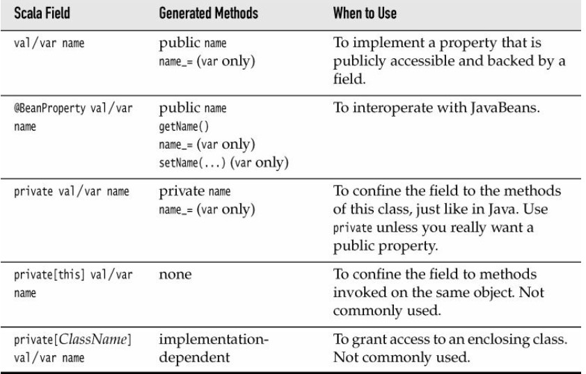
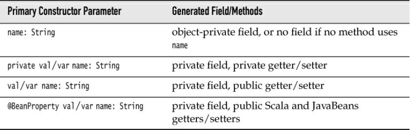
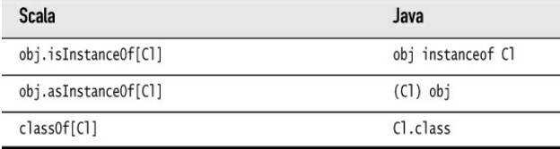

# The Basics

## Declaring Values and Variables

### 1. `val`

A value declared with `val` is **constant**.

```scala
val answer = 8 * 5 + 2
val xmax, ymax = 100 // You can declare multiple values together and you set them the same value.
```

In Scala, you are encouraged to use a `val` unless you really need to change contents. 

### 2. `var`

A variable is declared with `var`.

```scala
var counter = 0
var greeting: String = "hello"
```

Note that you need not to specify the type of a value or variable because it can be inferred from the type of the expression which you initialize it. ==It is an error declare a value or variable without initializing it.==

## Common Uses Types

There is no distinction between primitive types and class types in Scala. Therefore, you can invoke methods on numbers. 

```scala
1.toString()
```

In Scala, use methods instead of cats to convert between numeric types.

```scala
99.44.toInt // you get 99
```

## Arithmetic and Operator Overloading 

All operators are actually methods. `a + b`is a shorthand for `a.+(b)`. Scala allows defining methods with any symbols for names. 

Note Scala doesn't have `++`or`--`operators. Instead, simply use `+=1`or `-=1`. Since the `Int`class is immutable, such a method can not change any integer value. The Scala designers decided it wasn't worth having just another special rule just to save one keyword.

## Calling Methods

### 1. no parentheses

If the method has no parameters, you don't have to use parentheses. 

```scala
"hello".sorted
```

### 2. static methods

Many methods are defined as static methods. You can import the packages and use them.

```scala
import scala.math._ // _ is a wildcard like * in Java
sqrt(2)
```

Or you can just add the package name as a prefix.

```scala
scala.math.sqrt(2)
```

You can omit the `scala`prefix if a package name starts with `scala.`.

### 3. companion object 

Often a class has a companion object whose methods are just like static methods. For example, `BigInt`is a companion object to `scala.math.BigInt`class and has a method `probablePrime`which can generate a random prime with a given number of bits.

## The `apply`Method

```scala
val str = "hello"
str(4) // 'o'
```

You can think of this as an overloaded form of the `()` operator. It is implemented as a method with the name `apply`. That is, `s(4)`is a shorthand for `s.apply(4)`.

## Scaladoc

- Look into `RichInt`, `RichDouble`and so on if you want to know how to work with numeric types. Similarly, to work with strings, look into `StringOps`.
- The mathematical functions are in the package `scala.math`.
- Sometimes, you'll see functions with funny name. 
- Methods can have functions as parameters. 
- You'll occasionally run into classes such as `Range`or`Seq[T]`. In Scala, you use square brackets for type parameters. 
- Some methods have implicit parameters. For example, the `sorted`method of `StringOps`is declared as `def sorted[B >: Char](implicit ord: math.Ordering[B]): String`.

# Control Structures and Functions 

## Conditional Expressions

In Scala, every expression has a type defined by returned values. 

```scala
val s = if (x > 0) -1 else 1
```

If the `else`branch is omitted, it's equivalent to return a `()`:

```scala
if (x > 0) 1 else ()
```

`()`is the *only* value of `Unit`class. Think of `Unit`as as analog of `void`.

## Statement Termination 

- If you want to have more than one statement on a single line, you need to separate them with semicolon.
- If you want to continue a long statement over two lines, make sure that the first line ends in a symbol that cannot be the end of a statement. An operator is often a good choice. 

## Block Expressions and Assignments 

In Scala, a `{}`block contains a sequence of expressions and the result is also an expression. The value of the block is the value of the *last* expression. 

Note that assignments in Scala have a `()`value. 

## String Interpolation

### 1. f

A formatted string is prefixed with the letter `f`. It contains expressions that are prefixed with `$`and optionally C-style format strings. You need `${...}`around expressions that are not variable names.

```scala
f"hello, $name. In six months, you will be ${age + 0.5}%7.2f years old."
```

To include a `$`sign, double it. 

### 2. s

With a prefixed `s`, strings can contain expressions but *not* format directives. 

### 3.  raw

With a prefix `raw`, escape sequences in a string are not evaluated. 

```scala
raw"\n a newline" // escacpe \n
```

## Loops

### 1. 

Scala has the same `while`and `do`loops as Java, but no ordinary`for()`loop. You can use a `for`statement like this:

```scala
for(i <- expr)
```

Generally speaking, `expr`should return a collection like `1 to 10`. There is no `val`or`var`before the variable in the `for`loop. The type of the variable is the element type of the collection. 

NOTE: Scala has no `break`or `continue`statement. If you need to break a loop indeed, you can:

- use a boolean control variable 
- use nested functions which can be returned from the middle of a function 
- use the `break`method of `Breaks`object (don't  do this unless you need it eagerly because it is done by throwing and catching an exception): 

```scala
import scala.util.control.Breaks._
breakable {
    for (...) {
        if (...) break
    }
}
```

### 2. Advanced `for`Loops

(1) multiple generators of the from variable <- expression 

```scala
for (i <- 1 to 3; j <- 1 to 3)
```

Each generator can have a guard. 

```scala
for (i <- 1 to 3; j <- 1 to 3 if i != j)
```

(2) yield

```scala
for (i <- 1 to 10) yield i % 3
// Vector(1, 2, 0, 1, 2, 0, 1, 2, 0, 1)
```

## Functions 

### 1. definition 

You must define the types of all arguments. _Except for a recursive function_, you don't need to specify a function's return type.

```scala
def abs(x: Double) = if (x >= 0) x else -x 

def fac(n: Int): Int = if (n <= 0) 1 else n * fac(n - 1)
```

In Scala, using `return`to return a value is not commonly done since the last expression will return a value. Think of `return`as a kind of `break`statement and only use it when you want to break a function immediately.

### 2. Default and Named Arguments 

```scala
// default arguments 
def decorate(str: String, left: String = "[", right: String = "]") = left + str + right

// calling with named arguments 
decorate(left = "(", str = "aaa", right = ")")
```

You can mix unnamed and named arguments providing the unnamed ones first. 

### 3. Variable Arguments 

```scala
def sum(args: Int*) = {
    var result = 0
    for (i <- args) result += i
    result
}

sum(1, 2 ,3, 4)
```

The function receives a single parameter of type `Seq`. If you already have a sequence of values, you cannot pass it directly to such a function. Append `:_ *` like `sum(1 to 5: _*)`. This is useful in a recursive function. 

## Procedures

A function whose body is enclosed in a braces without a preceding  = symbol is called a procedure and returns `Unit`.

```scala
def foo() {
  println("nothing")
}
```

You call a procedure only for its side effect. 

## Lazy Values 

When a value is declared as `lazy`, its initialization is deferred until it is accessed for the first time. 

```scala
lazy val words = scala.io.Source.fromFile("/usr/share/dict/words").mkString
```

You can think of lazy values as halfway between `val`and`def`.

```scala
val words = scala.io.Source.fromFile("/usr/share/dict/words").mkString
// Evaluated as soon as words is defined
lazy val words = scala.io.Source.fromFile("/usr/share/dict/words").mkString
// Evaluated the first time words is used
def words = scala.io.Source.fromFile("/usr/share/dict/words").mkString
// Evaluated every time words is used
```

## Exceptions 

### 1. throw

Scala exceptions work the same way as in Java or C++. When you throw an exception, for example `throw new IllegalArgumentException("x should not be negative") `, the current computation is aborted, and the runtime system looks for an exception handler that can accept an `IllegalArgumentException`.

However, unlike Java, Scala has no “checked” exceptions—you never have to declare that a function or method might throw an exception. 

### 2. Nothing 

A throw expression has the special type Nothing. That is useful in if/else expressions. If one branch has type Nothing, the type of the if/else expression is the type of the other branch.

### 3. catch

The syntax for catching exceptions is modeled after the pattern matching syntax.

```scala
val url = new URL("http://horstmann.com/fred-tiny.gif")
try {
process(url)
} catch {
case _: MalformedURLException => println(s"Bad URL: $url")
case ex: IOException => ex.printStackTrace()
}
```

As in Java or C++, the more general exception types should come after the more specific ones. 

### 4. try-with-resource

Scala does not have an analog to the Java try-with-resources statement. What a bad thing, isn't it? Consider using the [scala-arm](https://github.com/jsuereth/scala-arm/) library.

```scala
    import resource._
    // Copy input into output.
    for {
      input <- managed(new java.io.FileInputStream("test.txt"))
      output <- managed(new java.io.FileOutputStream("test2.txt"))
    } {
      val buffer = new Array[Byte](512)
      def read(): Unit = input.read(buffer) match {
        case -1 => ()
        case  n =>
          output.write(buffer,0,n)
          read()
      }
      read()
    }
```

# Array

## Fixed-Length Arrays

```scala
val nums = new Array[Int](10)
// An array of ten integers, all initialized with zero
val a = new Array[String](10)
// A string array with ten elements, all initialized with null
val s = Array("Hello", "World")
// An Array[String] of length 2—the type is inferred
// Note: No new when you supply initial values
s(0) = "Goodbye"
// Array("Goodbye", "World")
// Use () instead of [] to access elements
```

## Array Buffers

```scala
import scala.collection.mutable.ArrayBuffer
val b = ArrayBuffer[Int]()
// Or new ArrayBuffer[Int]
// An empty array buffer, ready to hold integers
b += 1
// ArrayBuffer(1)
// Add an element at the end with +=
b += (1, 2, 3, 5)
// ArrayBuffer(1, 1, 2, 3, 5)
// Add multiple elements at the end by enclosing them in parentheses
b ++= Array(8, 13, 21)
// ArrayBuffer(1, 1, 2, 3, 5, 8, 13, 21)
// You can append any collection with the ++= operator
b.trimEnd(5)
// ArrayBuffer(1, 1, 2)
// Removes the last five elements
```

Adding or removing elements at then end of an array buffer costs constant time, which is quite efficient. 

Sometimes, you want to build up an Array, but you don’t yet know how many elements you will need. In that case, first make an array buffer, then call`b.toArray`.
Conversely, call `a.toBuffer` to convert the array a to an array buffer. 

## Traversal 

You can use a `for`loop to traverse an array/array buffer. There are some tricks.

```scala
// don't need any indices
for (elem <- a) println(elem)

// starting from the beginning
for (i <- 0 unitl a.length)
for (i <- a.indices)
for (i <- 0 until a.length by 2) // every second element

// starting from the end
for (i <- 0 until a.length by -1)
for (i <- a.indices.reverse)
```

## Transforming Arrays

Use guards and `yield`or `map`and `filter`to get a new array. It's just a style thing.

## Multidimensional Arrays 

A 2D array of type A has the type `Array[Array[A]]`.  To construct such an array, use the `ofDim`method: 

```scala
val matrix = Array.ofDim[Double](3, 4) // 3 rwos, 4 columns 
```

# Maps and Tuples

## Constructing A Map

```scala
// immutable map
val scores = Map("Alice" -> 10, "Bob" -> 3, "Cindy" -> 8)
// mutable
val scores = scala.collection.mutable.Map("Alice" -> 10, "Bob" -> 3, "Cindy" -> 8)
// if you want to start with a blank map
val scores = scala.collection.mutable.Map[String, Int]()
```

The -> operator is just a little easier on the eyes than the parentheses. You can define a map equally like this:

```scala
val scores = Map(("Alice", 10), ("Bob", 3), ("Cindy", 8))
```

## Accessing Map Values

Use `()`to look up key values.  To be safe, check whether there is a key with the given value by `contains`method. Since this call combination is so common, there is a shortcut: `getOrElse`method.

Given an immutable map, you can turn it into a map with a fixed default value for keys that are not present, or a function to compute such values. 

```scala
val scores1 = scores.withDefaultValue(0)
// Yields 0 since "Zelda" is not present
val zeldasScore1 = scores1.get("Zelda")

val scores2 = scores.withDefault(_.length)
// Yields 5, applying the length function to the key that is not present
val zeldasScore2 = scores2.get("Zelda")
```

## Updating Map Values

### 1. mutable map

```scala
// update
scores("Bob") = 10
// Adds a new key/value pair to scores (assuming it is mutable)
scores += ("Bob" -> 10, "Fred" -> 7)
// remove a key with associated value
scores -= "Alice"
```

### 2. immutable map

```scala
val newScores = scores + ("Bob" -> 10, "Fred" -> 7) // New map with update
```

You might think that it is inefficient to keep constructing new maps, but that is not the case. The old and new maps share most of their structure. 

## Iterating Over Maps 

`for ((k, v) <- map) process k and v `

## Tuples

Maps are collections of key/value pairs. Pairs are the simplest case of tuples—aggregates of values of _different types_. 

```scala
val t = (1, 3.14, "Fred") // Tuple[Int, Double, java.lang.String]
val second = t._2 // access cmponents 
```

Usually, it is better to use pattern matching to get at the components of a tuple, for example 

```scala
val (first, second, third) = t // Sets first to 1, second to 3.14, third to "Fred"
```

## Zipping

```scala
val symbols = Array("<", "-", ">")
val counts = Array(2, 10, 2)
val pairs = symbols.zip(counts) // Array(("<", 2), ("-", 10), (">", 2))
```

If you have a collection of keys and a parallel collection of values, zip them up and turn them into a map like this:`keys.zip(values).toMap `.

# Classes 

## Simple Classes and Parameterless Methods

```scala
class Counter {
    private var value = 0 // you must initialize it 
    def increment() {value += 1} // methods are public by default 
    def current() = value
}
```

In Scala, a class is not declared as public. A Scala source file can contain multiple classes, and all of them have public visibility.
To use this class, you construct objects and invoke methods in the usual way: 

```scala
val myCounter = new Counter // Or new Counter()
myCounter.increment() // you can omit parentheses
```

It is considered good style to use `()` for a mutator method (a method
that changes the object state), and to drop the `()` for an accessor method (a method that does not change the object state). You can enforce this style by declaring `current` without `()`.

## Properties With Getters and Setters

Scala provides getter and setter methods for every field. Here, we define a public field:

```scala
class Person {
var age = 0
}
```

Scala generates a class for the JVM with a ==private== `age` field and getter and setter methods. These methods are public because we did not declare age as private. (For a private field, the getter and
setter methods are private.) In Scala, the getter and setter methods are called `age` and `age_=`.  At any time, you can redefine the getter and setter methods yourself. Just remember to use the correct method names.

NOTE:

-  If the field is private, the getter and setter are private.
-  If the field is a `val`, only a getter is generated.
-  If you don’t want any getter or setter, declare the field as `private[this]`

## Bean Properties 

The JavaBeans specification defines a Java property as a pair of `getFoo`/`setFoo` methods (or just a `getFoo` method for a read-only property). Many Java tools rely on this naming convention. When you annotate a Scala field with `@BeanProperty`, then such methods are automatically generated. For example, 

```scala
import scala.beans.BeanProperty
class Person {
@BeanProperty var name: String = _
}
```

generates four methods:
1. `name: String`
2. `name_=(newValue: String): Unit`
3. `getName(): String`
4. `setName(newValue: String): Unit `

Let's summarize the generated methods from fields. 



## Constructors 

A Scala class has one constructor which is more important than all the others, called the primary constructor. In addition, a class may have any number of auxiliary constructors. 

### 1. Auxiliary Constructors 

They are similar to constructors in Java or C++, with just two differences.

- The auxiliary constructors are called this. (In Java or C++, constructors have the same name as the class—which is not so convenient if you rename the class.)

- Each auxiliary constructor must start with a call to a previously defined auxiliary constructor or the primary constructor 

```scala
class Person {
  private var name = ""
  private var age = 0

  def this(name: String) { // An auxiliary constructor
    this() // Calls default primary constructor
    this.name = name
  }
  
  def this(name: String, age: Int) { // Another auxiliary constructor
    this(name) // Calls previous auxiliary constructor
    this.age = age
  }
}
```

### 2. Primary Constructors  

(1)  The parameters of the primary constructor are placed immediately after the class name.

```scala
class Person(val name: String, val age: Int) {
    //...
}
```

Parameters of the primary constructor turn into fields that are initialized with the construction parameters.  

(2) The primary constructor executes all statements in the class definition.  

```scala
class Person(val name: String, val age: Int) {
	println("Just constructed another person")
	def description = s"name is age years old"
}
```

The `println` statement is a part of the primary constructor. It is executed whenever an object is constructed. This is useful when you need to configure a field during construction. 

(3) 



When you think of the primary constructor’s parameters as class parameters, parameters without `val` or `var` become easier to understand. The scope of such a parameter is the entire class. Therefore, you can use the parameter in methods. If you do, it is the compiler’s job to save it in a field 

(4) To make the primary constructor private, place the keyword private like this: 

```scala
class Person private(val id: Int) {}
```

# Objects

## Singletons 

Use an object of Scala whenever you would have used a singleton object in Java. An object defines a single instance of a class with the features you want.

```scala
object Accounts {
    private var lastNumber = 0
    def newUniqueNumber() = {lastNumber += 1; lastNumber}
}
```

An object is constructed when it's used for the first time. 

## Companion Object

In Java or C++, you often have a class with both instance methods and static methods. In Scala, you can achieve this by having a class and a “companion” object of the same name.  

```scala
class Account {
	val id = Account.newUniqueNumber()
	private var balance = 0.0
	def deposit(amount: Double) { balance += amount }
} 
object Account { // The companion object
	private var lastNumber = 0
	private def newUniqueNumber() = { lastNumber += 1; lastNumber }
}
```

The class and its companion object can access each other’s private features. They must be located in the _same source file_. 

NOTE: the companion object’s features are not in the scope of the class. For example, the  `Account` class has to use `Account.newUniqueNumber()` and not just
`newUniqueNumber()` to invoke the method of the companion object. 

## Objects Extending a Class or Trait 

An object can extend a class and/or one or more traits. The result is an object of a class that extends the given class and/or traits, and in addition has all of the features specified in the object definition. 

## The `apply` Method 

It is common to have objects with an apply method. The apply method is called for expressions of the form `Object(arg1, ..., argN)`. Typically, such an apply method returns an object of the companion class. 

## Application Objects 

Each Scala program must start with an object’s main method of type `Array[String] =>Unit:`
```scala
object Hello {
  def main(args: Array[String]) {
	println("Hello, World!")
  }
}
```
Instead of providing a main method for your application, you can extend the `App` trait and place the program code into the constructor body:
```scala
object Hello extends App {
  println("Hello, World!")
} 
```

## Enumerations 

Scala does not have enumerated types. However, the standard library provides an Enumeration helper class that you can use to produce enumerations. 

Define an object that extends the `Enumeration` class and initialize each value in your enumeration with a call to the Value method.

```scala
object TrafficLightColor extends Enumeration {
  val Red, Yellow, Green = Value
}
```

Each call to the `Value` method returns a new instance of an inner class, also called `Value`.
Alternatively, you can pass IDs, names, or both to the `Value` method:

```scala
val Red = Value(0, "Stop")
val Yellow = Value(10) // Name "Yellow"
val Green = Value("Go") // ID 11
```
If not specified, the ID is one more than the previously assigned one, starting with zero. The default name is the field name. 

You can now refer to the enumeration values as `TrafficLightColor.Red`, `TrafficLightColor.Yellow`, and so on. If that gets too tedious, use `import TrafficLightColor._ `.

The ID of an enumeration value is returned by the `id` method, and its name by the `toString` method. The call `values` yields a set of all values.

# Inheritance 

## Extending a Class

(1) 

You extend a class in Scala just like you would in Java—with the `extends`keyword.

(2) 

Specify fields and methods that are new to the subclass or that override methods in the superclass. 

(3) 

you can declare a class `final` so that it cannot be extended. You can also declare individual methods or fields `final` so that they cannot be overridden.

(4)

Invoking a superclass method in Scala works exactly like in Java, with the keyword `super`.

## Overriding Methods 

In Scala, you must use the `override` modifier when you override a method _that isn’t abstract_.

 ## Type Checks and Casts 

(1) type checks 

To test whether an object belongs to a given class, use the `isInstanceOf[T]` method.  If the object is null, return false.

(2) type casts 

If the test succeeds, you can use the `asInstanceOf[T]` method to convert a reference to a _subclass_ reference. If the object is null, return null. 

(3) class checks

If you want to test whether `p` refers to an `Employee` object, but not a subclass, use `if (p.getClass == classOf[Employee]) `.



## Protected Fields and Methods 

If you declare a field or method as `protected`, such a member is accessible from any subclass, but not from other locations. 

## Superclass Construction 

Only the primary constructor can call a superclass constructor. 

```scala
class Employee(name: String, age: Int, val salary : Double) extends Person(name, age)
```

NOTE that in Scala you can not use `super()`to call the superclass constructor. 

## Abstract Class

(1)

You can use the `abstract` keyword to denote a class that cannot be instantiated, usually because one or more of its methods are not defined.  

(2)

In Scala, unlike Java, you do not use the abstract keyword for an abstract method. You simply omit its body. 

In a subclass, you need not use the override keyword when you define a method that was abstract in the superclass.

(3)

An abstract field is simply a field without an initial value. Concrete subclasses must provide concrete fields.

## Equals 

In Scala, the `eq` method of the `AnyRef` class checks whether two references refer to the same object. The equals method in `AnyRef` calls `eq`. When you implement a class, you should consider overriding the `equals` method to provide a natural notion of equality for your situation. 

```scala
override def equals(obj: Any): Boolean
```

In an application program, you don’t generally call `eq` or `equals`. Simply use the `==` operator. For reference types, it calls `equals` after doing the appropriate check for null operands. 

## Value Classes 

Value types were designed to make implicit conversions efficient.

A value class has these properties:
- The class extends `AnyVal`.

- Its primary constructor has exactly one parameter, which is a `val`, and no body.

- The class has no other fields or constructors.

- The automatically provided `equals` and `hashCode` methods compare and hash the underlying value. 

```scala
class MilTime(val time: Int) extends AnyVal {
  def minutes = time % 100
  def hours = time / 100
  override def toString = f"$time04d"
}

MilTime lunch = new MilTime(1230)
println(lunch.hours) // OK
println(lunch * 2) // Error
```

As you see, you can invoke the minutes and hours methods on
the value but, just as importantly, you cannot invoke `Int` methods though the compiler doesn’t allocate a new object and just uses the underlying value, the integer 1230 . 

If you want to guarantee proper initialization, make the primary constructor private and provide a factory method in the companion object:

```scala
class MilTime private(val time: Int) extends AnyVal ...
object MilTime {
  def apply(t: Int) = if (0 <= t && t < 2400 && t % 100 < 60) new MilTime(t) else throw new IllegalArgumentException
}
```

# Traits 


