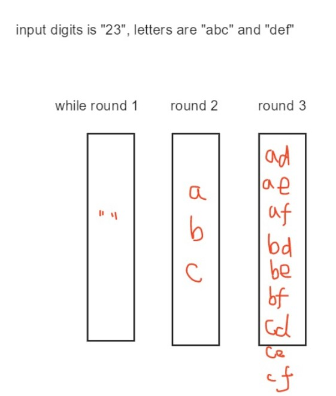

## 5. Longest Palindromic Substring](https://leetcode.com/problems/longest-palindromic-substring)

Given a string **s**, find the longest palindromic substring in **s**. You may assume that the maximum length of **s** is 1000.

**Example 1:**

```
Input: "babad"
Output: "bab"
Note: "aba" is also a valid answer.
```

**Example 2:**

```
Input: "cbbd"
Output: "bb"
```

**Solution**

A palindrome mirrors around its center so we can just expand an existing palindrome to find a longer one.

```go
func longestPalindrome(s string) string {
	if len(s) < 2 {
		return s
	}
	var longest string
	expand := func(start, end int) {
		for ; start >= 0 && end < len(s) && s[start] == s[end]; start, end = start-1, end+1 {
		}
		if length := end - start - 1; length > len(longest) {
			longest = s[start+1 : start+1+length]
		}
	}
	for i := 0; i < len(s); i++ {
		// substring with odd length
		expand(i, i)
		// substring with even length
		expand(i, i+1)
	}
	return longest
}
```

- Time complexity : $$O(n^2)$$. Since expanding a palindrome around its center could take $$O(n)$$ time, the overall complexity is $$O(n^2)$$.

- Space complexity : $$O(1)$$.

## [ZigZag Conversion](https://leetcode.com/problems/zigzag-conversion/)

The string `"PAYPALISHIRING"` is written in a zigzag pattern on a given number of rows like this: (you may want to display this pattern in a fixed font for better legibility)

```
P    A    H    N
↓   ↗↓   ↗↓   ↗↓  
A  P L  S I  I  G
↓↗   ↓↗   ↓↗ 
Y    I    R
```

And then read line by line: `"PAHNAPLSIIGYIR"`

Write the code that will take a string and make this conversion given a number of rows:

```
string convert(string s, int numRows);
```

**Example 1:**

```
Input: s = "PAYPALISHIRING", numRows = 3
Output: "PAHNAPLSIIGYIR"
```

**Example 2:**

```
Input: s = "PAYPALISHIRING", numRows = 4
Output: "PINALSIGYAHRPI"
Explanation:

P     I    N
A   L S  I G
Y A   H R
P     I
```

**Solution**

```go
func convert(s string, numRows int) string {
   if s == "" || numRows < 0 {
      return ""
   }
   // Be careful with this corner case
   if numRows == 1 {
      return s
   }
   builders := make([]strings.Builder, numRows) // builder of each row
   curRow, down := -1, true
   for _, r := range s {
      if down {
         // top-down
         if curRow++; curRow == numRows-1 {
            down = false
         }
      } else {
         // bottom-up
         if curRow--; curRow == 0 {
            down = true
         }
      }
      builders[curRow].WriteRune(r)
   }
   var res strings.Builder
   for i := range builders {
      res.WriteString(builders[i].String())
   }
   return res.String()
}
```

- Time complexity : $$O(n)$$.
- Space complexity : $$O(n)$$.

## [7. Reverse Integer](https://leetcode.com/problems/reverse-integer/)

Given a 32-bit signed integer, reverse digits of an integer.

**Example 1:**

```
Input: 123
Output: 321
```

**Example 2:**

```
Input: -123
Output: -321
```

**Example 3:**

```
Input: 120
Output: 21
```

**Note:**
Assume we are dealing with an environment which could only store integers within the 32-bit signed integer range: [$$−2^{31}$$,  $$2^{31}$$ − 1]. For the purpose of this problem, assume that your function returns 0 when the reversed integer overflows.

**Solution**

```go
func reverse(x int) int {
    // Be careful that int in Go is at least 32-bit.
	reversed := 0
	for x != 0 {
		lastDigit := x % 10
		if tmp := reversed*10 + lastDigit; tmp > math.MaxInt32 || tmp < math.MinInt32 {
			return 0
		} else {
			reversed = tmp
		}
		x /= 10
	}
	return reversed
}
```

- Time complexity: $$O(n)$$
- Space complexity: $$O(1)$$

## [8. String to Integer (atoi)](https://leetcode.com/problems/string-to-integer-atoi/)

Implement `atoi` which converts a string to an integer.

The function first discards as many whitespace characters as necessary until the first non-whitespace character is found. Then, starting from this character, takes an optional initial plus or minus sign followed by as many numerical digits as possible, and interprets them as a numerical value.

The string can contain additional characters after those that form the integral number, which are ignored and have no effect on the behavior of this function.

If the first sequence of non-whitespace characters in str is not a valid integral number, or if no such sequence exists because either str is empty or it contains only whitespace characters, no conversion is performed.

If no valid conversion could be performed, a zero value is returned.

**Note:**

- Only the space character `' '` is considered as whitespace character.
- Assume we are dealing with an environment which could only store integers within the 32-bit signed integer range: [$$−2^{31}$$,  $$2^{31} − 1$$]. If the numerical value is out of the range of representable values, $$2^{31} − 1$$ or $$−2^{31}$$ is returned.

**Example 1:**

```
Input: "42"
Output: 42
```

**Example 2:**

```
Input: "   -42"
Output: -42
Explanation: The first non-whitespace character is '-', which is the minus sign.
             Then take as many numerical digits as possible, which gets 42.
```

**Example 3:**

```
Input: "4193 with words"
Output: 4193
Explanation: Conversion stops at digit '3' as the next character is not a numerical digit.
```

**Example 4:**

```
Input: "words and 987"
Output: 0
Explanation: The first non-whitespace character is 'w', which is not a numerical 
             digit or a +/- sign. Therefore no valid conversion could be performed.
```

**Example 5:**

```
Input: "-91283472332"
Output: -2147483648
Explanation: The number "-91283472332" is out of the range of a 32-bit signed integer.
             Thefore INT_MIN (−2^31) is returned.
```

**Solution**

```go
func myAtoi(str string) int {
	// trim whitespace characters
	str = strings.TrimSpace(str)
	if str == "" {
		// Input string only contains whitespace characters or is empty
		return 0
	}
	if !unicode.IsDigit(rune(str[0])) && str[0] != '+' && str[0] != '-' {
		// The first character is not a digit character, plus symbol or minus symbol
		return 0
	}
	start := 0
	// If the first character is plus or minus symbol
	symbol := 1
	if str[start] == '-' {
		symbol, start = -1, start+1
	} else if str[start] == '+' {
		symbol, start = 1, start+1
	}
	// Retrieve as many digit characters as possible
	// Trim leading 0s at first
	digits := make([]rune, 0)
	for _, r := range strings.TrimLeft(str[start:], "0") {
		if unicode.IsDigit(r) {
			digits = append(digits, r)
		} else {
			break
		}
	}
	// Construct the number
	res, magnitude := 0, 1
	for i := len(digits) - 1; i >= 0; i-- {
		d := int(digits[i]-'0') * symbol
		// Be careful: the order of magnitude must be not greater than 10^9 
		if tmp := res + magnitude*d; float64(magnitude) <= math.Pow10(9) && tmp >= math.MinInt32 && tmp <= math.MaxInt32 {
			res, magnitude = tmp, magnitude*10
		} else {
			// Overflow
			if symbol == 1 {
				return math.MaxInt32
			} else {
				return math.MinInt32
			}
		}
	}
	return res
}
```

- Time complexity: $$O(n)$$
- Space complexity: $$O(n)$$

## [9. Palindrome Number](<https://leetcode.com/problems/palindrome-number/>)

Determine whether an integer is a palindrome. An integer is a palindrome when it reads the same backward as forward.

**Example 1:**

```
Input: 121
Output: true
```

**Example 2:**

```
Input: -121
Output: false
Explanation: From left to right, it reads -121. From right to left, it becomes 121-. Therefore it is not a palindrome.
```

**Example 3:**

```
Input: 10
Output: false
Explanation: Reads 01 from right to left. Therefore it is not a palindrome.
```

**Follow up:**

Could you solve it without converting the integer to a string?

**Solution**

```go
func isPalindrome(x int) bool {
	// Solve this problem without converting number to string
	if x < 0 || (x%10 == 0 && x != 0) {
		return false
	}
	origin, reverse := x, 0
	for x != 0 {
		reverse, x = reverse*10+x%10, x/10
	}
	return origin == reverse
}
```

- Time complexity: $$O(n)$$
- Space complexity: $$O(1)$$

## [10. Regular Expression Matching](<https://leetcode.com/problems/regular-expression-matching/>)

Given an input string (`s`) and a pattern (`p`), implement regular expression matching with support for `'.'` and `'*'`.

```
'.' Matches any single character.
'*' Matches zero or more of the preceding element.
```

The matching should cover the **entire** input string (not partial).

**Note:**

- `s` could be empty and contains only lowercase letters `a-z`.
- `p` could be empty and contains only lowercase letters `a-z`, and characters like `.` or `*`.

**Example 1:**

```
Input:
s = "aa"
p = "a"
Output: false
Explanation: "a" does not match the entire string "aa".
```

**Example 2:**

```
Input:
s = "aa"
p = "a*"
Output: true
Explanation: '*' means zero or more of the precedeng element, 'a'. Therefore, by repeating 'a' once, it becomes "aa".
```

**Example 3:**

```
Input:
s = "ab"
p = ".*"
Output: true
Explanation: ".*" means "zero or more (*) of any character (.)".
```

**Example 4:**

```
Input:
s = "aab"
p = "c*a*b"
Output: true
Explanation: c can be repeated 0 times, a can be repeated 1 time. Therefore it matches "aab".
```

**Example 5:**

```
Input:
s = "mississippi"
p = "mis*is*p*."
Output: false
```

**Solution**

[explanation](<https://www.youtube.com/watch?v=l3hda49XcDE&index=17&list=PLrmLmBdmIlpsHaNTPP_jHHDx_os9ItYXr>)

As the problem has an **optimal substructure**, it is natural to cache intermediate results. We ask the question `dp[i][j]`: does `s[:i]` and `p[:j]`match?

- If `s[i]==p[j] || p[j]=='.'`, `dp[i][j]=dp[i-1][j-1]`
- If `p[j]=='*'`, `dp[i][j]=dp[i][j-2]`; and if `s[i]==p[j-1] || p[j-1]=='.'`, then `dp[i][j]=dp[i-1][j ]`
- Else, `dp[i][j]=false`

```go
func isMatch(s string, p string) bool {
   dp := make([][]bool, len(s)+1)
   for i := range dp {
      dp[i] = make([]bool, len(p)+1)
   }
   // Deals with patterns like a* or a*b* or a*b*c*
   dp[0][0] = true
   for i := 1; i < len(dp[0]); i++ {
      if p[i-1] == '*' {
         dp[0][i] = dp[0][i-2]
      }
   }
   for i := 1; i < len(dp); i++ {
      for j := 1; j < len(dp[0]); j++ {
         if p[j-1] == '.' || p[j-1] == s[i-1] {
            dp[i][j] = dp[i-1][j-1]
         } else if p[j-1] == '*' {
            dp[i][j] = dp[i][j-2]
            if p[j-2] == '.' || p[j-2] == s[i-1] {
               dp[i][j] = dp[i][j] || dp[i-1][j]
            }
         } else {
            dp[i][j] = false
         }
      }
   }
   return dp[len(s)][len(p)]
}
```

- Time complexity: $$O(mn)$$ where m is the length of `s`and n is the length of `p`
- Space complexity: $$O(mn)$$

## [12. Integer to Roman](<https://leetcode.com/problems/integer-to-roman/>)

Roman numerals are represented by seven different symbols: `I`, `V`, `X`, `L`, `C`, `D` and `M`.

```
Symbol       Value
I             1
V             5
X             10
L             50
C             100
D             500
M             1000
```

For example, two is written as `II` in Roman numeral, just two one's added together. Twelve is written as, `XII`, which is simply `X` + `II`. The number twenty seven is written as `XXVII`, which is `XX` + `V` + `II`.

Roman numerals are usually written largest to smallest from left to right. However, the numeral for four is not `IIII`. Instead, the number four is written as `IV`. Because the one is before the five we subtract it making four. The same principle applies to the number nine, which is written as `IX`. There are six instances where subtraction is used:

- `I` can be placed before `V` (5) and `X` (10) to make 4 and 9. 
- `X` can be placed before `L` (50) and `C` (100) to make 40 and 90. 
- `C` can be placed before `D` (500) and `M` (1000) to make 400 and 900.

Given an integer, convert it to a roman numeral. Input is guaranteed to be within the range from 1 to 3999.

**Example 1:**

```
Input: 3
Output: "III"
```

**Example 2:**

```
Input: 4
Output: "IV"
```

**Example 3:**

```
Input: 9
Output: "IX"
```

**Example 4:**

```
Input: 58
Output: "LVIII"
Explanation: L = 50, V = 5, III = 3.
```

**Example 5:**

```
Input: 1994
Output: "MCMXCIV"
Explanation: M = 1000, CM = 900, XC = 90 and IV = 4.
```

**Solution**

```go
func intToRoman(num int) string {
	basicLetters := map[int]string{
		1:    "I",
		4:    "IV",
		5:    "V",
		9:    "IX",
		10:   "X",
		40:   "XL",
		50:   "L",
		90:   "XC",
		100:  "C",
		400:  "CD",
		500:  "D",
		900:  "CM",
		1000: "M",
	}
	basicNums := []int{1000, 900, 500, 400, 100, 90, 50, 40, 10, 9, 5, 4, 1}
	var sb strings.Builder
	for _, bn := range basicNums {
		if bn > num {
			continue
		}
		numOfLetter := num / bn
		sb.WriteString(strings.Repeat(basicLetters[bn], numOfLetter))
		if num -= numOfLetter * bn; num <= 0 {
			break
		}
	}
	return sb.String()
}
```

- Time complexity: $$O(n)$$
- Space complexity: $$O(1)$$

## [13. Roman to Integer](<https://leetcode.com/problems/roman-to-integer/>)

Roman numerals are represented by seven different symbols: `I`, `V`, `X`, `L`, `C`, `D` and `M`.

```
Symbol       Value
I             1
V             5
X             10
L             50
C             100
D             500
M             1000
```

For example, two is written as `II` in Roman numeral, just two one's added together. Twelve is written as, `XII`, which is simply `X` + `II`. The number twenty seven is written as `XXVII`, which is `XX` + `V` + `II`.

Roman numerals are usually written largest to smallest from left to right. However, the numeral for four is not `IIII`. Instead, the number four is written as `IV`. Because the one is before the five we subtract it making four. The same principle applies to the number nine, which is written as `IX`. There are six instances where subtraction is used:

- `I` can be placed before `V` (5) and `X` (10) to make 4 and 9. 
- `X` can be placed before `L` (50) and `C` (100) to make 40 and 90. 
- `C` can be placed before `D` (500) and `M` (1000) to make 400 and 900.

Given a roman numeral, convert it to an integer. Input is guaranteed to be within the range from 1 to 3999.

**Example 1:**

```
Input: "III"
Output: 3
```

**Example 2:**

```
Input: "IV"
Output: 4
```

**Example 3:**

```
Input: "IX"
Output: 9
```

**Example 4:**

```
Input: "LVIII"
Output: 58
Explanation: L = 50, V= 5, III = 3.
```

**Example 5:**

```
Input: "MCMXCIV"
Output: 1994
Explanation: M = 1000, CM = 900, XC = 90 and IV = 4.
```

**Solution**

```go
func romanToInt(s string) int {
	if s == "" {
		return 0
	}
	basicNum := map[string]int{
		"I":  1,
		"IV": 4,
		"V":  5,
		"IX": 9,
		"X":  10,
		"XL": 40,
		"L":  50,
		"XC": 90,
		"C":  100,
		"CD": 400,
		"D":  500,
		"CM": 900,
		"M":  1000,
	}
	basicLetters := []string{"CM", "CD", "XC", "XL", "IX", "IV", "M", "D", "C", "L", "X", "V", "I"}
	res := 0
	for s != "" {
		for _, bl := range basicLetters {
			if !strings.HasPrefix(s, bl) {
				continue
			} else {
				res, s = res+basicNum[bl], s[len(bl):]
				break
			}
		}
	}
	return res
}
```

- Time complexity: $$O(n^2)$$
- Space complexity: $$O(1)$$

## [14. Longest Common Prefix](<https://leetcode.com/problems/longest-common-prefix/>)

Write a function to find the longest common prefix string amongst an array of strings.

If there is no common prefix, return an empty string `""`.

**Example 1:**

```
Input: ["flower","flow","flight"]
Output: "fl"
```

**Example 2:**

```
Input: ["dog","racecar","car"]
Output: ""
Explanation: There is no common prefix among the input strings.
```

**Note:**

All given inputs are in lowercase letters `a-z`.

**Solution**

$$LCP(S_1…S_n)=LCP(LCP(LCP(S_1, S_2), S_3), …S_n)$$

```go
func longestCommonPrefix(strs []string) string {
   if len(strs) == 0 {
      return ""
   }
   pre := strs[0]
   for i := 1; i < len(strs); i++ {
      for !strings.HasPrefix(strs[i], pre) {
         pre = pre[:len(pre)-1]
      }
      if pre == "" {
         break
      }
   }
   return pre
}
```

- Time complexity:  $$O(s)$$ , where s is the sum of all characters in all strings. In the worst case all n strings are the same. The algorithm compares the string $$S_1$$ with the other strings $$[S_2…S_n]$$. There are s character comparisons, where s is the sum of all characters in the input array.

- Space complexity: $$O(1)$$

## [15. 3Sum](<https://leetcode.com/problems/3sum/>)

Given an array `nums` of *n* integers, are there elements *a*, *b*, *c* in `nums` such that *a*+ *b* + *c* = 0? Find all unique triplets in the array which gives the sum of zero.

**Note:**

The solution set must not contain duplicate triplets.

**Example:**

```
Given array nums = [-1, 0, 1, 2, -1, -4],

A solution set is:
[
  [-1, 0, 1],
  [-1, -1, 2]
]
```

**Solution**

The idea is to sort an input array and then run through all indices of a possible first element of a triplet. For each possible first element we make a standard bi-directional 2Sum sweep of the remaining part of the array. Also we want to skip equal elements to avoid duplicates in the answer.

```go
func threeSum(nums []int) [][]int {
	if len(nums) < 3 {
		return nil
	}
	sort.Ints(nums)
	res := make([][]int, 0)
	for i := range nums[:len(nums)-2] {
		// Since the nums is sorted, if the first number is bigger than 0
		// it is impossible to have a sum of 0.
		if nums[i] > 0 {
			break
		}
		if i == 0 || (i > 0 && nums[i] != nums[i-1]) {
			low, high := i+1, len(nums)-1
			target := 0 - nums[i]
			for low < high {
				if sum := nums[low] + nums[high]; sum == target {
					res = append(res, []int{nums[i], nums[low], nums[high]})
					// Skip duplicates to avoid the same combinations
					for low < high && nums[low] == nums[low+1] {
						low++
					}
					low++
					for low < high && nums[high] == nums[high-1] {
						high--
					}
					high--
				} else if sum < target {
					low++
				} else {
					high--
				}
			}
		}
	}
	return res
}
```

- Time complexity: $$O(n^2)$$
- Space complexity: $$O(1)$$

## [16. 3Sum Closet](<https://leetcode.com/problems/3sum-closest/>)

Given an array `nums` of *n* integers and an integer `target`, find three integers in `nums` such that the sum is closest to `target`. Return the sum of the three integers. You may assume that each input would have exactly one solution.

**Example:**

```
Given array nums = [-1, 2, 1, -4], and target = 1.

The sum that is closest to the target is 2. (-1 + 2 + 1 = 2).
```

**Solution**

```go
func threeSumClosest(nums []int, target int) int {
	res := nums[0] + nums[1] + nums[len(nums)-1]
	sort.Ints(nums)
	for i := range nums[:len(nums)-2] {
		l, r := i+1, len(nums)-1
		for l < r {
			sum := nums[i] + nums[l] + nums[r]
			if sum > target {
				r--
			} else {
				l++
			}
			if math.Abs(float64(sum-target)) < math.Abs(float64(res-target)) {
				res = sum
			}
		}
	}
	return res
}
```

- Time complexity: $$O(n^2)$$
- Space complexity: $$O(1)$$

## [17. Letter Combinations of a Phone Number](<https://leetcode.com/problems/letter-combinations-of-a-phone-number/>)

Given a string containing digits from `2-9`inclusive, return all possible letter combinations that the number could represent.

A mapping of digit to letters (just like on the telephone buttons) is given below. Note that 1 does not map to any letters.


**Example:**

```
Input: "23"
Output: ["ad", "ae", "af", "bd", "be", "bf", "cd", "ce", "cf"].
```

**Note:**

Although the above answer is in lexicographical order, your answer could be in any order you want.

**Solution**

(1) 



```go
func letterCombinations(digits string) []string {
    if digits == "" {
        return nil
    }
    numToLetters := map[rune][]string{
        '2': []string{"a", "b", "c"},
        '3': []string{"d", "e", "f"},
        '4': []string{"g", "h", "i"},
        '5': []string{"j", "k", "l"},
        '6': []string{"m", "n", "o"},
        '7': []string{"p", "q", "r", "s"},
        '8': []string{"t", "u", "v"},
        '9': []string{"w", "x", "y", "z"},
    }
    queue := []string{""}
    for i, r := range digits {
        letters := numToLetters[r]
        for len(queue[0]) == i {
            head := queue[0]
            queue = queue[1:]
            for _, letter := range letters {
                queue = append(queue, head+letter)
            }
        }
    }
    return queue
}
```

- Time complexity: $$O(n^2)$$
- Space complexity: $$O(1)$$

(2) 

```go
func letterCombinations(digits string) []string {
    if digits == "" {
        return nil
    }
    numToLetters := map[uint8][]string{
        '2': []string{"a", "b", "c"},
        '3': []string{"d", "e", "f"},
        '4': []string{"g", "h", "i"},
        '5': []string{"j", "k", "l"},
        '6': []string{"m", "n", "o"},
        '7': []string{"p", "q", "r", "s"},
        '8': []string{"t", "u", "v"},
        '9': []string{"w", "x", "y", "z"},
    }
    res := make([]string, 0)
    combinate("", digits, 0, numToLetters, &res)
    return res
}

func combinate(expansion string, digits string, offset int, m map[uint8][]string, res *[]string) {
    if offset >= len(digits) {
        // Got a combination
        *res = append(*res, expansion)
        return
    }
    for _, s := range m[digits[offset]] {
        combinate(expansion+s, digits, offset+1, m, res)
    }
}
```

## [18. 4Sum](<https://leetcode.com/problems/4sum/>)

Given an array `nums` of *n* integers and an integer `target`, are there elements *a*, *b*, *c*, and *d* in `nums` such that *a* + *b* + *c* + *d* = `target`? Find all unique quadruplets in the array which gives the sum of `target`.

**Note:**

The solution set must not contain duplicate quadruplets.

**Example:**

```
Given array nums = [1, 0, -1, 0, -2, 2], and target = 0.

A solution set is:
[
  [-1,  0, 0, 1],
  [-2, -1, 1, 2],
  [-2,  0, 0, 2]
]
```

**Solution**

(1) 

Just like 3Sum.

```go
func fourSum(nums []int, target int) [][]int {
	if len(nums) < 4 {
		return nil
	}
	sort.Ints(nums)
	res := make([][]int, 0)
	for i := 0; i < len(nums)-3; {
		for j := i + 1; j < len(nums)-2; {
			l, r := j+1, len(nums)-1
			for l < r {
				if sum := nums[i] + nums[j] + nums[l] + nums[r]; sum == target {
					res = append(res, []int{nums[i], nums[j], nums[l], nums[r]})
					// Skip duplicates
					for l < r && nums[l] == nums[l+1] {
						l++
					}
					l++
					for l < r && nums[r] == nums[r-1] {
						r--
					}
					r--
				} else if sum < target {
					l++
				} else {
					r--
				}
			}
			// Skip duplicates.
			for j < len(nums)-2 && nums[j] == nums[j+1] {
				j++
			}
			j++
		}
		// Skip duplicates.
		for i < len(nums)-3 && nums[i] == nums[i+1] {
			i++
		}
		i++
	}
	return res
}
```

- Time complexity: $$O(n^3)$$
- Space complexity: $$O(1)$$

(2)

The core is to implement a fast 2-pointer to solve 2-sum, and recursion to reduce the N-sum to 2-sum. Some optimization was be made knowing the list is sorted.

```go
func fourSum(nums []int, target int) [][]int {
	if len(nums) < 4 {
		return nil
	}
	sort.Ints(nums)
	res := make([][]int, 0)
	findSum(nums, target, 4, make([]int, 0), &res)
	return res
}

func findSum(sorted []int, target int, n int, tmp []int, result *[][]int) {
	if len(sorted) < n || n < 2 || target < sorted[0]*n || target > sorted[len(sorted)-1]*n {
		// Since the slice is sorted, we can do some optimization
		return
	}
	if n == 2 {
		// 2Sum problem
		l, r := 0, len(sorted)-1
		for l < r {
			if sum := sorted[l] + sorted[r]; sum == target {
				*result = append(*result, append(tmp, sorted[l], sorted[r]))
				for l < r && sorted[l] == sorted[l+1] {
					l++
				}
				l++
				for l < r && sorted[r] == sorted[r-1] {
					r--
				}
				r--
			} else if sum < target {
				l++
			} else {
				r--
			}
		}
	} else {
		// Reduce the problem to 2Sum
		for i := 0; i < len(sorted)-n+1; i++ {
			if i == 0 || (i > 0 && sorted[i] != sorted[i-1]) {
				findSum(sorted[i+1:], target-sorted[i], n-1, append(tmp, sorted[i]), result)
			}
		}
	}
}
```

## [21. Merge Two Sorted Lists](<https://leetcode.com/problems/merge-two-sorted-lists/>)

Merge two sorted linked lists and return it as a new list. The new list should be made by splicing together the nodes of the first two lists.

**Example:**

```
Input: 1->2->4, 1->3->4
Output: 1->1->2->3->4->4
```

**Solution**

(1)

```go
func mergeTwoLists(l1 *ListNode, l2 *ListNode) *ListNode {
	if l1 == nil {
		return l2
	}
	if l2 == nil {
		return l1
	}
	var merged *ListNode
	// Get the head of new list
	if l1.Val < l2.Val {
		merged = l1
		l1 = l1.Next
	} else {
		merged = l2
		l2 = l2.Next
	}
	// Merge the left nodes
	tail := merged
	p, q := l1, l2
	for p != nil && q != nil {
		if p.Val < q.Val {
			tail.Next = p
			p = p.Next
		} else {
			tail.Next = q
			q = q.Next
		}
		tail = tail.Next
	}
	for p != nil {
		tail.Next = p
		tail, p = tail.Next, p.Next
	}
	for q != nil {
		tail.Next = q
		tail, q = tail.Next, q.Next
	}
	return merged
}
```

- Time complexity: $$O(l1+l2)$$
- Space complexity: $$O(1)$$

(2) recursive

```go
func mergeTwoLists(l1 *ListNode, l2 *ListNode) *ListNode {
    if l1 == nil {
        return l2
    }
    if l2 == nil {
        return l1
    }
    if l1.Val < l2.Val {
        l1.Next = mergeTwoLists(l1.Next, l2)
        return l1
    } else {
        l2.Next = mergeTwoLists(l2.Next, l1)
        return l2
    }
}
```

- Time complexity: $$O(l1+l2)$$
- Space complexity: $$O(l1+l2)$$

## [22. Generate Parentheses](<https://leetcode.com/problems/generate-parentheses>)

Given *n* pairs of parentheses, write a function to generate all combinations of well-formed parentheses.

For example, given *n* = 3, a solution set is:

```
[
  "((()))",
  "(()())",
  "(())()",
  "()(())",
  "()()()"
]
```

**Solution**

The goal is to print a string of “(“ ,”)” in certain order. The length of string is 2n. The constraints are that “(“s need to match “)”s.

Without constraints, we just simply print out “(“ or “)” until length hits n. So the base case will be `length ==2*n`, recursive case is print out “(“ and “)”. The code will look like

```
//base case
if(string length == 2*n) {
add(string);
return;
}
//recursive case
add a “(“
add a “)"
```

Let’s add in constraints now. We need to interpret the meanings of constraints. First, the first character should be “(“. Second, at each step, you can either print “(“ or “)”, but print “)” only when there are more “(“s than “)”s. Stop printing out “(“ when the number of “(“ s hits n. 

```go
func generateParenthesis(n int) []string {
	if n <= 0 {
		return nil
	}
	res := make([]string, 0)
	addParenthesis("", 0, 0, n, &res)
	return res
}

func addParenthesis(s string, numOfOpen int, numOfClosing int, numOfPar int, res *[]string) {
	if len(s) == 2*numOfPar {
		*res = append(*res, s)
		return
	}
	if numOfOpen < numOfPar {
		addParenthesis(s+"(", numOfOpen+1, numOfClosing, numOfPar, res)
	}
	if numOfClosing < numOfOpen {
		addParenthesis(s+")", numOfOpen, numOfClosing+1, numOfPar, res)
	}
}
```

**The key to all backtracking problems is "to choose". You have to choose between many options and then come back to choose again.** In this problem, you have to choose between left and right parenthesis. 

- Time complexity: It turns out this is the `n`-th Catalan number $$\dfrac{1}{n+1}\binom{2n}{n}$$, which is bounded asymptotically by $$\dfrac{4^n}{n\sqrt{n}}$$. So the complexity is $$\dfrac{4^n}{\sqrt{n}}$$. Each valid sequence has at most `n` steps during the backtracking procedure.
- Space Complexity : $$O(\dfrac{4^n}{\sqrt{n}})$$, as described above, and using $$O(n)$$ space to store the sequence. 

## [25. Reverse Nodes in k-Group](<https://leetcode.com/problems/reverse-nodes-in-k-group/>)

Given a linked list, reverse the nodes of a linked list *k* at a time and return its modified list.

*k* is a positive integer and is less than or equal to the length of the linked list. If the number of nodes is not a multiple of *k* then left-out nodes in the end should remain as it is.

**Example:**

Given this linked list: `1->2->3->4->5`

For *k* = 2, you should return: `2->1->4->3->5`

For *k* = 3, you should return: `3->2->1->4->5`

**Note:**

- Only constant extra memory is allowed.
- You may not alter the values in the list's nodes, only nodes itself may be changed.

**Solution**

The key point is to reverse a part f list:

```
   /**
     * Reverse a link list between begin and end exclusively
     * an example:
     * a linked list:
     * 0->1->2->3->4->5->6
     * |           |   
     * begin       end
     * after call begin = reverse(begin, end)
     * 
     * 0->3->2->1->4->5->6
     *          |  |
     *      begin end
     * @return the reversed list's 'begin' node, which is the precedence of node end
     */
```

Then repeat the above procedure every k nodes.

```go
func reverseKGroup(head *ListNode, k int) *ListNode {
	if head == nil || head.Next == nil || k == 1 {
		return head
	}
	// Reverse a part of list
	reverse := func(beg, end *ListNode) *ListNode {
		cur, prev := beg.Next, beg
		originalHead := cur
		var next *ListNode
		for cur != end {
			next = cur.Next
			cur.Next = prev
			prev = cur
			cur = next
		}
		beg.Next, originalHead.Next = prev, cur
		return originalHead
	}
	dummy := &ListNode{Next: head}
	beg := dummy
	for i := 0; head != nil; {
		i++
		if i%k == 0 {
			beg = reverse(beg, head.Next)
			head = beg.Next
		} else {
			head = head.Next
		}
	}
	return dummy.Next
}
```

- Time complexity: $$O(n)$$
- Space complexity: $$O(1)$$

## [26. Remove Duplicates from Sorted Array](<https://leetcode.com/problems/remove-duplicates-from-sorted-array/>)

Given a sorted array *nums*, remove the duplicates [**in-place**](https://en.wikipedia.org/wiki/In-place_algorithm) such that each element appear only *once* and return the new length.

Do not allocate extra space for another array, you must do this by **modifying the input array in-place** with O(1) extra memory.

**Example 1:**

```
Given nums = [1,1,2],

Your function should return length = 2, with the first two elements of nums being 1 and 2 respectively.

It doesn't matter what you leave beyond the returned length.
```

**Example 2:**

```
Given nums = [0,0,1,1,1,2,2,3,3,4],

Your function should return length = 5, with the first five elements of nums being modified to 0, 1, 2, 3, and 4 respectively.

It doesn't matter what values are set beyond the returned length.
```

**Clarification:**

Confused why the returned value is an integer but your answer is an array?

Note that the input array is passed in by **reference**, which means modification to the input array will be known to the caller as well.

Internally you can think of this:

```
// nums is passed in by reference. (i.e., without making a copy)
int len = removeDuplicates(nums);

// any modification to nums in your function would be known by the caller.
// using the length returned by your function, it prints the first len elements.
for (int i = 0; i < len; i++) {
    print(nums[i]);
}
```

**Solution**

The duplicates must be consecutive since the array is sorted. We can keep two pointers i and j, where i is the slow-runner while j is the fast-runner. As long as `nums[i] = nums[j]`, we increment j to skip the duplicates.

When we encounter `nums[j] != nums[i]`, the duplicate run has ended so we must copy its value to `nums[i + 1]`. i is then incremented and we repeat the same process again until j reaches the end of array.

```go
func removeDuplicates(nums []int) int {
	if nums == nil {
		return 0
	}
	i := 0
	for j := 1; j < len(nums); j++ {
		if nums[i] != nums[j] {
			i++
			nums[i] = nums[j]
		}
	}
	return i + 1
}
```

- Time complexity: $$O(n)$$
- Space complexity: $$O(1)$$

## [27. Remove Element](<https://leetcode.com/problems/remove-element/>)

Given an array *nums* and a value *val*, remove all instances of that value [**in-place**](https://en.wikipedia.org/wiki/In-place_algorithm)and return the new length.

Do not allocate extra space for another array, you must do this by **modifying the input array in-place** with O(1) extra memory.

The order of elements can be changed. It doesn't matter what you leave beyond the new length.

**Example 1:**

```
Given nums = [3,2,2,3], val = 3,

Your function should return length = 2, with the first two elements of nums being 2.

It doesn't matter what you leave beyond the returned length.
```

**Example 2:**

```
Given nums = [0,1,2,2,3,0,4,2], val = 2,

Your function should return length = 5, with the first five elements of nums containing 0, 1, 3, 0, and 4.

Note that the order of those five elements can be arbitrary.

It doesn't matter what values are set beyond the returned length.
```

**Clarification:**

Confused why the returned value is an integer but your answer is an array?

Note that the input array is passed in by **reference**, which means modification to the input array will be known to the caller as well.

Internally you can think of this:

```
// nums is passed in by reference. (i.e., without making a copy)
int len = removeElement(nums, val);

// any modification to nums in your function would be known by the caller.
// using the length returned by your function, it prints the first len elements.
for (int i = 0; i < len; i++) {
    print(nums[i]);
}
```

**Solution**

```go
if nums == nil {
	return 0
}
beg := 0
for i := 0; i < len(nums); i++ {
	if nums[i] != val {
		nums[beg] = nums[i]
		beg++
	}
}
return beg
```
- Time complexity: $$O(n)$$
- Space complexity: $$O(1)$$

