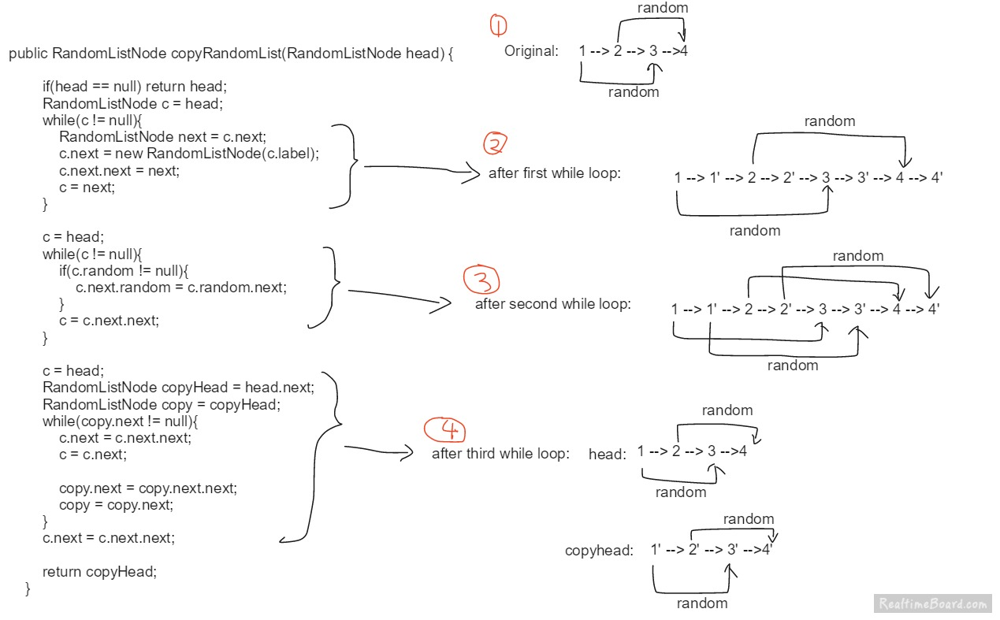

# Array

## [152. Maximum Product Subarray](<https://leetcode.com/problems/maximum-product-subarray/>)

Given an integer array `nums`, find the contiguous subarray within an array (containing at least one number) which has the largest product.

**Example 1:**

```
Input: [2,3,-2,4]
Output: 6
Explanation: [2,3] has the largest product 6.
```

**Example 2:**

```
Input: [-2,0,-1]
Output: 0
Explanation: The result cannot be 2, because [-2,-1] is not a subarray.
```

**Solution**

(1) Wrong Answer 

Stuck in local optimization so failed to find the global optimized result.

```go
func maxProduct(nums []int) int {
    if len(nums) == 0 {
        return 0
    }
    dp := make([]int, len(nums))
    dp[0] = nums[0]
    max := dp[0]
    for i := 1; i < len(nums); i++ {
        if tmp := dp[i-1]*nums[i]; tmp > nums[i] {
            dp[i] = tmp
        } else {
            dp[i] = nums[i]
        }
        if dp[i] > max {
            max = dp[i]
        }
    }
    return max
}
```

```
Input:
[-2,3,-4]
Output:
3
Expected:
24
```

(2) Accepted

Here we keep 2 values: the max cumulative product UP TO current element starting from SOMEWHERE in the past, and the minimum cumulative product UP TO current element. At each new element, we could either add the new element to the existing product, or start fresh the product from current index (wipe out previous results). 

The key point of this problem is how we handle negative integers. If we see a negative number, the "candidate" for max should instead become the previous min product, because a bigger number multiplied by negative becomes smaller, hence the swap them.

```go
func maxProduct(nums []int) int {
    if len(nums) == 0 {
        return 0
    }
    max := nums[0]
    curMax, curMin := nums[0], nums[0]
    for i := 1; i < len(nums); i++ {
        if nums[i] < 0 {
            curMax, curMin = curMin, curMax
        }
        if tmp := curMax*nums[i]; tmp > nums[i] {
            curMax = tmp
        } else {
            curMax = nums[i]
        }
        if tmp := curMin*nums[i]; tmp < nums[i] {
            curMin = tmp
        } else {
            curMin = nums[i]
        }
        if max < curMax {
            max = curMax
        }
    }
    return max
}
```

It would be easier to see the DP structure if we store these 2 values for each index, like `maxProduct[i]`, `minProduct[i]`. 

- Time complexity: $O(n)$
- Space complexity: $O(1)$

**Recap**

This is a typical DP problem. We get the final result from the results of sub problems.

## [169. Majority Element](<https://leetcode.com/problems/majority-element/>)

Given an array of size *n*, find the majority element. The majority element is the element that appears **more than** `⌊ n/2 ⌋`times.

You may assume that the array is non-empty and the majority element always exist in the array.

**Example 1:**

```
Input: [3,2,3]
Output: 3
```

**Example 2:**

```
Input: [2,2,1,1,1,2,2]
Output: 2
```

**Solution**

(1) Accepted

```go
func majorityElement(nums []int) int {
    n := len(nums)
    count := make(map[int]int)
    for i := range nums {
        if count[nums[i]]++; count[nums[i]] > n/2 {
            return nums[i]
        }
    }
    return 0
}
```

- Time complexity: $O(n)$
- Space complexity: $O(m)$ where m is the number of different numbers in the array.

(2) Accepted

```go
func majorityElement(nums []int) int {
    sort.Ints(nums)
    return nums[len(nums)/2]
}
```

- Time complexity: kind of $O(nlogn)$
- Space complexity: $O(1)$

(3) Accepted 

```go
func majorityElement(nums []int) int {
	var count, res int
	for i := range nums {
		if count == 0 {
			res = nums[i]
		}
        // Note that here we do not use else-if
        // because we want to assure that when we
        // encouter a number for the first time 
        // count will be set to 1
		if nums[i] == res {
			count++
		} else {
			count--
		}
	}
	return res
}
```

The key point is "the majority element always exist in the array". 

When `count != 0` , it means `nums[1...i]` has a majority,which is major in the solution.
When `count == 0`, it means `nums[1...i ]` doesn't have a majority, so `nums[1...i]` will not help.

Actually, this is called [Boyer-Moore Majority Vote Algorithm]([https://en.wikipedia.org/wiki/Boyer%E2%80%93Moore_majority_vote_algorithm](https://en.wikipedia.org/wiki/Boyer–Moore_majority_vote_algorithm)).

<https://www.zhihu.com/question/49973163/answer/235921864>

- Time complexity: $O(n)$
- Space complexity: $O(1)$

## [189. Rotate Array](<https://leetcode.com/problems/rotate-array/>)

Given an array, rotate the array to the right by *k* steps, where *k* is non-negative.

**Example 1:**

```
Input: [1,2,3,4,5,6,7] and k = 3
Output: [5,6,7,1,2,3,4]
Explanation:
rotate 1 steps to the right: [7,1,2,3,4,5,6]
rotate 2 steps to the right: [6,7,1,2,3,4,5]
rotate 3 steps to the right: [5,6,7,1,2,3,4]
```

**Example 2:**

```
Input: [-1,-100,3,99] and k = 2
Output: [3,99,-1,-100]
Explanation: 
rotate 1 steps to the right: [99,-1,-100,3]
rotate 2 steps to the right: [3,99,-1,-100]
```

**Note:**

- Try to come up as many solutions as you can, there are at least 3 different ways to solve this problem.
- Could you do it in-place with O(1) extra space?

**Solution**

(1) Accepted

It's very straightforward.

```go
func rotate(nums []int, k int) {
	if len(nums) == 0 {
		return
	}
	for ; k > 0; k-- {
		last := nums[len(nums)-1]
		for i := len(nums) - 2; i >= 0; i-- {
			nums[i+1] = nums[i]
		}
		nums[0] = last
	}
}
```

- Time complexity: $O(kn)$
- Space complexity: $O(1)$

(2) Accepted

This approach is based on the fact that when we rotate the array k times, k%n elements from the back end of the array come to the front and the rest of the elements from the front shift backwards.

In this approach, we firstly reverse all the elements of the array. Then, reversing the first k elements followed by reversing the rest n-k elements gives us the required result.

```go
k = 3
Original List                   : 1 2 3 4 5 6 7
After reversing all numbers     : 7 6 5 4 3 2 1
After reversing first k numbers : 5 6 7 4 3 2 1
After revering last n-k numbers : 5 6 7 1 2 3 4 --> Result
```

```go
func rotate(nums []int, k int) {
	if len(nums) == 0 {
		return
	}
	reverse := func(i, j int) {
		for ; i < j; i, j = i+1, j-1 {
			nums[i], nums[j] = nums[j], nums[i]
		}
	}
    k %= len(nums) // Handle the cases where k > len(nums)
	reverse(0, len(nums)-1)
	reverse(0, k-1)
	reverse(k, len(nums)-1)
}
```

- Time complexity: $O(n)$
- Space complexity: $O(1)$

(3) Accepted

We use an extra array in which we place every element of the array at its correct position.

```go
func rotate(nums []int, k int) {
	if len(nums) == 0 {
		return
	}
	n := len(nums)
	arr := make([]int, n)
	for i := range nums {
		arr[(i+k)%n] = nums[i]
	}
	for i  := range arr {
		nums[i] = arr[i]
	}
}
```

- Time complexity: $O(n)$
- Space complexity: $O(n)$

## [217. Contains Duplicates](<https://leetcode.com/problems/contains-duplicate/>)

Given an array of integers, find if the array contains any duplicates.

Your function should return true if any value appears at least twice in the array, and it should return false if every element is distinct.

**Example 1:**

```
Input: [1,2,3,1]
Output: true
```

**Example 2:**

```
Input: [1,2,3,4]
Output: false
```

**Solution**

(1) Accepted

```go
func containsDuplicate(nums []int) bool {
    if len(nums) == 0 {
        return false
    }
    sort.Ints(nums)
    for i := 0; i < len(nums)-1; i++ {
        if nums[i] == nums[i+1] {
            return true
        }
    }
    return false
}
```

- Time complexity: average $O(nlogn)$
- Space complexity: $O(1)$

(2) Accepted

```go
func containsDuplicate(nums []int) bool {
    if len(nums) == 0 {
        return false
    }
    count := make(map[int]int)
    for i := range nums {
        count[nums[i]]++
    }
    for n := range count {
        if count[n] > 1 {
            return true
        }
    }
    return false
}
```

- Time complexity: $O(n)$
- Space complexity: $O(n)$

(3) Accepted

```go
func containsDuplicate(nums []int) bool {
    if len(nums) <= 1 {
        return false
    }
    present := make(map[int]bool)
    for i := range nums {
        if present[nums[i]] {
            return true
        } else {
            present[nums[i]] = true
        }
    }
    return false
}
```

- Time complexity: $O(n)$
- Space complexity: $O(n)$

**Recap**

Always try as hard as possible to find out a solution which can solve array problem in one pass.

## [283. Move Zeroes](<https://leetcode.com/problems/move-zeroes/>)

Given an array `nums`, write a function to move all `0`'s to the end of it while maintaining the relative order of the non-zero elements.

**Example:**

```
Input: [0,1,0,3,12]
Output: [1,3,12,0,0]
```

**Note**:

1. You must do this **in-place** without making a copy of the array.
2. Minimize the total number of operations.

**Solution**

(1) Accepted

Two pointers.

```go
func moveZeroes(nums []int) {
	for i, j := len(nums)-1, len(nums)-1; i >= 0 && j >= 0; {
		// Find a zero 
		for ; i >= 0 && nums[i] != 0; i-- {
		}
		if i < 0 {
			return
		} else {
			// Move non-zero elements to the left
			for k := i; k < j; k++ {
				nums[k] = nums[k+1]
			}
			// Move zero to the end
			nums[j] = 0
			i, j = i-1, j-1
		}
	}
}
```

- Time complexity: $O(n)$?
- Space complexity: $O(1)$

(2) Accepted

```go
func moveZeroes(nums []int) {
	if len(nums) == 0 {
		return
	}
	insert := 0
    // Move non-zeros to the left as far as possible
	for i := range nums {
		if nums[i] != 0 {
			nums[insert] = nums[i]
			insert++
		}
	}
    // Fill remaining positions with 0s
	for ; insert < len(nums); insert++ {
		nums[insert] = 0
	}
}
```

- Time complexity: $O(n)$
- Space complexity: $O(1)$

(3) Accepted

```go
func moveZeroes(nums []int) {
	if len(nums) == 0 {
		return
	}
    // j is the index of left-most zero 
	for i, j := 0, 0; i < len(nums); i++ {
		if nums[i] != 0 {
			nums[i], nums[j] = nums[j], nums[i]
			j++
		}
	}
}
```

Improvement:

```go
func moveZeroes(nums []int) {
	if len(nums) == 0 {
		return
	}
	for i, j := 0, 0; i < len(nums); i++ {
		if nums[i] != 0 {
             // Avoid unnecessary operations 
			if i > j {
				nums[j] = nums[i]
				nums[i] = 0
			}
			j++
		}
	}
}
```

- Time complexity: $O(n)$
- Space complexity: $O(1)$

(4) Accepted

```go
	for i := 0; i < len(nums)-1; i++ {
		if nums[i] == 0 {
			// When we find a zero,
			// we keep moving to find next non-zero
			for j := i+1; j < len(nums); j++ {
				if nums[j] != 0 {
					nums[i], nums[j] = nums[j], nums[i]
					break
				}
			}
		}
	}
```

- Time complexity: $O(n)$ ?
- Space complexity: $O(1)$

**Recap**

Shifting elements in a array one by one is always too slow.

## [384. Shuffle Array](<https://leetcode.com/problems/shuffle-an-array/>)

Shuffle a set of numbers without duplicates.

**Example:**

```
// Init an array with set 1, 2, and 3.
int[] nums = {1,2,3};
Solution solution = new Solution(nums);

// Shuffle the array [1,2,3] and return its result. Any permutation of [1,2,3] must equally likely to be returned.
solution.shuffle();

// Resets the array back to its original configuration [1,2,3].
solution.reset();

// Returns the random shuffling of array [1,2,3].
solution.shuffle();
```

**Solution**

(1) Memory Limited Exceeded

```go
type Solution struct {
	Data  []int
	Perms [][]int
}

func Constructor(nums []int) Solution {
	solution := Solution{}
	solution.Data = make([]int, len(nums))
	copy(solution.Data, nums)
	// Generate all permutations
	solution.Perms = perm(nums)
	return solution
}

func perm(data []int) (res [][]int) {
	var do func(int)
	do = func(i int) {
		if i == len(data) {
			tmp := make([]int, i)
			copy(tmp, data)
			res = append(res, tmp)
		} else {
			for j := i; j < len(data); j++ {
				data[j], data[i] = data[i], data[j]
				do(i + 1)
				data[j], data[i] = data[i], data[j]
			}
		}
	}
	do(0)
	return
}

/** Resets the array to its original configuration and return it. */
func (this *Solution) Reset() []int {
	return this.Data
}

/** Returns a random shuffling of the array. */
func (this *Solution) Shuffle() []int {
	return this.Perms[rand.Intn(len(this.Perms))]
}
```

We will need $O(n!)$  extra space to store all permutations which is too much.

(2) Accepted

[Fisher-Yates Algorithm]([https://en.wikipedia.org/wiki/Fisher%E2%80%93Yates_shuffle#The_modern_algorithm])

```go
type Solution struct {
	Data []int
}

func Constructor(nums []int) Solution {
	return Solution{nums}
}

/** Resets the array to its original configuration and return it. */
func (this *Solution) Reset() []int {
	return this.Data
}

/** Returns a random shuffling of the array. */
func (this *Solution) Shuffle() []int {
	arr := make([]int, len(this.Data))
	copy(arr, this.Data)
	// Fisher-Yates algorithm
	for i := len(arr) - 1; i >= 1; i-- {
		j := rand.Intn(i + 1)
		arr[i], arr[j] = arr[j], arr[i]
	}
	return arr
}
```

`Shuffle`complexity:

- Time complexity: $O(n)$
- Space complexity: $O(n)$

Improvement: We allocate an extra array to store one permutation in advance instead of allocating one every time we call `Shuffle`.

```go
type Solution struct {
	Data []int
	Perm []int
}

func Constructor(nums []int) Solution {
	perm := make([]int, len(nums))
    copy(perm, nums)
	return Solution{nums, perm}
}

/** Resets the array to its original configuration and return it. */
func (this *Solution) Reset() []int {
	return this.Data
}

/** Returns a random shuffling of the array. */
func (this *Solution) Shuffle() []int {
	// Fisher-Yates algorithm
	for i := len(this.Perm) - 1; i >= 1; i-- {
		j := rand.Intn(i + 1)
		this.Perm[i], this.Perm[j] = this.Perm[j], this.Perm[i]
	}
	return this.Perm
}
```

(3) Accepted

`rand.Shuffle`is a function of standard library which can shuffle pseudo-randomizes the order of elements. Actually, it's also based on Fisher-Yates algorithm.

```go
type Solution struct {
	Data []int
	Perm []int
}

func Constructor(nums []int) Solution {
	perm := make([]int, len(nums))
	copy(perm, nums)
	return Solution{nums, perm}
}

/** Resets the array to its original configuration and return it. */
func (this *Solution) Reset() []int {
	return this.Data
}

/** Returns a random shuffling of the array. */
func (this *Solution) Shuffle() []int {
	rand.Shuffle(len(this.Perm), func(i, j int) {
		this.Perm[i], this.Perm[j] = this.Perm[j], this.Perm[i]
	})
	return this.Perm
}
```

**Recap**

1. Fisher-Yates algorithm can generate every permutation equally likely. `rand.Shuffle`is based on it.
2. `rand.Intn`generates pseudo-random number in [0, n).

## [350. Intersection of Two Arrays II](<https://leetcode.com/problems/intersection-of-two-arrays-ii/>)

Given two arrays, write a function to compute their intersection.

**Example 1:**

```
Input: nums1 = [1,2,2,1], nums2 = [2,2]
Output: [2,2]
```

**Example 2:**

```
Input: nums1 = [4,9,5], nums2 = [9,4,9,8,4]
Output: [4,9]
```

**Note:**

- Each element in the result should appear as many times as it shows in both arrays.
- The result can be in any order.

**Follow up:**

- What if the given array is already sorted? How would you optimize your algorithm?
- What if *nums1*'s size is small compared to *nums2*'s size? Which algorithm is better?
- What if elements of *nums2* are stored on disk, and the memory is limited such that you cannot load all elements into the memory at once?

**Solution**

(1) Accepted

Quite straightforward.

```go
func intersect(nums1 []int, nums2 []int) []int {
    if len(nums1) == 0 || len(nums2) == 0 {
        return nil
    }
    countNums1, countNums2 := make(map[int]int), make(map[int]int)
    for i := range nums1 {
        countNums1[nums1[i]]++
    }
    for i := range nums2 {
        countNums2[nums2[i]]++
    }
    res := make([]int, 0)
    add := func(element, count int) {
        for i := 0; i < count; i++ {
            res = append(res, element)
        }
    }
    for n1 := range countNums1 {
        var min int
        if countNums1[n1] < countNums2[n1] {
            min = countNums1[n1]
        } else {
            min = countNums2[n1]
        }
        add(n1, min)
    }
    return res
}
```

- Time complexity: $O(max\{len(nums1), len(nums2)\})$
- Space complexity: $O(n1+n2)$ where n1 is the number of distinct numbers in `nums1`and n2 is the number of distinct numbers in `nums2`.

Improvement: only one map

```go
func intersect(nums1 []int, nums2 []int) []int {
    if len(nums1) == 0 || len(nums2) == 0 {
        return nil
    }
    count := make(map[int]int)
    for i := range nums1 {
        count[nums1[i]]++
    }
    res := make([]int, 0)
    for i := range nums2 {
        if count[nums2[i]] > 0 {
            res = append(res, nums2[i])
            count[nums2[i]]--
        }
    }
    return res
}
```

(2) Accepted

```go
func intersect(nums1 []int, nums2 []int) []int {
    if len(nums1) == 0 || len(nums2) == 0 {
        return nil
    }
    sort.Ints(nums1)
    sort.Ints(nums2)
    res := make([]int, 0)
    for i, j := 0, 0; i < len(nums1) && j < len(nums2); {
        if nums1[i] == nums2[j] {
            res = append(res, nums1[i])
            i, j = i+1, j+1
        } else if nums1[i] > nums2[j] {
            j++
        } else {
            i++
        }
    }
    return res
}
```

- Time complexity: $O(n1log(n1)+n2log(n2))$
- Space complexity: $O(1)$

(3) Solution to 3rd follow-up question?

If only nums2 cannot fit in memory, put all elements of nums1 into a map (like Solution 1), read chunks of array that fit into the memory, and record the intersections. 

**Recap**

Use as little memory as we can. In general, it's unnecessary to use more than one map.

## [334. Increasing Triplet Subsequence](<https://leetcode.com/problems/increasing-triplet-subsequence/>)

Given an unsorted array return whether an increasing subsequence of length 3 exists or not in the array.

Formally the function should:

> Return true if there exists *i, j, k* 
> such that *arr[i]* < *arr[j]* < *arr[k]* given 0 ≤ *i* < *j* < *k* ≤ *n*-1 else return false.

**Note:** Your algorithm should run in O(*n*) time complexity and O(*1*) space complexity.

**Example 1:**

```
Input: [1,2,3,4,5]
Output: true
```

**Example 2:**

```
Input: [5,4,3,2,1]
Output: false
```

**Solution**

(1) Time Limited Exceeded

Of course brute force ...

````go
func increasingTriplet(nums []int) bool {
    if len(nums) < 3 {
        return false
    }   
    for i := 0; i < len(nums)-2; i++ {
        for j := i+1; j < len(nums)-1; j++ {
            for k := j+1; k < len(nums); k++ {
                if nums[i] < nums[j] && nums[j] < nums[k] {
                    return true
                }
            }
        }
    }
    return false
}
````

- Time complexity: $O(n^3)$
- Space complexity: $O(1)$

(2) Accepted


```go
func increasingTriplet(nums []int) bool {
    if len(nums) < 3 {
        return false
    }   
    small, middle := math.MaxInt64, math.MaxInt64
    for i := range nums {
        if nums[i] <= small {
            small = nums[i]
        } else if nums[i] <= middle {
            middle = nums[i]
        } else {
            return true
        }
    }
    return false
}
```

Let's clarify what `small`and `middle`mean:

- `small`: so far *the best* candidate of smallest one in the triplet subsequence
- `middle`: so far *the best* candidate of middle one in the triplet subsequence

For this problem, above code does work well. Take `[1, 0, 2, 0, -1, 3]`for example:

```
Iteration One
small = 1 middle = INF
Iteration Two
small = 0 middle = INF
Iteration Three
small = 0 middle = 2
Iteration Four (Nothing Changes)
small = 0 middle = 2
Iteration Five (Confusing Part)
small = -1 middle = 2
Iteration Six
return true; Since 3 > 2 && 3 > -1
```

Setting `small= -1` is important, yet doesn't change the answer in this case since `middle= 2` implies that their existed a value that was previously smaller than `2`. Notice if we had a test case like this `[1,0,2,0,-1,0,1]` we now could see the importance of the updated lower bound for `small = -1`.

However, **if the problem requires us to return the index, then this code would not work**.

- Time complexity: $O(n)$
- Space complexity: $O(1)$

**Recap**

Obviously, this is another DP problem. We don't really need `dp`array stuff in every single DP problem.

## [240. Search a 2D Matrix II](<https://leetcode.com/problems/search-a-2d-matrix-ii/>)

Write an efficient algorithm that searches for a value in an *m* x *n* matrix. This matrix has the following properties:

- Integers in each row are sorted in ascending from left to right.
- Integers in each column are sorted in ascending from top to bottom.

**Example:**

Consider the following matrix:

```
[
  [1,   4,  7, 11, 15],
  [2,   5,  8, 12, 19],
  [3,   6,  9, 16, 22],
  [10, 13, 14, 17, 24],
  [18, 21, 23, 26, 30]
]
```

Given target = `5`, return `true`.

Given target = `20`, return `false`.

**Solution**

(1) Accepted

Since every row/column is sorted, we can do binary search to every row/column.

```go
func searchMatrix(matrix [][]int, target int) bool {
	if len(matrix) == 0 || len(matrix[0]) == 0 {
		return false
	}
	for i := range matrix {
		if target >= matrix[i][0] && target <= matrix[i][len(matrix[i])-1] {
			if j := sort.SearchInts(matrix[i], target); j < len(matrix[i]) && matrix[i][j] == target {
				return true
			}
		}
	}
	return false
}
```

- Time complexity: $O(rows*log(columns))$
- Space complexity: $O(1)$

(2) Accepted

```go
func searchMatrix(matrix [][]int, target int) bool {
	if len(matrix) == 0 || len(matrix[0]) == 0 {
		return false
	}
    for r, c := 0, len(matrix[0])-1; r < len(matrix) && c >= 0; {
        if matrix[r][c] == target {
            return true
        } else if matrix[r][c] < target {
            r++
        } else {
            c--
        }
    } 
	return false
}
```

- Time complexity: $O(rows+columns)$
- Space complexity: $O(1)$

**Recap**

1. `sort.SearchInts`will return the position where target **should be** in array.
2. Sometimes try to iterate an array reversely and it may help.

## [238. Product of Array Except Self](<https://leetcode.com/problems/product-of-array-except-self/>)

Given an array `nums` of *n* integers where *n*> 1,  return an array `output` such that `output[i]` is equal to the product of all the elements of `nums` except `nums[i]`.

**Example:**

```
Input:  [1,2,3,4]
Output: [24,12,8,6]
```

**Note:** Please solve it **without division** and in O(*n*).

**Follow up:**
Could you solve it with constant space complexity? (The output array **does not** count as extra space for the purpose of space complexity analysis.)

**Solution**

(1) Accepted

- `left[i]=nums[0]*...*nums[i-1], i > 0`
- `right[i]=nums[len(nums)-1]*...*nums[i+1], i >= 0`

```go
func productExceptSelf(nums []int) []int {
    n := len(nums)
    res, left, right := make([]int, n), make([]int, n), make([]int, n)
    for i := range left {
        left[i], right[i] = 1, 1
    }
    for i := 1; i < n; i++ {
        left[i] = left[i-1] * nums[i-1]
    }
    for i := n-2; i >= 0; i-- {
        right[i] = right[i+1] * nums[i+1]
    }
    for i := range nums {
        res[i] = left[i] * right[i]
    }
    return res
}
```

- Time complexity: $O(n)$
- Space complexity: $O(n)$

Improvement: no extra space

```go
func productExceptSelf(nums []int) []int {
    n := len(nums)
    res := make([]int, len(nums))
    res[0] = 1
    // res[i] = nums[0]*...*nums[i-1], i > 1
    for i := 1; i < n; i++ {
        res[i] = res[i-1] * nums[i-1]
    }
    // right = nums[n-1]*...*nums[1]
    // So multiply res[i] by corresponding right 
    // to complete the computation
    right := 1
    for i := n-1; i >= 0; i-- {
        res[i] *= right
        right *= nums[i]
    }
    return res
}
```

- Time complexity: $O(n)$
- Space complexity: $O(1)$

(2) Accepted

Same idea but one pass.

```go
func productExceptSelf(nums []int) []int {
	n := len(nums)
	res := make([]int, n)
	for i := range res {
		res[i] = 1
	}
	left, right := 1, 1
	for i := 0; i < n; i++ {
		res[i] *= left
		res[n-1-i] *= right
		left, right = left*nums[i], right*nums[n-1-i]
	}
	return res
}
```

- Time complexity: $O(n)$
- Space complexity: $O(1)$

**Recap**

Product or accumulation problem ?

## [46. Permutations](<https://leetcode.com/problems/permutations/>)

Given a collection of **distinct** integers, return all possible permutations.

**Example:**

```
Input: [1,2,3]
Output:
[
  [1,2,3],
  [1,3,2],
  [2,1,3],
  [2,3,1],
  [3,1,2],
  [3,2,1]
]
```

**Solution**

A typical backtracking problem.

```go
func permute(nums []int) [][]int {
    if len(nums) == 0 {
        return nil
    }
    res, tmp := make([][]int, 0), make([]int, 0, len(nums))
    backtrack(&res, tmp, nums)
    return res
}

func backtrack(res *[][]int, tmp []int, nums []int) {
    if len(tmp) == len(nums) {
        *res = append(*res, tmp)
        return
    }
    for i := range nums {
        // Skip used elements
        if !contains(tmp, nums[i]) {
            // copy is important
            _tmp := make([]int, len(tmp))
            copy(_tmp, tmp)
            _tmp = append(_tmp, nums[i])
            backtrack(res, _tmp, nums)
        }
    }
}

func contains(nums []int, num int) bool {
    for _, n := range nums {
        if n == num {
            return true
        }
    }
    return false
}
```
**Recap**

Many backtracking problems can be solved by the same structure.

```go
func backtrack(res *[][]int, tmp []int, nums []int) {
    // condition...
    for i := start; i < len(nums); i++ {
        _tmp := make([]int, len(tmp))
        copy(_tmp, tmp)
        _tmp = append(_tmp, nums[i])  
        backtrack(res, _tmp, nums)
    }
}
```

## [39. Combination Sum](https://leetcode.com/problems/combination-sum/)

Given a set of candidate numbers (candidates) (without duplicates) and a target number (target), find all unique combinations in candidates where the candidate numbers sums to target.

The same repeated number may be chosen from candidates unlimited number of times.

Note:

All numbers (including target) will be positive integers.
The solution set must not contain duplicate combinations.
Example 1:
```
Input: candidates = [2,3,6,7], target = 7,
A solution set is:
[
  [7],
  [2,2,3]
]
```
Example 2:
```
Input: candidates = [2,3,5], target = 8,
A solution set is:
[
  [2,2,2,2],
  [2,3,3],
  [3,5]
]
```
**Solution**

```go
func combinationSum(candidates []int, target int) [][]int {
    res := make([][]int, 0)
    sort.Ints(candidates)
    backtrack(&res, make([]int, 0, len(candidates)), candidates, target, 0)
    return res
}

func backtrack(res *[][]int, tmp []int, candidates []int, target int, start int) {
    if target < 0 {
        return
    } else if target == 0 {
        *res = append(*res, tmp)
    }
    for i := start; i < len(candidates); i++ {
        _tmp := make([]int, len(tmp))
        copy(_tmp, tmp)
        _tmp = append(_tmp, candidates[i])
        backtrack(res, _tmp, candidates, target-candidates[i], i) // Not i + 1 because we can reuse same elements
    }
}
```

## [78. Subsets](https://leetcode.com/problems/subsets/)

Given a set of **distinct** integers, nums, return all possible subsets (the power set).

**Note**: The solution set must not contain duplicate subsets.

Example:
```
Input: nums = [1,2,3]
Output:
[
  [3],
  [1],
  [2],
  [1,2,3],
  [1,3],
  [2,3],
  [1,2],
  []
]
```
**Solution**

```go
func subsets(nums []int) [][]int {
    res := make([][]int, 0)
    sort.Ints(nums)
    backtrack(&res, make([]int, 0), nums, 0)
    return res   
}

func backtrack(res *[][]int, tmp []int, nums []int, start int) {
    *res = append(*res, tmp)
    for i := start; i < len(nums); i++ {
        _tmp := make([]int, len(tmp))
        copy(_tmp, tmp)
        _tmp = append(_tmp, nums[i])
        backtrack(res, _tmp, nums, i+1)
    }
}
```

## [54. Spiral Matrix](https://leetcode.com/problems/spiral-matrix/)

Given a matrix of m x n elements (m rows, n columns), return all elements of the matrix in spiral order.

Example 1:
```
Input:
[
 [ 1, 2, 3 ],
 [ 4, 5, 6 ],
 [ 7, 8, 9 ]
]
Output: [1,2,3,6,9,8,7,4,5]
```
Example 2:
```
Input:
[
  [1, 2, 3, 4],
  [5, 6, 7, 8],
  [9,10,11,12]
]
Output: [1,2,3,4,8,12,11,10,9,5,6,7]
```

**Solution**

(1) Accepted

Path should turn clockwise whenever it would go out of bounds or into a cell that was previously visited.

As we move through the matrix, our candidate next position is `(cr, cc)`. If the candidate is in the bounds of the matrix and unseen, then it becomes our next position; otherwise, our next position is the one after performing a clockwise turn.

```go
func spiralOrder(matrix [][]int) []int {
    if len(matrix) == 0 || len(matrix[0]) == 0 {
        return nil
    }
    m, n := len(matrix), len(matrix[0])
    total := m * n
    res, visited := make([]int, total), make([][]bool, m)
    for i := range visited {
        visited[i] = make([]bool, n)
    }
    dir := [][]int{{0, 1}, {1, 0}, {0, -1}, {-1, 0}} // right -> down -> left -> up
    for i, r, c, d := 0, 0, 0, 0; i < total; i++ {
        res[i] = matrix[r][c]
        visited[r][c] = true
        if cr, cc := r+dir[d][0], c+dir[d][1]; cr >= 0 && cr < m && cc >= 0 && cc < n && !visited[cr][cc] {
            r, c = cr, cc
        } else {
            d = (d+1) % 4
            r, c = r+dir[d][0], c+dir[d][1]
        }
    } 
    return res
}
```

- Time complexity: $O(m*n)$
- Space complexity: $O(m*n)$

(2) Accepted

For each layer, we want to iterate through its elements in clockwise order starting from the top left corner. Suppose the current outer layer has top-left coordinates `(r1, c1)` and bottom-right coordinates `(r2, c2)`.

Then, the top row is the set of elements `(r1, c)` for `c = c1,...,c2`, in that order. The rest of the right side is the set of elements `(r, c2)` for `r = r1+1,...,r2`, in that order. Then, if there are four sides to this layer (ie., `r1 < r2` and `c1 < c2`), we iterate through the bottom side and left side as shown in the solutions below.


```go
func spiralOrder(matrix [][]int) []int {
    if len(matrix) == 0 || len(matrix[0]) == 0 {
        return nil
    }
    res := make([]int, 0)
    for r1, c1, r2, c2 := 0, 0, len(matrix)-1, len(matrix[0])-1; r1 <= r2 && c1 <= c2; r1, c1,r2, c2 = r1+1, c1+1, r2-1, c2-1 {
        for c := c1; c <= c2; c++ {
            res = append(res, matrix[r1][c])
        }
        for r := r1+1; r <= r2; r++ {
            res = append(res, matrix[r][c2])
        }
        if r1 < r2 && c1 < c2 {
            for c := c2-1; c > c1; c-- {
                res = append(res, matrix[r2][c])
            } 
            for r := r2; r > r1; r-- {
                res = append(res, matrix[r][c1])
            }
        }
    }
    return res
}
```

- Time complexity: $O(m*n)$
- Space complexity: $O(1)$

## [31. Next Permutation](https://leetcode.com/problems/next-permutation/)

Implement next permutation, which rearranges numbers into the lexicographically next greater permutation of numbers.

If such arrangement is not possible, it must rearrange it as the lowest possible order (ie, sorted in ascending order).

The replacement must be in-place and use only constant extra memory.

Here are some examples. Inputs are in the left-hand column and its corresponding outputs are in the right-hand column.
```
1,2,3 → 1,3,2
3,2,1 → 1,2,3
1,1,5 → 1,5,1
```

**Solution**

This is an algorithm created by a man named [Narayana Pandita](https://en.wikipedia.org/wiki/Permutation#Generation_in_lexicographic_order) in the 14th century.

Let's say the `nums = [2, 3 ,6, 5, 4, 1]` now and here is the solution:

1. From **right to left**, find the first number which is not greater than previous one. In our example it's 3.
2. We may have two situations:

  - We cannot find the number which means this permutation is the last permutation, we need to rotate back to the first permutation. So we reverse the whole array.

  - We can find the number, then the next step, we will start from right most to leftward, try to find the first number which is larger than 3, in this case it is 4. Then we swap 3 and 4, the list turn to `[2, 4, 6, 5, 3, 1]`. Last, we reverse numbers on the right of 4, we finally get `[2, 4, 1, 3, 5, 6]`.

```go
func nextPermutation(nums []int)  {
    n := len(nums)
    var k int
    for k = n-2; k >= 0; k-- {
        if nums[k] < nums[k+1] {
            break
        }
    }
    if k < 0 {
        reverse(nums)
    } else {
        l := n - 1
        for ; l > k; l-- {
            if nums[l] > nums[k] {
                break
            }
        }
        nums[k], nums[l] = nums[l], nums[k]
        reverse(nums[k+1:])
    }
}

func reverse(nums []int) {
    for i, j := 0, len(nums)-1; i < j; i, j = i+1, j-1 {
        nums[i], nums[j] = nums[j], nums[i]
    } 
}
```

- Time complexity: $O(n)$
- Space complexity: $O(1)$

## [56. Merge Intervals](https://leetcode.com/problems/merge-intervals/)

Given a collection of intervals, merge all overlapping intervals.

Example 1:
```
Input: [[1,3],[2,6],[8,10],[15,18]]
Output: [[1,6],[8,10],[15,18]]
Explanation: Since intervals [1,3] and [2,6] overlaps, merge them into [1,6].
```
Example 2:
```
Input: [[1,4],[4,5]]
Output: [[1,5]]
Explanation: Intervals [1,4] and [4,5] are considered overlapping.
```

**Solution**

The idea is quite straightforward:

1. Firstly, we sort intervals ascendingly by their left boundaries.

2. For every two neighbouring intervals, let's say they are a and b, we have three options:

- If a contains b, then we discard b.
- If a overlaps b, we merge them.
- Else, we keep both.

```go
type TwoDArray [][]int

func (tda TwoDArray) Len() int {
    return len(tda)
}

func (tda TwoDArray) Less(i, j int) bool {
    return tda[i][0] < tda[j][0]
}

func (tda TwoDArray) Swap(i, j int) {
    tda[i], tda[j] = tda[j], tda[i]
}

func merge(intervals [][]int) [][]int {
    if len(intervals) == 0 || len(intervals[0]) == 0 {
        return nil
    }
    if len(intervals) == 1 {
        return intervals
    }
    // Sort intervals ascendingly by left boundary of each interval
    sort.Sort(TwoDArray(intervals))
    // Test whether a overlaps b
    overlaps := func(a, b []int) bool {
        return math.Min(float64(a[1]), float64(b[1]))-math.Max(float64(a[0]), float64(b[0])) >= 0
    }
    // Test whether a contains b
    contains := func(a, b []int) bool {
        return a[0] <= b[0] && a[1] >= b[1]
    }
    res := [][]int{intervals[0]}
    for i := 1; i < len(intervals); i++ {
        if pre := res[len(res)-1]; contains(pre, intervals[i]) {
            // pre contains intervals[i] -> discard intervals[i]
            continue
        } else if overlaps(pre, intervals[i]) {
            // pre overlaps intervals[i] -> merge them
            res = res[:len(res)-1]
            res = append(res, []int{pre[0], intervals[i][1]})
        } else {
            res = append(res, intervals[i])
        }
    }
    return res
}
```

- Time complexity: $O(nlogn)$
- Space complexity: $O(1)$

Improvement: Actually we don't need to take "overlapping" and "containing" as two distinct situations.

```go
type TwoDArray [][]int

func (tda TwoDArray) Len() int {
    return len(tda)
}

func (tda TwoDArray) Less(i, j int) bool {
    return tda[i][0] < tda[j][0]
}

func (tda TwoDArray) Swap(i, j int) {
    tda[i], tda[j] = tda[j], tda[i]
}

func merge(intervals [][]int) [][]int {
    if len(intervals) == 0 || len(intervals[0]) == 0 {
        return nil
    }
    if len(intervals) == 1 {
        return intervals
    }
    // Sort intervals ascendingly by left boundary of each interval
    sort.Sort(TwoDArray(intervals))
    pre := intervals[0]
    res := [][]int{pre}
    for _, interval := range intervals {
        if interval[0] <= pre[1] {
            // pre overlaps interval or 
            // pre contains interval
            if interval[1] > pre[1] {
                // Update right boundary if necessary
                pre[1] = interval[1]
            }
        } else {
            // pre and interval are disjoint
            pre, res = interval, append(res, interval)
        }
    }
    return res
}
```

**Recap**

Let's say we have two intervals `[a, b] (a <= b)` and `[c, d] (c <= d)`. If `c <= b`, they overlap and the length of overlapped section is `min(b, d) - max(a, c)`.

## [73. Set Matrix Zeroes](https://leetcode.com/problems/set-matrix-zeroes/)

Given a m x n matrix, if an element is 0, set its entire row and column to 0. Do it in-place.

Example 1:
```
Input: 
[
  [1,1,1],
  [1,0,1],
  [1,1,1]
]
Output: 
[
  [1,0,1],
  [0,0,0],
  [1,0,1]
]
```
Example 2:
```
Input: 
[
  [0,1,2,0],
  [3,4,5,2],
  [1,3,1,5]
]
Output: 
[
  [0,0,0,0],
  [0,4,5,0],
  [0,3,1,0]
]
```
Follow up:

- A straight forward solution using O(mn) space is probably a bad idea.
- A simple improvement uses O(m + n) space, but still not the best solution.
- Could you devise a constant space solution?

**Solution**

(1) Accepted

```go
func setZeroes(matrix [][]int)  {
    zeroes := make([][]int, 0) // (i, j) where matrix[i][j] == 0
    for i := range matrix {
        for j := range matrix[i] {
            if matrix[i][j] == 0 {
                zeroes = append(zeroes, []int{i, j})
            }
        }
    }
    m, n := len(matrix), len(matrix[0])
    for _, zero := range zeroes {
        row, col := zero[0], zero[1]
        for i := 0; i < n; i++ {
            matrix[row][i] = 0
        }
        for j := 0; j < m; j++ {
            matrix[j][col] = 0
        }
    }
}
```

- Time complexity: $O(mXn)$
- Space complexity: $O(mXn)$ at worst

(2) Accepted

```go
func setZeroes(matrix [][]int)  {
    rows := make([]int, 0, len(matrix)) // rows which contain 0s
    cols := make([]int, 0, len(matrix[0])) // colums which contain 0s
    for i := range matrix {
        for j := range matrix[i] {
            if matrix[i][j] == 0 {
                rows, cols = append(rows, i), append(cols, j)
            }
        }
    }
    for _, r := range rows {
        for i := 0; i < len(matrix[0]); i++ {
            matrix[r][i] = 0
        }
    }
    for _, c := range cols {
        for i := 0; i < len(matrix); i++ {
            matrix[i][c] = 0
        }
    }
}
```

- Time complexity: $O(mXn)$
- Space complexity: $O(m+n)$

(3) 

Store states of each row in the first of that row, and store states of each column in the first of that column. Because the state of first row and the state of first column would occupy the same cell, let it be the state of first row, and use another variable `col0` for first column. In the first phase, use matrix elements to set states in a top-down way. In the second phase, use states to set matrix elements in a bottom-up way.

```go
func setZeroes(matrix [][]int)  {
    col0 := false // whether we need to set the first column to 0
    m, n := len(matrix), len(matrix[0])
    for i := 0; i < m; i++ {
        if matrix[i][0] == 0 {
            col0 = true
        }
        for j := 1; j < n; j++ {
            if matrix[i][j] == 0 {
                matrix[i][0], matrix[0][j] = 0, 0
            }
        }
    }

    for i := m-1; i >= 0; i-- {
        for j := n-1; j >= 1; j-- {
            if matrix[i][0] == 0 || matrix[0][j] == 0 {
                matrix[i][j] = 0
            }
        }
        // handle the first column
        if col0 {
            matrix[i][0] = 0
        }
    } 
}
```

## [75. Sort Colors](https://leetcode.com/problems/sort-colors/)

Given an array with n objects colored red, white or blue, sort them in-place so that objects of the same color are adjacent, with the colors in the order red, white and blue.

Here, we will use the integers 0, 1, and 2 to represent the color red, white, and blue respectively.

Note: You are not suppose to use the library's sort function for this problem.

Example:
```
Input: [2,0,2,1,1,0]
Output: [0,0,1,1,2,2]
```
Follow up:

- A rather straight forward solution is a two-pass algorithm using counting sort. First, iterate the array counting number of 0's, 1's, and 2's, then overwrite array with total number of 0's, then 1's and followed by 2's.
- Could you come up with a one-pass algorithm using only constant space?

**Solution**

(1) Accepted

```go
func sortColors(nums []int)  {
    for i, red, blue := 0, 0, len(nums)-1; i <= blue; i++ {
        switch nums[i] {
        case 0:
            nums[i], nums[red] = nums[red], nums[i]
            red++
        case 2:
            nums[i], nums[blue] = nums[blue], nums[i]
            blue--
            i-- // tricky
        }
    } 
}
```

- Time complexity: $O(n)$
- Space complexity: $O(1)$

(2) Accepted

```go
func sortColors(nums []int)  {
    red, white, blue := -1, -1, -1
    for i := range nums {
        switch nums[i] {
        case 0:
            red, white, blue = red+1, white+1, blue+1
            nums[blue], nums[white], nums[red] = 2, 1, 0
        case 1:
            blue, white = blue+1, white+1
            nums[blue], nums[white] = 2, 1
        case 2:
            blue++
            nums[blue] = 2
        }
    }
}
```

- Time complexity: $O(n)$
- Space complexity: $O(1)$

## [88. Merge Sorted Array](https://leetcode.com/problems/merge-sorted-array/)

Given two sorted integer arrays nums1 and nums2, merge nums2 into nums1 as one sorted array.

Note:

The number of elements initialized in nums1 and nums2 are m and n respectively.
You may assume that nums1 has enough space (size that is greater or equal to m + n) to hold additional elements from nums2.
Example:
```
Input:
nums1 = [1,2,3,0,0,0], m = 3
nums2 = [2,5,6],       n = 3

Output: [1,2,2,3,5,6]
```

**Solution**

(1) Accepted

```go
func merge(nums1 []int, m int, nums2 []int, n int)  {
    for i, j := m, 0; i < m+n; i, j = i+1, j+1 {
        nums1[i] = nums2[j]
    }
    sort.Ints(nums1)
}
```

- Time complexity: $O((m+n)log(m+n))$
- Space complexity: $O(1)$

(2) Accepted

Merge two sorted arrays from back to front.

```go
func merge(nums1 []int, m int, nums2 []int, n int)  {
    i, j, k := m-1, n-1, m+n-1
    for i >= 0 && j >= 0 {
        if nums1[i] > nums2[j] {
            nums1[k] = nums1[i]
            i--
        } else {
            nums1[k] = nums2[j]
            j--
        }
        k--
    }
    for j >= 0 {
        nums1[k] = nums2[j]
        k, j = k-1, j-1
    }
}
```

- Time complexity: $O(m+n)$
- Space complexity: $O(1)$

## [251. Flatten 2D Vector]

Implement an iterator to flatten a 2d vector.

For example, Given 2d vector =
```
[
  [1,2],
  [3],
  [4,5,6]
]
```
By calling next repeatedly until hasNext returns false, the order of elements returned by next should be: `[1,2,3,4,5,6]`.

**Solution**

This problem is quite easy to solve as long as we can handle some corner cases properly.

- What if the 2d vector contains empty arrays, e.g. `[[ ], [ ], [1 2 3]]` ? In this case, the `Next()` should not output anything, but the return type is int. There the `HasNext()` should be more complicated in which it handles this situation. 
- What if the 2d vector itself is empty? Again, handle it in `HasNext()`. 

```go
type Vector2D struct {
    data  [][]int
    curX  int
    curY  int
}

func (v *Vector2D) Next() int {
    var next int
    if v.curY < len(v.data[v.curX]) {
        next = v.data[v.curX][v.curY]
    }
    if v.curY++; v.curY == len(v.data[v.curX]) {
        v.curX, v.curY = v.curX+1, 0
    }
    return next
}

func (v *Vector2D) HasNext() bool {
    n := len(v.data)
    for v.curX < n && len(v.data[curX]) == 0 {
        v.curX++
    }
    return n != 0 && v.curX < n
}
```

- Time complexity
  - `Next()`: $O(1)$, `HasNext()`: $O(1)$
- Space complexity: $O(1)$

# Linked List

## [138. Copy List with Random Pointer](<https://leetcode.com/problems/copy-list-with-random-pointer/>)

A linked list is given such that each node contains an additional random pointer which could point to any node in the list or null.

Return a [**deep copy**](https://en.wikipedia.org/wiki/Object_copying#Deep_copy) of the list.

**Example 1:**

****

```
Input:
{"$id":"1","next":{"$id":"2","next":null,"random":{"$ref":"2"},"val":2},"random":{"$ref":"2"},"val":1}

Explanation:
Node 1's value is 1, both of its next and random pointer points to Node 2.
Node 2's value is 2, its next pointer points to null and its random pointer points to itself.
```

**Note:**

1. You must return the **copy of the given head** as a reference to the cloned list.

**Solution**

```go
type RandomListNode struct {
    Label  int
    Next   *RandomListNode
    Random *RandomListNode
}

func copyRandomListNode(head *RandomListNode) *RandomListNode {   
    // 1st round: copy every node and 
    // make them linked to their original nodes
    var next *RandomListNode
    for iter := head; iter != nil; iter = iter.Next.Next {
        next = iter.Next
        copyNode := &RandomListNode{Label: iter.Label}
        // make the copy one become its original node's next node
        iter.Next = copyNode
        copyNode.Next = next
    }
    
    // 2nd round: assign random poiters for the copy nodes
    // iter.Next.Next is the original one
    for iter := head; iter != nil; iter = iter.Next.Next {
        if iter.Random != nil {
            // Note that iter.Next is the copy one 
            // and iter.Random.Next is also a copy one
            iter.Next.Random = iter.Random.Next
        }
    }
    
    // 3rd round: restore the original list and 
    // extract the copy ones
    dummy := new(RandomListNode)
    for iter, copyIter := head, dummy; iter != nil; iter, copyIter = iter.Next, copyIter.Next {
        next, copyNode := iter.Next.Next, iter.Next
        // extarct the copy one
        copyIter.Next = copyNode
        // restore the original list
        iter.Next = next
    }
    return dummy.Next
}
```

Clarify:



- Time complexity: $O(n)$
- Space complexity: $O(1)$

## [141. Linked List Cycle](<https://leetcode.com/problems/linked-list-cycle/>)

Given a linked list, determine if it has a cycle in it.

To represent a cycle in the given linked list, we use an integer `pos` which represents the position (0-indexed) in the linked list where tail connects to. If `pos` is `-1`, then there is no cycle in the linked list.

**Example 1:**

```
Input: head = [3,2,0,-4], pos = 1
Output: true
Explanation: There is a cycle in the linked list, where tail connects to the second node.
```


**Example 2:**

```
Input: head = [1,2], pos = 0
Output: true
Explanation: There is a cycle in the linked list, where tail connects to the first node.
```


**Example 3:**

```
Input: head = [1], pos = -1
Output: false
Explanation: There is no cycle in the linked list.
```


**Follow up:**

Can you solve it using *O(1)* (i.e. constant) memory?

**Solution**

(1) Accepted

```go
func hasCycle(head *ListNode) bool {
    if head == nil || head.Next == nil {
        return false
    }
    // present records whether a node has been found in list
    present := make(map[*ListNode]bool)
    for p := head; p != nil; p = p.Next {
        if present[p] {
            return true
        } else {
            present[p] = true
        }
    }
    return false
}
```

- Time complexity: $O(n)$
- Space complexity: $O(n)$

(2) Accepted

A quite commonly used algorithm for detecting a cycle in a linked list is [Floyds's algorithm](<https://en.wikipedia.org/wiki/Cycle_detection#Floyd's_Tortoise_and_Hare>).

```go
func hasCycle(head *ListNode) bool {
    if head == nil || head.Next == nil {
        return false
    }
    for slow, fast := head, head; fast != nil && fast.Next != nil; {
        if slow, fast = slow.Next, fast.Next.Next; slow == fast {
            return true
        }
    } 
    return false
}
```

- Time complexity: $O(n)$
- Space complexity: $O(1)$

**Recap**

1. Many linked list problems can be solved by two pointers.
2. Floyd's algorithm can also be used for looking for the entry point of cycle easily:

```go
// Let's say fast is already in cycle
slow = head
for slow != fast {
    slow, fast = slow.Next, fast.Next
}
return slow 
```

## [148. Sort List](<https://leetcode.com/problems/sort-list/>)

Sort a linked list in *O*(*n* log *n*) time using constant space complexity.

**Example 1:**

```
Input: 4->2->1->3
Output: 1->2->3->4
```

**Example 2:**

```
Input: -1->5->3->4->0
Output: -1->0->3->4->5
```

**Solution**

(1) Accepted

```go
func sortList(head *ListNode) *ListNode {
    if head == nil || head.Next == nil {
        return head
    }
    
    // Split the list into two parts 
    slow, fast, pre := head, head, head 
    for fast != nil && fast.Next != nil {
        pre = slow
        slow, fast = slow.Next, fast.Next.Next
    }
    pre.Next = nil
    // Sort each part 
    l1, l2 := sortList(head), sortList(slow)
    // Merge
    return merge(l1, l2)
}

func merge(l1, l2 *ListNode) *ListNode {
    l := new(ListNode)
    p := l
    for l1 != nil && l2 != nil {
        if l1.Val < l2.Val {
            p.Next = l1
            l1 = l1.Next
        } else {
            p.Next = l2
            l2 = l2.Next
        }
        p = p.Next
    }
    if l1 != nil {
        p.Next = l1
    }
    if l2 != nil {
        p.Next = l2
    }
    return l.Next
}
```

- Time complexity: $O(nlogn)$
- Space complexity: $O(logn)$ since the program needs to store stack frames.

(2) Accepted

```go
/**
 * Definition for singly-linked list.
 * type ListNode struct {
 *     Val int
 *     Next *ListNode
 * }
 */

// Merge Sort
func sortList(head *ListNode) *ListNode {
    if head == nil || head.Next == nil {
        return head
    }
    
    // Calculate the lenght of list
    length := 0
    for p := head; p != nil; p = p.Next {
        length++
    }
    
    // Bottom-up merge sort
    dummy := &ListNode{Next: head}
    for l := 1; l < length; l <<= 1 {
        cur, tail := dummy.Next, dummy
        for cur != nil {
            left := cur
            right := split(left, l)
            cur, tail = split(right, l), merge(left, right, tail)
        }
    }
    return dummy.Next
}

// split the list into two parts
// while the first part contains first n ndoes
// and return the second part's head
func split(head *ListNode, length int) *ListNode {
    for l := 1; head != nil && l < length; l++ {
        head = head.Next
    }
    if head == nil {
        return nil
    }
    second := head.Next
    head.Next = nil
    return second
}


// merge two sorted lists and append it to the head
// return the tail of merged list
func merge(l1, l2, head *ListNode) *ListNode {
    cur := head
    for l1 != nil && l2 != nil {
        if l1.Val > l2.Val {
            cur.Next = l2
            cur = l2
            l2 = l2.Next
        } else {
            cur.Next = l1
            cur = l1
            l1 = l1.Next
        }
    }
    if l1 != nil {
        cur.Next = l1
    } else if l2 != nil {
        cur.Next = l2
    }
    // Get the tail
    for cur.Next != nil {
        cur = cur.Next
    }
    return cur
}
```

- Time complexity: $O(nlogn)$
- Space complexity: $O(1)$

**Recap**

Bottom-up merge sort can save extra space.

## [160. Intersection of Two Linked Lists](<https://leetcode.com/problems/intersection-of-two-linked-lists/>)

Write a program to find the node at which the intersection of two singly linked lists begins.

For example, the following two linked lists:


begin to intersect at node c1.

**Notes:**

- If the two linked lists have no intersection at all, return `null`.
- The linked lists must retain their original structure after the function returns.
- You may assume there are no cycles anywhere in the entire linked structure.
- Your code should preferably run in O(n) time and use only O(1) memory.

**Solution**

(1) Accepted

Very straightforward.

```go
func getIntersectionNode(headA, headB *ListNode) *ListNode {
    if headA == nil || headB == nil {
        return nil
    }
    lenOfList := func(head *ListNode) int {
        l := 0
        for p := head; p != nil; p = p.Next {
            l++
        }
        return l
    }
    len1, len2 := lenOfList(headA), lenOfList(headB)
    p, q := headA, headB
    if gap := len1-len2; gap > 0 {
        for ; gap > 0; gap-- {
            p = p.Next
        }
    } else if gap < 0 {
        for ; gap < 0; gap++ {
            q = q.Next
        }
    }
    for p != nil && q != nil {
        if p == q {
            return p
        } else {
            p, q = p.Next, q.Next
        }
    }
    return nil
}
```

- Time complexity: $O(len1+len2)$
- Space complexity: $O(1)$

(2) Accepted but not satisfied

```go
func getIntersectionNode(headA, headB *ListNode) *ListNode {
    if headA == nil || headB == nil {
        return nil
    }
    present := make(map[*ListNode]bool)
    for p := headA; p != nil; p = p.Next {
        present[p] = true
    }
    for q := headB; q != nil; q = q.Next {
        if present[q] {
            return q
        }
    }
    return nil
}
```

- Time complexity: $O(len1+len2)$
- Space complexity: $O(len1)$

(3) Accepted

```go
func getIntersectionNode(headA, headB *ListNode) *ListNode {
    if headA == nil || headB == nil {
        return nil
    }
    a, b := headA, headB
    for a != b {
        if a == nil {
            a = headB
        } else {
            a = a.Next
        }
        if b == nil {
            b = headA
        } else {
            b = b.Next
        }
    }
    return a
}
```

In the for loop, we actually do two iterations. In the first iteration, we will reset the pointer of one linked list to the head of another linked list after it reaches the tail node. In the second iteration, we will move two pointers until they points to the same node. Our operations in first iteration will help us counteract the difference of lengths. 

So if two linked list intersects, the meeting point in second iteration must be the intersection point. If the two linked lists have no intersection at all, then the meeting pointer in second iteration must be the tail node of both lists, which is null.

- Time complexity: $O(len1+len2)$
- Space complexity: $O(1)$

## [206. Reverse Linked List](<https://leetcode.com/problems/reverse-linked-list/>)

Reverse a singly linked list.

**Example:**

```
Input: 1->2->3->4->5->NULL
Output: 5->4->3->2->1->NULL
```

**Follow up:**

A linked list can be reversed either iteratively or recursively. Could you implement both?

(1) Accepted

Iterative solution.

```go
func reverseList(head *ListNode) *ListNode {
	if head == nil || head.Next == nil {
		return head
	}
	var pre, cur, next *ListNode
	for pre, cur = head, head.Next; cur != nil; cur = next {
		next = cur.Next
		cur.Next = pre
		pre = cur
	}
	head.Next = nil
	return pre
}
```

- Time complexity: $O(n)$
- Space complexity: $O(1)$

(2) Accepted

Recursive solution.

The recursive version is slightly trickier and the key is to work backwards. Assume that the rest of the list had already been reversed, now how do I reverse the front part? Let's assume the list is: n1 → … → nk-1→ nk → nk+1 → … → nm → Ø

Assume from node nk+1 to nm had been reversed and you are at node nk.

n1 → … → nk-1 → **nk** → nk+1 ← … ← nm

We want nk+1’s next node to point to nk. So, `nk.next.next = nk`.

Be very careful that n1's next must point to Ø. If you forget about this, your linked list has a cycle in it. This bug could be caught if you test your code with a linked list of size 2.

```go
func reverseList(head *ListNode) *ListNode {
    if head == nil || head.Next == nil {
        return head
    }
    p := reverseList(head.Next)
    head.Next.Next = head
    head.Next = nil
    return p
}
```

- Time complexity: $O(n)$
- Space complexity: $O(n)$ for stack frames.

**Recap**

This problem is too classic and must be solved without doubt.

## [234. Palindrome Linked List](<https://leetcode.com/problems/palindrome-linked-list/>)

Given a singly linked list, determine if it is a palindrome.

**Example 1:**

```
Input: 1->2
Output: false
```

**Example 2:**

```
Input: 1->2->2->1
Output: true
```

**Follow up:**
Could you do it in O(n) time and O(1) space?

**Solution**

(1) Accepted

```go
func isPalindrome(head *ListNode) bool {
    if head == nil {
        return true
    }
    vals := make([]int, 0)
    for p := head; p != nil; p = p.Next {
        vals = append(vals, p.Val)
    }
    for i, j := 0, len(vals)-1; i < j; i, j = i+1, j-1 {
        if vals[i] != vals[j] {
            return false
        }
    }
    return true
}
```

- Time complexity: $O(n)$
- Space complexity: $O(n)$

(2) Accepted

Reverse the right half and compare two halves.

```go
func isPalindrome(head *ListNode) bool {
    if head == nil {
        return true
    }
    slow, fast := head, head
    for fast != nil && fast.Next != nil {
        slow, fast = slow.Next, fast.Next.Next
    }
    if fast != nil {
        // odd nodes: let right half smaller
        slow = slow.Next
    }
    for slow, fast = reverse(slow), head; slow != nil; slow, fast = slow.Next, fast.Next {
        if slow.Val != fast.Val {
            return false
        }
    }
    return true
}

func reverse(head *ListNode) *ListNode {
    if head == nil || head.Next == nil {
        return head
    }
    pre, cur := head, head.Next
    var next *ListNode
    for cur != nil {
        next = cur.Next
        cur.Next = pre
        pre = cur
        cur = next
    }
    head.Next = nil
    return pre
}
```

Note that this method modifies input. If that's not allowed, we need to restore the linked list at last.

- Time complexity: $O(n)$
- Space complexity: $O(1)$

**Recap**

Ask your interview whether you can modify input if you are not sure.

## [237. Delete Node in a Linked List](<https://leetcode.com/problems/delete-node-in-a-linked-list/>)

Write a function to delete a node (except the tail) in a singly linked list, given only access to that node.

Given linked list -- head = [4,5,1,9], which looks like following:


**Example 1:**

```
Input: head = [4,5,1,9], node = 5
Output: [4,1,9]
Explanation: You are given the second node with value 5, the linked list should become 4 -> 1 -> 9 after calling your function.
```

**Example 2:**

```
Input: head = [4,5,1,9], node = 1
Output: [4,5,9]
Explanation: You are given the third node with value 1, the linked list should become 4 -> 5 -> 9 after calling your function.
```

**Note:**

- The linked list will have at least two elements.
- All of the nodes' values will be unique.
- The given node will not be the tail and it will always be a valid node of the linked list.
- Do not return anything from your function.

**Solution**

```go
func deleteNode(node *ListNode) {
    pre, cur := node, node.Next
    for ; cur != nil && cur.Next != nil; pre, cur = cur, cur.Next {
        pre.Val = cur.Val
    }
    pre.Val, pre.Next = cur.Val, nil
}
```

Actually, we just need to swap the current node with its next...


```go
func deleteNode(node *ListNode) {
    node.Val, node.Next = node.Next.Val, node.Next.Next
}
```

- Time complexity: $O(1)$
- Space complexity: $O(1)$

## [328. Odd Even Linked List](<https://leetcode.com/problems/odd-even-linked-list/>)

Given a singly linked list, group all odd nodes together followed by the even nodes. Please note here we are talking about the node number and not the value in the nodes.

You should try to do it in place. The program should run in O(1) space complexity and O(nodes) time complexity.

**Example 1:**

```
Input: 1->2->3->4->5->NULL
Output: 1->3->5->2->4->NULL
```

**Example 2:**

```
Input: 2->1->3->5->6->4->7->NULL
Output: 2->3->6->7->1->5->4->NULL
```

**Note:**

- The relative order inside both the even and odd groups should remain as it was in the input.
- The first node is considered odd, the second node even and so on ...

**Solution**

Just another two-pointer problem.

```go
func oddEvenList(head *ListNode) *ListNode {
	if head == nil {
		return head
	}
	// two pointers
	odd, even := head, head.Next
	evenFirst := head.Next
	for even != nil && even.Next != nil  {
		odd.Next = odd.Next.Next
		even.Next = even.Next.Next
		odd = odd.Next
		even = even.Next
	}
	odd.Next = evenFirst
	return head
}
```

- Time complexity: $O(n)$
- Space complexity: $O(1)$

# Heap & Stack

## [155. Min Stack](<https://leetcode.com/problems/min-stack/>)

Design a stack that supports push, pop, top, and retrieving the minimum element in constant time.

- push(x) -- Push element x onto stack.
- pop() -- Removes the element on top of the stack.
- top() -- Get the top element.
- getMin() -- Retrieve the minimum element in the stack.

**Example:**

```
MinStack minStack = new MinStack();
minStack.push(-2);
minStack.push(0);
minStack.push(-3);
minStack.getMin();   --> Returns -3.
minStack.pop();
minStack.top();      --> Returns 0.
minStack.getMin();   --> Returns -2.
```

**Solution**

(1) Accepted

```go
type MinStack struct {
    Data []int
    Mins []int
}


/** initialize your data structure here. */
func Constructor() MinStack {
    return MinStack{make([]int, 0), make([]int, 0)}
}


func (this *MinStack) Push(x int)  {
    this.Data = append(this.Data, x)
    if len(this.Mins) == 0 || this.Mins[len(this.Mins)-1] >= x {
        this.Mins = append(this.Mins, x)
    }
}


func (this *MinStack) Pop()  {
    if len(this.Data) == 0 {
        return
    }
    top := this.Data[len(this.Data)-1]
    this.Data = this.Data[:len(this.Data)-1]
    if len(this.Mins) > 0 && this.Mins[len(this.Mins)-1] == top {
        this.Mins = this.Mins[:len(this.Mins)-1]
    }
}


func (this *MinStack) Top() int {
    if len(this.Data) == 0 {
        panic("empty stack")
    }
    return this.Data[len(this.Data)-1]
}


func (this *MinStack) GetMin() int {
    if len(this.Data) == 0 {
        panic("empty stack")
    }
    return this.Mins[len(this.Mins)-1]
}
```

(2) Accepted

Only one stack.

```go
type MinStack struct {
    Data []int
    Min  int
}


/** initialize your data structure here. */
func Constructor() MinStack {
    return MinStack{make([]int, 0), math.MaxInt64}
}


func (this *MinStack) Push(x int)  {
    if x <= this.Min {
        // When updating the minimum, we need to push old minimum too
        // By doing so, we can resotre minimum to last value when we 
        // pop current minimum
        this.Data, this.Min = append(this.Data, this.Min), x
    }
    this.Data = append(this.Data, x)
}


func (this *MinStack) Pop()  {
    if len(this.Data) == 0 {
        return
    }
    top := this.Data[len(this.Data)-1]
    this.Data = this.Data[:len(this.Data)-1]
    if top == this.Min {
        this.Min = this.Data[len(this.Data)-1]
        this.Data = this.Data[:len(this.Data)-1]
    }
}


func (this *MinStack) Top() int {
    if len(this.Data) == 0 {
        panic("empty stack")
    }
    return this.Data[len(this.Data)-1]
}


func (this *MinStack) GetMin() int {
    if len(this.Data) == 0 {
        panic("empty stack")
    }
    return this.Min
}
```

(3) Accepted

Not so straightforward but it does work.

```go
type MinStack struct {
    Data []int
    Mins []int
}


/** initialize your data structure here. */
func Constructor() MinStack {
    return MinStack{make([]int, 0), make([]int, 0)}
}


func (this *MinStack) Push(x int)  {
    this.Data = append(this.Data, x)
    if len(this.Mins) == 0 || this.Mins[len(this.Mins)-1] > x {
        this.Mins = append(this.Mins, x)
    } else {
        // Push a placeholder number
        // Both this.Data and this.Mins should have the same number of elements
        this.Mins = append(this.Mins, this.Mins[len(this.Mins)-1])
    }
}


func (this *MinStack) Pop()  {
    if len(this.Data) == 0 {
        return
    }
    this.Data = this.Data[:len(this.Data)-1]
    // If this.Mins[len(this.Mins)-1] == this.Data[len(this.Data)-1], jsut pop it
    // if not, this.Mins[len(this.Mins)-1] is just a placeholder number, pop it too
    this.Mins = this.Mins[:len(this.Mins)-1]
}


func (this *MinStack) Top() int {
    if len(this.Data) == 0 {
        panic("empty stack")
    }
    return this.Data[len(this.Data)-1]
}


func (this *MinStack) GetMin() int {
    if len(this.Data) == 0 {
        panic("empty stack")
    }
    return this.Mins[len(this.Mins)-1]
}
```

**Recap**

Make use of the natures of `push`and `pop` to achieve constant run time.

## [215. Kth Largest Element in an Array](<https://leetcode.com/problems/kth-largest-element-in-an-array/>)

Find the **k**th largest element in an unsorted array. Note that it is the kth largest element in the sorted order, not the kth distinct element.

**Example 1:**

```
Input: [3,2,1,5,6,4] and k = 2
Output: 5
```

**Example 2:**

```
Input: [3,2,3,1,2,4,5,5,6] and k = 4
Output: 4
```

**Note:** 
You may assume k is always valid, 1 ≤ k ≤ array's length.

**Solution**

(1) Accepted

Very straightforward.

```go
func findKthLargest(nums []int, k int) int {
    if len(nums) == 0 {
        panic("invalid input")
    }
    sort.Ints(nums)
    i := len(nums)-1
    for j := 0; i >= 0 && j < k-1; i, j = i-1, j+1 {
    } 
    return nums[i]
}
```

- Time  complexity: $O(nlog(n))$
- Space complexity: $O(1)$

(2) Accepted

The smart approach for this problem is to use the selection algorithm (based on the partitioning method - the same one as used in quicksort). Notice that quick sort will cost $O(n^2)$ time in the worst case. To avoid this, just shuffle input array.

```go
func findKthLargest(nums []int, k int) int {
	if len(nums) == 0 {
		panic("invalid input")
	}
	rand.Shuffle(len(nums), func(i, j int) {
		nums[i], nums[j] = nums[j], nums[i]
	})
	k--
	for low, high := 0, len(nums)-1; low < high; {
		if tmp := partition(nums[low:high+1])+low; tmp == k {
			break
		} else if tmp > k {
			high = tmp - 1
		} else {
			low = tmp + 1
		}
	}
	return nums[k]
}

func partition(nums []int) int {
	i, j := 0, len(nums)
	for pivot := nums[0]; ; {
		for i++; i < len(nums) && nums[i] > pivot; i++ {
		}
		for j--; j >= 0 && nums[j] < pivot; j-- {
		}
		if i >= j {
			break
		} else {
			nums[i], nums[j] = nums[j], nums[i]
		}
	}
	nums[0], nums[j] = nums[j], nums[0]
	return j
}
```

- Time complexity: $O(n)$
- Space complexity: $O(1)$

**Recap**

In quick sort, every time we call `partition`, we will put one element in its right position in the sorted array.

## [295. Find Median from Data Stream](<https://leetcode.com/problems/find-median-from-data-stream/>)

Median is the middle value in an ordered integer list. If the size of the list is even, there is no middle value. So the median is the mean of the two middle value.

For example,

```
[2,3,4]`, the median is `3
[2,3]`, the median is `(2 + 3) / 2 = 2.5
```

Design a data structure that supports the following two operations:

- void addNum(int num) - Add a integer number from the data stream to the data structure.
- double findMedian() - Return the median of all elements so far.

**Example:**

```
addNum(1)
addNum(2)
findMedian() -> 1.5
addNum(3) 
findMedian() -> 2
```

 

**Follow up:**

1. If all integer numbers from the stream are between 0 and 100, how would you optimize it?
2. If 99% of all integer numbers from the stream are between 0 and 100, how would you optimize it?

**Solution**

(1) Time Limit Exceeded

```go
type MedianFinder struct {
    Data []int
}


/** initialize your data structure here. */
func Constructor() MedianFinder {
    return MedianFinder{make([]int, 0)}
}


func (this *MedianFinder) AddNum(num int)  {
    this.Data = append(this.Data, num)
}


func (this *MedianFinder) FindMedian() float64 {
    sort.Ints(this.Data)
    if len(this.Data)&1 == 0 {
        // Even 
        i := len(this.Data) >> 1
        j := i - 1
        return float64((this.Data[i]+this.Data[j])) / 2.0
    } else {
        // Odd
        return float64(this.Data[len(this.Data)>>1])
    }
}


/**
 * Your MedianFinder object will be instantiated and called as such:
 * obj := Constructor();
 * obj.AddNum(num);
 * param_2 := obj.FindMedian();
 */
```

- Time complexity: $O(nlogn)$
- Space complexity: $O(n)$

(2) 

Keep two heaps (or priority queues):

- Max-heap `small` has the smaller half of the numbers.
- Min-heap `large` has the larger half of the numbers.

```go
type PeekHeap interface {
    heap.Interface
    Peek() interface{}
}

type heapInt []int

func (h heapInt) Len() int {
	return len(h)
}

func (h heapInt) Less(i, j int) bool {
	return h[i] < h[j]
}

func (h heapInt) Swap(i, j int) {
	h[i], h[j] = h[j], h[i]
}

func (h *heapInt) Peek() interface{} {
	
	return (*h)[0]
}

func (h *heapInt) Push(x interface{}) {
	*h = append(*h, x.(int))
}

func (h *heapInt) Pop() interface{} {
	length := len(*h)
	res := (*h)[length - 1]

	*h = (*h)[0 : length - 1]
	return res
}

type reverse struct {
    PeekHeap
}

func (r reverse) Less(i, j int) bool {
	return r.PeekHeap.Less(j, i)
}

func Reverse(data PeekHeap) PeekHeap {
	return &reverse{data}
}

type MedianFinder struct {
	maxHeap PeekHeap
	minHeap PeekHeap
}


/** initialize your data structure here. */
func Constructor() MedianFinder {
    minHeap := &heapInt{}
	maxHeap := Reverse(&heapInt{})
	heap.Init(minHeap)
	heap.Init(maxHeap)
	return MedianFinder{maxHeap, minHeap}
}


func (this *MedianFinder) AddNum(num int)  {
    heap.Push(this.maxHeap, num)
    heap.Push(this.minHeap, heap.Pop(this.maxHeap))
    if this.maxHeap.Len() < this.minHeap.Len() {
        heap.Push(this.maxHeap, heap.Pop(this.minHeap))
    }
}


func (this *MedianFinder) FindMedian() float64 {
	if this.maxHeap.Len() == this.minHeap.Len() {
		return (float64(this.maxHeap.Peek().(int)) + float64(this.minHeap.Peek().(int))) / 2.0
	} else {
		return float64(this.maxHeap.Peek().(int))
	}
}


/**
 * Your MedianFinder object will be instantiated and called as such:
 * obj := Constructor();
 * obj.AddNum(num);
 * param_2 := obj.FindMedian();
 */
```

- Time complexity: `AddNum`costs $O(logn)$ time. `FindMedian` costs $O(1)$ time.
- Space complexity: $O(n)$

**Recap**

Try to feel comfortable with [heap pakcage](<https://golang.org/pkg/container/heap/#example__intHeap>). 

## [378. Kth Smallest Element in a Sorted Matrix](<https://leetcode.com/problems/kth-smallest-element-in-a-sorted-matrix/>)

Given a *n* x *n* matrix where each of the rows and columns are sorted in ascending order, find the kth smallest element in the matrix.

Note that it is the kth smallest element in the sorted order, not the kth distinct element.

**Example:**

```
matrix = [
   [ 1,  5,  9],
   [10, 11, 13],
   [12, 13, 15]
],
k = 8,

return 13.
```

**Note:** 
You may assume k is always valid, 1 ≤ k ≤ n^2.

**Solution**

(1) Wrong Answer

This solution fails because there may be duplicates in matrix.

```go
func kthSmallest(matrix [][]int, k int) int {
    if len(matrix) == 0 || len(matrix[0]) == 0 || len(matrix) != len(matrix[0]) {
        panic("invalid input")
    }
    n := len(matrix)
    k--
    r, c := k/n, k%n
    return matrix[r][c]
}
```

```
Input
[[1,2],[1,3]]
2
Output
2
Expected
1
```

(2) Accepted

Two steps:

1. Build a min-heap of elements from the first row.
2. Do the following operations k-1 times :
   Every time when you poll out the root of heap, you need to know the row number and column number of that element(so we can create a tuple class here), replace that root with the next element from the same column.

In this approach, we actually flat the matrix into an sorted array.

```go
type MatrixItem struct {
	Row    int
	Column int
	Val    int
}

type Matrix []*MatrixItem

func (m Matrix) Len() int {
	return len(m)
}

func (m Matrix) Less(i, j int) bool {
	return m[i].Val < m[j].Val
}

func (m Matrix) Swap(i, j int) {
	m[i], m[j] = m[j], m[i]
}

func (m *Matrix) Push(x interface{}) {
	*m = append(*m, x.(*MatrixItem))
}

func (m *Matrix) Pop() interface{} {
	peek := (*m)[len(*m)-1]
	*m = (*m)[:len(*m)-1]
	return peek
}

func kthSmallest(matrix [][]int, k int) int {
	if len(matrix) == 0 || len(matrix[0]) == 0 || len(matrix) != len(matrix[0]) {
		panic("invalid input")
	}
	m := new(Matrix)
	heap.Init(m)
	n := len(matrix)
	for i := 0; i < n; i++ {
		heap.Push(m, &MatrixItem{0, i, matrix[0][i]})
	}
	for k--; k > 0; k-- {
		peek := heap.Pop(m).(*MatrixItem)
		if peek.Row < n-1 {
			heap.Push(m, &MatrixItem{peek.Row + 1, peek.Column, matrix[peek.Row+1][peek.Column]})
		}
	}
	return heap.Pop(m).(*MatrixItem).Val
}
```

- Time complexity: $O(klogn)$
- Space complexity: $O(n)$

**Recap**

Similar problem: [373. Find K Pairs with Smallest Sums](https://leetcode.com/problems/find-k-pairs-with-smallest-sums/)

## [373. Find K Pairs with Smallest Sums](https://leetcode.com/problems/find-k-pairs-with-smallest-sums/)

You are given two integer arrays **nums1** and **nums2** sorted in ascending order and an integer **k**.

Define a pair **(u,v)** which consists of one element from the first array and one element from the second array.

Find the k pairs **(u1,v1),(u2,v2) ...(uk,vk)** with the smallest sums.

**Example 1:**

```
Input: nums1 = [1,7,11], nums2 = [2,4,6], k = 3
Output: [[1,2],[1,4],[1,6]] 
Explanation: The first 3 pairs are returned from the sequence: 
             [1,2],[1,4],[1,6],[7,2],[7,4],[11,2],[7,6],[11,4],[11,6]
```

**Example 2:**

```
Input: nums1 = [1,1,2], nums2 = [1,2,3], k = 2
Output: [1,1],[1,1]
Explanation: The first 2 pairs are returned from the sequence: 
             [1,1],[1,1],[1,2],[2,1],[1,2],[2,2],[1,3],[1,3],[2,3]
```

**Example 3:**

```
Input: nums1 = [1,2], nums2 = [3], k = 3
Output: [1,3],[2,3]
Explanation: All possible pairs are returned from the sequence: [1,3],[2,3]
```

**Solution**

Generate possible pairs and store them in a min heap/priority queue. Return the first k pairs.

```go
type Pair struct {
    IdxInNums1 int
    IdxInNums2 int
    Val        int
}

type PairHeap []Pair

func (ph PairHeap) Len() int {
    return len(ph)
}

func (ph PairHeap) Less(i, j int) bool {
    return ph[i].Val < ph[j].Val
}

func (ph PairHeap) Swap(i, j int) {
    ph[i], ph[j] = ph[j], ph[i]
}

func (ph *PairHeap) Push(x interface{}) {
    *ph = append(*ph, x.(Pair))
}

func (ph *PairHeap) Pop() interface{} {
    root := (*ph)[len(*ph)-1]
    *ph = (*ph)[:len(*ph)-1]
    return root
}


func kSmallestPairs(nums1 []int, nums2 []int, k int) [][]int {
    if len(nums1) == 0 || len(nums2) == 0 {
        return nil
    }
    // Init heap
    ph := new(PairHeap)
    heap.Init(ph)
    for i := 0; i < len(nums2); i++ {
        heap.Push(ph, Pair{0, i, nums1[0]+nums2[i]})
    }
    // Generate other pairs and get first k smallest paris on the fly
    res := make([][]int, 0)
    if k > len(nums1)*len(nums2) {
        k = len(nums1) * len(nums2)
    }
    for i := 0; i < k; i++ {
        pair := heap.Pop(ph).(Pair)
        res = append(res, []int{nums1[pair.IdxInNums1], nums2[pair.IdxInNums2]})
        if pair.IdxInNums1 < len(nums1)-1 {
            heap.Push(ph, Pair{pair.IdxInNums1+1, pair.IdxInNums2, nums1[pair.IdxInNums1+1]+nums2[pair.IdxInNums2]})
        }
    }
    return res
}
```

We can also consider this approach as a multiway merge sort:


- Time complexity: $O(klogk)$
- Space complexity: $O(len(nums1))$ or $O(len(nums2))$

## [347. Top K Frequent Elements](<https://leetcode.com/problems/top-k-frequent-elements/>)

Given a non-empty array of integers, return the **k** most frequent elements.

**Example 1:**

```
Input: nums = [1,1,1,2,2,3], k = 2
Output: [1,2]
```

**Example 2:**

```
Input: nums = [1], k = 1
Output: [1]
```

**Note:**

- You may assume *k* is always valid, 1 ≤ *k* ≤ number of unique elements.
- Your algorithm's time complexity **must be** better than O(*n* log *n*), where *n* is the array's size.

**Solution**

```go
func topKFrequent(nums []int, k int) []int {
    // Count the frequency of every element
    numToFreq := make(map[int]int)
    for i := range nums {
        numToFreq[nums[i]]++
    }
    // Group elements by their frequencies
    maxFreq := 0
    freqToNum := make(map[int][]int)
    for n, f := range numToFreq {
        if _, ok := freqToNum[f]; !ok {
            freqToNum[f] = make([]int, 0)
        } 
        freqToNum[f] = append(freqToNum[f], n)
        if f > maxFreq {
            maxFreq = f
        }
    }
    // Get k most frequent elements
    res := make([]int, 0)
    for i := maxFreq; i > 0; i-- {
        if _, ok := freqToNum[i]; ok {
            res = append(res, freqToNum[i]...)
            if len(res) == k {
                break
            }
        }
    }
    return res
}
```

- Time complexity: $O(n)$
- Space complexity: $O(m)$ where m is the number of distinct numbers

## [150. Evaluate Reverse Polish Notation](<https://leetcode.com/problems/evaluate-reverse-polish-notation/>)

Evaluate the value of an arithmetic expression in [Reverse Polish Notation](http://en.wikipedia.org/wiki/Reverse_Polish_notation).

Valid operators are `+`, `-`, `*`, `/`. Each operand may be an integer or another expression.

**Note:**

- Division between two integers should truncate toward zero.
- The given RPN expression is always valid. That means the expression would always evaluate to a result and there won't be any divide by zero operation.

**Example 1:**

```
Input: ["2", "1", "+", "3", "*"]
Output: 9
Explanation: ((2 + 1) * 3) = 9
```

**Example 2:**

```
Input: ["4", "13", "5", "/", "+"]
Output: 6
Explanation: (4 + (13 / 5)) = 6
```

**Example 3:**

```
Input: ["10", "6", "9", "3", "+", "-11", "*", "/", "*", "17", "+", "5", "+"]
Output: 22
Explanation: 
  ((10 * (6 / ((9 + 3) * -11))) + 17) + 5
= ((10 * (6 / (12 * -11))) + 17) + 5
= ((10 * (6 / -132)) + 17) + 5
= ((10 * 0) + 17) + 5
= (0 + 17) + 5
= 17 + 5
= 22
```

**Solution**

Accepted

```go
func evalRPN(tokens []string) int {
    if len(tokens) == 0 {
        return 0
    }
    calculate := func(a int, b int, op string) int {
        switch op {
            case "+":
                return a + b
            case "-":
                return a - b
            case "*":
                return a * b
            case "/":
                return a / b
            default:
                panic("invalid operation")
        }
    }
    stack := make([]int, 0)
    for _, t := range tokens {
        if t != "+" && t != "-" && t != "*" && t != "/" {
            num, _ := strconv.Atoi(t)
            stack = append(stack, num)
        } else {
            tmp := calculate(stack[len(stack)-2], stack[len(stack)-1], t)
            stack = stack[:len(stack)-2]
            stack = append(stack, tmp)
        }
    }
    return stack[0]
}
```

- Time complexity: $O(n)$ where n is the length of `tokens`.
- Space complexity: $O(m)$ where m is the number of operands.

## [227. Basic Calculator II](<https://leetcode.com/problems/basic-calculator-ii/>)

Implement a basic calculator to evaluate a simple expression string.

The expression string contains only **non-negative** integers, `+`, `-`, `*`, `/` operators and empty spaces ``. The integer division should truncate toward zero.

**Example 1:**

```
Input: "3+2*2"
Output: 7
```

**Example 2:**

```
Input: " 3/2 "
Output: 1
```

**Example 3:**

```
Input: " 3+5 / 2 "
Output: 5
```

**Note:**

- You may assume that the given expression is always valid.
- **Do not** use the `eval` built-in library function.

**Solution**

(1) Wrong Answer

```go
func calculate(s string) int {
	// Convert infix expression to postfix expression
	var sb strings.Builder
	postfix := make([]string, 0)
	ops := make([]string, 0)
	precedence := func(op string) int {
		switch op {
		case "+", "-":
			return 1
		default:
			return 2
		}
	}
	for _, r := range strings.TrimSpace(s) {
		if unicode.IsDigit(r) {
			sb.WriteRune(r)
		} else {
			if sb.Len() > 0 {
				postfix = append(postfix, sb.String())
				sb.Reset()
			}
			if r != ' ' {
				if len(ops) > 0 && precedence(string(r)) <= precedence(ops[len(ops)-1]) {
					postfix = append(postfix, ops[len(ops)-1])
					ops = ops[:len(ops)-1]
				}
				ops = append(ops, string(r))
			}
		}
	}
	if sb.Len() > 0 {
		postfix = append(postfix, sb.String())
	}
	for i := len(ops) - 1; i >= 0; i-- {
		postfix = append(postfix, ops[i])
	}
	// Evaluate
	return eval(postfix)
}

func eval(tokens []string) int {
    if len(tokens) == 0 {
        return 0
    }
    calculate := func(a int, b int, op string) int {
        switch op {
            case "+":
                return a + b
            case "-":
                return a - b
            case "*":
                return a * b
            case "/":
                return a / b
            default:
                panic("invalid operation")
        }
    }
    stack := make([]int, 0)
    for _, t := range tokens {
        if t != "+" && t != "-" && t != "*" && t != "/" {
            num, _ := strconv.Atoi(t)
            stack = append(stack, num)
        } else {
            tmp := calculate(stack[len(stack)-2], stack[len(stack)-1], t)
            stack = stack[:len(stack)-2]
            stack = append(stack, tmp)
        }
    }
    return stack[0]
}
```

```
Input
"1*2-3/4+5*6-7*8+9/10"
Output
28
Expected
-24
```

There are not any parentheses in the expression so we can not use [Shunting-yard algorithm](<https://en.wikipedia.org/wiki/Shunting-yard_algorithm>) to generate a postfix expression.

(2) Accepted

```go
func calculate(s string) int {
	if len(s) == 0 {
		return 0
	}
	var sb strings.Builder
	preSign := '+' // leading symbol of previous number
	stack := make([]int, 0)
	for i, r := range strings.TrimSpace(s) {
		if unicode.IsDigit(r) {
			sb.WriteRune(r)
		}
		if (!unicode.IsDigit(r) && r != ' ') || i == len(s)-1 {
			num, _ := strconv.Atoi(sb.String())
			sb.Reset()
			switch preSign {
			case '+':
				stack = append(stack, num)
			case '-':
				stack = append(stack, -num)
			case '*':
				top := stack[len(stack)-1]
				stack = stack[:len(stack)-1]
				stack = append(stack, top*num)
			case '/':
				top := stack[len(stack)-1]
				stack = stack[:len(stack)-1]
				stack = append(stack, top/num)
			}
			preSign = r
		}
	}
	res := 0
	for i := range stack {
		res += stack[i]
	}
	return res
}
```

- Time complexity: $O(n)$
- Space complexity: $O(n)$

## [341. Flatten Nested List Iterator](<https://leetcode.com/problems/flatten-nested-list-iterator/>)

Given a nested list of integers, implement an iterator to flatten it.

Each element is either an integer, or a list -- whose elements may also be integers or other lists.

**Example 1:**

```
Input: [[1,1],2,[1,1]]
Output: [1,1,2,1,1]
Explanation: By calling next repeatedly until hasNext returns false, 
             the order of elements returned by next should be: [1,1,2,1,1].
```

**Example 2:**

```
Input: [1,[4,[6]]]
Output: [1,4,6]
Explanation: By calling next repeatedly until hasNext returns false, 
             the order of elements returned by next should be: [1,4,6].
```

**Solution**

```java
/**
 * // This is the interface that allows for creating nested lists.
 * // You should not implement it, or speculate about its implementation
 * public interface NestedInteger {
 *
 *     // @return true if this NestedInteger holds a single integer, rather than a nested list.
 *     public boolean isInteger();
 *
 *     // @return the single integer that this NestedInteger holds, if it holds a single integer
 *     // Return null if this NestedInteger holds a nested list
 *     public Integer getInteger();
 *
 *     // @return the nested list that this NestedInteger holds, if it holds a nested list
 *     // Return null if this NestedInteger holds a single integer
 *     public List<NestedInteger> getList();
 * }
 */
public class NestedIterator implements Iterator<Integer> {
    // all single integers
    private List<Integer> singleIntegers;
    
    private Iterator<Integer> iter;

    public NestedIterator(List<NestedInteger> nestedList) {
        singleIntegers = new LinkedList<>();
        flatten(nestedList);
        iter = singleIntegers.iterator();
    }

    @Override
    public boolean hasNext() {
        return iter.hasNext();
    }

    @Override
    public Integer next() {
        return iter.next();
    }

    // get every single integer from nestedList
    private void flatten(List<NestedInteger> nestedList) {
        for (NestedInteger n : nestedList) {
            if (n.isInteger()) {
                // if we find an integer, just add it into list
                singleIntegers.add(n.getInteger());
            } else {
                // if we find a nested list, resolve it recursively
                flatten(n.getList());
            }
        }
    }
}

/**
 * Your NestedIterator object will be instantiated and called as such:
 * NestedIterator i = new NestedIterator(nestedList);
 * while (i.hasNext()) v[f()] = i.next();
 */
```

**Recap**

Solve this problem iteratively using stack?

# Queue

## [239. Sliding Window Maximum](<https://leetcode.com/problems/sliding-window-maximum/>)

Given an array *nums*, there is a sliding window of size *k* which is moving from the very left of the array to the very right. You can only see the *k* numbers in the window. Each time the sliding window moves right by one position. Return the max sliding window.

**Example:**

```
Input: nums = [1,3,-1,-3,5,3,6,7], and k = 3
Output: [3,3,5,5,6,7] 
Explanation: 

Window position                Max
---------------               -----
[1  3  -1] -3  5  3  6  7       3
 1 [3  -1  -3] 5  3  6  7       3
 1  3 [-1  -3  5] 3  6  7       5
 1  3  -1 [-3  5  3] 6  7       5
 1  3  -1  -3 [5  3  6] 7       6
 1  3  -1  -3  5 [3  6  7]      7
```

**Note:** 
You may assume *k* is always valid, 1 ≤ k ≤ input array's size for non-empty array.

**Follow up:**
Could you solve it in linear time?

**Solution**

(1) Accepted

```go
func maxSlidingWindow(nums []int, k int) []int {
	if len(nums) == 0 || k <= 0 || k > len(nums) {
		return nil
	}
	// Find the maximum in the first window
	dp := make([][]int, 0)
	curMax, idx := nums[0], 0
	for i := 1; i < k; i++ {
		if curMax < nums[i] {
			curMax, idx = nums[i], i
		}
	}
	dp = append(dp, []int{curMax, idx})
	// Find the maximums in following windows
	max := func(l, r int) []int {
		m, i := nums[l], l
		for j := l+1; j <= r; j++ {
			if nums[j] > m {
				m, i = nums[j], j
			}
		}
		return []int{m, i}
	}
	res := []int{dp[0][0]}
	for l, r := 1, k; r < len(nums); l, r = l+1, r+1 {
		preCur, idx := dp[l-1][0], dp[l-1][1]
		if idx >= l && idx <= r {
            // The max in previous windows is still in current window
			if nums[r] > preCur {
				dp = append(dp, []int{nums[r], r})
			} else {
				dp = append(dp, dp[l-1])
			}
		} else {
			dp = append(dp, max(l, r))
		}
		res = append(res, dp[l][0])
	}
	return res
}
```

- Time complexity: worst case will cost $O(mk)$ where m is the number of windows.
- Space complexity: $O(m)$ where m is the number of windows.

(2) Accepted

At each i, we keep "promising" elements, which are potentially max number in window `[i-(k-1), i]` or any subsequent window. This means

- If an element in the deque and it is out of range, we discard them. We just need to poll from the head, as we are using a deque and elements are ordered as the sequence in the array

- Now only those elements within `[i-(k-1), i]` are in the deque. We then discard elements smaller than `a[i]` from the tail. This is because if `a[x] < a[i] && x < i`, then `a[x]` has no chance to be the "max" in `[i-(k-1), i]`, or any other subsequent window: `a[i]` would always be a better candidate.

- As a result elements in the deque are ordered in both sequence in array and their value. At each step the head of the deque is the max element in `[i-(k-1), i]`.

```go
func maxSlidingWindow(nums []int, k int) []int {
	if len(nums) == 0 || k <= 0 || k > len(nums) {
		return nil
	}
    res := make([]int, 0, len(nums)-k+1)
    deque := make([]int, 0)
    for i := range nums {
        l := i - k + 1 // Left-most index of window whose right-most index is i
        for len(deque) > 0 && deque[0] < l {
            // Discard out-of-range index
            deque = deque[1:]
        }
        for len(deque) > 0 && nums[deque[len(deque)-1]] < nums[i] {
            // Discard index at which the element can not be the max in current window
            deque = deque[:len(deque)-1]
        }
        deque = append(deque, i)
        if l >= 0 {
            // Assure this window is valid
            res = append(res, nums[deque[0]])
        }
    }
    return res
}
```

- Time complexity: $O(n)$
- Space complexity: $O(n)$

**Recap**

A good way to solve sliding window problems is **utilizing what we've already known**. 

## [253. Meeting Rooms II]

Given an array of meeting time intervals consisting of start and end times `[[s1,e1],[s2,e2],...]`. Find the minimum number of conference rooms required.

**Solution**

We use a min heap to track the earliest ending meeting. Whenever an old meeting ends before a new meeting starts, we remove the old meeting. Otherwise, we need an extra room.

```go
type TwoDSlice [][]int

func (ts TwoDSlice) Len() int {
    return len(ts)
}

func (ts TwoDSlice) Less(i, j int) bool {
    return ts[i][0] < ts[j][0]
}

func (ts TWoDSlice) Swap(i, j int) {
    ts[i], ts[j] = ts[j], ts[i]
}

type IntHeap []int

func (h IntHeap) Len() int           { return len(h) }
func (h IntHeap) Less(i, j int) bool { return h[i] < h[j] }
func (h IntHeap) Swap(i, j int)      { h[i], h[j] = h[j], h[i] }

func (h *IntHeap) Push(x interface{}) {
	*h = append(*h, x.(int))
}

func (h *IntHeap) Pop() interface{} {
	old := *h
	n := len(old)
	x := old[n-1]
	*h = old[0 : n-1]
	return x
}

func minMeetingRooms(intervals [][]int) int {
    if len(intervals) == 0 {
        return 0
    }
    sort.Sort(TwoDSlice(intervals))
    intHeap := new(IntHeap)
    heap.Init(intHeap)
    count := 0
    for _, interval := range intervals {
        if intHeap.Len() == 0 {
            count++
        } else {
            if interval[0] >= (*intHeap)[0] {
                heap.Pop(intHeap)
            } else {
                count++
            }
        }
        heap.Push(interval[1])
    }
    return count
}
```

- Time complexity: $O(nlogn)$
- Space complexity: $O(n)$

# String

## [125. Valid Palindrome](<https://leetcode.com/problems/valid-palindrome/>)

Given a string, determine if it is a palindrome, considering only alphanumeric characters and ignoring cases.

**Note:** For the purpose of this problem, we define empty string as valid palindrome.

**Example 1:**

```
Input: "A man, a plan, a canal: Panama"
Output: true
```

**Example 2:**

```
Input: "race a car"
Output: false
```

**Solution**

(1) Accepted

```go
func isPalindrome(s string) bool {
    if len(s) == 0 {
        return true
    }
    runes := make([]rune, 0)
    // Extract all letters or digits
    for _, r := range strings.ToLower(s) {
        if unicode.IsLetter(r) || unicode.IsDigit(r) {
            runes = append(runes, r)
        }
    }
    for i, j := 0, len(runes)-1; i < j; i, j = i+1, j-1 {
        if runes[i] != runes[j] {
            return false
        }
    }
    return true
}
```

- Time complexity: $O(n)$ n is the number of alphanumeric characters.
- Space complexity: $O(n)$

(2) Accepted

```go
func isPalindrome(s string) bool {
    if len(s) == 0 {
        return true
    }
    for i, j := 0, len(s)-1; i < j; i, j = i+1, j-1 {
        for i < j && !unicode.IsDigit(rune(s[i])) && !unicode.IsLetter(rune(s[i])) {
            i++
        }
        for i < j && !unicode.IsDigit(rune(s[j])) && !unicode.IsLetter(rune(s[j])) {
            j--
        }
        if s[i] != s[j] {
            if unicode.IsLetter(rune(s[i])) && unicode.IsLetter(rune(s[j])) {
                if math.Abs(float64(rune(s[i])-rune(s[j]))) != 32.0 {
                    return false
                }
            } else {
                return false
            }
        }
    }
    return true
}
```

More concise:

```go
func isPalindrome(s string) bool {
    if len(s) == 0 {
        return true
    }
    for i, j := 0, len(s)-1; i < j; i, j = i+1, j-1 {
        for i < j && !unicode.IsDigit(rune(s[i])) && !unicode.IsLetter(rune(s[i])) {
            i++
        }
        for i < j && !unicode.IsDigit(rune(s[j])) && !unicode.IsLetter(rune(s[j])) {
            j--
        }
        if s[i] != s[j] {
            // Just do ToLower whatever it is an letter or a digit
            if unicode.ToLower(rune(s[i])) != unicode.ToLower(rune(s[j])) {
                return false
            }
        }
    }
    return true
}
```

- Time complexity: $O(len(s))$
- Space complexity: $O(1)$

## [131. Palindrome Partitioning](<https://leetcode.com/problems/palindrome-partitioning/>)

Given a string *s*, partition *s* such that every substring of the partition is a palindrome.

Return all possible palindrome partitioning of *s*.

**Example:**

```
Input: "aab"
Output:
[
  ["aa","b"],
  ["a","a","b"]
]
```

**Solution**

First,  here if you want to get all the possible palindrome partition, first a nested for loop to get every possible partitions for a string, then a scanning for all the partitions. That's a $O(n^2)$ for partitioning and $O(n^2)$ for the scanning of string, totaling at $O(n^4)$ just for the partition. However, if we use a 2D array to keep track of any string we have scanned so far, with an addition pair, we can determine whether it's palindrome or not by looking at that pair. This way, the 2D array `dp` contains the possible palindrome partition among all.

Second, based on the prescanned palindrome partitions saved in `dp` array, a simple backtrack/DFS does the job.

```go
func partition(s string) [][]string {
	if len(s) == 0 {
		return nil
	}
	dp := make([][]bool, len(s))
	for i := range dp {
		dp[i] = make([]bool, len(s))
	}
    // Find palindrome
	for i := 0; i < len(s); i++ {
		for j := 0; j <= i; j++ {
			if s[i] == s[j] && (i-j <= 2 || dp[j+1][i-1]) {
				dp[j][i] = true
			}
		}
	}
    // Generate partitions
	res := make([][]string, 0)
	partition := make([]string, 0)
	dfs(s, 0, partition, dp, &res)
	return res
}

func dfs(s string, pos int, partition []string, dp [][]bool, res *[][]string) {
	if pos == len(s) {
		*res = append(*res, partition)
		return
	}
	for i := pos; i < len(s); i++ {
		if dp[pos][i] {
            tmp := make([]string, len(partition))
            copy(tmp, partition)
            tmp = append(tmp, s[pos:i+1])
			dfs(s, i+1, tmp, dp, res)
		}
	}
}
```

- Time complexity: `dfs` costs $O(2^n)$?
- Space complexity: $O(n^2)$

## [139. Word Break](<https://leetcode.com/problems/word-break/>)

Given a **non-empty** string *s* and a dictionary *wordDict* containing a list of **non-empty** words, determine if *s* can be segmented into a space-separated sequence of one or more dictionary words.

**Note:**

- The same word in the dictionary may be reused multiple times in the segmentation.
- You may assume the dictionary does not contain duplicate words.

**Example 1:**

```
Input: s = "leetcode", wordDict = ["leet", "code"]
Output: true
Explanation: Return true because "leetcode" can be segmented as "leet code".
```

**Example 2:**

```
Input: s = "applepenapple", wordDict = ["apple", "pen"]
Output: true
Explanation: Return true because "applepenapple" can be segmented as "apple pen apple".
             Note that you are allowed to reuse a dictionary word.
```

**Example 3:**

```
Input: s = "catsandog", wordDict = ["cats", "dog", "sand", "and", "cat"]
Output: false
```

**Solution**

(1) Time Limit Exceeded

Straightforward DFS.

```go
func wordBreak(s string, dict []string) bool {
    if len(s) == 0 {
        return true
    }
    for _, word := range dict {
        if strings.HasPrefix(s, word) {
            // Proceed segmenting remaining substring
            if wordBreak(s[len(word):], dict) {
                return true
            }
        }
    }
    return false
}
```

(2) Accepted

Recursive solution with memoization.

```go
func wordBreak(s string, dict []string) bool {
    return dfs(s, dict, map[string]bool{"": true})
}

func dfs(s string, dict []string, memo map[string]bool) bool {
    if res, ok := memo[s]; ok {
        return res
    }
    for _, word := range dict {
        if strings.HasPrefix(s, word) && dfs(s[len(word):], dict, memo) {
            memo[s] = true
            return true
        }
    }
    memo[s] = false
    return false
}
```

- Time complexity: ?
- Space complexity: ?

(3) Accepted

A typical DP problem.

```go
func wordBreak(s string, dict []string) bool {
	if len(s) == 0 || len(dict) == 0 {
		return false
	}
    // dp[i]: can s[:i] be segmented?
	dp := make([]bool, len(s)+1)
	dp[0] = true
	for i := 1; i <= len(s); i++ {
		for _, word := range dict {
			if l := len(word); l <= i {
                // The index is kinda tricky
                // Let's say input string is "leetcode", dict is ["leet", "code"]
                // When i == 4 and word == "leet", i-l == 0 so s[i-l]  == "leet" which does make sense
				if dp[i-l] && s[i-l:i] == word {
					dp[i] = true
					break
				}
			}
		}
	}
	return dp[len(s)]
}
```

- Time complexity: $O(len(s)*len(dict))$
- Space complexity: $O(len(s))$

Or can be done in this way:

```go
func wordBreak(s string, dict []string) bool {
	if len(s) == 0 || len(dict) == 0 {
		return false
	}
    contains := func(word string) bool {
        for i := range dict {
            if dict[i] == word {
                return true
            }
        }
        return false
    } 
	// dp[i]: can s[:i] be segmented?
	dp := make([]bool, len(s)+1)
	dp[0] = true
	for i := 1; i <= len(s); i++ {
        for j := 0; j < i; j++ {
            if dp[j] && contains(s[j:i]) {
                dp[i] = true
                break
            }
        }
	}
	return dp[len(s)]
}
```

- Time complexity: $O(len(s)^2)$
- Space complexity: $O(len(s))$

In case we want to make this approach more efficient:

```go
func wordBreak(s string, dict []string) bool {
	if len(s) == 0 || len(dict) == 0 {
		return false
    }
    set := make(map[string]bool)
    for _, word := dict {
        set[word] = true
    }
	// dp[i]: can s[:i] be segmented?
	dp := make([]bool, len(s)+1)
	dp[0] = true
	for i := 1; i <= len(s); i++ {
        for j := 0; j < i; j++ {
            if dp[j] && set[s[j:i]] {
                dp[i] = true
                break
            }
        }
	}
	return dp[len(s)]
}
```

- Time complexity: $O(len(s)^2)$
- Space complexity: $O(len(s)+len(dict))$

**Recap**

For DP problems about *sequences* like arrays or strings, try to think in this way: if we have solved the subproblem in subsequence `[:i]`, can we keep moving on to solve the entire problem?

## [140. Word Break II](<https://leetcode.com/problems/word-break-ii/>)

Given a **non-empty** string *s* and a dictionary *wordDict* containing a list of **non-empty** words, add spaces in *s* to construct a sentence where each word is a valid dictionary word. Return all such possible sentences.

**Note:**

- The same word in the dictionary may be reused multiple times in the segmentation.
- You may assume the dictionary does not contain duplicate words.

**Example 1:**

```
Input:
s = "catsanddog"
wordDict = ["cat", "cats", "and", "sand", "dog"]
Output:
[
  "cats and dog",
  "cat sand dog"
]
```

**Example 2:**

```
Input:
s = "pineapplepenapple"
wordDict = ["apple", "pen", "applepen", "pine", "pineapple"]
Output:
[
  "pine apple pen apple",
  "pineapple pen apple",
  "pine applepen apple"
]
Explanation: Note that you are allowed to reuse a dictionary word.
```

**Example 3:**

```
Input:
s = "catsandog"
wordDict = ["cats", "dog", "sand", "and", "cat"]
Output:
[]
```

**Solution**

This is a DFS/backtracking problem. Find the first word, then start here to find next... Normal DFS will cause TLE so do memoization. By doing so, we are solving this problem using DP at the same time.

```go
func wordBreak(s string, wordDict []string) []string {
    return dfs(s, wordDict, make(map[string][]string))
}

// dfs segments the whole string s
// memo is the mapping from a string to its segmentations
func dfs(s string, wordDict []string, memo map[string][]string) []string {
    if segs, ok := memo[s]; ok {
        return segs
    }
    segs := make([]string, 0)
    if len(s) == 0 {
        segs = append(segs, "")
        return segs
    }
    for _, word := range wordDict {
        if strings.HasPrefix(s, word) {
            // Start here to segment subtring 
            tmp := dfs(s[len(word):], wordDict, memo)
            for _, seg := range tmp {
                if len(seg) > 0 {
                    segs = append(segs, word + " " + seg)
                } else {
                    segs = append(segs, word)
                }
            }
        }
    }
    memo[s] = segs
    return segs
}
```

## [208. Implement Trie (Prefix Tree)](<https://leetcode.com/problems/implement-trie-prefix-tree/>)

Implement a trie with `insert`, `search`, and `startsWith` methods.

**Example:**

```
Trie trie = new Trie();

trie.insert("apple");
trie.search("apple");   // returns true
trie.search("app");     // returns false
trie.startsWith("app"); // returns true
trie.insert("app");   
trie.search("app");     // returns true
```

**Note:**

- You may assume that all inputs are consist of lowercase letters `a-z`.
- All inputs are guaranteed to be non-empty strings.

**Solution**

(1) Accepted

```go
type Trie struct {
    IsWord   bool // If this node is the end of a word
	Children map[uint8]*Trie
}

func Constructor() Trie {
    return Trie{Children: make(map[uint8]*Trie)}
}


/** Inserts a word into the trie. */
func (this *Trie) Insert(word string)  {
	if len(word) == 0 {
        this.IsWord = true
		return
	}
	if _, ok := this.Children[word[0]]; !ok {
        this.Children[word[0]] = &Trie{Children: make(map[uint8]*Trie)}
	}
	this.Children[word[0]].Insert(word[1:])
}


/** Returns if the word is in the trie. */
func (this *Trie) Search(word string) bool {
    if len(word) == 0 {
        return this.IsWord
    }
    if _, ok := this.Children[word[0]]; !ok {
        return false
    } else {
        return this.Children[word[0]].Search(word[1:])
    }
}


/** Returns if there is any word in the trie that starts with the given prefix. */
func (this *Trie) StartsWith(prefix string) bool {
	if len(prefix) == 0 {
		return true
	}
	if _, ok := this.Children[prefix[0]]; !ok {
		return false
	} else {
		return this.Children[prefix[0]].StartsWith(prefix[1:])
	}
}
```

- Time complexity: $O(m)$ where m is the length of word/prefix/
- Space complexity: `INsert` costs $O(m)$ in the worst case.

(2) Accepted

Iteratively.

```go
type Trie struct {
    IsWord   bool // If this node is the end of a word
	Children map[uint8]*Trie
}

func Constructor() Trie {
    return Trie{Children: make(map[uint8]*Trie)}
}


/** Inserts a word into the trie. */
func (this *Trie) Insert(word string)  {
	if len(word) == 0 {
		return
	}
    node := this
    for i := range word {
        if _, ok := node.Children[word[i]]; !ok {
            node.Children[word[i]] = &Trie{Children: make(map[uint8]*Trie)}
        }
        node = node.Children[word[i]]
    }
    node.IsWord = true
}


/** Returns if the word is in the trie. */
func (this *Trie) Search(word string) bool {
    if len(word) == 0 {
        return false
    }
    node := this
    for i := range word {
        if _, ok := node.Children[word[i]]; !ok {
            return false
        }
        node = node.Children[word[i]]
    }
    return node.IsWord
}


/** Returns if there is any word in the trie that starts with the given prefix. */
func (this *Trie) StartsWith(prefix string) bool {
	if len(prefix) == 0 {
		return true
	}
    node := this
    for i := range prefix {
        if _, ok := node.Children[prefix[i]]; !ok {
            return false
        }
        node = node.Children[prefix[i]]
    }
    return true
}
```

## [212. Word Search II](<https://leetcode.com/problems/word-search-ii/>)

Given a 2D board and a list of words from the dictionary, find all words in the board.

Each word must be constructed from letters of sequentially adjacent cell, where "adjacent" cells are those horizontally or vertically neighboring. The same letter cell may not be used more than once in a word.

 

**Example:**

```
Input: 
board = [
  ['o','a','a','n'],
  ['e','t','a','e'],
  ['i','h','k','r'],
  ['i','f','l','v']
]
words = ["oath","pea","eat","rain"]

Output: ["eat","oath"]
```

 

**Note:**

1. All inputs are consist of lowercase letters `a-z`.
2. The values of `words` are distinct.

**Solution**

(1) Time Limit Exceeded

The most straightforward way is DFS. The code below wasted much time on useless work. For example, it continued searching even though no word in dictionary started with current string `tmp`.

```go
func findWords(board [][]byte, words []string) []string {
    if len(board) == 0 || len(board[0]) == 0 || len(words) == 0 {
        return nil
    }
    dict := make(map[string]bool)
    for i := range words {
        dict[words[i]] = true
    }
    visited := make([][]bool, len(board))
    for i := range visited {
        visited[i] = make([]bool, len(board[0]))
    }
    set := make(map[string]bool)
    for i := range board {
        for j := range board[i] {
            dfs(board, dict, i, j, &visited, "", set)
        }
    }
    res := make([]string, 0)
    for k := range set {
        res = append(res, k)
    }
    return res
}

func dfs(board [][]byte, dict map[string]bool, i int, j int, visited *[][]bool, tmp string, set map[string]bool) {
    tmp += string(board[i][j])
    if dict[tmp] {
        set[tmp] = true
    }
    (*visited)[i][j] = true
    check := func(x, y int) bool {
        return x >= 0 && x < len(board) && y >= 0 && y < len(board[0]) && !(*visited)[x][y]
    } 
    dir := [][]int{{0, 1}, {0, -1}, {1, 0}, {-1, 0}}
    for _, d := range dir {
        x, y := i+d[0], j+d[1]
        if check(x, y) {
            dfs(board, dict, x, y, visited, tmp, set)
        }
    }
    (*visited)[i][j] = false
}
```

(2) Accepted

Since this is a word search problem, trie may help. 

The code below has some interesting optimizations:

- No `visited`array
- Store the whole word in trie node so no string concatenation
- No map/set to avoid duplicates in final answer

```go
func findWords(board [][]byte, words []string) []string {
    if len(board) == 0 || len(board[0]) == 0 || len(words) == 0 {
        return nil
    }
    // Build trie
    trie := &Trie{Next: make(map[byte]*Trie)}
    for _, w := range words {
        trie.insert(w)
    }
    res := make([]string, 0)
    for i := range board {
        for j := range board[i] {
            dfs(&board, i, j, trie, &res)
        }
    }
    return res
}

func dfs(board *[][]byte, i int, j int, trie *Trie, res *[]string) {
    char := (*board)[i][j]
    next, ok := trie.Next[char]
    if char == '#' || !ok {
        return
    }
    if len(next.Word) != 0 {
        *res = append(*res, next.Word)
        next.Word = "" // de-duplicate
    }
    (*board)[i][j] = '#'
    if i > 0 {
        dfs(board, i-1, j, next, res)
    }
    if j > 0 {
        dfs(board, i, j-1, next, res)
    }
    if i < len(*board)-1 {
        dfs(board, i+1, j, next, res)
    }
    if j < len((*board)[0])-1 {
        dfs(board, i, j+1, next, res)
    }
    (*board)[i][j] = char
}

type Trie struct {
    Next map[byte]*Trie
    Word string
}

func (t *Trie) insert(word string) {
	if len(word) == 0 {
		return
	}
    node := t
    for i := range word {
        if _, ok := node.Next[word[i]]; !ok {
            node.Next[word[i]] = &Trie{Next: make(map[byte]*Trie)}
        }
        node = node.Next[word[i]]
    }
    node.Word = word
}
```

**Recap**

In word search problems, trie is a helpful data structure which can optimize time complexity.

## [242. Valid Anagram](<https://leetcode.com/problems/valid-anagram/>)

Given two strings *s* and *t* , write a function to determine if *t* is an anagram of *s*.

**Example 1:**

```
Input: s = "anagram", t = "nagaram"
Output: true
```

**Example 2:**

```
Input: s = "rat", t = "car"
Output: false
```

**Note:**
You may assume the string contains only lowercase alphabets.

**Follow up:**
What if the inputs contain unicode characters? How would you adapt your solution to such case?

**Solution**

(1) Accepted

If the inputs only contains letters, a `uint8`slice is enough.

```go
func isAnagram(s string, t string) bool {
    if len(s) != len(t) {
        return false
    }
    count := make([]uint8, 26)
    for i := range s {
        count[s[i]-'a']++
        count[t[i]-'a']--
    }
    for _, c := range count {
        if c != 0 {
            return false
        }
    }
    return true
}
```

- Time complexity: $O(n)$  where n is the length of string.
- Space complexity: $O(1)$

(2) Accepted

Compare sorted runes.

```go
func isAnagram(s string, t string) bool {
	if len(s) != len(t) {
		return false
	}
	sortedRunes := func(str string) []int {
		runes := make([]int, 0, len(str))
		for _, r := range str {
			runes = append(runes, int(r))
		}
		sort.Ints(runes)
		return runes
	}
	runes1, runes2 := sortedRunes(s), sortedRunes(t)
	for i := range runes1 {
		if runes1[i] != runes2[i] {
			return false
		}
	}
	return true
}
```

- Time complexity: $O(nlogn)$  where n is the length of string.
- Space complexity: $O(1)$

**Recap**

If we can solve a problem in one pass, don't do it in tow or more passes.

## [387. First Unique Character in a String](<https://leetcode.com/problems/first-unique-character-in-a-string/>)

Given a string, find the first non-repeating character in it and return it's index. If it doesn't exist, return -1.

**Examples:**

```
s = "leetcode"
return 0.

s = "loveleetcode",
return 2.
```

**Solution**

(1) Accepted

```go
func firstUniqChar(s string) int {
    if len(s) == 0 {
        return -1
    }
    unique := make(map[rune]bool) // If a character is unique in the string
    for _, r := range s {
        if _, ok := unique[r]; !ok {
            unique[r] = true
        } else {
            unique[r] = false
        }
    }
    for i, r := range s {
        if unique[r] {
            return i
        }
    }
    return -1
}
```

- Time complexity: $O(n)$
- Space complexity: $O(m)$ where m is the number of distinct characters

Improvement:

Since we know there are only 26 characters at most, we can use array which is faster and smaller than map.

```go
func firstUniqChar(s string) int {
    if len(s) == 0 {
        return -1
    }
    present := make([]int, 26)
    for _, r := range s {
        if present[r-'a'] == 0 {
            present[r-'a'] = 1
        } else {
            present[r-'a'] = -1
        }
    }
    for i, r := range s {
        if present[r-'a'] == 1 {
            return i
        }
    }
    return -1
}
```

- Time complexity: $O(n)$
- Space complexity: $O(1)$

(2) Accepted

Just count the frequency of every character in string.

```go
func firstUniqChar(s string) int {
    if len(s) == 0 {
        return -1
    }
    present := make([]int, 26)
    for _, r := range s {
        present[r-'a']++
    }
    for i, r := range s {
        if present[r-'a'] == 1 {
            return i
        }
    }
    return -1
}
```

- Time complexity: $O(n)$
- Space complexity: $O(1)$

We can use `strings.Count`:

```go
func firstUniqChar(s string) int {
	if len(s) == 0 {
		return -1
	}
	for i := range s {
		if strings.Count(s, s[i:i+1]) == 1 {
			return i
		}
	}
	return -1
}
```

**Recap**

If possible, use array instead of map which is slower and bigger.

## [344. Reverse String](<https://leetcode.com/problems/reverse-string/>)

Write a function that reverses a string. The input string is given as an array of characters `char[]`.

Do not allocate extra space for another array, you must do this by **modifying the input array in-place** with O(1) extra memory.

You may assume all the characters consist of [printable ascii characters](https://en.wikipedia.org/wiki/ASCII#Printable_characters).

 

**Example 1:**

```
Input: ["h","e","l","l","o"]
Output: ["o","l","l","e","h"]
```

**Example 2:**

```
Input: ["H","a","n","n","a","h"]
Output: ["h","a","n","n","a","H"]
```

**Solution**

```go
func reverseString(s []byte)  {
    if len(s) == 0 {
        return
    } 
    for i, j := 0, len(s)-1; i < j; i, j = i+1, j-1 {
        s[i], s[j] = s[j], s[i]
    }
}
```

- Time complexity: $O(n)$
- Space complexity: $O(1)$

## [28. Implement strStr()](<https://leetcode.com/problems/implement-strstr/>)

Implement [strStr()](http://www.cplusplus.com/reference/cstring/strstr/).

Return the index of the first occurrence of needle in haystack, or **-1** if needle is not part of haystack.

**Example 1:**

```
Input: haystack = "hello", needle = "ll"
Output: 2
```

**Example 2:**

```
Input: haystack = "aaaaa", needle = "bba"
Output: -1
```

**Clarification:**

What should we return when `needle` is an empty string? This is a great question to ask during an interview.

For the purpose of this problem, we will return 0 when `needle` is an empty string. This is consistent to C's [strstr()](http://www.cplusplus.com/reference/cstring/strstr/) and Java's [indexOf()](https://docs.oracle.com/javase/7/docs/api/java/lang/String.html#indexOf(java.lang.String)).

(1) Accepted

Well, since we are not banned from using library function...

````go
func strStr(haystack string, needle string) int {
    return strings.Index(haystack, needle)
}
````

(2) Accepted

````go
func strStr(haystack string, needle string) int {
	for i := 0; ; i++ {
		for j := 0; ; j++ {
			if j == len(needle) {
				return i
			}
			if i+j == len(haystack) {
				return -1
			}
			if needle[j] != haystack[i+j] {
				break
			}
		}
	}
}
````

- Time complexity: $O(len(haystack)*len(needle))$ at worst
- Space complexity: $O(1)$

## [44. Wildcard Matching](<https://leetcode.com/problems/wildcard-matching/>)

Given an input string (`s`) and a pattern (`p`), implement wildcard pattern matching with support for `'?'` and `'*'`.

```
'?' Matches any single character.
'*' Matches any sequence of characters (including the empty sequence).
```

The matching should cover the **entire** input string (not partial).

**Note:**

- `s` could be empty and contains only lowercase letters `a-z`.
- `p` could be empty and contains only lowercase letters `a-z`, and characters like `?` or `*`.

**Example 1:**

```
Input:
s = "aa"
p = "a"
Output: false
Explanation: "a" does not match the entire string "aa".
```

**Example 2:**

```
Input:
s = "aa"
p = "*"
Output: true
Explanation: '*' matches any sequence.
```

**Example 3:**

```
Input:
s = "cb"
p = "?a"
Output: false
Explanation: '?' matches 'c', but the second letter is 'a', which does not match 'b'.
```

**Example 4:**

```
Input:
s = "adceb"
p = "*a*b"
Output: true
Explanation: The first '*' matches the empty sequence, while the second '*' matches the substring "dce".
```

**Example 5:**

```
Input:
s = "acdcb"
p = "a*c?b"
Output: false
```

**Solution**

I don't know why but it works...

```go
func isMatch(str string, pattern string) bool {
    s, p, match, start := 0, 0, 0, -1
    for s < len(str) {
        if p < len(pattern) && (pattern[p] == '?' || str[s] == pattern[p]) {
            // Advance both pointers
            s, p = s+1, p+1
        } else if p < len(pattern) && pattern[p] == '*' {
            // Current pattern character is '*'
            start, match = p, s
            p++
        } else if start != -1 {
            // Current characters don't match but Last pattern character is '*'
            // advance pattern pointer
            p = start + 1
            match++
            s = match
        } else {
            // Neither current pattern character nor last one is '*'
            return false
        }
    }
    
    // Check remaining characters in pattern
    for ; p < len(pattern) && pattern[p] == '*'; p++ {
    }
    return p == len(pattern)
}
```

- Time complexity: $O(len(str)+len(pattern))$
- Space complexity: $O(1)$

## [17. Letter Combinations of a Phone Number](https://leetcode.com/problems/letter-combinations-of-a-phone-number/)

Given a string containing digits from 2-9 inclusive, return all possible letter combinations that the number could represent.

A mapping of digit to letters (just like on the telephone buttons) is given below. Note that 1 does not map to any letters.


**Example:**
```
Input: "23"
Output: ["ad", "ae", "af", "bd", "be", "bf", "cd", "ce", "cf"].
```
**Note:**

Although the above answer is in lexicographical order, your answer could be in any order you want.

**Solution**

(1) Accepted

Iterative solution.

```go
func letterCombinations(digits string) []string {
    if digits == "" {
        return nil
    }
    numToLetters := map[rune][]string{
        '2': []string{"a", "b", "c"},
        '3': []string{"d", "e", "f"},
        '4': []string{"g", "h", "i"},
        '5': []string{"j", "k", "l"},
        '6': []string{"m", "n", "o"},
        '7': []string{"p", "q", "r", "s"},
        '8': []string{"t", "u", "v"},
        '9': []string{"w", "x", "y", "z"},
    }
    queue := []string{""}
    for i, r := range digits {
        letters := numToLetters[r]
        for len(queue[0]) == i {
            head := queue[0]
            queue = queue[1:]
            for _, letter := range letters {
                queue = append(queue, head+letter)
            }
        }
    }
    return queue
}
```

- Time complexity: $O(n)$ where n is the number of combinations?
- Space complexity: $O(n)$

(2) Accepted

Straightforward backtracking solution.

```go
func letterCombinations(digits string) []string {
    if digits == "" {
        return nil
    }
    m := map[byte][]string{
        '2': []string{"a", "b", "c"},
        '3': []string{"d", "e", "f"},
        '4': []string{"g", "h", "i"},
        '5': []string{"j", "k", "l"},
        '6': []string{"m", "n", "o"},
        '7': []string{"p", "q", "r", "s"},
        '8': []string{"t", "u", "v"},
        '9': []string{"w", "x", "y", "z"},
    }

    res := make([]string, 0)

    var backtrack func(int, string)
    backtrack = func(pos int, tmp string) {
        if pos == len(digits) {
            res = append(res, tmp)
            return
        }
        for _, s := range m[digits[pos]] {
            backtrack(pos+1, tmp+s)
        }
    }

    backtrack(0, "")
    return res
}
```

- Time complexity: $O(n)$ where n is the number of combinations?
- Space complexity: $O(1)$

## [22. Generate Parentheses](https://leetcode.com/problems/generate-parentheses/)

Given n pairs of parentheses, write a function to generate all combinations of well-formed parentheses.

For example, given n = 3, a solution set is:
```
[
  "((()))",
  "(()())",
  "(())()",
  "()(())",
  "()()()"
]
```

**Solution**

The idea is very straightforward: in each valid combinationi there should be n open parentheses and n closing parentheses.

```go
func generateParenthesis(n int) []string {
	if n <= 0 {
		return nil
	}
	res := make([]string, 0)
	addParenthesis("", 0, 0, n, &res)
	return res
}

func addParenthesis(s string, numOfOpen int, numOfClosing int, numOfPar int, res *[]string) {
	if len(s) == 2*numOfPar {
		*res = append(*res, s)
		return
	}
	if numOfOpen < numOfPar {
		addParenthesis(s+"(", numOfOpen+1, numOfClosing, numOfPar, res)
	}
	if numOfClosing < numOfOpen {
		addParenthesis(s+")", numOfOpen, numOfClosing+1, numOfPar, res)
	}
}
```

- Time complexity: ?
- Space complexity: $O(1)$

## [8. String to Integer (atoi)](https://leetcode.com/problems/string-to-integer-atoi/)

Implement `atoi` which converts a string to an integer.

The function first discards as many whitespace characters as necessary until the first non-whitespace character is found. Then, starting from this character, takes an optional initial plus or minus sign followed by as many numerical digits as possible, and interprets them as a numerical value.

The string can contain additional characters after those that form the integral number, which are ignored and have no effect on the behavior of this function.

If the first sequence of non-whitespace characters in str is not a valid integral number, or if no such sequence exists because either str is empty or it contains only whitespace characters, no conversion is performed.

If no valid conversion could be performed, a zero value is returned.

**Note:**

- Only the space character ' ' is considered as whitespace character.
- Assume we are dealing with an environment which could only store integers within the 32-bit signed integer range: [$−2^{31}$,  $2^{31} − 1$]. If the numerical value is out of the range of representable values, INT_MAX $(2^{31} − 1)$ or INT_MIN $(−2^{31})$ is returned.

**Example 1:**
```
Input: "42"
Output: 42
```
**Example 2:**
```
Input: "   -42"
Output: -42
Explanation: The first non-whitespace character is '-', which is the minus sign.
             Then take as many numerical digits as possible, which gets 42.
```
**Example 3:**
```
Input: "4193 with words"
Output: 4193
Explanation: Conversion stops at digit '3' as the next character is not a numerical digit.
```
**Example 4:**
```
Input: "words and 987"
Output: 0
Explanation: The first non-whitespace character is 'w', which is not a numerical 
             digit or a +/- sign. Therefore no valid conversion could be performed.
```
**Example 5:**
```
Input: "-91283472332"
Output: -2147483648
Explanation: The number "-91283472332" is out of the range of a 32-bit signed integer.
             Thefore INT_MIN is returned.
```

**Solution**

The problem itself is not so comlicated. We just need to handle some corner cases.

```go
func myAtoi(str string) int {
	// trim whitespace characters
	str = strings.TrimSpace(str)
	if str == "" {
		// Input string only contains whitespace characters or is empty
		return 0
	}
	if !unicode.IsDigit(rune(str[0])) && str[0] != '+' && str[0] != '-' {
		// The first character is not a digit character, plus sign or minus sign
		return 0
	}
	start := 0
	// If the first character is plus or minus sign
	sign := 1
	if str[start] == '-' {
		sign, start = -1, start+1
	} else if str[start] == '+' {
		sign, start = 1, start+1
	}
	// Retrieve as many digit characters as possible
	digits := make([]rune, 0)
	for _, r := range strings.TrimLeft(str[start:], "0") {
        if !unicode.IsDigit(r) {
            break
        }
        digits = append(digits, r)
	}
	// Construct the number
	res, magnitude := 0, 1
	for i := len(digits) - 1; i >= 0; i-- {
		d := int(digits[i]-'0') * sign
		if tmp := res + magnitude*d; float64(magnitude) <= math.Pow10(9) && tmp >= math.MinInt32 && tmp <= math.MaxInt32 {
			res, magnitude = tmp, magnitude*10
		} else {
			// Overflow
			if sign == 1 {
				return math.MaxInt32
			} else {
				return math.MinInt32
			}
		}
	}
	return res
}
```

- Time complexity: $O(n)$
- Space complexity: $O(m)$ where m is the length of leftmost consecutive digits.

## [13. Roman to Integer](https://leetcode.com/problems/roman-to-integer/)

Roman numerals are represented by seven different symbols: I, V, X, L, C, D and M.
```
Symbol       Value
I             1
V             5
X             10
L             50
C             100
D             500
M             1000
```
For example, two is written as II in Roman numeral, just two one's added together. Twelve is written as, XII, which is simply X + II. The number twenty seven is written as XXVII, which is XX + V + II.

Roman numerals are usually written largest to smallest from left to right. However, the numeral for four is not IIII. Instead, the number four is written as IV. Because the one is before the five we subtract it making four. The same principle applies to the number nine, which is written as IX. There are six instances where subtraction is used:

- I can be placed before V (5) and X (10) to make 4 and 9. 
- X can be placed before L (50) and C (100) to make 40 and 90. 
- C can be placed before D (500) and M (1000) to make 400 and 900.
Given a roman numeral, convert it to an integer. Input is guaranteed to be within the range from 1 to 3999.

**Example 1:**
```
Input: "III"
Output: 3
```
**Example 2:**
```
Input: "IV"
Output: 4
```
**Example 3:**
```
Input: "IX"
Output: 9
```
**Example 4:**
```
Input: "LVIII"
Output: 58
Explanation: L = 50, V= 5, III = 3.
```
**Example 5:**
```
Input: "MCMXCIV"
Output: 1994
Explanation: M = 1000, CM = 900, XC = 90 and IV = 4.
```

**Solution**

```go
func romanToInt(s string) int {
	if s == "" {
		return 0
	}
	basicNum := map[string]int{
		"I":  1,
		"IV": 4,
		"V":  5,
		"IX": 9,
		"X":  10,
		"XL": 40,
		"L":  50,
		"XC": 90,
		"C":  100,
		"CD": 400,
		"D":  500,
		"CM": 900,
		"M":  1000,
	}
	basicLetters := []string{"CM", "CD", "XC", "XL", "IX", "IV", "M", "D", "C", "L", "X", "V", "I"}
	res := 0
	for s != "" {
		for _, bl := range basicLetters {
            if strings.HasPrefix(s, bl) {
                res, s = res+basicNum[bl], s[len(bl):]
                break
            }
		}
	}
	return res
}
```

- Time complexity: $O(n^2)$
- Space complexity: $O(1)$

## [14. Longest Common Prefix](https://leetcode.com/problems/longest-common-prefix/)

Write a function to find the longest common prefix string amongst an array of strings.

If there is no common prefix, return an empty string "".

**Example 1:**
```
Input: ["flower","flow","flight"]
Output: "fl"
```
**Example 2:**
```
Input: ["dog","racecar","car"]
Output: ""
Explanation: There is no common prefix among the input strings.
```
**Note:**

All given inputs are in lowercase letters a-z.

**Solution**

```go
func longestCommonPrefix(strs []string) string {
	if len(strs) == 0 {
		return ""
	}
	pre := strs[0]
	for i := 1; i < len(strs); i++ {
		for !strings.HasPrefix(strs[i], pre) {
			if pre = pre[0 : len(pre)-1]; pre == "" {
                return res
            }
 		}
	}
	return pre
}
```

- Time complexity: $O(n^2)$
- Space complexity: $O(1)$

## [20. Valid Parentheses](https://leetcode.com/problems/valid-parentheses/)

Given a string containing just the characters '(', ')', '{', '}', '[' and ']', determine if the input string is valid.

An input string is valid if:

1. Open brackets must be closed by the same type of brackets.
2. Open brackets must be closed in the correct order.

Note that an empty string is also considered valid.

Example 1:
```
Input: "()"
Output: true
```
Example 2:
```
Input: "()[]{}"
Output: true
```
Example 3:
```
Input: "(]"
Output: false
```
Example 4:
```
Input: "([)]"
Output: false
```
Example 5:
```
Input: "{[]}"
Output: true
```

**Solution**

A very straightforward solution using stack.

```go
func isValid(s string) bool {
    if len(s) == 0 {
        return true
    } 
    m := map[rune]rune{
        '(': ')',
        '[': ']',
        '{': '}',
    }
    stack := make([]rune, 0)
    for _, r := range s {
        // Found an open bracket
        if r == '(' || r == '[' || r == '{' {
            stack = append(stack, r)
            continue
        }
        // Found a closing bracket
        if len(stack) == 0 || m[stack[len(stack)-1]] != r {
            return false
        }
        stack = stack[:len(stack)-1]
    }
    return len(stack) == 0
}
```

- Time complexity: $O(n)$ where n is the length of input string.
- Space complexity: $O(m)$ where m is the number of open brackets.

## [49. Group Anagrams](https://leetcode.com/problems/group-anagrams/)

Given an array of strings, group anagrams together.

Example:

```
Input: ["eat", "tea", "tan", "ate", "nat", "bat"],
Output:
[
  ["ate","eat","tea"],
  ["nat","tan"],
  ["bat"]
]
```

Note:

- All inputs will be in lowercase.
- The order of your output does not matter.

**Solution**

(1) Accepted

Sorted strings of anagrams will be the same. So we group them by results of sorting.

```go
type bytes []byte

func (bs bytes) Len() int {
    return len(bs)
}

func (bs bytes) Less(i, j int) bool {
    return bs[i] < bs[j]
}

func (bs bytes) Swap(i, j int) {
    bs[i], bs[j] = bs[j], bs[i]
}

func groupAnagrams(strs []string) [][]string {
    if len(strs) ==  0 {
        return nil
    }
    
    // Sort a string
    // The sorted strings of anagrams are the same
    sortStr := func(s string) string {
        bs := bytes([]byte(s))
        sort.Sort(bs)
        return string(bs)
    }
    
    group := make(map[string][]string)
    for _, s := range strs {
        sorted := sortStr(s)
        if _, ok := group[sorted]; !ok {
            group[sorted] = make([]string, 0)
        }
        group[sorted] = append(group[sorted], s)
    }
    res := make([][]string, 0)
    for k := range group {
        res = append(res, group[k])
    }
    return res
}
```

- Time complexity: $O(nmlogm)$ where n is the length of input and m is the average length of each word.
- Space compleoxty: $O(g)$ where g is the number of groups.

(2) 

Assign a prime number for a to z, and then multiply all prime numbers together to form a hash value.

Note that this solution may cause integer overflow.

```go
func groupAnagrams(strs []string) [][]string {
    if len(strs) == 0 {
        return nil
    }
    primes := []int{2, 3, 5, 7, 11 ,13, 17, 19, 23, 29, 31, 37, 41, 43, 47, 53, 59, 61, 67, 71, 73, 79, 83, 89, 97, 101, 107}
    m := make(map[int][]string)
    for _, s := range strs {
        // Hashing
        hash := 1
        for _, r := range s {
            hash *= primes[r-'a']
        }
        if _, ok := m[hash]; !ok {
            m[hash] = make([]string, 0)
        }
        m[hash] = append(m[hash], s)
    }
    res := make([][]string, 0)
    for k := range m {
        res = append(res, m[k])
    }
    return res
}
```

- Time complexity: $O(nm)$ where n is the length of input and m is the average length of each word.
- Space compleoxty: $O(g)$ where g is the number of groups.

## [76. Minimum Window Substring](https://leetcode.com/problems/minimum-window-substring/)

Given a string S and a string T, find the minimum window in S which will contain all the characters in T in complexity O(n).

Example:
```
Input: S = "ADOBECODEBANC", T = "ABC"
Output: "BANC"
```
**Note:**

- If there is no such window in S that covers all characters in T, return the empty string "".
- If there is such window, you are guaranteed that there will always be only one unique minimum window in S.

**Solution**

In any sliding window based problem we have two pointers. One rightright pointer whose job is to expand the current window and then we have the leftleft pointer whose job is to contract a given window. At any point in time only one of these pointers move and the other one remains fixed.

The solution is pretty intuitive. We keep expanding the window by moving the right pointer. When the window has all the desired characters, we contract (if possible) and save the smallest window till now.

For eg. `S = "ABAACBAB" T = "ABC"`. Then our answer window is "ACB" and shown below is one of the possible desirable windows.


```go
func minWindow(s string, t string) string {
	table := make(map[uint8]int)
	for i := range t {
		table[t[i]]++
	}
	count := len(t)
	head, l := 0, math.MaxInt64
    for beg, end := 0, 0; end < len(s); {
		if table[s[end]] > 0 {
            // s[end] occurs in t
			count--
        }
        // If s contains redundant characters of t, table[char] will be negatie 
		table[s[end]]-- 
		end++
		for count == 0 { // We've found a valid substring
            if tmp := end-beg; tmp < l {
                l, head = tmp, beg
            }
			if table[s[beg]] == 0 {
                // s[beg] occurs in t
                // and we don't have redundant s[beg] in current window
				count++
			}
			table[s[beg]]++
			beg++
		}
	}
	if l == math.MaxInt64 {
		return ""
	} else {
		return s[head : head+l]
	}
}
```

- Time complexity: $O(len(s)+len(t))$
- Space complexity: $O(len(t))$

**Recap**

For most substring problem, we are given a string and need to find a substring of it which satisfies some restrictions. There is a template which can solve most of such problems.

```go
func findSubstring(s string) int {
    freqOfChar := make([]int, 26)
  	// Initialize map here
    counter := 0 // check whether the subtring is valid
    d := 0 // length of substirng
    for begin, end := 0, 0; end < len(s); {
        if freqOfChar[s[end]-'a'] ? {
            // Modify counter here
        }
        end++
        for ? { // When counter satisfies some conditions
            // Update d if we want to find minimum 
            
            
            if freqOfChar[s[begin]-'a'] ? {
                // Modify counter here
            }

            // Increase begin to make subtring valid/invalid again
            begin++
        }
        
        // Update d here if we want to find maximum
    }
    return d
}
```

One thing needs to be mentioned is that when asked to find maximum substring, we should update maximum after the inner while loop to guarantee that the substring is valid. On the other hand, when asked to find minimum substring, we should update minimum inside the inner while loop.

## [395. Longest Substring with At Least K Repeating Characters](<https://leetcode.com/problems/longest-substring-with-at-least-k-repeating-characters/>)

Find the length of the longest substring of a given string (consists of lowercase letters only) such that every character in appears no less than *k* times.

**Example 1:**

```
Input:
s = "aaabb", k = 3

Output:
3

The longest substring is "aaa", as 'a' is repeated 3 times.
```

**Example 2:**

```
Input:
s = "ababbc", k = 2

Output:
5

The longest substring is "ababb", as 'a' is repeated 2 times and 'b' is repeated 3 times.
```

**Solution**

```go
func longestSubstring(s string, k int) int {
    if k <= 0 || len(s) < k {
        return 0
    }
    d := 0
    for i := 1; i <= 26; i++ {
        if tmp := nUniqueChars(s, k, i); d < tmp {
            d = tmp
        }
    }
    return d
}

// Find the longest substring containing n unique characters each of which 
// repeats at least k times
func nUniqueChars(s string, k int, n int) int {
    count := make([]int, 26)
    numOfUnique, numOfRepeatingK := 0, 0
    d := 0
    for begin, end := 0, 0; end < len(s); {
        if count[s[end]-'a'] == 0 {
            numOfUnique++
        }
        count[s[end]-'a']++
        if count[s[end]-'a'] == k {
            numOfRepeatingK++
        }
        end++
        for numOfUnique > n {
            if count[s[begin]-'a'] == k {
                numOfRepeatingK--
            }
            count[s[begin]-'a']--
            if count[s[begin]-'a'] == 0 {
                numOfUnique--
            }
            begin++
        }
        if numOfUnique == n && numOfUnique == numOfRepeatingK {
            if tmp := end-begin; tmp > d {
                d = tmp
            }
        }
    }
    return d
}
```

- Time complexity: $O(n)$?
- Space complexity: $O(1)$

## [3.Longest Substring Without Repeating Characters](<https://leetcode.com/problems/longest-substring-without-repeating-characters/>)

Given a string, find the length of the **longest substring** without repeating characters.

**Example 1:**

```
Input: "abcabcbb"
Output: 3 
Explanation: The answer is "abc", with the length of 3. 
```

**Example 2:**

```
Input: "bbbbb"
Output: 1
Explanation: The answer is "b", with the length of 1.
```

**Example 3:**

```
Input: "pwwkew"
Output: 3
Explanation: The answer is "wke", with the length of 3. 
             Note that the answer must be a substring, "pwke" is a subsequence and not a substring.
```

**Solution**

```go
func lengthOfLongestSubstring(s string) int {
    if len(s) == 0 {
        return 0
    }
    freqOfChar := make(map[byte]int)
    numOfRepeatingChar := 0
    d := 0
    for begin, end := 0, 0; end < len(s); {
        if freqOfChar[s[end]] > 0 {
            numOfRepeatingChar++
        }
        freqOfChar[s[end]]++
        end++
        for numOfRepeatingChar > 0 {
            if freqOfChar[s[begin]] > 1 {
                numOfRepeatingChar--
            }
            freqOfChar[s[begin]]--
            begin++
        }
        if tmp := end-begin; tmp > d {
            d = tmp
        }
    }
    return d
} 
```

- Time complexity: $O(n)$
- Space complexity: $O(n)$

## [159. Longest Substring with At Most K Distinct Characters]()

Given a string S, find the length of the longest substring T that contains at most k distinct characters.

For example, Given S = "eceba", k = 2, T is "ece" which its length is 3.

**Solution**

```go
func lengthOfLongestSubstring(s string, k int) int {
    m := make(map[byte]int)
    res := 0
    numOfDistinct := 0
    for begin, end := 0, 0; end < len(s); {
        if m[s[end]] == 0 {
            // Found a character for the first time
            numOfDistinct++
        }
        m[s[end]]++
        end++
        for numOfDistinct > k {
            if m[s[start]] == 1 {
                // s[start] occurs only once in current window
                numOfDistinct--
            }
            m[s[start]]--
            start++
        }
        if tmp := end-begin; res < tmp {
            res = tmp
        }
    }
    return res
}
```

- Time complexity: $O(n)$
- Space complexity: $O(n)$

# Tree

## [230. Kth Smallest Element in a BST](<https://leetcode.com/problems/kth-smallest-element-in-a-bst/>)

Given a binary search tree, write a function `kthSmallest` to find the **k**th smallest element in it.

**Note:** 
You may assume k is always valid, 1 ≤ k ≤ BST's total elements.

**Example 1:**

```
Input: root = [3,1,4,null,2], k = 1
   3
  / \
 1   4
  \
   2
Output: 1
```

**Example 2:**

```
Input: root = [5,3,6,2,4,null,null,1], k = 3
       5
      / \
     3   6
    / \
   2   4
  /
 1
Output: 3
```

**Follow up:**
What if the BST is modified (insert/delete operations) often and you need to find the kth smallest frequently? How would you optimize the kth Smallest routine?

**Solution**

(1) Accepted

In-order traversal.

````go
func kthSmallest(root *TreeNode, k int) int {
    count, res := k, 0
    inorder(root, &count, &res)
    return res
}

func inorder(root *TreeNode, count *int, res *int) {
    if root.Left != nil {
        inorder(root.Left, count, res)
    }
    // Stop right at the kth node
    if *count = *count - 1; *count == 0 {
        *res = root.Val
        return
    }
    if root.Right != nil {
        inorder(root.Right, count ,res)
    }
}
````

Also, we can do it iteratively.

```go
func kthSmallest(root *TreeNode, k int) int {
    if root = nil || k <= 0 {
        return -1
    }
    stack := make([]*TreeNode, 0)
    for p := root; p != nil; p = p.Left {
        stack = append(stack, p)
    }
    for k > 0 {
        p := stack[len(stack)-1]
        stack = stack[:len(stack)-1]
        if k--; k == 0 {
            return p.Val
        }
        // Right-child tree
        for p = p.Right; p != nil; p = p.Left {
            stack = append(stack, p)
        }
    }
    return -1
}
```

- Time complexity: $O(n)$ worst
- Space complexity: $O(logn)$

(2) Accepted

Since BST is an implicit sorted sequence, we can binary search it.

```go
func kthSmallest(root *TreeNode, k int) int {
    // Be careful with all these conditions
    if count := countNodes(root.Left); k <= count {
        return kthSmallest(root.Left, k)
    } else if k > count+1 {
        // 1 is counted as current node
        return kthSmallest(root.Right, k-count-1)
    } else {
        return root.Val
    }
}

func countNodes(node *TreeNode) int {
    if node == nil {
        return 0
    }
    return 1 + countNodes(node.Left) + countNodes(node.Right)
}
```

- Time complexity: $O(logn)$?
- Space complexity: $O(logn)$?

(3) 

> What if the BST is modified (insert/delete operations) often and you need to find the kth smallest frequently?

We can store nodes' values in an array.

```go
func kthSmallest(root *TreeNode, k int) int {
    if root == nil || k <= 0 {
        return -1
    }
    vals := make([]int, 0)
    inorder(root, &vals)
    return vals[k-1]
}

func inorder(root *TreeNode, vals *[]int) {
    if root == nil {
        return
    }
    inorder(root.Left, vals)
    *vals = append(*vals, root.Val)
    inorder(root.Right, vals)
}
```

- Time complexity: $O(n)$
- Space complexity: $O(n)$

**Recap**

If we in-order traverse a BST, we will get a sorted sequence.

## [236. Lowest Common Ancestor of a Binary Tree](<https://leetcode.com/problems/lowest-common-ancestor-of-a-binary-tree/>)

Given a binary tree, find the lowest common ancestor (LCA) of two given nodes in the tree.

According to the [definition of LCA on Wikipedia](https://en.wikipedia.org/wiki/Lowest_common_ancestor): “The lowest common ancestor is defined between two nodes p and q as the lowest node in T that has both p and q as descendants (where we allow **a node to be a descendant of itself**).”

Given the following binary tree:  root = [3,5,1,6,2,0,8,null,null,7,4]


**Example 1:**

```
Input: root = [3,5,1,6,2,0,8,null,null,7,4], p = 5, q = 1
Output: 3
Explanation: The LCA of nodes 5 and 1 is 3.
```

**Example 2:**

```
Input: root = [3,5,1,6,2,0,8,null,null,7,4], p = 5, q = 4
Output: 5
Explanation: The LCA of nodes 5 and 4 is 5, since a node can be a descendant of itself according to the LCA definition.
```

 

**Note:**

- All of the nodes' values will be unique.
- p and q are different and both values will exist in the binary tree.

**Solution**

(1) Accepted

We can convert this problem to "Find the Intersection of Two Linked Lists".

```go
/**
 * Definition for TreeNode.
 * type TreeNode struct {
 *     Val int
 *     Left *ListNode
 *     Right *ListNode
 * }
 */
 func lowestCommonAncestor(root, p, q *TreeNode) *TreeNode {
     if root == nil || p == nil || q == nil {
         return nil
     }
     // Get the paths from to p and q respectively
     pathToP, pathToQ := make([]*TreeNode, 0), make([]*TreeNode, 0)
     dfs(root, p, &pathToP)
     dfs(root, q, &pathToQ)
     // Find the fisrt common node of two paths from bottom to top
     if gap := len(pathToP)-len(pathToQ); gap > 0 {
         for ; gap > 0; gap-- {
             pathToP = pathToP[:len(pathToP)-1]
         }
     } else if gap < 0 {
         for ; gap < 0; gap++ {
             pathToQ = pathToQ[:len(pathToQ)-1]
         }
     }
     for len(pathToP) > 0 && len(pathToQ) > 0 {
         if pathToP[len(pathToP)-1] == pathToQ[len(pathToQ)-1] {
             return pathToP[len(pathToP)-1]
         }
         pathToP, pathToQ = pathToP[:len(pathToP)-1], pathToQ[:len(pathToQ)-1]
     }
     return root
}

func dfs(cur *TreeNode, target *TreeNode, path *[]*TreeNode) bool {
    if cur == nil {
        return false
    }
    *path = append(*path, cur)
    if cur == target {
        return true
    }
    if dfs(cur.Left, target, path) {
        return true
    } else if dfs(cur.Right, target, path) {
        return true
    } else {
        *path = (*path)[:len(*path)-1]
        return false
    }
}
```

- Time complexity: $O(n)$
- Space complexity: $O(logn)$

(2) Accepted

If the current tree/subtree contains both p and q, then the function result is their LCA. If only one of them is in that subtree, then the result is that one of them. If neither are in that subtree, the result is null.

```go
func lowestCommonAncestor(root, p, q *TreeNode) *TreeNode {
    if root == nil || root == p || root == q {
        return root
    }
    left, right := lowestCommonAncestor(root.Left, p, q), lowestCommonAncestor(root.Right, p, q)
    if left == nil {
        // Both p and q are in the right subtree
        return right
    } else if right == nil {
        // Both p and q are in the left substree
        return left
    }
    // p and q are in different subtrees
    return root
}
```

- Time complexity: $O(n)$
- Space complexity: $O(n)$

(3) Accepted

To find the lowest common ancestor, we need to find where is `p` and `q` and a way to track their ancestors. A `parent` pointer for each node found is good for the job. After we found both `p` and `q`, we create a set of `p`'s `ancestors`. Then we travel through `q`'s `ancestors`, the first one appears in `p`'s is our answer.

```go
func lowestCommonAncestor(root, p, q *TreeNode) *TreeNode {
    if root == nil || p == nil || q == nil {
        return root
    }
    parent := map[*TreeNode]*TreeNode{root: nil}
    stack := []*TreeNode{root}
    // level-order traversal
    for {
        _, ok1 := parent[p]
        _, ok2 := parent[q]
        if ok1 && ok2 {
            break
        }
        node := stack[0]
        stack = stack[1:]
        if node.Left != nil {
            parent[node.Left], stack = node, append(stack, node.Left)
        }
        if node.Right != nil {
            parent[node.Right], stack = node, append(stack, node.Right)
        }
    }
    ancestors := make(map[*TreeNode]bool)
    for p != nil {
        ancestors[p] = true
        p = parent[p]
    }
    for ; !ancestors[q]; q = parent[q] {
    }
    return q
}
```

- Time complexity: $O(n)$
- Space complexity: $O(n)$

## [297. Serialize and Deserialize Binary Tree](<https://leetcode.com/problems/serialize-and-deserialize-binary-tree/>)

Serialization is the process of converting a data structure or object into a sequence of bits so that it can be stored in a file or memory buffer, or transmitted across a network connection link to be reconstructed later in the same or another computer environment.

Design an algorithm to serialize and deserialize a binary tree. There is no restriction on how your serialization/deserialization algorithm should work. You just need to ensure that a binary tree can be serialized to a string and this string can be deserialized to the original tree structure.

**Example:** 

```
You may serialize the following tree:

    1
   / \
  2   3
     / \
    4   5

as "[1,2,3,null,null,4,5]"
```

**Clarification:** The above format is the same as [how LeetCode serializes a binary tree](https://leetcode.com/faq/#binary-tree). You do not necessarily need to follow this format, so please be creative and come up with different approaches yourself.

**Note:** Do not use class member/global/static variables to store states. Your serialize and deserialize algorithms should be stateless.

**Solution**

Just preorder traverse the tree and mark null nodes. For deserializing, we use a queue to store the pre-order traversal and since we have "#" as null node, we know exactly where to end building subtress.

*Why do it in pre-order?*

Pre-order traversal while duplicating nodes and edges can make a complete duplicate of a binary tree.

```go
func serialize(root *TreeNode) string {
    var sb strings.Builder
    buildString(root, sb)
    return strings.TrimRight(sb.String(), ",") // Becareful with the abundant tailing ','
}

func buildString(root *TreeNode, sb strings.Builder) {
    if root == nil {
        sb.WriteString("#,")
    } else {
        sb.WriteString(strconv.Itoa(root.Val)).WriteString(",")
        buildString(node.Left, sb)
        buildString(node.Right, sb)
    }
}

func deserialize(data string) *TreeNode {
    return buildTree(strings.Split(data, ","))
}

func buildTree(data []string) *TreeNode {
    s := data[0]
    data = data[1:]
    if s == "#" {
        return nil
    } 
    val, _ := strconv.Atoi(s)
    node := &TreeNode{Val: val}
    node.Left = buildTree(data)
    node.Right = buildTree(data)
    return node
}
```

- Time complexity: $O(n)$ for both `serialize`and `deserialize`
- Space complexity: $O(n)$

**Recap**

`strings.Split` will generate empty strings if there are any leading or trailing adundant separators in input string so be careful.

## [101. Symmetric Tree](https://leetcode.com/problems/symmetric-tree/)

Given a binary tree, check whether it is a mirror of itself (ie, symmetric around its center).

For example, this binary tree `[1,2,2,3,4,4,3]` is symmetric:
```
    1
   / \
  2   2
 / \ / \
3  4 4  3
```

But the following `[1,2,2,null,3,null,3]` is not:
```
    1
   / \
  2   2
   \   \
   3    3
```

**Note**:
Bonus points if you could solve it both recursively and iteratively.

**Solution**

(1) Accepted

Two trees are a mirror reflection of each other if:

- Their two roots have the same value.
- The right subtree of each tree is a mirror reflection of the left subtree of the other tree.


```go
func isSymmetric(root *TreeNode) bool {
    var isMirror func(*TreeNode, *TreeNode) bool
    isMirror = func(r1 *TreeNode, r2 *TreeNode) bool {
        if r1 == nil && r2 == nil {
            return true
        }
        if r1 == nil || r2 == nil {
            return false
        }
        return (r1.Val == r2.Val) && isMirror(r1.Right, r2.Left) && isMirror(r1.Left, r2.Right)
    }
    return isMirror(root, root)
}
```
- Time complexity: $O(n)$
- Space complexity: $O(1)$

(2) Accepted

```go
func isSymmetric(root *TreeNode) bool {
    queue := []*TreeNode{root, root}
    for len(queue) > 0 {
        r1, r2 := queue[0], queue[1]
        queue = queue[2:]
        if r1 == nil && r2 == nil {
            continue
        }
        if r1 == nil || r2 == nil {
            return false
        }
        if r1.Val != r2.Val {
            return false
        }
        queue = append(queue, ([]*TreeNode{r1.Left, r2.Right, r1.Right, r2.Left})...)
    }
    return true
}
```

- Time complexity: $O(n)$
- Time complexity: $O(n)$

## [104. Maximum Depth of Binary Tree](https://leetcode.com/problems/maximum-depth-of-binary-tree/)

Given a binary tree, find its maximum depth.

The maximum depth is the number of nodes along the longest path from the root node down to the farthest leaf node.

Note: A leaf is a node with no children.

Example:

Given binary tree `[3,9,20,null,null,15,7]`,
```
    3
   / \
  9  20
    /  \
   15   7
```
return its depth = 3.

**Solution**

This problem is equivilent to calculating the height of a binary tree.

```go
func maxDepth(root *TreeNode) int {
    var height func(*TreeNode) int
    height = func(node *TreeNode) int {
        if node == nil {
            return 0
        }
        return 1 + int(math.Max(float64(height(node.Left)), float64(height(node.Right))))
    }
    return height(root)
}
```

- Time complexity: $O(logn)$
- Space complexity: $O(1)$

## [108. Convert Sorted Array to Binary Search Tree](https://leetcode.com/problems/convert-sorted-array-to-binary-search-tree/)

Given an array where elements are sorted in ascending order, convert it to a height balanced BST.

For this problem, a height-balanced binary tree is defined as a binary tree in which the depth of the two subtrees of every node never differ by more than 1.

Example:
```
Given the sorted array: [-10,-3,0,5,9],

One possible answer is: [0,-3,9,-10,null,5], which represents the following height balanced BST:

      0
     / \
   -3   9
   /   /
 -10  5
```

**Solution**

```go
func sortedArrayToBST(nums []int) *TreeNode {
    if len(nums) == 0 {
        return nil
    } 
    mid := len(nums) >> 1
    root := &TreeNode{Val: nums[mid]}
    root.Left, root.Right = sortedArrayToBST(nums[:mid]), sortedArrayToBST(nums[mid+1:])
    return root
}
```

- Time complexity: $O(n)$
- Space complexity: $O(1)$

## [116. Populating Next Right Pointers in Each Node](https://leetcode.com/problems/populating-next-right-pointers-in-each-node/)

You are given a perfect binary tree where all leaves are on the same level, and every parent has two children. The binary tree has the following definition:
```
struct Node {
  int val;
  Node *left;
  Node *right;
  Node *next;
}
```
Populate each next pointer to point to its next right node. If there is no next right node, the next pointer should be set to NULL.

Initially, all next pointers are set to NULL.

**Example**:


```
Input: {"$id":"1","left":{"$id":"2","left":{"$id":"3","left":null,"next":null,"right":null,"val":4},"next":null,"right":{"$id":"4","left":null,"next":null,"right":null,"val":5},"val":2},"next":null,"right":{"$id":"5","left":{"$id":"6","left":null,"next":null,"right":null,"val":6},"next":null,"right":{"$id":"7","left":null,"next":null,"right":null,"val":7},"val":3},"val":1}

Output: {"$id":"1","left":{"$id":"2","left":{"$id":"3","left":null,"next":{"$id":"4","left":null,"next":{"$id":"5","left":null,"next":{"$id":"6","left":null,"next":null,"right":null,"val":7},"right":null,"val":6},"right":null,"val":5},"right":null,"val":4},"next":{"$id":"7","left":{"$ref":"5"},"next":null,"right":{"$ref":"6"},"val":3},"right":{"$ref":"4"},"val":2},"next":null,"right":{"$ref":"7"},"val":1}

Explanation: Given the above perfect binary tree (Figure A), your function should populate each next pointer to point to its next right node, just like in Figure B.
 ```

**Note:**

You may only use constant extra space.
Recursive approach is fine, implicit stack space does not count as extra space for this problem.

**Solution**

```go
func connect(root *Node) {
    if root == nil {
        return
    }
    for pre := root; pre.Left != nil; pre = pre.Left {
        // From left to right at the same level
        for cur := pre; cur != nil; {
            cur.Left.Next = cur.Right
            if cur.Next != nil {
                cur.Right.Next = cur.Next.Left
            }
            cur = cur.Next
        }
    }
}
```

- Time complexity: $O(n)$
- Space complexity: $O(1)$

## [285. Inorder Successor in BST]

Given a binary search tree and a node in it, find the in-order successor of that node in the BST.

Example:


```
The inorder successor of 8 is 10.
The inorder successor of 12 is 15.
The inorder successor of 25 doesn't exist.
```

**Solution**

A node's inorder successor is node with least value in its right subtree i.e. its right subtree's left-most child. If right subtree of the node doesn't exists, then inorder successor is one of the ancestors of it. To find which ancestors is the successor, we can move up the tree towards root until we encounter a node which is left child of it's parent. If any such node is found, the inorder successor is its parent else inorder successor do not exists for the node.

```go
type TreeNode struct {
    Val   int
    Left  *TreeNode
    Right *TreeNode
}

func inorderSuccessor(root, node *TreeNode) *TreeNode {
    if root == nil || node == nil {
        return nil
    }
    // If node is found, the successor is the minimum value node
    // in its right subtree (if any)
    if root == node {
        if root.Right != nil {
            return min(root.Right)
        }
    }
    // Start from root and search for successor down the tree 
    var succ *TreeNode
    for cur := root; cur != nil;  {
        if cur.Val == node.Val {
            break
        } else if cur.Val < node.Val {
            cur = cur.Right
        } else {
            // When we visit a node's left subtree,
            // we record the node
            succ = cur
            cur = cur.Left
        }
    }
    return succ
}

func min(node *TreeNode) *TreeNode {
    cur := node
    for ; cur.Left != nil; cur = cur.Left {
    }
    return cur
}
```

- Time complexity: $O(logn)$
- Space complexity: $O(1)$

## [308. Range Sum Query 2D]

Given a 2D matrix matrix, find the sum of the elements inside the rectangle defined by its upper left corner `(row1, col1)` and lower right corner `(row2, col2)`.


The above rectangle (with the red border) is defined by `(row1, col1) = (2, 1)` and `(row2, col2) = (4, 3)`, which contains `sum = 8`.

**Example**:
```
Given matrix = [
  [3, 0, 1, 4, 2],
  [5, 6, 3, 2, 1],
  [1, 2, 0, 1, 5],
  [4, 1, 0, 1, 7],
  [1, 0, 3, 0, 5]
]

sumRegion(2, 1, 4, 3) -> 8
update(3, 2, 2)
sumRegion(2, 1, 4, 3) -> 10
```

**Note**:

1. The matrix is only modifiable by the update function.
2. You may assume the number of calls to update and sumRegion function is distributed evenly.
3. You may assume that row1 ≤ row2 and col1 ≤ col2.

**Solution**

`colSum[i][j] = matrix[0][j] + matrix[1][j] + ... + matrix[i][j]`

```go
type NumMatrix struct {
    mat    [][]int
    colSum [][]int
}

func Initialize(matrix [][]int) NumMatrix {
    if len(matrix) == 0 || len(matrix[0]) == 0 {
        return nil
    }
    colSum := make([][]int, len(matrix)+1)
    for i := range colSum {
        colSum[i] = make([]int, len(matrix[0]))
    }
    for i := 1; i < len(colSum); i++ {
        for j := 0; j < len(colSum[0]); j++ {
            colSum[i][j] = colSum[i-1][j] + matrix[i-1][j]
        }
    }
    return NumMatrix{matrix, colSum}
}

func (nm NumMatrix) Update(row int, col int, val int) {
    for i := row+1; i < len(nm.colSum); i++ {
        nm.colSum[i][col] += val - nm.mat[row][col]
    }
    nm.mat[row][col] = val
}

func (nm NumMatrix) SumRegion(row1 int, col1 int, row2 int, col2 int) int {
    res := 0
    for j := col; j <= col2; j++ {
        res += nm.colSum[row2+1][j] - nm.colSum[row1][j]
    }
    return res
}

```

- Time complexity: $O(n)$
- Space complexity: $O(n^2)$

# Segment Tree

## [218. The Skyline Problem](<https://leetcode.com/problems/the-skyline-problem/>)

A city's skyline is the outer contour of the silhouette formed by all the buildings in that city when viewed from a distance. Now suppose you are **given the locations and height of all the buildings** as shown on a cityscape photo (Figure A), write a program to **output the skyline** formed by these buildings collectively (Figure B).

 


The geometric information of each building is represented by a triplet of integers `[Li, Ri, Hi]`, where `Li` and `Ri` are the x coordinates of the left and right edge of the ith building, respectively, and `Hi` is its height. It is guaranteed that `0 ≤ Li, Ri ≤ INT_MAX`, `0 < Hi ≤ INT_MAX`, and `Ri - Li > 0`. You may assume all buildings are perfect rectangles grounded on an absolutely flat surface at height 0.

For instance, the dimensions of all buildings in Figure A are recorded as: `[ [2 9 10], [3 7 15], [5 12 12], [15 20 10], [19 24 8] ] `.

The output is a list of "**key points**" (red dots in Figure B) in the format of `[ [x1,y1], [x2, y2], [x3, y3], ... ]`that uniquely defines a skyline. **A key point is the left endpoint of a horizontal line segment**. Note that the last key point, where the rightmost building ends, is merely used to mark the termination of the skyline, and always has zero height. Also, the ground in between any two adjacent buildings should be considered part of the skyline contour.

For instance, the skyline in Figure B should be represented as:`[ [2 10], [3 15], [7 12], [12 0], [15 10], [20 8], [24, 0] ]`.

**Notes:**

- The number of buildings in any input list is guaranteed to be in the range `[0, 10000]`.
- The input list is already sorted in ascending order by the left x position `Li`.
- The output list must be sorted by the x position.
- There must be no consecutive horizontal lines of equal height in the output skyline. For instance, `[...[2 3], [4 5], [7 5], [11 5], [12 7]...]` is not acceptable; the three lines of height 5 should be merged into one in the final output as such: `[...[2 3], [4 5], [12 7], ...]`

**Solution**


```java
class Solution {
    public List<int[]> getSkyline(int[][] buildings) {
      int n = buildings.length;  
      int[][] points = new int[n + n][2];
      int i = 0;
      for(int[] b: buildings){
        points[i] = new int[]{b[0], b[2]}; // start point: +height
        points[i + 1] = new int[]{b[1], -b[2]}; // end point: -height
        i += 2;
      }
      
      //sort points by x coordinate
      Arrays.sort(points, (a, b)->{
        if(a[0] == b[0]){
          return b[1] - a[1]; 
        } else {
          return a[0] - b[0]; 
        }
      });
      
      // max height on top
      PriorityQueue<Integer> maxH = new PriorityQueue<Integer>((a,b)->{
        return b - a; 
      });
      maxH.offer(0);
      List<int[]> res = new ArrayList();
        
      int preH = -1;
      for(int[] p: points){
        if(p[1] > 0){
          maxH.offer(p[1]); 
        } else {
          maxH.remove(-p[1]);
        }
        
        int curH = maxH.peek();
        if(preH == curH) continue;
        preH = curH;
        res.add(new int[]{p[0], curH});
      }
      return res;
    }
}
```

- Time complexity: $O(nlogn)$
- Space complexity: $O(n)$

# Graph

## [127. Word Loader](https://leetcode.com/problems/word-loader/)

Given two words (*beginWord* and *endWord*), and a dictionary's word list, find the length of shortest transformation sequence from *beginWord* to *endWord*, such that:

1. Only one letter can be changed at a time.
2. Each transformed word must exist in the word list. Note that *beginWord* is *not* a transformed word.

**Note:**

- Return 0 if there is no such transformation sequence.
- All words have the same length.
- All words contain only lowercase alphabetic characters.
- You may assume no duplicates in the word list.
- You may assume *beginWord* and *endWord* are non-empty and are not the same.

**Example 1:**

```
Input:
beginWord = "hit",
endWord = "cog",
wordList = ["hot","dot","dog","lot","log","cog"]

Output: 5

Explanation: As one shortest transformation is "hit" -> "hot" -> "dot" -> "dog" -> "cog",
return its length 5.
```

**Example 2:**

```
Input:
beginWord = "hit"
endWord = "cog"
wordList = ["hot","dot","dog","lot","log"]

Output: 0

Explanation: The endWord "cog" is not in wordList, therefore no possible transformation.
```

**Solution**

If we fit this problem into graph theory, we may think this is a shortest path problem which can be solved by Dijkstra's algorithm, Floyd's algorithm or whatever. Of course it's true but if we really do it in this way, we may kind of overdo it. Since we can only convert a word to another by changing a letter, the weights of edges in the graph are all 1. That's where BFS comes in to solve a shortest path problem.

The idea is simply to start from the `beginWord`, then visit its neighbors, then the non-visited neighbors of its neighbors until we arrive at the `endWord`.

```go
func ladderLength(beginWord string, endWord string, wordList []string) int {
    dict := make(map[string]bool)
    for _, s := range wordList {
        dict[s] = true
    }
    q := []string{beginWord}
    count := 1
    for len(q) > 0 {
        // Currently q stores previous word's all "reachable" words
        // i.e. a vertex's all adjacent vertices in the graph
        for num := len(q); num > 0; num-- {
            cur := q[0]
            q = q[1:]
            if cur == endWord {
                return count
            }
            dict[cur] = false // so no need for visited array
            bytes := []byte(cur)
            for j := 0; j < len(bytes); j++ {
                // Change a letter 
                // i.e. find adjacent vertices in the graph
                char := bytes[j]
                for k := 0; k < 26; k++ {
                    bytes[j] = byte('a'+k)
                    if w := string(bytes); dict[w] {
                        q = append(q, w)
                    }
                }
                bytes[j] = char
            }
        }
        count++
    }
    return 0
}
```

- Time complexity: $O(nL)$ where n is the length of word list and L is the length of each word?
- Space complexity: $O(n)$ 

**Recap**

Maybe it's too difficult for an interviewee to solve a problem using Dijkstra's algorithm or whatever in an interview. So try to solve this kind of problems using BFS at first.

## [200. Number of Islands](<https://leetcode.com/problems/number-of-islands/>)

Given a 2d grid map of `'1'`s (land) and `'0'`s (water), count the number of islands. An island is surrounded by water and is formed by connecting adjacent lands horizontally or vertically. You may assume all four edges of the grid are all surrounded by water.

**Example 1:**

```
Input:
11110
11010
11000
00000

Output: 1
```

**Example 2:**

```
Input:
11000
11000
00100
00011

Output: 3
```

**Solution**

(1) Accepted

BFS

```go
func numIslands(grid [][]byte) int {
	if len(grid) == 0 || len(grid[0]) == 0 {
		return 0
	}
	count := 0
	dir := [][]int{{1, 0}, {-1, 0}, {0, 1}, {0, -1}}
	m, n := len(grid), len(grid[0])
	for i := range grid {
		for j := range grid[i] {
			if grid[i][j] != '0' {
				count++
				q := [][]int{{i, j}}
				grid[i][j] = '0'
				for len(q) > 0 {
					cur := q[0]
					q = q[1:]
					for _, d := range dir {
						nextI, nextJ := cur[0]+d[0], cur[1]+d[1]
						if nextI >= 0 &&
							nextI < m &&
							nextJ >= 0 &&
							nextJ < n &&
							grid[nextI][nextJ] != '0' {
							q = append(q, []int{nextI, nextJ})
							grid[nextI][nextJ] = '0'
						}
					}
				}
			}
		}
	}
	return count
}
```

- Time complexity: $O(n)$ where n is the number of grids.
- Space complexity: $O(n)$

(2) Accepted

DFS

```GO
func numIslands(grid [][]byte) int {
	if len(grid) == 0 || len(grid[0]) == 0 {
		return 0
	}
	count := 0
    dir := [][]int{{0, 1}, {0, -1}, {1, 0}, {-1, 0}}
	for i := range grid {
		for j := range grid[i] {
			if grid[i][j] != '0' {
				count++
                dfs(&grid, dir, i, j)
			}
		}
	}
	return count
}

func dfs(grid *[][]byte, dir [][]int, startI int, startJ int) {
    (*grid)[startI][startJ] = '0'
    for _, d := range dir {
        nextI, nextJ := startI+d[0], startJ+d[1]
        if nextI >= 0 && nextI < len(*grid) && nextJ >= 0 && nextJ < len((*grid)[0]) && (*grid)[nextI][nextJ] != '0' {
            dfs(grid, dir, nextI, nextJ)
        }
    }
}
```

- Time complexity: $O(n)$ where n is the number of grids
- Space complexity: $O(n)$

**Recap**

This is a typical connected-component labeling problem which in general can be solved by DFS or BFS.

## [207. Course Schedule](<https://leetcode.com/problems/course-schedule/>)

There are a total of *n* courses you have to take, labeled from `0` to `n-1`.

Some courses may have prerequisites, for example to take course 0 you have to first take course 1, which is expressed as a pair: `[0,1]`

Given the total number of courses and a list of prerequisite **pairs**, is it possible for you to finish all courses?

**Example 1:**

```
Input: 2, [[1,0]] 
Output: true
Explanation: There are a total of 2 courses to take. 
             To take course 1 you should have finished course 0. So it is possible.
```

**Example 2:**

```
Input: 2, [[1,0],[0,1]]
Output: false
Explanation: There are a total of 2 courses to take. 
             To take course 1 you should have finished course 0, and to take course 0 you should
             also have finished course 1. So it is impossible.
```

**Note:**

1. The input prerequisites is a graph represented by **a list of edges**, not adjacency matrices. Read more about [how a graph is represented](https://www.khanacademy.org/computing/computer-science/algorithms/graph-representation/a/representing-graphs).
2. You may assume that there are no duplicate edges in the input prerequisites.

**Solution**

Of course it's topological sort problem.

```go
func canFinish(numCourses int, prerequisites [][]int) bool {
	// adjacency matrix
	matrix := make([][]int, numCourses)
	for key, _ := range matrix {
		matrix[key] = make([]int,numCourses)
	}
	// the in degree of vertices,which also means
	// the number of prerequisites
	indegree := make([]int, numCourses)

	// construct the directed graph
	for i := 0; i < len(prerequisites); i++ {
		ready := prerequisites[i][0]
		pre := prerequisites[i][1]
		// in case there are duplicate edges in the input
		if matrix[pre][ready] == 0 {
			indegree[ready]++
		}
		matrix[pre][ready] = 1
	}

	// the number of finished courses
	finished := 0
	// BFS
	// the queue stores courses which can be finished
	queue := make([]int, 0)
	for i, v := range indegree {
		if v == 0 {
			queue = append(queue, i)
		}
	}
	for len(queue) > 0 {
		c := queue[0]
		queue = queue[1:]
		finished++
		for i := 0; i < numCourses; i++ {
			if matrix[c][i] != 0 {
				indegree[i]--
				// now the course i can be finished
				if indegree[i] == 0 {
					queue = append(queue, i)
				}
			}
		}
	}
	return finished == numCourses
}
```

- Time complexity: $O(n)$
- Space complexity: $O(n)$

## [210. Course Schedule II](<https://leetcode.com/problems/course-schedule-ii/>)

There are a total of *n* courses you have to take, labeled from `0` to `n-1`.

Some courses may have prerequisites, for example to take course 0 you have to first take course 1, which is expressed as a pair: `[0,1]`

Given the total number of courses and a list of prerequisite **pairs**, return the ordering of courses you should take to finish all courses.

There may be multiple correct orders, you just need to return one of them. If it is impossible to finish all courses, return an empty array.

**Example 1:**

```
Input: 2, [[1,0]] 
Output: [0,1]
Explanation: There are a total of 2 courses to take. To take course 1 you should have finished   
             course 0. So the correct course order is [0,1] .
```

**Example 2:**

```
Input: 4, [[1,0],[2,0],[3,1],[3,2]]
Output: [0,1,2,3] or [0,2,1,3]
Explanation: There are a total of 4 courses to take. To take course 3 you should have finished both     
             courses 1 and 2. Both courses 1 and 2 should be taken after you finished course 0. 
             So one correct course order is [0,1,2,3]. Another correct ordering is [0,2,1,3] .
```

**Note:**

1. The input prerequisites is a graph represented by **a list of edges**, not adjacency matrices. Read more about [how a graph is represented](https://www.khanacademy.org/computing/computer-science/algorithms/graph-representation/a/representing-graphs).
2. You may assume that there are no duplicate edges in the input prerequisites.

**Solution**

```go
func findOrder(numCourses int, prerequisites [][]int) []int {
	// all vertices's in-degree
	in := make([]int, numCourses, numCourses)
	// the key is the prerequisite
	pres := make(map[int][]int)
	for _, val := range prerequisites {
		in[val[0]]++
		pres[val[1]] = append(pres[val[1]], val[0])
	}

	// those can be finished
	queue := make([]int, 0)
	for v, i := range in {
		if i == 0 {
			queue = append(queue, v)
		}
	}

	// finished courses
	finished := make([]int, 0)
	for len(queue) > 0 {
		// pop the queue
		p := queue[0]
		queue = queue[1:]
		finished = append(finished, p)
		// find courses which can be finished now
		for _, v := range pres[p] {
			in[v]--
			if in[v] == 0 {
				queue = append(queue, v)
			}
		}
	}
	if len(finished) == numCourses {
		return finished
	} else {
		return nil
	}
}
```

- Time complexity: $O(n)$
- Space complexity: $O(n)$

## [130. Surrounded Regions](https://leetcode.com/problems/surrounded-regions/)

Given a 2D board containing 'X' and 'O' (the letter O), capture all regions surrounded by 'X'.

A region is captured by flipping all 'O's into 'X's in that surrounded region.

Example:
```
X X X X
X O O X
X X O X
X O X X
```
After running your function, the board should be:
```
X X X X
X X X X
X X X X
X O X X
```
Explanation:

Surrounded regions shouldn’t be on the border, which means that any `'O'` on the border of the board are not flipped to `'X'`. Any `'O'` that is not on the border and it is not connected to an `'O'` on the border will be flipped to `'X'`. Two cells are connected if they are adjacent cells connected horizontally or vertically.

**Solution**

- First, check the four border of the matrix. If there is a element is
'O', alter it and all its neighbor 'O' elements to '1'.

- Then ,alter all the 'O' to 'X'

- At last,alter all the '1' to 'O'

```
         X X X X           X X X X             X X X X
         X X O X  ->       X X O X    ->       X X X X
         X O X X           X 1 X X             X O X X
         X O X X           X 1 X X             X O X X
```

```go
func solve(board [][]byte)  {
    if len(board) == 0 || len(board[0]) == 0 {
        return
    }
    rows, cols := len(board), len(board[0])
    // Check Os on the left and right borders
    for i := 0; i < rows; i++ {
        dfs(&board, i, 0)
        if cols > 1 {
            dfs(&board, i, cols-1)
        }
    }
    // Check Os on the up and bottom borders
    for i := 1; i < cols-1; i++ {
        dfs(&board, 0, i)
        if rows > 1 {
            dfs(&board, rows-1, i)
        }
    }
    for i := range board {
        for j := range board[i] {
            if board[i][j] == 'O' {
                board[i][j] = 'X'
            } else if board[i][j] == '1' {
                board[i][j] = 'O'
            }
        }
    }
}

func dfs(board *[][]byte, i int, j int) {
    if (*board)[i][j] != 'O' {
        return
    }
    (*board)[i][j] = '1'
    // Note that i > 1 then all the grids marked 'O' will be visited when dfs(board[0][0])
    // ohterwise it might cause stack overflow
    if i > 1 {
        dfs(board, i-1, j)
    }
    if i < len(*board)-1 {
        dfs(board, i+1, j)
    }
    if j > 1 {
        dfs(board, i, j-1)
    }
    if j < len((*board)[0])-1 {
        dfs(board, i, j+1)
    }
}
```

- Time complxity: $O(mn)$ where m is the number of rows and n is the numner of columns
- Space complexity: $O(1)$

## [227. Find the Celebrity]

Suppose you are at a party with n people (labeled from 0 to n - 1) and among them, there may exist one celebrity. The definition of a celebrity is that all the other n - 1 people know him/her but he/she does not know any of them.

Now you want to find out who the celebrity is or verify that there is not one. The only thing you are allowed to do is to ask questions like: "Hi, A. Do you know B?" to get information of whether A knows B. You need to find out the celebrity (or verify there is not one) by asking as few questions as possible (in the asymptotic sense).

You are given a helper function `bool knows(a, b)`which tells you whether A knows B. Implement a function `int findCelebrity(n)`. There will be exactly one celebrity if he/she is in the party. Return the celebrity's label if there is a celebrity in the party. If there is no celebrity, return -1.

Example 1:


```
Input: graph = [
  [1,1,0],
  [0,1,0],
  [1,1,1]
]
Output: 1
Explanation: There are three persons labeled with 0, 1 and 2. graph[i][j] = 1 means person i knows person j, otherwise graph[i][j] = 0 means person i does not know person j. The celebrity is the person labeled as 1 because both 0 and 2 know him but 1 does not know anybody.
```
Example 2:


```
Input: graph = [
  [1,0,1],
  [1,1,0],
  [0,1,1]
]
Output: -1
Explanation: There is no celebrity.
```

**Solution**

(1) 

```go
func findCelebrity(n int) int {
    if n <= 1 {
        return -1
    }
    // Find people who don't know any of ohters
    candidates := make([]int, 0, n)
    for i := 0; i < n; i++ {
        count := 0
        for j := 0; j < n; j++ {
            if i == j {
                continue
            }
            if !knows(i, j) {
                count++
            }
        }
        if count == n-1 {
            candidates = append(candidates, i)
        }
    }
    // Find the one who everyone else knows
    for _, candidate := range candidates {
        count := 0
        for i := 0; i < n; i++ {
            if i == candidate {
                continue
            }
            if !knows(i, candidate) {
                break
            } 
            count++
        }
        if count == n-1 {
            return candidate
        }
    }
    return -1
}
```
- Time complexity: $O(n^2)$
- Space complexity: $O(1)$

(2) 

```go
func findCelebrity(n int) int {
    for candidate := 0; candidate < n; candidate++ {
        count := 0
        for i := 0; i < n; i++ {
            if i != j && (knows(candidate, i) || !knows(i, candidate)) {
                break
            } 
            count++
        }
        if count == n-1 {
            return candidate
        }
    }
    return -1
}
```
- Time complexity: $O(n^2)$
- Space complexity: $O(1)$

(3)

```go
func findCelebrity(n int) int {
    candidate := 0
    for i := 0; i < n; i++ {
        if knows(candidate, i) {
            candidate = i
        }
    }
    for i := 0; i < candidate; i++ {
        if knows(candidate, i) || !knows(i, candidate) {
            return -1
        }
    }
    for i := candidate+1; i < n; i++ {
        if !knows(i, candidate) {
            return -1
        }
    }
    return candidate
}
```

- Time complexity: $O(n)$
- Space complexity: $O(1)$

## [269. Alien Dictionary]

There is a new alien language which uses the latin alphabet. However, the order among letters are unknown to you. You receive a list of non-empty words from the dictionary, where **words are sorted lexicographically by the rules of this new language**. Derive the order of letters in this language.

**Example 1**:
```
Given the following words in dictionary,
[
  "wrt",
  "wrf",
  "er",
  "ett",
  "rftt"
]
The correct order is: "wertf".
```
**Example 2:**
```
Given the following words in dictionary,
[
  "z",
  "x"
]
The correct order is: "zx".
```
**Example 3:**
```
Given the following words in dictionary,
[
  "z",
  "x",
  "z"
]
The order is invalid, so return "".
```
**Note**:

1. You may assume all letters are in lowercase.
2. You may assume that if a is a prefix of b, then a must appear before b in the given dictionary.
3. If the order is invalid, return an empty string.
4. There may be multiple valid order of letters, return any one of them is fine.

**Solution**

```go
func alienOrder(words []string) string {
    if len(words) == 0 {
        return ""
    }
    // Record unique characters
    set := make(map[int]bool)
    for _, w := range words {
        for i := range w {
            set[w[i]-'a'] = true
        }
    }
    // Build directed graph
    g := make([][]int, 26)
    for i := range g {
        g[i] = make([]int, 26)
    }
    indegree := make([]int, 26)
    for i := 1; i < len(words); i++ {
        formmer, latter := words[i-1], words[i]
        for i := 0; i < int(math.Min(float64(len(formmer)), float64(len(latter)))); i++ {
            if formmer[i] != latter[i] {
                if g[formmer[i]-'a'][latter[i]-'a'] == 0 {
                    g[formmer[i]-'a'][latter[i]-'a'] = 1
                    indegree[latter[i]-'a']++
                }
                break
            }
        }
    }
    // Topological sort
    queue := make([]int, 0)
    for i := range indegree {
        if indegree[i] == 0 {
            queue = append(queue, i)
        }
    }
    var sb strings.Builder
    for len(queue) > 0 {
        v := queue[0]
        queue = queue[1:]
        sb.WriteRune('a'+v)
        for u := range g[v] {
            if g[v][u] == 1 {
                if indegree[u]--; indegree[u] == 0 {
                    queue = append(queue, u)
                }
            }
        }
    }
    
    if sb.Len() == len(set) {
        return sb.String()
    } else {
        return ""
    }
}
```

- Time complexity: $O(n)$
- Space complexity: $O(n)$

## [79. Word Search](https://leetcode.com/problems/word-search/)

Given a 2D board and a word, find if the word exists in the grid.

The word can be constructed from letters of sequentially adjacent cell, where "adjacent" cells are those horizontally or vertically neighboring. The same letter cell may not be used more than once.

Example:
```
board =
[
  ['A','B','C','E'],
  ['S','F','C','S'],
  ['A','D','E','E']
]

Given word = "ABCCED", return true.
Given word = "SEE", return true.
Given word = "ABCB", return false.
```

**Solution**

(1) Wrong Answer

```go
func exist(board [][]byte, word string) bool {
	if len(board) == 0 || len(board[0]) == 0 {
		return false
	}
	if len(word) == 0 {
		return true
	}

	dir := [][]int{{0, 1}, {0, -1}, {1, 0}, {-1, 0}}
	var dfs func(int, int, string) bool
	dfs = func(i int, j int, target string) bool {
		if len(target) == 0 {
			return true
		}
		old := board[i][j]
		board[i][j] = '*'
		for _, d := range dir {
			if i1, j1 := i+d[0], j+d[1]; i1 >= 0 && i1 < len(board) && j1 >= 0 && j1 < len(board[0]) && board[i1][j1] == target[0] {
				if dfs(i1, j1, target[1:]) {
					return true
				}
			}
		}
		board[i][j] = old
		return false
	}

	for i := range board {
		for j := range board[0] {
			if dfs(i, j, word) {
				return true
			}
		}
	}
	return false
}
```

```
Input:
[["a"]]
"a"
Output:
false
Expected:
true
```

Correct:

```go
func exist(board [][]byte, word string) bool {
	if len(board) == 0 || len(board[0]) == 0 {
		return false
	}
	if len(word) == 0 {
		return true
	}

	dir := [][]int{{0, 1}, {0, -1}, {1, 0}, {-1, 0}}
	var dfs func(int, int, string) bool
	dfs = func(i int, j int, target string) bool {
		if len(target) == 0 {
			return true
		}
		old := board[i][j]
		board[i][j] = '*'
		for _, d := range dir {
			if i1, j1 := i+d[0], j+d[1]; i1 >= 0 && i1 < len(board) && j1 >= 0 && j1 < len(board[0]) && board[i1][j1] == target[0] {
				if dfs(i1, j1, target[1:]) {
					return true
				}
			}
		}
		board[i][j] = old
		return false
	}

	for i := range board {
		for j := range board[0] {
            // Handle cases where len(word) == 1
            if word[0] == board[i][j] && dfs(i, j, word[1:]) {
				return true
			}
		}
	}
	return false
}
```

- Time complexity: $O(n^2)$
- Space complexity: $O(1)$

(2) Accepted

```go
func exist(board [][]byte, word string) bool {
	if len(board) == 0 || len(board[0]) == 0 {
		return false
	}
	if len(word) == 0 {
		return true
	}

	var dfs func(int, int, string) bool
	dfs = func(i int, j int, target string) bool {
		if len(target) == 0 {
			return true
		}
        if i < 0 || i >= len(board) || j < 0 || j >= len(board[0]) || target[0] != board[i][j] {
            return false
        }
		old := board[i][j]
		board[i][j] = '*'
        res := dfs(i, j+1, target[1:]) || dfs(i, j-1, target[1:]) || dfs(i+1, j, target[1:]) || dfs(i-1, j, target[1:])
		board[i][j] = old
		return res
	}

	for i := range board {
		for j := range board[0] {
			if dfs(i, j, word) {
				return true
			}
		}
	}
	return false
}
```

- Time complexity: $O(n^2)$
- Space complexity: $O(1)$

# Hash Table

## [171. Excel Sheet Column Number](https://leetcode.com/problems/excel-sheet-column-number/)

Given a column title as appear in an Excel sheet, return its corresponding column number.

For example:

```
    A -> 1
    B -> 2
    C -> 3
    ...
    Z -> 26
    AA -> 27
    AB -> 28 
    ...
```

**Example 1:**

```
Input: "A"
Output: 1
```

**Example 2:**

```
Input: "AB"
Output: 28
```

**Example 3:**

```
Input: "ZY"
Output: 701
```

**Solution**

Actually, this is not a coding question but a brain teaser. You just do the math.

```go
func titleToNumber(s string) int {
	if len(s) == 0 {
		return 0
	}
	res := 0
	for i := 0; i < len(s); i++ {
		res = res*26 + int(s[i]-'A'+1)
	}
	return res
}
```

## [454. 4Sum ||](<https://leetcode.com/problems/4sum-ii/>)

Given four lists A, B, C, D of integer values, compute how many tuples `(i, j, k, l)`there are such that `A[i] + B[j] + C[k] + D[l]` is zero.

To make problem a bit easier, all A, B, C, D have same length of N where 0 ≤ N ≤ 500. All integers are in the range of -2^28 to 2^28 - 1 and the result is guaranteed to be at most 2^31 - 1.

**Example:**

```
Input:
A = [ 1, 2]
B = [-2,-1]
C = [-1, 2]
D = [ 0, 2]

Output:
2

Explanation:
The two tuples are:
1. (0, 0, 0, 1) -> A[0] + B[0] + C[0] + D[1] = 1 + (-2) + (-1) + 2 = 0
2. (1, 1, 0, 0) -> A[1] + B[1] + C[0] + D[0] = 2 + (-1) + (-1) + 0 = 0
```

**Solution**

Just like [2Sum](<https://leetcode.com/problems/two-sum/>). 

```go
func fourSumCount(A []int, B []int, C []int, D []int) int {
	memo := make(map[int]int)
	for i := range C {
		for j := range D {
			memo[C[i]+D[j]]++
		}
	}
	res := 0
	for i := range A {
		for j := range B {
			res += memo[-(A[i] + B[j])]
		}
	}
	return res
}
```

- Time complexity: $O(n^2)$
- Space complexity: $O(n^2)$

**Recap**

So what can a hash table do for us? Store useful temporary values/results to save our time.

## [380. Insert Delete GetRandom O(1)](<https://leetcode.com/problems/insert-delete-getrandom-o1/>)

Design a data structure that supports all following operations in *average* **O(1)** time.

1. `insert(val)`: Inserts an item val to the set if not already present.
2. `remove(val)`: Removes an item val from the set if present.
3. `getRandom`: Returns a random element from current set of elements. Each element must have the **same probability** of being returned.

**Example:**

```
// Init an empty set.
RandomizedSet randomSet = new RandomizedSet();

// Inserts 1 to the set. Returns true as 1 was inserted successfully.
randomSet.insert(1);

// Returns false as 2 does not exist in the set.
randomSet.remove(2);

// Inserts 2 to the set, returns true. Set now contains [1,2].
randomSet.insert(2);

// getRandom should return either 1 or 2 randomly.
randomSet.getRandom();

// Removes 1 from the set, returns true. Set now contains [2].
randomSet.remove(1);

// 2 was already in the set, so return false.
randomSet.insert(2);

// Since 2 is the only number in the set, getRandom always return 2.
randomSet.getRandom();
```

(1) Runtime Error

```go

type RandomizedSet struct {
	present map[int]int
	items   []int
}


/** Initialize your data structure here. */
func Constructor() RandomizedSet {
    return RandomizedSet{make(map[int]int), make([]int, 0)}
}


/** Inserts a value to the set. Returns true if the set did not already contain the specified element. */
func (this *RandomizedSet) Insert(val int) bool {
    if idx, ok := this.present[val]; ok && idx != -1 {
        return false
    } else {
        this.present[val] = len(this.items)
        this.items = append(this.items, val)
        return true
    }
}


/** Removes a value from the set. Returns true if the set contained the specified element. */
func (this *RandomizedSet) Remove(val int) bool {
    if idx, ok := this.present[val]; !ok || idx == -1 {
        return false
    } else {
        this.present[val] = -1
        this.items = append(this.items[:idx], this.items[idx+1:]...)
        return true
    }
}


/** Get a random element from the set. */
func (this *RandomizedSet) GetRandom() int {
    if n := len(this.items); n == 0 {
        panic("empty set")
    } else {
        return this.items[rand.Intn(n)]
    }
}


/**
 * Your RandomizedSet object will be instantiated and called as such:
 * obj := Constructor();
 * param_1 := obj.Insert(val);
 * param_2 := obj.Remove(val);
 * param_3 := obj.GetRandom();
 */
```

What if the item to be removed is not the last one in `items`? After such item is removed, the indices of following items will be altered. 

(2) Accepted

```go
type RandomizedSet struct {
	present map[int]int
	items   []int
}


/** Initialize your data structure here. */
func Constructor() RandomizedSet {
    return RandomizedSet{make(map[int]int), make([]int, 0)}
}


/** Inserts a value to the set. Returns true if the set did not already contain the specified element. */
func (this *RandomizedSet) Insert(val int) bool {
    if _, ok := this.present[val]; ok {
        return false
    } else {
        this.present[val] = len(this.items)
        this.items = append(this.items, val)
        return true
    }
}


/** Removes a value from the set. Returns true if the set contained the specified element. */
func (this *RandomizedSet) Remove(val int) bool {
    if idx, ok := this.present[val]; !ok {
        return false
    }
    last := len(this.items)-1 
    if idx < last {
        // Assure that we always remove last item 
        this.present[this.items[last]] = idx
        this.items[idx], this.items[last] = this.items[last], this.items[idx]
    }
    delete(this.present, val)
    this.items = this.items[:len(this.items)-1]
    return true
}


/** Get a random element from the set. */
func (this *RandomizedSet) GetRandom() int {
    if n := len(this.items); n == 0 {
        panic("empty set")
    } else {
        return this.items[rand.Intn(n)]
    }
}
```

## [381. Insert Delete GetRandom O(1) - Duplicates allowed](<https://leetcode.com/problems/insert-delete-getrandom-o1-duplicates-allowed/>)

Design a data structure that supports all following operations in *average* **O(1)** time.

Note: Duplicate elements are allowed.

1. `insert(val)`: Inserts an item val to the collection.
2. `remove(val)`: Removes an item val from the collection if present.
3. `getRandom`: Returns a random element from current collection of elements. The probability of each element being returned is **linearly related** to the number of same value the collection contains.

**Example:**

```
// Init an empty collection.
RandomizedCollection collection = new RandomizedCollection();

// Inserts 1 to the collection. Returns true as the collection did not contain 1.
collection.insert(1);

// Inserts another 1 to the collection. Returns false as the collection contained 1. Collection now contains [1,1].
collection.insert(1);

// Inserts 2 to the collection, returns true. Collection now contains [1,1,2].
collection.insert(2);

// getRandom should return 1 with the probability 2/3, and returns 2 with the probability 1/3.
collection.getRandom();

// Removes 1 from the collection, returns true. Collection now contains [1,2].
collection.remove(1);

// getRandom should return 1 and 2 both equally likely.
collection.getRandom();
```

**Solution**

This is kind of complicated. There are two fields in `RandomizedCollection`:

- a map whose key is the `val`and the value is a slices which contains indices of `val`in the 2d slice we are gonna talk about next
- a 2d slice where each element is a pair whose first element is `val` itself and second element is index in `map[val]`

For example:

```go
[][]int{{1, 0}, {2, 0}, {1, 1}}
map[int][]int{
    1 :[]int{0, 2},
    2: []int{1, }
}
```

```go
type RandomizedCollection struct {
    Indices map[int][]int
    Items   [][]int
}


/** Initialize your data structure here. */
func Constructor() RandomizedCollection {
    return RandomizedCollection{make(map[int][]int), make([][]int, 0)}
}


/** Inserts a value to the collection. Returns true if the collection did not already contain the specified element. */
func (this *RandomizedCollection) Insert(val int) bool {
    _, present := this.Indices[val]
    if !present {
        this.Indices[val] = make([]int, 0)
    }
    this.Indices[val] = append(this.Indices[val], len(this.Items))
    this.Items = append(this.Items, []int{val, len(this.Indices[val])-1})
    return !present
}


/** Removes a value from the collection. Returns true if the collection contained the specified element. */
func (this *RandomizedCollection) Remove(val int) bool {
    _, present := this.Indices[val]
    if present {
        // Firstly, Swap last val in this.Items with last item
        // and modify index in this.Indices
        idxOfLastVal := this.Indices[val][len(this.Indices[val])-1]
        lastItem := this.Items[len(this.Items)-1]
        this.Indices[lastItem[0]][lastItem[1]] = idxOfLastVal
        this.Items[idxOfLastVal] = lastItem
        // Delete index from this.Indices or remove the entry
        if len(this.Indices[val]) == 1 {
            delete(this.Indices, val)
        } else {
            this.Indices[val] = this.Indices[val][:len(this.Indices[val])-1]
        }
        // Remove the last item in this.Items
        this.Items = this.Items[:len(this.Items)-1]
    }
    return present
}


/** Get a random element from the collection. */
func (this *RandomizedCollection) GetRandom() int {
    if len(this.Items) == 0 {
        panic("empty collection")
    }
    return this.Items[rand.Intn(len(this.Items))][0]
}
```

## [36. Valid Sudoku](<https://leetcode.com/problems/valid-sudoku/>)

Determine if a 9x9 Sudoku board is valid. Only the filled cells need to be validated **according to the following rules**:

1. Each row must contain the digits `1-9` without repetition.
2. Each column must contain the digits `1-9` without repetition.
3. Each of the 9 `3x3` sub-boxes of the grid must contain the digits `1-9` without repetition.


A partially filled sudoku which is valid.

The Sudoku board could be partially filled, where empty cells are filled with the character `'.'`.

**Example 1:**

```
Input:
[
  ["5","3",".",".","7",".",".",".","."],
  ["6",".",".","1","9","5",".",".","."],
  [".","9","8",".",".",".",".","6","."],
  ["8",".",".",".","6",".",".",".","3"],
  ["4",".",".","8",".","3",".",".","1"],
  ["7",".",".",".","2",".",".",".","6"],
  [".","6",".",".",".",".","2","8","."],
  [".",".",".","4","1","9",".",".","5"],
  [".",".",".",".","8",".",".","7","9"]
]
Output: true
```

**Example 2:**

```
Input:
[
  ["8","3",".",".","7",".",".",".","."],
  ["6",".",".","1","9","5",".",".","."],
  [".","9","8",".",".",".",".","6","."],
  ["8",".",".",".","6",".",".",".","3"],
  ["4",".",".","8",".","3",".",".","1"],
  ["7",".",".",".","2",".",".",".","6"],
  [".","6",".",".",".",".","2","8","."],
  [".",".",".","4","1","9",".",".","5"],
  [".",".",".",".","8",".",".","7","9"]
]
Output: false
Explanation: Same as Example 1, except with the 5 in the top left corner being 
    modified to 8. Since there are two 8's in the top left 3x3 sub-box, it is invalid.
```

**Note:**

- A Sudoku board (partially filled) could be valid but is not necessarily solvable.
- Only the filled cells need to be validated according to the mentioned rules.
- The given board contain only digits `1-9` and the character `'.'`.
- The given board size is always `9x9`.

**Solution**

Collect the set of things we see, encoded as strings. 

```go
func isValidSudoku(board [][]byte) bool {
    present := make(map[string]bool)
    for i := range board {
        for j := range board[i] {
            if char := board[i][j]; char != '.' {
                row, col, block := fmt.Sprintf("row %d: %c", i, char), fmt.Sprintf("col %d: %c", j, char), fmt.Sprintf("block %d-%d: %c", i/3, j/3, char)
                if present[row] || present[col] || present[block] {
                    return false
                }
                present[row], present[col], present[block] = true, true, true
            }
        }
    }
    return true
}
```

- Time complexity: $O(1)$ since we always iterate through the whole 9*9 matrix
- Space complexity: $O(1)$ since we will record 9*9 cells at most.

# Simulation

## [134. Gas Station](<https://leetcode.com/problems/gas-station/>)

There are *N* gas stations along a circular route, where the amount of gas at station *i*is `gas[i]`.

You have a car with an unlimited gas tank and it costs `cost[i]` of gas to travel from station *i* to its next station (*i*+1). You begin the journey with an empty tank at one of the gas stations.

Return the starting gas station's index if you can travel around the circuit once in the clockwise direction, otherwise return -1.

**Note:**

- If there exists a solution, it is guaranteed to be unique.
- Both input arrays are non-empty and have the same length.
- Each element in the input arrays is a non-negative integer.

**Example 1:**

```
Input: 
gas  = [1,2,3,4,5]
cost = [3,4,5,1,2]

Output: 3

Explanation:
Start at station 3 (index 3) and fill up with 4 unit of gas. Your tank = 0 + 4 = 4
Travel to station 4. Your tank = 4 - 1 + 5 = 8
Travel to station 0. Your tank = 8 - 2 + 1 = 7
Travel to station 1. Your tank = 7 - 3 + 2 = 6
Travel to station 2. Your tank = 6 - 4 + 3 = 5
Travel to station 3. The cost is 5. Your gas is just enough to travel back to station 3.
Therefore, return 3 as the starting index.
```

**Example 2:**

```
Input: 
gas  = [2,3,4]
cost = [3,4,3]

Output: -1

Explanation:
You can't start at station 0 or 1, as there is not enough gas to travel to the next station.
Let's start at station 2 and fill up with 4 unit of gas. Your tank = 0 + 4 = 4
Travel to station 0. Your tank = 4 - 3 + 2 = 3
Travel to station 1. Your tank = 3 - 3 + 3 = 3
You cannot travel back to station 2, as it requires 4 unit of gas but you only have 3.
Therefore, you can't travel around the circuit once no matter where you start.
```

**Solution**

(1) Accepted

Brute-Force 

```go
func canCompleteCircuit(gas []int, cost []int) int {
    startFrom := func(start int) bool {
        n, count := len(gas), 0 
        for cur, tank := start, gas[start]; count < n; cur, count = (cur+1)%n, count+1 {
            if tank < cost[cur] {
                break
            }
            tank += gas[(cur+1)%n]-cost[cur]
        }
        return count == n
    }
    // Try every possible way
    for i := 0; i < len(gas); i++ {
        if startFrom(i) {
            return i
        }
    }
    return -1
}
```

- Time complexity: $O(n^2)$
- Space complexity: $O(1)$

(2) 

1. if sum of gas is more than sum of cost, then there must be a solution. And the question guaranteed that the solution is unique (The first one we found is the right one).
2. The tank should never be negative, so restart whenever there is a negative number.

```go
func canCompleteCircuit(gas []int, cost []int) int {
    sumGas, sumCost := 0, 0
    start := 0
    for i, tank := 0, 0; i < len(gas); i++ {
        sumGas, sumCost = sumGas+gas[i], sumCost+cost[i]
        if tank += gas[i]-cost[i]; tank < 0 {
            start, tank = i+1, 0
        }
    }
    if sumGas >= sumCost {
        return start
    } else {
        return -1
    }
}
```

- Time complexity: $O(n)$
- Space complexity: $O(1)$

**Recap**

The most straightforeard (Brute-Force) solution is to really simulate the process. But in many cases, this is impractical so we need to find some "patterns".

## [202. Happy Number](<https://leetcode.com/problems/happy-number/>)

Write an algorithm to determine if a number is "happy".

A happy number is a number defined by the following process: Starting with any positive integer, replace the number by the sum of the squares of its digits, and repeat the process until the number equals 1 (where it will stay), or it loops endlessly in a cycle which does not include 1. Those numbers for which this process ends in 1 are happy numbers.

**Example:** 

```
Input: 19
Output: true
Explanation: 
12 + 92 = 82
82 + 22 = 68
62 + 82 = 100
12 + 02 + 02 = 1
```

**Solution**

(1) Accepted

```go
func isHappy(n int) bool {
    square := func(num int) int {
        res := 0
        for num > 0 {
            digit := num%10
            res, num = res+digit*digit, num/10
        }
        return res
    }
    present := make(map[int]bool)
    for n > 1 && !present[n] {
        present[n] = true
        n = square(n)
    }
    return n == 1
}
```

(2) Accepted.

When the algorithm ends in a cycle of repeating numbers, this cycle always includes the number 4, so it is not even necessary to store previous numbers in the sequence.

```go
func isHappy(n int) bool {
    return n == 1 || (n > 4 && isHappy(happy(n)))
}

func happy(n int) int {
    res := 0
    for n > 0 {
        digit := n % 10
        res, n = res+digit*digit, n/10
    }
    return res
}
```

## [289. Game of Life](<https://leetcode.com/problems/game-of-life/>)

According to the [Wikipedia's article](https://en.wikipedia.org/wiki/Conway's_Game_of_Life): "The **Game of Life**, also known simply as **Life**, is a cellular automaton devised by the British mathematician John Horton Conway in 1970."

Given a *board* with *m* by *n* cells, each cell has an initial state *live* (1) or *dead* (0). Each cell interacts with its [eight neighbors](https://en.wikipedia.org/wiki/Moore_neighborhood)(horizontal, vertical, diagonal) using the following four rules (taken from the above Wikipedia article):

1. Any live cell with fewer than two live neighbors dies, as if caused by under-population.
2. Any live cell with two or three live neighbors lives on to the next generation.
3. Any live cell with more than three live neighbors dies, as if by over-population..
4. Any dead cell with exactly three live neighbors becomes a live cell, as if by reproduction.

Write a function to compute the next state (after one update) of the board given its current state. The next state is created by applying the above rules simultaneously to every cell in the current state, where births and deaths occur simultaneously.

**Example:**

```
Input: 
[
  [0,1,0],
  [0,0,1],
  [1,1,1],
  [0,0,0]
]
Output: 
[
  [0,0,0],
  [1,0,1],
  [0,1,1],
  [0,1,0]
]
```

**Follow up**:

1. Could you solve it in-place? Remember that the board needs to be updated at the same time: You cannot update some cells first and then use their updated values to update other cells.
2. In this question, we represent the board using a 2D array. In principle, the board is infinite, which would cause problems when the active area encroaches the border of the array. How would you address these problems?

**Solution**

(1) Accepted

Clone the original matrix and simulate the process.

```go
func gameOfLife(board [][]int)  {
	rows, cols := len(board), len(board[0])
	if rows == 0 || cols == 0 {
		return
	}
	dummy := make([][]int, rows)
	// Don't just copy(dummy, board)!
    // This will pollute original slices
	for i := range dummy {
		dummy[i] = make([]int, cols)
		for j := range dummy[i] {
			dummy[i][j] = board[i][j]
		}
	}
	dir := [][]int{{0, 1}, {0, -1}, {1, 0}, {-1, 0}, {1, 1}, {-1, 1}, {-1, -1}, {1, -1}}
	for i := range dummy {
		for j := range dummy[i] {
			live := 0
			for _, d := range dir {
				if x, y := i+d[0], j+d[1]; x >= 0 && x < rows && y >= 0 && y < cols {
					if dummy[x][y] == 1 {
						live++
					}
				}
			}
			if dummy[i][j] == 0 && live == 3 {
				board[i][j] = 1
			} else if dummy[i][j] == 1 && (live < 2 || live > 3) {
				board[i][j] = 0
			}
		}
	}
}
```

- Time Complexity: $O(mn)$
- Space complexity: $O(mn)$

(2)  Accepted

To solve it in place, we use 2 bits to store 2 states:

```
[higher bit, lower bit] = [next state, current state]

- 00 -> 10 (dead -> live)
- 01 -> 11 (live -> live)
- 00 -> 00 (dead -> dead)
- 01 -> 01 (live -> dead)
```

As we can see, the lower bit which indicates current state will not change. We just need to modify higher bit to get the next state.

```go
func gameOfLife(board [][]int) {
	rows, cols := len(board), len(board[0])
	if rows == 0 || cols == 0 {
		return
	}
	dir := [][]int{{0, 1}, {0, -1}, {1, 0}, {-1, 0}, {-1, -1}, {-1, 1}, {1, -1}, {1, 1}}
	for i := range board {
		for j := range board[i] {
			lives := 0
			for _, d := range dir {
				if x, y := i+d[0], j+d[1]; x >= 0 && x < rows && y >= 0 && y < cols {
                    // Get the lower bit
                    // If lower bit is 1, this cell is currently live
					lives += board[x][y] & 1
				}
			}
            // The higher bit by default is 0 
            // so we only need to consider when the higher bit will become 1
			if board[i][j] == 0 && lives == 3 {
                // dead -> live
                // 00 -> 10
				board[i][j] = 2
			} else if board[i][j] == 1 && lives >= 2 && lives <= 3 {
                // live -> live
                // 01 -> 11
				board[i][j] = 3
			}
		}
	}
    // Extract the higher bit
	for i := range board {
		for j := range board[i] {
			board[i][j] >>= 1
		}
	}
}
```

- Time Complexity: $O(mn)$
- Space complexity: $O(1)$

**Recap**

1. Bit manipulation is always tricky. 
2. Use `copy`function carefully because the clone one may pollute original one.

## [371. Sum of Two Integers](<https://leetcode.com/problems/sum-of-two-integers/>)

Calculate the sum of two integers *a* and *b*, but you are **not allowed** to use the operator `+` and `-`.

**Example 1:**

```
Input: a = 1, b = 2
Output: 3
```

**Example 2:**

```
Input: a = -2, b = 3
Output: 1
```

**Solution**

Of course this problem should be solved by bit manipulation.

Sum of two bits can be obtained by performing XOR (^) of the two bits. Carry bit can be obtained by performing AND (&) of two bits. Above is simple [Half Adder](http://en.wikipedia.org/wiki/Adder_(electronics)#Half_adder) logic that can be used to add 2 single bits. We can extend this logic for integers. If x and y don’t have set bits at same position(s), then bitwise XOR (^) of x and y gives the sum of x and y. To incorporate common set bits also, bitwise AND (&) is used. Bitwise AND of x and y gives all carry bits. We calculate (x & y) << 1 and add it to x ^ y to get the required result.

```go
func getSum(x int, y int) int {
    for y != 0 {
        // carry contains common set bits of x and y
        carry := x & y
        // Sum of bits of x and y where at least one of
        // the bits is not set
        x = x^y
        // Carry is shifted by one so that 
        // adding it to x gives the required sum
        y = carry << 1
    }
    return x
}
```

- Time complexity: $O(n)$
- Space complexity: $O(1)$

## [414. Fizz Buzz](<https://leetcode.com/problems/fizz-buzz/>)

Write a program that outputs the string representation of numbers from 1 to *n*.

But for multiples of three it should output “Fizz” instead of the number and for the multiples of five output “Buzz”. For numbers which are multiples of both three and five output “FizzBuzz”.

**Example:**

```
n = 15,

Return:
[
    "1",
    "2",
    "Fizz",
    "4",
    "Buzz",
    "Fizz",
    "7",
    "8",
    "Fizz",
    "Buzz",
    "11",
    "Fizz",
    "13",
    "14",
    "FizzBuzz"
]
```

**Solution**

(1) Accepted

```go
func fizzBuzz(n int) []string {
	if n <= 0 {
		return nil
	}
	res := make([]string, 0, n)
	for i := 1; i <= n; i++ {
        three, five := i%3 == 0, i%5 == 0
		switch {
		case three && !five:
			res = append(res, "Fizz")
		case !three && five:
			res = append(res, "Buzz")
		case three && five:
			res = append(res, "FizzBuzz")
		default:
			res = append(res, strconv.Itoa(i))
		}
	}
	return res
}
```

- Time complexity: $O(n)$
- Space complexity: $O(1)$

(2) Accepted

Mod operation is slow so don's use it.

```go
func fizzBuzz(n int) []string {
	if n <= 0 {
		return nil
	}
	res := make([]string, 0, n)
	for i, fizz, buzz := 1, 0, 0; i <= n; i++ {
        fizz, buzz = fizz+1, buzz+1
        if fizz == 3 && buzz == 5 {
            res = append(res, "FizzBuzz")
            fizz, buzz = 0, 0
        } else if fizz == 3 {
            res = append(res, "Fizz")
            fizz = 0
        } else if buzz == 5 {
            res = append(res, "Buzz")
            buzz = 0
        } else {
            res = append(res, fmt.Sprintf("%d", i))
        }
	}
	return res
}
```

- Time complexity: $O(n)$
- Space complexity: $O(1)$

## [146. LRU Cache](<https://leetcode.com/problems/lru-cache/>)

Design and implement a data structure for [Least Recently Used (LRU) cache](https://en.wikipedia.org/wiki/Cache_replacement_policies#LRU). It should support the following operations: `get` and `put`.

`get(key)` - Get the value (will always be positive) of the key if the key exists in the cache, otherwise return -1.
`put(key, value)` - Set or insert the value if the key is not already present. When the cache reached its capacity, it should invalidate the least recently used item before inserting a new item.

The cache is initialized with a **positive**capacity.

**Follow up:**
Could you do both operations in **O(1)** time complexity?

**Example:**

```
LRUCache cache = new LRUCache( 2 /* capacity */ );

cache.put(1, 1);
cache.put(2, 2);
cache.get(1);       // returns 1
cache.put(3, 3);    // evicts key 2
cache.get(2);       // returns -1 (not found)
cache.put(4, 4);    // evicts key 1
cache.get(1);       // returns -1 (not found)
cache.get(3);       // returns 3
cache.get(4);       // returns 4
```

**Solution**

Use a double linked list which has a head pointer and a tail pointer. We can both remove a node from such a linked list and add a node to it's tail in $O(1)$ time. In the list, least recently visited nodes are close to head.

```go
type dllNode struct {
	key  int
	val  int
	pre  *dllNode
	next *dllNode
}

type LRUCache struct {
	Capacity int
	Map      map[int]*dllNode
	Head     *dllNode
	Tail     *dllNode
}

func Constructor(capacity int) LRUCache {
	head, tail := &dllNode{}, &dllNode{}
	head.next = tail
	tail.pre = head
	return LRUCache{capacity, make(map[int]*dllNode), head, tail}
}

func (this *LRUCache) Get(key int) int {
	if node, ok := this.Map[key]; !ok {
        return -1
	}
	remove(node)
	add(this.Tail, node)
	return node.val
}

func (this *LRUCache) Put(key int, value int) {
	if n, ok := this.Map[key]; ok {
		remove(n)
	}
	node := &dllNode{key: key, val: value}
	add(this.Tail, node)
	this.Map[key] = node
	if len(this.Map) > this.Capacity {
         // Overflow so we need to remove the node
         // right behind head which is least recently used
		delete(this.Map, this.Head.next.key)
		remove(this.Head.next)
	}
}

// Remove node from list
func remove(node *dllNode) {
	pre, next := node.pre, node.next
	pre.next = next
	next.pre = pre
}

// Add node to list just in front of tail
func add(tail, node *dllNode) {
	pre := tail.pre
	pre.next, tail.pre = node, node
	node.pre, node.next = pre, tail
}
```

- Time complexity: $O(1)$
- Space complexity: $O(n)$

**Recap**

Once we get a pointer to a node in a doubly-linked list, we can remove it in constant time.

## [62. Unique Paths](https://leetcode.com/problems/unique-paths/)

A robot is located at the top-left corner of a m x n grid (marked 'Start' in the diagram below).

The robot can only move either down or right at any point in time. The robot is trying to reach the bottom-right corner of the grid (marked 'Finish' in the diagram below).

How many possible unique paths are there?


Above is a 7 x 3 grid. How many possible unique paths are there?

Note: m and n will be at most 100.

Example 1:
```
Input: m = 3, n = 2
Output: 3
Explanation:
From the top-left corner, there are a total of 3 ways to reach the bottom-right corner:
1. Right -> Right -> Down
2. Right -> Down -> Right
3. Down -> Right -> Right
```
Example 2:
```
Input: m = 7, n = 3
Output: 28
```

**Solution**

(1) Time Limit Exceeded

I want to change this problem into "How many permutations can be generated from a string which contains duplicates?" because a path can be presented as something like "rrddrr" where "r" means moving right and "d" means moving down.

```go
func uniquePaths(m int, n int) int {
    set := make(map[string]bool)
    backtrack(strings.Repeat("r", m-1)+strings.Repeat("d", n-1), "", set, m-1, n-1)
    return len(set)
}

func backtrack(s string, tmp string, set map[string]bool, right int, down int) {
    if len(tmp) == len(s) {
        set[tmp] = true // Skip duplicates
        return
    }
    for _, char := range s {
        // There must be at most m-1 "r"s abd n-1 "d"s
        if _tmp := fmt.Sprintf("%s%c", tmp, char); strings.Count(_tmp, "r") <= right && strings.Count(_tmp, "d") <= down {
            backtrack(s, _tmp, set, right, down)
        }
    }
}
```

- Time complexity: $O((m+n-2)!)$
- Space complexity: $O((m+n-2)!)$

(2) Accepted

Since the robot can only move right and down, when it arrives at a point, it either arrives from left or above. If we use `dp[i][j]` for the number of unique paths to arrive at the point `(i, j)`, then the state equation is `dp[i][j] = dp[i][j - 1] + dp[i - 1][j]`. Moreover, we have the base cases `dp[0][j] = dp[i][0] = 1` for all valid `i` and `j`.

```go
func uniquePaths(m, n int) int {
	dp := make([][]int, m)
	for i := range dp {
		tmp := make([]int, n)
		tmp[0] = 1
		dp[i] = tmp
	}
	for i := range dp[0] {
		dp[0][i] = 1
	}
	for i := 1; i < m; i++ {
		for j := 1; j < n; j++ {
			dp[i][j] = dp[i-1][j] + dp[i][j-1]
		}
	}
	return dp[m-1][n-1]
}
```

- Time complexity: $O(mn)$
- Space complexity: $O(mn)$

## [348. Design Tic-Tac-Toe]

Design a Tic-tac-toe game that is played between two players on a $n × n$ grid.

You may assume the following rules:

- A move is guaranteed to be valid and is placed on an empty block.
- Once a winning condition is reached, no more moves is allowed.
- A player who succeeds in placing n of their marks in a horizontal, vertical, or diagonal row wins the game.

Example:
```
Given n = 3, assume that player 1 is "X" and player 2 is "O" in the board.

TicTacToe toe = new TicTacToe(3);

toe.move(0, 0, 1); -> Returns 0 (no one wins)
|X| | |
| | | | // Player 1 makes a move at (0, 0).
| | | |

toe.move(0, 2, 2); -> Returns 0 (no one wins)
|X| |O|
| | | | // Player 2 makes a move at (0, 2).
| | | |

toe.move(2, 2, 1); -> Returns 0 (no one wins)
|X| |O|
| | | | // Player 1 makes a move at (2, 2).
| | |X|

toe.move(1, 1, 2); -> Returns 0 (no one wins)
|X| |O|
| |O| | // Player 2 makes a move at (1, 1).
| | |X|

toe.move(2, 0, 1); -> Returns 0 (no one wins)
|X| |O|
| |O| | // Player 1 makes a move at (2, 0).
|X| |X|

toe.move(1, 0, 2); -> Returns 0 (no one wins)
|X| |O|
|O|O| | // Player 2 makes a move at (1, 0).
|X| |X|

toe.move(2, 1, 1); -> Returns 1 (player 1 wins)
|X| |O|
|O|O| | // Player 1 makes a move at (2, 1).
|X|X|X|
```
Follow up:

Could you do better than $O(n^2)$ per `move()` operation?

**Solution**

(1) 

A Straightforward solution: we check if a player wins right after he moves.

```go
type TicTacToe struct {
    board [][]int
}

func Initialize(n int) *TicTacToe {
    board := make([][]int, n)
    for i := range board {
        board[i] = make([]int, n)
    }
    return &TicTacToe{board}
}

func (t *TicTacToe) move(x int, y int, player int) int {
    t.board[x][y] = player
    // Check horizontally and vertically
    horizontal, vertical := 0
    for i := 0; i < n; i++ {
        if t.board[x][i] == player {
            horizontal++
        }
        if t.board[i][y] == player {
            vertically++
        }
    }
    if horizontal == n || vertical == n {
        return player
    }
    // Check diagonally
    diagonal1, diagonal2 := 0, 0
    for i, j, k := 0, 0, n-1; i != n-1 && j != n-1 && k != 0; i, j, k = i+1, j+1, k-1 {
        if t.board[i][j] == player {
            diagonal1++
        }
        if t.board[i][k] == player {
            digonal2++
        }
    }
    if diagonal1 == n || diagonal2 == n {
        return player
    }
    return -1
}
```
- Time complexity: $O(n)$
- Space complexity: $O(n^2)$

(2)

```go
type TicTacToe struct {
    rows  []int
    cols  []int
    diag1 int
    diag2 int
    n     int
}

func Initialize(n int) *TicTacToe {
    return &TicTacToe{make([]int, n), make([]int, n), 0, 0, n}
}

func (t *TicTacToe) move(x, y, player int) int {
    var delta int
    if player == 1 {
        delta = 1
    } else {
        delta = -1
    }
    t.rows[x], t.cols[y] = t.rows[x]+delta, t.cols[y]+delta
    if x == y {
        diag1 += delta
    }
    if x == t.n-y-1 {
        diag2 += delta
    }
    if math.Abs(float64(t.rows[x])) == t.n || 
       math.Abs(float64(t.cols[t])) == t.n || 
       math.Abs(float64(diag1)) == t.n || 
       math.Abs(float64(diag2)) == t.n {
           return player
    }
    return -1
}
```

- Time complexity: $O(1)$
- Space complexity: $O(n)$

# Sort

## [179. Largest Number](<https://leetcode.com/problems/largest-number/>)

Given a list of non negative integers, arrange them such that they form the largest number.

**Example 1:**

```
Input: [10,2]
Output: "210"
```

**Example 2:**

```
Input: [3,30,34,5,9]
Output: "9534330"
```

**Note:** The result may be very large, so you need to return a string instead of an integer.

**Solution**

```
String s1 = "9";
String s2 = "31";

String case1 =  s1 + s2; // 931
String case2 = s2 + s1; // 319
```

Apparently, case1 is greater than case2 in terms of value. So, we should always put s1 in front of s2.

```go
type stringSlice []string

func (ss stringSlice) Len() int {
	return len(ss)
}

func (ss stringSlice) Swap(i, j int) {
	ss[i], ss[j] = ss[j], ss[i]
}

func (ss stringSlice) Less(i, j int) bool {
    // e.g., "210" should be greater than "102"
	return ss[i]+ss[j] > ss[j]+ss[i]
}

func largestNumber(nums []int) string {
	if len(nums) == 0 {
		return ""
	}
	strs := make([]string, 0, len(nums))
	for _, value := range nums {
		strs = append(strs, strconv.Itoa(value))
	}
	sort.Sort(stringSlice(strs))
    // Corner case
	if strs[0][0] == '0' {
		return "0"
	}
	return strings.Join(strs, "")
}
```

- Time complexity: $O(nlogn)$
- Space complexity: $O(n)$

**Recap**

The `Less(i, j)`function of `sort.Interface`means whether the element with index i should sort before the element with index j.

## [342. Wiggle Sort II](<https://leetcode.com/problems/wiggle-sort-ii/>)

Given an unsorted array `nums`, reorder it such that `nums[0] < nums[1] > nums[2] < nums[3]...`.

**Example 1:**

```
Input: nums = [1, 5, 1, 1, 6, 4]
Output: One possible answer is [1, 4, 1, 5, 1, 6].
```

**Example 2:**

```
Input: nums = [1, 3, 2, 2, 3, 1]
Output: One possible answer is [2, 3, 1, 3, 1, 2].
```

**Note:**
You may assume all input has valid answer.

**Follow Up:**
Can you do it in O(n) time and/or in-place with O(1) extra space?

**Solution**

(1) Accepted


```go
func wiggleSort(nums []int)  {
	if len(nums) == 0 {
		return
	}
	tmp := make([]int, len(nums))
	copy(tmp, nums)
	sort.Ints(tmp)
	n := len(nums)
    m := (n+1) >> 1
    // Place greater ones at odd indices
	for i, j := m-1, 0; i >= 0 && j < n; i, j = i-1, j+2 {
		nums[j] = tmp[i]
    }
    // Place smaller ones at even indices
	for i, j := n-1, 1; i >= m && j < n; i, j = i-1, j+2 {
		nums[j] = tmp[i]
	}
}
```


# Binary Search

## [162. Find Peak Element](<https://leetcode.com/problems/find-peak-element/>)

A peak element is an element that is greater than its neighbors.

Given an input array `nums`, where `nums[i] ≠ nums[i+1]`, find a peak element and return its index.

The array may contain multiple peaks, in that case return the index to any one of the peaks is fine.

You may imagine that `nums[-1] = nums[n] = -∞`.

**Example 1:**

```
Input: nums = [1,2,3,1]
Output: 2
Explanation: 3 is a peak element and your function should return the index number 2.
```

**Example 2:**

```
Input: nums = [1,2,1,3,5,6,4]
Output: 1 or 5 
Explanation: Your function can return either index number 1 where the peak element is 2, 
             or index number 5 where the peak element is 6.
```

**Note:**

Your solution should be in logarithmic complexity.

(1) Accepted

Straightforward solution costs $O(n)$ time.

```go
// Following code will find the left-most peak
func findPeakElement(nums []int) int {
    if n := len(nums); n <= 1 {
        return 0
    } else {
        for i := 0; i < n; i++ {
            switch i {
                case 0:
                if nums[0] > nums[1] {
                    return 0
                }
                case n-1:
                if nums[n-1] > nums[n-2] {
                    return n-1
                }
                default:
                if nums[i] > nums[i-1] && nums[i] > nums[i+1] {
                    return i
                }
            }
        }
        return -1
    }
}
```

- Time complexity: $O(n)$
- Space complexity: $O(1)$

(2) Accepted

We can view any given sequence in an array as alternating ascending and descending sequences. By making use of this, and the fact that we can return any peak as the result, we can make use of Binary Search to find the required peak element.

If middle element happens to be lying in a descending sequence of numbers (`nums[mid] > nums[mid+1]`), it means that the peak will always lie towards the left of this element. Thus, we reduce the search space to the left of mid (including itself) and perform the same process on left subarray.

If the middle element lies in an ascending sequence of numbers (`nums[mid] < nums[i+1]`), it obviously implies that the peak lies towards the right of this element. Thus, we reduce the search space to the right of mid and perform the same process on the right subarray.

```go
func findPeakElement(nums []int) int {
    l, r := 0, len(nums)-1
    for l < r {
        mid := l + (r-l)>>1
        if nums[mid] > nums[mid+1] {
            r = mid // Note that it's inclusive bacause nums[mid] may be a peak
        } else {
            l = mid + 1
        }
    }
    return l
}
```

- Time complexity: $O(logn)$
- Space complexity: $O(1)$

## [287. Find the Duplicate Number](<https://leetcode.com/problems/find-the-duplicate-number/>)

Given an array *nums* containing *n* + 1 integers where each integer is between 1 and *n* (inclusive), prove that at least one duplicate number must exist. Assume that there is only one duplicate number, find the duplicate one.

**Example 1:**

```
Input: [1,3,4,2,2]
Output: 2
```

**Example 2:**

```
Input: [3,1,3,4,2]
Output: 3
```

**Note:**

1. You **must not** modify the array (assume the array is read only).
2. You must use only constant, *O*(1) extra space.
3. Your runtime complexity should be less than $O(n^2)$.
4. There is only one duplicate number in the array, but it could be repeated more than once.

**Solution**

(1) Accepted

This problem is similar to detect a cycle and find the entry point in a linked list. So now the only problem left is how we "change" an array into a linked list. Let's say the first node is `nums[0]`and `nums[i]`'s next node is `nums[nums[i]]`. For example, we can see `[1, 3, 4, 2, 2]`as a list like:

```
1->3->2->4
       ↖↓
```

```go
func findDuplicate(nums []int) int {
    if len(nums) <= 1 {
        return -1
    }
    slow, fast := nums[0], nums[nums[0]]
    for slow != fast {
        slow, fast = nums[slow], nums[nums[fast]]
    }
    for fast = 0; fast != slow; {
        slow, fast = nums[slow], nums[fast]
    }
    return fast
}
```

- Time complexity: $O(n)$
- Space complexity: $O(1)$

(2) Accepted

There are n+1 integers and all integers are between 1 and n (inclusive)  so there must be at least one integer occurring more than once (if not, there must be only n integers). 

At first the search space is numbers between 1 to n. Each time I select a number `mid` (which is the one in the middle) and count all the numbers equal to or less than `mid`. Then if the `count` is more than `mid`, the search space will be `[1, mid]` otherwise `[mid+1, n]`. I do this until search space is only one number.

Let's say `n=10` and I select `mid=5`. Then I count all the numbers in the array which are less than equal `mid`. If the there are more than `5` numbers that are not greater than `5`, one of them has occurred more than once so we shrink the search space to `[1, 5]`.

```go
func findDuplicate(nums []int) int {
    if len(nums) <= 1 {
        return -1
    }
    l, r := 1, len(nums)-1
    for l < r {
        mid, count := l + (r-l)>>1, 0
        for i := range nums {
            if nums[i] <= mid {
                count++
            }
        }
        if count <= mid {
            l = mid + 1
        } else {
            r = mid
        }
    }
    return l
}
```

- Time complexity: $O(nlogn)$
- Space complexity: $O(1)$

## [315. Count of Smaller Numbers After Self](<https://leetcode.com/problems/count-of-smaller-numbers-after-self/>)

You are given an integer array *nums* and you have to return a new *counts* array. The *counts* array has the property where `counts[i]` is the number of smaller elements to the right of `nums[i]`.

**Example:**

```
Input: [5,2,6,1]
Output: [2,1,1,0] 
Explanation:
To the right of 5 there are 2 smaller elements (2 and 1).
To the right of 2 there is only 1 smaller element (1).
To the right of 6 there is 1 smaller element (1).
To the right of 1 there is 0 smaller element.
```

**Solution**

(1) Accepted

Brute-Force

```go
func countSmaller(nums []int) []int {
    counts := make([]int, len(nums))
    for i := 0; i < len(nums)-1; i++ {
        for j := i+1; j < len(nums); j++ {
            if nums[j] < nums[i] {
                counts[i]++
            }
        }
    }
    return counts
}
```

- Time complexity: $O(n^2)$
- Space complexity: $O(1)$

(2) Accepted

Every node will maintain a val **sum** recording the total of number on it's left bottom side, **dup** counts the duplication. For example, [3, 2, 2, 6, 1], from back to beginning, we would have:

```
                1(0, 1)
                     \
                     6(3, 1)
                     /
                   2(0, 2)
                       \
                        3(0, 1)
```

When we try to insert a number, the total number of smaller number would be **adding dup and sum of the nodes where we turn right**. (?)
for example, if we insert 5, it should be inserted on the way down to the right of 3, the nodes where we turn right is 1(0,1), 2,(0,2), 3(0,1), so the answer should be (0 + 1)+(0 + 2)+ (0 + 1) = 4

if we insert 7, the right-turning nodes are 1(0,1), 6(3,1), so answer should be (0 + 1) + (3 + 1) = 5

```go
type Node struct {
    Left  *Node
    Right *Node
    Val   int
    Sum   int
    Dup   int
}

func countSmaller(nums []int) []int {
    res := make([]int, len(nums))
    var root *Node
    // Do this from right to left
    // because we need to get the answer on the fly
    for i := len(nums)-1; i >= 0; i-- {
        root = insert(nums[i], root, &res, i, 0)
    }
    return res
}

func insert(num int, node *Node, res *[]int, i int, preSum int) *Node {
    if node == nil {
        node = &Node{Val: num, Sum: 0, Dup: 1}
        (*res)[i] = preSum
    } else if node.Val == num {
        node.Dup++
        (*res)[i] = preSum + node.Sum
    } else if node.Val > num {
        node.Sum++
        node.Left = insert(num, node.Left, res, i, preSum)
    } else {
        node.Right = insert(num, node.Right, res, i, preSum+node.Dup+node.Sum)
    }
    return node
}
```

- Time complexity: $O(nlogn)$
- Space complexity: $O(n)$

## [33. Search in Rotated Sorted Array](<https://leetcode.com/problems/search-in-rotated-sorted-array/>)

Suppose an array sorted in ascending order is rotated at some pivot unknown to you beforehand.

(i.e., `[0,1,2,4,5,6,7]` might become `[4,5,6,7,0,1,2]`).

You are given a target value to search. If found in the array return its index, otherwise return `-1`.

You may assume no duplicate exists in the array.

Your algorithm's runtime complexity must be in the order of $O(logn)$.

**Example 1:**

```
Input: nums = [4,5,6,7,0,1,2], target = 0
Output: 4
```

**Example 2:**

```
Input: nums = [4,5,6,7,0,1,2], target = 3
Output: -1
```

**Solution**

(1) Accepted

```go
func search(nums []int, target int) int {
	if len(nums) == 0 {
		return -1
	}
	// Split input array into two sorted ones
	i := 0
	for ; i < len(nums)-1; i++ {
		if nums[i] > nums[i+1] {
			break
		}
	}
    // Binary search two subarrays respectively
	if j := sort.SearchInts(nums[:i+1], target); j < i+1 && nums[:i+1][j] == target {
		return j
	}
	if j := sort.SearchInts(nums[i+1:], target); j < len(nums[i+1:]) && nums[i+1:][j] == target {
		return i + 1 + j
	}
	return -1
}
```

- Time complexity: $O(n+logn)$
- Space complexity: $O(1)$

(2) Accepted

Let's say `nums` looks like this: `[12, 13, 14, 15, 16, 17, 18, 19, 0, 1, 2, 3, 4, 5, 6, 7, 8, 9, 10, 11]`

Because it's not fully sorted, we can't do normal binary search. But here comes the trick:

If target is let's say 14, then we adjust nums to this, where "inf" means infinity:
`[12, 13, 14, 15, 16, 17, 18, 19, inf, inf, inf, inf, inf, inf, inf, inf, inf, inf, inf, inf]`

If target is let's say 7, then we adjust nums to this:
`[-inf, -inf, -inf, -inf, -inf, -inf, -inf, -inf, 0, 1, 2, 3, 4, 5, 6, 7, 8, 9, 10, 11]`

And then we can simply do ordinary binary search. Of course we don't actually adjust the whole array. All we need to do is tell whether `target`and `nums[mid]`are both on the same side of `nums[len(nums)-1]`. If they are not on the same side, then move to the target side.

```go
func search(nums []int, target int) int {
	if len(nums) == 0 {
		return -1
	}
    n := len(nums)
    left, right := 0, n-1
    for left < right {
        if mid := left + (right-left) >> 1; (nums[mid]-nums[n-1])*(target-nums[n-1]) > 0 {
            // target and nums[mid] are on the same side
            if nums[mid] < target {
                left = mid + 1
            } else {
                right = mid
            }
        } else {
            if target <= nums[n-1] {
                // target is on the left side of nums[n-1]
                left = mid + 1
            } else {
                // target is on the "right" side of nums[n-1]
                right = mid
            }
        }
    }
    if nums[left] == target {
        return left
    }
	return -1
}
```

- Time complexity: $O(logn)$
- Space complexity: $O(1)$

## [34. Find First and Last Position of Element in Sorted Array](<https://leetcode.com/problems/find-first-and-last-position-of-element-in-sorted-array/>)

Given an array of integers `nums` sorted in ascending order, find the starting and ending position of a given `target` value.

Your algorithm's runtime complexity must be in the order of *O*(log *n*).

If the target is not found in the array, return `[-1, -1]`.

**Example 1:**

```
Input: nums = [5,7,7,8,8,10], target = 8
Output: [3,4]
```

**Example 2:**

```
Input: nums = [5,7,7,8,8,10], target = 6
Output: [-1,-1]
```

**Solution**

(1) Accepted

````go
func searchRange(nums []int, target int) []int {
    if len(nums) == 0 {
        return []int{-1, -1}
    }
    var start, end int
    if start = sort.SearchInts(nums, target); start < len(nums) && nums[start] == target {
        // Target found
        for end = start; end < len(nums) && nums[end] == target; end++ {      
        }
        return []int{start ,end-1}
    } else {
        return []int{-1, -1}
    }
}
````

- Time complexity: $O(logn+m)$ where n is the length of input array and m is the number of target number in array.
- Space  complexity: $O(1)$

Improvement: when target is found, we search target+1 next.

```go
func searchRange(nums []int, target int) []int {
    if len(nums) == 0 {
        return []int{-1, -1}
    }
    if start := sort.SearchInts(nums, target); start < len(nums) && nums[start] == target {
        // Target found
        return []int{start, sort.SearchInts(nums, target+1)-1}
    } else {
        return []int{-1, -1}
    }
}
```

- Time complexity: $O(logn)$
- Space complexity: $O(1)$

(2) Accepted

[Detailed explanation](<https://leetcode.com/problems/find-first-and-last-position-of-element-in-sorted-array/discuss/14699/Clean-iterative-solution-with-two-binary-searches-(with-explanation)>)

```go
func searchRange(nums []int, target int) []int {
    if len(nums) == 0 {
        return []int{-1, -1}
    }
    res := []int{-1, -1}
    low, high := 0, len(nums)-1
    // Find the lower boundary
    for low < high {
        if mid := low + (high-low)>>1; nums[mid] < target {
            low = mid + 1
        } else {
            high = mid
        }
    }
    // low is supposed to be the index of first target in array
    if nums[low] != target {
        return res
    }
    res[0] = low
    // Find the higher boundary
    for high = len(nums)-1; low < high; {
        // Notice that `low + (high-low)>>1 + 1` make mid biased to the right
        if mid := low + (high-low)>>1 + 1; nums[mid] > target {
            high = mid - 1
        } else {
            low = mid
        }
    }
    res[1] = high
    return res
}
```

- Time complexity: $O(logn)$
- Space complexity: $O(1)$

# DP

The key point of DP is how we reuse what we got.

## [124. Binary Tree Maximum Path Sum](<https://leetcode.com/problems/binary-tree-maximum-path-sum/>)

Given a **non-empty** binary tree, find the maximum path sum.

For this problem, a path is defined as any sequence of nodes from some starting node to any node in the tree along the parent-child connections. The path must contain **at least one node** and does not need to go through the root.

**Example 1:**

```
Input: [1,2,3]

       1
      / \
     2   3

Output: 6
```

**Example 2:**

```
Input: [-10,9,20,null,null,15,7]

   -10
   / \
  9  20
    /  \
   15   7

Output: 42
```

**Solution**

Accepted

- A path from start to end, goes up on the tree for 0 or more steps, then goes down for 0 or more steps. Once it goes down, it can't go up. Each path has a highest node, which is also the lowest common ancestor of all other nodes on the path.
- A recursive method `maxPathDown(TreeNode node)` (1) computes the maximum path sum whose node is the input, update maximum if necessary (2) returns the maximum sum of the path that can be reused by input node's parent.

```go
func maxPathSum(root *TreeNode) int {
    res := math.MinInt64
    maxPathDown(root, &res)
    return res
}

func maxPathDown(node *TreeNode, res *int) int {
    if node == nil {
        return 0
    }
    left := 0
    if tmp := maxPathDown(node.Left, res); tmp > left {
        left = tmp
    }
    right := 0
    if tmp := maxPathDown(node.Right, res); tmp > right {
        right = tmp
    }
    if tmp := node.Val+left+right; tmp > *res {
        *res = tmp
    }
    // When we return current node to its parent,
    // we cannot choose both of its subtrees
    // as a final path
    if left > right {
        return node.Val + left
    } else {
        return node.Val + right
    }
}
```

- Time complexity: $O(n)$ where n is the number of nodes
- Space complexity: $O(logn)$

## [128. Longest Consecutive Sequence](<https://leetcode.com/problems/longest-consecutive-sequence/>)

Given an unsorted array of integers, find the length of the longest consecutive elements sequence.

Your algorithm should run in O(*n*) complexity.

**Example:**

```
Input: [100, 4, 200, 1, 3, 2]
Output: 4
Explanation: The longest consecutive elements sequence is [1, 2, 3, 4]. Therefore its length is 4.
```

**Solution**

(1) Accepted

First turn the input into a *set* of numbers. Then go through the numbers. If the number x is the start of a streak (i.e., x-1 is not in the set), then test y = x+1, x+2, x+3, ... and stop at the first number y *not* in the set. The length of the streak is then simply y-x and we update our result with that.

```go
func longestConsecutive(nums []int) int {
    if len(nums) == 0 {
        return 0
    }
    set := make(map[int]bool)
    for i := range nums {
        set[nums[i]] = true
    }
    res := 0
    for start := range set {
        if !set[start-1] {
            end := start+1
            for ; set[end]; end++ {
            }
            if tmp := end-start; tmp > res {
                res = tmp
            }
        }
    }
    return res
}
```

- Time complexity: $O(n)$
- Space complexity: $O(n)$

(2) Accepted

We use a map to associate a sequence' length with it's two ends. For example, for sequence `[1, 2, 3, 4, 5]`, `map[1]`and`map[5]`both equal 5.

1. If `n-1`or `n+1` is in the map, it means there is an existing sequence next to **n**. Variables **left** and **right** will be the length of those two sequences, while **0** means there is no sequence and **n** will be the boundary point later. Store **(left + right + 1)** as the associated value to key **n** into the map.
2. Use **left** and **right** to locate the other end of the sequences to the left and right of **n** respectively, and replace the value with the new length.

```go
func longestConsecutive(nums []int) int {
    if len(nums) == 0 {
        return 0
    }
    res := 0
    length := make(map[int]int)
    for _, n := range nums {
        if _, ok := length[n]; ok {
            // Skip duplicate
            continue
        }
        left, right := length[n-1], length[n+1]
        sum := left + 1 + right // The length of sequence where n is in
        if sum > res {
            res = sum
        }
        // If n has neighbours, extend the length to the boundary(s)
        length[n-left], length[n+right] = sum, sum
        // Avoid duplicates
        length[n] = sum 
    }
    return res
}
```

- Time complexity: $O(n)$
- Space complexity: $O(n)$

## [198. House Robber](<https://leetcode.com/problems/house-robber/>)

You are a professional robber planning to rob houses along a street. Each house has a certain amount of money stashed, the only constraint stopping you from robbing each of them is that adjacent houses have security system connected and **it will automatically contact the police if two adjacent houses were broken into on the same night**.

Given a list of non-negative integers representing the amount of money of each house, determine the maximum amount of money you can rob tonight **without alerting the police**.

**Example 1:**

```
Input: [1,2,3,1]
Output: 4
Explanation: Rob house 1 (money = 1) and then rob house 3 (money = 3).
             Total amount you can rob = 1 + 3 = 4.
```

**Example 2:**

```
Input: [2,7,9,3,1]
Output: 12
Explanation: Rob house 1 (money = 2), rob house 3 (money = 9) and rob house 5 (money = 1).
             Total amount you can rob = 2 + 9 + 1 = 12.
```

**Solution**

(1) Time Limit Exceeded

A robber has 2 options: a) rob current house `i`; b) don't rob current house.
If an option "a" is selected it means she can't rob previous `i-1` house but can safely proceed to the one before previous `i-2` and gets all cumulative loot that follows.

If an option "b" is selected the robber gets all the possible loot from robbery of `i-1` and all the following buildings.

So, this is a typical DP problem. We firstly try to solve it recursively.

```go
func rob(nums []int) int {
    return helper(nums, len(nums)-1)
}

func helper(nums []int, i int) int {
    if i < 0 {
        return 0
    }
    op1, op2 := helper(nums, i-2)+nums[i], helper(nums, i-1)
    if op1 > op2 {
        return op1
    } else {
        return op2
    }
}
```

- Time complexity: ?
- Space complexity: ?

(2) Accepted

Original recursive algorithm will process the same `i` multiple times and it needs improvement. 

```go
func rob(nums []int) int {
    memo := make([]int, len(nums)+1)
    for i := range memo {
        memo[i] = -1
    }
    return helper(nums, &memo, len(nums)-1)
}

func helper(nums []int, memo *[]int, i int) int {
    if i < 0 {
        return 0
    }
    if (*memo)[i] >= 0 {
        return (*memo)[i]
    }
    op1, op2 := helper(nums, memo, i-2)+nums[i], helper(nums, memo, i-1)
    if op1 > op2 {
        (*memo)[i] = op1
    } else {
        (*memo)[i] = op2
    }
    return (*memo)[i]
}
```

- Time complexity: $O(n)$
- Space complexity: $O(n)$ if we leave call stack alone

(3) Accepted

We can solve the same problem bottom-up iteratively.

```go
func rob(nums []int) int {
    if l := len(nums); l == 0 {
        return 0
    } else if l == 1 {
        return nums[0]
    }
    dp := make([]int, len(nums))
    dp[0], dp[1] = nums[0], int(math.Max(float64(nums[0]), float64(nums[1])))
    for i := 2; i < len(nums); i++ {
        dp[i] = int(math.Max(float64(dp[i-2]+nums[i]), float64(dp[i-1])))
    }
    return dp[len(nums)-1]
}
```

- Time complexity: $O(n)$
- Space complexity: $O(n)$

(4) Accepted

Actually, we don't need any arrays to store previous results.

```go
func rob(nums []int) int {
    if len(nums) == 0 {
        return 0
    }
    pre1, pre2 := 0, 0
    for _, n := range nums {
        tmp := pre1
        pre1 = int(math.Max(float64(pre2+n), float64(pre1)))
        pre2 = tmp
    }
    return pre1
}
```

- Time complexity: $O(n)$
- Space complexity: $O(1)$

**Recap**

In general, most of DP problems can be solved by following steps:

1. Find recursive relation (i.e. what are our choices at every step)
2. Recursive (top-down)
3. Recursive + memo (top-down)
4. Iterative + memo (bottom-up)
5. Iterative + N variables (bottom-up)

## [279. Perfect Squares](<https://leetcode.com/problems/perfect-squares/>)

Given a positive integer *n*, find the least number of perfect square numbers (for example, `1, 4, 9, 16, ...`) which sum to *n*.

**Example 1:**

```
Input: n = 12
Output: 3 
Explanation: 12 = 4 + 4 + 4.
```

**Example 2:**

```
Input: n = 13
Output: 2
Explanation: 13 = 4 + 9.
```

**Solution**

(1) Accepted

For each `i`, it must be the sum of a number (`i-j*j`) and a perfect number (`j*j`). So those perfect numbers which are not greater than `i`are our choices at every step.

```go
func numSquares(n int) int {
    if n <= 0 {
        return 0
    }
    // dp[i]: the least number of perfect squares
    // summing to i
    // dp[0] = 0
    dp := make([]int, n+1) 
    for i := 1; i < n+1; i++ {
        dp[i] = math.MaxInt64
    }
    for i := 1; i < n+1; i++ {
        for j := 1; j*j <= i; j++ {
            if tmp := dp[i-j*j]+1; tmp < dp[i] {
                dp[i] = tmp
            }
        }
    }
    return dp[n]
}
```

- Time complexity: $O(n)$
- Space complexity: $O(n)$

(2) Accepted

Based on [Lagrange's four-square theorem]([https://en.wikipedia.org/wiki/Lagrange%27s_four-square_theorem](https://en.wikipedia.org/wiki/Lagrange's_four-square_theorem)), there are only four possible results: 1, 2, 3, 4.

```go
func numSquares(n int) int {
    if n <= 0 {
        return 0
    }
    isPerfectSquare := func(i int) bool {
        sqrt := int(math.Sqrt(float64(i)))
        return sqrt*sqrt == i
    }
    if isPerfectSquare(n) {
        // n is a perfect square
        return 1
    }
    // The result is 4 if and only if n can be 
    // written in the form of 4^k*(8*m+7)
    for n&3 == 0 { // n%4 == 0
        n >>= 2
    }
    if n&7 == 7 { // n%8 == 7
        return 4
    }
    // Check whether 2 is the result
    sqrt := int(math.Sqrt(float64(n)))
    for i := 1; i <= sqrt; i++ {
        if isPerfectSquare(n-i*i) {
            return 2
        }
    }
    return 3
}
```

- Time complexity: $O(n)$ at worst
- Space complexity: $O(1)$

## [300. Longest Increasing Subsequence](<https://leetcode.com/problems/longest-increasing-subsequence/>)

Given an unsorted array of integers, find the length of longest increasing subsequence.

**Example:**

```
Input: [10,9,2,5,3,7,101,18]
Output: 4 
Explanation: The longest increasing subsequence is [2,3,7,101], therefore the length is 4. 
```

**Note:**

- There may be more than one LIS combination, it is only necessary for you to return the length.
- Your algorithm should run in $O(n^2)$ complexity.

**Follow up:** Could you improve it to $O(nlogn)$ time complexity?

**Solution**

(1) Time Limit Exceeded

For every number in input array, we have two options:

- If it's greater than previous, take it and increment the length of subsequence
- If is's less than previous, skip it

```go
func lengthOfLIS(nums []int) int {
    return helper(nums, math.MinInt64, 0)
}

func helper(nums []int, pre int, pos int) int {
    if pos == len(nums) {
        return 0
    }
    taken := 0
    if nums[pos] > pre {
        taken = 1 + helper(nums, nums[pos], pos+1)
    }
    noTaken := helper(nums, pre, pos+1)
    return int(math.Max(float64(taken), float64(noTaken)))
}
```

- Time complexity: $O(2^n)$ because the size of recursion tree will be $2^n$ 
- Space complexity: $O(n^2)$

(2) Accepted

In original recursive solution, many calls had to be made again and again with the same parameters. We improve this by using memoization.

```go
func lengthOfLIS(nums []int) int {
    // memo[i][j]: the result corresponding to the case
    // where previous index is i and current index is j
    memo := make([][]int, len(nums)+1)
    for i := range memo {
        arr := make([]int, len(nums))
        for j := range arr {
            arr[j] = -1
        }
        memo[i] = arr
    }
    return helper(nums, &memo, -1, 0)
}

func helper(nums []int, memo *[][]int, pre int, cur int) int {
    if cur == len(nums) {
        return 0
    }
    if (*memo)[pre+1][cur] >= 0 {
        return (*memo)[pre+1][cur]
    }
    taken := 0
    if pre < 0 || nums[cur] > nums[pre] {
        taken = 1 + helper(nums, memo, cur, cur+1)
    }
    noTaken := helper(nums, memo, pre, cur+1)
    (*memo)[pre+1][cur] = int(math.Max(float64(taken), float64(noTaken)))
    return (*memo)[pre+1][cur]
}
```

- Time complexity: $O(n^2)$
- Space complexity: $O(n^2)$

(3) Accepted

Iterative bottom-up solution.

```go
func lengthOfLIS(nums []int) int {
    if len(nums) == 0 {
        return 0
    }
    dp := make([]int, len(nums)) // dp[i]: the length of LIS ending at i
    dp[0] = 1
    res := 1
    for i := 1; i < len(nums); i++ {
        max := 0
        // Append nums[i] to every possible previous sequence
        for j := 0; j < i; j++ {
            if nums[i] > nums[j] {
                if dp[j] > max {
                    max = dp[j]
                }
            }
        }
        if dp[i] = max+1; dp[i] > res {
            res = dp[i]
        }
    }
    return res
}
```

- Time complexity: $O(n^2)$
- Space complexity: $O(n)$

(4) Accepted

`tails` is an array storing the smallest tail of all increasing subsequences with length `i+1` in `tails[i]`.
For example, say we have `nums = [4,5,6,3]`, then all the available increasing subsequences are:

```
len = 1   :      [4], [5], [6], [3]   => tails[0] = 3
len = 2   :      [4, 5], [5, 6]       => tails[1] = 5
len = 3   :      [4, 5, 6]            => tails[2] = 6
```

We can easily prove that tails is a increasing array. Therefore it is possible to do a binary search in tails array to find the one which needs update.


Each time we only do one of the two:

```
(1) if x is larger than all tails, append it, increase the size by 1
(2) if tails[i-1] < x <= tails[i], update tails[i]
```

```go
func lengthOfLIS(nums []int) int {
    if len(nums) == 0 {
        return 0
    }
    tails := make([]int, len(nums))
    res := 0
    for _, n := range nums {
        left, right := 0, res
        for left != right {
            if middle := left + (right-left) >> 2; tails[middle] < n {
                left = middle + 1
            } else {
                right = middle
            }
        }
        tails[left] = n
        if left == res {
            res++
        }
    }
    return res
}
```

- Time complexity: $O(nlogn)$
- Space complexity: $O(n)$

## [322. Coin Change](<https://leetcode.com/problems/coin-change/>)

You are given coins of different denominations and a total amount of money *amount*. Write a function to compute the fewest number of coins that you need to make up that amount. If that amount of money cannot be made up by any combination of the coins, return `-1`.

**Example 1:**

```
Input: coins = [1, 2, 5], amount = 11
Output: 3 
Explanation: 11 = 5 + 5 + 1
```

**Example 2:**

```
Input: coins = [2], amount = 3
Output: -1
```

**Note**:
You may assume that you have an infinite number of each kind of coin.

**Solution**

(1) Time Limit Exceeded

Suppose we have already found out the best way to sum up to amount `a`, then for the last step, we can choose any coin type which gives us a remainder `r` where `r = a-coins[i]`for all `i`s. For every remainder, go through exactly the same process as before until either the remainder is 0 or less than 0 (meaning not a valid solution).

```go
func coinChange(coins []int, amount int) int {
    if len(coins) == 0 || amount < 0 {
        return -1
    }
    return helper(coins, amount)
}

func helper(coins []int, amount int) int {
    if amount == 0 {
        // Found a combination
        return 0
    }
    if amount < 0 {
        // No valid combination
        return -1
    }
    min := math.MaxInt64
    for _, c := range coins {
        // Find a combination for remaining money 
        if tmp := helper(coins, amount-c); tmp >= 0 && tmp < min {
            min = tmp + 1
        }
    }
    if min == math.MaxInt64 {
        return -1
    } else {
        return min
    }
}
```

- Time complexity: ?
- Space complexity: ?

(2) Accepted

Memoized recursion.

```go
func coinChange(coins []int, amount int) int {
    if len(coins) == 0 || amount < 0 {
        return -1
    }
    return helper(coins, amount, make(map[int]int))
}

func helper(coins []int, amount int, memo map[int]int) int {
    if amount == 0 {
        // Found a combination
        return 0
    }
    if amount < 0 {
        // No valid combination
        return -1
    }
    if res, ok := memo[amount]; ok {
        return res
    }
    min := math.MaxInt64
    for _, c := range coins {
        // Find a combination for remaining money 
        if tmp := helper(coins, amount-c, memo); tmp >= 0 && tmp < min {
            min = tmp + 1
        }
    }
    if min == math.MaxInt64 {
        memo[amount] = -1
    } else {
        memo[amount] = min
    }
    return memo[amount]
}
```

- Time complexity: $O(n^2)$ where n is the number of coins
- Space complexity: $O(amount)$ 

(3)  Accepted

Suppose we have already computed all the minimum counts up to `sum`, what would be the minimum count for `sum+1`? So we can solve it iteratively.

```go
func coinChange(coins []int, amount int) int {
    if len(coins) == 0 || amount < 0 {
        return -1
    }
    dp := make([]int, amount+1)
    for sum := 1; sum <= amount; sum++ {
        min := -1
        for _, coin := range coins {
            if sum >= coin && dp[sum-coin] != -1 {
                if tmp := dp[sum-coin]+1; min < 0 || tmp < min {
                    min = tmp
                }
            }
        }
        dp[sum] = min
    }
    return dp[amount]
}
```

- Time complexity: $O(amount*len(coins))$
- Space complexity: $O(amount)$

## [329. Longest Increasing Path In a Matrix](<https://leetcode.com/problems/longest-increasing-path-in-a-matrix/>)

Given an integer matrix, find the length of the longest increasing path.

From each cell, you can either move to four directions: left, right, up or down. You may NOT move diagonally or move outside of the boundary (i.e. wrap-around is not allowed).

**Example 1:**

```
Input: nums = 
[
  [9,9,4],
  [6,6,8],
  [2,1,1]
] 
Output: 4 
Explanation: The longest increasing path is [1, 2, 6, 9].
```

**Example 2:**

```
Input: nums = 
[
  [3,4,5],
  [3,2,6],
  [2,2,1]
] 
Output: 4 
Explanation: The longest increasing path is [3, 4, 5, 6]. Moving diagonally is not allowed.
```

**Solution**

(1) Wrong Answer

In this problem, we don't need a `visited`matrix. Actually, `visited`may lead to wrong answers because different paths may contains the same cells.

```go
func longestIncreasingPath(matrix [][]int) int {
    if len(matrix) ==  0 || len(matrix[0]) == 0 {
        return 0
    }
    dir := [][]int{{0, 1}, {0, -1}, {1, 0}, {-1, 0}}
    m, n := len(matrix), len(matrix[0])
    res := math.MinInt64
    for i := range matrix {
        for j := range matrix[0] {
            visited := make([][]bool, m)
            for k := range visited {
                visited[k] = make([]bool, n)
            }
            if tmp := dfs(matrix, dir, &visited, i, j); tmp > res {
                res = tmp
            }
        }
    }
    return res
}

func dfs(matrix [][]int, dir [][]int, visited *[][]bool, x int, y int) int {
    max := math.MinInt64
    (*visited)[x][y] = true
    for _, d := range dir {
        x1, y1 := x+d[0], y+d[1]
        if x1 >= 0 && x1 < len(matrix) &&
           y1 >= 0 && y1 < len(matrix[0]) &&
           !(*visited)[x1][y1] && matrix[x1][y1] > matrix[x][y] {
               if tmp := dfs(matrix, dir, visited, x1, y1); tmp > max {
                   max = tmp
               }
        }
    }
    if max == math.MinInt64 {
        return 1
    } else {
        return 1 + max
    }
}
```

(2) Time Limit Exceeded

All we need to guarantee is `matrix[x1][y1] > matrix[x][y]`.

```go
func longestIncreasingPath(matrix [][]int) int {
    if len(matrix) ==  0 || len(matrix[0]) == 0 {
        return 0
    }
    dir := [][]int{{0, 1}, {0, -1}, {1, 0}, {-1, 0}}
    res := math.MinInt64
    for i := range matrix {
        for j := range matrix[0] {
            if tmp := dfs(matrix, dir, i, j); tmp > res {
                res = tmp
            }
        }
    }
    return res
}

func dfs(matrix [][]int, dir [][]int, x int, y int) int {
    max := math.MinInt64
    for _, d := range dir {
        x1, y1 := x+d[0], y+d[1]
        if x1 >= 0 && x1 < len(matrix) &&
           y1 >= 0 && y1 < len(matrix[0]) && 
           matrix[x1][y1] > matrix[x][y] {
               if tmp := dfs(matrix, dir, x1, y1); tmp > max {
                   max = tmp
               }
        }
    }
    if max == math.MinInt64 {
        return 1
    } else {
        return 1 + max
    }
}
```

- Time complexity: $O(n^2)$
- Space complexity: $O(n^2)$

(3) Accepted

Just like other DP problems, we memoize what we got.

```go
func longestIncreasingPath(matrix [][]int) int {
    if len(matrix) ==  0 || len(matrix[0]) == 0 {
        return 0
    }
    dir := [][]int{{0, 1}, {0, -1}, {1, 0}, {-1, 0}}
    // memo[x][y]: the longest increasing path starting from (x, y)
    memo := make([][]int, len(matrix))
    for i := range memo {
        memo[i] = make([]int, len(matrix[0]))
    }
    res := 1
    for i := range matrix {
        for j := range matrix[0] {
            if tmp := dfs(matrix, dir, &memo, i, j); tmp > res {
                res = tmp
            }
        }
    }
    return res
}

func dfs(matrix [][]int, dir [][]int, memo *[][]int, x int, y int) int {
    if (*memo)[x][y] != 0 {
        return (*memo)[x][y]
    }
    max := 1
    for _, d := range dir {
        x1, y1 := x+d[0], y+d[1]
        if x1 >= 0 && x1 < len(matrix) &&
           y1 >= 0 && y1 < len(matrix[0]) && 
           matrix[x1][y1] > matrix[x][y] {
               if tmp := dfs(matrix, dir, memo, x1, y1)+1; tmp > max {
                   max = tmp
               }
        }
    }
    (*memo)[x][y] = max
    return (*memo)[x][y]
}
```

- Time complexity: $O(n^2)$
- Space complexity: $O(n^2)$

## [53. Maximum Subarray](https://leetcode.com/problems/maximum-subarray/)

Given an integer array nums, find the contiguous subarray (containing at least one number) which has the largest sum and return its sum.

Example:
```
Input: [-2,1,-3,4,-1,2,1,-5,4],
Output: 6
Explanation: [4,-1,2,1] has the largest sum = 6.
```
Follow up:

If you have figured out the O(n) solution, try coding another solution using the divide and conquer approach, which is more subtle.

**Solution**

(1) Accepted

A very typical DP solution. Divide the problem into sub problem which looks like `maxSubArray(int A[], int i)` meaning that the maxSubArray for `A[0:i]` which must has `A[i]` as the end element. Now the connect between the sub problem & the original one becomes clear:

```
maxSubArray(A, i) = max{maxSubArray(A, i-1) + A[i], A[i]}
```

```go
func maxSubArray(nums []int) int {
    if len(nums) == 0 {
        return 0
    }
    // dp[i]: the largest sum of subarray ending at i
    dp := make([]int, len(nums))
    dp[0] = nums[0]
    res := dp[0]
    for i := 1; i < len(nums); i++ {
        if dp[i] = dp[i-1]+nums[i]; dp[i] < nums[i] {
            dp[i] = nums[i]
        }
        if dp[i] > res {
            res = dp[i]
        }
    }
    return res
}
```

- Time complexity: $O(n)$
- Space complexity: $O(n)$

(2) Accepted

Actually, maximum subarray problem can be solved elegantly by [Kadane's algorithm](https://en.wikipedia.org/wiki/Maximum_subarray_problem#Kadane's_algorithm).

```go
func maxSubArray(nums []int) int {
    if len(nums) == 0 {
        return 0
    }
    max := nums[0]
    for i := 1; i < len(nums); i++ {
        if nums[i-1] > 0 {
            nums[i] += nums[i-1]
        }
        if max < nums[i] {
            max = nums[i]
        }
    }
    return max
}
```

- Time complexity: $O(n)$
- Space complexity: $O(1)$

## [70. Climbing Stairs](https://leetcode.com/problems/climbing-stairs/)

You are climbing a stair case. It takes n steps to reach to the top.

Each time you can either climb 1 or 2 steps. In how many distinct ways can you climb to the top?

Note: Given n will be a positive integer.

Example 1:
```
Input: 2
Output: 2
Explanation: There are two ways to climb to the top.
1. 1 step + 1 step
2. 2 steps
```
Example 2:
```
Input: 3
Output: 3
Explanation: There are three ways to climb to the top.
1. 1 step + 1 step + 1 step
2. 1 step + 2 steps
3. 2 steps + 1 step
```

**Solution**

(1) Accepted

If we want to reach `n`th step, we can start from `n-1`th step and take 1 step or start from `n-2`th step and take 2 steps, i.e.,

```
dp[i] = dp[i-1] + dp[i-2] // there are dp[i] distinct ways to get ith step
```

```go
func climbStairs(n int) int {
    if n <= 0 {
        return 0
    }
    dp := make([]int, n+1)
    dp[0], dp[1] = 1, 1
    for i := 2; i <= n; i++ {
        dp[i] = dp[i-1] + dp[i-2]
    }
    return dp[n]
}
```

- Time complexity: $O(n)$
- Space complexity: $O(n)$

(2) Accepted

Same idea as the previous approach but do it in recursive way with memoization.

```go
func climbStairs(n int) int {
    if n <= 0 {
        return 0
    }
    memo := make([]int, n+1)
    return climb(0, n, &memo)
}

func climb(i int, n int, memo *[]int) int {
    if i > n {
        return 0
    }
    if i == n {
        return 1
    }
    if (*memo)[i] == 0 {
        (*memo)[i] = climb(i+1, n, memo) + climb(i+2, n, memo)
    }
    return (*memo)[i]
}
```
- Time complexity: $O(n)$
- Space complexity: $O(n)$

(3) Accepted

In the above approach we have used `dp` array where `dp[i]=dp[i-1]+dp[i-2]`. It can be easily analysed that `dp[i]` is nothing but $i_{th}$ fibonacci number.

$Fib(n) = Fib(n-1) + Fib(n-2)$

```go
func climbStairs(n int) int {
    if n == 1 {
        return 1
    }
    first, second := 1, 2
    for i := 3; i <= n; i++ {
        tmp := first + second 
        first, second = second, tmp
    }
    return second
}
```

- Time complexity: $O(n)$
- Space complexity: $O(1)$

## [91. Decode Ways](https://leetcode.com/problems/decode-ways/)

A message containing letters from A-Z is being encoded to numbers using the following mapping:
```
'A' -> 1
'B' -> 2
...
'Z' -> 26
```
Given a non-empty string containing only digits, determine the total number of ways to decode it.

Example 1:
```
Input: "12"
Output: 2
Explanation: It could be decoded as "AB" (1 2) or "L" (12).
```
Example 2:
```
Input: "226"
Output: 3
Explanation: It could be decoded as "BZ" (2 26), "VF" (22 6), or "BBF" (2 2 6).
```

**Solution**

(1) Accepted

```go
func numDecodings(s string) int {
    if len(s) == 0 {
        return 0
    }
    memo := make([]int, len(s)+1) // memo[i]: how many ways to decode s[i:]
    for i := range memo {
        memo[i] = -1
    }
    memo[len(s)] = 1
    return backtrack(s, &memo, 0)
}

func backtrack(s string, memo *[]int, i int) int {
    if (*memo)[i] != -1 {
        return (*memo)[i]
    }
    if s[i] == '0' {
        (*memo)[i] = 0
    } else {
        res := backtrack(s, memo, i+1) // decode 1 digit
        if i < len(s)-1 && (s[i] == '1' || (s[i] == '2' && s[i+1] < '7')) {
            // decode 2 digits
            res += backtrack(s, memo, i+2)
        }
        (*memo)[i] = res
    }
    return (*memo)[i]
}
```

 - Time complexity: $O(n)$
 - Space complexity: $O(n)$

 (2) Accepted

 ```go
func numDecodings(s string) int {
    if len(s) == 0 {
        return 0
    }
    n := len(s)
    dp := make([]int, n+1) // dp[i]: how many ways to decode s[:i]
    dp[0] = 1
    if s[0] == '0' {
        dp[1] = 0
    } else {
        dp[1] = 1
    }
    for i := 2; i <= n; i++ {
        // decode 1 digit
        if s[i-1] != '0' {
            dp[i] += dp[i-1]
        }
        // decode 2 digits
        if double, _ := strconv.Atoi(s[i-2:i]); double >= 10 && double <= 26 {
            dp[i] += dp[i-2]
        }
    }
    return dp[n]
}
 ```

- Time complexity: $O(n)$
- Space complexity: $O(n)$

## [121. Best Time to Buy and Sell Stock](https://leetcode.com/problems/best-time-to-buy-and-sell-stock/)

Say you have an array for which the ith element is the price of a given stock on day i.

If you were only permitted to complete at most one transaction (i.e., buy one and sell one share of the stock), design an algorithm to find the maximum profit.

Note that you cannot sell a stock before you buy one.

Example 1:
```
Input: [7,1,5,3,6,4]
Output: 5
Explanation: Buy on day 2 (price = 1) and sell on day 5 (price = 6), profit = 6-1 = 5.
             Not 7-1 = 6, as selling price needs to be larger than buying price.
```
Example 2:
```
Input: [7,6,4,3,1]
Output: 0
Explanation: In this case, no transaction is done, i.e. max profit = 0.
```

**Solution**

```go
func maxProfit(prices []int) int {
    n := len(prices)
    if n == 0 {
        return 0
    }
    // Always try to buy a stock at it's lowest price
    // and then sell it at at the highest price
    minPrice := prices[0]
    maxProfit := 0
    for _, price := range prices[1:] {
        if tmp := price-minPrice; tmp > maxProfit {
            maxProfit = tmp
        }
        if price < minPrice {
            minPrice = price
        }
    }
    return maxProfit
}
```

- Time complexity: $O(n)$
- Space complexity: $O(1)$

## [122. Best Time to Buy and Sell Stock II](https://leetcode.com/problems/best-time-to-buy-and-sell-stock-ii/)

Say you have an array for which the ith element is the price of a given stock on day i.

Design an algorithm to find the maximum profit. You may complete as many transactions as you like (i.e., buy one and sell one share of the stock multiple times).

Note: You may not engage in multiple transactions at the same time (i.e., you must sell the stock before you buy again).

Example 1:
```
Input: [7,1,5,3,6,4]
Output: 7
Explanation: Buy on day 2 (price = 1) and sell on day 3 (price = 5), profit = 5-1 = 4.
             Then buy on day 4 (price = 3) and sell on day 5 (price = 6), profit = 6-3 = 3.
```
Example 2:
```
Input: [1,2,3,4,5]
Output: 4
Explanation: Buy on day 1 (price = 1) and sell on day 5 (price = 5), profit = 5-1 = 4.
             Note that you cannot buy on day 1, buy on day 2 and sell them later, as you are
             engaging multiple transactions at the same time. You must sell before buying again.
```
Example 3:
```
Input: [7,6,4,3,1]
Output: 0
Explanation: In this case, no transaction is done, i.e. max profit = 0.
```

**Solution**

Suppose the first sequence is "a <= b <= c <= d", the profit is "d - a = (b - a) + (c - b) + (d - c)" without a doubt. And suppose another one is "a <= b >= b' <= c <= d", the profit is not difficult to be figured out as "(b - a) + (d - b')". So just target at monotone sequences.

```go
func maxProfit(prices []int) int {
    if len(prices) == 0 {
        return 0
    }
    max := 0
    for i := 1; i < len(prices); i++ {
        if tmp := prices[i]-prices[i-1]; tmp > 0 {
            max += tmp
        }
    }
    return max
}
```

- Time complexity: $O(n)$
- Space complexity: $O(1)$

## [5. Longest Palindromic Substring](https://leetcode.com/problems/longest-palindromic-substring/)

Given a string s, find the longest palindromic substring in s. You may assume that the maximum length of s is 1000.

**Example 1:**
```
Input: "babad"
Output: "bab"
Note: "aba" is also a valid answer.
```
**Example 2:**
```
Input: "cbbd"
Output: "bb"
```

**Solution**

(1) Accepted

Assume we have known `s[i:j]` is a palindrome then we want to figure out whether `s[i-1:j+1]` is a palindrome too.

```go
func longestPalindrome(s string) string {
    if len(s) < 2 {
        return s
    }
    dp := make([][]bool, len(s)) // dp[i][j]: whether s[i:j+1] is palindromic
    for i := range dp {
        dp[i] = make([]bool, len(s))
    }
    var res string
    for i := len(s)-1; i >= 0; i-- {
        // Note that j >= i becatse a single character is also a valid palindrome
        for j := len(s)-1; j >= i; j-- {
            if s[i] == s[j] && (j-i+1 <= 3 || dp[i+1][j-1]) {
                dp[i][j] = true
                if tmp := j-i+1; tmp > len(res) {
                    res = s[i:j+1]
                }
            }
        }
    }
    return res
}
```

- Time complexity: $O(n^2)$
- Space complexity: $O(n^2)$

(2) Accepted

When found a palindromic substring, try to expand it.

```go
func longestPalindrome(s string) string {
	if len(s) < 2 {
		return s
	}
	var longest string
	expand := func(start, end int) {
		for ; start >= 0 && end < len(s) && s[start] == s[end]; start, end = start-1, end+1 {
		}
		if length := end - start - 1; length > len(longest) {
			longest = s[start+1 : start+1+length]
		}
	}
	for i := 0; i < len(s); i++ {
		// substring with odd length
		expand(i, i)
		// substring with even length
		expand(i, i+1)
	}
	return longest
}
```

- Time complexity: $O(n)$
- Space complexity: $O(1)$

## [10. Regular Expression Matching](https://leetcode.com/problems/regular-expression-matching/)

Given an input string (s) and a pattern (p), implement regular expression matching with support for `'.'` and `'*'`.
```
'.' Matches any single character.
'*' Matches zero or more of the preceding element.
```
The matching should cover the **entire** input string (not partial).

Note:

- s could be empty and contains only lowercase letters a-z.
- p could be empty and contains only lowercase letters a-z, and characters like . or *.

Example 1:
```
Input:
s = "aa"
p = "a"
Output: false
Explanation: "a" does not match the entire string "aa".
```
Example 2:
```
Input:
s = "aa"
p = "a*"
Output: true
Explanation: '*' means zero or more of the preceding element, 'a'. Therefore, by repeating 'a' once, it becomes "aa".
```
Example 3:
```
Input:
s = "ab"
p = ".*"
Output: true
Explanation: ".*" means "zero or more (*) of any character (.)".
```
Example 4:
```
Input:
s = "aab"
p = "c*a*b"
Output: true
Explanation: c can be repeated 0 times, a can be repeated 1 time. Therefore, it matches "aab".
```
Example 5:
```
Input:
s = "mississippi"
p = "mis*is*p*."
Output: false
```

**Solution**

```
1. If p[j] == s[i] :  dp[i][j] = dp[i-1][j-1];
2. If p[j] == '.' : dp[i][j] = dp[i-1][j-1];
3. If p[j] == '*': 
   here are two sub conditions:
               1   if p[j-1] != s[i] : dp[i][j] = dp[i][j-2]  //in this case, a* only counts as empty
               2   if p[i-1] == s[i] or p[i-1] == '.':
                              dp[i][j] = dp[i-1][j]    //in this case, a* counts as multiple a 
                           or dp[i][j] = dp[i][j-1]   // in this case, a* counts as single a
                           or dp[i][j] = dp[i][j-2]   // in this case, a* counts as empty
```

```go
func isMatch(s string, p string) bool {
    dp := make([][]bool, len(s)+1)
    for i := range dp {
        dp[i] = make([]bool, len(p)+1)
    }
    // Base case
    dp[0][0] = true
    for i := 0; i < len(p); i++ {
        dp[0][i+1] = (p[i] == '*' && dp[0][i-1])
    }
    for i := 0; i < len(s); i++ {
        for j := 0; j < len(p); j++ {
            if p[j] == '.' {
                dp[i+1][j+1] = dp[i][j]
            } 
            if p[j] == s[i] {
                do[i+1][j+1] = dp[i][j]
            }
            if p[j] == '*' {
                if p[j-1] != s[i] && p[j-1] != '.' {
                    dp[i+1][j+1] = dp[i+1][j-1]
                } else {
                    dp[i+1][j+1] = (dp[i+1][j] || dp[i][j+1] || dp[i+1][j-1])
                }
            }
        }
    }
    return dp[len(s)][len(p)]
}
```

- Time complexity: $O(len(s)×len(p))$
- Space complexity: $O(len(s)×len(p))$

# Greedy

## [55. Jump Game](https://leetcode.com/problems/jump-game/)

Given an array of non-negative integers, you are initially positioned at the first index of the array.

Each element in the array represents your maximum jump length at that position.

Determine if you are able to reach the last index.

Example 1:
```
Input: [2,3,1,1,4]
Output: true
Explanation: Jump 1 step from index 0 to 1, then 3 steps to the last index.
```
Example 2:
```
Input: [3,2,1,0,4]
Output: false
Explanation: You will always arrive at index 3 no matter what. Its maximum
             jump length is 0, which makes it impossible to reach the last index.
```

**Solution**

(1) Time Limit Exceeded

Tried to solve this problem by DFS because I thought it was a typical DP problem.

```go
func canJump(nums []int) bool {
    if len(nums) == 0 {
        return false
    }
    return dfs(nums, 0)
}

func dfs(steps []int, start int) bool {
    if start >= len(steps)-1 {
        return true
    }
    for i := 1; i <= steps[start]; i++ {
        if dfs(steps, start+i) {
            return true
        }
    }
    return false
}
```

- Time complexity: ?
- Space complexity: ?

(2) Accepted

Actually we can solve this problem by greedy algorithm.

We change this problem into "Can we reach ending point from starting point?". Here starting point is 0 and ending point is `len(nums)-1`. So at every step, we calculate the farthest point we can reach and see if we arrive at or pass ending point. 

```go
func canJump(nums []int) bool {
    canReach := 0 // The farthest index we can reach from current index
    for i := 0; i <= canReach; i++ {
        if tmp := nums[i]+i; tmp > canReach {
            canReach = tmp
        }
        if canReach >= len(nums)-1 {
            return true
        }
    }
    return false
}
```

- Time complexity: $O(n)$
- Space complexity: $O(1)$

**Recap**

The key point of greedy algorithm is we always *do our best* at every step.

# Math & Bit Manipulation

## [136. Single Number](<https://leetcode.com/problems/single-number/>)

Given a **non-empty** array of integers, every element appears *twice* except for one. Find that single one.

**Note:**

Your algorithm should have a linear runtime complexity. Could you implement it without using extra memory?

**Example 1:**

```
Input: [2,2,1]
Output: 1
```

**Example 2:**

```
Input: [4,1,2,1,2]
Output: 4
```

**Solution**

(1) Accepted

Straightforward solution: use map.

```go
func singleNumber(nums []int) int {
    m := make(map[int]int)
    for i := range nums {
        m[nums[i]]++
    }
    var res int
    for i := range m {
        if m[i] == 1 {
            res = i
            break
        }
    }
    return res
}
```

- Time complexity: $O(n)$
- Space complexity: $O(m)$ where m is the number of distinct numbers in the array

(2) Accepted

Say the array is `[2,1,4,5,2,4,1]` then if we preform XOR one by one it will be like this: $(2 XOR 2) XOR (1 XOR 1) XOR (4 XOR 4) XOR 5 = 5$.

```go
func singleNumber(nums []int) int {
    res := 0
    for i := range nums {
        res ^= nums[i]
    }
    return res
}
```

- Time complexity: $O(n)$
- Space complexity: $O(1)$

**Recap**

- Bit manipulation trick 1: $a XOR a = 0, 0 XOR a = a$

## [149. Max Points on a Line](<https://leetcode.com/problems/max-points-on-a-line/>)

Given *n* points on a 2D plane, find the maximum number of points that lie on the same straight line.

**Example 1:**

```
Input: [[1,1],[2,2],[3,3]]
Output: 3
Explanation:
^
|
|        o
|     o
|  o  
+------------->
0  1  2  3  4
```

**Example 2:**

```
Input: [[1,1],[3,2],[5,3],[4,1],[2,3],[1,4]]
Output: 4
Explanation:
^
|
|  o
|     o        o
|        o
|  o        o
+------------------->
0  1  2  3  4  5  6
```

**NOTE:** input types have been changed on April 15, 2019. Please reset to default code definition to get new method signature.

**Solution**

```go
func maxPoints(points [][]int) int {
    n := len(points)
    if n == 0 {
        return 0
    }
    if n <= 2 {
        return n
    }
    res := 0
    for i := 0; i < n-1; i++ {
        slopeToLines := make(map[string]int)
        overlap, max := 0, 0
        for j := i+1; j < n; j++ {
            x, y := points[i][0]-points[j][0], points[i][1]-points[j][1]
            if x == 0 && y == 0 {
                overlap++
                continue
            }
            // Write slope in the form of fraction
            gcd := getGcd(x, y)
            x, y = x/gcd, y/gcd
            slope := fmt.Sprintf("%d/%d", x, y)
            if slopeToLines[slope]++; slopeToLines[slope] > max {
                max = slopeToLines[slope]
            }
        }
        if tmp := overlap+max+1; tmp > res {
            res = tmp
        }
    }
    return res
}

func getGcd(x, y int) int {
    if y == 0 {
        return x
    } else {
        return getGcd(y, x%y)
    }
}
```

- Time complexity: $O(n^2)$
- Space complexity: $O(n^2)$ ?

## [166. Fraction to Recurring Decimal](<https://leetcode.com/problems/fraction-to-recurring-decimal/>)

Given two integers representing the numerator and denominator of a fraction, return the fraction in string format.

If the fractional part is repeating, enclose the repeating part in parentheses.

**Example 1:**

```
Input: numerator = 1, denominator = 2
Output: "0.5"
```

**Example 2:**

```
Input: numerator = 2, denominator = 1
Output: "2"
```

**Example 3:**

```
Input: numerator = 2, denominator = 3
Output: "0.(6)"
```

**Solution**

Use a map to store a remainder and its associated index while doing the division so that whenever a same remainder comes up, we know there is a repeating fractional part.

```go
func fractionToDecimal(numerator int, denominator int) string {
    if denominator == 0 {
        panic("invalid input")
    }
    var sb strings.Builder
    // Set the sign of result
    if (numerator > 0 && denominator < 0) || (numerator < 0 && denominator > 0) {
        sb.WriteString("-")
    }
    numerator, denominator = int(math.Abs(float64(numerator))), int(math.Abs(float64(denominator))) 
    // Integral part
    sb.WriteString(fmt.Sprintf("%d", numerator/denominator))
    if numerator %= denominator; numerator == 0 {
        return sb.String()
    }
    // Fractional part
    sb.WriteString(".")
    idx := make(map[int]int)
    idx[numerator] = sb.Len()
    for numerator != 0 {
        numerator *= 10
        sb.WriteString(fmt.Sprintf("%d", numerator/denominator))
        numerator %= denominator
        if i, ok := idx[numerator]; ok {
            tmp := sb.String()
            return fmt.Sprintf("%s(%s)", tmp[:i], tmp[i:])
        } else {
            idx[numerator] = sb.Len()
        }
    }
    return sb.String()
}
```

- Time complexity: $O(n)$
- Space complexity: $O(n)$

## [172. Factorial Trailing Zeroes](<https://leetcode.com/problems/factorial-trailing-zeroes/>)

Given an integer *n*, return the number of trailing zeroes in *n*!.

**Example 1:**

```
Input: 3
Output: 0
Explanation: 3! = 6, no trailing zero.
```

**Example 2:**

```
Input: 5
Output: 1
Explanation: 5! = 120, one trailing zero.
```

**Note:** Your solution should be in logarithmic time complexity.

**Solution**

(1) Wrong Answer

Below code may cause overflow when n is big enough.

```go
func trailingZeroes(n int) int {
    factorial := 1
    for ; n > 0; n-- {
        factorial *= n
    }
    str := strconv.Itoa(factorial)
    res := 0
    for i := len(str)-1; i >= 0; i-- {
        if str[i] != '0' {
            break
        }
        res++
    }
    return res
}
```

- Time complexity: $O(n)$
- Space complexity: $O(1)$

(2) Accepted

All trailing 0 is from factors 5 * 2. But sometimes one number may have several 5 factors, for example, 25 have two 5 factors, 125 have three 5 factors. In the n! operation, factor 2 is always ample. So we just count how many 5 factors in all number from 1 to n.

```go
func trailingZeroes(n int) int {
    if n == 0 {
        return 0
    } else {
        return n/5 + trailingZeroes(n/5)
    }
}
```

- Time complexity: $O(log_5n)$
- Space complexity: $O(log_5n)$

## [190. Reverse Bits](<https://leetcode.com/problems/reverse-bits/>)

Reverse bits of a given 32 bits unsigned integer.

**Example 1:**

```
Input: 00000010100101000001111010011100
Output: 00111001011110000010100101000000
Explanation: The input binary string 00000010100101000001111010011100 represents the unsigned integer 43261596, so return 964176192 which its binary representation is 00111001011110000010100101000000.
```

**Example 2:**

```
Input: 11111111111111111111111111111101
Output: 10111111111111111111111111111111
Explanation: The input binary string 11111111111111111111111111111101 represents the unsigned integer 4294967293, so return 3221225471 which its binary representation is 10101111110010110010011101101001.
```

**Note:**

- Note that in some languages such as Java, there is no unsigned integer type. In this case, both input and output will be given as signed integer type and should not affect your implementation, as the internal binary representation of the integer is the same whether it is signed or unsigned.
- In Java, the compiler represents the signed integers using [2's complement notation](https://en.wikipedia.org/wiki/Two's_complement). Therefore, in **Example 2** above the input represents the signed integer `-3` and the output represents the signed integer `-1073741825`.

**Solution**

(1) Accepted

Straightforward solution: extract each bit of input number and construct result.

```go
func reverseBits(num uint32) uint32 {
    // Extract each bit
	bits := make([]uint32, 0, 32)
	for i := 1; i <= 1<<31; i <<= 1 {
		if uint32(i)&num == 0 {
			bits = append(bits, 0)
		} else {
			bits = append(bits, 1)
		}
	}
    // Construct result
	var res uint32
	for i, b := range bits {
		res |= b << uint(31-i)
	}
	return res
}
```

- Time complexity: $O(1)$
- Space complexity: $O(1)$

(2) Accepted

For 8 bit binary number `abcdefgh`, the process is as follow:

`abcdefgh -> efghabcd -> ghefcdab -> hgfedcba`

```go
func reverseBits(num uint32) uint32 {
	num = (num >> 16) | (num << 16)
	num = ((num & 0xff00ff00) >> 8) | ((num & 0x00ff00ff) << 8)
	num = ((num & 0xf0f0f0f0) >> 4) | ((num & 0x0f0f0f0f) << 4)
	num = ((num & 0xcccccccc) >> 2) | ((num & 0x33333333) << 2)
	num = ((num & 0xaaaaaaaa) >> 1) | ((num & 0x55555555) << 1)
	return num
}
```

- Time complexity: $O(1)$
- Space complexity: $O(1)$

## [191. Number of 1 Bits](<https://leetcode.com/problems/number-of-1-bits/>)

Write a function that takes an unsigned integer and return the number of '1' bits it has (also known as the [Hamming weight](http://en.wikipedia.org/wiki/Hamming_weight)).

**Example 1:**

```
Input: 00000000000000000000000000001011
Output: 3
Explanation: The input binary string 00000000000000000000000000001011 has a total of three '1' bits.
```

**Example 2:**

```
Input: 00000000000000000000000010000000
Output: 1
Explanation: The input binary string 00000000000000000000000010000000 has a total of one '1' bit.
```

**Example 3:**

```
Input: 11111111111111111111111111111101
Output: 31
Explanation: The input binary string 11111111111111111111111111111101 has a total of thirty one '1' bits.
```

**Note:**

- Note that in some languages such as Java, there is no unsigned integer type. In this case, the input will be given as signed integer type and should not affect your implementation, as the internal binary representation of the integer is the same whether it is signed or unsigned.
- In Java, the compiler represents the signed integers using [2's complement notation](https://en.wikipedia.org/wiki/Two's_complement). Therefore, in **Example 3** above the input represents the signed integer `-3`.

**Solution**

(1) Accepted

Test every bit one by one.

```go
func hammingWeight(num uint32) int {
	res := 0
	for i := 1; i <= 1<<31; i <<= 1 {
		if num&uint32(i) != 0 {
			res++
		}
	}
	return res
}
```

- Time complexity: $O(1)$
- Space complexity: $O(1)$

(2) Accepted

We can make the previous algorithm simpler and a little faster. Instead of checking every bit of the number, we repeatedly flip the least-significant 1-bit of the number to 0, and add 1 to the sum. As soon as the number becomes 0, we know that it does not have any more 1-bits, and we return the sum.

The key idea here is to realize that for any number n, doing a bit-wise AND of n and n - 1 flips the least-significant 1-bit in n to 0. 


````go
func hammingWeight(num uint32) int {
	res := 0
	for num != 0 {
		res, num = res+1, num&(num-1)
	}
	return res
}
````

- Time complexity: $O(1)$
- Space complexity: $O(1)$

**Recap**

- Bit manipulation trick 2: For any number n, $n AND (n-1)$ will flip the least-significant 1-bit in n to 0. 

## [204. Count Primes](<https://leetcode.com/problems/count-primes/>)

Count the number of prime numbers less than a non-negative number, **n**.

**Example:**

```
Input: 10
Output: 4
Explanation: There are 4 prime numbers less than 10, they are 2, 3, 5, 7.
```

**Solution**

(1) Accepted

```go
func countPrimes(n int) int {
    isPrime := func(x int) bool {
        for i := 2; i <= int(math.Sqrt(float64(x))); i++ {
            if x%i == 0 {
                return false
            }
        }
        return true
    }
    res := 0
    for i := 2; i < n; i++ {
        if isPrime(i) {
            res++
        }
    }
    return res
}
```

- Time complexity: $O(\sqrt2+\sqrt3+...+\sqrt{n-1})$
- Space complexity: $O(1)$

(2) Accepted

```go
func countPrimes(n int) int {
    notPrime := make([]bool, n)
    res := 0
    // i: possible factor of n
    for i := 2; i < n; i++ {
        if !notPrime[i] {
            res++
            for j := 2; i*j < n; j++ {
                notPrime[i*j] = true
            }
        }
    }
    return res
}
```

- Time complexity: $O(n)$ ?
- Space complexity: $O(n)$

## [268. Missing Number](<https://leetcode.com/problems/missing-number/>)

Given an array containing *n* distinct numbers taken from `0, 1, 2, ..., n`, find the one that is missing from the array.

**Example 1:**

```
Input: [3,0,1]
Output: 2
```

**Example 2:**

```
Input: [9,6,4,2,3,5,7,0,1]
Output: 8
```

**Note**:
Your algorithm should run in linear runtime complexity. Could you implement it using only constant extra space complexity?

**Solution**

(1) Accepted

```go
func missingNumber(nums []int) int {
    present := make([]int, len(nums)+1)
    for _, n := range nums {
        present[n] = 1
    }
    var res int
    for i := range present {
        if present[i] == 0 {
            res = i
            break
        }
    }
    return res
}
```

- Time complexity: $O(n)$
- Space complexity: $O(n)$

(2) Accepted

We all know that `a^b^b =a`, which means two XOR operations with the same number will eliminate the number and reveal the original number. In a complete array with no missing numbers, the index and value should be perfectly corresponding, so in a missing array, what left finally is the missing number.

Take `[3, 0, 1]`as example, what we do is calculating `0^(3^0)^(0^1)^(1^2)^3`.

```go
func missingNumber(nums []int) int {
    xor, i := 0, 0 
    for ; i < len(nums); i++ {
        xor ^= i^nums[i]
    }
    return xor ^ i
}
```

- Time complexity: $O(n)$
- Space complexity: $O(1)$

## [326. Power of Three](<https://leetcode.com/problems/power-of-three/>)

Given an integer, write a function to determine if it is a power of three.

**Example 1:**

```
Input: 27
Output: true
```

**Example 2:**

```
Input: 0
Output: false
```

**Example 3:**

```
Input: 9
Output: true
```

**Example 4:**

```
Input: 45
Output: false
```

**Follow up:**
Could you do it without using any loop / recursion?

(1) Accepted

```go
func isPowerOfThree(n int) bool {
    for i := 0; ; i++ {
        if tmp := int(math.Pow(3, float64(i))); tmp == n {
            return true
        } else if n < tmp {
            break
        }
    } 
    return false
}
```

- Time complexity: $O(log_3n)$
- Space complexity: $O(1)$

(2) Accepted

```go
func isPowerOfThree(n int) bool {
    // 1162261467 is 3^19,  3^20 is bigger than int  
    return n > 0 && 1162261467%n == 0
}
```

- Time complexity: $O(1)$
- Space complexity: $O(1)$

(3) Accepted

```go
func isPowerOfThree(n int) bool {
    if n > 1 {
        for ; n%3 == 0; n /= 3 {
        }
    }
    return n == 1
}
```

- Time complexity: $O(log_3n)$
- Space complexity: $O(1)$

## [29. Divide Two Integers](<https://leetcode.com/problems/divide-two-integers/>)

Given two integers `dividend` and `divisor`, divide two integers without using multiplication, division and mod operator.

Return the quotient after dividing `dividend` by `divisor`.

The integer division should truncate toward zero.

**Example 1:**

```
Input: dividend = 10, divisor = 3
Output: 3
```

**Example 2:**

```
Input: dividend = 7, divisor = -3
Output: -2
```

**Note:**

- Both dividend and divisor will be 32-bit signed integers.
- The divisor will never be 0.
- Assume we are dealing with an environment which could only store integers within the 32-bit signed integer range: [$−2^{31}$,  $2^{31} − 1$]. For the purpose of this problem, assume that your function returns $2^{31} − 1$ when the division result overflows.

**Solution**

The key point is the quotient of a division indicates how many times we can subtract divisor from dividend while keeping dividend non-negative. 

Suppose `dividend = 15` and `divisor = 3`, `15 - 3 > 0`. We now try to subtract more by *shifting* `3` to the left by `1` bit (`6`). Since `15 - 6 > 0`, shift `6` again to `12`. Now `15 - 12 > 0`, shift `12` again to `24`, which is larger than `15`. So we can at most subtract `12` from `15`. Since `12` is obtained by shifting `3` to left twice, it is `1 << 2 = 4` times of `3`. We add `4` to an answer variable (initialized to be `0`). The above process is like `15 = 3 * 4 + 3`. We now get part of the quotient (`4`), with a remaining dividend `3`.

Then we repeat the above process by subtracting `divisor = 3` from the remaining `dividend = 3` and obtain `0`. We are done. In this case, no shift happens. We simply add `1 << 0 = 1` to the answer variable.

```go
func divide(dividend int, divisor int) int {
	if dividend == math.MinInt32 && divisor == -1 {
        // Corner case: overflow
		return math.MaxInt32
	}
	sign := 1
    if dividend < 0 {
        dividend, sign = -dividend, -sign
    }
    if divisor < 0 {
        divisor, sign = -divisor, -sign
    }
	res := 0
	for dividend >= divisor {
		timesOfDivisor, times := divisor, 1
		for (timesOfDivisor << 1) <= dividend {
			timesOfDivisor, times = timesOfDivisor<<1, times<<1
		}
		dividend, res = dividend-timesOfDivisor, res+times
	}
	return res * sign
}
```

- Time complexity: $O(n)$
- Space complexity: $O(1)$

## [66. Plus One](https://leetcode.com/problems/plus-one/)

Given a non-empty array of digits representing a non-negative integer, plus one to the integer.

The digits are stored such that the most significant digit is at the head of the list, and each element in the array contain a single digit.

You may assume the integer does not contain any leading zero, except the number 0 itself.

Example 1:
```
Input: [1,2,3]
Output: [1,2,4]
Explanation: The array represents the integer 123.
```
Example 2:
```
Input: [4,3,2,1]
Output: [4,3,2,2]
Explanation: The array represents the integer 4321.
```

**Solution**

```go
func plusOne(digits []int) []int {
    if len(digits) == 0 {
        return nil
    }
    res := make([]int, 0, len(digits)+1)
    carry := 1
    for i := len(digits)-1; i >= 0; i-- {
        if tmp := digits[i]+carry; tmp == 10 {
            res, carry = append([]int{0}, res...), 1
        } else {
            res, carry = append([]int{tmp}, res...), 0
        }
    }
    if carry == 1 {
        res = append([]int{1}, res...)
    }
    return res
}
```

Improvement:

```go
func plusOne(digits []int) []int {
    if len(digits) == 0 {
        return nil
    }
    res := make([]int, 0, len(digits)+1)
    i, carry := len(digits)-1, 1
    for ; i >= 0; i-- {
        if tmp := digits[i]+carry; tmp == 10 {
            res, carry = append([]int{0}, res...), 1
        } else {
            res, carry = append([]int{tmp}, res...), 0
            // Skip unnecessary loops
            break
        }
    }
    if i >= 0 {
        res = append(digits[:i], res...)
    }
    if carry == 1 {
        res = append([]int{1}, res...)
    }
    return res
}
```

- Time complexity: $O(n)$
- Space complexity: $O(1)$

## [69. Sqrt(x)](https://leetcode.com/problems/sqrtx/)

Implement `int sqrt(int x)`.

Compute and return the square root of x, where x is guaranteed to be a non-negative integer.

Since the return type is an integer, the decimal digits are truncated and only the integer part of the result is returned.

Example 1:
```
Input: 4
Output: 2
```
Example 2:
```
Input: 8
Output: 2
Explanation: The square root of 8 is 2.82842..., and since 
             the decimal part is truncated, 2 is returned.
```

**Solution**

(1) Accpeted

```go
func mySqrt(x int) int {
    for i := 0; ; i++ {
        if tmp := i*i; tmp == x {
            return i
        } else if tmp > x {
            return i-1
        }
    }
    return 0
}
```

- Time complexity: $O(\sqrt{x})$
- Space complexity: $O(1)$

(2) Accepted

[Algorithm using Newton's method using only integer division.](https://en.wikipedia.org/wiki/Integer_square_root#Using_only_integer_division)

```go
func mySqrt(x int) int {
    if x == 0 {
        return 0
    }
    left, right := 1, math.MaxInt64
    for {
        if mid := left + (right-left) >> 1; mid > x/mid {
            right = mid - 1
        } else {
            if mid+1 > x/(mid+1) {
                return mid
            }
            left = mid + 1
        }
    }
}
```

Below code also works.

```go
func mySqrt(x int) int {
    res := x
    for ; res*res > x; res = (res+x/res) / 2 {   
    }
    return res
}
```

- Time complexity: $O(\sqrt{x})$
- Space complexity: $O(1)$

## [118. Pascal's Triangle](https://leetcode.com/problems/pascals-triangle/)

Given a non-negative integer numRows, generate the first numRows of Pascal's triangle.


In Pascal's triangle, each number is the sum of the two numbers directly above it.

Example:
```
Input: 5
Output:
[
     [1],
    [1,1],
   [1,2,1],
  [1,3,3,1],
 [1,4,6,4,1]
]
```

**Solution**

Format the triangle like this and we will see the pattern:

```
[1]
[1,1]
[1,2,1]
[1,3,3,1]
[1,4,6,4,1]
```

```go
func generate(numRows int) [][]int {
    if numRows <= 0 {
        return nil
    }
    res := make([][]int, numRows)
    res[0] = []int{1}
    if numRows > 1 {
        res[1] = []int{1, 1}
    }
    for i := 2; i < numRows; i++ {
        row := make([]int, i+1)
        row[0], row[len(row)-1] = 1, 1
        for j := 1; j < len(row)-1; j++ {
            row[j] = res[i-1][j-1] + res[i-1][j]
        }
        res[i] = row
    }
    return res
}
```

- Time complexity: $O(n)$
- Space complexity: $O(1)$

