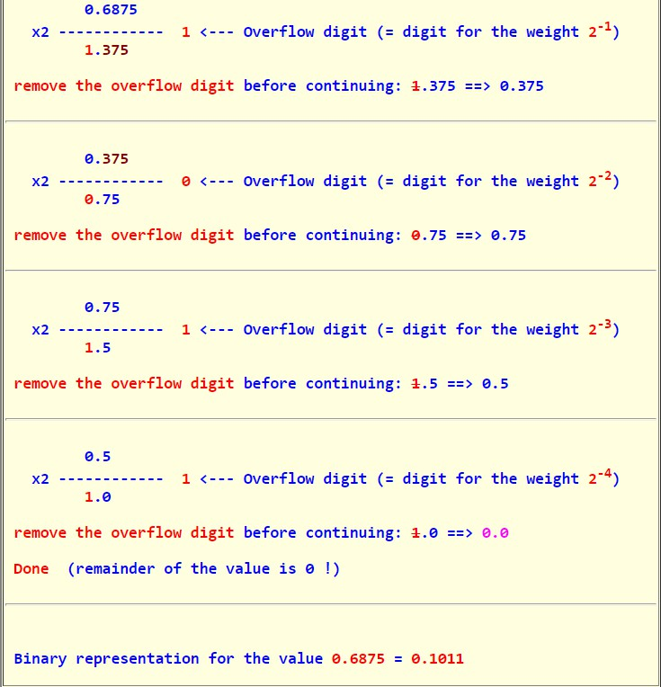

# Core Data Structures, Algorithms and Concepts

| Data Structure     | Algorithms    | Concepts                |
| ------------------ | ------------- | ----------------------- |
| Linked List        | BFS           | Bit Manipulation        |
| Tree, Trie & Graph | DFS           | Memory (Stack vs. Heap) |
| Stack & Queue      | Binary Search | Recursion               |
| Heap               | Merge Sort    | Dynamic Programming     |
| Vector/ArrayList   | Quick Sort    | Big O Time & Space      |
| Hash Table         |               |                         |

For each of these topics, make sure you understand how to use and implement them and, where applicable, the space and time complexity.

| Power Of 2 | Exact Value (X)       | Approx. Value | X bytes into MB, GB, etc |
| ---------- | --------------------- | ------------- | ------------------------ |
| 7          | 128                   |               |                          |
| 8          | 256                   |               |                          |
| 10         | 1024                  | 1, 000        | 1 kB                     |
| 16         | 65, 536               |               | 64 KB                    |
| 20         | 1, 048, 576           | 1 million     | 1 MB                     |
| 30         | 1, 073, 741, 824      | 1 billion     | 1 GB                     |
| 32         | 4, 294, 967, 296      |               | 4 GB                     |
| 40         | 1, 099, 511, 627, 776 | 1 trilliion   | 1 TB                     |

The table above is useful for many questions involving scalability or any sort of memory limitation. Memorizing this table isn't strictly required, but it can be useful. You should at least be comfortable deriving it 

# Big O

1.The following code copies an array. What is its runtime?

```java
int copyArray(int[] array) {
    int[] copy = new int[0];
    for (int value : array) {
        copy = appendToNew(copy, value);
    }
    return copy;
}

int[] appendToNew(int[] array, int value) {
    int[] bigger = new int[array.length + 1];
    for (int i = 0; i < array.length; i++) {
        bigger[i] = array[i];
    }
    bigger[bigger.length - 1] = value;
    return bigger;
}
```

$$O(n^2)$$, where n is the number of elements in the array. The first call to `appendToNew`takes 1 copy. The second call takes 2 copies. The third takes 3 copies. And so on. The total time will be the sum of 1 through n, which is $$O(n^2)$$.

2.The following code prints all strings of length k where the characters are in sorted order. What is its runtime?

```java
int numChars = 26;

void printSortedStrings(int remaining) {
    printSortedStrings(remaining, "");
}

void printSortedStrings(int remaining, String prefix) {
    if (remaining == 0) {
        if (isInOrder(prefix)) {
            System.out.Println(prefix);
        }
    } else {
        for (int i = 0; i < numChars; i++) {
            char c = ithLeter(i);
            printSortedStrings(remaining - 1, prefix + c);
        }
    }
}

boolean isInOrder(String s) {
    for (int i = 1; i < s.length; i++) {
        int prev = ithLeter(s.charAt(i - 1));
        int curr = ithLeter(s.charAt(i));
        if (prev > curr) {
            return false;
        }
    }
    return true;
}

char ithLeter(int i) {
    return (char) ((int) 'a' + 1);
}
```

$$O(kc^k)$$, where k is the length of the string and c is the number of characters in the alphabet. It takes $$O(c^k)$$ time to generate each string. Then, we need to check that each of these is sorted, which takes $$O(k)$$ time.

(Also, we can solve this problem from a different perspective. There are $$c^k$$ possible strings in total and it takes $$O(k)$$ time to check a string is sorted.)

## Best Conceivable Runtime (BCR)

The best conceivable runtime is the best runtime you could conceive of a solution to a problem having, i.e., it's the solution taking the least time *in theory*. You can easily prove that there is no way you could beat the BCR.

It tells us that we  are done in terms of optimizing the runtime and we should therefore turn our efforts to the space complexity. If we ever reach the BCR and have $$O(1)$$ additional space, then we know we can't optimize the time or space.

# Arrays and Strings

Array questions and string questions are often interchangeable. 

## 1. Is Unique

Implement an algorithm to determine if a string has all unique characters. What if you cannot use additional data structures?

(1) hash table  

```go
func IsUnique(s string) bool {
    if s == "" {
        return false
    }
    chars := make(map[rune]bool)
    for _, r := range s {
        if chars[r] {
            return false
        }
        chars[r] = true
    }
    return true
}
```

$$O(n)$$ time, $$O(n)$$ space.

(2) 

```go
// Assumes only letters a through z
func IsUnique(s string) bool {
    if l := len(s); l == 0 || l > 26 {
        return false
    }
    // As long as the string has all unique characters
    // the one bit must be different
    checker := 0
    for i := range s {
        if val := 1 << (s[i] - 'a'); (checker & val) > 0 {
            return false
        } else {
            checker |= val
        }
    }
    return true
}
```

$$O(n)$$ time, $$O(1)$$ space.

## 2. Check Permutation

Given two strings, write a method to decide if one is a permutation of the other.

(1) count characters' frequency

```go
func CheckPermutation(a, b string) bool {
    if len(a) != len(b) || a == b {
        return false
    }
    // mapping a character to its frequency
    charsOfA := make(map[byte]int)
    for i := range a {
        charsOfA[a[i]]++
    }
    for i := range b {
        if _, ok := charsOfA[b[i]]; !ok {
            return false
        } else if charsOfA[b[i]]--; charsOfA[b[i]] < 0 {
            return false
        }
    }

    return true
}
```

$$O(n)$$ time, $$O(n)$$ space.

(2) sort

```go
func CheckPermutation(a, b string) bool {
    if len(a) != len(b) || a == b {
        return false
    }
    return sortString(a) == sortString(b)
}

func sortString(s string) string {
    ints := make([]int, len(s))
    for _, r := range s {
        ints = append(ints, int(r))
    }
    sort.Ints(ints)
    var b strings.Builder
    for i := range ints {
        b.WriteRune(rune(ints[i]))
    }
    return b.String()
}
```

$$O(nlogn)$$ time.

## 3. URLify

Write a method to replace all spaces in a string with '%20'. You may assume that the string has sufficient space at the end to hold the additional characters, and that you are given the "true" length of the string. (Note: If implementing in Java or other similar languages, please use a character array so that you can perform this operation in place.)

```go
func Urlify(s []rune, length int) []rune {
    // Count spaces.
    spaceCount := 0
    for i := 0; i < length; i++ {
        if s[i] == ' ' {
            spaceCount++
        }
    }
    // i is initialized to point to the last character of old string
    // j is initialized to point to the last character of new string
    for i, j := length-1, length+2*spaceCount-1; i >= 0; i-- {
        if s[i] == ' ' {
            // Replace space.
            s[j], s[j-1], s[j-2] = '0', '2', '%'
            j = j - 3
        } else {
            // Move other characters back.
            s[j], j = s[i], j-1
        }
    }
    return s
}
```

$$O(n)$$ time, $$O(1)$$ space.

## 4. Palindrome Permutation

Given a string, write a function to check if it is a permutation of a palindrome. A palindrome is a word or phrase that is the same forwards and backwards. A permutation is a rearrangement of letters. The palindrome does not need to be limited to just dictionary word. 

```
EXAMPLE
Input: on no evil live star Rats
Output: True (palindrome: "Rats live on no evil star")
```

```go
func PalindromePermutation(s string) bool {
    if s == "" {
        return false
    }
    // Build character frequency table.
    freq := make(map[rune]int)
    for _, r := range s {
        if unicode.IsLetter(r) {
            freq[unicode.ToLower(r)]++
        }
    }
    // If a string is palindrome,
    // the number of letters occurring odd times
    // must be odd.
    count := 0
    for r := range freq {
        if freq[r]&1 == 1 {
            count++
        }
    }
    return count == 0 || count&1 == 1
}
```

$$O(n)$$ time, $$O(n)$$ space.

## 5. One Away

There are three types of edits that can be performed on strings: insert a character, remove a character, or replace a character. Given two strings, write a function to check if they are one edit (or zero edit) away.

```
EXAMPLE
pales, pale -> true
pale, bale  -> true
pale, bake  -> false
```

```go
func OneAway(a, b string) bool {
   if a == b {
      return true
   }
   // Try to insert a character.
   // Inserting a character into the short one equals
   // removing a character from the long one.
   if math.Abs(float64(len(a)-len(b))) == 1.0 {
      var s, l string
      if len(a) > len(b) {
         s, l = b, a
      } else {
         s, l = a, b
      }
      i := 0
      for ; i < len(s); i++ {
         if s[i] != l[i] {
            break
         }
      }
      if s[0:i]+string(l[i])+s[i:] == l {
         return true
      }
   }
   // Try to replace a character. 
   if len(a) == len(b) {
      count := 0
      for i := range a {
         if a[i] != b[i] {
            // There are more than one different characters. 
            if count++; count > 1 {
               return false
            }
         }
      }
      return true
   }
   return false
}
```

$$O(n)$$ time, $$O(1)$$ space.

## 6. String Compression

Implement a method to perform basic string compression using the counts of repeated characters. For example, the string "aabcccccaaa" would become "a2b1c5a3", if the "compressed" string would not become smaller than the original string, your method should return the original string. You can assume the string has only uppercase and lowercase letters (a-z).

```go
func StringCompression(origin string) string {
    if origin == "" {
        return ""
    }
    var compressed string
    count := 0
    for i, r := range origin {
        count++
        // If next character is different, 
        // append it to result.
        if i+1 >= len(origin) || origin[i] != origin[i+1] {
            compressed += string(r) + strconv.Itoa(count)
            count = 0
        }
    }
    if len(compressed) >= len(origin) {
        compressed = origin
    }
    return compressed
}
```

$$O(n)$$ time, $$O(1)$$ space.

## 7. Rotate Matrix

Given an image represented by an N*N matrix, where each pixel in the image is 4 bytes, write a method to rotate the image by 90 degrees. Can you do this in place?

```go
func RotateMatri(matrix [][]int) [][]int {
   if len(matrix) == 0 || len(matrix) != len(matrix[0]) {
      return nil
   }
   rows := len(matrix)
   for r := 0; r < rows/2; r++ {
      first, last := r, rows-1-r
      for i := first; i < last; i++ {
         offset := i - last
         top := matrix[first][i]
         // left -> top
         matrix[first][i] = matrix[last-offset][first]
         // bottom -> left
         matrix[last-offset][first] = matrix[last][last-offset]
         // right -> bottom
         matrix[last][last-offset] = matrix[i][last]
         // top -> right
         matrix[i][last] = top
      }
   }
   return matrix
}
```

$$O(N^2)$$ time, $$O(1)$$ space.

## 8. Zero Matrix

Write an algorithm such that if an element in an M*N matrix is 0, its entire row and column are set to 0.

```go
func ZeroMatrix(matrix [][]int) [][]int {
   if len(matrix) == 0 {
      return nil
   }
   // Mark the zero cells' rows and columns.
   zeroRows, zeroCols := make([]int, 0), make([]int, 0)
   for i := range matrix {
      for j := range matrix[i] {
         if matrix[i][j] == 0 {
            zeroRows, zeroCols = append(zeroRows, i), append(zeroCols, j)
         }
      }
   }
   // Clear specific rows and columns.
   rows, cols := len(matrix), len(matrix[0])
   for i := range zeroRows {
      for j := 0; j < cols; j++ {
         matrix[zeroRows[i]][j] = 0
      }
   }
   for i := range zeroCols {
      for j := 0; j < rows; j++ {
         matrix[j][zeroCols[i]] = 0
      }
   }
   return matrix
}
```

$$O(nm)$$ time, $$O(n+m)$$ space where n is the number of rows and m is the number of columns.

## 9. String Rotation

Assume you have a method `isSubstring`which checks if one word is a substring of another. Given two strings, s1 and s2, write code to check if  s2 is a rotation of s1 using only one call to `isSubstring`(e.g., "waterbottle" is a rotation of "erbottlewat").

```go
func StringRotation(s1, s2 string) bool {
    // Assure s1 and s2 have the same length 
    // and are not empty.
   if len(s1) == len(s2) && len(s1) != 0 {
      // Too tricky
      return isSubstring(s1+s1, s2)
   }
   return false
}

func isSubstring(str, sub string) bool {
    return strings.Contains(str, sub)
}
```

# Linked List

**The "Runner" Technique**

The "runner" (or second pointer) technique is used in many linked list problems. The runner technique means that you iterate through the list with two pointers simultaneously, with one ahead of the other.  The "fast" node might be ahead by a fixed amount, or it might be hopping multiple nodes for each one node that the "slow" node iterates through. 

**Recursive Problems**

If you are having trouble solving a linked list problem, you should explore if a recursive approach will work. 

Recursive algorithms take at least $$O(n)$$ space, where n is the depth of the recursive call. All recursive algorithms can be implemented iteratively although they may be much more complex. 

## 1. Remove Dups

Write code to remove duplicates from an unsorted linked list. 

FOLLOW UP: How would you solve this problem if a temporary buffer is not allowed?

(1) 

```go
func RemoveDups(head *ListNode) *ListNode {
   if head == nil {
      return nil
   }
   dump := &ListNode{Next: head}
   existed := make(map[int]bool)
   for pre, cur := dump, head; cur != nil; {
      if !existed[cur.Value] {
         existed[cur.Value] = true
         pre, cur = pre.Next, cur.Next
      } else {
         // Remove the duplicate node. 
         cur = cur.Next
         pre.Next = cur
      }
   }
   return dump.Next
}
```

$$O(n)$$ time, $$O(n)$$ space.

(2) 

```go
func RemoveDups(head *ListNode) {
    for cur := head; cur != nil; cur = cur.Next {
        // Remove all future nodes that have the same value as current node.
        runner := cur
        for runner.Next != nil {
            if runner.Next.Value == cur.Value {
                runner.Next = runner.Next.Next
            } else {
                runner = runner.Next
            }
        }
    }
}
```

$$O(n^2)$$ time, $$O(1)$$ space.

## 2. Return Kth to Last

Implement an algorithm to find the kth to last element of a singly linked list. 

(1)

```go
func ReturnKthToLast(head *ListNode, k int) *ListNode {
    if head == nil || k <= 0 {
        return nil
    }
    fast, i := head, 0
    for ; fast != nil && i < k; fast, i = fast.Next, i+1 {
    }
    if i < k {
        // The number of nodes is less than k.
        return nil
    }
    slow := head
    for ; fast != nil && slow != nil; slow, fast = slow.Next, fast.Next {
    }
    return slow
}
```

$$O(n)$$ time, $$O(1)$$ space.

(2) 

```go
func ReturnKthToLast(head *ListNode, k int) *ListNode {
   if k <= 0 {
      return nil
   }
   index := 0
   return kToLast(head, k, &index)
}

func kToLast(node *ListNode, k int, i *int) *ListNode {
   if node == nil {
      return nil
   }
   tmp := kToLast(node.Next, k, i)
   if *i++; *i == k {
      return node
   }
   return tmp
}
```

$$O(n)$$ time, $$O(n)$$ space.

## 3. Delete Middle Node

Implement an algorithm to delete a node in the middle (i.e. any node but the first and last, not necessarily the exact middle) of a singly linked list, given only access to that node.

```
EXAMPLE
Input: the node c from the linked list a -> b -> c -> d -> e -> f
Result: nothing is return, but the new linked list looks like a -> b -> d -> e -> f
```

```go
func DeleteMiddleNode(middle *ListNode) {
    if middle == nil || middle.Next == nil {
        return
    }
    pre, cur, next := middle, middle, middle.Next
    for ; next != nil; pre, cur, next = cur, cur.Next, next.Next {
        // Overwrite current node's value with next node's.
        cur.Value = next.Value
    }
    // Remove the last node.
    pre.Next = nil
}
```

$$O(n)$$ time, $$O(1)$$ space.

## 4. Partition

Write code to partition a linked list around a value x, such that all nodes less than x come before all nodes greater than or equal to x. If x is contained within the list, the value of x only need to be after the elements less than x. The partition element x can appear everywhere in the "right partition"; it doesn't need to appear between the left and right partitions.

```
EXAMPLE
Input: 3->5->8->5->10->2->1 [partition=5]
Output: 3->1->2->10->5->5->5->8
```

```go
func Partition(head *ListNode, x int) *ListNode {
   if head == nil {
      return nil
   }
   var headOfLess, less, headOfGreater, greater *ListNode
   for cur := head; cur != nil; cur = cur.Next {
      if cur.Value < x {
         if headOfLess == nil {
            headOfLess = cur
            less = headOfLess
         } else {
            less.Next = cur
            less = less.Next
         }
      } else {
         if headOfGreater == nil {
            headOfGreater = cur
            greater = headOfGreater
         } else {
            greater.Next = cur
            greater = greater.Next
         }
      }
   }
   if headOfLess != nil && headOfGreater != nil || headOfLess != nil {
      less.Next = headOfGreater
      return headOfLess
   } else {
      return headOfGreater
   }
}
```

$$O(n)$$ time, $$O(1)$$ space.

## 5. Sum Lists

You have two numbers represented by a linked list, where each node contains a single digit. The digits are stored in reverse order, such that the Vs digit is at the head of the list. Write a function that adds the two numbers and returns the sum as as linked list. 

```
EXAMPLE
Input: (7->1->6)+(5->9->2) That is 617 + 295
Output: 2->1->9 That is 912.
```

FOLLOW UP

Suppose the digits are stored in forward order. Repeat the above problem. 

(1) Digits stored in reverse order

```go
func SumListsInReverseOrder(a, b *ListNode) *ListNode {
   if a == nil && b == nil {
      return nil
   } else if a == nil {
      return b
   } else if b == nil {
      return a
   }
   // Assure that tow lists are not empty.
   var head, last *ListNode
   carry := 0
   p, q := a, b
   for ; p != nil && q != nil; p, q = p.Next, q.Next {
      tmp := p.Value + q.Value + carry
      if tmp > 10 {
         carry, tmp = 1, tmp-10
      } else {
         carry = 0
      }
      if head == nil {
         head = &ListNode{
            Value: tmp,
            Next:  nil,
         }
         last = head
      } else {
         node := &ListNode{
            Value: tmp,
            Next:  nil,
         }
         last.Next = node
         last = last.Next
      }
   }
   // If one list is longer than the other.
   if p != nil || q != nil {
      var cur *ListNode
      if p != nil {
         cur = p
      } else {
         cur = q
      }
      for ; cur != nil; cur = cur.Next {
         tmp := cur.Value + carry
         if tmp > 10 {
            carry, tmp = 1, tmp-10
         } else {
            carry = 0
         }
         node := &ListNode{
            Value: tmp,
            Next:  nil,
         }
         last.Next = node
         last = last.Next
      }
   }
   return head
}
```

$$O(n)$$ time, $$O(1)$$ space.

(2) Digits stored in forward order

Just reverse lists and do as above.

```go
func SumListsInForwardOrder(a, b *ListNode) *ListNode {
    reverse := func(head *ListNode) *ListNode {
        if head == nil {
            return nil
        }
        cur := head
        var pre, next *ListNode
        for cur != nil {
            next = cur.Next
            cur.Next = pre
            pre = cur
            cur = next
        }
        return pre
    }
    ra, rb := reverse(a), reverse(b)
    return reverse(SumListsInReverseOrder(ra, rb))
}
```

$$O(n)$$ time, $$O(1)$$ space.

## 6. Palindrome

Implement a function to check if a linked list is a palindrome.

```go
func IsPalindrome(head *ListNode) bool {
   if head == nil {
      return false
   }
   var b strings.Builder
   for cur := head; cur != nil; cur = cur.Next {
      b.WriteByte(byte(cur.Value))
   }
   forward := b.String()
   rhead := reverseList(head)
   b.Reset()
   for cur := rhead; cur != nil; cur = cur.Next {
      b.WriteByte(byte(cur.Value))
   }
   reverse := b.String()
   return forward == reverse
}
```

$$O(n)$$ time, $$O(1)$$ space.

## 7. Intersection

Given two singly linked lists, determine if the two lists intersect. Return the intersecting nodes. Note that the intersection is defined based on reference, not value. That is, if the kth node of the first list is the exact same node (by reference) as the jth node of the second linked list, then they are intersecting.

```go
func Intersection(a, b *ListNode) *ListNode {
   if a == nil || b == nil {
      return nil
   }
   existed := make(map[*ListNode]bool)
   for cur := a; cur != nil; cur = cur.Next {
      existed[cur] = true
   }
   for cur := b; cur != nil; cur = cur.Next {
      if existed[cur] {
         return cur
      }
   }
   return nil
}
```

$$O(n)$$ time, $$O(n)$$ space.

## 8. Loop Detection

Given a circular linked list, implement an algorithm that returns the node at the beginning of the loop.

```go
func LoopDetection(head *ListNode) *ListNode {
        if p := detect(head); p != nil {
            return start(p, head)
        } else {
            return nil
        }
}

func detect(head *ListNode) *ListNode {
    slow, fast := head, head
    for slow != nil && fast != nil && fast.Next != nil {
        slow = slow.Next
        fast = fast.Next.Next
        if slow == fast {
            return slow
        }
    }
    return nil
}

func start(p, head *ListNode) *ListNode {
    q := head
    for p != q {
        p = p.Next
        q = q.Next
    }
    return q
}
```

$$O(n)$$ time, $$O(1)$$ space.

# Stacks and Queues

## 1. Three In One

Describe how you could use a single array to implement three stacks.

Just think of a array as it is combined with three arrays one by one.

```go
type MultiStacks struct {
   values   []int // underlying array
   sizes    []int // actual capacity of each stack
   capacity int   // max capacity of each stack
}

func NewMultiStacks(numOfStacks int, capacity int) *MultiStacks {
   return &MultiStacks{
      values:   make([]int, capacity*numOfStacks),
      sizes:    make([]int, numOfStacks),
      capacity: capacity,
   }
}

func (ms *MultiStacks) IsEmpty(idxOfStack int) (bool, error) {
   if idxOfStack >= len(ms.sizes) {
      return false, errors.New("index out of range")
   }
   return ms.sizes[idxOfStack] == 0, nil
}

func (ms *MultiStacks) Push(idxOfStack int, value int) error {
   if idxOfStack >= len(ms.sizes) {
      return errors.New("index of range")
   }
   if ms.sizes[idxOfStack] == ms.capacity {
      return errors.New("stack is full")
   }
   ms.values[idxOfStack*ms.capacity+ms.sizes[idxOfStack]] = value
   ms.sizes[idxOfStack]++
   return nil
}

func (ms *MultiStacks) Peek(idxOfStack int) (int, error) {
   if idxOfStack >= len(ms.sizes) {
      return 0, errors.New("index out of range")
   }
   if ms.sizes[idxOfStack] == 0 {
      return 0, errors.New("stack is empty")
   }
   return ms.values[idxOfStack*ms.capacity+ms.sizes[idxOfStack]-1], nil
}

func (ms *MultiStacks) Pop(idxOfStack int) error {
   if idxOfStack >= len(ms.sizes) {
      return errors.New("index out of range")
   }
   if ms.sizes[idxOfStack] == 0 {
      return errors.New("stack is empty")
   }
   ms.sizes[idxOfStack]--
   return nil
}
```

## 2. Stack Min

How would you design a stack which, in addition to pop and push, has a function min which returns the minimum element? Push, pop and min should all operate in $$O(1)$$ time.

Just make each element contain a field called `min`which represents the *current* minimum value on the stack, which means the minimum value in the "substack" ended with the element.

```go
type NodeWithMin struct {
    val int
    min int
}

type StackWithMin struct {
    nodes []NodeWithMin
}

func NewStackWithMin() *StackWithMin {
    return &StackWithMin{make([]NodeWithMin, 0)}
}

func (s *StackWithMin) Push(val int) {
    curMin := math.MaxInt64
    if len(s.nodes) > 0 {
        curMin = s.nodes[len(s.nodes)-1].min
    }
    if curMin > val {
        curMin = val
    }
    s.nodes = append(s.nodes, NodeWithMin{val, curMin})
}

func (s *StackWithMin) Pop() (int, error) {
    if len(s.nodes) == 0 {
        return 0, errors.New("empty stack")
    }
    top := s.nodes[len(s.nodes)-1]
    s.nodes = s.nodes[:len(s.nodes)-1]
    return top.val, nil
}

func (s *StackWithMin) Min() (int, error) {
    if len(s.nodes) == 0 {
        return 0, errors.New("empty stack")
    }
    return s.nodes[len(s.nodes)-1].min, nil
}
```

## 3. Stack Of Plates

Imagine a literal stack of plates. If the stack gets too high, it might topple. Therefore, in real life, we would likely start a new stack when the previous stack exceeds some threshold. Implement a data structure `SetOfStacks` that mimics this. `SetOfStacks` should be composed of several stacks and should create a new stack once the previous one exceeds capacity, `SetOfStacks.push()`and `SetOfStacks.pop()`should behave identically to a single stack (that is, `pop()`should return the same values as it would if there were just a single stack.)

FOLLOW UP

Implement a function `popAt(int index)`which preforms a pop operation on a specific sub-stack.

```go
type SetOfStacks struct {
   capacity int
   stacks   [][]int
}

func NewSetOfStacks(capacity int) (*SetOfStacks, error) {
   if capacity <= 0 {
      return nil, errors.New("invalid capacity")
   }
   stacks := make([][]int, 0)
   stacks = append(stacks, make([]int, capacity))
   return &SetOfStacks{
      capacity: capacity,
      stacks:   stacks,
   }, nil
}

func (ss *SetOfStacks) Push(val int) {
   if len(ss.stacks[len(ss.stacks)-1]) == ss.capacity {
      newStack := make([]int, ss.capacity)
      newStack = append(newStack, val)
      ss.stacks = append(ss.stacks, newStack)
   } else {
      ss.stacks[len(ss.stacks)-1] = append(ss.stacks[len(ss.stacks)-1], val)
   }
}

func (ss *SetOfStacks) Pop() (int, error) {
   if len(ss.stacks[len(ss.stacks)-1]) == 0 {
      return 0, errors.New("empty set of stacks")
   }
   lenOfLastStack := len(ss.stacks[len(ss.stacks)-1])
   top := ss.stacks[len(ss.stacks)-1][lenOfLastStack-1]
   ss.stacks[len(ss.stacks)-1] = ss.stacks[len(ss.stacks)-1][:lenOfLastStack-1]
   return top, nil
}

func (ss *SetOfStacks) PopAt(index int) (int, error) {
   if index < 0 || index >= len(ss.stacks) {
      return 0, errors.New("index of range")
   }
   if len(ss.stacks[index]) == 0 {
      return 0, errors.New("empty stack")
   }
   lenOfStack := len(ss.stacks[index])
   top := ss.stacks[index][lenOfStack-1]
   ss.stacks[index] = ss.stacks[index][:lenOfStack-1]
   return top, nil
}
```

## 4. Queue via Stacks

Implement a MyQueue class which implements a queue using two stacks.

```go
type MyQueue struct {
    stack1 *Stack
    stack2 *Stack
}

func NewMyQueue() *MyQueue {
    return &MyQueue{NewStack(), NewStack()}
}

func (mq *MyQueue) IsEmpty() bool {
    return mq.stack1.IsEmpty()
}

func (mq *MyQueue) Add(val int) {
    mq.stack1.Push(val)
}

func (mq *MyQueue) Remove() (int, error) {
    for mq.stack1.Size() > 1 {
        val, _ := mq.stack1.Pop()
        mq.stack2.Push(val)
    }
    peek, _ := mq.stack1.Pop()
    for !mq.stack2.IsEmpty() {
        val, _ := mq.stack2.Pop()
        mq.stack1.Push(val)
    }
    return peek, nil
}
```

## 5. Sort Stack

Write a program to sort a stack such that the smallest item are on the top. You can use an additional stack, but you may not copy the elements into any other data structure (such as an array). The stack supports the following operations: `push`, `pop`, `peek` and `isEmpty`.

1. Create a temporary stack say **helper stack**.
2. While input stack is NOT empty do this:
   - Pop an element from input stack call it **temp**
   - While temporary stack is NOT empty and top of temporary stack is greater than temp, pop from temporary stack and push it to the input stack. By doing this, we can assure elements in helper stack are in order and max is on the top.
   - Push **temp** in helper stack
3. The sorted numbers are in helper stack

```go
func (s *Stack) Sort() {
   helper := NewStack()
   for !s.IsEmpty() {
      // Push each element in s in sorted order to helper stack.
      tmp, _ := s.Pop()
      for !helper.IsEmpty() && helper.Peek() > tmp {
         val, _ := helper.Pop()
         s.Push(val)
      }
      helper.Push(tmp)
   }
   // Now elements in helper are in order and max is on the top.
   for !helper.IsEmpty() {
      val, _ := helper.Pop()
      s.Push(val)
   }
}
```

$$O(n^2)$$ time in the worst case?

## 6. Animal Shelter

An animal shelter, which holds only dogs and cats, operates on a strictly    "first in, first out" basis. People must adopt either the "oldest" (based on arrival time) of all animals at the shelter, or they can select whether they would prefer a dog or a cat (and will receive the oldest animal of that type). They cannot select which specific animal they would like. Create the data structure to maintain this system and implement operations such as `enqueue`, `dequeueAny`, `dequeueDog`, and `dequeueCat`. You may use the built-in linked list data structure.

```go
type Animal struct {
    Name string
    Kind int // 1: dog, 2: cat
}

type AnimalWrapper struct {
    id     int
    animal *Animal
}

type AnimalShelter struct {
    count int
    dogs  []*AnimalWrapper
    cats  []*AnimalWrapper
}

func NewAniamlShelter() *AnimalShelter {
    return &AnimalShelter{0, make([]*AnimalWrapper, 0), make([]*AnimalWrapper, 0)}
}

func (as *AnimalShelter) Enqueue(a *Animal) {
    as.count++
    switch a.Kind {
    case 1:
        as.dogs = append(as.dogs, &AnimalWrapper{
            id:     as.count,
            animal: a,
        })
    case 2:
        as.cats = append(as.cats, &AnimalWrapper{
            id:     as.count,
            animal: a,
        })
    }
}

func (as *AnimalShelter) DequeueAny() (*Animal, error) {
    if len(as.cats) == 0 && len(as.dogs) == 0 {
        return nil, errors.New("empty shelter")
    }
    var peek *Animal
    if numOfCats, numOfDogs := len(as.cats), len(as.dogs); numOfCats > 0 && numOfDogs > 0 {
        if as.cats[0].id < as.dogs[0].id {
            peek = as.cats[0].animal
            as.cats = as.cats[1:]
        } else {
            peek = as.dogs[0].animal
            as.dogs = as.dogs[1:]
        }
    } else if numOfCats > 0 {
        peek = as.cats[0].animal
        as.cats = as.cats[1:]
    } else {
        peek = as.dogs[0].animal
        as.dogs = as.dogs[1:]
    }
    return peek, nil
}

func (as *AnimalShelter) DequeueDog() (*Animal, error) {
    if len(as.dogs) == 0 {
        return nil, errors.New("no dog")
    }
    dog := as.dogs[0].animal
    as.dogs = as.dogs[1:]
    return dog, nil
}

func (as *AnimalShelter) DequeueCat() (*Animal, error) {
    if len(as.cats) == 0 {
        return nil, errors.New("no dog")
    }
    cat := as.cats[0].animal
    as.cats = as.cats[1:]
    return cat, nil
}
```

# Trees and Graphs

## 1. Route Between Nodes

Given a directed graph, design an algorithm to find out whether there is a route between two nodes.

Assuming a graph is represented by a adjacency matrix.

```go
func RouteBetweenNodes(g [][]int, u int, v int) bool {
    if maxIdx := len(g) - 1; maxIdx < 0 ||
        u < 0 || u >= maxIdx ||
        v < 0 || v >= maxIdx {
        return false
    }
    visited := make([]bool, len(g))
    // BFS
    q := make([]int, 0)
    q = append(q, u)
    visited[u] = true
    for len(q) > 0 {
        vertex := q[0]
        q = q[1:]
        if vertex == v {
            return true
        }
        for i := range g[vertex] {
            if g[vertex][i] == 1 && !visited[i] {
                q = append(q, i)
                visited[i] = true
            }
        }
    }
    return false
}
```

$$O(n^2)$$ time, $$O(n)$$ space.

```go
func RouteBetweenNodesDfs(g [][]int, u int, v int) bool {
   if maxIdx := len(g) - 1; maxIdx < 0 ||
      u < 0 || u >= maxIdx ||
      v < 0 || v >= maxIdx {
      return false
   }
   visited := make([]bool, len(g))
   return dfs(&g, u, v, &visited)
}

func dfs(g *[][]int, u int, v int, visited *[]bool) bool {
    if !(*visited)[u] {
        (*visited)[u] = true
        if u == v {
            return true
        }
        for i := range (*g)[u] {
            if (*g)[u][i] == 1 {
                if dfs(g, i, v, visited) {
                    return true
                }
            }
        }
    }
    return false
}
```

$$O(n^2)$$ time, $$O(n^2)$$ space.

## 2. Minimal Tree

Given a sorted (increasing order) array with unique integer elements, write an algorithm to create a binary tree with minimal height.

Since the array is sorted, then we just build the BST recursively using the median as root.

```go
func MinimalTree(numbers []int) *TreeNode {
   if len(numbers) == 0 || !sort.IsSorted(sort.IntSlice(numbers)) {
      return nil
   }
   mid := len(numbers) / 2
   return &TreeNode{
      Val:   numbers[mid],
      Left:  MinimalTree(numbers[0:mid]),
      Right: MinimalTree(numbers[mid+1:]),
   }
}
```

$$O(n)$$ time, $$O(n)$$ space.

## 3. List of Depths

Given a binary tree, design an algorithm which creates a linked list of all the nodes at each depth (e.g., if you have a tree with depth D, you will have D linked lists).

```go
func ListOfDepths(root *TreeNode) []*ListNode {
    if root == nil {
        return nil
    }
    // Level-order traversal
    q := make([]*TreeNode, 0)
    q = append(q, root)
    numOfNodesAtCurLevel, numOfNodesAtNextLevel := 1, 0
    nodesAtCurLevel := make([]int, 0)
    lists := make([]*ListNode, 0)
    for len(q) > 0 {
        node := q[0]
        q = q[1:]
        if node.Left != nil {
            q = append(q, node.Left)
            numOfNodesAtNextLevel++
        }
        if node.Right != nil {
            q = append(q, node.Right)
            numOfNodesAtNextLevel++
        }
        nodesAtCurLevel = append(nodesAtCurLevel, node.Val)
        if numOfNodesAtCurLevel--; numOfNodesAtCurLevel == 0 {
            // Build a list
            head := &ListNode{Value: nodesAtCurLevel[0]}
            cur := head
            for _, v := range nodesAtCurLevel[1:] {
                cur.Next = &ListNode{Value: v}
                cur = cur.Next
            }
            lists = append(lists, head)
            numOfNodesAtCurLevel = numOfNodesAtNextLevel
            numOfNodesAtNextLevel = 0
            nodesAtCurLevel = nodesAtCurLevel[:0]
        }
    }
    return lists
}
```

$$O(n)$$ time, $$O(n)$$ space.

## 4. Check Balanced

Implement a function to check if a binary tree is balanced. For the purposes of this question, a balanced tree is defined to be a tree such that the length of the two subtrees of any node never differ by more than one.

```go
func CheckBalanced(root *BinaryTreeNode) bool {
    depth := 0
    return postorder(root, &depth)
}

func postorder(root *BinaryTreeNode, depth *int) bool {
    if root == nil {
        *depth = 0
        return true
    }
    dl, dr := 0, 0 // depths of two subtrees
    l, r := postorder(root.Left, &dl), postorder(root.Right, &dr)
    if l && r {
        if math.Abs(float64(dl)-float64(dr)) <= 1.0 {
             // If this subtree is balanced, then propagate the result and its height
            *depth = int(math.Max(float64(dl), float64(dr))) + 1
            return true
        }
    }
    return false
}
```

$$O(n)$$ time, $$O(logn)$$ space.

## 5. Validate BST

Implement a function to check if a binary tree is a binary search tree.

Do inorder-traversal iteratively.

```go
func ValidateBST(root *TreeNode) bool {
    if root == nil {
        return true
    }
    stack := make([]*TreeNode, 0)
    var pre *TreeNode
    for cur := root; cur != nil || len(stack) > 0; {
        for cur != nil {
            stack = append(stack, cur)
            cur = cur.Left
        }
        top := stack[len(stack)-1]
        stack = stack[:len(stack)-1]
        if pre != nil && pre.Val >= top.Val {
            return false
        }
        pre, cur = top, top.Right
    }
    return true
}
```

$$O(n)$$ time, $$O(n)$$ space.

## 6. Successor

Write an algorithm to find the "next" node (i.e., in-order successor) of a given node in a binary search tree. You may assume that each node has a link to its parent. 

If this given node has right subtree, then it's next in-order node is the leftmost node of its right subtree. 

If it doesn't have a right subtree, then we are done traversing its subtree. Let's say the given node is n. We'll need to pick up where we left off with n's parent, which we'll call q. 

- If n was to the left of q, then the next node should be q. (left->current->right)
- If n was to the right of q, then we have fully traversed q's subtree as well. We need to traverse upwards from q until we find a node x which we have not fully traversed. We know we hit this case when we move from a left node to its parent. The left node is fully traversed, but its parent is not.

There is one corner case: if we are already on the far right of the tree, then there is no in-order successor. 

```go
func Successor(n *TreeNode) *TreeNode {
    if n == nil {
        return nil
    }
    if n.Right != nil {
        // Find the leftmost node of n's right subtree
        cur := n.Right
        for ; cur != nil && cur.Left != nil; cur = cur.Left {
        }
        return cur
    } else {
        q := n
        x := q.Parent
        // Go up until we're on left instead of right.
        // Here we also handle the corner case.
        for x != nil && x.Left != q {
            q = x
            x = x.Parent
        }
        return x
    }
}
```

The worst case takes $$O(logn)$$ time. $$O(1)$$ space.

## 7. Build Order

You are given a list of products and a list of dependencies (which is a list of pairs of projects, where the second project is dependent on the first project). All of a project's dependencies must be built before the project is. Find a build order that will allow the projects to be built. If there is no valid build order, return an error. 

```
EXAMPLE
Input: 
    projects: a, b, c, d, e, f
    dependencies: (a, b), (f, b), (b, d). (f, a), (d, c)
Output: e, a, b, d, c
```

```go
func BuildOrder(projects []rune, dependencies [][]rune) ([]rune, error) {
    if len(projects) == 0 {
        return nil, errors.New("invalid input")
    }
    // Construct a directed graph represented by adjacency list.
    adj := make(map[rune][]rune, len(projects))
    indegree := make(map[rune]int, len(projects))
    for _, edge := range dependencies {
        if _, ok := adj[edge[0]]; !ok {
            adj[edge[0]] = make([]rune, 0)
        }
        adj[edge[0]] = append(adj[edge[0]], edge[1])
        indegree[edge[1]]++
    }
    zeroIndegree := make([]rune, 0 ,len(projects)) // Vertices which have no dependency.
    for _, n := range projects {
        if indegree[n] == 0 {
            zeroIndegree = append(zeroIndegree, n)
        }
    }
    // Do topological sorting.
    order := make([]rune, 0, len(projects)) // Resulting order.
    for len(zeroIndegree) > 0 {
        n := zeroIndegree[0]
        order = append(order, n)
        zeroIndegree = zeroIndegree[1:]
        for _, t := range adj[n] {
            if indegree[t]--; indegree[t] == 0 {
                zeroIndegree = append(zeroIndegree, t)
            }
        }
    }
    if len(order) != len(projects) {
        return nil, errors.New("can not order")
    } else {
        return order, nil
    }
}
```

This solution takes $$O(P + D)$$ time, where P is the number of projects and D is the number of dependency pairs.

## 8. First Common Ancestor

Design an algorithm and write code to find the first common ancestor of two nodes in a binary tree. Avoid storing additional nodes in data structure. NOTE: This is not necessarily a BST.

Assume that each node only has links to its children. 

if p and q are both on the left of the node, branch left to look for the common ancestor. If they are both on the right, branch right to look for the common ancestor. When p and q are no longer on the same side, we must have found the first common ancestor.

```go
func FirstCommonAncestor(root, p, q *TreeNode) *TreeNode {
   if !covers(root, p) || !covers(root, q) {
      return nil
   }
   return ancestorHelper(root, p, q)
}

func ancestorHelper(root, p, q *TreeNode) *TreeNode {
   if root == nil || root == p || root == q {
      return root
   }
   pIsOnLeft, qIsOnRight := covers(root.Left, p), covers(root.Left, q)
   if pIsOnLeft != qIsOnRight {
      return root
   }
   if pIsOnLeft {
      return ancestorHelper(root.Left, p, q)
   } else {
      return ancestorHelper(root.Right, p, q)
   }
}

func covers(root, p *TreeNode) bool {
   if root == nil {
      return false
   }
   if root == p {
      return true
   }
   return covers(root.Left, p) || covers(root.Right, p)
}
```

This algorithm runs in $$O(n)$$ time on a balanced tree.

## 9. BST Sequences

A binary search tree was created by traversing through an array from left to right and inserting each element. Given a binary search tree with distinct elements, print all possible arrays that could have led to this tree.

```
EXAMPLE
Input: 
    2
   /  \
  1    3
Output: {2, 1, 3}, {2, 3, 1}
```

In the example above, the very first element in our array must be a 2 in order to create the above tree. 

Let's think about this problem recursively. If we had all arrays that could have created the subtree rooted at 1 (call this `arrays1`) and all arrays that could have created that subtree rooted at 3 (call this `arrays3`), we could just weave each array from `arrays1`with each array from `array3`and then prepend array with a 2.

Weaving means we are merging two arrays in all possible ways, while keeping elements within each array in the same relative order.

```
array1: [1, 2]
array2: [3, 4]
weaved: [1, 2, 3, 4], [1, 3, 2, 4], [1, 3, 4, 2], [3, 1, 2, 4], [3, 1, 4, 2], [3, 4, 1, 2]
```

Note that, as long as there aren't any duplicates in the original array sets, we won't have to worry that weaving will create duplicates.

How does weaving work? Let's say, we want to weave [1, 2] and [3, 4] and the subproblems are:

```
- prepend 1 to all weaves of [2] and [3, 4]
- prepend 3 to all weaves of [1, 2] and [4]
```

To implement this, we'll store each as linked lists. This will make it easy to add and remove elements. When we recurse, we'll push the prefixed elements down the recursion. When first or second are empty, we add the remainder to prefix and store the result.

```
weave(first, second, prefix)
    weave([1, 2], [3, 4], [])
        weave([2], [3, 4], [1])
            weave([], [3, 4], [1, 2])
                [1, 2, 3, 4]
            weave([2], [4], [1, 3])
                weave([], [4], [1, 3, 2])
                    [1, 3, 2 ,4]
                weave([2], [], [1, 3 ,4])
                    [1, 3, 4, 2]
        weave([1, 2], [4], [3])
            weave([2], [4], [3, 1])
                weave([], [4], [3, 1, 2])
                    [3, 1, 2, 4]
                weave([2], [], [3, 1, 4])
                    [3, 1, 4, 2]
            weave([1, 2], [], [3, 4])
                [3, 4, 1, 2]    
```

```go
func BSTSequences(root *TreeNode) [][]int {
   res := make([][]int, 0)
   if root == nil {
      // Append [] so that the nested for loop will still execute
      res = append(res, []int{})
      return res
   }
   // prefix will always be the root of subtrees.
   prefix := []int{root.Val}
   leftSeq, rightSeq := BSTSequences(root.Left), BSTSequences(root.Right)
   for i := range leftSeq {
      for j := range rightSeq {
         weaved := make([][]int, 0)
         weave(leftSeq[i], rightSeq[j], &weaved, prefix)
         res = append(res, weaved...)
      }
   }
   return res
}

func weave(first []int, second []int, res *[][]int, prefix []int) {
   if len(first) == 0 || len(second) == 0 {
      // Assure that tmp is a copy.
      tmp := make([]int, len(prefix))
      copy(tmp, prefix)
      tmp = append(tmp, first...)
      tmp = append(tmp, second...)
      *res = append(*res, tmp)
      return
   }

   headOfFirst := first[0]
   first = first[1:]
   prefix = append(prefix, headOfFirst)
   weave(first, second, res, prefix)
   // Exit when fist is empty.
   // Reset prefix for the second recursion below.
   prefix = prefix[:len(prefix)-1]
   first = append([]int{headOfFirst}, first...)

   headOfSecond := second[0]
   second = second[1:]
   prefix = append(prefix, headOfSecond)
   weave(first, second, res, prefix)
   prefix = prefix[:len(prefix)-1]
   second = append([]int{headOfSecond}, second...)
}
```

## 10. Check Subtrees

T1 and T2 are two very large binary trees, with T1 much bigger than T2. Create an algorithm to determine if T2 is a subtree of T1.

A tree T2 is a subtree of T1 if there exists a node n in T1 such that the subtree of n is identical to T2. That is, if you cut off the tree at node n, the two trees would be identical.

(1) Transform trees into strings.

In this smaller, simpler problem, we could consider comparing string representations of traversals of each tree. If T2 is a subtree of T1, then T2's traversal should be a substring of T1.

An in-order traversal will definitely not work. After all, consider a scenario in which we were using binary search trees. A binary search tree's in-order traversal always prints out the values in sorted order. Therefore, two binary search trees with the same values will always have the same in-order traversals, even if their structure is different.

An pre-order traversal, with null nodes represented properly, can work. As long as we represent the NULL nodes, the pre-order traversal of a tree is unique. That is, if two trees have the same pre order traversal, then we know they are identical trees in values and structure. 

```go
func CheckSubtrees(t1, t2 *TreeNode) bool {
   var tStr1 string
   traverseTree(t1, &tStr1)
   var tStr2 string
   traverseTree(t2, &tStr2)
   return strings.Contains(tStr1, tStr2)
}

func traverseTree(root *TreeNode, s *string) {
   if root == nil {
      *s += "#"
      return
   }
   *s += strconv.Itoa(root.Val)
   traverseTree(root.Left, s)
   traverseTree(root.Right, s)
}
```

$$O(n+m)$$ time and $$O(n+m)$$ space where n and m are the number of nodes in T1 and T2 respectively.

(2) Search and compare.

Search through the larger tree T1. Each time a node in Tl matches the root of T2, call `matchTree`. The `matchTree` method will compare the two subtrees to see if they are identical.

```go
func CheckSubtrees(t1, t2 *TreeNode) bool {
	if t2 == nil {
		// An empty tree is always a subtree.
		return true
	} 
	return subtree(t1, t2)
}

func subtree(t1 *TreeNode, t2 *TreeNode) bool {
	if t1 == nil {
		return false
	} else if t1.Val == t2.Val && matchTree(t1, t2) {
		return true
	}
	return subtree(t1.Left, t2) || subtree(t1.Right, t2)
}

func matchTree(t1, t2 *TreeNode) bool {
	if t1 == nil && t2 == nil {
		return true
	} else if t1 == nil || t2 == nil {
		return false
	} else if t1.Val != t2.Val {
		return false
	} else {
		return matchTree(t1.Left, t2.Left) && matchTree(t1.Right, t2.Right)
	}
}
```

## 11. Random Node

You are implementing a binary search tree class from scratch, which, in addition to insert, find and delete, has a method `getRandomNode()`which returns a random node from the tree. All nodes should be equally likely to be chosen. Design and implement an algorithm for `getRandomNode`, and explain how you would implement the rest of the methods.

We can start with the root. With what probability should we return the root? Since we have N nodes, we must return the root node with $$1/n$$ probability.

With what probability should we traverse left versus right? It's not 50/50. Even in a balanced tree, the number of nodes on each side might not be equal. If we have more nodes on the left than the right, then we need to go left more often.

The odds of picking something from the left must have probability $$LEFTSIZE * 1/n$$ .This should therefore be the odds of going left. Likewise, the odds of going right should be $$RIGHTSIZE * 1/n$$.

This means that each node must know the size of the nodes on the left and the size of the nodes on the right. Fortunately, our interviewer has told us that we're building this tree class from scratch. It's easy to keep track of this size information on inserts and deletes. We can just store a `size` variable in each node. Increment`size`on inserts and decrement it on deletes.

```go
type TreeNode struct {
   Val   int
   Left  *TreeNode
   Right *TreeNode
   size  int
}

func NewTreeNode(val int) *TreeNode {
   return &TreeNode{
      Val:   val,
      Left:  nil,
      Right: nil,
      size:  1,
   }
}

func insert(root *TreeNode, val int) {
   if val <= root.Val {
      if root.Left == nil {
         root.Left = NewTreeNode(val)
      } else {
         insert(root.Left, val)
      }
   } else {
      if root.Right == nil {
         root.Right = NewTreeNode(val)
      } else {
         insert(root.Right, val)
      }
   }
   root.size++
}

func GetRandomNode(root *TreeNode) *TreeNode {
   var leftSize int
   if root.Left == nil {
      leftSize = 0
   } else {
      leftSize = root.Left.size
   }
   if idx := rand.Intn(root.size); idx < leftSize {
      return GetRandomNode(root.Left)
   } else if idx == leftSize {
      return root
   } else {
      return GetRandomNode(root.Right)
   }
}
```

$$O(D)$$ time, where D is the max depth. 

## 12. Paths with Sums

You are given a binary tree in which each node contains an integer value (which might be positive or negative). Design an algorithm to count the number of paths that sum to a given value. The path does not need to start or end at the root or a leaf, but it must go downwards (traveling only from parent nodes to child nodes).

(1) Brute Force

We traverse to each node. At each node, we recursively try all paths downwards, tracking the sum as we go. As soon as we hit our target sum, we increment the total.

```go
func PathsWithSums(root *TreeNode, target int) int {
   if root == nil {
      return 0
   }
   return pathsWithSumsFromNode(root, target, 0) +
      PathsWithSums(root.Left, target) +
      PathsWithSums(root.Right, target)
}

func pathsWithSumsFromNode(node *TreeNode, target int, current int) int {
   if node == nil {
      return 0
   }
   current += node.Val
   total := 0
   if current == target {
      total++
   }
   return total +
      pathsWithSumsFromNode(node.Left, target, current) +
      pathsWithSumsFromNode(node.Right, target, current)
}
```

In a balanced binary tree, d will be no more than approximately $$logN$$. Therefore, we know that with N nodes in the tree, `pathsWithSumsFromNode`be called $$O(NlogN)$$ times. The runtime is $$O(NlogN)$$.

In an unbalanced tree, the runtime could be much worse. Consider a tree that is just a straight line down. At the root, we traverse to $$N - 1$$ nodes. At the next level (with just a single node), we traverse to $$N - 2$$ nodes. At the third level, we traverse to $$N - 3$$ nodes, and so on. This  leads us to the sum of numbers between 1 and N, which is $$O(N^2)$$.

(2) 

In analyzing the last solution, we may realize that we repeat some work.

If we treat a path as an array, the problem will be: How many contiguous subsequences in this array sum to a target sum. Since we're just looking for the number of paths, we can use a hash table. As we iterate through the array, build a hash table that maps from a `current` to the number of times we've seen that sum.Then, for each y, look up `current-target` in the hash table. The value in the hash table will tell you the number of paths with sum `target`that end at y.

```go
func PathsWithSums(root *TreeNode, target int) int {
   return pathsWithSumsFromNode(root, target, 0, map[int]int{})
}

func pathsWithSumsFromNode(node *TreeNode, target int, current int, pathCount map[int]int) int {
   if node == nil {
      return 0
   }
   // Count path with sum ending at the current node.
   current += node.Val
   sum := current - target
   total := pathCount[sum]
   if current == target {
      // One additional path starts at current node.
      total++
   }
   modifyMap(pathCount, current, 1)
   total += pathsWithSumsFromNode(node.Left, target, current, pathCount) +
      pathsWithSumsFromNode(node.Right, target, current, pathCount)
   // Reverse the changes to the map so that 
   // other nodes won't use it.
   modifyMap(pathCount, current, -1)
   return total
}

func modifyMap(pathCount map[int]int, key int, delta int) {
   if newCount := pathCount[key] + delta; newCount == 0 {
      // Remove key-value pair when zero
      // in order to reduce space usage
      delete(pathCount, key)
   } else {
      pathCount[key] = newCount
   }
}
```

The runtime for this algorithm is $$O(N)$$, where N is the number of nodes in the tree because we travel to each node just once, doing $$O(1)$$ work each time. In a balanced tree, the space complexity is $$O(NlogN)$$ due to the hash table. The space complexity can grow to $$O(N)$$ in an unbalanced.

# Bit Manipulation

**Two's Complement and Negative Numbers**

The two's complement of an N-bit number (where N is the number of bits used for the number *excluding* the sign bit) is the complement of the number with $$2^N$$.

Let's look at the 4-bit integer -3 as an example. If it's a 4-bit number, we have one bit for the sign and three bits for the value. We want the complement with respect to $$2^3$$, which is 8. The complement of 3 (the absolute value of -3) with respect to 8 is 5. 5 in binary is 101. Therefore, -3 in binary as a 4-bit number is 1101, with the first bit being the sign bit. In other words, the binary representation of -K (negative K) as a N-bit number is concat(1, $$2^{N-1}-K$$).

Another way to look at this is that we invert the bits in the positive representation and then add 1, 3 is 011 in binary. Flip the bits to get 100, add 1 to get 101, then prepend the sign bit (1) to get 1101. 

**Arithmetic vs. Logical Right Shift**

The arithmetic right shift essentially divides by two. The logical right shift does what we would visually see as shifting the bits. This is best seen on a negative number. 

**Common Bit Tasks: Getting And Setting**

1.Get Bit

This method shifts 1 over by `i` bits, creating a value that looks like 00010000. By performing an AND with it, we clear all bits other than the bit at bit `i`. Finally, we compare that to 0. If that new value is not zero, then bit `i` must have a 1. Otherwise, bit `i` is a 0. 

2.Set Bit

Shift 1 over by `i` bits, creating a value like 00910000, By performing an OR with `num`, only the value at bit `i` will change. All other bits of the mask are zero and will not affect `num`.  

3.Clear Bit

First, we create a number like 11101111 by creating the reverse of it (00010000) and negating it. Then, we perform an AND with `num`. This will clear the it h bit and leave the remainder unchanged.

4.Update Bit

To set the ith bit to a value v, we first clear the bit at position `i` by using a mask that looks like 11101111. Then, we shift the intended  value, v, left by `i` bits. This will create a number with bit `i` equal to v and all other bits equal to 0. Finally, we OR these two numbers, updating the it h bit if v is 1 and leaving it as 0 otherwise. 

## 1. Insertion

You are given two 32-bit numbers, N and M, and two bit positions, i and j. Write a method to insert M into N such that M starts at bit j and ends at bit i. You can assume that the bits through i have enough space to fit all of M. That is, if M = 10011, you can assume that there are at least 5 bits between j and i. You would not, for example, have j = 3 and i = 2, because M could not fully fit between 3 and bit 2.

```
EXAMPLE
Input: N = 10000000000, M = 10011, i = 2, j = 6
Output: N = 10001001100
```

This problem can be approached in three key steps:
1. Clear the bits j through i in N
2. Shift M so that it lines up with bits j through i
3. Merge M and N.

```go
func Insert(n int32, m int32, i int, j int) int32 {
	// Create a mask to clear bits i through j in N. 
	// For example, i = 2, j = 4, the mask should be 11100011
	allOnes := ^0

	// 1s before position j, left = 11100000
	left := allOnes << uint(j+1)
	// 1s after position i, right = 00000011
	// We can get 011 by subtracting 1 from 100
	right := 1<<uint(i) - 1
	// Then the mask is 11100011
	mask := left | right

	// Clear bits i through j in N
	nCleared := n & int32(mask)
	return nCleared | (m << uint(i))
}
```

$$O(i+j)$$ time, $$O(1)$$ space.

## 2. Binary to String

Given a real number between 0 and 1 (e.g., 0.72) that is passed in as a double, print the binary representation. If the number cannot be represented accurately in binary with at most 32 characters, print "ERROR".

(1) 

For example, convert 0.6875 to binary:



```go
func BinaryToString(num float64) string {
   if num >= 1 || num < 0 {
      return "ERROR"
   }
   var b strings.Builder
   for num > 0 {
      if b.Len() > 32 {
         return "ERROR"
      }
      if tmp := num * 2; tmp >= 1 {
         b.WriteString("1")
         num = tmp - 1.0
      } else {
         b.WriteString("0")
         num = tmp
      }
   }
   return b.String()
}
```

$$O(n)$$ time, $$O(1)$$ space.

(2) 

Alternatively, rather than multiplying the number by two and comparing it to 1, we can compare the number to .5, then .25, and so on.

```go
func BinaryToString(num float64) string {
	if num >= 1 || num < 0 {
		return "ERROR"
	}
	var b strings.Builder
	frac := 0.5
	for num > 0 {
		if b.Len() > 32 {
			return "ERROR"
		}
		if num >= frac {
			b.WriteString("1")
			num -= frac
		} else {
			b.WriteString("0")
		}
		frac /= 2.0
	}
	return b.String()
}
```

## 3. Fit Bit to Win

You have an integer and you can flip exactly one bit from a 0 to a 1. Write code to find the length of the longest sequence of 1s you could create. 

```
EXAMPLE
Input: 1775 (or: 11011101111)
Output: 8
```


```go
func FitBitToWin(num int) int {
   if ^num == 0 {
      // All bits are 1.
      return int(reflect.TypeOf(num).Size() * 8)
   }
   cur, pre, max := 0, 0, 0
   for num != 0 {
      if num&1 == 1 {
         cur++
      } else {
         // If current bit is 0 then check the next (left) bit. 
         if next := num & 2; next == 1 {
            pre = cur
         } else {
            // If next bit is 0, then the sequence we've found can not 
            // merge with the next sequence we will find.
            pre = 0
         }
         cur = 0
      }
      if tmp := cur + pre; tmp > max {
         max = tmp
      }
      num >>= 1
   }
   // We can always have a sequence of
   // at least one 1, this is flipped bit
   return max + 1
}
```

$$O(n)$$ time, $$O(1)$$ time.

## 4. Next Number

Given a positive integer, print the previous largest and the next smallest number that have the same number of 1 bits in their binary representation.

```go
func NextNumber(n int) (int, int) {
   return next(n), prev(n)
}

func prev(n int) int {
   c := n
   // c1 is the number of trailing ones
   // c0 is the size of block of zeros to the left of trailing ones
   c0, c1 := 0, 0
   for c&1 == 1 {
      c1, c = c1+1, c>>1
   }
   // If n is a sequence of 0s following by 1s,
   // then it's the smallest number with c1 ones.
   if c == 0 {
      return -1
   }
   for (c&1) == 0 && c != 0 {
      c0, c = c0+1, c>>1
   }
   // p is the position of rightmost ono-trailing one
   p := uint(c0 + c1)
   // Clear bits from position 0 to p.
   n &= (^0) << (p + 1)
   // Create a sequence of c1+1 ones from position 0 to c1.
   mask := (1 << (p + 1)) - 1
   // Move the ones to be right up next to bit p.
   n |= mask << uint(c0 - 1)
   return n
}

func next(n int) int {
   c := n
   c0, c1 := 0, 0
   for (c&1 == 0) && (c != 0) {
      c0, c = c0+1, c>>1
   }
   for c&1 == 1 {
      c1, c = c1+1, c>>1
   }
   // If n is a sequence of 1s following by 0s,
   // then it's the largest number with c1 ones
   if total := c0 + c1; total == int(unsafe.Sizeof(n))*8 || total == 0 {
      return -1
   }
   // p is the position of rightmost non-trailing zero
   p := uint(c0 + c1)
   // Flip 0 to 1 at position p
   n |= 1 << p
   // Clear all bits on the right of p.
   n &= ^((1 << p) - 1)
   // Put (c1-1) ones on the right of p.
   n |= (1 << uint(c1-1)) - 1
   return n
}
```

$$O(n)$$ time, $$O(1)$$ space.

## 5. Debugger

Explain what the following code does: `n & (n-1) == 0`.

`n-1`will look like `n`, except that n's initial 0s will be 1s in n-1 and n's least significant 1 will be a 0 in n-1. That is

```
if   n   = abcde1000
then n-1 = abcde0111
```

If `n & (n-1) == 0`, n and n-1 must have no common 1s. `abcde`must be 0s, which means that n must look like this: 00001000. The value of n is therefore a power of 2. 

## 6. Conversion

Write a function to determine the number of bits you would need to flip to convert integer A to integer B.

```
EXAMPLE
Input: 29 (or: 11101), 15 (or: 01111)
Output: 2
```

(1)

Just count how many different bits there are.

```go
func Conversion(A, B int) int {
	getLastBit := func(n int) int {
		if n&1 == 1 {
			return 1
		} else {
			return 0
		}
	}
	count := 0
	for A != 0 || B != 0 {
		if getLastBit(A) != getLastBit(B) {
			count++
		}
		A, B = A>>1, B>>1
	}
	return count
}
```

$$O(n)$$ time, $$O(1)$$ space.

(2)

Each 1 in the XOR represents a bit that is different between A and B. Therefore, to check the number of bits that are different between A and B, we simply need to count the number of bits in A XOR B that are 1.

```go
func Conversion(A, B int) int {
	count := 0
	for c := A ^ B; c != 0; c >>= 1 {
		count += c & 1
	}
	return count
}
```

Rather than simply shifting c repeatedly while checking the least significant bit, we can continuously flip the least significant bit and count how long it takes c to reach 0.

```go
func Conversion(A, B int) int {
   count := 0
    // c & (c-1) clears the least significant bit in c 
   for c := A ^ B; c != 0; c = c & (c - 1) {
      count++
   }
   return count
}
```

## 7. Pairwise Swap

Write a program to swap odd and even bits in an integer with as few instructions as possible (e.g., bit 0 and bit 1 are swapped, bit 2 and bit 3 are swapped, and so on).

We can approach this as operating on the odds bits first, and then the even bits. Can we take a number n and move the odd bits over by 1 ? Sure. We can mask all odd bits with 10101010 in binary (which is0xAA), then then shift them right by 1 to put them in the even spots. For the even bits, we do an equivalent operation. Finally, we merge these two values.

```go
func PairwiseSwap(num int) int {
	return ((num & 0xaaaaaaaa) >> 1) | ((num & 0x55555555) << 1)
}
```

$$O(1)$$ time, $$O(1)$$ space.

## 8.Draw Line

A monochrome screen is stored as a single array of bytes, allowing eight consecutive pixels to be stored in one byte. The screen has width w, where w is divisible by 8 (that is, no byte will be split across rows). The height of the screens, of course, can be derived from the length of the array and the width. Implement a function that draws a horizontal line from (x1, y) to (x2, y). The method signature should look something like:

```
drawLine(byte[] screen, int width, int x1, int x2, int y)
```

(1) straightforward

```go
func DrawLine(screen []byte, width int, x1 int, x2 int, y int) []byte {
   for i := x1; i < width && i <= x2; i++ {
       screen[y*(width/8)+i] = 1
   }
   return screen
}
```

$$O(x2-x1)$$ time, $$O(1)$$ space.

(2)

A better solution is to recognize that if x1 and x2 are far away from each other, several full bytes will be contained between them. These full bytes can be set one at a time by doing `screen[pos]=0xFF`.The residual start and end of the line can be set using masks.

```go
func DrawLine(screen []byte, width int, x1 int, x2 int, y int) []byte {
   startOffset, firstFullByte := x1%8, x1/8
   if startOffset != 0 {
      firstFullByte++
   }
   endOffset, lastFullByte := x2%8, x2/8
   if endOffset != 7 {
      lastFullByte--
   }
   // Set full bytes.
   for p := firstFullByte; p <= lastFullByte; p++ {
      screen[(width/8)*y+p] = 0xff
   }
   startMask, endMask := 0xff>>uint(startOffset), ^(0xff >> uint(endOffset+1))
   // Set start and end of line.
   if x1/8 == x2/8 {
      // If x1 and x2 are in the same byte
      mask := startMask & endMask
      screen[(width/8)*y+(x1/8)] |= byte(mask)
   } else {
      if startOffset != 0 {
         p := (width/8)*y + firstFullByte - 1
         screen[p] |= byte(startMask)
      }
      if endOffset != 7 {
         p := (width/8)*y + lastFullByte + 1
         screen[p] |= byte(endMask)
      }
   }
   return screen
}
```

$$O(n)$$ time, where n is the number of full bytes.

# OOD

*How to Approach*

1.Handle Ambiguity

When being asked an object-oriented design question, you should inquire who is going to use it and how they are going to use it. Depending on the question, you may even want to go through the "six Ws"; who, what, where, when, how, why.

2.Define the Core Objects

Now that we understand what we're designing, we should consider what the "core objects" in a system are.

3.Analyze Relationships

Which objects are members of which other objects? Do any objects inherit from any others? Are relationships many-to-many or one-to-many?

4.Investigate Actions 

At this point, you should have the basic outline of your object-oriented design. What remains is to consider the key actions that the objects will take and how they relate to each other. You may find that you have forgotten some objects, and you will need to update your design.

*Design Patterns*

Be careful you don't fall into a trap of constantly trying to find the "right" design pattern for a particular problem. You should create the design that works for that problem. In some cases it might be an established pattern, but in many other cases it is not.

1.Singleton Class

It can be useful in cases where you have a "global" object with exactly one instance.

2.Factory Method

The Factory Method offers an interface for creating an instance of a class, with its subclasses deciding which class to instantiate. 

You might want to implement this with the Creator class being abstract and not providing an implementation for the Factory method. Or, you could have the Creator class be a concrete class that provides an implementation for the Factory method. In this case, the Factory method would take a parameter representing which class to instantiate.

## 1. Deck of Cards

Design the data structures for a generic deck of cards. Explain how you would subclass the data structures to implement blackjack.


# Recursion and Dynamic Programming

**Recursion**

When you hear a problem beginning with the following statements, it's often (though not always) a good candidate for recursion: "Design an algorithm to compute the nth ..", "Write code to list the first n...", "Implement a method to compute all...", and so on.

*How to Approach*

1.Bottom-Up

We start with knowing how to solve the problem for a simple case, like a list with only one element. Then we figure out how to solve the problem for two elements, then for three elements, and so on. The key here is to think about how you can build the solution for one case off of the previous case (or multiple previous cases).

2.Top-Down

In these problems, we think about how we can divide the problem for case N into subproblems. Be careful of overlap between the cases.

3.Half-and-Half

For example, binary search works with a "ha!f-and-half"approach. When we look for an element in a sorted array, we first figure out which half of the array contains the value. Then we recurse and search for it in that half. Merge sort is also a "half-and-half" approach. We sort each half of the array and then merge together the sorted halves.

*Recursive vs. Iterative Solutions*

Because recursive algorithms can be very space inefficient, it's often better to implement a recursive algorithm iteratively. **All** recursive algorithms can be implemented iteratively, although sometimes the code to do so is much more complex. Before diving into recursive code, ask yourself how hard it would be to implement it iteratively, and discuss the tradeoffs with your interviewer.

**Dynamic Programming & Memoization**

Dynamic programming is mostly just a matter of taking a recursive algorithm and finding the overlapping subproblems (that is, the repeated calls). You then cache those results for future recursive calls.

## 1. Triple Step

A child is running up a staircase with n steps and can hop either 1 step, 2 steps, or 3 steps at a time. Implement a method to count down how many possible ways the child can run up the stairs.

If we thought about all of the paths to the nth step, we could just build them off the paths to the three previous steps. We can get up to the nth step by any of the following:

- Going to the(n-1)st step and hopping 1 step.
- Going to the (n-2)nd step and hopping 2 steps.
- Going to the (n-3)rd step and hopping 3 steps.

```go
func TripleStep(n int) int {
   memo := make([]int, n+1)
   for i := range memo {
      memo[i] = -1
   }
   return countPaths(n, &memo)
}

func countPaths(n int, memo *[]int) int {
   if n < 0 {
      return 0
   } else if n == 0 {
      // It's more convenient to define memo[0] = 1
      return 1
   } else if (*memo)[n] > -1 {
      return (*memo)[n]
   } else {
      (*memo)[n] = countPaths(n-1, memo) +
         countPaths(n-2, memo) +
         countPaths(n-3, memo)
      return (*memo)[n]
   }
```

$$O(n)$$ time and $$O(n)$$ space.

Note that he number of ways will quickly overflow the bounds of an integer. It is great to communicate this issue to your interviewer. He probably won't ask you to work around it.

## 2. Robot in a Grid

Imagine a robot sitting on the upper left corner of grid with r rows and c columns. The robot can only move in two directions, right and down, but certain cells are "off limits" such that the robot cannot step on them. Design an algorithm to find a path for the robot from the top left to the bottom right.

```go
func RobotInAGrid(grid [][]int) [][2]int {
   if len(grid) == 0 {
      return nil
   }
   r, c := len(grid), len(grid[0])
   visited := make([][]bool, r)
   for i := range visited {
      visited[i] = make([]bool, c)
   }
   q := make([][2]int, 0)
   q = append(q, [2]int{0, 0})
   visited[0][0] = true
   lastPoint := make(map[[2]int][2]int)
   // BFS
   for len(q) > 0 {
      cell := q[0]
      q = q[1:]
      // Move right.
      if x, y := cell[0], cell[1]+1; y < c && grid[x][y] != -1 && !visited[x][y] {
         q = append(q, [2]int{x, y})
         visited[x][y] = true
         lastPoint[[2]int{x, y}] = cell
         if arrived(x, r, y, c) {
            break
         }
      }
      // Move down.
      if x, y := cell[0]+1, cell[1]; x < r && grid[x][y] != -1 && !visited[x][y] {
         q = append(q, [2]int{x, y})
         visited[x][y] = true
         lastPoint[[2]int{x, y}] = cell
         if arrived(x, r, y, c) {
            break
         }
      }
   }
   // Cannot reach bottom-right corner.
   if _, ok := lastPoint[[2]int{r - 1, c - 1}]; !ok {
      return nil
   }
   // Get path.
   path := make([][2]int, 0)
   for cur := [2]int{r - 1, c - 1}; cur != [2]int{0, 0}; cur = lastPoint[cur] {
      path = append([][2]int{{cur[0], cur[1]}}, path...)
   }
   return append([][2]int{{0, 0}}, path...)
}

func arrived(x int, r int, y int, c int) bool {
   return x == r-1 && y == c-1
}
```

$$O(rc)$$ time, $$O(rc)$$ space.

## 3. Magic Index

A magic index in an array A is define to be an index such that `A[i]=i`. Given a sorted array of distinct integers, write a method to find a magic index, if one exists in array A.

For example, when we look at the middle element `A[5]=3`, we know that the magic index must be on the right side. 

```go
func MagicIndex(a []int) int {
	return magic(a, 0, len(a)-1)
}

func magic(a []int, s int, e int) int {
	if e < s {
		return -1
	}
	mid := s + (e-s)/2
	if a[mid] == mid {
		return mid
	} else if a[mid] > mid {
		return magic(a, s, mid-1)
	} else {
		return magic(a, mid+1, e)
	}
}
```

$$O(logn)$$ time, $$O(logn)$$ space.

FOLLOW  UP

What if the values are not distinct?

| index | 0    | 1    | 2    | 3    | 4    | 5    | 6    | 7    | 8    | 9    |
| ----- | ---- | ---- | ---- | ---- | ---- | ---- | ---- | ---- | ---- | ---- |
| value | -10  | -8   | 2    | 2    | 2    | 3    | 3    | 4    | 7    | 9    |

Since `A [5]=3`, we know that `A[4]` couldn't be a magic index. `A [4]` would need to be 4 to be the magic index, but `A[4]` must be less than or equal to `A[5]`. 

In fact, when we see that `A [5]=3`, we'll need to recursively search the right side as before. But, to search the left side, we can skip a bunch of elements and only recursively search elements `A[0]` through `A[3]`, since 4 can not be magic index.

```go
func MagicIndex(a []int) int {
	return magic(a, 0, len(a)-1)
}

func magic(a []int, s int, e int) int {
	if e < s {
		return -1
	}
	mid := s + (e-s)/2
	if a[mid] == mid {
		return mid
	}
	// Search left side.
	leftEnd := int(math.Min(float64(mid-1), float64(a[mid])))
	if left := magic(a, s, leftEnd); left > 0 {
		return left
	}
	// Search right side.
	rightStart := int(math.Max(float64(mid+1), float64(a[mid])))
	return magic(a, rightStart, e)
}
```

## 4. Power Set

Write a method to return all subsets of a set.

```go
func PowerSet(set []int) [][]int {
   if len(set) == 0 {
      return nil
   }
   res := make([][]int, 0, int(math.Pow(2, float64(len(set)))))
   powerset(set, 0, make([]int, 0), &res)
   return res
}

// Combination
func powerset(set []int, idx int, tmp []int, res *[][]int) {
   if idx >= len(set) {
      *res = append(*res, tmp)
      return
   }
   powerset(set, idx+1, tmp, res)
   powerset(set, idx+1, append(tmp, set[idx]), res)
}
```

## 5. Recursive Multiply

Write a recursive function to multiply two positives without using multiply or divide operator. You can use addition, subtraction, and bit shifting, but you should minimize the number of those operations.

(1) 

We could count half the squares and then double it (by adding this count to itself). To count half the squares, we repeat the same process. Of course, this "doubling" only works if the number is in fact even. When it's not even, we need to do the counting/summing from scratch.

```go
func RecursiveMultiply(a, b int) int {
	if a > b {
		return productHelper(b, a)
	} else {
		return productHelper(a, b)
	}
}

func productHelper(smaller int, bigger int) int {
	if smaller == 0 {
		return 0
	}
	if smaller == 1 {
		return bigger
	}
	// Compute half. If uneven, compute other half.
	// If even, double it.
	s := smaller >> 1
	side1 := productHelper(s, bigger)
	side2 := side1
	if smaller%2 == 1 {
		side2 = productHelper(smaller-s, bigger)
	}
	return side1 + side2
}
```

If uneven, we'll repeat some work when computing the other half.

```go
func RecursiveMultiply(a, b int) int {
	if a > b {
		memo := make([]int, b+1)
		return productHelper(b, a, &memo)
	} else {
		memo := make([]int, a+1)
		return productHelper(a, b, &memo)
	}
}

func productHelper(smaller int, bigger int, memo *[]int) int {
	if smaller == 0 {
		return 0
	}
	if smaller == 1 {
		return bigger
	}
	if (*memo)[smaller] > 0 {
		return (*memo)[smaller]
	}
	// Compute half. If uneven, compute other half.
	// If even, double it.
	s := smaller >> 1
	side1 := productHelper(s, bigger, memo)
	side2 := side1
	if smaller%2 == 1 {
		side2 = productHelper(smaller-s, bigger, memo)
	}
	(*memo)[smaller] = side1 + side2
	return (*memo)[smaller]
}
```

(2)

One thing we might notice when we look at this code is that a call to `productHelper` on an even number is much faster than one on an odd number.

After all, since `31 = 2*15+1`, then `31x35 = 2*15*35+35`. So The logic in this final solution is that, on even numbers, we just divide s m a l l e r by 2 and double the result of the recursive call. On odd numbers, we do the same, but then we also add bigger to this result.

In doing so, we have an unexpected "win." Our`productHelper` function just recurses straight downwards, with increasingly small numbers each time, it will never repeat the same call, so there's no need to cache any information.

```go
func RecursiveMultiply(a, b int) int {
	if a > b {
		return productHelper(b, a)
	} else {
		return productHelper(a, b)
	}
}

func productHelper(smaller int, bigger int) int {
	if smaller == 0 {
		return 0
	}
	if smaller == 1 {
		return bigger
	}
	// Compute half. If uneven, compute other half.
	// If even, double it.
	s := smaller >> 1
	side := productHelper(s, bigger)
	if smaller%2 == 1 {
		return side + side + bigger
	} else {
		return side + side
	}
}
```

This algorithm will run in $$O ( l o g s)$$ time, where s is the smaller of the two numbers.

## 6. Towers of Hanoi

In the classic problem of the Towers of Hanoi, you have 3 towers and N disks of different sizes which can slide onto any tower. The puzzle starts with disks sorted in ascending order of size from top to bottom (i.e., each disk sits on top of an even larger one). You have the following constraints:

(1) Only one disk can be moved at a time.

(2) A disk is slid off the top of one tower onto another tower.

(3) A disk cannot be placed on top of a smaller disk.

Write a program to move the disks from the first tower to the last using Stacks.

```go
func TowersOfHanoi(n int) *Stack {
	towers := [3]*Stack{NewStack(), NewStack(), NewStack()}
	// Load up origin tower.
	for i := 0; i < n; i++ {
		towers[0].Push(i)
	}
	moveDisks(towers[0], n, towers[2], towers[1])
	return towers[2]
}

func moveDisks(origin *Stack, n int, dest *Stack, buf *Stack) {
	if n <= 0 {
		return
	}
	// Move n-1 disks from 1st tower to 2rd tower
	// using 3rd tower as a buffer
	moveDisks(origin, n-1, buf, dest)
	// Move the last one disk of 1st tower to 3rd tower
	top, _ := origin.Pop()
	dest.Push(top)
	// Move n-1 disks from 2nd tower to 3rd tower
	// using 1st tower as a buffer
	moveDisks(buf, n-1, dest, origin)
}
```

For n disks, total $$2^n-1$$ moves are required. In other words, $$2^{n-1}$$ function calls are made. So $$O(2^n)$$ time, $$O(2^n)$$ space.

## 7.  Permutations Without Dups

Write a method to compute all permutations of a string of unique characters.

(1) 

Therefore, if we took all the permutations of a1...an and added a0 into all possible locations, we would get all permutations of a0...an.

```go
func PermutationsWithoutDups(s string) []string {
   if s == "" {
      // Be sure to return empty string.
      return []string{""}
   }
   res := make([]string, 0)
   first := s[0]
   // Generate the permutations of left n-1 characters
   s = s[1:]
   tmp := PermutationsWithoutDups(s)
   // Insert the first character into every possible position.
   for _, str := range tmp {
      for i := 0; i <= len(str); i++ {
         res = append(res, str[0:i]+string(first)+str[i:])
      }
   }
   return res
}
```

(2)

Well, in essence, we just need to "try" each character as the first character and then append the permutations of left characters.

```go
func PermutationsWithoutDups(s string) []string {
	if s == "" {
		return []string{""}
	}
	res := make([]string, 0)
	for i := 0; i < len(s); i++ {
		before, after := s[0:i], s[i+1:]
		tmp := PermutationsWithoutDups(before + after)
		for _, p := range tmp {
			res = append(res, string(s[i])+p)
		}
	}
	return res
}
```

## 8. Permutation with Duplicates

Write a method to compute all permutations of a string whose characters are not necessarily unique. The list of permutations should not have duplicates.

We can start with computing the count of each letter. Let's imagine generating a permutation of this string (now represented as a hash table). Firstly we choose a letter as the first one in permutations. After that, we have a subproblem to solve: find all permutations of the remaining characters, and append those to the already picked "prefix." 

```go
func PermutationsWithDuplicates(s string) []string {
	res := make([]string, 0)
	freq := make(map[rune]int)
	for _, r := range s {
		freq[r]++
	}
	permutations(freq, "", len(s), &res)
	return res
}

func permutations(freq map[rune]int, prefix string, remaining int, res *[]string) {
	if remaining == 0 {
		*res = append(*res, prefix)
		return
	}
	for k := range freq {
		if count := freq[k]; count > 0 {
			freq[k]--
			permutations(freq, prefix+string(k), remaining-1, res)
			// Be sure to restore the status.
			freq[k] = count
		}
	}
}
```

$$O(n)$$ time?

## 9. Parens

Implement an algorithm to print all valid (i.e., properly opened and closed) combinations of n pairs of parentheses.

```
EXAMPLE
Input: 3
Output: ((())), (()()), (())(), ()(()), ()()() 
```

Our first thought here might be to apply a recursive approach where we build the solution for f(n) by adding pairs of parentheses to f(n-1).

(1) 

We can do this by inserting a pair of parentheses inside every existing pair of parentheses, as well as one at the beginning of the string. Any other places that we could insert parentheses, such as at the end of the string, would reduce to the earlier cases. 

For example, we build the solution for n=3 from the solution n=2 which is (()), ()():

```
(()) -> (()()) // inserted pair after 1st left paren
        ((())) // inserted pair after 2nd left paren
        ()(()) // inserted pair at the beginning 
()() -> (())() // inserted pair after 1st left paren
        ()(()) // inserted pair after 2nd left paren
        ()()() // inserted pair at the beginning
```

As we can see, there are duplicates. So we need to check for duplicated after we generate a combination.

```go
func Parens(n int) []string {
	set := make(map[string]bool)
	if n == 0 {
		set[""] = true
	} else {
		prev := Parens(n - 1)
		for _, s := range prev {
			for i := 0; i < len(s); i++ {
				if s[i] == '(' {
					// Insert a pair after every left paren
					tmp := s[0:i+1] + "()" + s[i+1:]
					if !set[tmp] {
						set[tmp] = true
					}
				}
			}
			// Insert a pair at the beginning
			set["()"+s] = true
		}
	}
	res := make([]string, 0, len(set))
	for k := range set {
		res = append(res, k)
	}
	return res
}
```

This is method is inefficient because it will generate many duplicates.

(2) 

On each recursive call, we have the index for a particular character in the string. We need to select either a left or a right paren. When can we use a left paren, and when can we use a right paren?
1. Left Paren: As iong as we haven't used up all the left parentheses, we can always insert a left paren.
2. Right Paren: We can insert a right paren as long as it won't lead to a syntax error. When will we get a syntax error? We will get a syntax error if there are more right parentheses than left.

```go
func Parens(n int) []string {
	res := make([]string, 0)
	addParen(&res, n, n, make([]byte, 2*n, 2*n), 0)
	return res
}

func addParen(res *[]string, left int, right int, str []byte, i int) {
	if left < 0 || left > right {
		// Invalid status
		return
	}
	if left == 0 && right == 0 {
		// Got a combination
		*res = append(*res, string(str))
	} else {
		// Add left paren and recurse
		str[i] = '('
		addParen(res, left-1, right, str, i+1)
		// Add right paren and recurse
		str[i] = ')'
		addParen(res, left, right-1, str, i+1)
	}
}
```

## 10. Paint Fill

Implement the "paint fill" function that one might see on many images editing programs. That is, given a screen (represented by a two-dimension array of colors), a point, and a new color, fill in the surrounding area until the color changes from he original color.

Do it in DFS or BFS.

```go
func PaintFill(screen [][]int, x int, y int, color int) bool {
	if x < 0 || x >= len(screen) || y < 0 || y >= len(screen[0]) {
		return false
	}
	if screen[x][y] == color {
		return false
	}
	return fill(&screen, x, y, screen[x][y], color)

}

func fill(screen *[][]int, x int, y int, origin int, color int) bool {
	if x < 0 || x >= len(*screen) || y < 0 || y >= len((*screen)[0]) {
		return false
	}
	if (*screen)[x][y] == origin {
		(*screen)[x][y] = color
		fill(screen, x+1, y, origin, color)
		fill(screen, x-1, y, origin, color)
		fill(screen, x, y+1, origin, color)
		fill(screen, x, y-1, origin, color)
	}
	return true
}
```

$$O(rc)$$ time and $$O(rc)$$ space, where r and c are the number of rows and the number of columns respectively.

## 11.  Coins

Given an infinite number of quarters (25 cents), dimes (10 cents), nickels  (5 cents), and pennies (1 cent), write code to calculate the number of ways of representing n cents.

```go
func Coins(n int) int {
   if n <= 0 {
      return 0
   }
   denoms := []int{25, 10, 5, 1}
   memo := make([][4]int, n+1)
   return makeChange(n, denoms, 0, &memo)
}

func makeChange(n int, denoms []int, idx int, memo *[][4]int) int {
   if (*memo)[n][idx] > 0 {
      return (*memo)[n][idx]
   }
   if idx == 3 {
      // We are using pennies so there are only 1 solution
      // i.e., n pennies
      return 1
   }
   denomValue := denoms[idx]
   count := 0
   for i := 0; i*denomValue <= n; i++ {
      remaining := n - i*denomValue
      count += makeChange(remaining, denoms, idx+1, memo)
   }
   (*memo)[n][idx] = count
   return count
}
```

## 12. Eight Queens

Write an algorithm to print all ways of arranging eight queens on an 8x8 chess board so that none of them share the same row, column, or diagonal. In this case, "diagonal" means ail diagonals, not just the two that bisect the board.

Since each row can only have one queen, we don't have to use a two-dimension array to represent the board. We only need a single array where `columns[r]=c`indicates row r has a queen at column c.

```go
func EightQueens(row int, columns *[]int) {
	if row == GRIDSIZE {
		// Found a solution
		for r := 0; r < GRIDSIZE; r++ {
			for c := 0; c < GRIDSIZE; c++ {
				if (*columns)[r] == c {
					fmt.Print(1, " ")
				} else {
					fmt.Print(0, " ")
				}
			}
			fmt.Println()
		}
		fmt.Println("- - - - - - - - ")
	} else {
		for col := 0; col < GRIDSIZE; col++ {
            // Start with placing the first queen at (0, col)
			if check(columns, row, col) {
				(*columns)[row] = col
				EightQueens(row+1, columns)
			}
		}
	}
}

func check(columns *[]int, row1 int, col1 int) bool {
	for row2 := 0; row2 < row1; row2++ {
		col2 := (*columns)[row2]
		if col1 == col2 {
			// Two queens are in the same column.
			return false
		}
		colDis, rowDis := int(math.Abs(float64(col2-col1))), row1-row2
		if colDis == rowDis {
			// The distance between columns equals the distance between rows
			// then they are in the same diagonal
			return false
		}
	}
	return true
}
```

## 13. Stack of Boxes

You have a stack of n boxes, with widths `wt` , heights `h`, and depths `dr`. The boxes cannot be rotated and can only be stacked on top of one another if each box in the stack is strictly larger than the box above it in width, height, and depth. Implement a method to compute the height of the tallest possible stack. The height of a stack is the sum of the heights of each box.

First, we choose whether or not to put box 0 in the stack. Take one recursive path with box 0 at the bottom and one recursive path without box 0. Return the better of the two options.

Then, we choose whether or not to put box 1 in the stack. Take one recursive path with box 1 at the bottom and one path without box 1. Return the better of the two options. If we choose box 1, make sure that box 1 can be placed above box 0.

For convenience, we sort boxes in descending order by a dimension such as depth. 

```go
type Box struct {
	Width  int
	Height int
	Depth  int
}

func StackOfBoxes(boxes []*Box) int {
    // Sort boxes in discending order by depth.
	sort.Slice(boxes, func(i, j int) bool {
		return boxes[j].Height > boxes[j].Height
	})
	stackMap := make([]int, len(boxes))
	return createStack(boxes, nil, 0, &stackMap)
}

func createStack(boxes []*Box, btm *Box, idx int, stackMap *[]int) int {
	if idx >= len(boxes) {
		return 0
	}
	// Create stack with this box.
	newBtm, heightWithBtm := boxes[idx], 0
	if btm == nil || canBeAbove(newBtm, btm) {
		if (*stackMap)[idx] == 0 {
			(*stackMap)[idx] = createStack(boxes, newBtm, idx+1, stackMap)
			(*stackMap)[idx] += newBtm.Height
		}
		heightWithBtm = (*stackMap)[idx]
	}
	// Create stack without this box.
	heightWithoutBtm := createStack(boxes, btm, idx+1, stackMap)
	if heightWithBtm > heightWithoutBtm {
		return heightWithBtm
	} else {
		return heightWithoutBtm
	}
}

func canBeAbove(b1, b2 *Box) bool {
	if b2 == nil {
		return true
	}
	return b1.Width < b2.Width && b1.Height < b2.Height && b1.Depth < b2.Depth
}
```

## 14. Boolean Evaluation

Given a boolean expression consisting of the symbols 0 (false), 1 (true), & (AND), | (OR) and ^ (XOR), and a desired boolean result value `result`. Implement a function to count the number of ways of parenthesizing the expression such that it evaluates to `result`. The expression should be fully parenthesized (e.g., (0)^(1)) but not extraneously (e.g., ((0))^(1)).

```
EXAMPLE
countEval("1^0|0|1", false) -> 2
```

For example, 

```
countEval("1^0|0|1", false) = 
countEval("(1)^(0|0|1)", false) +
countEval("(1^0)|(0|1)", false) +
countEval("(1^0|0)|(1)", false)
```

```go
func BooleanEvaluation(expr string, result bool) int {
	return countEval(expr, result, make(map[string]int))
}

func countEval(expr string, result bool, memo map[string]int) int {
	if len(expr) == 0 {
		return 0
	}
	if len(expr) == 1 {
		var boolVal bool
		if expr == "1" {
			boolVal = true
		} else {
			boolVal = false
		}
		if boolVal == result {
			return 1
		} else {
			return 0
		}
	}
	if val, ok := memo[expr+strconv.FormatBool(result)]; ok {
		return val
	}
	
	ways := 0
	for i := 1; i < len(expr); i += 2 {
		op := expr[i]
		left, right := expr[0:i], expr[i+1:]
		leftTrue, leftFalse := countEval(left, true, memo), countEval(left, false, memo)
		rightTrue, rightFalse := countEval(right, true, memo), countEval(right, false, memo)
		total, totalTrue := (leftTrue+leftFalse)*(rightTrue+rightFalse), 0
		switch op {
		// Notice that we multiply the results of the left and right sides.
		case '&':
			totalTrue = leftTrue * rightTrue
		case '|':
			totalTrue = leftTrue*rightTrue + leftTrue*rightFalse + leftFalse*rightTrue
		case '^':
			totalTrue = leftTrue*rightFalse + leftFalse*rightTrue
		}
		subWays := 0
		if result {
			subWays = totalTrue
		} else {
			subWays = total - totalTrue
		}
		ways += subWays
	}
	memo[expr+strconv.FormatBool(result)] = ways
	return ways
}
```

Our current code is blind to what we do and don't actually need to do and instead just computes all of the values. This is probably a reasonable tradeoff to make (especially given the constraints of whiteboard coding) as it makes our code substantially shorter and less tedious to write. Whichever approach you make, you should discuss the tradeoffs with your interviewer.

# Sorting and Searching

**Common Sorting Algorithms**

| Algorithm                                                    | Runtime                                                      | Memory       |
| ------------------------------------------------------------ | ------------------------------------------------------------ | ------------ |
| Bubble Sort                                                  | $$O(n^2)$$ average and worst case                            | $$O(1)$$     |
| Selection Sort                                               | $$O(n^2)$$ average and worst case                            | $$O(1)$$     |
| Merge Sort                                                   | $$O(nlogn)$$ average and worst case                          | Depends      |
| Quick Sort                                                   | #                                                            | $$O(nlogn)$$ |
| [Radix Sort](<http://bubkoo.com/2014/01/15/sort-algorithm/radix-sort/>) | $$(kn)$$ where n is the number of elements and k is the number of passes of the sorting algorithm |              |

**Searching Algorithms**

When we think of searching algorithms, we generally think of binary search. Indeed, this is a very useful algorithm to study. However, think beyond binary search.

## 1. Sorted Merge

You are given two sorted arrays, A and B, where A has a large enough buffer at the end to hold B. Write a method to merge B into A in sorted order.

To avoid shifting elements, we insert elements into the back of the array, where there's empty space.

```go
func MergeSorted(A, B []int) []int {
	if len(A) == 0 {
		return nil
	}
	indexA, indexB := len(A)-1, len(B)-1
	indexMerged := len(A) + len(B) - 1
	for indexB >= 0 {
		if indexA >= 0 && A[indexA] > B[indexB] {
			A[indexMerged], indexA = A[indexA], indexA-1
		} else {
			A[indexMerged], indexB = B[indexB], indexB-1
		}
		indexMerged--
	}
	return A
}
```

$$O(n)$$ time, $$O(1)$$ space.

## 2. Group Anagrams

Write a method to sort an array of strings so that all the anagrams are next to each other.

One way to do this is to just apply any standard sorting algorithm, like merge sort or quick sort, and modify the comparator. This comparator will be used to indicate that two strings which are anagrams of each other are equivalent.

```go
func GroupAnagrams(strs []string) []string {
   sort.Slice(strs, func(i, j int) bool {
      runes1, runes2 := []rune(strs[i]), []rune(strs[j])
      // Sort characters.
      sort.Slice(runes1, func(i, j int) bool {
         return runes1[i] < runes1[j]
      })
      sort.Slice(runes2, func(i, j int) bool {
         return runes2[i] < runes2[j]
      })
      // Check if sorted characters of two strings are equal
      return strings.Compare(string(runes1), string(runes2)) == 0
   })
   return strs
}
```

We can do this by using a hash table which maps from the sorted version of a word to a list of its anagrams. So, for example, a c r e will map to the list `{ "acre", "race", "care" }` . Once we've grouped all the words into these lists by anagram, we can then put them back into the array. Actually, it's a modification of bucket sort.

```go
func GroupAnagrams(strs []string) []string {
	sortRunes := func(s string) string {
		runes := []rune(s)
		sort.Slice(runes, func(i, j int) bool {
			return runes[i] > runes[j]
		})
		return string(runes)
	}
	m := make(map[string][]string)
	for _, s := range strs {
		sorted := sortRunes(s)
		if _, ok := m[sorted]; !ok {
			m[sorted] = make([]string, 0)
		}
		m[sorted] = append(m[sorted], s)
	}
	idx := 0
	for k := range m {
		for _, s := range m[k] {
			strs[idx] = s
			idx++
		}
	}
	return strs
}
```

Average case will cost $$O(n^2logn)$$ time, $$O(n)$$ space.

## 3. Search in Rotated Array

Given a sorted array of n integers that has been rotated an unknown number of times, write code to find an element in the array. You may assume that the array was originally sorted in increasing order.

```
EXAMPLE
Input: array: {15, 16, 19, 20, 25, 1, 3, 4, 5, 7, 10, 14}, target: 5
Output: 8 (the index of 5 in the array)
```

Do it in binary search.

(1)

 Since the array is just locally sorted, when the middle isn't the target, we need to search both left half and right half.

```go
func SearchInRotatedArray(arr []int, target int) int {
	if len(arr) == 0 {
		return -1
	}
	mid := len(arr) / 2
	if arr[mid] == target {
		return mid
	}
	res := make(chan int)
	go bs(arr, target, 0, mid-1, res)
	go bs(arr, target, mid+1, len(arr)-1, res)
	return <-res
}

func bs(arr []int, target int, low int, high int, res chan int) {
	if low > high {
		return
	}
	mid := low + (high-low)/2
	if arr[mid] == target {
		res <- mid
		return
	}
	bs(arr, target, low, mid-1, res)
	bs(arr, target, mid+1, high, res)
}
```

(2) 

Given two arrays:

```
Array1: {10, 15, 20, 0, 5}
Array2: {50, 5, 20, 30, 40}
```

For example, if we are searching for 5 in Array1 , we can look at the left element (10) and middle element (20). Since 10 < 20, the left half must be ordered normally. And, since 5 is not between those, we know that we must search the right half.

In Array2, we can see that since 50 > 20, the right half must be ordered normally. We turn to the middle (20) and right (40) element to check if 5 would fall between them. The value 5 would not; therefore, we search the left half.

The tricky condition is if the left and the middle are identical, as in the example array { 2 , 2, 2, 3, 4, 2}. In this case, we can check if the rightmost element is different. If it is, we can search just the right side. Otherwise, we have no choice but to search both halves.

```go
func SearchInRotatedArray(arr []int, target int) int {
	if len(arr) == 0 {
		return -1
	}
	return bs(arr, target, 0, len(arr)-1)
}

func bs(arr []int, target int, low int, high int) int {
	mid := low + (high-low)/2
	if target == arr[mid] {
		return mid
	}
	if high < low {
		return -1
	}
	// While there may be an inflection point due to the rotation, either the left or
	// right half must be normally ordered.  We can look at the normally ordered half
	// to make a determination as to which half we should search.
	if arr[low] < arr[mid] {
		// Left half is normally ordered.
		if target >= arr[low] && target < arr[mid] {
			return bs(arr, target, low, mid-1)
		} else {
			return bs(arr, target, mid+1, high)
		}
	} else if arr[mid] < arr[high] {
		// Left half is normally ordered.
		if target > arr[mid] && target <= arr[high] {
			return bs(arr, target, mid+1, high)
		} else {
			return bs(arr, target, low, mid-1)
		}
	} else if arr[low] == arr[mid] {
		// Left is either all repeats OR loops around (with the right half being all dups)
		if arr[mid] != arr[high] {
			// Right half is different 
			return bs(arr, target, mid+1, high)
		} else {
			// We need to search both halves
			if res := bs(arr, target, low, mid-1); res != -1 {
				return res
			} else {
				return bs(arr, target, mid+1, high)
			}
		}
	}
	return -1
}
```

This code will run in $$O(logn)$$ if all the elements are unique. However, with many duplicates, the algorithm is actually $$O(n)$$. This is because with many duplicates, we will often have to search both the left and right sides of the array (or subarrays).

## 4. Sorted Search, No Size

You are given an array-like data structure Listy which lacks a size method. It does, however, have an `elementAt(i)` method that returns the element at index `i` in $$O(1)$$ time. If `i` is beyond the bounds of the data structure, it returns -1. (For this reason, the data structure only supports positive integers.) Given a Listy which contains sorted, positive integers, find the index at which an element x occurs. If x occurs multiple times, you may return any index.

We know that `elementAt` will return -1 when `i` is too large. We can therefore just try bigger and bigger values until we exceed the size of the list. It's better to back off exponentially. Try 1, then 2, then 4, then 8, then 16, and so on. This ensures that, if the list has length n, we'll find the length in at most $$O(logn)$$ time.

```go
func SortedSearchNoSize(l Listy, x int) int {
   idx := 1
   for e := l.ElementAt(idx); e != -1 && e < x; idx *= 2 {
   }
   return binarySearch(l, x, idx/2, idx)
}

func binarySearch(l Listy, x int, left int, right int) int {
   for left <= right {
      mid := left + (right-left)/2
      if middle := l.ElementAt(mid); middle > x || middle == -1 {
         // If the middle is -1, then we need treat this as a too big value
         right = mid - 1
      } else if middle < x {
         left = mid + 1
      } else {
         return mid
      }
   }
   return -1
}
```

## 5. Sparse Search

Given a sorted array of strings that is interspersed with empty strings, write a method to find the location of a given string. 

If it weren't for the empty strings, we could simply use binary search. With empty strings interspersed, we can implement a simple modification of binary search. All we need to do is fix the comparison against mid, in case mid is an empty string. We simply move mid to the closest non-empty string.

```go
func SparseSearch(strs []string, str string) int {
	if len(strs) == 0 || str == "" {
		return -1
	}
	left, right := 0, len(strs)-1
	mid := left + (right-left)/2
	for left <= right {
		if middle := strs[mid]; middle == str {
			return mid
		} else if middle == "" {
			// Find the closet non-empty string
			l, r := mid-1, mid+1
			for {
				if l < left && r > right {
					return -1
				} else if r < right && strs[r] != "" {
					mid = right
					break
				} else if l > left && strs[l] != "" {
					mid = left
					break
				}
				l, r = l-1, r+1
			}
		} else if strings.Compare(str, middle) == 1 {
			left = mid + 1
		} else {
			right = mid - 1
		}
	}
	return -1
}
```

The worst-case runtime for this algorithm is $$O(n)$$ . In fact, it's impossible to have an algorithm for this problem that is better than $$O(n)$$ in the worst case. After all, you could have an array of all empty strings except for one non-empty string. There is no "smart" way to find this non-empty string. In the worst case, you will need to look at every element in the array.

## 6. Sort Big File

Imagine you have a 20 GB file with one string per line. Explain how you would sort the file.

We'll divide the file into chunks, which are x megabytes each, where x is the amount of memory we have available. Each chunk is sorted separately and then saved back to the file system. Once alt the chunks are sorted, we merge the chunks, one by one. At the end, we have a fully sorted file. 

This algorithm is known as **external sort**.