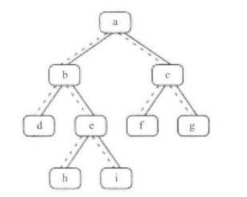
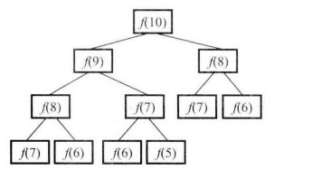
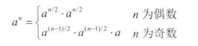
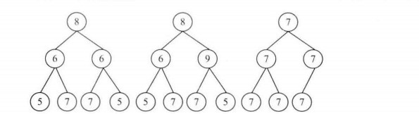
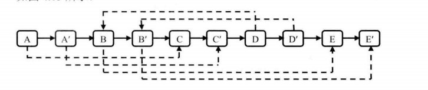
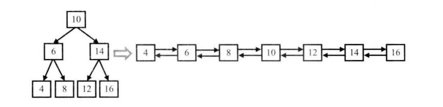
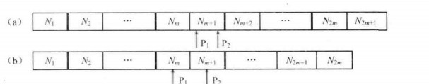
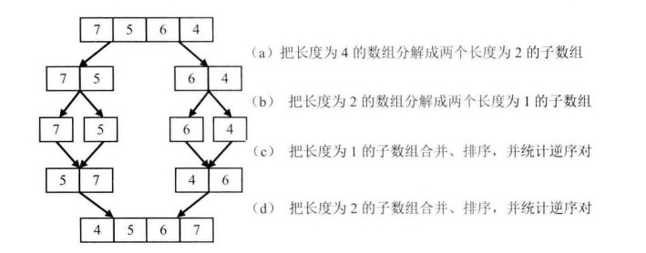
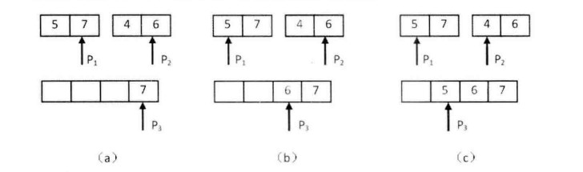
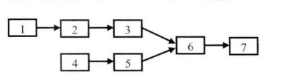

## 数组中重复的数字

### 1. 找出数组中重复的数字

在一个长度为 n 的数组里的所有数字都在 0~n-1 的范围内，数组中有些数字是重复的，但不知道有几个数字重复了，也不知道每个数字重复了几次。请找出数组中任意一个重复的数字。例如，如果输入长度为 7 的数组 `{2, 3, 1, 0, 2, 5, 3}`，那么对应的输出是重复的数字 2 或者 3。

#### 分析

- 可以先对数组进行排序，然后顺序扫描数组，判断相邻的数字是否相同。快速排序的时间复杂度是$$O(nlogn)$$，所以这个解法的时间复杂度是$$O(nlogn)$$；空间复杂度是$$O(logn)$$

- 可以利用哈希表，顺序扫描的过程中判断数字是否已经出现过。因为已经明确所有数字都在 0~n-1 范围内，所以可以直接用一个长度为 n 的数组作为哈希表，键就是下标，所以查找时间是$$O(1)$$，整个算法的时间复杂度是$$O(n)$$，空间复杂度是$$O(n)​$$

可以根据排序的思想，用一个空间复杂度为$$O(1)$$的方法解决问题。如果数组有序，那么第一个位置上的数字是 0，第二个位置上的数字是 1，即`a[i] == i`。所以，顺序扫描数组，对于数字`a[i]`，判断`a[i] == i`，如果成立，说明这个数字位于正确的位置上，接着扫描下一个数字；如果不成立，判断`a[i] == a[a[i]]`，如果成立，就说明有重复，否则交换`a[i]`和`a[a[i]]`，直到`a[i]`位于正确的位置上。

```go
// 存在则返回一个重复的数字，其他情况返回 -1
func findDuplication1(numbers []int) int {
	// 数组为空
	if len(numbers) == 0 {
		return -1
	}
	// 数组中的数字不在 0~n-1 的范围内
	for _, n := range numbers {
		if n < 0 || n > len(numbers)-1 {
			return -1
		}
	}

	for i := range numbers {
		// 当前数字不在正确的位置上
		if numbers[i] != i {
			if numbers[i] == numbers[numbers[i]] {
				// 找到重复的数字
				return numbers[i]
			} else {
				// 将当前数字放到正确的位置上
				for numbers[i] != i {
					numbers[i], numbers[numbers[i]] = numbers[numbers[i]], numbers[i]
				}
			}
		}
	}
	return -1
}
```

每个数字最多交换两次就能位于正确的位置上，所以时间复杂度是$$O(n)$$，空间复杂度是$$O(1)$$。

### 2. 不修改数组中找出重复的数字

在一个长度为 n+1 的数组中，所有数字都在 1~n 的范围内，所以数组中至少有一个数字是重复的，请找出任意一个重复的数字，要求不能修改原数组。

#### 分析

如果不重复，那么 1~n 的范围内正好是每个数字一个。把 1~n 的数字从中间的数字 m 分为两部分，前面一半为 1~m，后面一半为 m+1~n。如果前面一半的数字个数超过 m，意味着这一个区间里面一定有重复的数；否则，就是后面一半这个区间里面有重复的数字。按照这种类似二分查找的方法，就可以找到重复的数字。

```go
func findDuplicatioin2(numbers []int) int {
	if len(numbers) == 0 {
		return -1
	}
	for _, n := range numbers {
		if n < 1 || n > len(numbers) {
			return -1
		}
	}
	start, end := 0, len(numbers)-1
	for start <= end {
		mid := (start + end) / 2
		count := countRange(numbers, start, mid)
		// 区间长度为1，也就是只需判断这个数在整个数组中出现了多少次
		// 就能直到它是否重复
		if end == start {
			if count > 1 {
				return start
			} else {
				break
			}
		}
		// 确定下一次查找的区间
		if count > mid-start+1 {
			end = mid
		} else {
			start = mid + 1
		}
	}
	return -1
}

func countRange(numbers []int, start, end int) int {
	if len(numbers) == 0 {
		return 0
	}
	count := 0
	for i := range numbers {
		if numbers[i] >= start && numbers[i] <= end {
			count++
		}
	}
	return count
}
```

`countRange`被调用$$logn$$次，它的时间复杂度是$$O(n)$$，因此整个算法时间复杂度是$$O(nlogn)$$，空间复杂度是$$O(1)$$。

## 二维数组中的查找

在一个二维数组中，每一行都按照从左到右递增的顺序排序，每一列都按照从上到下递增的顺序排序，请完成一个函数，输入这样的一个二维数组和一个整数，判断数组中是否含有该整数。

### 分析

以下面的矩阵为例：

```
1 2 8  9
2 4 9  12
4 7 10 13
6 8 11 15
```

查找 7 的的过程为：
（1）首先看矩阵右上角的数字 9，9 大于 7，说明 9 所在的列不可能包含 7，所以把这一列去掉；

（2）在剩下的矩阵中同样是先看右上角的数字，也就是 8，8 也大于 7，这一列舍去；

（3）在剩下的矩阵中取右上角数字 2，2 小于 7，说明 7 不可能在这一行，所以把这一行去掉。

以此类推，当剩下的矩阵为：

```
4 7
6 8
```

这时右上角的数字就是 7。

也就说，每次都取当前矩阵右上角数字，如果不是所要找的数，那么就根据大小关系去掉一行或是一列；重复这个过程，直到找到目标或是整个矩阵都被去掉。

```go
func findInMatrix(matrix [][]int, target int) bool {
   if len(matrix) == 0 || len(matrix[0]) == 0 {
      return false
   }
   i, j := 0, len(matrix[0])-1
   for i < len(matrix) && j >= 0 {
      if matrix[i][j] == target {
         return true
      } else if matrix[i][j] < target {
         // 去掉一行
         i++
      } else {
         // 去掉一列    
         j--
      }
   }
   return false
}
```

最好的情况下只用找比较 1 次，最坏的情况下需要比较的次数为副对角线上的数字个数，所以时间复杂度为$$O(n)$$，空间复杂度是$$O(1)$$。

## 替换空格

请实现一个函数，把字符串中的每个空格替换成“%20”.

### 分析

可以直接使用库函数`strings.Replace`来实现，这里参考`strings.Replace`的源码给出一种实现。

```go
func Replace(s string) string {
	// Compute number of replacements.
	m := countBlank(s)
	if  m == 0 {
		return s // avoid allocation
	}
    
	// Calculate the length of string to be generated
    // and make a buffer.
	t := make([]byte, len(s)+m*(len("%20")-len(" ")))
	w := 0
	start := 0
	for i := 0; i < m; i++ {
        j := start
        // let j point to the first blank in the left string
        j += indexOfBlank(s[start:])
        // s[start:j] is the substring before a blank
        w += copy(t[w:], s[start:j])
        // let new string replace a blank
        w += copy(t[w:], "%20")
        // let start point to the place just after the blank replaced
        start = j + len(" ")
	}
    // copy the left substring
	w += copy(t[w:], s[start:])
	return string(t[0:w])
}

func countBlank(s string) int {
    if s == "" {
        return 0
    }
    count := 0
    for _, r := range s {
        if r == ' ' {
            count++
        }
    }
    return count
}

func indexOfBlank(s string) int {
    for i, r := range s {
        if r == ' ' {
            return i
        }
    }
    return -1
}
```

空间复杂度和源字符串以及替换的内容有关，时间复杂度是$$O(n)$$。

### 相关题目

有两个排序的数组 A1 和 A2，内存在 A1 的末尾有足够的空间容纳 A2.请实现一个函数，把 A2 中的所有数字插入 A1 中，并且所有数字是有序的。

#### 分析

这个题目要求将两个数组归并到其中一个数组中（不同于常规的可以利用额外空间的二分归并），如果从前到后归并，那么显然会移动较多的元素，不妨从后往前归并。

```go
// n 是当前 a1 含有的元素个数
func mergeTwoArrays(a1 []int, n int, a2 []int) []int {
	k := n + len(a2) - 1 // 归并之后最后一个位置下标为 k
	i, j := n-1, len(a2)-1
	// 下面就是二路归并
	for i >= 0 && j >= 0 {
		if a1[i] > a2[j] {
			a1[k] = a1[i]
			i--
		} else {
			a1[k] = a2[j]
			j--
		}
		k--
	}
	for i >= 0 {
		a1[k] = a1[i]
		i--
		k--
	}
	for j >= 0 {
		a1[k] = a2[j]
		j--
		k--
	}
	return a1
}
```

时间复杂度是显然是$$O(两个数组长度之和)$$，空间复杂度是$$O(1)$$。

## 从尾到头打印链表

输入一个链表的头节点，从尾到头反过来打印每个节点的值。

### 分析

最容易想到的做法就是顺序遍历链表，遍历的过程中节点入栈，最后再出栈。空间复杂度和时间复杂度都是$$O(n)​$$。

```go
type ListNode struct {
	Key  int
	Next *ListNode
}

func reversePrint(head *ListNode) {
	if head == nil {
		return 
	}
	stack := make([]*ListNode, 0)
	for cur := head; cur != nil; cur = cur.Next {
		stack = append(stack, cur)
	}
	for len(stack) > 0 {
		node := stack[len(stack)-1]
		fmt.Println(node.Key)
		stack = stack[:len(stack)-1]
	}
}
```

也可以采用递归的方法，但是如果链表太长，递归的方法很可能导致调用栈溢出。

```go
func reversePrintRecur(head *ListNode) {
    if head != nil {
        if head.Next != nil {
            reversePrintRecur(head.Next)
        }
        fmt.Println(head.Key)
    }
}
```

还有一种思路，可以先把链表中每个节点的 Next 指针反转，这样就得到一个反向的链表。但是这种操作会修改原来的链表，**在面试中，如果打算修改输入的数据，最好先问面试官是不是允许修改**。

## 重建二叉树

输入某二叉树的前序遍历和中序遍历的结果，请重建该二叉树。假设输入的前序遍历和中序遍历的结果中都不含有重复的数字。二叉树的节点定义为：

```pseudocode
struct BinaryTreeNode {
    int              value
    BinaryTreeNode*  left
    BinaryTreeNode*  right
}
```

### 分析

题目不难，关键是要考虑到程序的健壮性，要对无效的输入做出判断。

```go
type BinaryTreeNode struct {
   Value int
   Left  *BinaryTreeNode
   Right *BinaryTreeNode
}

func rebuildBT(preorder, inorder []int) (*BinaryTreeNode, error) {
   if len(preorder) <= 0 || len(inorder) <= 0 {
      return nil, nil
   }
   if len(preorder) == 1 && len(inorder) == 1 {
        // 同一个节点的值不一样
      if preorder[0] != inorder[0] {
         return nil, errors.New("invalid input")
      }
   }
    // 在中序序列中找根节点
   root := preorder[0]
   indexOfRoot := -1
   for i, v := range inorder {
      if v == root {
         indexOfRoot = i
         break
      }
   }
    // 在中序序列中找不到根节点
   if indexOfRoot == -1 {
      return nil, errors.New("invalid input")
   }
   left, err := rebuildBT(preorder[1:indexOfRoot+1], inorder[:indexOfRoot])
   if err != nil {
      return nil, err
   }
   right, err := rebuildBT(preorder[1+indexOfRoot:], inorder[indexOfRoot+1:])
   if err != nil {
      return nil, err
   }
   return &BinaryTreeNode{root, left, right}, nil
}
```

这个算法相当于每个节点都访问一次，时间复杂度为$$O(n)$$，空间复杂度为$$O(树的深度)$$。

## 二叉树的下一个节点

给定一棵二叉树和其中的一个节点，如何找出中序遍历序列的下一个节点？树中的节点除了有两个分别指向左、右子节点的指针，还有一个指向父节点的指针。

### 分析



以上图为例，中序遍历的结果为`{d, b, h, e, i, a, f, c, g}`，经过分析可知：

- 如果节点有右子树，那么中序遍历的下一个节点就是右子树的最左下节点
- 如果节点没有右子树，而且这个节点是其父节点的左孩子，那么中序遍历的下一个节点就是其父节点
- 如果节点没有右子树，而且这个节点是其父节点的右孩子，那么中序遍历的下一个节点应该是它的某一个祖先节点，而且这个祖先节点本身是左孩子；如果这样的祖先节点不存在，那么中序遍历的下一个节点不存在

```go
type BinaryTreeNode struct {
   Value  int
   Left   *BinaryTreeNode
   Right  *BinaryTreeNode
   Parent *BinaryTreeNode
}

func nextInorder(node *BinaryTreeNode) *BinaryTreeNode {
   if node == nil {
      return nil
   }
   if node.Right != nil {
      // 找右子树的最左下节点
      cur := node.Right
      for cur.Left != nil {
         cur = cur.Left
      }
      return cur
   }
   // 没有右子树，有父节点
   if node.Parent != nil {
      if node.Parent.Left == node {
         // 本身是左孩子
         return node.Parent
      } else {
         // 本身是右孩子
         for cur := node.Parent; cur != nil; cur = cur.Parent {
            if cur.Parent != nil && cur == cur.Parent.Left {
               return cur
            }
         }
      }
   }
   return nil
}
```

时间复杂度为$$O(树的深度)$$，空间复杂度为$$O(1)$$。

## 用两个栈实现队列

用两个栈实现一个队列，请实现它的两个函数`appendTail`和`deleteHead`，分别完成在队列尾部插入节点和在队列头部删除节点的功能。队列的声明为：

```go
type CQueue struct {
    Stack1 []interface{}
    Stack2 []interface{}
}

func NewCQueue() *CQueue {
    return &CQueue{make([]interface{}, 0), make([]interface{}, 0)}
}
```

### 分析

入队的时候，总是压入 stack1。出队的时候则分情况：

- 如果两个栈都为空，那么说明队列为空；
- 如果 stack2 为空，那么将 stack1 的元素依次出栈并压入 stack2，然后 stack2 的栈顶元素就是队头元素；
- 如果 stack2 不为空，那么栈顶元素就是队头元素。

```go
func (q *CQueue) AppendTail(e interface{}) {
   q.stack1 = append(q.stack1, e)
}

func (q *CQueue) DeleteHead() interface{} {
   if len(q.stack1) == 0 && len(q.stack2) == 0 {
      return nil
   }
   var top interface{}
   if len(q.stack2) == 0 {
      // stack2 为空，则 stack1 依次出栈
      for len(q.stack1) > 1 {
         q.stack2 = append(q.stack2, q.stack1[len(q.stack1)-1])
         q.stack1 = q.stack1[:len(q.stack1)-1]
      }
      top = q.stack1[0]
      q.stack1 = q.stack1[:0]
   } else {
      // stack2 不为空
      top = q.stack2[len(q.stack2)-1]
      q.stack2 = q.stack2[:len(q.stack2)-1]
   }
   return top
}
```

入队的时间复杂度是$$O(1)​$$，出队的时间复杂度最坏情况下是$$O(n)​$$，最好情况下是$$O(1)​$$。空间复杂度是$$O(1)​$$。

### 相关题目

用两个队列实现一个栈。

#### 分析

入栈的时候总是加入 queue1，出栈则需要分情况考虑：

- 如果两个队列都为空，说明栈为空
- 将不空的队列中的元素依次出队并加入另一个队列，直到原来不为空的队列中只剩一个元素，这个元素就是队头

```go
type CStack struct {
    queue1 []interface{}
    queue2 []interface{}
}

func NewCStack() *CStack {
    return &CStack{make([]interface{}, 0), make([]interface{}, 0)}
}

func (s *CStack) Push(e interface{}) {
    s.queue1 = append(s.queue1, e)
}

func (s *CStack) Pop() interface{} {
    if len(s.queue1) == 0 && len(s.queue2) == 0 {
        return nil
    }
    var top
    if len(s.queue1) > 0 {
        for len(s.queue1) > 1 {
            s.queue2 = append(s.queue2, s.queue1[0])
            s.queue1 = s.queue1[1:]
        }
        top = s.queue1[0]
        s.queue1 = s.queue1[1:]
    } else {
        for len(s.queue2) > 1 {
            s.queue1 = append(s.queue1, s.queue2[0])
            s.queue2 = s.queue2[1:]
        }
        top = s.queue2[0]
        s.queue2 = s.queue2[1:]
    }
    return top
}
```

时间复杂度为$$O(n)$$。

## 斐波那契数列

斐波那契数列及其相关的变形，解题的关键在于分析问题时找到递推关系（比如用数学归纳法），然后确定这是一个斐波那契数列问题。

### 1. 求斐波那契数列的第 n 项

#### 分析

递归是非常直观的解法，但是递归时间效率和空间效率都很差，因为在计算的过程有很多项的计算是重复的：



为了避免重复计算，就可以使用记忆化的方式：

```go
func MemomizedFibonacci(n int) int {
	// computed 用来记忆话计算结果
	computed := make(map[int]int)
	computed[0], computed[1] = 0, 1
	return helper(n, computed)
}

func helper(n int, computed map[int]int) int {
	if _, ok := computed[n]; ok {
		return computed[n]
	} else {
		res := helper(n-1, computed) + helper(n-2, computed)
		computed[n] = res
		return res
	}
}
```

实际上，用循环来计算，时间和空间的效率都是很高的。

```go
func IterativeFibonacci(n int) int {
    if n == 0 {
        return 0
    }
    if n == 1 {
        return 1
    }
    i, j := 0, 1
    res := 0
    for i := 2; i <= n; i++ {
        res = i + j
        i, j = j, res
    }
    return res
}
```

时间复杂度为$$O(n)$$，空间复杂度为$$O(1)$$。

### 2. 青蛙跳台阶问题

一只青蛙可以跳上 1 级台阶，也可以跳上 2 级台阶。求该青蛙跳上一个 n 级的台阶总共有多少种解法。

#### 分析

把跳 n 级台阶所需的跳数看成 n 的函数，记为$$f(n)$$。当$$n>2$$时，如果第一跳为 1 级，那么跳法总数等于剩下的 n - 1 级台阶的跳法数目；如果第一跳为 2 级，那么跳法总数等于剩下的 n - 2 级台阶的跳法数目。也就是说，$$f(n)=f(n-1)+f(n-2)$$。这就转换为了斐波那契数列问题。但是要注意边界条件不同。

```go
func FrogJump(n int) int {
    if n == 0 {
        return 0
    }
    if n == 1 {
        return 1
    }
    if n == 2 {
        return 2
    }
    i, j := 1, 2
    res := 0
    for i := 3; i <= n; i++ {
        res = i + j
        i, j = j, res
    }
    return res
}
```

## 旋转数组的最小数字

把一个数组最开始的若干个元素搬到数组的末尾，我们称之为数组的旋转。输入一个递增排序的数组的一个旋转，输出旋转数组的最小元素。例如，数组`{3, 4, 5, 1, 2}`为`{1, 2, 3, 4, 5}`的一个旋转，该数组的最小值为 1。

### 分析

原数组是递增的，那么原数组的第一个元素就是最小元素。旋转之后形成的数组实际上是分部有序的，前一个有序的子数组的最后一个元素是最大元素，后一个有序子数组的第一个元素就是最小元素，两个元素显然是相邻的。可以从后往前遍历旋转后的数组，当发现前一个元素比当前元素大时，当前元素就是最小元素。

```go
func MinOfRotatedArray(arr []int) (int, error) {
	if len(arr) == 0 {
		return 0, errors.New("invalid input")
	}
	// 考虑了只有一个元素、所有元素均相同的特殊情况
	i := len(arr) - 1
	for ; i > 0; i-- {
		if arr[i] < arr[i-1] {
			break
		}
	}
	return arr[i], nil
}
```

时间复杂度是$$O(n)$$，空间复杂度是$$O(1)$$。

## 矩阵中的路径

请设计一个函数，用来判断在一个矩阵中是否存在一条包含某字符串所有字符的路径。路径可以从矩阵的任意一格开始，每一步可以在矩阵中向左、右、上、下移动一格。如果一条路径经过了矩阵的某一格，那么该路径不能再次进入该格子。

比如下面的矩阵中包含路径“bfcc”，但是不包含路径“abfb”。

```
a b t g
c f c s
j d c h
```

### 分析

在矩阵中查找路径，可以考虑使用 BFS。

```go
func FindPathInMatrix(matrix [][]byte, path string) bool {
	if len(matrix) == 0 {
		return false
	}
	if len(path) == 0 {
		return true
	}
	for i := 0; i < len(matrix); i++ {
		for j := 0; j < len(matrix[0]); j++ {
			// 从不同的起点开始进行 bfs
			if bfs(matrix, path, i, j) {
				return true
			}
		}
	}
	return false
}

func bfs(matrix [][]byte, path string, i int, j int) bool {
	dir := [][]int{{0, 1}, {0, -1}, {1, 0}, {-1, 0}}
	xMax, yMax := len(matrix), len(matrix[0])
	q := make([][]int, 0)
	visited := make([][]bool, xMax)
	for i := range visited {
		visited[i] = make([]bool, yMax)
	}
	
	count := 0 // 记录当前已经搜索到的字符数
	q = append(q, []int{i, j})
	visited[i][j] = true
	for len(q) != 0 {
		head := q[0]
		q = q[1:]
		if matrix[head[0]][head[1]] == path[count] {
			count++
			if count == len(path) {
				return true
			}
			for k := range dir {
				nextX, nextY := head[0]+dir[k][0], head[1]+dir[k][1]
				if nextX >= 0 && nextX < xMax && nextY >= 0 && nextY < yMax && !visited[nextX][nextY] {
					q = append(q, []int{nextX, nextY})
					visited[nextX][nextY] = true
				}
			}
		}
	}
	return false
}
```

总的时间复杂度是$$O(n^2)$$，空间复杂度是$$O(n)$$。

也可以使用回溯法，也就是用 DFS 的方法。

```go
func FindPathInMatrix(matrix [][]byte, path string) bool {
	if len(matrix) == 0 {
		return false
	}
	if len(path) == 0 {
		return true
	}
	for i := 0; i < len(matrix); i++ {
		for j := 0; j < len(matrix[0]); j++ {
			// 从不同的起点开始 dfs
			if dfs(matrix, path, i, j) {
				return true
			}
		}
	}
	return false
}

func dfs(matrix [][]byte, path string, i int, j int) bool {
   rows, cols := len(matrix), len(matrix[0])
   visited := make([][]bool, rows)
   for i := range visited {
      visited[i] = make([]bool, cols)
   }
   count := 0
   return dfsHelper(matrix, path, i, j, rows, cols, visited, &count)
}

func dfsHelper(matrix [][]byte, path string, i int, j int, rows int, cols int, visited [][]bool, count *int) bool {
   if i >= 0 && i < rows && j >= 0 && j < cols && !visited[i][j] {
      visited[i][j] = true
      if path[*count] == matrix[i][j] {
         *count++
         if *count == len(path) {
            return true
         }
         if dfsHelper(matrix, path, i+1, j, rows, cols, visited, count) ||
            dfsHelper(matrix, path, i-1, j, rows, cols, visited, count) ||
            dfsHelper(matrix, path, i, j+1, rows, cols, visited, count) ||
            dfsHelper(matrix, path, i, j-1, rows, cols, visited, count) {
            return true
         }
      }
   }
   return false
}
```

时间复杂度是$$O(n^2)$$。

## 机器人的运动范围

地上有一个 m 行 n 列的方格。一个机器人从坐标(0, 0)的格子开始移动，它每次可以向左、右、上、下移动一格，但不能进入行坐标和列坐标的数位之和大于大于 k 的格子。例如，当 k 为 18 时，机器人能够进入方格(35, 37)，因为 3+5+3+7=18。但它不能进入方格(35, 38)，因为 3+5+3+8=19。请问机器人能够到达多少个格子？

### 分析

类似的题目，依旧是搜索问题，只不过多了一些判断条件。

```go
func CountCells(m, n, k int) int {
   if k < 0 || m <= 0 || n <= 0 {
      return 0
   }
   visited := make([][]bool, m)
   for i := range visited {
      visited[i] = make([]bool, n)
   }
   dir := [][]int{{0, 1}, {0, -1}, {1, 0}, {-1, 0}}
   q := make([][]int, 0)
   q = append(q, []int{0, 0})
   visited[0][0] = true
   count := 0
   for len(q) > 0 {
      head := q[0]
      q = q[1:]
      count++
      for j := range dir  {
         x, y := head[0]+dir[j][0], head[1]+dir[j][1]
         if x >= 0 && x < m && y >= 0 && y < n && check(x, y, k) && !visited[x][y] {
            q = append(q, []int{x, y})
            visited[x][y] = true
         }
      }
   }
   return count
}

func check(x int, y int, k int) bool {
   // 已经考虑了 x，y 为 0 的情况
   count := 0
   for d := x; d > 0; d /= 10 {
      count += d % 10
      if count > k {
         return false
      }
   }
   for d := y % 10; d > 0; d /= 10 {
      count += d
      if count > k {
         return false
      }
   }
   return true
}
```

## 剪绳子

给你一根长度为 n 的绳子，请把绳子剪成 m 段（m、n 都是整数，n > 1 并且 m > 1），每段绳子的长度记为 k[0]，k[1]，……。请问所有绳子长度的最大乘积是多少？

### 分析

1.动态规划

假如定义函数 f(n) 为把长度为 n 的绳子剪成若干段之后各段长度乘积的最大值。在剪第一段的时候，我们有 n - 1 种可能的选择没也就是剪出来的第一段绳子的可能长度分别为1，2，……，n-1。因此， f(n)=max(f(i)*f(n-i))。于是这个问题就被分解成了若干个小的子问题，而每个子问题又可以继续分解，并且把它们各自的最优解组合起来之和就达到了整个问题的最优解。于是可以用动态规划的方法。

为了提高效率，采用记忆化的方法将一些中间结果保存下来，避免重复计算。当绳子的长度为 2 时，只可能剪成长度都为 1 的两段，因此 f(2) 等于 1。当绳子的长度为 3 时，可能把绳子剪成长度为 1 和长度为 2 的两段或者是长度为 1 的三段，此时最大长度乘积为 2。

```go
// 该解法存疑
func DPMaxProduct(n int) int {
    // 边界情况
   if n < 2 {
      return 0
   }
   if n == 2 {
      return 1
   }
   if n == 3 {
      return 2
   }
    // products 数组用来存储 f(n)
   products := make([]int, n+1)
   products[1], products[2] = 1, 2
   for i := 3; i <= n; i++ {
      max := 0
      for j := 1; j <= n/2; j++ {
         tmp := products[j] * products[n-j]
         if tmp > max {
            max = tmp
         }
      }
      products[i] = max
   }
   return products[n]
}
```

时间复杂度是$$O(n^2)$$，空间复杂度是$$O(n)$$。

2.贪婪算法

当绳子长度$$n≥5$$时，显然$$2(n-2)>n$$并且$$3(n-3)>n$$。也就是说，当剩下的绳子长度大于或者等于 5 时，应该剪成长度为 3 或 2 的段。$$n=5$$时，$$3(n-3)≥2(n-2)$$，所以应该尽可能多地剪成长度为 3 的段。

当$$n=4$$时，显然$$2×2$$是最优解。实际上这个时候绳子没必要剪，但是题目要求至少剪一刀。

这种方法并没有尝试每一种可能，而是在每一步都要找到最优解，因此这是一种贪婪算法。

```go
func GreedyProduct(n uint) uint {
	if n < 2 {
		return 0
	}
	if n == 2 {
		return 1
	}
	if n == 3 {
		return 2
	}
	// 先尽可能剪成长度为 3 的段
	numOf3 := n / 2 // 长度为 3 的段的数量
	// 如果原来长度为 4 的段，此时不是剪成长度为 3 的段
	// 而是要剪成长度为 2 的段
	if 3*numOf3+1 == n {
		numOf3--
	}
	// 剪成长度为 2 的段
	numOf2 := uint((n - 3*numOf3) / 2) // 长度为 2 的段的数量
	return 1 << numOf2 * uint(math.Pow(3.0, float64(numOf3)))
}
```

## 二进制中 1 的个数

请实现一个函数，输入一个整数，输出该数二进制中 1 的个数。

### 分析

（1）常规解法

最直接的想法就是把输入的数用除 k 取余法转换成二进制，这种方法的时间复杂度显然是线性的。注意如果输入的数是负数，那么最高位多一个 1.

```GO
func CountOnesInBinary(n int) int {
   count := 0
   // 如果为负数，那么就是高位多一个 1
   if n < 0 {
      count++
      n = -n
   }
   for n != 0 {
      if n%2 == 1 {
         count++
      }
      n /= 2
   }
   return count
}
```

还有一种做法，首先把输入的数和 1 做位与运算，判断最低位是不是 1；然后将 1 左移 1 位，做位与运算，判断次低位是否为 1 ……这种做法的时间复杂度也是线性的，与整数的位数有关（64 位整数就要循环 64  次）。

（2）技巧解法

**把一个数和它减去 1 的结果做位与运算，相当于把这个数最右边的 1 变为 0**。基于这个事实，可以不断进行这样的操作，总共能进行多少次，就说明有多少个 1.

```go
func CountOnesInBinary(n int) int {
	count := 0
	if n < 0 {
		count++
		n = -n
	}
	for n != 0 {
		count++
		n = (n-1) & n
	}
	return count
}
```

## 数值的整数次方

实现乘方函数，不得使用库函数，不用考虑大数的问题。

### 分析

问题本身并不难，但是要考虑到边界情况：当指数为 0 或者负数时，底数不能为 0。

```go
func Power(base, exp float64) (float64, error) {
	// 指数为 0
	if exp == 0.0 {
		if base == 0.0 {
			return 0, errors.New("base-zero exponential of 0 is invalid")
		} else {
			return 1, nil
		}
	}
	// 指数为负数
	neg := false
	if exp < 0.0 {
		if base == 0.0 {
			return 0, errors.New("base-zero exponential of a negative value is invalid")
		}
		exp = -exp
		neg = true
	}
	times := int(exp)
	n := base
	for i := 1; i < times; i++ {
		n *= base
	}
	if neg {
		return 1.0 / n, nil
	} else {
		return n, nil
	}
}
```

时间复杂度为$$O(n)$$，空间复杂度为$$O(1)$$。

这个解法的时间复杂和指数绝对值的大小正相关，指数绝对值越大，循环次数越多。

假设要计算 32 次方，如果已经知道了 16 次方，那么再平方就可以得到 32 次方；而 16 次方又是 8 次方的平方……



这个公式可以用递归实现：

```go
func Power(base, exp float64) (float64, error) {
	// 指数为 0
	if exp == 0.0 {
		if base == 0.0 {
			return 0, errors.New("base-zero exponential of 0 is invalid")
		} else {
			return 1, nil
		}
	}
	// 指数为负数
	neg := false
	if exp < 0.0 {
		if base == 0.0 {
			return 0, errors.New("base-zero exponential of a negative value is invalid")
		}
		exp = -exp
		neg = true
	}
	n := power(base, int(exp))
	if neg {
		return 1.0 / n, nil
	} else {
		return n, nil
	}
}

func power(base float64, exp int) float64 {
	if exp == 0 {
		return 1
	}
	if exp == 1 {
		return base
	}
	// 右移 1 位就是除以 2
	n := power(base, exp>>1)
	n *= n
	// 与 1 做位与运算，结果为 1 说明是奇数，为 0 说明时偶数
	if exp&1 == 1 {
		n *= base
	}
	return n
}
```

这个算法的时间复杂度是$$O(logn)$$。注意一些位运算的技巧：

- `1<<n`就是计算 2 的 n 次方
- `n>>1`就是将 n 除以 2
- `n&1`可以用来判断 n 的奇偶性，结果为 1 则为奇
- `n&(n-1)`就是将 n 最低位的 1 变为 0

## 打印从 1 到最大的 n 位数

输入数字 n，按顺序打印出从 1 到最大的 n 位十进制数。比如输入 3，则打印出 1、2、3 一直到最大的三位数 999。

### 分析

解决这题关键是要意识到当 n 很大时，不管是用什么内建的整数类型都有可能溢出。这题要求的是打印整数，所以不妨用字符串来操作，只不过要在字符串上模拟整数加 1 的运算。

```go
func PrintNumbers(n int64) {
	if n <= 0 {
		return
	}
	// n 位最大整数
	max := ""
	for i := int64(0); i < n; i++ {
		max += "9"
	}
	// 依次打印 1 - n 
	num := make([]byte, 0)
	num = append(num, '0')
	for string(num) != max {
		flag := false // 判断是否有进位
		// 从最低位开始加 1
		for i := len(num) - 1; i >= 0; i-- {
			// 如果当前位上的数已经是 9，就说明要进 1
			if num[i] == '9' {
				num[i] = '0'
				flag = true
			} else {
				num[i]++
			}
			if !flag {
				// 不用进位就说明运算结束
				break
			} else {
				// 如果当前是第一位，那就说明从下一个数开始就要多 1 位
				if i == 0 {
					num = append([]byte{'0'}, num...)
					i++
                }
				flag = false
			}
		}
		fmt.Println(string(num))
	}
}
```

时间复杂度是$$O(n)$$，空间复杂度是$$O(n)$$。

## 删除链表的节点

### 1. 给定单向链表的头指针和一个节点指针，定义一个函数在$O(1)$时间内删除该节点。

#### 分析

按照常规思路，找到被删除的节点就需要$$O(n)$$的时间，但是这题的特别之处在于题目已经给出了需要删除的节点的指针，所以可以这么考虑：

- 如果链表中只有一个节点，直接把头节点置为空
- 如果要删除的是尾节点，那么要先找到尾节点的前一个节点，把这个节点的 Next 指针置为空
- 如果要删除的是中间节点，那么可以把要删除的节点的下一个节点的值赋给它，然后把它的指针指向下下个节点，这样也就相当于删除了它

```go
func DeleteNode(head *ListNode, node *ListNode) {
	if head == nil || node == nil {
		return
	}
	// 链表只有一个节点
	if head == node {
		head = nil
		return
	}
	// 要删除的节点是尾节点
	if node.Next == nil {
		cur := head
		for cur.Next != node {
			cur = cur.Next
		}
		cur.Next = nil
		return
	}
	// 一般情况
	node.Key = node.Next.Key   // 赋值
	node.Next = node.Next.Next // 修改指针
}
```

在上面的代码中并没有考虑要删除的节点在链表中这种情况，但是因为时间复杂度必须是$$O(1)$$，所以没法检验。

### 2. 在一个排序的链表中，如何删除重复的节点？

```go
func DeleteDuplicateListNodes(head *ListNode) *ListNode {
   // 链表为空或者只有一个节点
   if head == nil || head.Next == nil {
      return head
   }
   dump := &ListNode{Next: head} // 辅助节点，便于处理从头节点开始一直都是重复的节点的情况
   pre, cur := dump, head
   var dup int
   for cur != nil && cur.Next != nil {
      if cur.Key == cur.Next.Key {
         // 删除重复的节点，注意重复的节点可能是连续多个
         // 注意尾节点也是重复节点的情况，先判断 cur 是否为空
         dup = cur.Key
         for cur != nil && cur.Key == dup {
            pre.Next, cur = cur.Next, cur.Next
         }
      } else {
         pre, cur = cur, cur.Next
      }
   }
   return dump.Next
}
```

时间复杂度是$$O(n)$$，空间复杂度是$$O(1)$$。

## 正则表达式的匹配

请实现一个函数用来匹配包含‘.’和'*'的正则表达式，前者表示任意一个字符，后者表示它前面的字符可以出现任意次（含 0 次）。在本题中，匹配是指字符串的所有字符匹配整个模式，比如字符串“aaa”与模式"a.a"和"ab\*ac\*a"匹配，但与"aa.a"和“ab\*a”均不匹配。

### 分析

```go
func Match(s, pattern string) bool {
   if s == "" && pattern == "" {
      return true
   }
   if s != "" && pattern == "" {
      return false
   }
   if pattern[1] == '*' {
      if pattern[0] == s[0] || (pattern[0] == '.' && s != "") {
         // 进入下一个状态
         return Match(s[1:], pattern[2:]) ||
            // 留在当前状态
            Match(s[1:], pattern) ||
            // 忽略一个 *
            Match(s, pattern[2:])
      } else {
         // 忽略一个 *
         return Match(s, pattern[2:])
      }
   }
   if s[0] == pattern[0] || (pattern[0] == '.' && s != "") {
      return Match(s[1:], pattern[1:])
   }
   return false
}
```

## 表示数值的字符串

请实现一个函数用来判断字符串是否表示数值（包括整数和小数）。例如，字符串“+100”、“5e2”、“-123”、“3.146”及“-1E-16”都表示数值，但是“12e"、“1a3.14”、“1.2.3”、“+-5”及“12e+5.4”都不是。

### 分析

首先尽可能多地扫描数字，如果遇到小数点，那么开始扫描表示小数的部分；如果遇到‘e’或者‘E’就开始扫描表示指数的部分。

```go
func IsNumeric(s string) bool {
	if s == "" {
		return false
	}
	numeric, _s := scanInteger(s)
	s = _s
	// 扫描小数部分
	if s != "" && s[0] == '.' {
		s = s[1:]
		res, _s := scanUnsignedInteger(s)
		s = _s
		// 小数可以前后至少有一个部分有数字就行
		numeric = res || numeric
	}
	if s != "" && (s[0] == 'e' || s[0] == 'E') {
		s = s[1:]
		res, _s := scanInteger(s)
		s = _s
		// e/E 前面必须有数值，后面必须是整数
		numeric = numeric && res
	}
	return numeric && s == ""
}

// 扫描数字部分（带符号）
func scanInteger(s string) (bool, string) {
	if s != "" && (s[0] == '+' || s[0] == '-') {
		s = s[1:]
	}
	return scanUnsignedInteger(s)
}

// 扫描无符号整数
func scanUnsignedInteger(s string) (bool, string) {
	i := 0
	for ; i < len(s); i++ {
		if s[i] < '0' || s[i] > '9' {
			break
		}
	}
	if i > 0 {
		return true, s[i:]
	} else {
		return false, s
	}
}
```

因为是顺序扫描输入的字符串，时间复杂度是$$O(n)$$，空间复杂度$$O(1)$$。

## 调整数组顺序使奇数位于偶数前面

输入一个整数数组，实现一个函数来调整数组中数字的顺序，使得所有奇数在前，偶数在后。

### 分析

（1）直接解法

类似快速排序，利用两个指针，一个从后往前，一个从前往后，如果发现奇数在后面而偶数在前面，那么就交换。

```go
func SwapOddsAndEvens(a []int) []int {
	if len(a) == 0 {
		return a
	}
	i, j := 0, len(a)-1
	for i < j {
		// 向后移动 i 直到发现一个偶数
		for i < len(a) && a[i]&1 == 1 {
			i++
		}
		// 向前移动 j 直到发现一个奇数
		for j >= 0 && a[j]&1 != 1 {
			j--
		}
		if i < j {
			a[i], a[j] = a[j], a[i]
		}
	}
	return a
}
```

时间复杂度是$$O(n)$$，空间复杂度是$$O(1)$$。

（2）抽象

如果题目修改成要求负数在前非负数在后，或者能被 3 整除的数在前不能被 3 整除的数在后等等，思路都是一样的，只不过是判断的条件发生了变化，这样就可以做一层抽象，以一个函数作为参数，作为判断条件。 

```go
func SwapNumbers(a []int, f func(int) bool) []int {
   if len(a) == 0 {
      return a
   }
   i, j := 0, len(a)-1
   for i < j {
      for i < len(a) && f(a[i]) {
         i++
      }
      for j >= 0 && !f(a[j]) {
         j--
      }
      if i < j {
         a[i], a[j] = a[j], a[i]
      }
   }
   return a
}
```

## 链表中倒数第 k 个节点

输入一个链表，输出该链表中倒数第 k 个节点。为了符合习惯，本题从 1 开始记树，即链表的尾节点是倒数第 1 个节点。例如，一个链表有 6 个节点，从头节点开始，它们的值依次是 1，2，3，4，5，6。这个链表的倒数第 3 个节点是值为 4 的节点。

### 分析

典型的双指针类型题。但是要考虑一些特殊情况：

- 链表为空
- 参数 k 不是正树
- 链表中节点数小于 k

```go
func CountDownToKInList(head *ListNode, k int) *ListNode {
	if head == nil || k <= 0 {
		// 链表为空或参数 k 不是正数
		return nil
	}
	i := 0
	slow, fast := head, head
	for ; fast != nil && i < k; fast, i = fast.Next, i+1 {
	}
	if i < k {
		// 链表中的节点数小于 k
		return nil
	}
	for ; fast != nil && slow != nil; fast, slow = fast.Next, slow.Next {
	}
	return slow
}
```

时间复杂度为$$O(n)$$，空间复杂度是$$O(1)​$$。

## 链表中环的入口节点

如果一个链表中包含环，如何找出环的入口节点？

### 分析

[LeetCode](<https://leetcode.com/problems/linked-list-cycle-ii/>) 上有一模一样的题。

```go
func detectCycle(head *ListNode) *ListNode {
    if p := detect(head); p != nil {
        return start(p, head)
    } else {
        return nil
    }
}

// Floyd 算法检测环是否存在
func detect(head *ListNode) *ListNode {
    slow, fast := head, head
    for slow != nil && fast != nil && fast.Next != nil {
        slow = slow.Next
        fast = fast.Next.Next
        if slow == fast {
            return slow
        }
    }    
    return nil
}

func start(p, head *ListNode) *ListNode {
    q := head
    for p != q {
        p = p.Next
        q = q.Next
    }
    return q
}
```

如果更进一步要求求出环中节点的数量，那也很容易，因为已经知道了环的入口。

## 反转链表

定义一个函数，输入一个链表的头节点，反转该链表并输出反转后链表的头节点。

### 分析

经典问题，一定要背下模板。

（1）非递归版

```go
func ReverseListIteration(head *ListNode) *ListNode {
	if head == nil || head.Next == nil {
		// 链表为空或者只有一个节点
		return head
	}
	pre, cur := head, head.Next
	var tmp *ListNode
	for cur != nil {
		tmp = cur.Next // 记录当前节点的位置
		cur.Next = pre // 当前节点指向前一个节点
		pre, cur = cur, tmp
	}
	head.Next = nil // 记得让原来的首结点指向 nil
	return pre
}
```

时间复杂度是$$O(n)$$，空间复杂度是$$O(1)$$。

（2）递归版

```go
func ReverseListRecursion(head *ListNode) *ListNode {
	if head == nil || head.Next == nil {
		return head
	}
	// 从最后两个节点开始向前反转
	newHead := ReverseListRecursion(head.Next)
	// 让当前节点的下一个节点指向当前节点，当前节点指向 nil
	head.Next.Next, head.Next = head, nil
	return newHead
}
```

时间复杂度是$$O(n)$$，空间复杂度是$$O(n)$$。

## 合并两个排序的链表

输入两个递增排序的链表，合并这两个链表并使新链表中的节点依然是递增有序的。

### 分析

采用归并排序的思想即可。不过要注意链表为空的情况。

```go
func MergeTwoLists(l1, l2 *ListNode) *ListNode {
	if l1 == nil || l2 == nil {
        // 存在链表为空的情况
		if l1 != nil {
			return l1
		} else if l2 != nil {
			return l2
        } else {
            return nil
        }
	}
	dump := new(ListNode)
	cur := dump
	p, q := l1, l2
	for p != nil && q != nil {
		if p.Key < q.Key {
			cur.Next = p
			p = p.Next
		} else {
			cur.Next = q
			q = q.Next
		}
		cur = cur.Next
	}
	for p != nil {
		cur.Next = p
		cur, p = cur.Next, p.Next
	}
	for q != nil {
		cur.Next = q
		cur, q = cur.Next, q.Next
	}
	return dump.Next
}
```

时间复杂度$$O(n)$$，空间复杂度$$O(1)$$。

## 树的子结构

输入两棵二叉树 A 和 B，判断 B 是不是 A 的子树。二叉树节点定义为：

```pseudocode
struct BinaryTreeNode {
    double Value
    BinaryTreeNode Left
    BinaryTreeNode Right
}
```

### 分析

 首先判断根节点，然后再依次往下继续判断。

这道题还有一个需要注意的地方就是浮点数的比较：在计算机内部浮点数是有误差的，不能用等号判断浮点数是否相等，**而要用差的绝对值是否足够小来判断**。

```go
func FindSubtree(r1, r2 *BinaryTreeNode) bool {
	res := false
	if r1 != nil && r2 != nil {
		// 先找出 r1 的那一部分和 r2 的根节点相同
		if floatEqual(r1.Value, r2.Value) {
			res = findSubtreeHelper(r1, r2)
		}
		if !res {
			res = FindSubtree(r1.Left, r2)
		}
		if !res {
			res = FindSubtree(r1.Right, r2)
		}
	}
	return res
}

func findSubtreeHelper(r1 *BinaryTreeNode, r2 *BinaryTreeNode) bool {
	if r2 == nil {
		return true
	}
	if r1 == nil {
		return true
	}
	if !floatEqual(r1.Value, r2.Value) {
		return false
	}
	// 继续判断向下比较左右子树
	return findSubtreeHelper(r1.Left, r2.Right) && findSubtreeHelper(r1.Right, r2.Right)
}

// 比较浮点数的模板
func floatEqual(f1 float64, f2 float64) bool {
	EPSILON := 0.00000001
	if math.Abs(f1-f2) < EPSILON && math.Abs(f2-f1) < EPSILON {
		return true
	} else {
		return false
	}
}
```

## 二叉树的镜像

请完成一个函数，输入一棵二叉树，该函数输出它的镜像。

### 分析

对于比较抽象的问题，可以多画几幅图帮助理解。


观察上面的过程发现，求二叉树的镜像其实就是每个非叶节点的左右子节点交换了位置。那么可以总结方法为，在前序遍历的过程中，如果发现有非叶节点就交换左右孩子的位置。

```go
func MirrorBinaryTree(root *BinaryTreeNode) *BinaryTreeNode {
	if root == nil {
		return nil
	}
	if root.Left == nil && root.Right == nil {
		return root
	}
	// 交换左右子结点
	root.Left, root.Right = root.Right, root.Left
	if root.Left != nil {
		MirrorBinaryTree(root.Left)
	}
	if root.Right != nil {
		MirrorBinaryTree(root.Right)
	}
	return root
}
```

每个节点遍历一次，时间复杂度为$$O(n)$$，空间复杂度是$$O(logn)​$$。

## 对称的二叉树

请实现一个函数，用来判断一棵二叉树是不是对称的。如果一棵二叉树和它的镜像是一样的，那么它是对称的。



### 分析

可以根据前序遍历（根-左-右）和反前序遍历（根-右-左）的结果一样，那么树就是对称的。需要注意的是必须必须把空节点也考虑进去，不然就无法处理上图中第三棵树这种情况。

```go
func IsTreeSymmetrical(root *BinaryTreeNode) bool {
	if root == nil || (root.Left == nil && root.Right == nil) {
		return true
	}
	res1 := ""
	preorder(root, &res1)
	res2 := ""
	reversePreorder(root, &res2)
	return res1 == res2
}

// 反前序遍历
func reversePreorder(root *BinaryTreeNode, s *string) {
	if root != nil {
		*s += fmt.Sprintf("%d", root.Value)
		reversePreorder(root.Right, s)
		reversePreorder(root.Left, s)
	} else {
		// 用特殊符号标记空节点
		*s += "#"
	}
}

func preorder(root *BinaryTreeNode, s *string) {
	if root != nil {
		*s += fmt.Sprintf("%d", root.Value)
		preorder(root.Left, s)
		preorder(root.Right, s)
	} else {
		*s += "#"
	}
}
```

前序遍历时间复杂度为$$O(n)$$，空间复杂度是$$O(logn)$$。

## 顺时针打印矩阵

输入一个矩阵，按照从外向里以顺时针的顺序依次打印出每一个数字。比如下面的矩阵打印出来的结果是1，2，3，4，8，12，16，15，14，13，9，5，6，7，11，10。

```
1  2  3  4
5  6  7  8
9  10 11 12
13 14 15 16
```

### 分析

顺时针打印矩阵，可以看成是打印第一行→打印最后一列→打印最后一行→打印第一列；向内收缩矩阵，重复这个过程。值得注意的是不要重复打印一些边角上的元素，还有当矩阵只有一行或是一列时要单独处理。

```go
func ClockwiseMatrix(m [][]int) {
   if len(m) == 0 || len(m[0]) == 0 {
      return
   }
   if len(m) == 1 {
      // 只有一行
      for i := range m[0] {
         fmt.Printf("%d ", m[0][i])
      }
      return
   }
   if len(m[0]) == 1 {
      // 只有一列
      for i := range m {
         fmt.Printf("%d ", m[i][0])
      }
      return
   }
   // 多行多列
   l, r := 0, len(m[0])
   u, d := 0, len(m)
    // 一个 m 行矩阵需要重复这个过程 (m+1)/2 次
   for count := 0; count < (len(m)+1)>>1; count++ {
      // 打印第一行
      for i := l; i < r; i++ {
         fmt.Printf("%d ", m[u][i])
      }
      // 打印最后一列（除去第一个元素）
      for i := u + 1; i < d; i++ {
         fmt.Printf("%d ", m[i][r-1])
      }
      // 打印最后一行（除去最后一个元素）
      for i := r - 2; i >= l; i-- {
         fmt.Printf("%d ", m[d-1][i])
      }
      // 打印第一列（除去第一个元素）
      for i := d - 2; i > u; i-- {
         fmt.Printf("%d ", m[i][l])
      }
      // 矩阵向内收缩
      l, r = l+1, r-1
      u, d = u+1, d-1
   }
}
```

时间复杂度是$$O(n)$$，n 是元素个数。空间复杂度是$$O(1)$$。

## 包含 min 函数的栈

定义栈的数据结构，请在该类型中实现一个能够得到栈的最小元素的 min 函数。在该栈中，调用 min、push 及 pop 的时间复杂度都是$$O(1)$$。

### 分析

这个题的关键在于要在$$O(1)$$时间内找到最小元素，如果没有这个限制，那么就算是把所有元素出栈进行排序也可以解决问题。尽然要求时间复杂度最优，那么就考虑用空间换时间。

可以使用一个辅助栈，每次入栈的时候都把当前最小元素压入辅助栈；出栈时辅助栈也要出栈。这样辅助栈的栈顶元素就一定为当前最小元素。


```go
type Stack struct {
	Data []int
	Mins []int
}

func (s *Stack) Push(i int) {
	if len(s.Mins) == 0 || s.Mins[len(s.Mins)-1] > i {
		s.Mins = append(s.Mins, i)
	} else {
		s.Mins = append(s.Mins, s.Mins[len(s.Mins)-1])
	}
	s.Data = append(s.Data, i)
}

func (s *Stack) Pop() (int, error) {
	if len(s.Data) == 0 || len(s.Mins) == 0 {
		return 0, errors.New("stack is empty")
	} else {
		top := s.Data[len(s.Data)-1]
		s.Data = s.Data[:len(s.Data)-1]
		s.Mins = s.Mins[:len(s.Mins)]
		return top, nil
	}
}

func (s *Stack) Min() (int, error) {
	if len(s.Mins) == 0 || len(s.Data) == 0 {
		return 0, errors.New("stack is empty")
	} else {
		return s.Mins[len(s.Mins)-1], nil
	}
}
```

## 栈的压入、弹出序列

输入两个整数序列，第一个序列表示栈的压入顺序，请判断第二个是否为该栈的弹出序列。假设压入栈的所有数字均不相等。例如，序列`{1, 2, 3, 4, 5}`时入栈序列，`{4, 5, 3, 2, 1}`是一个弹出序列，但是`{4, 3, 5, 1, 2}`就不可能是弹出序列。

### 分析

要判断一个出栈序列能否由一个入栈序列得到，只需根据入栈序列尝试重现这个出栈序列。因为每次出栈的元素一定是栈顶元素，所以可以这样考虑：

- 根据给定的入栈序列将元素依次压入一个辅助栈中，如果辅助栈的栈顶元素元素和出栈序列的当前元素相同就弹出辅助栈的栈顶元素，并且继续向后遍历出栈序列，直到辅助栈的栈顶元素和出栈序列的当前元素不一样

如果出栈序列可以由入栈序列得到，那么最终辅助栈一定是空的。

```go
func validateStackSequences(pushed []int, popped []int) bool {
    if len(pushed) == 0 || len(popped) == 0 {
        return false
    }
    stack := make([]int, 0)
    i := 0
    for _, val := range pushed {
        stack = append(stack, val)
        for len(stack) > 0 && stack[len(stack)-1] == popped[i] {
            stack = stack[:len(stack)-1]
            i++
        }
    }
    return len(stack) == 0
}
```

时间复杂度是$$O(n)$$，空间复杂度是$$O(n)$$。

## 从上到下打印二叉树

### 1. 不分行从上到下打印二叉树

从上到下打印出二叉树的每个节点，同一层的结点按照从左到右的顺序打印。

#### 分析

层序遍历。

```go
func LevelOrderTraversal(root *BinaryTreeNode) {
   if root == nil {
      return
   }
   queue := make([]*BinaryTreeNode, 0)
   queue = append(queue, root)
   for len(queue) > 0 {
      head := queue[0]
      queue = queue[1:]
      fmt.Printf("%d ", head.Value)
      if head.Left != nil {
         queue = append(queue, head.Left)
      }
      if head.Right != nil {
         queue = append(queue, head.Right)
      }
   }
}
```

时间复杂度是$$O(n)$$，空间复杂度是$$O(n)$$。

### 2. 分行从上到下打印二叉树

从上到下按层打印二叉树，同一层的节点按从左到右的顺序打印，每一层打印到一行。

#### 分析

```go
func LevelOrderTraversalNewLine(root *BinaryTreeNode) {
   if root == nil {
      return
   }
   queue := make([]*BinaryTreeNode, 0)
   queue = append(queue, root)
   // 当前层次有多少节点需要打印、下一层需要打印多少节点
   cur, next := 1, 0
   for len(queue) > 0 {
      head := queue[0]
      queue = queue[1:]
      fmt.Printf("%d ", head.Value)
      if head.Left != nil {
         queue = append(queue, head.Left)
         next++
      }
      if head.Right != nil {
         queue = append(queue, head.Right)
         next++
      }
      if cur = cur - 1; cur == 0 {
         fmt.Println()
         cur, next = next, 0
      }
   }
}
```

时间复杂度是$$O(n)$$，空间复杂度是$$O(n)$$。

### 3. 之字形打印二叉树

请实现一个函数按照之字形打印顺序打印二叉树，即第一行从左到右打印，第二层从右到左打印，第三行再次从左到右打印等等。

#### 分析

遍历到一个节点时不急着打印，而是等到当前层次所有节点都遍历完了再根据具体的顺序打印当前层次的所有节点。

```go
func LevelOrderZigzagTraversal(root *BinaryTreeNode) {
	if root == nil {
		return
	}
	queue := make([]*BinaryTreeNode, 0)
	queue = append(queue, root)
	// 当前层次有多少节点需要打印、下一层需要打印多少节点
	cur, next := 1, 0
	// 当前层次从左到右还是从右到左打印
	ltr := true
	// 保存当前层次的节点的值
	tmp := make([]int, 0)
	for len(queue) > 0 {
		head := queue[0]
		queue = queue[1:]
		if head.Left != nil {
			queue = append(queue, head.Left)
			next++
		}
		if head.Right != nil {
			queue = append(queue, head.Right)
			next++
		}
		tmp = append(tmp, head.Value)
		if cur = cur - 1; cur == 0 {
			// 当前层次的节点已经遍历完了
			if ltr {
				// 从左到右打印
				for i := range tmp {
					fmt.Printf("%d ", tmp[i])
				}
			} else {
				// 从右到左打印
				for i := len(tmp) - 1; i >= 0; i-- {
					fmt.Printf("%d ", tmp[i])
				}
			}
			fmt.Println()
			cur, next = next, 0
			ltr = !ltr
			tmp = tmp[len(tmp):]
		}
	}
}
```

时间复杂度是$$O(n)$$，空间复杂度是$$O(n)$$。

这道题也可以用两个栈来解决，在打印某一层的节点时，把下一层的节点保存到相应的栈里。如果当前打印的是奇数层，则先保存左子节点再保存右子节点到第一个栈里；如果当前打印得使偶数层，则先保存右子节点再保存左子节点到第二个栈里。

## 二叉搜索树的后序遍历序列

输入一个整数数组，判断该数组是不是某个二叉搜索树的后序遍历结果。如果是则`true`，否则返回`false`。假设输入的数组的任意两个数字都互不相同。

### 分析

```go
func PostorderOfBST(seq []int) bool {
	// 面试中应该问清楚空的序列应该怎么处理
	// 这里认为空的序列对应一棵空的 BST
	if len(seq) == 0 {
		return true
	}
	root := len(seq) - 1
	// 找出左子树的范围
	lb, le := 0, 0
	for i := lb; i < root; i++ {
		if seq[i] >= seq[root] {
			le = i
			break
		}
	}
	// 找出右子树的范围
	rb, re := le, le
	for ; re < root; re++ {
		if seq[re] < seq[root] {
			// 如果在右子树中发现了比根节点小的节点
			// 说明这不是一棵搜索二叉树
			return false
		}
	}
	// 递归地判断左右子树
	return PostorderOfBST(seq[lb:le]) && PostorderOfBST(seq[rb:re])
}
```

时间复杂度是$$O(nlogn)$$，空间复杂度是$$O(logn)$$。

##  二叉树中和为某一值的路径

输入一棵二叉树和一个整数，打印出二叉树中节点值的和为输入整数得所有路径。从根节点开始往下一直到叶节点经过得所有节点形成一条路径。

### 分析

```go
func PathInBinaryTree(root *BinaryTreeNode, num int) {
   if root == nil {
      return
   }
   // path 用来记录每个节点的前驱节点
   path := make(map[*BinaryTreeNode]*BinaryTreeNode)
   // 深度优先搜索
   dfs(root, path)
   nodes := make([]int, 0)
   for leaf := range path {
      if leaf.Left != nil || leaf.Right != nil {
         // 中间节点则跳过
         continue
      }
      sum := 0
      // 获取路径，并计算路径上的节点值之和
      for cur := leaf; cur != nil; cur = path[cur] {
         sum += cur.Value
         nodes = append(nodes, cur.Value)
      }
      if sum == num {
         for i := len(nodes) - 1; i >= 0; i-- {
            fmt.Printf("%d ", nodes[i])
         }
         fmt.Println()
      }
      node = node[len(nodes):]
   }
}

func dfs(node *BinaryTreeNode, path map[*BinaryTreeNode]*BinaryTreeNode) {
   if node.Left != nil {
      path[node.Left] = node
      dfs(node.Left, path)
   }
   if node.Right != nil {
      path[node.Right] = node
      dfs(node.Right, path)
   }
}
```

时间复杂度是$$O(n)$$，空间复杂度是$$O(树的高度+节点数-1)$$.

## 复杂链表的复制

请实现函数复制一个复杂链表。在复杂链表中，每个节点除了有一个指向下一个节点的指针，还有一个指向链表中任意节点或者空指针的指针。节点结构定义为：

```pseudocode
struct ComplexListNode {
    int              value
    ComplexListNode* next
    ComplexListNode* sibling
}
```

### 分析

这道题的难点在于如何确定复制后的链表的`sibling`指针的链接关系。

（1）用哈希表保存原节点和复制节点的对应关系

假设 a 的复制节点是 a1，b 的复制节点是 b1，用哈希表保存这种对应关系，键是原始节点，值是复制节点。如果 a 的指针指向 b，又因为可以通过哈希表找到 a1 和 b1，所以就可建立 a1 和 b1 之间的链接指针。

``` go
func CloneWithMap(head *ComplexListNode) *ComplexListNode {
	if head == nil {
		return nil
	}
	// m 保存源节点和复制节点之间的对应关系
	m := make(map[*ComplexListNode]*ComplexListNode)
	for cur := head; cur != nil; cur = cur.Next {
		node := &ComplexListNode{head.Value, nil, nil}
		m[cur] = node
	}
	for origin, clone := range m {
		clone.Next, clone.Sibling = m[origin.Next], m[origin.Sibling]
	}
	return m[head]
}
```

时间复杂度是$$O(n)$$，空间复杂度是$$O(n)$$。

（2）不使用额外空间

把每一个克隆节点先插入到原节点的后面，如下图：



这样一来问题就变得很简单了。最后只需把两个链表分离就行。

```go
func CloneWithoutExtraSpace(head *ComplexListNode) *ComplexListNode {
	if head == nil {
		return nil
	}
	// 逐个复制并插入原节点后面
	for cur := head; cur != nil; cur = cur.Next {
		node := &ComplexListNode{cur.Value, nil, nil}
		node.Next, cur.Next = cur.Next, node
	}
	// 设置 Sibling 指针
	for cur := head; cur != nil && cur.Next != nil; cur = cur.Next.Next {
		if cur.Sibling != nil {
			cur.Next.Sibling = cur.Sibling.Next
		} 
	}
	// 分离出复制的链表
	cloneHead, cloneNode := head.Next, head.Next
	head.Next, head = cloneNode.Next, head.Next
	for cur := head; cur != nil; cur = cur.Next {
		cloneNode.Next, cloneNode = cur.Next, cloneNode.Next
		cur.Next = cloneNode.Next
	}
	return cloneHead
}
```

## 二叉搜索树与双向链表

输入一棵二叉搜索树，将该二叉搜索树转换成一个排序的双向链表，要求不能创建任何新的节点，只能调整树中节点指针的指向。比如下图中的例子：



### 分析

```go
func ConvertBSTtoBL(root *BinaryTreeNode) *BinaryTreeNode {
   if root == nil {
      return nil
   }
   if root.Left == nil && root.Right == nil {
      return root
   }
   // 中序遍历得到一个有序的节点序列
   nodes := make([]*BinaryTreeNode, 0)
   inorder(root, &nodes)
   // 遍历 nodes，设置每个节点的左右指针的指向
   // 左指针指向链表中的前驱节点
   // 右指针指向链表中的后继节点
   for i := range nodes {
      if i == 0 {
         nodes[i].Right = nodes[i+1]
      } else if i == len(nodes)-1 {
         nodes[i].Left = nodes[i-1]
      } else {
         nodes[i].Left, nodes[i].Right = nodes[i-1], nodes[i+1]
      }
   }
   return nodes[0]
}

func inorder(root *BinaryTreeNode, nodes *[]*BinaryTreeNode) {
   if root.Left != nil {
      inorder(root.Left, nodes)
   }
   *nodes = append(*nodes, root)
   if root.Right != nil {
      inorder(root.Right, nodes)
   }
}
```

时间复杂度是$$O(n)$$，空间复杂度是$$O(nlogn)$$。

## 序列化二叉树

请实现两个函数，用来序列化和反序列化二叉树。

### 分析

（1）迭代

按照从上到下，从左到右编号的思想进行序列化；反序列化的时候下标为`i`的节点左孩子为`2*i+1`（如果存在），右孩子为`2*i+2`（如果存在）。

```go
func SerializeTree(root *BinaryTreeNode, filename string) (int, error) {
   f, err := os.Create(filename)
   if err != nil {
      return 0, err
   }
   defer f.Close()
   total := 0
   // 层序遍历
   q := make([]*BinaryTreeNode, 0)
   q = append(q, root)
   for len(q) > 0 {
      cur := q[0]
      q = q[1:]
      if cur == nil {
         // 空节点做一个特殊标记
         count, err := f.WriteString("# ")
         total += count
         if err != nil {
            return total, err
         }
      } else {
         // 非空节点输出自己的值
         count, err := f.WriteString(fmt.Sprintf("%d ", cur.Value))
         total += count
         if err != nil {
            return total, err
         }
         q = append(q, cur.Left, cur.Right)
      }
   }
   count, err := f.WriteString("\n")
   total += count
   return total, err
}

func DeserializeTree(filename string) (*BinaryTreeNode, error) {
   f, err := os.Open(filename)
   if err != nil {
      return nil, err
   }
   defer f.Close()
   rd := bufio.NewReader(f)
   if str, err := rd.ReadString('\n'); err != nil {
      return nil, err
   } else {
      return constructTree(strings.Split(str[:len(str)-2], " "))
   }
}

func constructTree(values []string) (*BinaryTreeNode, error) {
   if len(values) == 0 {
      return nil, errors.New("empty input")
   }
   if values[0] == "#" {
      return nil, nil
   }
   nodes := make([]*BinaryTreeNode, 0)
   // 创建节点
   for i := range values {
      if values[i] == "#" {
         nodes = append(nodes, nil)
         continue
      }
      v, err := strconv.Atoi(values[i])
      if err != nil {
         return nil, err
      }
      nodes = append(nodes, &BinaryTreeNode{Value: v})
   }
   // 设置节点之间的关系
   for i := range nodes {
      if nodes[i] == nil {
         continue
      }
      if l := 2*i + 1; l < len(nodes) {
         // 有左子节点
         nodes[i].Left = nodes[l]
      }
      if r := 2*i + 2; r < len(nodes) {
         // 有右子节点 
         nodes[i].Right = nodes[r]
      }
   }
   return nodes[0], nil
}
```

（2）递归

其实可以直接按照前序遍历的顺序序列化，反序列化的时候也是按照前序的顺序进行。

## 字符串的排列

输入一个字符串，打印出该字符串的所有排列。

### 分析

求 permutation 的算法中实现起来比较容易的有 [Heap's algorithm](<https://en.wikipedia.org/wiki/Heap%27s_algorithm>)：

```go
func PermutationOfString(s string) {
	c := make([]int, len(s))
	fmt.Println(s)
	bs := []byte(s)
	for i := 0; i < len(bs); {
		if c[i] < i {
			if i&1 != 1 {
				bs[0], bs[i] = bs[i], bs[0]
			} else {
				bs[c[i]], bs[i] = bs[i], bs[c[i]]
			}
			fmt.Println(string(bs))
			c[i], i = c[i]+1, 0
		} else {
			c[i], i = 0, i+1
		}
	}
}
```

上面的算法可以翻译成：

```go
func mypermutations(s string) {
	fmt.Println(s)
	if len(s) <= 1 {
		return
	}
	bs := []byte(s)
	count := factorial(len(bs))-1 // 迭代次数
	for i, j := 0, 1; i < count; i++ {
		bs[0], bs[j] = bs[j], bs[0] // 每次迭代交换第一个字符和其余的字符中的一个
		fmt.Println(string(bs))
		if tmp := (j + 1) % (len(bs)); tmp == 0 {
			j = tmp + 1
		} else {
			j = tmp
		}
	}
}

func factorial(n int) int {
	if n == 0 {
		return 1
	}
	res := 1
	for i := 2; i <= n; i++ {
		res *= i
	}
	return res
}
```

### 扩展

输入一个字符串，求所有字符的组合。

#### 分析

```go
func Combinations(s string) {
   combinationRecursive([]byte(s), []byte{}, 0)
}

func combinationRecursive(s []byte, c []byte, idx int) {
   if idx == len(s) {
      // 得到一种组合，但是要排除掉一个元素都不选的情况
      if len(c) > 0 {
         fmt.Println(string(c))
      }
   } else {
      // 选择当前元素
      combinationRecursive(s, c, idx+1)
      // 不选择当前元素
      combinationRecursive(s, append(c, s[idx]), idx+1)
   }
}
```

## 数组中出现次数超过一半的数字

数组中有一个数字出现的次数超过数组长度的一半，请找出这个数字。

### 分析

（1）用空间换时间

```go
func NumberOccuredTooManyTimes(a []int) (int, error) {
	l := len(a)
	if l == 0 {
		return 0, errors.New("invalid input")
	}
	// 记录每个数字出现的次数
	times := make(map[int]int)
	for _, n := range a {
		if times[n]++; times[n] > l>>1 {
			return n, nil
		}
	}
	return 0, errors.New("no such number")
}
```

时间复杂度是$$O(n)$$，空间复杂度是$$O(n)$$。

（2）利用数组的特点

数组中有一个数字出现的次数超过数组长度的一半，也就是说它出现的次数比其他所有的数字出现的次数加起来的还要多。

设置两个变量`res`和`times`，`res`用来保存一个数字，`times`用来保存次数：如果当前`times`为 0，将`times`设为 1，`res`设为当前遍历到的数字；如果当前数字和`res`相同，`times++`，否则`times--`。用这种方法遍历数组之后，`res`保存的一定是出现次数最多的数。

```go
func NumberOccuredTooManyTimes(a []int) (int, error) {
	l := len(a)
	if l == 0 {
		return 0, errors.New("invalid input")
	}
	res, times := a[0], 1
	for _, n := range a[1:] {
		if times == 0 {
			res, times = n, 1
		} else if n == res {
			times++
		} else {
			times--
		}
	}
	// 检查 res 的出现次数是否真的超过数组长度一半
	times = 0
	for _, n := range a {
		if n == res {
			if times++; times > l>>1 {
				return res, nil
			}
		}
	}
	return 0, errors.New("no such number")
}
```

时间复杂度是$$O(n)$$，空间复杂度是$$O(1)$$。

## 最小的 k 个数

输入 n 个整数，找出其中最小的 k 个数。

### 分析

（1）基于快速排序的思想

如果在某次调整之后，枢轴的位置是 k - 1，那就说明它和它左边的 k - 1 个数就是最小的 k 个数。当然，这 k 个数不一定是排好序的。

```go
func MinK(a []int, k int) []int {
	if len(a) < k || k <= 0 {
		return nil
	}
    // 调整数组一直到某次调整之后枢轴的位置是 k - 1
	start, end := 0, len(a)-1
	idx := partition(a, start, end)
	for idx != -1 && idx != k-1 {
		if idx > k-1 {
			end, idx = idx-1, partition(a, start, end)
		} else {
			start, idx = idx+1, partition(a, start, end)
		}
	}
	res := make([]int, 0)
	for i := 0; i < k; i++ {
		res = append(res, a[i])
	}
	return res
}

// 快速排序种调整数组的函数
func partition(a []int, start int, end int) int {
	if start >= end {
		return -1
	}
	pivot := a[start]
	i, j := start+1, end
	for {
		for ; a[i] < pivot && i < end; i++ {
		}
		for ; a[j] >= pivot && j > start; j-- {
		}
		if i >= j {
			break
		}
		a[i], a[j] = a[j], a[i]
	}
	a[start], a[j] = a[j], a[start]
	return j
}
```

时间复杂度是$$O(n)$$（为什么？），空间复杂度是$$O(1)$$。但是这种算法要修改输入的数据，在面试中要问清楚可不可以这样做。

（2）基于特殊的数据结构

可以创建一个节点数为 k 的大顶堆，某次从输入的数组中读取一个数，如果这个数大于堆顶元素，那么就说明这个数不可能是最小的 k 个数之一；如果小于，那就更新堆。当然，当堆中的元素个数不足 k 时，读取的数字就直接插入。

这种方法的好处是适合处理海量数据，假设题目是要求从海量的数据中找出最小的 k 个数字，由于内存的大小是有限的，每次只能从外存中读取一个数字。这个时候就可以用这种算法来解决。

在面试中手写一个堆是不太现实的，可以询问是否能够使用标准库中已经实现好的结构。

```go
// An IntHeap is a max-heap of ints.
type IntHeap []int

func (h IntHeap) Len() int           { return len(h) }
func (h IntHeap) Less(i, j int) bool { return h[i] > h[j] }
func (h IntHeap) Swap(i, j int)      { h[i], h[j] = h[j], h[i] }

func (h *IntHeap) Push(x interface{}) {
	*h = append(*h, x.(int))
}

func (h *IntHeap) Pop() interface{} {
	old := *h
	n := len(old)
	x := old[n-1]
	*h = old[0 : n-1]
	return x
}

func MinK(a []int, k int) []int {
	if len(a) < k || k <= 0 {
		return nil
	}
	h := new(IntHeap)
	for i := range a {
		if h.Len() < k {
			heap.Push(h, a[i])
		} else {
			top := []int(*h)[0]
			if top > a[i] {
				heap.Pop(h)
				heap.Push(h, a[i])
			}
		}
	}
	return []int(*h)
}
```

堆的插入和删除操作的时间复杂度都是$$O(logk)$$，因此总的时间复杂度是$$O(nlogk)$$，空间复杂度是$$O(k)$$.

**当需要在某组数据中频繁查找及替换最大值时，要想到堆是一种合适的数据结构，红黑树也可以。**

## 数据流中的中位数

如果从数据流中读出奇数个数值，那么中位数就是所有数值排序之后位于中间的数值。如果从数据流中读出偶数个数值，那么中位数就是排序之后中间两个数的平均值。

### 分析

 （1）基于未排序的数组

读取数据时直接插入到数组末尾，时间复杂度是$$O(1)$$。读取完之后基于快速排序的思想找到中位数，时间复杂度是$$O(n)$$。

（2）基于排序的数组

读取数据的同时用插入排序，时间复杂度为$$O(n)$$，读取完之后直接取中位数，时间复杂度为$$O(1)$$。基于链表也可以这么做。

（3）基于二叉搜索树

二叉搜索树插入操作的平均时间复杂度是$$O(logn)$$，最差情况下是$$O(n)$$。在插入的过程中更新节点总数。然后用$$$O(n)​$$的时间中序遍历得到一个有序数组，根据节点总数找中位数。

（4）基于 AVL

AVL 可以保证插入操作时间复杂是$$O(logn)$$。假设将平衡因子定义为左右子树节点数目之差，那么中位数就是树根（奇数个数节点的情况下）。

（5）基于堆

假设容器中数据已经排好序，那么如下图，p1 指向的是左边部分的最大元素，p2 指向的是右边部分的最小元素。如果能够保证数据容器左边的数据都小于右边的数据，那么即使左、右两边内部的数据不是有序的，也可以根据左边最大的数及右边最小的数得到中位数。所以，可以将左边的数据保存在一个大顶堆，右边的数据保存在一个小顶堆。往堆插入数据的时间复杂度是$$O(logn)$$，取堆顶数据的时间复杂度是$$O(1)$$。



## 连续子数组的最大和

输入一个整型数组，数组里有正数也有负数。数组中的一个或连续多个整数组成一个子数组。求所有子数组的和的最大值。要求时间复杂度为$$O(n)$$。

### 分析

这个题显然要用动态规划。要求连续子数组的和，也就是说要从某一个数开始，连续累加到另一个数。假设现在已经求出了子区间`[i, j]`的连续子数组的最大和，那么`[i, j+1]`这个子区间上的解必然要基于`[i, j]`这个区间上的解。这就说明这个问题可以分成独立的子问题，而这些子问题的求解过程是重叠的。如果设子问题为`[0, i]`上的解，那么整个问题的最优解也就是所有子问题的解中最优的一个，即子问题最优解可以推出整个问题的最优解。

设`dp[i]`为**以`array[i]`结尾**的连续子数组的最优解，显然初始化时`dp[0]=array[0]`，之后有递推公式

```
dp[i] = max(dp[i-1]+array[i], array[i])
```

`dp[i]`的最大值就是问题的最优解。

```go
func MaxSumOfSubarray(a []int) (int, error) {
	if len(a) == 0 {
		return 0, errors.New("invalid input")
	}
	dp := make([]int, len(a))
	dp[0] = a[0]
	max := math.MinInt64
	for i := 1; i < len(a); i++ {
		dp[i] = int(math.Max(float64(dp[i-1]+a[i]), float64(a[i])))
		if dp[i] > max {
			max = dp[i]
		}
	}
	return dp[len(dp)-1], nil
}
```

时间复杂度是$$O(n)$$，空间复杂度是$$O(n)$$。

## 1~n 整数中 1  出现的次数

输入一个整数 n，求 1~n 这 n 个整数的十进制表示中 1 出现的次数。例如，输入 12，1~12 这些整数中包含 1 的数字有 1、10、11 和 12，1 一共出现了 5 次。

### 分析

转换成字符串来处理。

```go
func CountOnes(n int) (int, error) {
	if n <= 0 {
		return 0, errors.New("invalid input")
	}
	count := 0
	for i := 1; i <= n; i++ {
		count += strings.Count(strconv.Itoa(i), "1")
	}
	return count, nil
}
```

## 数字序列中某一位的数字

数字以 0123456789101112131415... 的格式序列化到一个字符串中。在这个序列中，第 5 位（从 0 开始计数）是 5，第 13 位是 1，第 19 位是 4，等等。请写一个函数，求任意第 n 位对应的数字。

### 分析

```go
func NumberInSequence(n int) (int, error) {
	if n < 0 {
		return 0, errors.New("invalid input")
	}
	// 快速处理 0-9 以内的数
	if n >= 0 && n <= 9 {
		return n, nil
	}
	// 找出 n 对应几位数
	// 2 位数的区间为 [10, 190)
	// 3 位数的区间为 [190, 2890)
	// 以此类推
	l, d := 10, 2 // l 是区间的左端点，d 是位数
	for count := 90; n < l || n >= l+d*count; l, count, d = l+d*count, count*10, d+1 { // count 是这个区间上的数字个数
	}
	// 找出 n 在这个区间上对应的数字
	// 比如 n = 19 在二位数区间上对应的是数字 14
	n -= l 
	q, r := n/d, n%d // q 表示在 n 对应的数字之前还有多少个完整的数字 
	for i := 0; i < q; i++ {
		l++
	}
    // r 表示应该取这个数字的第几位
	return int((strconv.Itoa(l))[r] - '0'), nil
}
```

时间复杂度是$$O(n)$$，空间复杂度是$$O(1)$$。

## 把数组排成最小的数

输入一个正整数数组，把数组里所有数字拼接起来拍成一个数，打印能拼接出的所有数字中最小的一个。例如输入`{3, 32, 321}`则打印出 321323.

### 分析

这道题实际上是要求找到一个排序规则，数组里的数根据这个规则排序之后就能拼接成一个最小的数字。排序的前提是比较，所以要先想好应该怎么比较数字。由题意，要使两个数字`a`和`b`拼接成的数字最小，则应该比较`ab`和`ba`的大小，`ab<ba`则`a`排在`b`的前面，反之就是`b`排在前面。比较的时候应该注意，如果`a`和`b`都是大数，那么拼接起来就有可能溢出，因此应该转成字符串之后进行比较。而且转成字符串之后`ab`和`ba`的位数相同，可直接按照一般的字符串比较规则进行比较。

实际上这个题还应该严格证明上面所用的比较方法是正确的（自反性、对称性、传递性），而且还应该证明利用基于这种比较方法的排序最终能够得到正确的结果。

```go
type Strings []string

func (s Strings) Len() int { return len(s) }

func (s Strings) Less(i, j int) bool { return s[i]+s[j] < s[j]+s[i] }

func (s Strings) Swap(i, j int) { s[i], s[j] = s[j], s[i] }

func GetMinNumber(numbers []int) {
	if len(numbers) == 0 {
		return
	}
	strs := make([]string, len(numbers))
	for i := range numbers {
		strs[i] = strconv.Itoa(numbers[i])
	}
    // 使用标准库中的 sort
	sort.Sort(Strings(strs))
	for i := range strs {
		fmt.Print(strs[i])
	}
	fmt.Println()
}
```

平均时间复杂度是$$O(nlogn)$$，空间复杂度是$$O(n)$$。

## 把数字翻译成字符串

给定一个数字，按照如下规则把它翻译成字符串：0 翻译成“a”，1 翻译成“b”，……，11翻译成“l”，……，25 翻译成“z”。一个数字可能有多个翻译。例如 12258 有 5 种不同的翻译，分别是“bccfi”、“bwfi”、“bczi”、“mcfi”、“mzi”。请实现一个函数，用来计算一个数字有多少种不同的翻译方法。

### 分析

以 12258 为例，显然，从 1 开始翻译的种数包括了从第二个 2 开始翻译的种数，以及从第三个 2 开始翻译的总数，但是后者是有条件的，如果此例子中的 12 所在的位置是其他两位不在 10-25 之间的数字，那么此种情况无法翻译，那么该翻译方式就不统计了。显然，对于从 1 开始翻译，包含了两个递归子问题。那么对子问题的分析以此类推。这其实就是自顶向上分析问题。
那么既然是递归有无重叠子问题呢？从上述例子中，如果先翻译 1，再翻译 2，最后要翻译 258；如果先翻译 12，最后还是要翻译 258，这里就出现了重叠的子问题。

那么为了避免重叠子问题的计算，我们可以采用自底向上的计算方式，从后面开始翻译，因为从前面开始翻译的翻译总数可以由从后面开始翻译的翻译总数得到。

`f(i)=f(i+1)+g(i,i+1)*f(i+2); g(i,i+1)`表示`i`和`i+1`位置上拼接的数字是否在 10-25 之内，因此其取值为 0 或者 1。

```go
func KindsOfTranslation(number int) int {
	if number < 0 {
		return 0
	}
	str := strconv.Itoa(number)
	// dp[i] 表示从后往前翻译到位置为 i 的数字时已经有多少种翻译方式
	dp := make([]int, len(str))
	dp[len(str)-1] = 1 // 最后一个数字只有一种翻译方式
	// 从后往前翻译
	for i := len(str) - 2; i >= 0; i-- {
		dp[i] = dp[i+1] // 首先把 i 和 i+1 都单独翻译
		if n := int(str[i]-'0')*10 + int(str[i+1]-'0'); n >= 10 && n <= 25 {
			// 如果 i 和 i+1 位置上的数字拼凑起来的数字能够被翻译
			// 那么就相当于 i+2 (i < len(str)-2) 之前的两个数字 或者 i+1 (i == len(str)-2)
			// 和 i 这两个数字合作一个数字进行翻译
			if i < len(str)-2 {
				// i 和 i+1 合作一个进行翻译，
				// 因此翻译到 i 时积累的翻译方式总数要加上进行到 i + 2 时的总数
				dp[i] += dp[i+2]
			} else {
				// 倒数第一个和倒数第二个能够合起来翻译
				// 倒数第一个只有一种翻译方式
				// 因此倒数第二个就有 1 + 1 种
				dp[i] += 1
			}
		}
	}
	return dp[0]
}
```

时间复杂度是$$O(n)$$，空间复杂度是$$O(n)$$。

## 礼物的最大值

在一个 m x n 的棋盘上的每一格都有一个礼物，每个礼物都有一定的价值（大于 0）.你可以从棋盘的左上角开始拿格子里的礼物，并每次向右或者向下移动一格，直到到达棋盘的右下角。给定一个棋盘及其上面的礼物，请计算你最多能拿到多少价值的礼物？

### 分析

又是最优化问题，同样可以考虑使用动态规划来解决。`f(i, j)`表示到达`(i, j)`时收集到的礼物的最大值，`g(i, j)`为`(i, j)`处礼物的价值，那么

```matlab
f(i, j) = max(f(i-1, j), f(i, j-1))+g(i, j)
```

按照这个思路，dp 数组就是二维的。实际上，因为`f(i, j)`只依赖`f(i-1, j)`和`f(i, j-1)`，所以其他位置的`f`值是不用记录的。可以只记录走到第 j 列时收集到的礼物的最大值。`f(j)`表示走到第 j 列时收集到的礼物最大值，那么

```matlab
f(j) = max(f(j), f(j-1))+g(i, j)
```

```go
func MaxGiftValues(gifts [][]int) int {
	if len(gifts) == 0 || len(gifts[0]) == 0 {
		return 0
	}
	rows, cols := len(gifts), len(gifts[0])
	dp := make([]int, cols)
	for i := 0; i < rows; i++ {
		for j := 0; j < cols; j++ {
			left, up := 0, 0
			if i > 0 {
				// 从同一列的上面一行走到当前位置
				up = dp[j]
			}
			if j > 0 {
				// 从同一行的左边一列走到当前位置
				left = dp[j-1]
			}
			dp[j] = gifts[i][j] + int(math.Max(float64(up), float64(left)))
		}
	}
	return dp[cols-1]
}
```

时间复杂度是$$O(n^2)$$，空间复杂度是$$O(n)$$。

## 最长不含重复字符的子字符串

请从字符串中找出一个具有最长的不包含重复字符的子字符串，计算该最长字符串的长度。假设字符串中只包含'a'~'z'的字符。

### 分析

不难看出这又是一个动态规划问题。设`f(i)`表示**以第 i 个字符结尾的子字符串中不包含的重复字符的子字符串的最大长度**。

- 如果第`i`个字符之前没有出现过，那么`f(i) = f(i-1)+1`；
- 如果第`i`个字符之前出现过，记第`i`个字符和它上出现在字符串中的位置的距离，记为`d`。如果`d>f(i-1)`，那么仍然有`f(i) = f(i-1)+1`，因为以第`i-1`个字符结尾的最长字符串中不包含第`i`个字符；否则，`f(i)=d`，因为第`i`个字符出现在以`i-1`结尾的最长字符串中，而这也说明在这两个`i`字符之间没有其他的重复字符。

```go
func LongestSubstringWithoutDuplicates(s string) int {
	if s == "" {
		return 0
	}
	// pos 存储的是某个字符上一次在字符串中出现的位置
	pos := make(map[byte]int)
	dp := make([]int, len(s))
	pos[s[0]], dp[0] = 0, 1
	max := 1
	for i := 1; i < len(s); i++ {
		if p, ok := pos[s[i]]; !ok {
			// 当前字符之前从未出现过
			dp[i] = dp[i-1] + 1
		} else if d := i - p; d > dp[i-1] {
			// 当前字符的位置和上一次出现的位置
			// 之间的距离大于 dp[i-1]
			dp[i] = dp[i-1] + 1
		} else {
			dp[i] = d
		}
		if dp[i] > max {
			max = dp[i]
		}
		pos[s[i]] = i
	}
	return max
}
```

时间复杂度是$$O(n)$$，空间复杂度是$$O(n)$$。

## 丑数

把只包含因子 2、3 和 5 的数称为丑数，习惯上把 1 当作第一个丑数，求从小到大排列的第 1500 个丑数。

### 分析

判断一个数是不是只有 2、3 和 5 这三个因数，可以按照如下方法进行：

```go
for number%2 == 0 {
    number /= 2
}
for number%3 == 0 {
    number /= 3
}
for number%5 == 0 {
    number /= 5
}
return number == 1
```

如果对 1~n 逐个进行判断，那么显然时间复杂度会很高。除了 1 以外，一个丑数应该是另一个比它小的丑数乘以 2、3 或 5 的结果。因此，不需要依次遍历所有可能的自然数，而是用一个丑数生成下一个丑数。

假设数组中已经又若干个**排好序**的丑数，并且把当前最大的丑数记为 M。为了生成下一个丑数，首先把已有的丑数乘以 2，记录下第一个大于 M 结果，设为 M2（因为只是要生成下一个丑数，其他更大的结果以后再说）；同样把每一个已有的丑数分别乘以 3 和 5，记录下相应的 M3 和 M5。那么下一个丑数就应该是 M2、M3、M5 中的最小值。

其实还可以更简化，因为所有的丑数已经排好序，那么就肯定存在某个丑数，小于它的丑数乘以 2 都会小于 M，大于它的丑数乘以 2 都会大于 M。对于 3 和 5 也是如此。因此，每次尝试生成下一个丑数的时候只需要从这一个丑数开始计算就可以。

```go
func UglyNumberAtN(n int) int {
	if n <= 0 {
		return -1
	}
	ugly := make([]int, n)
	ugly[0] = 1
	times2, times3, times5 := 0, 0, 0
	next := 1
	for next < n {
		// 求出下一个丑数
		min := ugly[times2] * 2
		if three := ugly[times3] * 3; three < min {
			min = three
		}
		if five := ugly[times5] * 5; five < min {
			min = five
		}
		ugly[next] = min
		// 更新
		for ugly[times2]*2 <= ugly[next] {
			times2++
		}
		for ugly[times3]*3 <= ugly[next] {
			times3++
		}
		for ugly[times5]*5 <= ugly[next] {
			times5++
		}
		next++
	}
	return ugly[next-1]
}
```

时间复杂度是$$O(n^2)$$，空间复杂度是$$O(n)$$。

## 第一个只出现一次的字符

### 1. 字符串中第一个只出现一次的字符

在字符串中找出第一个只出现一次的字符，如输入“abaccdeff”，则输出'b'。

#### 分析

用一个哈希表来记录每个字符出现的次数。

```go
func FirstCharOccursOnce(s string) (rune, error) {
	if s == "" {
		return rune(-1), errors.New("invalid input")
	}
	freq := make(map[rune]int)
	for _, r := range s {
		freq[r]++
	}
	for r := range freq {
		if freq[r] == 1 {
			return r, nil
		}
	}
	return rune(-1), errors.New("no such character")
}
```

时间复杂度是$$O(n)$$，空间复杂度是$$O(n)$$。

### 2. 字符流中第一个只出现一次的字符

请实现一个函数，用来找出字符流中第一个只出现一次的字符。例如，当从字符流中只读出前两个字符“go”时，第一个只出现一次的字符时'g'；当从该字符流中读出前 6 个字符“google”时，第一个只出现一次的字符时'l'。

#### 分析

与上题一样的思路。

## 数组中的逆序对

在数组中的两个数字，如果前面一个数字大于后面的数字，那么这两个数字组成一个逆序对。输入一个数组，求出这个数组中的逆序对的总数。例如在数组中`{7, 5, 6, 4}`中，一共存在 5 个逆序对，`(7, 6), (7, 5), (7, 4), (6, 4), (5, 4)`。

### 分析

可以基于归并排序的思想解决这个问题。



注意归并的时候时从后向前归并，如果第一个字数组中的数字大于第二个字数组中的数字，那么存在逆序对，数目等于第二个字数组中剩余的数字个数。



```go
func InversePairs(a []int) int {
	if len(a) == 0 {
		return 0
	}
	b := make([]int, len(a)) // 辅助数组
	for i := range b {
		b[i] = a[i]
	}
	return inversePairsCore(&a, &b, 0, len(a)-1)
}

func inversePairsCore(a *[]int, b *[]int, start int, end int) int {
	if start == end {
		(*b)[start] = (*a)[start]
		return 0
	}
	// 分成两段
	length := (end - start) / 2
	left := inversePairsCore(a, b, start, start+length)
	right := inversePairsCore(a, b, start+length+1, end)
	// 归并
	count := 0
	i, j, k := start+length, end, end
	for i >= start && j >= start+length+1 {
		if (*a)[i] > (*a)[j] {
			(*b)[k] = (*a)[i]
			k, i = k-1, i-1
			count += j - start - length
		} else {
			(*b)[k] = (*a)[j]
			k, j = k-1, j-1
		}
	}
	for ; i >= start; i-- {
		(*b)[k] = (*a)[i]
		k, i = k-1, i-1
	}
	for ; j >= start+length+1; j-- {
		(*b)[k] = (*a)[j]
		k, j = k-1, j-1
	}
	return left + right + count
}
```

归并排序的时间复杂度是$$O(nlogn)$$，空间复杂度是$$O(n)$$。

## 两个链表的第一个公共节点

输入两个链表，找出它们的第一个公共节点。



### 分析

（1）方法一

```go
func FirstCommonNode(l1, l2 *ListNode) *ListNode {
	if l1 == nil || l2 == nil {
		return nil
	}
	// 遍历第一个链表并标记访问过的节点
	visited := make(map[*ListNode]bool)
	for p := l1; p != nil; p = p.Next {
		visited[p] = true
	}
	// 遍历第二个链表的过程中检测是否有某个节点
	// 已经被访问过
	for p := l2; p != nil; p = p.Next {
		if visited[p] {
			return p
		}
	}
	return nil
}
```

时间复杂度是$$O(l1+l2)$$，空间复杂度是$$O(l1)$$。

（2）方法二

可以先对两个链表分别遍历一遍得到两个链表的长度，得到两个链表长度的差值，记为 d。然后现在较长的链表上走 d 步，再同时开始遍历两个链表，如果存在公共节点，那么就会同时到达。

```go
func FirstCommonNode(l1, l2 *ListNode) *ListNode {
	if l1 == nil || l2 == nil {
		return nil
	}
	// 求出第一个链表的长度
	length1 := 0
	for p := l1; p != nil; p = p.Next {
		length1++
	}
	// 求出第二个链表的长度
	length2 := 0
	for p := l2; p != nil; p = p.Next {
		length2++
	}
	// 在较长的链表上先走 d 步
	// 然后再同时开始遍历
	if length1 > length2 {
		p1 := l1
		for i := 0; i < length1-length2; i++ {
			p1 = p1.Next
		}
		for p2 := l2; p1 != nil && p2 != nil; p1, p2 = p1.Next, p2.Next {
			if p1 == p2 {
				return p1
			}
		}
	} else {
		p2 := l2
		for i := 0; i < length2-length1; i++ {
			p2 = p2.Next
		}
		for p1 := l1; p1 != nil && p2 != nil; p1, p2 = p1.Next, p2.Next {
			if p1 == p2 {
				return p1
			}
		}
	}
	return nil
}
```

时间复杂度是$$O(l1+l2)$$，空间复杂度是$$O(1)​$$。

## 在排序数组中查找数字

### 1. 数字在排序数组中出现的次数

统计一个数字在排序数组中出现的次数。例如，输入排序数组`{1, 2, 3, 3, 3, 3, 4, 5}`和数字 3，由于 3 在这个数组中出现了 4 次，因此输出 4.

#### 分析

在一个已经排好序的数组中统计某个数字出现的次数，只需找出这个数字第一次和最后一次出现的位置。可以基于二分法进行查找。需要注意的是，如果数组中间的数字刚好等于 k，这时需要再向前判断一个数字，如果前一个数字不是 k，那么此时就找到了 k 第一次出现的位置；如果前一个也是 k，那么还要在前半段查找。查找 k 最后一次出现的位置的思路也是如此。

```go
func TimesOfK(arr []int, k int) int {
	if len(arr) == 0 {
		return 0
	}
	first, last := getFirstK(arr, k, 0, len(arr)-1), getLastK(arr, k, 0, len(arr)-1)
	if first > -1 && last > -1 {
		return last - first + 1
	}
	return 0
}

func getFirstK(arr []int, k int, start int, end int) int {
	if start > end {
		return -1
	}
	mid := start + (end-start)/2
	if arr[mid] == k {
		if mid > 0 && arr[mid-1] != k || mid == 0 {
			return mid
		} else {
			end = mid - 1
		}
	} else if arr[mid] > k {
		end = mid - 1
	} else {
		start = mid + 1
	}
	return getFirstK(arr, k, start, end)
}

func getLastK(arr []int, k int, start int, end int) int {
	if start > end {
		return -1
	}
	mid := start + (end-start)/2
	if arr[mid] == k {
		if mid < len(arr)-1 && arr[mid+1] != k || mid == len(arr)-1 {
			return mid
		} else {
			start = mid + 1
		}
	} else if arr[mid] > k {
		end = mid - 1
	} else {
		start = mid + 1
	}
	return getFirstK(arr, k, start, end)
}
```

基于二分查找，时间复杂度是$$O(logn)$$，空间复杂度是$$O(logn)$$。

### 2. 0~n-1 中缺失的数字

一个长度为 n-1 的递增数组中的所有数字是唯一的，并且每个数字都在范围 0~n-1 之内。在范围 0~n-1 内的 n 个数字中有且只有一个数字不再该数组中，请找出这个数字。

#### 分析

直观的想法就是遍历数组，检查缺失的是哪个数字。

```go
func LostNumber(arr []int) int {
	target := 0
	for i := range arr {
		if arr[i] != target {
			return target
		} else {
			target++
		}
	}
	return -1
}
```

时间复杂度是$$O(n)$$，空间复杂度是$$O(1)$$。

也可以基于二分查找进行。由于数组是排好序的，那么 0 在下标为 0 的位置，1 在下标为 1 的位置，以此类推。假设 k 不在数组中，那么 k+1 在下标为 k 的位置……如果中间元素的值和下标相等，那么下一轮查找只需要查找右半边；如果中间元素的值和下标不相等，并且它前一个元素和下标相等，那么中间元素就是对应的下标就是数组中不存在的数字；如果中间元素的值和下下标不相等，并且它前面一个元素和它的下标不相等，那么下一轮在左半边查找。

```go
func LostNumber(arr []int) int {
	if len(arr) == 0 {
		return -1
	}
	l, r := 0, len(arr)-1
	for l <= r {
		mid := l + (r-l)/2
		if arr[mid] != mid {
			if mid > 0 && arr[mid-1] == mid-1 || mid == 0 {
				return mid
			}
			r = mid - 1
		} else {
			l = mid + 1
		}
	}
	if l == len(arr) {
		return l
	}
	return -1
}
```

时间复杂度是$$O(logn)$$，空间复杂度是$$O(1)$$。

### 3. 数组中数值和下标相等的元素

假设一个单调递增的数组里的每个元素都是整数并且是唯一的，请实现一个函数，找出数组中任意一个数值等于下标的元素。

#### 分析

可以顺序找，亦可以基于二分查找，思路和前面的两题都是类似的。

```go
func NumberEqualsIndex(arr []int) int {
	if len(arr) == 0 {
		return -1
	}
	l, r := 0, len(arr)-1
	for l <= r {
		mid := l + (r-l)/2
		if arr[mid] == mid {
			return arr[mid]
		} else if arr[mid] > mid {
			r = mid - 1
		} else {
			l = mid + 1
		}
	}
	return -1
}
```

时间复杂度是$$O(logn)$$，空间复杂度是$$O(1)$$。

## 二叉搜索树的第 k 大节点

给定一棵二叉搜索树，请找出其中第 k 大的节点。

### 分析

当中序遍历到第 k 个节点时，自然就找到第 k 大节点。

```go
func kthNode(root *BinaryTreeNode, k int) *BinaryTreeNode {
	if root == nil || k <= 0 {
		return nil
	}
	target := BinaryTreeNode{}
	inorder(root, &target, &k)
	if target == (BinaryTreeNode{}) {
		// 树中不存在第 k 大的节点
		return nil
	} else {
		return &target
	}
}

func inorder(root *BinaryTreeNode, target *BinaryTreeNode, k *int, ) {
	if root.Left != nil {
		inorder(root.Left, target, k)
	}
	if *k--; *k == 1 {
		target = root
		return
	}
	if root.Right != nil {
		inorder(root.Right, target, k)
	}
}
```

时间复杂度是$$O(n)$$，空间复杂度是$$O(logn)$$。

## 二叉树的深度

### 1. 二叉树的深度

输入一棵二叉树的根节点，求该树的深度。从根节点到叶节点依次经过的节点形成树的一条路径，最长路径的长度为树的深度。

#### 分析

```go
func depthOfBinaryTree(root *BinaryTreeNode) int {
	if root == nil {
		return 0
	}
	return 1 + int(math.Max(float64(depthOfBinaryTree(root.Left)),
		float64(depthOfBinaryTree(root.Right))))
}
```

时间复杂度是$$O(logn)$$，空间复杂度是$$O(logn)$$。

### 2. 平衡二叉树

输入一棵二叉树的根节点，判断该树是不是平衡二叉树。如果某二叉树中任意节点的左右子树的深度相差不超过 1，那么它就是一棵平衡二叉树。

#### 分析

可以后序遍历二叉树，在遍历了某个节点的左右子树之后判断它是不是平衡的，并且得到当前节点的深度。当最后遍历到根节点时，也就判断了整棵树是不是平衡的。

```go
func IsBalanced(root *BinaryTreeNode) bool {
	depth := 0
	return postorder(root, &depth)
}

func postorder(root *BinaryTreeNode, depth *int) bool {
	if root == nil {
		*depth = 0
		return true
	}
	dl, dr := 0, 0 // 左右子树的高度
	l, r := postorder(root.Left, &dl), postorder(root.Right, &dr)
	if l && r {
		if math.Abs(float64(dl)-float64(dr)) <= 1.0 {
			// 如果该节点是平衡的，就向上传递结果以及该节点的深度
			*depth = int(math.Max(float64(dl), float64(dr))) + 1
			return true
		}
	}
	return false
}
```

时间复杂度是$$O(n)$$，空间复杂度是$$O(logn)$$。

## 数组中数字出现的次数

### 1. 数组中只出现一次的两个数字

一个整数数组里除两个数字之外，其他数字都出现了两次。请写程序找出这两个只出现一次的数字。要求时间复杂度是$$O(n)$$，空间复杂度是$$O(1)$$。

#### 分析

这个题难点在于不能使用额外的空间。

依然从头到尾**异或**所有的数字，这样得到的结果实际上就是两个只出现了一次的数字异或的结果，我们在异或后的结果中找出其二进制中最右边为1的位，该位既然为 1，说明异或的两个数字对应的该位肯定不同，必定一个为 1，一个为 0。因此我们可以根据此位是否为 1 来划分这两个子数组，这样两个只出现一次的数字就分开了，但我们还要保证出现两次的数字都分到同一个子数组中，肯定不能两个重复的数字分在两个不同的子数组中，这样得到的结果是不对的，很明显，相同的数字相同的位上的值是相同的，要么都为 1，要么都为 0，因此我们同样可以通过判断该位是否为 1 来将这些出现两次的数字划分到同一个子数组中，该位如果为 1，就分到一个子数组中，如果为 0，就分到另一个子数组中。这样就能保证每个子数组中只有一个出现一次的数字，其他的数字都出现两次，分别全部异或即可得到这两个只出现一次的数字。

```go
func NumbersOccurOnce(arr []int) (a int, b int) {
	if len(arr) == 0 {
		return
	}
	resultOfXOR := 0
	for i := range arr {
		resultOfXOR ^= arr[i]
	}
	firstOne := bitOfFirstOne(resultOfXOR)
	for i := range arr {
		if isBitOne(arr[i], firstOne) {
			a ^= arr[i]
		} else {
			b ^= arr[i]
		}
	}
	return
}

// 找到二进制数字中第一个 1 的位置
func bitOfFirstOne(num int) (pos int) {
	for ; pos < int(reflect.TypeOf(num).Size())*8 && 1&num == 0;
	num, pos = num>>1, pos+1 {
	}
	return
}

// 判断二进制数的某一位是不是 1
func isBitOne(num int, pos int) bool {
	return (num>>uint(pos))&1 == 1
}
```

### 2. 数组中唯一只出现一次的数字

在一个数组中除了一个数字只出现过一次，其他数字都出现了三次，请找出只出现了一次的数字。

#### 分析

同样可以借助位运算来解问题。如果一个数字出现了三次，那么它的二进制的每一位加起来的和都能被 3 整除。把数组中所有数字的二进制表示的每一位都加起来，如果某一位的和能被 3 整除，那么只出现了一次的数字在这一位上就是 0，否则是 1.

```go
func NumberOccursOnce(arr []int) (int, error) {
	if len(arr) == 0 {
		return 0, errors.New("invalid input")
	}
	countOfBits := unsafe.Sizeof(arr[0])
	bitSum := make([]int, countOfBits)
	for i := range arr {
		mask := 1
		for j := countOfBits - 1; j >= 0; j-- {
			if arr[i]&mask != 0 {
				bitSum[j]++
			}
			mask <<= 1
		}
	}
	res := 0
	for i := range bitSum {
		res <<= 1
		res += bitSum[i] % 3
	}
	return res, nil
}
```

时间复杂度是$$O(n)$$，空间复杂度与`int`在本机上的大小有关。

## 和为 s 的数字

### 1. 和为 s 的两个数字

输入一个递增排序的数组和一个数字 s，在数组中查找两个数，使得它们的和正好是 s。如果有多对数字的和等于 s，则输出任意一对即可。

#### 分析

（1）使用额外的空间

```go
func SumToS(arr []int, s int) (int, int, error) {
   if len(arr) == 0 {
      return 0, 0, errors.New("invalid input")
   }
   compliment := make(map[int]bool)
   for i := range arr {
      // 遍历到 a 的时候，检查 s - a 是否也存在于数组中  
      if compliment[s-arr[i]] {
         return arr[i], s - arr[i], nil
      } else {
         compliment[arr[i]] = true
      }
   }
   return 0, 0, errors.New("no solution")
}
```

时间复杂度是$$O(n)$$，空间复杂度是$$O(n)$$。

（2）双指针

先在数组中选择两个数字，如果它们的和等于 s，那么就找到了要找的两个数字；如果和小于 s，由于数组是递增的，那么考虑选择位于较小的数字之后的其他数字，这样和就有可能等于 s；和大于 s 的时候就考虑选择位于较大的数字之前的其他数字。

```go
func SumToS(arr []int, s int) (int, int, error) {
	if len(arr) == 0 {
		return 0, 0, errors.New("invalid input")
	}
	for i, j := 0, len(arr)-1; i < j; {
		if sum := arr[i] + arr[j]; sum == s {
			return arr[i], arr[j], nil
		} else if sum < s {
			i++
		} else {
			j--
		}
	}
	return 0, 0, errors.New("no solution")
}
```

时间复杂度是$$O(n)$$，空间复杂度是$$O(1)$$。

### 2. 和为 s 的连续正数序列

输入一个正数 s，打印出所有和为 s 的连续正数序列（至少含有两个数）。

#### 分析

这个题也可以用双指针法。指针`start`和`end`分别初始化为 1 和 2，然后如果当前序列`start~end`的和等于 s，那么就输出；如果小于 s，`end++`；如果大于 s，`start++`。因为序列中至少要有 2 个数字，所以`small`增加到`(1+s)/2`就停止。

新的序列之和可以通过从前一个序列中减去一个数或者加上一个数得到。

```go
func SequenceSumsToS(s int) {
	if s <= 0 {
		return
	}
	start, end := 1, 2
	sum := start + end
	for start < (1+s)/2 {
		if sum == s {
			for i := start; i <= end; i++ {
				fmt.Printf("%d ", i)
			}
			fmt.Println()
		} else if sum > s {
			// 序列缩短
			sum -= start
			start++
			continue
		}
		// 序列变长
		end++
		sum += end
	}
}
```

时间复杂度是$$O(n)$$，空间复杂度是$$O(1)​$$。

## 反转字符串

### 1. 反转单词顺序

输入一个英文句子，反转句子中单词的顺序，但单词内字符的顺序不变。为简单起见，标点符号和普通字母一样处理。例如输入字符串“I am a student.”，则输出“student. a am I”。

#### 分析

允许使用标准库函数的话，这题就很简单。

```go
func ReverseWordSequence(s string) string {
   if s == "" {
      return ""
   }
   words := strings.Split(s, " ")
   for i, j := 0, len(words)-1; i < j; i, j = i+1, j-1 {
      words[i], words[j] = words[j], words[i]
   }
   return strings.Join(words, " ")
}
```

如果不允许使用标准库函数，那么可以先反转整个字符串，比如将“I am a student.”反转为“.tneduts a ma I”，然后再反转每个单词的字符。

### 2. 左旋转字符串

字符串的左旋转操作是把字符串前面的若干个字符转移到字符串的尾部。比如输入字符串“abcdefg”和 2，左旋转两位的结果是“cdefgab”。

```go
func RotateLeft2OfString(s string, count int) string {
    if len(s) < count {
        return ""
    }
    return s[count:] + s[:count]
}
```

## 队列的最大值

### 1. 滑动窗口的最大值

给定一个数组和滑动窗口的大小，请找出所有滑动窗口里的最大值。

#### 分析

这个问题最好的解决方法是使用一个双端队列。设窗口大小为 k，那么在顺序扫描数组的过程：

- 如果队列中某个元素已经不在窗口范围内，那么就从队头删除这个元素。为了方便判断一个元素是否在窗口内，队列中保存的应该是元素的下标而不是元素本身。
- 设当前扫描到的元素下表是`i`，那么经过上一步，现在队列中的所有元素都在窗口`[i-k+1, i]`范围内。这时需要从队尾开始删除队列中小于`a[i]`的元素。这是因为如果队尾元素小于`a[i]`，那么此时的队尾元素不可能是当前窗口的最大值；又因为队尾元素在数组中的下标小于`i`，那么它也不可能成为后续窗口的最大值（因为它会比`a[i]`更早滑出窗口）
- 然后把`a[i]`加入队列
- 经过以上三步，队头元素就一定是当前窗口内的最大值

```go
func MaxInWindow(arr []int, k int) []int {
   if len(arr) == 0 || k <= 0 {
      return nil
   }
   maxs := make([]int, len(arr)-k+1)
   q := make([]int, 0)
   for i := 0; i < len(arr); i++ {
      // 从队头开始删除已经在窗口之外的元素
      for len(q) > 0 && q[0] < i-k+1 {
         q = q[1:]
      }
      // 从队尾开始删除小于 arr[i] 的元素
      for len(q) > 0 && arr[q[len(q)-1]] < arr[i] {
         q = q[:len(q)-1]
      }
      q = append(q, i)
      // 保证当前窗口范围是有效的
      if i-k+1 >= 0 {
         maxs = append(maxs, arr[q[0]])
      }
   }
   return maxs
}
```

时间复杂度是$$O(n)$$，空间复杂度是$$O(n)$$。

### 2. 队列的最大值

请定义一个队列并实现函数`max`得到队列中的最大值，要求出入队和求最大值的操作的时间复杂度都是$$O(1)​$$。

#### 分析

这个题与上一题的区别仅在于窗口的大小要一直等于整个队列的大小。

```go
type InternalData struct {
	value int
	index int
}

type Queue struct {
	data     []InternalData
	maximums []InternalData // 记录最大值
	curIndex int
}

func NewQueue() *Queue {
	return &Queue{}
}

func (q *Queue) Push(value int) {
	for len(q.maximums) > 0 && value >= q.maximums[len(q.maximums)-1].value {
		q.maximums = q.maximums[:len(q.maximums)-1]
	}
	internalData := InternalData{value, q.curIndex}
	q.data = append(q.data, internalData)
	q.maximums = append(q.maximums, internalData)
	q.curIndex++
}

func (q *Queue) Pop() (int, error) {
	if len(q.data) == 0 {
		return 0, errors.New("empty queue")
	}
	if q.data[0].index == q.maximums[0].index {
		// 如果队头元素就是最大值，那么要更新 maximums
		q.maximums = q.maximums[1:]
	}
	value := q.data[0].value
	q.data = q.data[1:]
	return value, nil
}

func (q *Queue) Max() (int, error) {
	if len(q.maximums) == 0 {
		return 0, errors.New("empty queue")
	}
	return q.maximums[0].value, nil
}
```

## n 个骰子的点数

把 n 个骰子扔在地上，所有骰子朝上一面的点数之和为 s。输入 n，打印出 s 的所有可能的值出现的概率。

### 分析

当有 k-1 个骰子时，再增加一个骰子，这个骰子的点数只可能为 1、2、3、4、5 或 6。那 k 个骰子得到点数和为 s 的情况有：

```go
(k-1, s-1)：第 k 个骰子投了点数1
(k-1, s-2)：第 k 个骰子投了点数2
(k-1, s-3)：第 k 个骰子投了点数3
.......
(k-1, s-6)：第 k 个骰子投了点数6
```

所以：`dp(k,s)=dp(k-1,s-1)+dp(k-1,s-2)+dp(k-1,s-3)+dp(k-1,s-4)+dp(k-1,s-5)+dp(k-1,s-6)`。

```go
func NDices(n int) {
   if n <= 0 {
      return
   }
   // n 个骰子总共有 6^n 种可能
   total := math.Pow(6.0, float64(n))
   // dp[i][j]：i 个 骰子点数之和为 j 的种数 
   dp := make([][]int, n+1)
   for i := range dp {
      dp[i] = make([]int, 6*n+1)
   }
   // 初始化，只有一个骰子的情况
   for i := 0; i < n; i++ {
      dp[1][i] = 1
   }
   // i 个骰子
   for i := 2; i <= n; i++ {
      // 点数之和的可能值为 i ~ 6*i
      for j := i; j <= 6*i; j++ {
         sum := 0
         for k := 1; k < j && k <= 6; k++ {
            sum += dp[i-1][j-k]
         }
         dp[i][j] = sum
      }
   }
   // 打印结果
   for i := n; i <= 6*n; i++ {
      fmt.Printf("%d: %f\n", i, float64(dp[n][i])/total)
   }
}
```

## 扑克牌中的顺子

从扑克牌中随机抽 5 张牌，判断是不是一个顺子，即这 5 张牌是不是连续的。2~10 为数字本身，A 为 1，J 为 11，Q 为 12，K 为 13，而大小王可以看成任意数字。

### 分析

每一张牌都可以看成一个数字（大小王可以看成 0），所以 5 张牌就可以表示为一个数组。5 张牌是不是构成顺子就看这个数组是不是连续的，即相邻两个元素间隔 1。如果相邻两个元素间隔大于 1，那么只要有足够的大小王（即足够的 0）就可以填补。为了方便判断，应该先把数组排序。

另外还要注意，如果两张牌（除了大小王）一样，那么这手牌就不可能构成顺子。

```go
func IsStraight(pokers []int) bool {
	if len(pokers) < 5 {
		return false
	}
	// 排序
	sort.Ints(pokers)
	// 统计数组中 0 的个数
	index, jokers := 0, 0
	for ; index < len(pokers); index++ {
		if pokers[index] == 0 {
			jokers++
		} else {
			break
		}
	}
	// 此时 index 指向第二个不是 0 的数
	for index = index + 1; index < len(pokers); index++ {
		if gap := pokers[index] - pokers[index-1]; gap == 0 {
			// 出现了两张一样的牌
			return false
		} else if gap > 1 {
			if jokers >= gap-1 {
				// 有足够的大小王填补间隔
				jokers -= gap - 1
			} else {
				// 大小王不足
				return false
			}
		}
	}
	return true
}
```

时间复杂度是$$O(nlogn)$$，空间复杂度是$$O(1)$$。

## 圆圈中最后剩下的数字

0，1，……，n-1 这 n 个数字排成一个圆圈，从数字 0 开始，每次从这个圆圈里面删除第 m 个数字，求出这个圆圈里面剩下的最后一个数字。

### 分析

（1）模拟整个删除的过程

可以用一个链表来模拟圆环。

```go
func LastOneInCircle(n int, m int) (int, error) {
	if n < 1 || m < 1 {
		return 0, errors.New("invalid input")
	}
	if n == 1 {
		return 0, nil
	}
	// 构造环型链表
	head := &ListNode{0, nil}
	pre := head
	for i := 1; i <= n-1; i++ {
		node := &ListNode{i, nil}
		pre.Next, pre = node, node
	}
	pre.Next = head
	// 开始删除的过程
	pre, cur := nil, head
	// 只有一个节点的时候终止
	for cur.Next != cur {
		for i := 0; i < m-1; i++ {
			pre, cur = cur, cur.Next
		}
		cur, pre.Next = cur.Next, cur
	}
	return cur.Value, nil
}
```

时间复杂度是$$O(nm)$$，空间复杂度是$$O(n)$$。

（2）找规律

如果不关心删除的过程而只想直接找到剩下的最后一个数字，那么可以从数学的角度进行分析，尝试找到规律。

最初有 n 个数，每次删除第 k 个数，最后剩下的数的递推公式：

$${\displaystyle f(n,k)=(f(n-1,k)+k){\bmod {n}}}$$

```go
func LastOneInCircle(n int, m int) (int, error) {
	if n < 1 || m < 1 {
		return 0, errors.New("invalid input")
	}
	s := 0
	for i := 2; i <= n; i++ {
		s = (s + m) % i
	}
	return s, nil
}
```

时间复杂度是$$O(n)$$，空间复杂度是$$O(1)$$。

## 股票的最大利润

假设把某股票的价格按照时间先后顺序存储在数组中，请问买卖该股票一次可能获得的最大利润是多少？例如，一只股票在某些时间节点的价格为`{9, 11, 8, 5, 7, 12, 16 ,14}`。如果我们能在价格为 5 的时候买入并在价格为 16 的时候卖出，则能收获最大的利润 11。

### 分析

```go
func MaxProfit(prices []int) int {
   if len(prices) < 2 {
      return 0
   }
   // minPrice 记录 0~i-1 的最低价格
   // maxProfit 记录以 prices[i] 卖出时能获得的最大收益
   minPrice, maxProfit := prices[0], prices[1]-prices[0]
   for i := 2; i < len(prices); i++ {
      if prices[i-1] < minPrice {
         minPrice = prices[i-1]
      }
      if profit := prices[i] - minPrice; profit > maxProfit {
         maxProfit = profit
      }
   }
   return maxProfit
}
```

时间复杂度是$$O(n)$$，空间复杂度是$$O(1)​$$。

## 求 1+2+……+n

求 1+2+……+n，要求不能使用乘除法、循环语句、分支语句和三元运算符。

### 分析

```java
public class Solution {
    public int summation(int n) {
        int sum = 0;
        (sum > 0) && ((sum += summation(n-1)) > 0)
        return sum
    }
}
```

时间复杂度是$$O(n)$$。

## 不用加减乘除做加法

写一个函数，求两个整数之和。要求在函数体内不得使用四则运算符。

### 分析

在不考虑进位的情况下，二进制相加其实就是做异或运算（1+1=0，1+0=1，0+0=0）。而进位就是某一位上 1+1=0，然后再把进位得到的1移到高一位。

```go
func AddTwoIntegers(x, y int) int {
   for y != 0 {
      carry := x & y << 1 // 计算进位
      x, y = x^y, carry
   }
   return x
}
```

时间复杂度是$$O(n)$$，空间复杂度是$$O(1)$$。

## 构建乘积数组

给定一个数组`A[0, 1, ..., n-1]`，请构建一个数组`B[0, 1, ..., n-1]`，其中 B 的元素`B[i]=A[0]*A[1]*...*A[i-1]*A[i+1]*...*A[n-1]`，不能使用除法。

### 分析

如果可以使用除法，那么最简单的方法就是先计算数组 A 的累乘，然后再除以`A[i]`得到相应的`B[i]`。

既然不能用除法，那么可以把`B[i]`分成两部分来计算：`A[0]*A[1]*...*A[i-1]`和`A[i+1]*...*A[n-1]`。

假设只有三个元素，那么第一部分的计算过程为：

| i    | A    | B                                  |
| ---- | ---- | ---------------------------------- |
| 0    | 1    | 1                                  |
| 1    | 2    | A[0] = B[0]×A[0]                   |
| 2    | 3    | A[0]×A[1]=B[0]×A[0]×A[1]=B[1]×A[1] |

第二部分的计算过程：

| i    | A    | B         |
| ---- | ---- | --------- |
| 0    | 1    | A[2]×A[1] |
| 1    | 2    | A[2]      |
| 2    | 3    | 1         |

所以第一部分和第二部分相乘就得到了最后结果。

```go
func Product(a []int) []int {
	if len(a) == 0 {
		return nil
	}
	b := make([]int, len(a))
	b[0] = 1 // 注意 B[0] = A[1]*...*A[n-1]，所以初始化为 1
	// 计算 A[0]*A[1]*...*A[i-1]
	for i := 1; i < len(a); i++ {
		b[i] = b[i-1] * a[i-1]
	}
	// 计算 A[i+1]*...*A[n-1]
	tmp := 1
	for i := len(a) - 2; i >= 0; i-- {
		tmp *= a[i+1]
		b[i] *= tmp
	}
	return b
}
```

时间复杂度是$$O(n)$$，空间复杂度是$$O(1)$$。

## 把字符串转换成整数

实现一个函数，把字符串转换为整数。

### 分析

注意特殊的输入如字符串为空，还有转换后的整数溢出等情况。

```go
func StrToInt(s string) (int, error) {
	if s == "" {
		return 0, errors.New("invalid input")
	}
	// 判断符号
	sign := 1
	if s[0] == '+' {
		sign, s = 1, s[1:]
	} else if s[0] == '-' {
		sign, s = -1, s[1:]
	}
	if len(s) < 1 {
		return 0, errors.New("invalid input")
	}
	num, carry := 0, 1
	for i := len(s) - 1; i >= 0; i-- {
		if s[i] >= '0' && s[0] <= '9' {
			num += int(s[i]-'0') * carry
			carry *= 10
			// 判断溢出
			if sign == 1 {
				if num > math.MaxInt64 {
					return 0, errors.New("overflow")
				}
			} else {
				if -num < math.MinInt64 {
					return 0, errors.New("overflow")
				}
			}
		} else {
			return 0, errors.New("invalid input")
		}
	}
	return num * sign, nil
}
```

时间复杂度是$$O(n)$$，空间复杂度是$$O(1)​$$。

## 树中两个节点的最低公共祖先

输入两个节点，求它们的最低公共祖先。

### 分析

（1）如果是二叉搜索树

如果当前节点的值比两个节点的值都大，那么最低的公共父节点一定再当前节点的左子树中；如果当前节点的值比两个节点都小，那么最低的公共父节点一定在当前节点的右子树中。

（2）如果节点有指向父节点的指针

把这个题转换为求两个链表的第一个公共节点。

（3）如果只是普通的树

求从根节点到两个节点的路径，找出路径上的最后一个公共节点。

```go
type TreeNode struct {
   Value    int
   Children []*TreeNode
}

func CommonParent(n1, n2, root *TreeNode) *TreeNode {
   if root == nil || n1 == nil || n2 == nil {
      return nil
   }
   // 求路径
   lastNode1, lastNode2 := make(map[*TreeNode]*TreeNode), make(map[*TreeNode]*TreeNode) 
   lastNode(n1, nil, root, lastNode1) 
   lastNode(n2, nil, root, lastNode2)
   path1, path2 := make([]*TreeNode, 0), make([]*TreeNode, 0) // path 的第一个元素是树根
   for cur := n1; cur != nil; cur = lastNode1[cur] {
      path1 = append([]*TreeNode{cur}, path1...)
   }
   for cur := n2; cur != nil; cur = lastNode2[cur] {
      path2 = append([]*TreeNode{cur}, path2...)
   }
   // 找路径上的最后一个公共节点
   i, j := 0, 0
   for ; i < len(path1) && j < len(path2) && path1[i] == path2[j]; i, j = i+1, j+1 {
   }
   if i > 0 {
      return path1[i-1]
   } else {
      return nil
   }
}

func lastNode(target *TreeNode, parent *TreeNode, node *TreeNode, path map[*TreeNode]*TreeNode) {
   if node == nil {
      return
   }
   path[node] = parent
   if node == target {
      return
   }
   children := node.Children
   for i := range children {
      lastNode(target, node, children[i], path)
   }
}
```

时间复杂度最差是$$O(n)$$，平均是$$O(logn)$$。空间复杂度是$$O(n)$$。

